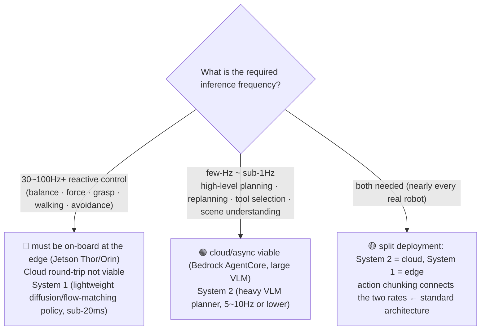
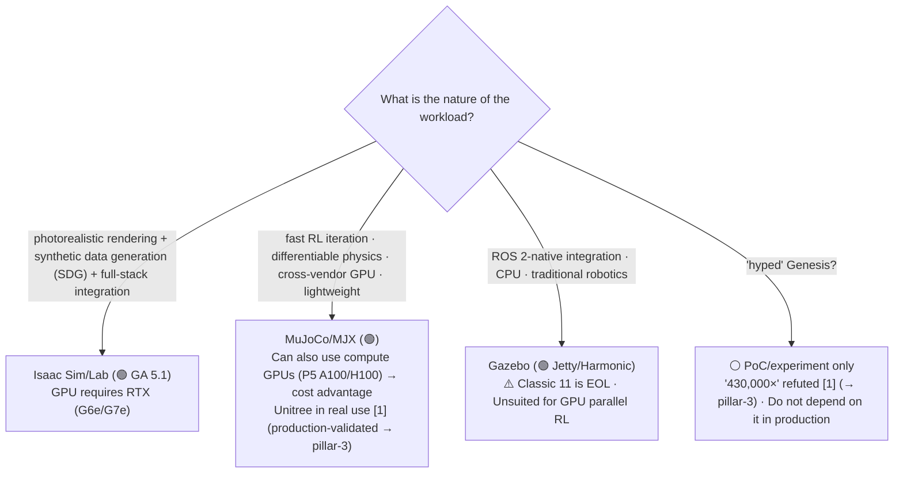
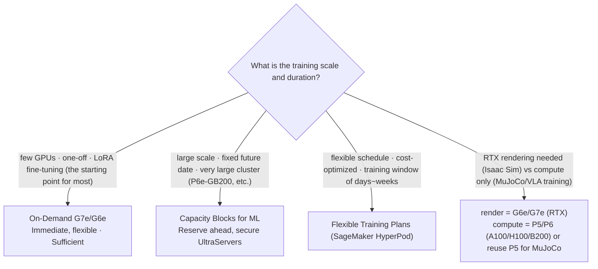
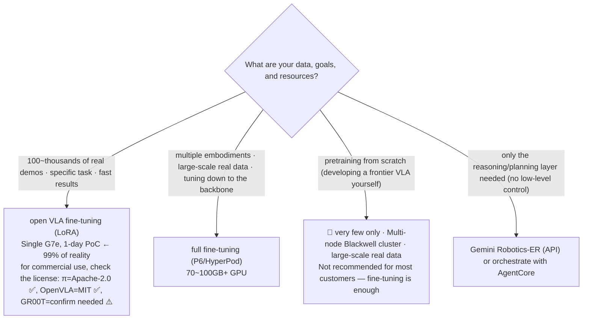

# Decisions — Cross-cutting Decision Trees

_Last updated: 2026-07 · owner: Youngjin · volatility: medium_
[← back to index](index.md)

> **L0 TL;DR**: The 4 crossroads customers hit most often, as **decision tables/trees** instead of prose. Each decision cuts across pillars. In a hurry, just read the relevant table and set your direction.

Contents: [1) Cloud vs Edge](#1-cloud-training-vs-edge-inference-boundary) · [2) NVIDIA vs open source](#2-nvidia-full-stack-vs-open-source) · [3) Securing GPUs](#3-securing-gpus) · [4) Build vs Buy](#4-build-vs-buy-foundation-models)

---

## 1) Cloud training vs Edge inference boundary

**Key question: "Can I put this inference in the cloud, or must it be on the edge?"**

The most important discriminator is the **control frequency**[^ctrlfreq].

| Aspect | System 2[^sys] (planning) | System 1 (control) |
|---|---|---|
| Frequency | ≤ 5~10Hz | 50~200Hz |
| Latency tolerance | yes (async) | none (sub-20ms) |
| Location | **cloud** (AgentCore) or on-board | **edge on-board** (Jetson) |
| Model | large VLM/LLM | lightweight diffusion/flow-matching[^flow] |
| AWS | Bedrock AgentCore, EC2 | IoT Greengrass V2, SageMaker Neo, ONNX/TensorRT |

> **Ruling principle**: "If the loop involves real-time safety/reaction, edge; if there's time to think, cloud." action chunking[^chunk] is the bridge.
> Basis: [pillar-4 edge](pillar-4.md), [pillar-2 System1/System2](pillar-2.md), [pillar-5](pillar-5.md).

---

## 2) NVIDIA full stack vs open source

**Key question: "Should I bet everything on Isaac, or go open source?"**

| Criterion | Isaac Sim/Lab | MuJoCo/MJX | Gazebo |
|---|---|---|---|
| Maturity | 🟢 GA 5.1 | 🟢 GA (Warp is Alpha) | 🟢 GA (Classic EOL) |
| GPU | **RTX required** (A100/H100 ✗) | compute GPU OK (P5 ✓) | CPU-centric |
| Render/SDG[^sdg] | best | limited | limited |
| Differentiable[^diffsim] | △ | ✓ (JAX) | ✗ |
| ROS integration | possible | secondary | **native** |
| License | Apache (source) + AI Enterprise (redistribution/SaaS) | Apache | Apache |
| AWS | G6e/G7e + AMI + Batch | EC2 (incl. P5) + Batch | EC2 + Batch |

> **Ruling principle**: choose by workload. **"AWS runs all three well"** — a neutral position for customers worried about NVIDIA lock-in. With MuJoCo, there's a cost advantage from reusing compute GPUs.
> Basis: [pillar-3](pillar-3.md).

---

## 3) Securing GPUs

**Key question: "How do I secure GPUs? On-Demand isn't available."**

| Strategy | When | AWS |
|---|---|---|
| On-Demand | few · one-off · exploration | EC2 G7e/G6e/P6 |
| Capacity Blocks for ML | large scale · fixed date · UltraServer | P6e-GB200, reserved |
| Flexible Training Plans | flexible schedule · cost-optimized | SageMaker HyperPod |
| Trainium | reduce LLM training cost | Trn2/Trn3 ⚠️ **no public case for VLA[^vla] [4]** (→ pillar-2) |

> **Ruling principle**: start with On-Demand G7e. If unavailable or large-scale, Capacity Blocks / Flexible Training Plans. **Trainium is safe for LLMs but has no validated case for VLA/robotics** — state the risk when proposing.
> Basis: [pillar-2 training stack](pillar-2.md), [pillar-3](pillar-3.md).

---

## 4) Build vs Buy (foundation models)

**Key question: "Should I fine-tune[^ft] a foundation model, or train my own?"**

| Option | Data | GPU | When |
|---|---|---|---|
| LoRA[^lora] fine-tuning | 100~thousands of demos | single 24~40GB | **default starting point** |
| Full fine-tuning | large-scale real data | 70~100GB+ / multi-node | multiple embodiments[^embodiment] |
| Pretraining (Build)[^pretrain] | ultra-large scale | Blackwell cluster | a few frontier players |
| Reasoning-layer Buy | — | — | control from open models, planning from an API |

> **Ruling principle**: **almost always fine-tuning (Buy + adapt) is the answer.** Pretraining from scratch is for a tiny few. For commercial use, the license is the first gate (mind GR00T non-commercial). "A manipulation policy from simulation alone" is a trap — real data is essential ([pillar-4](pillar-4.md)).
> Basis: [pillar-2](pillar-2.md), [pillar-1 data · licenses](pillar-1.md), [pillar-4](pillar-4.md).

---

## Appendix — Region / data-residency quick check

_(The table below is volatile — 2026-07, based on direct check of the official AWS region table `[1]`. Re-confirm the latest region table before citing.)_

| Service | Seoul (ap-northeast-2) | Note |
|---|---|---|
| Bedrock AgentCore (core + Policy + Evaluations) | ✅ | Agent Registry · Payments are ✗ (Tokyo has Registry ✅) — per 2026-07 region table |
| EC2 G7e / G6e / P6 | ✅ (confirm per region) | Use Capacity Blocks |
| SageMaker HyperPod | ✅ | Flexible Training Plans expanding by region |
| IoT Greengrass V2 | ✅ | V1 is EOL 2026-06 |

> Customers worried about data residency: first confirm **AgentCore Seoul GA** to reassure them (correct the outdated "not available in Seoul" info). → [pillar-5](pillar-5.md).

---
_owner: Youngjin · updated: 2026-07 · volatility: medium (tree principles are low, instance/region details are high)_

<!-- 용어 각주 -->
[^ctrlfreq]: **control frequency** — how many times per second a robot updates its control commands (Hz). Reactive loops like balance and grasping need 30~100Hz or more, which is physically impossible over a cloud round-trip — the first discriminator for where inference is deployed.
[^sys]: **System 2 / System 1** — the cognitive-science "slow thinking / fast reaction" distinction applied to robot architecture. System 2 is a slow large model that plans (5~10Hz); System 1 is a small policy that runs real-time control (50~200Hz). This becomes the criterion for whether inference goes to the cloud or the edge.
[^flow]: **flow-matching / diffusion action head** — an output module in the diffusion/flow family that generates a robot's continuous actions by gradually refining them from noise. It can express smooth, multi-modal action distributions, making it the standard action head of modern VLAs.
[^chunk]: **action chunking** — predicting a chunk of several future action steps at once instead of one action per step. Reduces the number of inference calls, making it easier to meet real-time control frequencies.
[^sdg]: **Synthetic Data Generation (SDG)** — a technique that uses a simulator to auto-generate training images and annotations (labels). Its biggest advantage: labeling cost converges to zero. 🎥 [Isaac Sim Replicator SDG tutorial](https://www.youtube.com/watch?v=HHzNIh72B_Y)
[^diffsim]: **differentiable physics** — a physics engine whose entire simulation computation is differentiable, so gradients can be backpropagated from outputs to inputs. Policies and parameters can be optimized directly with gradient descent (MJX is the representative example).
[^vla]: **VLA (Vision-Language-Action)** — a foundation model that takes camera images (Vision) and natural-language instructions (Language) as input and directly outputs robot actions (Action). Say "pick up the cup" and it generates the joint motions. 🎥 [NVIDIA Isaac GR00T N1 introduction](https://www.youtube.com/watch?v=m1CH-mgpdYg)
[^ft]: **fine-tuning** — additionally training a model pretrained on large-scale data with a small amount of data from your own task/robot. Saves tens to hundreds of times the data and GPU compared to training from scratch.
[^lora]: **LoRA (Low-Rank Adaptation)** — a lightweight fine-tuning technique that freezes the original weights and trains only small additional low-rank matrices. GPU memory demand is a fraction of full fine-tuning, so a single 24GB-class GPU is enough.
[^embodiment]: **Embodiment** — a robot's physical form, degrees of freedom, and sensor configuration. Even with the same model, a robot arm and a humanoid have different embodiments, so data and policies cannot be transplanted as-is.
[^pretrain]: **pre-training** — training a model from scratch on large-scale general-purpose data to build its base capabilities; it is then adapted to a specific task by fine-tuning on a small amount of data. Frontier VLA pre-training is the domain of a tiny handful of organizations.
