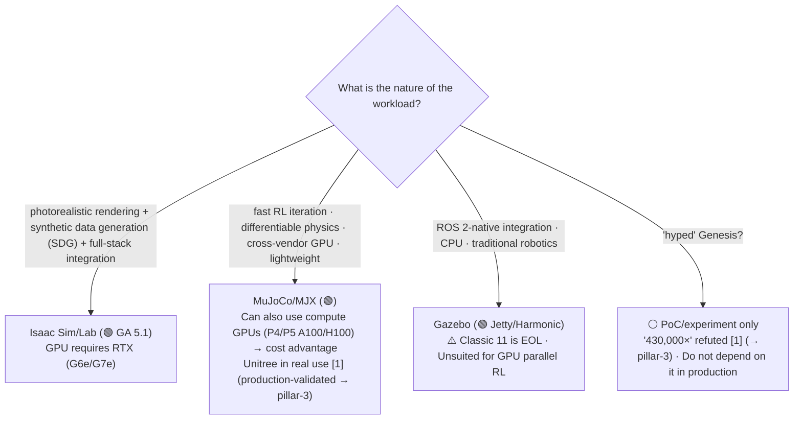
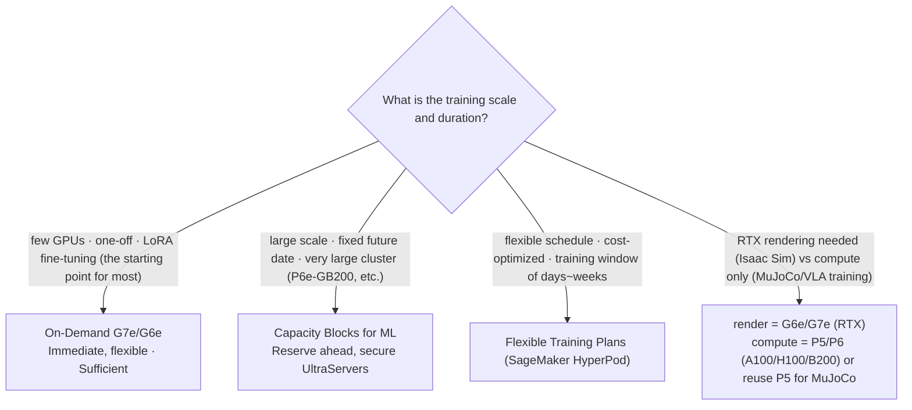

# Decisions — Cross-cutting Decision Trees

_Last updated: 2026-09 · owner: Youngjin · volatility: medium_
[← back to index](index.md)

> **L0 TL;DR**: The 4 crossroads customers hit most often, as **decision tables/trees** instead of prose. Each decision cuts across pillars. In a hurry, just read the relevant table and set your direction.

Contents: [1) Cloud vs Edge](#1-cloud-training-vs-edge-inference-boundary) · [2) NVIDIA vs open source](#2-nvidia-full-stack-vs-open-source) · [3) Securing GPUs](#3-securing-gpus) · [4) Build vs Buy](#4-build-vs-buy-foundation-models)

---

> **Review scope**: the page edit date does not revalidate every technical item. See [Evidence](evidence.md) for core corrections, check dates, and reproduction/human review status; legacy item dates still apply.

## 1) Cloud training vs Edge inference boundary

**Key question**: what are the observation-to-action deadline, worst-case delay/jitter, and outage-critical functions?

| Function | Placement decision | Validate |
|---|---|---|
| Business planning/analysis | Cloud if latency and data-processing requirements allow | Processing countries, timeout, cancellation, tool permissions |
| Observation-based skills | Measure model/device deadlines to choose site/cloud | Fresh-observation response rate, delay distribution, outage behavior |
| Low-level control | Local controller meeting device deadlines | Control interval, worst jitter, model failure |
| Independent safety | Design/validate independently of LLM/network | Risk assessment, stops/limits, site owner |

System 1/2 labels do not decide placement. Both Helix systems are onboard; chunk output count is not feedback frequency ([evidence](evidence.md#action-chunking)). Define command contracts and failure tests in [Operations](operations.md).

---

## 2) NVIDIA full stack vs open source

**Key question: "Should I bet everything on Isaac, or go open source?"**

```mermaid
graph TD
    Q{What is the nature of the workload?}
    Q -- "photorealistic rendering + synthetic data generation (SDG) + full-stack integration" --> ISAAC["Isaac Sim/Lab (🟢 GA 5.1)<br>GPU requires RTX (G6e/G7e)"]
    Q -- "fast RL iteration · differentiable physics · cross-vendor GPU · lightweight" --> MUJOCO["MuJoCo/MJX (🟢)<br>Can also use compute GPUs (P4/P5 A100/H100) → cost advantage<br>Unitree in real use [1] (production-validated → pillar-3)"]
    Q -- "ROS 2-native integration · CPU · traditional robotics" --> GAZEBO["Gazebo (🟢 Jetty/Harmonic)<br>⚠️ Classic 11 is EOL · Unsuited for GPU parallel RL"]
    Q -- "'hyped' Genesis?" --> GENESIS["⚪ PoC/experiment only<br>'430,000×' refuted [1] (→ pillar-3) · Do not depend on it in production"]
```

| Criterion | Isaac Sim/Lab | MuJoCo/MJX | Gazebo |
|---|---|---|---|
| Maturity | 🟢 GA 5.1 | 🟢 GA (Warp is Alpha) | 🟢 GA (Classic EOL) |
| GPU | **RTX required** (A100/H100 ✗) | compute GPU OK (P5 ✓) | CPU-centric |
| Render/SDG[^sdg] | best | limited | limited |
| Differentiable[^diffsim] | △ | ✓ (JAX) | ✗ |
| ROS integration | possible | secondary | **native** |
| License | Apache (source) + AI Enterprise (redistribution/SaaS) | Apache | Apache |
| AWS | G6e/G7e + AMI + Batch | EC2 (incl. P5) + Batch | EC2 + Batch |

> **Ruling principle**: choose by workload. **"AWS runs all three well"** — a neutral position for customers worried about NVIDIA lock-in. With MuJoCo, there's a cost advantage from reusing compute GPUs.
> Basis: [pillar-3](pillar-3.md).

---

## 3) Securing GPUs

**Key question: "How do I secure GPUs? On-Demand isn't available."**

```mermaid
graph TD
    Q{What is the training scale and duration?}
    Q -- "few GPUs · one-off · LoRA fine-tuning (the starting point for most)" --> OD["On-Demand G7e/G6e<br>Immediate, flexible · Sufficient"]
    Q -- "large scale · fixed future date · very large cluster (P6e-GB200, etc.)" --> CB["Capacity Blocks for ML<br>Reserve ahead, secure UltraServers"]
    Q -- "flexible schedule · cost-optimized · training window of days~weeks" --> FTP["Flexible Training Plans (SageMaker HyperPod)"]
    Q -- "RTX rendering needed (Isaac Sim) vs compute only (MuJoCo/VLA training)" --> RC["render = G6e/G7e (RTX)<br>compute = P5/P6 (A100/H100/B200) or reuse P5 for MuJoCo"]
```

| Strategy | When | AWS |
|---|---|---|
| On-Demand | few · one-off · exploration | EC2 G7e/G6e/P6 |
| Capacity Blocks for ML | large scale · fixed date · UltraServer | P6e-GB200, reserved |
| Flexible Training Plans | flexible schedule · cost-optimized | SageMaker HyperPod |
| Trainium | reduce LLM training cost | Trn2/Trn3 ⚠️ **no public case for VLA[^vla] [4]** (→ pillar-2) |

> **Ruling principle**: start with On-Demand G7e. If unavailable or large-scale, Capacity Blocks / Flexible Training Plans. **Trainium is safe for LLMs but has no validated case for VLA/robotics** — state the risk when proposing.
> Basis: [pillar-2 training stack](pillar-2.md), [pillar-3](pillar-3.md).

---

## 4) Build vs Buy (foundation models)

**Key question**: should this task use the existing approach, a purchase, integration, or model adaptation?

| Choice | Fit | Evidence required first |
|---|---|---|
| Improve existing automation/control | Structured environment and understood failure cause | Baseline time, quality, cost comparison |
| Buy a robot/solution | Product meets task, safety, and support needs | Site acceptance test, maintenance, total cost |
| SI/partner integration | Heterogeneous equipment/process integration is central | Similar site outcomes, responsibility/recovery scope |
| Adapt open models | Variation needs learning and usable data exists | Code/weight/base-model/data rights, independent evaluation |
| Pretrain a model | Unmet model requirements and research/data capacity | Advantage over alternatives, full development/operating cost |

Compare LoRA, partial, and full training only after selecting adaptation ([P2](pillar-2.md)). **Do not start with “almost always fine-tune” or “one-day PoC.”** Use [fit](start.md#fit) and [total cost](start.md#roi), then choose an [execution path](execution.md).

Record version-specific commercial terms, including [OpenVLA code versus weights](evidence.md#openvla-license). Inference APIs also leave separate control, processing, and recovery responsibilities.

---

## Appendix — Region / data-residency quick check

Check service Region, exact instance type, quota, and purchase option immediately before execution. The former blanket Seoul-availability check table has been removed.

**Data processing**: record storage, model inference, Memory/Evaluations, external tools, and log routes separately. Seoul AgentCore availability does not guarantee Korea-only processing ([official evidence](evidence.md#agentcore-residency)).

**Capacity/cost**: On-Demand does not guarantee capacity. Check multiple compatible instance candidates and use Spot when checkpoint/resume is validated. Compare Capacity Blocks/Training Plans after checking instance, Region, and schedule eligibility.

---
_owner: Youngjin · updated: 2026-09 · volatility: medium (tree principles are low, instance/region details are high)_

<!-- 용어 각주 -->
[^sdg]: **Synthetic Data Generation (SDG)** — a technique that uses a simulator to auto-generate training images and annotations (labels). Its biggest advantage: labeling cost converges to zero. 🎥 [Isaac Sim Replicator SDG tutorial](https://www.youtube.com/watch?v=HHzNIh72B_Y)
[^diffsim]: **differentiable physics** — a physics engine whose entire simulation computation is differentiable, so gradients can be backpropagated from outputs to inputs. Policies and parameters can be optimized directly with gradient descent (MJX is the representative example).
[^vla]: **VLA (Vision-Language-Action)** — a foundation model that takes camera images (Vision) and natural-language instructions (Language) as input and directly outputs robot actions (Action). Say "pick up the cup" and it generates the joint motions. 🎥 [NVIDIA Isaac GR00T N1 introduction](https://www.youtube.com/watch?v=m1CH-mgpdYg)
