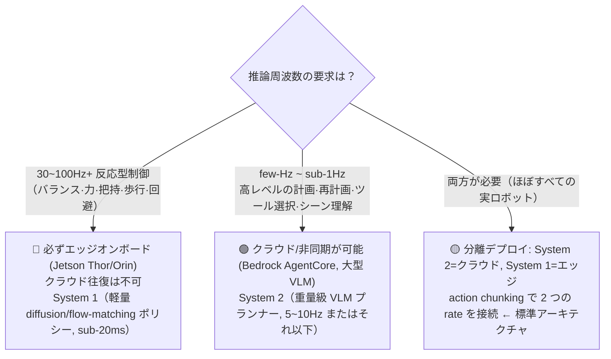
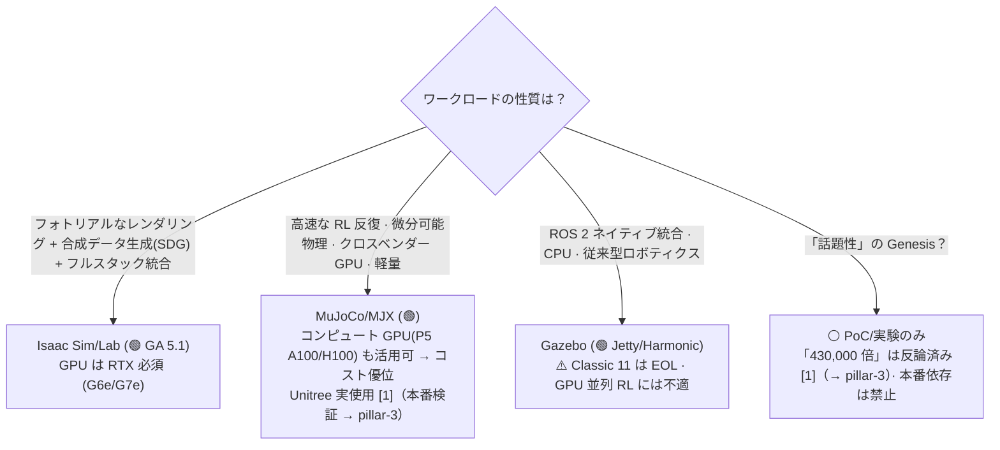
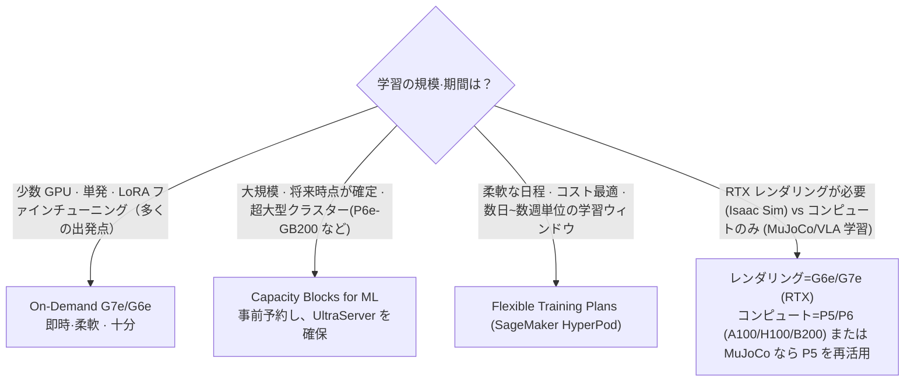
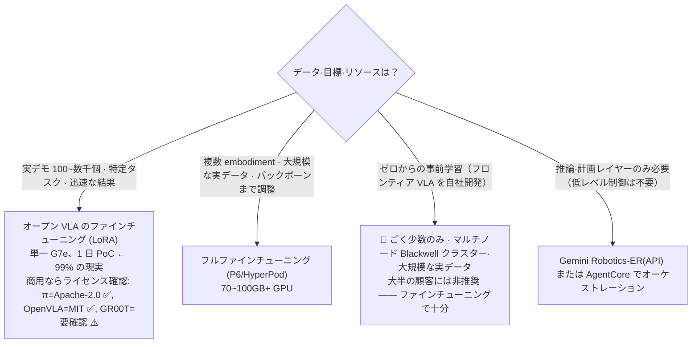

# Decisions — 横断的な意思決定ツリー

_最終更新: 2026-07 · owner: Youngjin · volatility: 中_
[← index へ](index.md)

> **L0 TL;DR**: 顧客が頻繁に直面する 4 つの分岐点を、散文ではなく**決定表/ツリー**で示します。各決定はピラーを横断します。急ぐ場合は該当する表だけを見て方向を定めてください。

目次: [1) Cloud vs Edge](#1-cloud-training-vs-edge-inference-境界) · [2) NVIDIA vs オープンソース](#2-nvidia-フルスタック-vs-オープンソース) · [3) GPU 確保戦略](#3-gpu-確保戦略) · [4) Build vs Buy](#4-build-vs-buy基盤モデル)

---

## 1) Cloud training vs Edge inference 境界

**核心的な問い: 「この推論はクラウドに置けるのか、それともエッジに置く必要があるのか？」**

最も重要な判別要素は**制御周波数**[^ctrlfreq]です。

| 区分 | System 2[^sys]（計画） | System 1（制御） |
|---|---|---|
| 周波数 | 5~10Hz 以下 | 50~200Hz |
| 遅延許容 | あり（非同期） | なし（sub-20ms） |
| 位置 | **クラウド** (AgentCore) またはオンボード | **エッジオンボード** (Jetson) |
| モデル | 大型 VLM/LLM | 軽量 diffusion/flow-matching[^flow] |
| AWS | Bedrock AgentCore, EC2 | IoT Greengrass V2, SageMaker Neo, ONNX/TensorRT |

> **判定原則**: 「リアルタイムの安全·反応が絡むループならエッジ、考える時間があるならクラウド。」action chunking[^chunk] が橋渡しです。
> 根拠: [pillar-4 エッジ](pillar-4.md)、[pillar-2 System1/System2](pillar-2.md)、[pillar-5](pillar-5.md)。

---

## 2) NVIDIA フルスタック vs オープンソース

**核心的な問い: 「Isaac に全賭けするか、それともオープンソースで行くか？」**

| 基準 | Isaac Sim/Lab | MuJoCo/MJX | Gazebo |
|---|---|---|---|
| 成熟度 | 🟢 GA 5.1 | 🟢 GA（Warp は Alpha） | 🟢 GA（Classic EOL） |
| GPU | **RTX 必須**（A100/H100 ✗） | コンピュート GPU 可能（P5 ✓） | CPU 中心 |
| レンダリング/SDG[^sdg] | 最高 | 限定的 | 限定的 |
| 微分可能[^diffsim] | △ | ✓ (JAX) | ✗ |
| ROS 統合 | 可能 | 補助 | **ネイティブ** |
| ライセンス | Apache（ソース）+AI Enterprise（再配布/SaaS） | Apache | Apache |
| AWS | G6e/G7e + AMI + Batch | EC2（P5 含む）+ Batch | EC2 + Batch |

> **判定原則**: ワークロードで選べばよいです。**「AWS は 3 つとも問題なく動かせる」** —— NVIDIA 依存を懸念する顧客に対する中立ポジション。MuJoCo ならコンピュート GPU を再活用できるコスト優位があります。
> 根拠: [pillar-3](pillar-3.md)。

---

## 3) GPU 確保戦略

**核心的な問い: 「GPU をどう確保するか？On-Demand が取れない。」**

| 戦略 | いつ | AWS |
|---|---|---|
| On-Demand | 少数·単発·探索 | EC2 G7e/G6e/P6 |
| Capacity Blocks for ML | 大規模·時点確定·UltraServer | P6e-GB200、予約 |
| Flexible Training Plans | 柔軟な日程·コスト最適 | SageMaker HyperPod |
| Trainium | LLM 学習コスト削減 | Trn2/Trn3 ⚠️ **VLA[^vla] は公開事例なし [4]**（→ pillar-2） |

> **判定原則**: 開始は On-Demand G7e。取れないか大規模なら Capacity Blocks/Flexible Training Plans。**Trainium は LLM には安全だが、VLA/ロボティクスは検証事例なし** —— 提案時にはリスクを明示します。
> 根拠: [pillar-2 学習スタック](pillar-2.md)、[pillar-3](pillar-3.md)。

---

## 4) Build vs Buy（基盤モデル）

**核心的な問い: 「基盤モデルをファインチューニング[^ft]するか、それとも自前で学習するか？」**

| オプション | データ | GPU | いつ |
|---|---|---|---|
| LoRA[^lora] ファインチューニング | 100~数千デモ | 単一 24~40GB | **デフォルトの出発点** |
| フルファインチューニング | 大規模な実データ | 70~100GB+ / マルチノード | 複数 embodiment[^embodiment] |
| 事前学習(Build)[^pretrain] | 超大規模 | Blackwell クラスター | ごく少数のフロンティア |
| 推論レイヤーの Buy | — | — | 制御はオープンモデル、計画は API |

> **判定原則**: **ほぼ常にファインチューニング(Buy+adapt) が答えです。** ゼロからの事前学習はごく少数。商用ではライセンスが最初のゲート（GR00T の非商用に注意）。「シミュレーションだけで操作ポリシー」は落とし穴 —— 実データが必須（[pillar-4](pillar-4.md)）。
> 根拠: [pillar-2](pillar-2.md)、[pillar-1 データ·ライセンス](pillar-1.md)、[pillar-4](pillar-4.md)。

---

## 付録 — リージョン/データレジデンシーの迅速判定

_（下表は揮発性が高い —— 2026-07、AWS 公式リージョン表 `[1]` で直接確認した基準。引用前に最新のリージョン表を再確認）_

| サービス | ソウル(ap-northeast-2) | 備考 |
|---|---|---|
| Bedrock AgentCore（コア+Policy+Evaluations） | ✅ | Agent Registry·Payments は ✗（東京は Registry ✅）—— 2026-07 リージョン表基準 |
| EC2 G7e / G6e / P6 | ✅（リージョン別に確認） | Capacity Blocks を活用 |
| SageMaker HyperPod | ✅ | Flexible Training Plans はリージョン拡張中 |
| IoT Greengrass V2 | ✅ | V1 は 2026-06 EOL |

> データレジデンシーを懸念する顧客: まず **AgentCore ソウル GA** を確認させて安心させます（古い「ソウル未対応」情報を訂正）。→ [pillar-5](pillar-5.md)。

---
_owner: Youngjin · updated: 2026-07 · volatility: 中（ツリーの原理は低、インスタンス/リージョンの詳細は高）_

<!-- 용어 각주 -->
[^ctrlfreq]: **制御周波数（control frequency）** — ロボットが 1 秒間に何回制御コマンドを更新するか（Hz）です。バランス・把持のような反応ループには 30~100Hz 以上が必要で、往復遅延のあるクラウドでは物理的に不可能です — 推論のデプロイ位置を分ける最初の判別因子です。
[^sys]: **System 2 / System 1** — 認知科学の「遅い思考 / 速い反応」の区分をロボットアーキテクチャに適用した構造です。System 2 は遅い大型モデルが計画を（5~10Hz）、System 1 は小さなポリシーがリアルタイム制御を（50~200Hz）担います。推論をクラウドに置くかエッジに置くかを分ける基準になります。
[^flow]: **flow-matching / diffusion action head** — ロボットの連続動作をノイズから徐々に洗練して生成する拡散（diffusion）・フロー系の出力モジュールです。滑らかでマルチモーダル（multi-modal）な動作分布を表現でき、最新 VLA の標準アクションヘッドです。
[^chunk]: **action chunking** — 毎ステップ動作 1 個ではなく、将来の動作を複数ステップ（チャンク）まとめて一度に予測する手法です。推論回数を減らし、リアルタイム制御の周波数を満たしやすくします。
[^sdg]: **合成データ生成（SDG, Synthetic Data Generation）** — シミュレーターで学習用画像とアノテーション（ラベル）を自動生成する技法です。ラベリングコストがゼロに収束するのが最大の利点です。🎥 [Isaac Sim Replicator SDG チュートリアル](https://www.youtube.com/watch?v=HHzNIh72B_Y)
[^diffsim]: **微分可能物理（differentiable physics）** — シミュレーション計算全体が微分可能で、結果から入力へ勾配を逆伝播できる物理エンジンです。ポリシー・パラメータを勾配降下法で直接最適化できます（代表は MJX）。
[^vla]: **VLA (Vision-Language-Action)** — カメラ映像（Vision）と自然言語の指示（Language）を入力に、ロボットの動作（Action）を直接出力する基盤モデルです。「コップを掴んで」と言えば関節の動きを生成する、という具合です。🎥 [NVIDIA Isaac GR00T N1 紹介](https://www.youtube.com/watch?v=m1CH-mgpdYg)
[^ft]: **ファインチューニング（fine-tuning）** — 大規模データで事前学習されたモデルを、自分のタスク・ロボットの少量データで追加学習させることです。ゼロから学習するよりデータ・GPU が数十~数百倍節約できます。
[^lora]: **LoRA (Low-Rank Adaptation)** — 元の重みは凍結したまま、小さな低ランク（low-rank）行列だけを追加で学習する軽量ファインチューニング手法です。GPU メモリ要求がフルファインチューニングの数分の 1 のため、24GB 級 GPU 1 枚でも可能です。
[^embodiment]: **embodiment（エンボディメント）** — ロボットの物理的形態・自由度・センサー構成のことです。同じモデルでもロボットアームとヒューマノイドでは embodiment が異なり、データ・ポリシーをそのまま移植できません。
[^pretrain]: **事前学習（pre-training）** — 大規模な汎用データでモデルをゼロから学習させ、基礎能力を作る段階です。その後、少量データのファインチューニングで特定タスクに合わせます。フロンティア VLA の事前学習はごく少数の組織の領域です。
