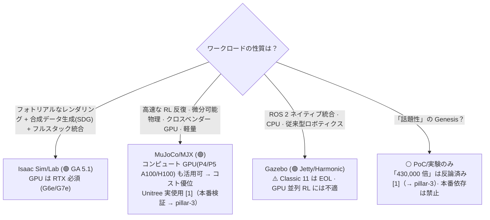
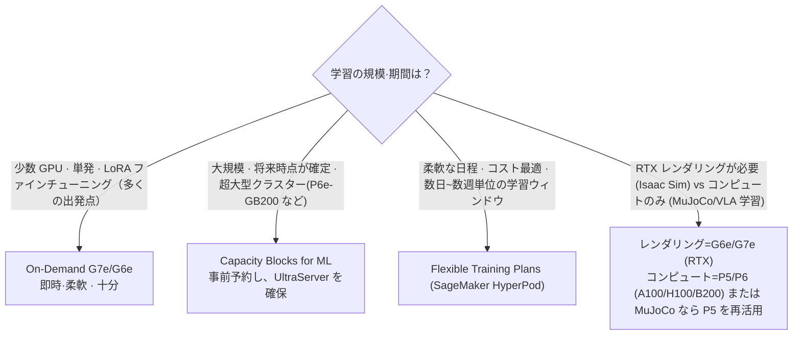

# Decisions — 横断的な意思決定ツリー

_最終更新: 2026-09 · owner: Youngjin · volatility: 中_
[← index へ](index.md)

> **L0 TL;DR**: 顧客が頻繁に直面する 4 つの分岐点を、散文ではなく**決定表/ツリー**で示します。各決定はピラーを横断します。急ぐ場合は該当する表だけを見て方向を定めてください。

目次: [1) Cloud vs Edge](#1-cloud-training-vs-edge-inference-境界) · [2) NVIDIA vs オープンソース](#2-nvidia-フルスタック-vs-オープンソース) · [3) GPU 確保戦略](#3-gpu-確保戦略) · [4) Build vs Buy](#4-build-vs-buy基盤モデル)

---

> **確認範囲**：ページ更新日は全項目の再確認日ではありません。主要訂正の日付・再現/人の確認状態は[根拠](evidence.md)を参照し、既存項目の確認日は従来どおり適用します。

## 1) Cloud training vs Edge inference 境界

**中心となる質問**：観測→動作の期限、最悪遅延・ジッター、通信断で必要な機能は何ですか？

| 機能 | 配置判断 | 検証項目 |
|---|---|---|
| 業務計画・分析 | 遅延・処理条件を満たす場合クラウド可 | 処理国、timeout、取消、ツール権限 |
| 観測に基づくスキル | モデル・機器の期限を測って現場/クラウド判断 | 新観測への反応頻度、遅延分布、切断時動作 |
| 低レベル制御 | 機器期限を満たすローカル制御器 | 制御周期、最悪ジッター、モデル失敗 |
| 独立安全 | LLM・ネットワークと独立して設計検証 | リスク評価、停止・制限、現場責任者 |

System 1/2という名称だけで配置しません。Helixは両方オンボードであり、chunk出力数はフィードバック頻度ではありません（[根拠](evidence.md#action-chunking)）。[運用](operations.md)で命令契約と障害試験を作成します。

---

## 2) NVIDIA フルスタック vs オープンソース

**核心的な問い: 「Isaac に全賭けするか、それともオープンソースで行くか？」**

```mermaid
graph TD
    Q{ワークロードの性質は？}
    Q -- "フォトリアルなレンダリング + 合成データ生成(SDG) + フルスタック統合" --> ISAAC["Isaac Sim/Lab (🟢 GA 5.1)<br>GPU は RTX 必須 (G6e/G7e)"]
    Q -- "高速な RL 反復 · 微分可能物理 · クロスベンダー GPU · 軽量" --> MUJOCO["MuJoCo/MJX (🟢)<br>コンピュート GPU(P4/P5 A100/H100) も活用可 → コスト優位<br>Unitree 実使用 [1]（本番検証 → pillar-3）"]
    Q -- "ROS 2 ネイティブ統合 · CPU · 従来型ロボティクス" --> GAZEBO["Gazebo (🟢 Jetty/Harmonic)<br>⚠️ Classic 11 は EOL · GPU 並列 RL には不適"]
    Q -- "「話題性」の Genesis？" --> GENESIS["⚪ PoC/実験のみ<br>「430,000 倍」は反論済み [1]（→ pillar-3）· 本番依存は禁止"]
```

| 基準 | Isaac Sim/Lab | MuJoCo/MJX | Gazebo |
|---|---|---|---|
| 成熟度 | 🟢 GA 5.1 | 🟢 GA（Warp は Alpha） | 🟢 GA（Classic EOL） |
| GPU | **RTX 必須**（A100/H100 ✗） | コンピュート GPU 可能（P5 ✓） | CPU 中心 |
| レンダリング/SDG[^sdg] | 最高 | 限定的 | 限定的 |
| 微分可能[^diffsim] | △ | ✓ (JAX) | ✗ |
| ROS 統合 | 可能 | 補助 | **ネイティブ** |
| ライセンス | Apache（ソース）+AI Enterprise（再配布/SaaS） | Apache | Apache |
| AWS | G6e/G7e + AMI + Batch | EC2（P5 含む）+ Batch | EC2 + Batch |

> **判定原則**: ワークロードで選べばよいです。**「AWS は 3 つとも問題なく動かせる」** —— NVIDIA 依存を懸念する顧客に対する中立ポジション。MuJoCo ならコンピュート GPU を再活用できるコスト優位があります。
> 根拠: [pillar-3](pillar-3.md)。

---

## 3) GPU 確保戦略

**核心的な問い: 「GPU をどう確保するか？On-Demand が取れない。」**

```mermaid
graph TD
    Q{学習の規模·期間は？}
    Q -- "少数 GPU · 単発 · LoRA ファインチューニング（多くの出発点）" --> OD["On-Demand G7e/G6e<br>即時·柔軟 · 十分"]
    Q -- "大規模 · 将来時点が確定 · 超大型クラスター(P6e-GB200 など)" --> CB["Capacity Blocks for ML<br>事前予約し、UltraServer を確保"]
    Q -- "柔軟な日程 · コスト最適 · 数日~数週単位の学習ウィンドウ" --> FTP["Flexible Training Plans (SageMaker HyperPod)"]
    Q -- "RTX レンダリングが必要 (Isaac Sim) vs コンピュートのみ (MuJoCo/VLA 学習)" --> RC["レンダリング=G6e/G7e (RTX)<br>コンピュート=P5/P6 (A100/H100/B200) または MuJoCo なら P5 を再活用"]
```

| 戦略 | いつ | AWS |
|---|---|---|
| On-Demand | 少数·単発·探索 | EC2 G7e/G6e/P6 |
| Capacity Blocks for ML | 大規模·時点確定·UltraServer | P6e-GB200、予約 |
| Flexible Training Plans | 柔軟な日程·コスト最適 | SageMaker HyperPod |
| Trainium | LLM 学習コスト削減 | Trn2/Trn3 ⚠️ **VLA[^vla] は公開事例なし [4]**（→ pillar-2） |

> **判定原則**: 開始は On-Demand G7e。取れないか大規模なら Capacity Blocks/Flexible Training Plans。**Trainium は LLM には安全だが、VLA/ロボティクスは検証事例なし** —— 提案時にはリスクを明示します。
> 根拠: [pillar-2 学習スタック](pillar-2.md)、[pillar-3](pillar-3.md)。

---

## 4) Build vs Buy（基盤モデル）

**中心となる質問**：既存方式・購入・統合・モデル適応のどれが業務を効果的に解決しますか？

| 選択 | 適合条件 | 先に求める証拠 |
|---|---|---|
| 自動化・制御改善 | 構造化環境で問題原因が明確 | 基準値との時間・品質・費用比較 |
| ロボット・製品購入 | 業務・安全・支援要件を製品が満たす | 現場受入試験、保守、総費用 |
| SI・パートナー統合 | 多機種・工程接続が中心 | 類似実績、責任・復旧範囲 |
| オープンモデル適応 | 学習が必要な変化と利用可能データ | コード・重み・基盤モデル・データ権利、独立評価 |
| 自社事前学習 | 他方式で満たせないモデル要求と研究・データ資源 | 代替に対する改善、開発運用総費用 |

適応を選んでからLoRA・部分・全学習を比較します（[P2](pillar-2.md)）。**「ほぼ必ず学習」「1日PoC」から始めません**。[適合性](start.md#fit)と[総費用](start.md#roi)で判断し[実行手順](execution.md)を選びます。

[OpenVLAのコード・重み](evidence.md#openvla-license)を含め版別の商用条件を記録します。推論APIにも別途制御・データ処理・復旧責任が残ります。

---

## 付録 — リージョン/データレジデンシーの迅速判定

実行直前にリージョン・具体的機種・クォータ・購入方式を確認します。以前のソウル対応一括チェック表は削除しました。

**データ処理**：保存、推論、Memory/Evaluations、外部ツール、ログの経路を別々に記録します。AgentCoreのソウル提供は韓国内処理を保証しません（[公式根拠](evidence.md#agentcore-residency)）。

**容量・費用**：On-Demandでも容量を保証しません。メモリ・描画・CPU要件に合う複数候補を確認し、復旧検証済みジョブでSpotを検討します。Capacity Blocks・Training Plansは機種・地域・期間条件を確認して比較します。

---
_owner: Youngjin · updated: 2026-09 · volatility: 中（ツリーの原理は低、インスタンス/リージョンの詳細は高）_

<!-- 용어 각주 -->
[^sdg]: **合成データ生成（SDG, Synthetic Data Generation）** — シミュレーターで学習用画像とアノテーション（ラベル）を自動生成する技法です。ラベリングコストがゼロに収束するのが最大の利点です。🎥 [Isaac Sim Replicator SDG チュートリアル](https://www.youtube.com/watch?v=HHzNIh72B_Y)
[^diffsim]: **微分可能物理（differentiable physics）** — シミュレーション計算全体が微分可能で、結果から入力へ勾配を逆伝播できる物理エンジンです。ポリシー・パラメータを勾配降下法で直接最適化できます（代表は MJX）。
[^vla]: **VLA (Vision-Language-Action)** — カメラ映像（Vision）と自然言語の指示（Language）を入力に、ロボットの動作（Action）を直接出力する基盤モデルです。「コップを掴んで」と言えば関節の動きを生成する、という具合です。🎥 [NVIDIA Isaac GR00T N1 紹介](https://www.youtube.com/watch?v=m1CH-mgpdYg)
