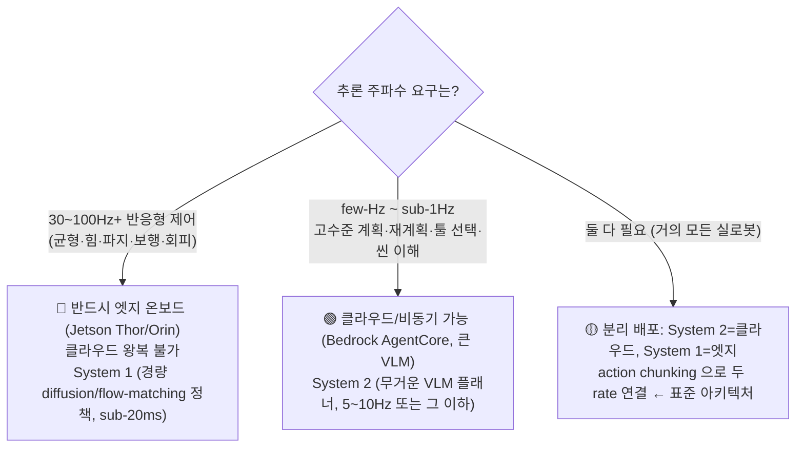
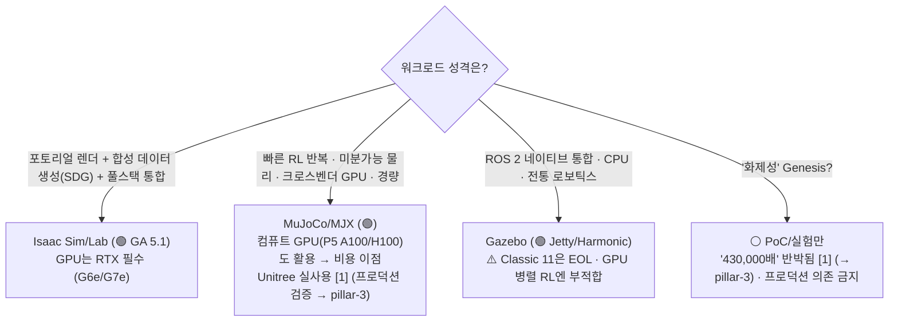
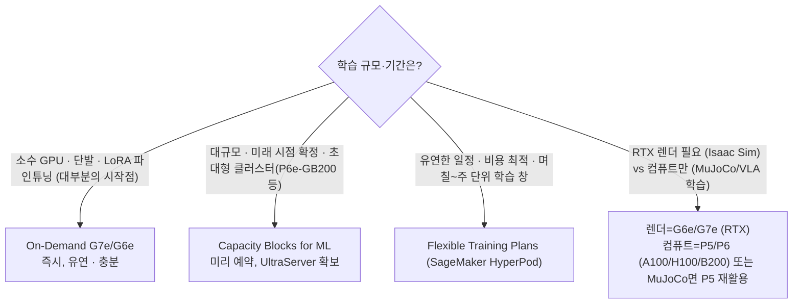
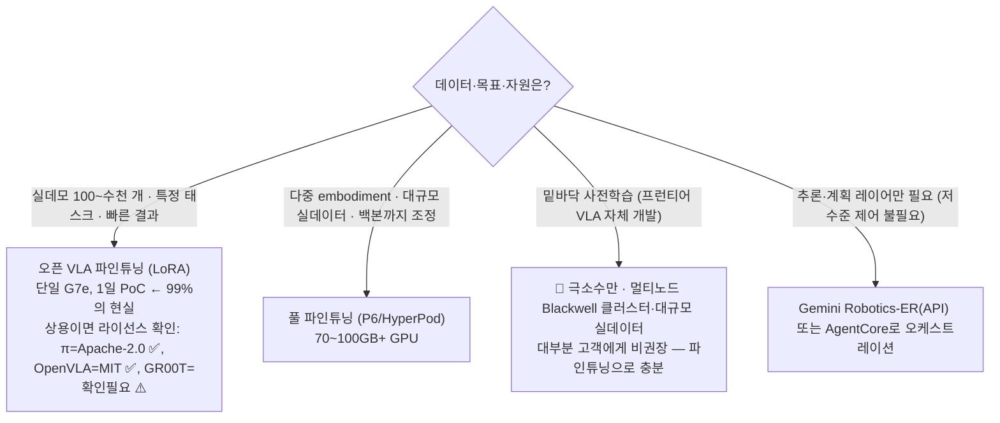

# Decisions — 교차 의사결정 트리

_최종 갱신: 2026-07 · owner: 미정 ⚠️ · volatility: 중간_
[← index로](index.md)

> **L0 TL;DR**: 고객이 자주 부딪히는 4개 갈림길을 산문 대신 **결정 표/트리**로. 각 결정은 필러를 가로지른다. 급하면 해당 표만 보고 방향을 잡으라.

목차: [1) Cloud vs Edge](#1-cloud-training-vs-edge-inference-경계) · [2) NVIDIA vs 오픈소스](#2-nvidia-풀스택-vs-오픈소스) · [3) GPU 확보 전략](#3-gpu-확보-전략) · [4) Build vs Buy](#4-build-vs-buy-파운데이션-모델)

---

## 1) Cloud training vs Edge inference 경계

**핵심 질문: "이 추론을 클라우드에 둘 수 있나, 엣지에 둬야 하나?"**

가장 중요한 판별자는 **제어 주파수**[^ctrlfreq]다.

| 구분 | System 2[^sys] (계획) | System 1 (제어) |
|---|---|---|
| 주파수 | 5~10Hz 이하 | 50~200Hz |
| 지연 허용 | 있음(비동기) | 없음(sub-20ms) |
| 위치 | **클라우드** (AgentCore) 또는 온보드 | **엣지 온보드** (Jetson) |
| 모델 | 큰 VLM/LLM | 경량 diffusion/flow-matching[^flow] |
| AWS | Bedrock AgentCore, EC2 | IoT Greengrass V2, SageMaker Neo, ONNX/TensorRT |

> **판정 원칙**: "실시간 안전·반응이 걸린 루프면 엣지, 생각할 시간이 있으면 클라우드." action chunking[^chunk]이 다리.
> 근거: [pillar-4 엣지](pillar-4.md), [pillar-2 System1/System2](pillar-2.md), [pillar-5](pillar-5.md).

---

## 2) NVIDIA 풀스택 vs 오픈소스

**핵심 질문: "Isaac에 다 걸까, 오픈소스로 갈까?"**

| 기준 | Isaac Sim/Lab | MuJoCo/MJX | Gazebo |
|---|---|---|---|
| 성숙도 | 🟢 GA 5.1 | 🟢 GA (Warp는 Alpha) | 🟢 GA (Classic EOL) |
| GPU | **RTX 필수**(A100/H100 ✗) | 컴퓨트 GPU 가능(P5 ✓) | CPU 중심 |
| 렌더/SDG[^sdg] | 최상 | 제한적 | 제한적 |
| 미분가능[^diffsim] | △ | ✓ (JAX) | ✗ |
| ROS 통합 | 가능 | 보조 | **네이티브** |
| 라이선스 | Apache(소스)+AI Enterprise(재배포/SaaS) | Apache | Apache |
| AWS | G6e/G7e + AMI + Batch | EC2(P5 포함) + Batch | EC2 + Batch |

> **판정 원칙**: 워크로드로 고르면 된다. **"AWS는 셋 다 잘 돌린다"** — NVIDIA 종속 우려 고객에게 중립 포지션. MuJoCo면 컴퓨트 GPU 재활용 비용 이점.
> 근거: [pillar-3](pillar-3.md).

---

## 3) GPU 확보 전략

**핵심 질문: "GPU를 어떻게 확보하나? On-Demand가 안 잡힌다."**

| 전략 | 언제 | AWS |
|---|---|---|
| On-Demand | 소수·단발·탐색 | EC2 G7e/G6e/P6 |
| Capacity Blocks for ML | 대규모·시점 확정·UltraServer | P6e-GB200, 예약 |
| Flexible Training Plans | 유연 일정·비용 최적 | SageMaker HyperPod |
| Trainium | LLM 학습 비용 절감 | Trn2/Trn3 ⚠️ **VLA[^vla]는 공개 사례 없음 [4]** (→ pillar-2) |

> **판정 원칙**: 시작은 On-Demand G7e. 못 잡히거나 대규모면 Capacity Blocks/Flexible Training Plans. **Trainium은 LLM엔 안전하나 VLA/로보틱스는 검증 사례 없음** — 제안 시 리스크 명시.
> 근거: [pillar-2 학습 스택](pillar-2.md), [pillar-3](pillar-3.md).

---

## 4) Build vs Buy (파운데이션 모델)

**핵심 질문: "파운데이션 모델을 파인튜닝[^ft]할까, 자체 학습할까?"**

| 옵션 | 데이터 | GPU | 언제 |
|---|---|---|---|
| LoRA[^lora] 파인튜닝 | 100~수천 데모 | 단일 24~40GB | **기본 시작점** |
| 풀 파인튜닝 | 대규모 실데이터 | 70~100GB+ / 멀티노드 | 다중 embodiment[^embodiment] |
| 사전학습(Build)[^pretrain] | 초대규모 | Blackwell 클러스터 | 극소수 프런티어 |
| 추론 레이어 Buy | — | — | 제어는 오픈모델, 계획은 API |

> **판정 원칙**: **거의 항상 파인튜닝(Buy+adapt)이 답.** 밑바닥 사전학습은 극소수. 상용은 라이선스가 첫 게이트(GR00T 비상업 주의). "시뮬레이션만으로 조작 정책"은 함정 — 실데이터 필수([pillar-4](pillar-4.md)).
> 근거: [pillar-2](pillar-2.md), [pillar-1 데이터·라이선스](pillar-1.md), [pillar-4](pillar-4.md).

---

## 부록 — 리전/데이터 레지던시 빠른 판정

_(아래 표는 휘발성 — 2026-07, AWS 공식 리전 표 `[1]` 직접 확인 기준. 인용 전 최신 리전 표 재확인)_

| 서비스 | 서울(ap-northeast-2) | 비고 |
|---|---|---|
| Bedrock AgentCore (코어+Policy+Evaluations) | ✅ | Agent Registry·Payments는 ✗ (도쿄는 Registry ✅) — 2026-07 리전 표 기준 |
| EC2 G7e / G6e / P6 | ✅(리전별 확인) | Capacity Blocks 활용 |
| SageMaker HyperPod | ✅ | Flexible Training Plans 리전 확장 중 |
| IoT Greengrass V2 | ✅ | V1은 2026-06 EOL |

> 데이터 레지던시 우려 고객: **AgentCore 서울 GA** 를 먼저 확인시켜 안심(오래된 "서울 미지원" 정보 정정). → [pillar-5](pillar-5.md).

---
_owner: 미정 ⚠️ · updated: 2026-07 · volatility: 중간 (트리 원리는 낮음, 인스턴스/리전 세부는 높음)_

<!-- 용어 각주 -->
[^ctrlfreq]: **제어 주파수(control frequency)** — 로봇이 초당 몇 번 제어 명령을 갱신하는지(Hz). 균형·파지 같은 반응 루프는 30~100Hz 이상이 필요해, 왕복 지연이 있는 클라우드로는 물리적으로 불가능하다 — 추론 배포 위치를 가르는 첫 판별자.
[^sys]: **System 2 / System 1** — 인지과학의 "느린 사고 / 빠른 반응" 구분을 로봇 아키텍처에 적용한 구조. System 2는 느린 대형 모델이 계획을(5~10Hz), System 1은 작은 정책이 실시간 제어를(50~200Hz) 맡는다. 추론을 클라우드에 둘지 엣지에 둘지를 가르는 기준이 된다.
[^flow]: **flow-matching / diffusion action head** — 로봇의 연속 동작을 노이즈에서 점진적으로 다듬어 생성하는 확산(diffusion)·플로우 계열의 출력 모듈. 부드럽고 여러 가지 가능한(multi-modal) 동작 분포를 표현할 수 있어 최신 VLA의 표준 액션 헤드다.
[^chunk]: **action chunking** — 매 스텝 동작 1개가 아니라 앞으로의 동작 여러 스텝(청크)을 한 번에 예측하는 기법. 추론 횟수를 줄여 실시간 제어 주파수를 맞추기 쉽게 한다.
[^sdg]: **합성 데이터 생성(SDG, Synthetic Data Generation)** — 시뮬레이터로 학습용 이미지와 주석(라벨)을 자동 생성하는 기법. 라벨링 비용이 0에 수렴하는 것이 최대 장점. 🎥 [Isaac Sim Replicator SDG 튜토리얼](https://www.youtube.com/watch?v=HHzNIh72B_Y)
[^diffsim]: **미분가능 물리(differentiable physics)** — 시뮬레이션 계산 전체가 미분 가능해 결과에서 입력으로 그래디언트를 역전파할 수 있는 물리 엔진. 정책·파라미터를 경사하강법으로 직접 최적화할 수 있다(MJX가 대표).
[^vla]: **VLA (Vision-Language-Action)** — 카메라 영상(Vision)과 자연어 지시(Language)를 입력받아 로봇의 동작(Action)을 직접 출력하는 파운데이션 모델. "컵을 집어"라고 말하면 관절 움직임을 생성하는 식. 🎥 [NVIDIA Isaac GR00T N1 소개](https://www.youtube.com/watch?v=m1CH-mgpdYg)
[^ft]: **파인튜닝(fine-tuning)** — 대규모 데이터로 사전학습된 모델을 자기 태스크·로봇의 소량 데이터로 추가 학습시키는 것. 밑바닥부터 학습하는 것보다 데이터·GPU가 수십~수백 배 절약된다.
[^lora]: **LoRA (Low-Rank Adaptation)** — 원본 가중치는 얼려두고 작은 저랭크(low-rank) 행렬만 추가로 학습하는 경량 파인튜닝 기법. GPU 메모리 요구가 풀 파인튜닝의 수분의 1이라 24GB급 GPU 한 장으로도 가능하다.
[^embodiment]: **embodiment(임바디먼트)** — 로봇의 물리적 형태·자유도·센서 구성. 같은 모델이라도 로봇 팔과 휴머노이드는 embodiment가 달라 데이터·정책을 그대로 이식할 수 없다.
[^pretrain]: **사전학습(pre-training)** — 대규모 범용 데이터로 모델을 밑바닥부터 학습시켜 기초 능력을 만드는 단계. 이후 소량 데이터 파인튜닝으로 특정 태스크에 맞춘다. 프런티어 VLA 사전학습은 극소수 조직의 영역이다.
