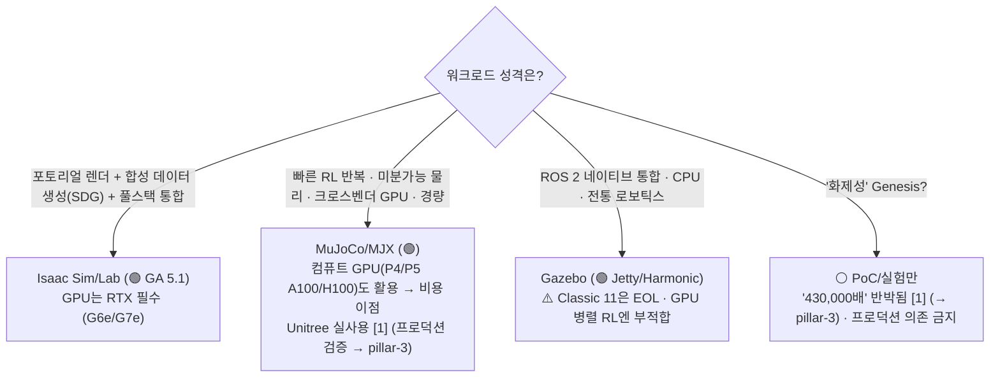
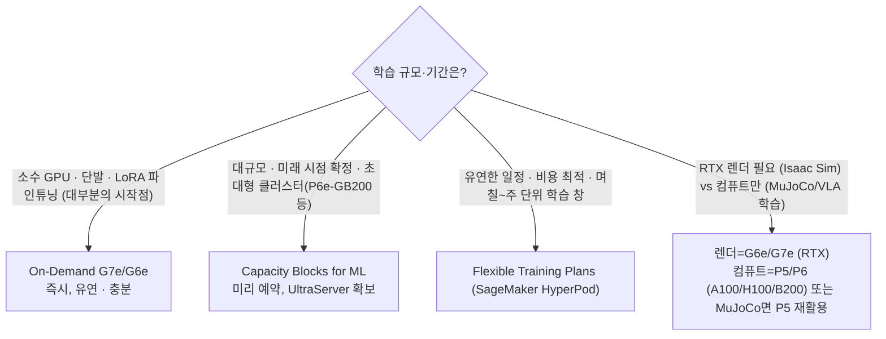

# Decisions — 교차 의사결정 트리

_최종 갱신: 2026-09 · owner: Youngjin · volatility: 중간_
[← index로](index.md)

> **L0 TL;DR**: 고객이 자주 부딪히는 4개 갈림길을 산문 대신 **결정 표/트리**로. 각 결정은 필러를 가로지른다. 급하면 해당 표만 보고 방향을 잡으라.

목차: [1) Cloud vs Edge](#1-cloud-training-vs-edge-inference-경계) · [2) NVIDIA vs 오픈소스](#2-nvidia-풀스택-vs-오픈소스) · [3) GPU 확보 전략](#3-gpu-확보-전략) · [4) Build vs Buy](#4-build-vs-buy-파운데이션-모델)

---

> **검토 범위**: 페이지 수정일은 모든 기술 항목의 재검증일이 아니다. 핵심 정정의 확인일·재현/사람 검토 상태는 [근거 기록](evidence.md)에 있으며, 기존 항목의 개별 확인일은 그대로 적용한다.

## 1) Cloud training vs Edge inference 경계

**핵심 질문**: 관측부터 동작까지의 기한, 최악 지연·지터, 통신 단절 중 필요한 기능은 무엇인가?

| 기능 | 배치 판단 | 검증할 것 |
|---|---|---|
| 업무 계획·분석 | 지연·데이터 처리 요건을 충족하면 클라우드 가능 | 처리 국가, timeout, 취소, 툴 권한 |
| 관측 기반 로봇 스킬 | 모델·장치별 기한을 실측해 현장/클라우드 판단 | 최신 관측 반영 빈도, 지연 분포, 단절 시 동작 |
| 저수준 제어 | 장치 기한을 만족하는 로컬 컨트롤러 | 제어 주기·최악 지터·모델 실패 |
| 독립 안전 | LLM·네트워크와 독립적으로 설계·검증 | 위험 평가, 정지·제한, 현장 책임자 |

System 1/2라는 모델 이름만으로 배치를 정하지 않는다. Helix는 두 시스템 모두 온보드다. chunk 출력 수는 피드백 빈도가 아니다([근거](evidence.md#action-chunking)). [운영·복구](operations.md)에서 명령 계약과 장애 시험을 작성한다.

---

## 2) NVIDIA 풀스택 vs 오픈소스

**핵심 질문: "Isaac에 다 걸까, 오픈소스로 갈까?"**

```mermaid
graph TD
    Q{워크로드 성격은?}
    Q -- "포토리얼 렌더 + 합성 데이터 생성(SDG) + 풀스택 통합" --> ISAAC["Isaac Sim/Lab (🟢 GA 5.1)<br>GPU는 RTX 필수 (G6e/G7e)"]
    Q -- "빠른 RL 반복 · 미분가능 물리 · 크로스벤더 GPU · 경량" --> MUJOCO["MuJoCo/MJX (🟢)<br>컴퓨트 GPU(P4/P5 A100/H100)도 활용 → 비용 이점<br>Unitree 실사용 [1] (프로덕션 검증 → pillar-3)"]
    Q -- "ROS 2 네이티브 통합 · CPU · 전통 로보틱스" --> GAZEBO["Gazebo (🟢 Jetty/Harmonic)<br>⚠️ Classic 11은 EOL · GPU 병렬 RL엔 부적합"]
    Q -- "'화제성' Genesis?" --> GENESIS["⚪ PoC/실험만<br>'430,000배' 반박됨 [1] (→ pillar-3) · 프로덕션 의존 금지"]
```

| 기준 | Isaac Sim/Lab | MuJoCo/MJX | Gazebo |
|---|---|---|---|
| 성숙도 | 🟢 GA 5.1 | 🟢 GA (Warp는 Alpha) | 🟢 GA (Classic EOL) |
| GPU | **RTX 필수**(A100/H100 ✗) | 컴퓨트 GPU 가능(P5 ✓) | CPU 중심 |
| 렌더/SDG[^sdg] | 최상 | 제한적 | 제한적 |
| 미분가능[^diffsim] | △ | ✓ (JAX) | ✗ |
| ROS 통합 | 가능 | 보조 | **네이티브** |
| 라이선스 | Apache(소스)+AI Enterprise(재배포/SaaS) | Apache | Apache |
| AWS | G6e/G7e + AMI + Batch | EC2(P5 포함) + Batch | EC2 + Batch |

> **판정 원칙**: 워크로드로 고르면 된다. **"AWS는 셋 다 잘 돌린다"** — NVIDIA 종속 우려 고객에게 중립 포지션. MuJoCo면 컴퓨트 GPU 재활용 비용 이점.
> 근거: [pillar-3](pillar-3.md).

---

## 3) GPU 확보 전략

**핵심 질문: "GPU를 어떻게 확보하나? On-Demand가 안 잡힌다."**

```mermaid
graph TD
    Q{학습 규모·기간은?}
    Q -- "소수 GPU · 단발 · LoRA 파인튜닝 (대부분의 시작점)" --> OD["On-Demand G7e/G6e<br>즉시, 유연 · 충분"]
    Q -- "대규모 · 미래 시점 확정 · 초대형 클러스터(P6e-GB200 등)" --> CB["Capacity Blocks for ML<br>미리 예약, UltraServer 확보"]
    Q -- "유연한 일정 · 비용 최적 · 며칠~주 단위 학습 창" --> FTP["Flexible Training Plans (SageMaker HyperPod)"]
    Q -- "RTX 렌더 필요 (Isaac Sim) vs 컴퓨트만 (MuJoCo/VLA 학습)" --> RC["렌더=G6e/G7e (RTX)<br>컴퓨트=P5/P6 (A100/H100/B200) 또는 MuJoCo면 P5 재활용"]
```

| 전략 | 언제 | AWS |
|---|---|---|
| On-Demand | 소수·단발·탐색 | EC2 G7e/G6e/P6 |
| Capacity Blocks for ML | 대규모·시점 확정·UltraServer | P6e-GB200, 예약 |
| Flexible Training Plans | 유연 일정·비용 최적 | SageMaker HyperPod |
| Trainium | LLM 학습 비용 절감 | Trn2/Trn3 ⚠️ **VLA[^vla]는 공개 사례 없음 [4]** (→ pillar-2) |

> **판정 원칙**: 시작은 On-Demand G7e. 못 잡히거나 대규모면 Capacity Blocks/Flexible Training Plans. **Trainium은 LLM엔 안전하나 VLA/로보틱스는 검증 사례 없음** — 제안 시 리스크 명시.
> 근거: [pillar-2 학습 스택](pillar-2.md), [pillar-3](pillar-3.md).

---

## 4) Build vs Buy (파운데이션 모델)

**핵심 질문**: 이 업무를 기존 방식·구매·통합·모델 적응 중 무엇으로 해결하는 것이 효과적인가?

| 선택 | 적합한 조건 | 먼저 요구할 증거 |
|---|---|---|
| 기존 자동화·제어 개선 | 환경이 구조화돼 있고 현재 문제의 원인이 명확 | 기준선 대비 시간·품질·비용 |
| 상용 로봇/솔루션 구매 | 제품이 업무·안전·지원 요구를 충족 | 고객 환경 수용시험, 유지보수·총비용 |
| SI·파트너 통합 | 다기종·공정 연결과 현장 구현이 핵심 | 유사 현장 실적, 책임·복구 범위 |
| 오픈 모델 적응 | 학습이 필요한 변화와 사용 가능한 데이터 존재 | 코드/가중치/기반 모델/데이터 권리, 독립 평가 |
| 자체 사전학습 | 기존 대안으로 해결되지 않는 모델 요구와 연구·데이터 자원 | 대안 대비 개선 근거, 전체 개발·운영비 |

오픈 모델을 선택한 다음에 LoRA·부분 학습·전체 학습을 비교한다([P2](pillar-2.md)). **‘거의 항상 파인튜닝’이나 ‘1일 PoC’로 시작하지 않는다.** [업무 적합성](start.md#fit)과 [총비용](start.md#roi)으로 결정하고 [실행 경로](execution.md)를 선택한다.

상용 판단은 [OpenVLA 코드/가중치 구분](evidence.md#openvla-license)을 포함해 버전별로 기록한다. 추론 API를 쓰는 경우도 저수준 제어, 데이터 처리, 복구 책임이 별도로 남는다.

---

## 부록 — 리전/데이터 레지던시 빠른 판정

서비스 리전·인스턴스 종류·할당량·구매 방식은 실행 직전에 확인한다. 이 페이지의 기존 서울 지원 일괄 체크표는 제거했다.

**데이터 처리**: 저장 위치, 모델 추론, Memory/Evaluations, 외부 툴, 로그의 경로를 각각 기록한다. AgentCore의 서울 제공만으로 국내 처리를 보장하지 않는다([공식 근거](evidence.md#agentcore-residency)).

**용량·비용**: On-Demand도 확보를 보장하지 않는다. 메모리·렌더링·CPU 요구에 맞는 복수 인스턴스 후보를 확인하고, 체크포인트 재개가 검증된 잡에서 Spot을 검토한다. Capacity Blocks·Training Plans는 지원 인스턴스·리전·일정 조건을 확인한 뒤 비교한다.

---
_owner: Youngjin · updated: 2026-09 · volatility: 중간 (트리 원리는 낮음, 인스턴스/리전 세부는 높음)_

<!-- 용어 각주 -->
[^sdg]: **합성 데이터 생성(SDG, Synthetic Data Generation)** — 시뮬레이터로 학습용 이미지와 주석(라벨)을 자동 생성하는 기법. 라벨링 비용이 0에 수렴하는 것이 최대 장점. 🎥 [Isaac Sim Replicator SDG 튜토리얼](https://www.youtube.com/watch?v=HHzNIh72B_Y)
[^diffsim]: **미분가능 물리(differentiable physics)** — 시뮬레이션 계산 전체가 미분 가능해 결과에서 입력으로 그래디언트를 역전파할 수 있는 물리 엔진. 정책·파라미터를 경사하강법으로 직접 최적화할 수 있다(MJX가 대표).
[^vla]: **VLA (Vision-Language-Action)** — 카메라 영상(Vision)과 자연어 지시(Language)를 입력받아 로봇의 동작(Action)을 직접 출력하는 파운데이션 모델. "컵을 집어"라고 말하면 관절 움직임을 생성하는 식. 🎥 [NVIDIA Isaac GR00T N1 소개](https://www.youtube.com/watch?v=m1CH-mgpdYg)
