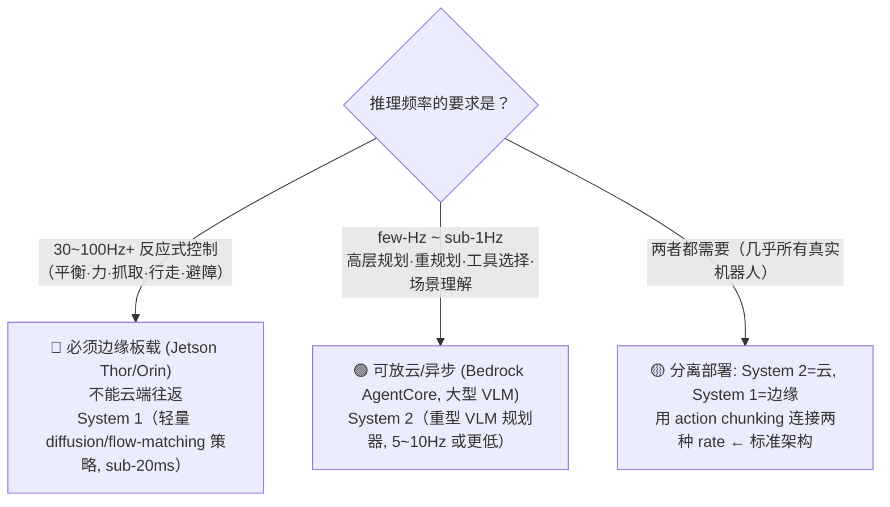
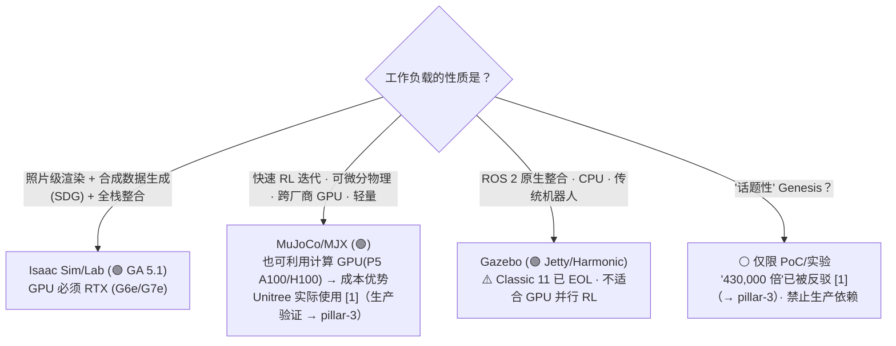
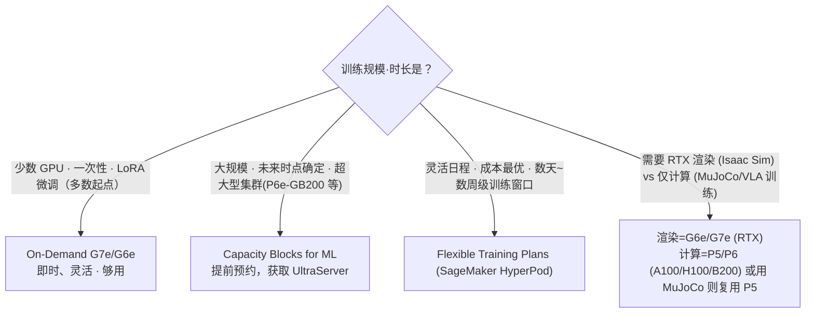
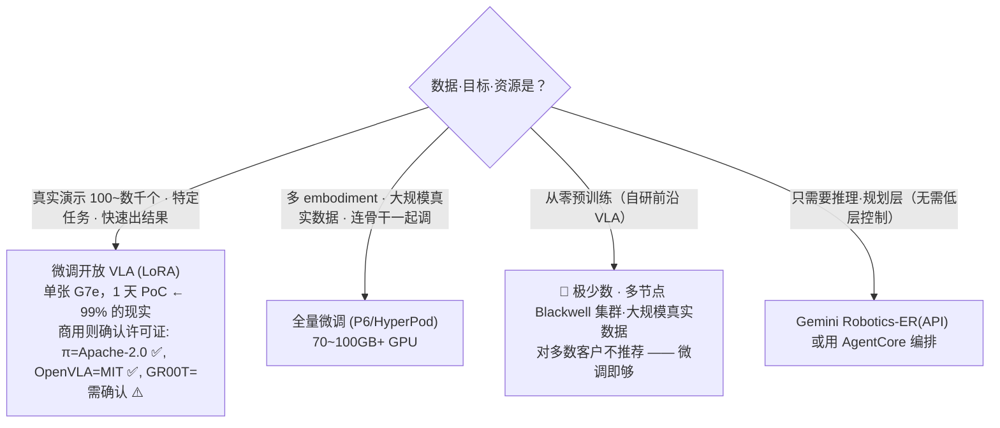

# Decisions — 横向决策树

_最终更新: 2026-07 · owner: 待定 ⚠️ · volatility: 中_
[← 返回 index](index.md)

> **L0 TL;DR**: 把客户常遇到的 4 个岔路口以**决策表/树**（而非散文）呈现。每个决策都横跨多个支柱。赶时间就只看对应的表来确定方向。

目录: [1) Cloud vs Edge](#1-cloud-training-vs-edge-inference-边界) · [2) NVIDIA vs 开源](#2-nvidia-全栈-vs-开源) · [3) GPU 获取策略](#3-gpu-获取策略) · [4) Build vs Buy](#4-build-vs-buy基础模型)

---

## 1) Cloud training vs Edge inference 边界

**核心问题: "这个推理能放云上，还是必须放边缘？"**

最重要的判别因素是**控制频率**[^ctrlfreq]。

| 区分 | System 2[^sys]（规划） | System 1（控制） |
|---|---|---|
| 频率 | 5~10Hz 以下 | 50~200Hz |
| 延迟容忍 | 有（异步） | 无（sub-20ms） |
| 位置 | **云** (AgentCore) 或板载 | **边缘板载** (Jetson) |
| 模型 | 大型 VLM/LLM | 轻量 diffusion/flow-matching[^flow] |
| AWS | Bedrock AgentCore, EC2 | IoT Greengrass V2, SageMaker Neo, ONNX/TensorRT |

> **判定原则**: "涉及实时安全·反应的回路就放边缘，有时间思考就放云。" action chunking[^chunk] 是桥梁。
> 依据: [pillar-4 边缘](pillar-4.md)、[pillar-2 System1/System2](pillar-2.md)、[pillar-5](pillar-5.md)。

---

## 2) NVIDIA 全栈 vs 开源

**核心问题: "全押 Isaac，还是走开源？"**

| 标准 | Isaac Sim/Lab | MuJoCo/MJX | Gazebo |
|---|---|---|---|
| 成熟度 | 🟢 GA 5.1 | 🟢 GA（Warp 为 Alpha） | 🟢 GA（Classic EOL） |
| GPU | **必须 RTX**（A100/H100 ✗） | 可用计算 GPU（P5 ✓） | 以 CPU 为主 |
| 渲染/SDG[^sdg] | 最佳 | 有限 | 有限 |
| 可微分[^diffsim] | △ | ✓ (JAX) | ✗ |
| ROS 整合 | 可以 | 辅助 | **原生** |
| 许可证 | Apache（源码）+AI Enterprise（再分发/SaaS） | Apache | Apache |
| AWS | G6e/G7e + AMI + Batch | EC2（含 P5）+ Batch | EC2 + Batch |

> **判定原则**: 按工作负载选即可。**"AWS 三者都能跑好"** —— 对担心 NVIDIA 依赖的客户给出中立立场。用 MuJoCo 则有复用计算 GPU 的成本优势。
> 依据: [pillar-3](pillar-3.md)。

---

## 3) GPU 获取策略

**核心问题: "怎么获取 GPU？On-Demand 拿不到。"**

| 策略 | 何时 | AWS |
|---|---|---|
| On-Demand | 少数·一次性·探索 | EC2 G7e/G6e/P6 |
| Capacity Blocks for ML | 大规模·时点确定·UltraServer | P6e-GB200，预约 |
| Flexible Training Plans | 灵活日程·成本最优 | SageMaker HyperPod |
| Trainium | 降低 LLM 训练成本 | Trn2/Trn3 ⚠️ **VLA[^vla] 无公开案例 [4]**（→ pillar-2） |

> **判定原则**: 起步用 On-Demand G7e。拿不到或规模大则用 Capacity Blocks/Flexible Training Plans。**Trainium 对 LLM 安全，但 VLA/机器人无验证案例** —— 提议时明示风险。
> 依据: [pillar-2 训练栈](pillar-2.md)、[pillar-3](pillar-3.md)。

---

## 4) Build vs Buy（基础模型）

**核心问题: "是微调[^ft]基础模型，还是自行训练？"**

| 选项 | 数据 | GPU | 何时 |
|---|---|---|---|
| LoRA[^lora] 微调 | 100~数千演示 | 单张 24~40GB | **默认起点** |
| 全量微调 | 大规模真实数据 | 70~100GB+ / 多节点 | 多 embodiment[^embodiment] |
| 预训练(Build)[^pretrain] | 超大规模 | Blackwell 集群 | 极少数前沿 |
| Buy 推理层 | — | — | 控制用开放模型，规划用 API |

> **判定原则**: **几乎总是微调(Buy+adapt) 才是答案。** 从零预训练是极少数。商用时许可证是第一道门禁（注意 GR00T 非商业）。"仅靠仿真做操作策略"是陷阱 —— 真实数据必需（[pillar-4](pillar-4.md)）。
> 依据: [pillar-2](pillar-2.md)、[pillar-1 数据·许可证](pillar-1.md)、[pillar-4](pillar-4.md)。

---

## 附录 — 区域/数据驻留快速判定

_（下表为易变 —— 2026-07，以 AWS 官方区域表 `[1]` 直接确认为准。引用前再确认最新区域表）_

| 服务 | 首尔(ap-northeast-2) | 备注 |
|---|---|---|
| Bedrock AgentCore（核心+Policy+Evaluations） | ✅ | Agent Registry·Payments 为 ✗（东京 Registry ✅）—— 以 2026-07 区域表为准 |
| EC2 G7e / G6e / P6 | ✅（按区域确认） | 利用 Capacity Blocks |
| SageMaker HyperPod | ✅ | Flexible Training Plans 区域扩展中 |
| IoT Greengrass V2 | ✅ | V1 于 2026-06 EOL |

> 担心数据驻留的客户: 先让其确认 **AgentCore 首尔 GA** 来安心（更正过时的"首尔不支持"信息）。→ [pillar-5](pillar-5.md)。

---
_owner: 待定 ⚠️ · updated: 2026-07 · volatility: 中（树的原理为低，实例/区域细节为高）_

<!-- 용어 각주 -->
[^ctrlfreq]: **控制频率（control frequency）** — 机器人每秒更新多少次控制命令（Hz）。平衡·抓取等反应回路需要 30~100Hz 以上，经由存在往返延迟的云在物理上不可能实现 — 是划分推理部署位置的第一判别因素。
[^sys]: **System 2 / System 1** — 把认知科学中"慢思考 / 快反应"的区分应用到机器人架构的结构。System 2 由慢速大模型负责规划（5~10Hz），System 1 由小型策略负责实时控制（50~200Hz）。它是决定推理放云上还是边缘的标准。
[^flow]: **flow-matching / diffusion action head** — 通过从噪声逐步细化来生成机器人连续动作的扩散（diffusion）·流（flow）系输出模块。能表达平滑且多模态（multi-modal）的动作分布，是最新 VLA 的标准动作头。
[^chunk]: **action chunking** — 不是每步只预测 1 个动作，而是一次预测未来多步动作（块）的技术。减少推理次数，更容易满足实时控制频率。
[^sdg]: **合成数据生成（SDG, Synthetic Data Generation）** — 用仿真器自动生成训练图像与标注（标签）的技术。最大优点是标注成本趋近于零。🎥 [Isaac Sim Replicator SDG 教程](https://www.youtube.com/watch?v=HHzNIh72B_Y)
[^diffsim]: **可微分物理（differentiable physics）** — 整个仿真计算均可微分、能把梯度从结果反向传播到输入的物理引擎。可以用梯度下降直接优化策略·参数（代表是 MJX）。
[^vla]: **VLA (Vision-Language-Action)** — 以相机图像（Vision）与自然语言指令（Language）为输入、直接输出机器人动作（Action）的基础模型。对它说"把杯子拿起来"，它就会生成关节运动。🎥 [NVIDIA Isaac GR00T N1 介绍](https://www.youtube.com/watch?v=m1CH-mgpdYg)
[^ft]: **微调（fine-tuning）** — 用自己任务·机器人的少量数据，对经过大规模数据预训练的模型进行追加训练。相比从零训练，数据·GPU 可节省数十~数百倍。
[^lora]: **LoRA (Low-Rank Adaptation)** — 冻结原始权重、只额外训练小型低秩（low-rank）矩阵的轻量微调技术。GPU 内存需求仅为全量微调的几分之一，一张 24GB 级 GPU 即可完成。
[^embodiment]: **embodiment（具身形态）** — 机器人的物理形态·自由度·传感器配置。即使模型相同，机械臂与人形机器人的 embodiment 不同，数据·策略无法直接移植。
[^pretrain]: **预训练（pre-training）** — 用大规模通用数据从零开始训练模型、建立基础能力的阶段。之后再用少量数据微调来适配特定任务。前沿 VLA 预训练是极少数组织的领域。
