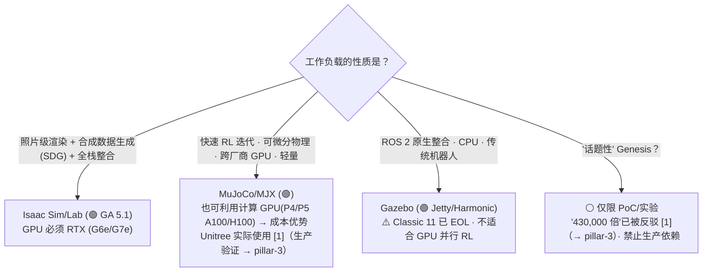
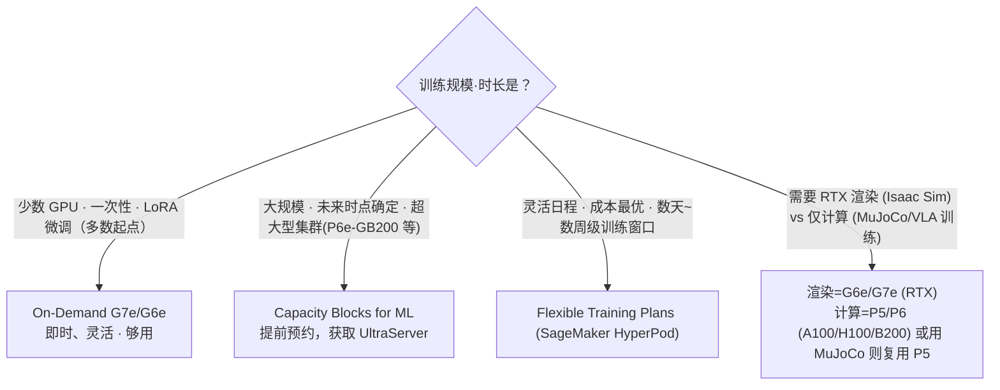

# Decisions — 横向决策树

_最终更新: 2026-09 · owner: Youngjin · volatility: 中_
[← 返回 index](index.md)

> **L0 TL;DR**: 把客户常遇到的 4 个岔路口以**决策表/树**（而非散文）呈现。每个决策都横跨多个支柱。赶时间就只看对应的表来确定方向。

目录: [1) Cloud vs Edge](#1-cloud-training-vs-edge-inference-边界) · [2) NVIDIA vs 开源](#2-nvidia-全栈-vs-开源) · [3) GPU 获取策略](#3-gpu-获取策略) · [4) Build vs Buy](#4-build-vs-buy基础模型)

---

> **复核范围**：页面修改日不代表所有技术条目已重验。核心修正日期、复现/人工状态见[证据](evidence.md)，旧条目仍使用各自确认日期。

## 1) Cloud training vs Edge inference 边界

**核心问题**：观测到动作的时限、最坏延迟/抖动和断网必需功能是什么？

| 功能 | 部署判断 | 验证项 |
|---|---|---|
| 业务规划/分析 | 满足延迟和数据处理条件时可放云 | 处理国家、超时、取消、工具权限 |
| 观测驱动技能 | 实测模型设备时限，判断现场/云 | 新观测响应频率、延迟分布、断网行为 |
| 底层控制 | 满足设备时限的本地控制器 | 控制周期、最坏抖动、模型失败 |
| 独立安全 | 独立于 LLM/网络设计验证 | 风险评估、停止限制、现场负责人 |

不按 System 1/2 名称决定位置。Helix 两系统均板载；chunk 输出数不是反馈频率（[证据](evidence.md#action-chunking)）。在[运营](operations.md)定义命令契约和故障测试。

---

## 2) NVIDIA 全栈 vs 开源

**核心问题: "全押 Isaac，还是走开源？"**

```mermaid
graph TD
    Q{工作负载的性质是？}
    Q -- "照片级渲染 + 合成数据生成(SDG) + 全栈整合" --> ISAAC["Isaac Sim/Lab (🟢 GA 5.1)<br>GPU 必须 RTX (G6e/G7e)"]
    Q -- "快速 RL 迭代 · 可微分物理 · 跨厂商 GPU · 轻量" --> MUJOCO["MuJoCo/MJX (🟢)<br>也可利用计算 GPU(P4/P5 A100/H100) → 成本优势<br>Unitree 实际使用 [1]（生产验证 → pillar-3）"]
    Q -- "ROS 2 原生整合 · CPU · 传统机器人" --> GAZEBO["Gazebo (🟢 Jetty/Harmonic)<br>⚠️ Classic 11 已 EOL · 不适合 GPU 并行 RL"]
    Q -- "'话题性' Genesis？" --> GENESIS["⚪ 仅限 PoC/实验<br>'430,000 倍'已被反驳 [1]（→ pillar-3）· 禁止生产依赖"]
```

| 标准 | Isaac Sim/Lab | MuJoCo/MJX | Gazebo |
|---|---|---|---|
| 成熟度 | 🟢 GA 5.1 | 🟢 GA（Warp 为 Alpha） | 🟢 GA（Classic EOL） |
| GPU | **必须 RTX**（A100/H100 ✗） | 可用计算 GPU（P5 ✓） | 以 CPU 为主 |
| 渲染/SDG[^sdg] | 最佳 | 有限 | 有限 |
| 可微分[^diffsim] | △ | ✓ (JAX) | ✗ |
| ROS 整合 | 可以 | 辅助 | **原生** |
| 许可证 | Apache（源码）+AI Enterprise（再分发/SaaS） | Apache | Apache |
| AWS | G6e/G7e + AMI + Batch | EC2（含 P5）+ Batch | EC2 + Batch |

> **判定原则**: 按工作负载选即可。**"AWS 三者都能跑好"** —— 对担心 NVIDIA 依赖的客户给出中立立场。用 MuJoCo 则有复用计算 GPU 的成本优势。
> 依据: [pillar-3](pillar-3.md)。

---

## 3) GPU 获取策略

**核心问题: "怎么获取 GPU？On-Demand 拿不到。"**

```mermaid
graph TD
    Q{训练规模·时长是？}
    Q -- "少数 GPU · 一次性 · LoRA 微调（多数起点）" --> OD["On-Demand G7e/G6e<br>即时、灵活 · 够用"]
    Q -- "大规模 · 未来时点确定 · 超大型集群(P6e-GB200 等)" --> CB["Capacity Blocks for ML<br>提前预约，获取 UltraServer"]
    Q -- "灵活日程 · 成本最优 · 数天~数周级训练窗口" --> FTP["Flexible Training Plans (SageMaker HyperPod)"]
    Q -- "需要 RTX 渲染 (Isaac Sim) vs 仅计算 (MuJoCo/VLA 训练)" --> RC["渲染=G6e/G7e (RTX)<br>计算=P5/P6 (A100/H100/B200) 或用 MuJoCo 则复用 P5"]
```

| 策略 | 何时 | AWS |
|---|---|---|
| On-Demand | 少数·一次性·探索 | EC2 G7e/G6e/P6 |
| Capacity Blocks for ML | 大规模·时点确定·UltraServer | P6e-GB200，预约 |
| Flexible Training Plans | 灵活日程·成本最优 | SageMaker HyperPod |
| Trainium | 降低 LLM 训练成本 | Trn2/Trn3 ⚠️ **VLA[^vla] 无公开案例 [4]**（→ pillar-2） |

> **判定原则**: 起步用 On-Demand G7e。拿不到或规模大则用 Capacity Blocks/Flexible Training Plans。**Trainium 对 LLM 安全，但 VLA/机器人无验证案例** —— 提议时明示风险。
> 依据: [pillar-2 训练栈](pillar-2.md)、[pillar-3](pillar-3.md)。

---

## 4) Build vs Buy（基础模型）

**核心问题**：该业务应采用现有方式、采购、集成还是模型适配？

| 选择 | 适用条件 | 先要求的证据 |
|---|---|---|
| 改善自动化/控制 | 环境结构化且问题原因明确 | 基线时间、质量、费用比较 |
| 采购机器人/方案 | 产品满足业务、安全、支持需求 | 客户现场验收、维护、总成本 |
| SI/伙伴集成 | 多设备和工艺连接是核心 | 类似现场成果、责任及恢复范围 |
| 开放模型适配 | 变化需学习且有可用数据 | 代码/权重/基础模型/数据权利、独立评估 |
| 自研预训练 | 其他方案未满足模型需求且有研究数据资源 | 相对替代方案的改善、完整开发运营费 |

选择模型适配后才比较 LoRA、部分和全量训练（[P2](pillar-2.md)）。**不要从“几乎总应微调”“一天 PoC”开始**。按[适配](start.md#fit)及[总成本](start.md#roi)决定后选择[执行路径](execution.md)。

记录具体版本商业条款，包括 [OpenVLA 代码/权重](evidence.md#openvla-license)。使用推理 API 也有独立控制、数据处理、恢复责任。

---

## 附录 — 区域/数据驻留快速判定

执行前核对服务区域、具体实例、配额及购买方式，移除原先首尔可用性一概打勾表。

**数据处理**：分别记录存储、推理、Memory/Evaluations、外部工具及日志路径。AgentCore 首尔可用不保证韩国境内处理（[官方证据](evidence.md#agentcore-residency)）。

**容量/费用**：On-Demand 不保证容量。按显存、渲染、CPU 要求确认多个兼容实例；仅在 checkpoint 恢复已验证的任务考虑 Spot。先核对实例、区域、时间条件再比较 Capacity Blocks/Training Plans。

---
_owner: Youngjin · updated: 2026-09 · volatility: 中（树的原理为低，实例/区域细节为高）_

<!-- 용어 각주 -->
[^sdg]: **合成数据生成（SDG, Synthetic Data Generation）** — 用仿真器自动生成训练图像与标注（标签）的技术。最大优点是标注成本趋近于零。🎥 [Isaac Sim Replicator SDG 教程](https://www.youtube.com/watch?v=HHzNIh72B_Y)
[^diffsim]: **可微分物理（differentiable physics）** — 整个仿真计算均可微分、能把梯度从结果反向传播到输入的物理引擎。可以用梯度下降直接优化策略·参数（代表是 MJX）。
[^vla]: **VLA (Vision-Language-Action)** — 以相机图像（Vision）与自然语言指令（Language）为输入、直接输出机器人动作（Action）的基础模型。对它说"把杯子拿起来"，它就会生成关节运动。🎥 [NVIDIA Isaac GR00T N1 介绍](https://www.youtube.com/watch?v=m1CH-mgpdYg)
