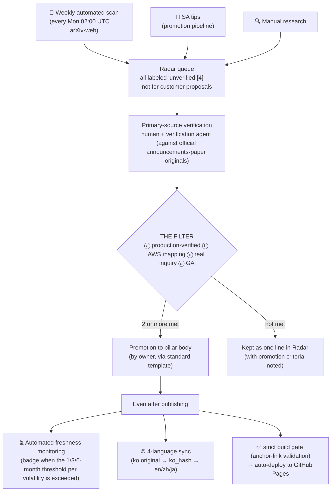

# Guide — How This Playbook Works

_Last updated: 2026-07 · owner: comeddy · volatility: low (process page — updated only when the pipeline changes)_
[← to index](index.md)

> **L0 TL;DR**: This site is not a news archive but a **verification pipeline**. Newly announced technologies, papers, and releases don't land in the body right away — an automated scan gathers candidates, humans verify against primary sources, and only items that pass 2 of the 4 gates (THE FILTER) make it into the body. Even after being published, freshness is monitored automatically, content is synchronized across 4 languages, and it must pass the build gate before it deploys.

---

## The full process at a glance

---

## ① How it was built

This playbook was generated from a complete spec document (the [master prompt](https://github.com/comeddy/pai-playbook/blob/main/physical-ai-playbook-master-prompt.md)). The information architecture (5 pillars + decision tree + Radar + maintenance rules) and inclusion criteria are fixed in the spec, and every page went through **adversarial verification** (a separate verification step that hunts for factual errors and exaggeration). This step actually caught things like version typos and licensing errors — the principle is not "we generated it, so we trust it" but "we verify even what we generated."

## ② What gets published and what gets filtered out

Every item must pass [THE FILTER](maintenance.md#inclusion-criteria-the-filter) to appear in the body: ⓐ production-verified ⓑ AWS-mappable ⓒ a record of real inquiries ⓓ GA (or roadmap) — **2 or more of the 4**. "It's new" or "the demo is impressive" is not a reason for inclusion. Published items carry a maturity label (🟢 GA / 🟡 Preview / 🔵 Research / ⚪ Hype) and a source grade (`[1]` official docs ~ `[4]` unverified) — how to read the labels is on the [home](index.md) page.

## ③ Radar and the weekly automated scan

Items that haven't passed the filter yet live as a single line in the [Radar (queue)](radar.md). **Every Monday at 02:00 UTC** an automated scan runs and fills the Radar's "latest scan intake" section with the newest papers and news. Important: **all automated intake is quarantined as unverified `[4]`** and must not be used in customer proposals. Automation does nothing more than put candidates on the queue.

## ④ Verification and promotion — the human's job

Primary-source verification of intake items (official announcements, paper originals, license checks) and the promotion decision are made by a **human (owner)**. The automated scan can produce plausible errors (e.g., a nonexistent product-generation name), so nothing is promoted without verification. Once it passes, the owner folds it into the relevant pillar via the [standard template](maintenance.md#standard-template) and removes it from the Radar. For the full procedure see the [promotion pipeline](maintenance.md#playbook-promotion-pipeline).

## ⑤ Automated freshness monitoring

Published items age too. Each page has a volatility grade — high 1 month / medium 3 months / low 6 months — and if it exceeds the threshold without an update, a **"⏳ review needed" badge is automatically injected** into that page (across all 4 languages) at deploy time. A redeploy runs every week, so the badge stays current even without a push. If you see the badge, that page is awaiting re-review.

## ⑥ 4-language sync

**Korean is the original**; English, Chinese, and Japanese are derivatives. Each translation file records the original's fingerprint (ko_hash) at the time of translation, so when the original changes, the system automatically detects which translation has fallen behind (CI warning). Terminology is kept consistent across the 4 languages via a shared glossary. Switch languages from the dropdown at the top right of the page.

## ⑦ Deployment pipeline

When something is pushed to `main`, CI runs the freshness check and the translation-sync check and deploys to GitHub Pages only if the **strict build** (which fails if there is even a single broken link or anchor) passes. In other words, every page you're looking at right now has passed this gate.

---

## Guidance by role

| I'm… | Here's how to use it |
|---|---|
| **just a reader** | Enter via the FAQ Top 20 or a pillar on the [home](index.md) page. If you just know the labels (🟢🟡🔵⚪) and source grades (`[1]`~`[4]`), you can read the trust level at a glance |
| **someone who wants to submit an item** | Submit via the [promotion pipeline](maintenance.md#playbook-promotion-pipeline). It's faster if you also note how many of the 4 in THE FILTER it meets |
| **owner** | Review the weekly automated intake → primary verification → promote/keep decision. See the full [maintenance rules](maintenance.md) |
