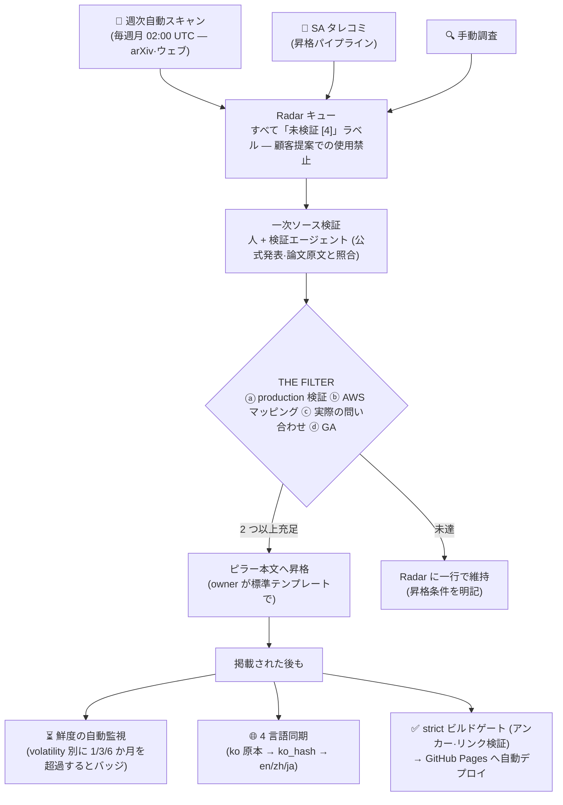

# ガイド — この Playbook はどう動くのか

_最終更新: 2026-07 · owner: comeddy · volatility: 低（プロセスページ — パイプライン変更時のみ更新）_
[← index へ](index.md)

> **L0 TL;DR**：このサイトはニュースアーカイブではなく、**検証パイプライン**です。新しく登場した技術・論文・発表がすぐ本文に載ることはありません — 自動スキャンが候補を集め、人が一次ソースで検証し、4 つのうち 2 つの関門（THE FILTER）を通過したものだけが本文に上がります。掲載された後も鮮度は自動監視され、4 言語で同期され、ビルドゲートを通過してはじめてデプロイされます。

---

## 全工程を一目で

---

## ① どうやって作られたか

このプレイブックは、完結したスペック文書（[マスタープロンプト](https://github.com/comeddy/pai-playbook/blob/main/physical-ai-playbook-master-prompt.md)）から生成されました。情報構造（5 つのピラー + 意思決定ツリー + Radar + メンテナンスルール）と包含基準がスペックに固定されており、各ページは**敵対的検証**（事実誤り·誇張を探す別個の検証ステップ）を経ています。実際にこの段階でバージョンの誤記·ライセンス誤りなどが捕捉されました — 「生成したから信じる」ではなく「生成したものも検証する」が原則です。

## ② 何が載り、何が弾かれるか

すべての項目は [THE FILTER](maintenance.md#包含基準-the-filter) を通過しなければ本文に載りません：ⓐ production 検証 ⓑ AWS マッピング可能 ⓒ 実際の問い合わせ履歴 ⓓ GA（またはロードマップ）— **4 つのうち 2 つ以上**。「新しく出た」「デモが印象的だ」は包含の理由になりません。掲載された項目には成熟度ラベル（🟢 GA / 🟡 Preview / 🔵 Research / ⚪ Hype）とソース等級（`[1]` 公式ドキュメント ~ `[4]` 未検証）が付きます — ラベルの読み方は[ホーム](index.md)にあります。

## ③ Radar と週次自動スキャン

フィルターをまだ通過していないものは [Radar（キュー）](radar.md)に一行で存在します。**毎週月曜 02:00 UTC** に自動スキャンが走り、最新の論文·ニュースを Radar の「最新スキャン流入」セクションに満たします。重要なのは、**自動流入分はすべて未検証 `[4]` として隔離**され、顧客提案に使ってはいけないという点です。自動化は候補をキューに載せるところまでしか行いません。

## ④ 検証と昇格 — 人の役目

流入項目の一次ソース確認（公式発表·論文原文·ライセンス照合）と昇格判断は**人（owner）**が行います。自動スキャンはもっともらしい誤り（例：存在しない製品世代名）を作りうるため、検証なしには昇格されません。通過すれば owner が[標準テンプレート](maintenance.md#標準テンプレート)で該当ピラーに編入し、Radar から除去します。全手順は[昇格パイプライン](maintenance.md#slack--playbook-昇格パイプライン)を参照してください。

## ⑤ 鮮度の自動監視

掲載された項目も古くなります。ページごとに変動性（volatility）等級があり — 高 1 か月 / 中 3 か月 / 低 6 か月 — 更新なしに基準を超えると、デプロイ時にそのページ（4 言語すべて）に**「⏳ 要レビュー」バッジが自動注入**されます。毎週再デプロイが走るので、プッシュがなくてもバッジは最新状態を維持します。バッジが見えたら、そのページは再レビュー待ちという意味です。

## ⑥ 4 言語同期

**韓国語が原本**で、英語·中国語·日本語は派生物です。各翻訳ファイルは翻訳時点の原本の指紋（ko_hash）を記録しているため、原本が変わればどの翻訳が遅れているかを自動検知します（CI 警告）。用語は共用用語集で 4 言語にわたり一貫して維持されます。言語切り替えはページ右上のドロップダウンです。

## ⑦ デプロイパイプライン

`main` にプッシュされると、CI が鮮度チェック·翻訳同期チェックを走らせ、**strict ビルド**（壊れたリンクやアンカーが一つでもあれば失敗）を通過した場合にのみ GitHub Pages へデプロイします。つまり、いま見ているすべてのページはこのゲートを通過した状態です。

---

## 役割別ガイド

| 私は… | こう使えばよい |
|---|---|
| **ただ読む人** | [ホーム](index.md)の FAQ Top 20 またはピラーから入る。ラベル（🟢🟡🔵⚪）とソース等級（`[1]`~`[4]`）さえ分かれば、信頼度をすぐに読み取れます |
| **項目をタレコミしたい人** | [昇格パイプライン](maintenance.md#slack--playbook-昇格パイプライン)へタレコミ。THE FILTER 4 つのうちいくつを充足するかも併記すると早いです |
| **owner** | 週次自動流入のレビュー → 一次検証 → 昇格/維持の判断。[メンテナンスルール](maintenance.md)全体を参照 |
