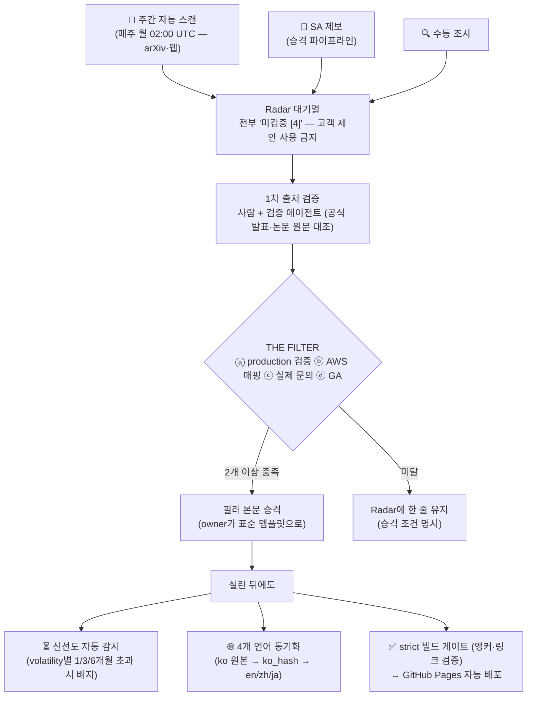

# 가이드 — 이 Playbook은 어떻게 동작하는가

_최종 갱신: 2026-07 · owner: comeddy · volatility: 낮음(프로세스 페이지 — 파이프라인 변경 시에만 갱신)_
[← index로](index.md)

> **L0 TL;DR**: 이 사이트는 뉴스 아카이브가 아니라 **검증 파이프라인**이다. 새로 등장한 기술·논문·발표는 곧바로 본문에 실리지 않는다 — 자동 스캔이 후보를 모으고, 사람이 1차 출처로 검증하고, 4개 중 2개 관문(THE FILTER)을 통과한 것만 본문에 오른다. 실린 뒤에도 신선도를 자동 감시하고, 4개 언어로 동기화되며, 빌드 게이트를 통과해야 배포된다.

---

## 한눈에 보는 전과정

---

## ① 어떻게 만들어졌나

이 플레이북은 완결된 스펙 문서([마스터 프롬프트](https://github.com/comeddy/pai-playbook/blob/main/physical-ai-playbook-master-prompt.md))로부터 생성됐다. 정보 구조(5개 필러 + 의사결정 트리 + Radar + 유지보수 규칙)와 포함 기준이 스펙에 고정되어 있고, 페이지마다 **적대적 검증**(사실 오류·과장을 찾는 별도 검증 단계)을 거쳤다. 실제로 이 단계에서 버전 오기·라이선스 오류 등이 잡혔다 — "생성했으니 믿는다"가 아니라 "생성한 것도 검증한다"가 원칙이다.

## ② 무엇이 실리고, 무엇이 걸러지나

모든 항목은 [THE FILTER](maintenance.md#포함-기준-the-filter)를 통과해야 본문에 실린다: ⓐ production 검증 ⓑ AWS 매핑 가능 ⓒ 실제 문의 이력 ⓓ GA(또는 로드맵) — **4개 중 2개 이상**. "새로 나왔다", "데모가 인상적이다"는 포함 사유가 아니다. 실린 항목에는 성숙도 라벨(🟢 GA / 🟡 Preview / 🔵 Research / ⚪ Hype)과 출처 등급(`[1]` 공식 문서 ~ `[4]` 미검증)이 붙는다 — 라벨 읽는 법은 [홈](index.md)에 있다.

## ③ Radar와 주간 자동 스캔

필터를 아직 통과하지 못한 것들은 [Radar(대기열)](radar.md)에 한 줄로 존재한다. **매주 월요일 02:00 UTC**에 자동 스캔이 돌아 최신 논문·뉴스를 Radar의 "최신 스캔 유입" 섹션에 채운다. 중요한 것: **자동 유입분은 전부 미검증 `[4]`로 격리**되며, 고객 제안에 쓰면 안 된다. 자동화는 후보를 대기열에 올리는 것까지만 한다.

## ④ 검증과 승격 — 사람의 몫

유입 항목의 1차 출처 확인(공식 발표·논문 원문·라이선스 대조)과 승격 판단은 **사람**이 한다. 자동 스캔은 그럴듯한 오류(예: 존재하지 않는 제품 세대명)를 만들 수 있어, 검증 없이는 승격되지 않는다. 1차 출처 검증은 owner 혼자가 아니라 **여러 명이 나눠 할 수 있다** — 참여자는 승격 이슈와 항목 하단의 `검증:` 필드에 기록한다. 통과하면 owner가 [표준 템플릿](maintenance.md#표준-템플릿)으로 해당 필러에 편입하고 Radar에서 제거한다. 전체 절차는 [승격 파이프라인](maintenance.md#playbook-승격-파이프라인) 참고.

## ⑤ 신선도 자동 감시

실린 항목도 낡는다. 페이지마다 변동성(volatility) 등급이 있고 — 높음 1개월 / 중간 3개월 / 낮음 6개월 — 갱신 없이 기준을 초과하면 배포 시 해당 페이지(4개 언어 전부)에 **"⏳ 검토 필요" 배지가 자동 주입**된다. 매주 재배포가 돌므로 푸시가 없어도 배지는 최신 상태를 유지한다. 배지가 보이면 그 페이지는 재검토 대기 중이라는 뜻이다.

## ⑥ 4개 언어 동기화

**한국어가 원본**이고 영어·중국어·일본어는 파생물이다. 각 번역 파일은 번역 시점의 원본 지문(ko_hash)을 기록하고 있어, 원본이 바뀌면 어느 번역이 뒤처졌는지 자동 감지된다(CI 경고). 용어는 공용 용어집으로 4개 언어에서 일관되게 유지된다. 언어 전환은 페이지 우측 상단 드롭다운.

## ⑦ 배포 파이프라인

`main`에 푸시되면 CI가 신선도 검사·번역 동기화 검사를 돌리고 **strict 빌드**(깨진 링크·앵커가 하나라도 있으면 실패)를 통과한 경우에만 GitHub Pages로 배포한다. 즉, 지금 보고 있는 모든 페이지는 이 게이트를 통과한 상태다.

---

## 역할별 안내

| 나는… | 이렇게 쓰면 된다 |
|---|---|
| **그냥 읽는 사람** | [홈](index.md)의 FAQ Top 20 또는 필러로 진입. 라벨(🟢🟡🔵⚪)과 출처 등급(`[1]`~`[4]`)만 알면 신뢰 수준을 바로 읽을 수 있다 |
| **항목을 제보하고 싶은 사람** | [승격 파이프라인](maintenance.md#playbook-승격-파이프라인)으로 제보. THE FILTER 4개 중 몇 개를 충족하는지 함께 적으면 빠르다 |
| **owner** | 주간 자동 유입 검토 → 1차 검증 → 승격/유지 판단. [유지보수 규칙](maintenance.md) 전체 참고 |
