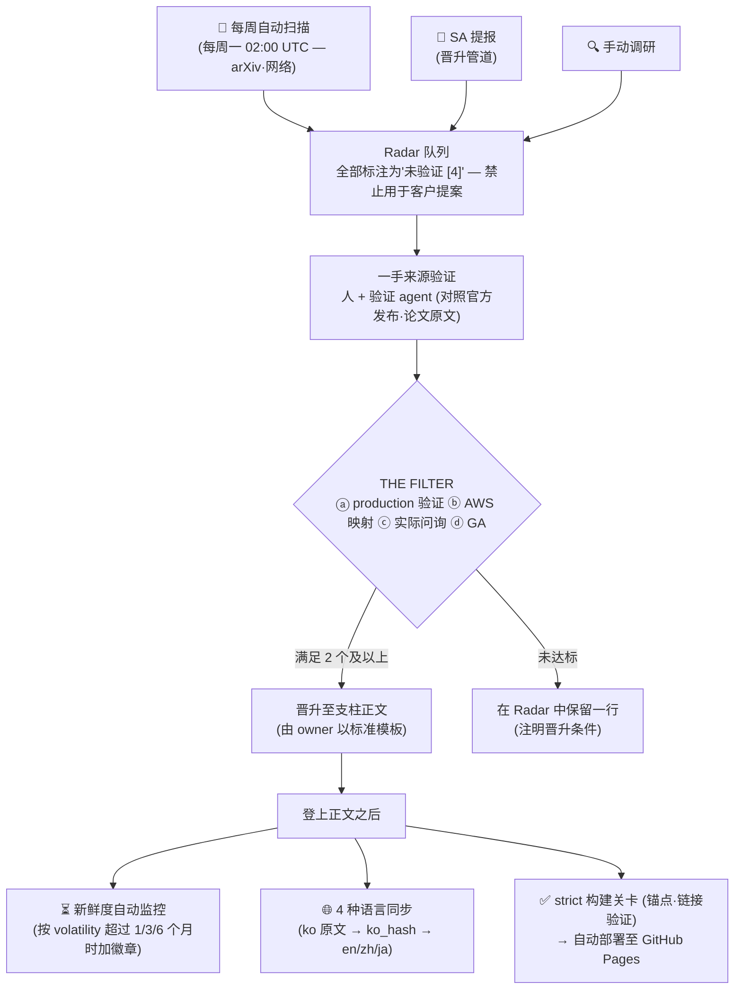

# 指南 — 本 Playbook 如何运作

_最终更新: 2026-07 · owner: comeddy · volatility: 低（流程页面 — 仅在管道变更时更新）_
[← 返回 index](index.md)

> **L0 TL;DR**：本站不是新闻归档，而是一条**验证管道**。新出现的技术、论文、发布不会立刻登上正文 — 自动扫描收集候选，由人依据一手来源验证，只有通过 4 个关卡中 2 个（THE FILTER）的项目才会进入正文。即便已登上正文，其新鲜度也会被自动监控、以 4 种语言同步，并须通过构建关卡才会部署。

---

## 全流程一览

---

## ① 它是如何构建的

本 playbook 由一份完整的规格文档（[主提示](https://github.com/comeddy/pai-playbook/blob/main/physical-ai-playbook-master-prompt.md)）生成。信息架构（5 个支柱 + 决策树 + Radar + 维护规则）与纳入标准在规格中固定，且每个页面都经过**对抗式验证**（专门查找事实错误·夸大的独立验证步骤）。实际上这一步就抓出了版本笔误·许可证错误等问题 — 原则不是"既然生成了就相信它"，而是"连生成的内容也要验证"。

## ② 什么会被登载，什么会被过滤

每个项目都必须通过 [THE FILTER](maintenance.md#纳入标准-the-filter) 才能进入正文：ⓐ production 验证 ⓑ 可 AWS 映射 ⓒ 有实际问询记录 ⓓ GA（或路线图）— **4 个中满足 2 个及以上**。"刚出来"、"演示很惊艳"都不是纳入理由。已登载的项目会附带成熟度标签（🟢 GA / 🟡 Preview / 🔵 Research / ⚪ Hype）与来源等级（`[1]` 官方文档 ~ `[4]` 未验证）— 标签的读法见[主页](index.md)。

## ③ Radar 与每周自动扫描

尚未通过过滤器的项目以一行形式存在于 [Radar（队列）](radar.md)中。**每周一 02:00 UTC** 自动扫描运行，将最新论文·新闻填入 Radar 的"最新扫描流入"区块。要点：**自动流入的内容全部作为未验证 `[4]` 隔离**，不得用于客户提案。自动化只做到把候选放上队列为止。

## ④ 验证与晋升 — 人的职责

流入项目的一手来源确认（官方发布·论文原文·许可证对照）与晋升判断由**人**完成。自动扫描可能产生貌似合理的错误（例如不存在的产品世代名），因此未经验证不会晋升。一手来源验证不必由 owner 独自完成 —— **可由多人分担**，参与者记录在晋升议题和条目底部的 `验证:` 字段。通过后，owner 会以[标准模板](maintenance.md#标准模板)将其编入相应支柱并从 Radar 中移除。完整流程参见[晋升管道](maintenance.md#playbook-晋升管道)。

## ⑤ 新鲜度自动监控

已登载的项目也会变旧。每个页面都有变动性（volatility）等级 — 高 1 个月 / 中 3 个月 / 低 6 个月 — 若超过基准而未更新，部署时会向该页面（4 种语言全部）**自动注入"⏳ 需要复核"徽章**。每周都会重新部署，因此即便没有推送，徽章也会保持最新状态。看到徽章即表示该页面正在等待重新复核。

## ⑥ 4 种语言同步

**韩语是原文**，英语·中文·日语是衍生物。每个翻译文件都记录了翻译时点的原文指纹（ko_hash），因此当原文变更时，系统会自动检测哪个翻译已滞后（CI 警告）。术语通过共用术语集在 4 种语言中保持一致。语言切换在页面右上角的下拉菜单。

## ⑦ 部署管道

一旦推送到 `main`，CI 会运行新鲜度检查·翻译同步检查，并仅在通过 **strict 构建**（只要有一个断裂的链接或锚点就会失败）时才部署至 GitHub Pages。也就是说，你现在看到的每一个页面都处于已通过该关卡的状态。

---

## 按角色指引

| 我是… | 这样用就对了 |
|---|---|
| **只是阅读的人** | 从[主页](index.md)的 FAQ Top 20 或支柱进入。只要认得标签（🟢🟡🔵⚪）和来源等级（`[1]`~`[4]`），就能一眼读出可信程度 |
| **想提报项目的人** | 通过[晋升管道](maintenance.md#playbook-晋升管道)提报。若一并注明满足 THE FILTER 4 个中的几个会更快 |
| **owner** | 复核每周自动流入 → 一手验证 → 晋升/保留判断。参见完整的[维护规则](maintenance.md) |
