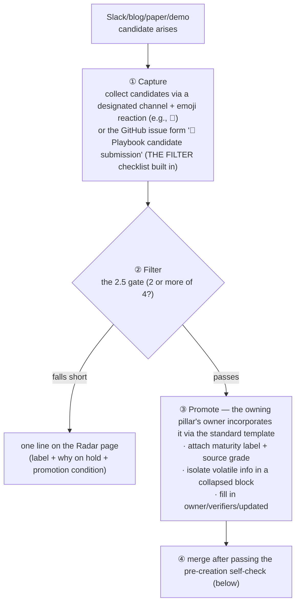

# Maintenance — Ownership · Update Rules · Promotion Pipeline

_Last updated: 2026-07 · owner: Youngjin · volatility: low_
[← back to index](index.md)

> **L0 TL;DR**: This defines the **structure that keeps this playbook from going stale**. It separates volatile from stable information, attaches an owner, update date, and volatility to every item, and filters Slack candidates through a gate before promotion. **This page is itself the operating rules.**

---

## Volatile / stable separation

A playbook goes stale because it mixes volatile and stable information. We isolate them structurally.

| Layer | Content | Where | Update cadence |
|---|---|---|---|
| **Stable layer** | Principles · architecture patterns · sim-to-real methodology · decision trees | Pillar body (L0/L1) | Rarely |
| **Volatile layer** | Model versions · GPU price/availability · Preview→GA transitions · benchmark numbers · regions | Each item's `<details>` collapsed block or the [Radar](radar.md) | Often (monthly–quarterly) |

> **Rule**: Volatile information **must be isolated in collapsed blocks/tables**. Do not embed version numbers in the body (stable layer). Updating should touch only the collapsed block.

---

## Required metadata

**Do not create an item without an owner.** At the bottom of every page and item:

```
_owner: {name} · verified by: {name, name…} · updated: {YYYY-MM} · volatility: high/medium/low_
```

- `owner`: **always exactly one person** (single-accountability principle). If undecided, mark as `TBD ⚠️` to **keep it on the books as debt** (do not hide it).
- `verified by` (optional): the people who performed primary-source verification (cross-checking official announcements, original papers, licenses) — **multiple allowed**, comma-separated. Omit if identical to the owner.
- `updated`: the year-month of last actual review. An absolute date (no relative dates).
- `volatility`: high/medium/low. Determines the staleness[^staleness] cadence.

> ✅ **All pages owner: Youngjin** — pillars P1–P5 · index · radar (assigned 2026-07) + decisions · maintenance (assigned 2026-08); the owner debt is closed.

---

## Staleness rules

When `updated` exceeds the threshold number of months, a **⏳ review needed** badge is placed at the top of the page.

| volatility | Review cadence | When exceeded |
|---|---|---|
| high | **1 month** | ⏳ review needed (model versions · GPU · regions · benchmarks) |
| medium | 3 months | ⏳ review needed |
| low | 6 months | ⏳ review needed (principles · trees) |

> High-volatility items (pillar-2/3/5, radar) get a shorter cadence. In particular, **AgentCore regions/features, model licenses, and EC2 instance GA** change quickly.

**⚙️ Automated**: badges are not placed manually. CI (`scripts/check_staleness.py`) **injects them automatically just before the build**, and a **daily 00:00 UTC cron redeploy** refreshes the badges without any push. If a page's `updated`/`volatility` metadata is missing, the build fails — the metadata is the contract.

---

## Inclusion Criteria (THE FILTER)

A candidate must meet **at least 2 of the 4** below to go into the body. If it falls short, it gets only a one-liner in the [Radar](radar.md).

- [ ] ⓐ **Validated in production or an actual customer deployment** (a demo video alone is insufficient)
- [ ] ⓑ **Concretely mappable to an AWS service/infrastructure**
- [ ] ⓒ **Has a history of an actual customer or SA asking about it**
- [ ] ⓓ **Is GA or has a clear GA roadmap**

> **Hype boundary**: a flashy humanoid demo masks a "mature capability." **Always separate "impressive demo" from "deployable."** (e.g., Figure 03 "8-hour autonomy" = demo vs Digit@GXO = validated)

### Maturity labels (required on every item)

`🟢 GA` / `🟡 Preview` / `🔵 Research-only` / `⚪ Hype (demo only)`

### Source grades (attached to every claim)

`[1] Official docs/paper` > `[2] AWS internal validation` > `[3] Vendor official blog` > `[4] Unverified (Slack/rumor)`

- For numbers/benchmarks, cite **date + source + measurement conditions**. (e.g., "humanoid 82,000 FPS — 4,096 envs · 1×RTX 4090, NVIDIA, 2026")
- Delete unverified claims or mark them clearly as `[4]`. **Do not state them as fact.**

---

## Standard Template

Promoted items are written in this format.

```
### {item name}  {maturity label}
**L0 TL;DR**: (1–2 sentences, what it is and when to use it)
**Customer need/problem**: (in what situation does it come up)
**Solution overview**: (core approach + source grade)
**AWS mapping**: (specific services)
**Decision criteria**: (when to use this / when to use the alternative — state conditions)
**Customer case**: (if any; otherwise "case pending")
**➡️ Next action**: (demo/workshop/asset link — always filled in)
**🔗 Related assets**: (internal skill/workshop/deck deep link)
---
_owner: {name} · verified by: {name, name…} · updated: {YYYY-MM} · volatility: high/low_
```

**Enforce the depth hierarchy**: L0 at the very top. L2 deep-dives are separated into `<details>` folds/links to keep the body short.

- **Executive-page (exec/exec-guide) principle**: no new technical claims — carry only executive-language translations of the pillar/radar verification verdicts.

**Glossary-footnote convention (ongoing)**: whenever content is added or updated, handle terms an SA can't immediately parse with `[^label]` footnotes in the same change — reuse an existing label if one exists; for a new term, add a "**Term** — 1–2 sentence explanation" entry to the `<!-- 용어 각주 -->` block at the very bottom of the page. If a verified official video exists, attach a 🎥 link at the end of the definition (cross-check title and channel via the oEmbed[^oembed] response before merging). Markers go only at the first body occurrence — never in headings or mermaid blocks. Labels are mechanical identifiers and must never be translated; apply identically across all 4 languages (same labels, same URLs) — detailed rules in `i18n/glossary.md`.

---

## playbook promotion pipeline



### Roles

| Role | Responsibility |
|---|---|
| **Capture owner** | Monitor the channel, collect emoji candidates |
| **Verifiers (multiple allowed)** | Primary-source verification of intake items — cross-check official announcements, original papers, and licenses. Participants are recorded in the promotion issue and the item's `verified by:` field |
| **Pillar owner** | Gate judgment, promote/Radar decision, template authoring, updates |
| **Playbook maintainer (Youngjin)** | Staleness badges, structural consistency, quarterly review |

---

## Pre-creation self-check (before merging each page)

- [ ] Do all included items pass 2 or more inclusion criteria? Did you avoid putting anything that falls short into the body?
- [ ] Does every item have a maturity label + source grade?
- [ ] Does every item end with "➡️ Next action"?
- [ ] Did you avoid describing something demo-only as if it were deployable?
- [ ] Did you avoid mixing volatile information into the stable layer?
- [ ] Does every item have owner/updated?
- [ ] Did you avoid stating unverified information as fact?

> If any one fails, rewrite that page.

---

## Known technical debt (as of 2026-07)

1. ~~All items have no owner~~ → **All pages owner: Youngjin assigned** — P1–P5 · index · radar (2026-07), decisions · maintenance (2026-08), and the playbook-maintainer role (2026-08). All owner/role debt is closed.
2. ~~FAQ Top 10 is a seed~~ → **Expanded to Top 20 with a source column (2026-07)**. Remaining: re-rank by frequency once actual Slack inquiry history is available ([index](index.md)).
3. **Internal asset deep links not connected** — workshop/deck/skill links are in "confirm needed ⚠️" state.
4. **Insufficient domestic (Korea) customer cases** — mostly "case pending." Korean robotics companies are NVIDIA-aligned, so this is AWS whitespace.
5. **Some GitHub release years to be re-confirmed** — Isaac Sim 6.0.1 (🟡 Preview/Early Developer Release — latest GA is 5.1.0), Isaac Lab 2.3.2/3.0 tag years.
6. **Re-confirm single-source numbers** — Lotte 30%, DROID episode count, some vendor metrics.
7. **Zensical migration pending** — the successor to our build stack (Material for MkDocs). `mkdocs-static-i18n` is not yet supported by Zensical (Tier 2 backlog), so migrating now would break the 4-language build. **Migration condition: Zensical ships static-i18n support (or native multilingual) + strict validation & Korean slug compatibility confirmed.** Until then the footer notice stays truthful.

---

## This prompt is itself a living document

Look at the actual generation results and **adjust the inclusion criteria, template, and pillar weighting**. Master prompt: [`physical-ai-playbook-master-prompt.md`](https://github.com/comeddy/pai-playbook/blob/main/physical-ai-playbook-master-prompt.md).

---
_owner: Youngjin · updated: 2026-07 · volatility: low (operating rules — updated only when the rules change)_

<!-- 용어 각주 -->

[^staleness]: **staleness** — the degree to which a document or dataset has drifted from reality since its last review. This playbook sets an allowed window (1/3/6 months) per page via its volatility grade and automatically attaches a badge when it is exceeded.
[^oembed]: **oEmbed** — a standard API that returns a piece of content's embed information (title, author, etc.) as JSON from a single URL. Used to mechanically verify, before publishing, that a video link actually exists and that its title and channel match.
