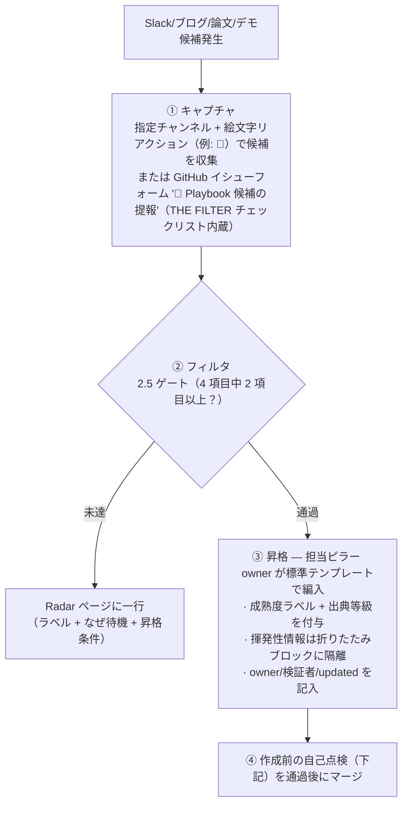

# Maintenance — 所有権 · 更新ルール · 昇格パイプライン


_最終更新: 2026-07 · owner: 未定 ⚠️ · volatility: 低_
[← index へ](index.md)

> **L0 TL;DR**: この playbook を **古びさせない構造** を定義します。揮発性/安定情報を分離し、すべての項目に所有者·更新日·揮発性を付け、Slack 候補をゲートでふるいにかけて昇格させます。**このページこそが運営ルール** です。

---

## 揮発性 / 安定 の分離

playbook が古びる理由は、揮発性情報と安定情報を混ぜてしまうことにあります。構造的に隔離します。

| 層 | 内容 | どこに | 更新周期 |
|---|---|---|---|
| **安定層** | 原理·アーキテクチャパターン·sim-to-real 方法論·意思決定ツリー | ピラー本文 (L0/L1) | まれに |
| **揮発性層** | モデルバージョン·GPU 価格/可用性·Preview→GA 移行·ベンチマーク数値·リージョン | 各項目の `<details>` 折りたたみブロックまたは [Radar](radar.md) | 頻繁（月～四半期） |

> **ルール**: 揮発性情報は **必ず折りたたみブロック/表に隔離** します。本文（安定層）にバージョン数値を埋め込みません。更新時に折りたたみブロックだけ手を入れれば済むように。

---

## 必須メタデータ

**所有者のない項目は作成しません。** すべてのページ·項目の下部に:

```
_owner: {名前} · 検証: {名前, 名前…} · updated: {YYYY-MM} · volatility: 高/中/低_
```

- `owner`: **常に 1 名**（責任単一化の原則）。未定であれば `未定 ⚠️` と表示し、**負債として残します**（隠しません）。
- `検証`（任意）: 一次ソース検証（公式発表・論文原文・ライセンスの照合）に参加した人 — **複数可**、カンマで列挙。owner と同一なら省略します。
- `updated`: 最後に実際にレビューした年月。絶対日付（相対日付は禁止）。
- `volatility`: 高/中/低。staleness 周期を決定します。

> ✅ **ピラー P1～P5・index・radar owner: Youngjin**（2026-07 指定）。decisions/maintenance はまだ `未定 ⚠️` — 残る負債です。

---

## Staleness ルール

`updated` が基準の月数を超えると、ページ上部に **⏳ 要レビュー** バッジを付けます。

| volatility | レビュー周期 | 超過時 |
|---|---|---|
| 高 | **1 か月** | ⏳ 要レビュー（モデルバージョン·GPU·リージョン·ベンチマーク） |
| 中 | 3 か月 | ⏳ 要レビュー |
| 低 | 6 か月 | ⏳ 要レビュー（原理·ツリー） |

> 揮発性が「高」の項目(pillar-2/3/5, radar)はより短い周期です。特に **AgentCore リージョン·機能、モデルライセンス、EC2 インスタンス GA** は変化が速いです。

**⚙️ 自動化済み**: バッジは手動で付けません。CI(`scripts/check_staleness.py`)が **ビルド直前に自動注入** し、**毎日 00:00 UTC の cron 再デプロイ** がプッシュなしでもバッジを更新します。ページの `updated`/`volatility` メタデータが欠落するとビルドが失敗します — メタデータこそが契約です。

---

## 包含基準 (THE FILTER)

候補は以下の **4 項目のうち最低 2 項目** を満たして初めて本文に載せます。未達なら [Radar](radar.md) に一行だけ。

- [ ] ⓐ **production または実際の顧客デプロイで検証済み**（デモ動画だけでは不十分）
- [ ] ⓑ **AWS サービス/インフラと具体的にマッピング可能**
- [ ] ⓒ **実際の顧客または SA が問い合わせた履歴がある**
- [ ] ⓓ **GA であるか、明確な GA ロードマップがある**

> **Hype 警戒**: 華やかなヒューマノイドデモが「成熟した能力」を覆い隠します。**「印象的なデモ」と「デプロイ可能」を必ず分けて表記します。**（例: Figure 03「8 時間自律」=デモ vs Digit@GXO=検証済み）

### 成熟度ラベル（全項目必須）

`🟢 GA` / `🟡 Preview` / `🔵 Research-only` / `⚪ Hype（デモのみ）`

### 出典等級（すべての主張に付与）

`[1] 公式文書/論文` > `[2] AWS 内部検証` > `[3] ベンダー公式ブログ` > `[4] 未検証（Slack/噂）`

- 数値·ベンチマークは **日付 + 出典 + 測定条件** を併記します。（例:「ヒューマノイド 82,000 FPS — 4,096 環境·1×RTX 4090, NVIDIA, 2026」）
- 未検証のものは削除するか `[4]` として明確にします。**事実のように断定するのは禁止です。**

---

## 標準テンプレート

昇格した項目はこの形式で作成します。

```
### {項目名}  {成熟度ラベル}
**L0 TL;DR**: (1～2文、何であり、いつ使うか)
**顧客ニーズ/課題**: (どんな状況で登場するか)
**ソリューション概要**: (中核アプローチ + 出典等級)
**AWS マッピング**: (具体的なサービス)
**意思決定基準**: (いつこれを/いつ代替を — 条件を明示)
**顧客事例**: (あれば。なければ「事例待ち」)
**➡️ 次のアクション**: (デモ/ワークショップ/資産へのリンク — 必ず埋める)
**🔗 関連資産**: (社内 skill/ワークショップ/deck のディープリンク)
---
_owner: {名前} · 検証: {名前, 名前…} · updated: {YYYY-MM} · volatility: 高/低_
```

**深度階層の強制**: L0 を最上部に。L2 deep-dive は `<details>` 折りたたみ/リンクで分離し、本文を短く保ちます。

**用語脚注の慣例**: コンテンツを追加・更新する際、SA がすぐに理解できない用語は同じ変更の中で `[^用語]` 脚注として処理します —— 既存の脚注 id があれば再利用し、新しい用語はページ下部の `<!-- 용어 각주 -->` ブロックに「**用語** —— 1～2文の説明」形式で追加します（有用な公式動画があれば 🎥 リンクを付け、oEmbed で実在を検証）。マーカーは本文の初出位置のみに置き、見出し・mermaid ブロックには禁止。4言語に同一に適用します（マーカー id 同一・URL 同一）。

---

## playbook 昇格パイプライン



### 役割

| 役割 | 責任 |
|---|---|
| **キャプチャ担当** | チャンネルの監視、絵文字候補の収集 |
| **検証担当（複数可）** | 流入項目の一次ソース確認 — 公式発表・論文原文・ライセンスの照合。参加者は昇格イシューと項目の `検証:` フィールドに記録 |
| **ピラー owner** | ゲート判定、昇格/Radar の決定、テンプレート作成、更新 |
| **playbook 管理者（未定 ⚠️）** | staleness バッジ、構造の一貫性、四半期レビュー |

---

## 作成前の自己点検（各ページのマージ前）

- [ ] 載せた項目はすべて包含基準を 2 項目以上通過したか？ 未達を本文に入れていないか？
- [ ] すべての項目に成熟度ラベル + 出典等級が付いているか？
- [ ] すべての項目が「➡️ 次のアクション」で終わっているか？
- [ ] デモのみのものをデプロイ可能なもののように記述していないか？
- [ ] 揮発性情報を安定層と混ぜていないか？
- [ ] すべての項目に owner/updated があるか？
- [ ] 未検証情報を事実として断定していないか？

> 一つでも失敗したら、そのページを書き直します。

---

## 既知の技術的負債（2026-07 時点）

1. ~~全項目 owner 未定~~ → **P1～P5・index・radar owner: Youngjin 指定完了(2026-07)**。decisions/maintenance の owner は未定 ⚠️。
2. ~~FAQ Top 10 がシード~~ → **Top 20 へ拡張 + 出典列を追加（2026-07）**。残り：Slack の実際の問い合わせ履歴を入手したら頻度順に再整列（[index](index.md)）。
3. **社内資産のディープリンク未接続** — ワークショップ/deck/skill リンクが「要確認 ⚠️」状態。
4. **韓国顧客事例の不足** — 大半が「事例待ち」。韓国ロボット企業が NVIDIA 陣営のため AWS ホワイトスペース。
5. **GitHub リリース年の一部再確認を推奨** — Isaac Sim 6.0.1(🟡 Preview/Early Developer Release — 最新 GA は 5.1.0)、Isaac Lab 2.3.2/3.0 タグの年。
6. **単一出典の数値の再確認** — Lotte 30%、DROID エピソード数、一部ベンダー指標。
7. **Zensical 移行待ち** — ビルドスタック（Material for MkDocs）の次世代。現在 `mkdocs-static-i18n` は Zensical 未対応（Tier 2 バックログ）のため、今移行すると 4 言語ビルドが壊れる。**移行条件：Zensical の static-i18n 対応（またはネイティブ多言語）のリリース + strict 検証・韓国語スラッグ互換の確認。** それまでフッター表記は事実のまま維持。

---

## このプロンプト自体も生きた文書です

実際の生成結果を見て **包含基準·テンプレート·ピラー重み付けを調整** してください。マスタープロンプト: `physical-ai-playbook-master-prompt.md`。

---
_owner: 未定 ⚠️ · updated: 2026-07 · volatility: 低（運営ルール — ルール変更時のみ更新）_
