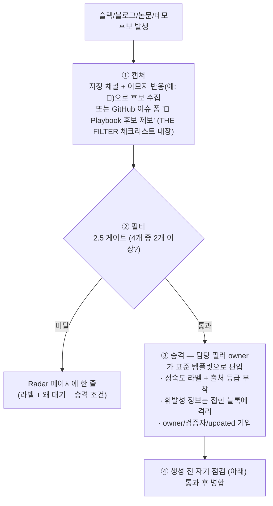

# Maintenance — 소유권 · 갱신 규칙 · 승격 파이프라인

_최종 갱신: 2026-07 · owner: 미정 ⚠️ · volatility: 낮음_
[← index로](index.md)

> **L0 TL;DR**: 이 playbook이 **안 낡게 만드는 구조**를 정의한다. 휘발성/안정 정보를 분리하고, 모든 항목에 소유자·갱신일·휘발성을 붙이고, 슬랙 후보를 게이트로 걸러 승격한다. **이 페이지가 곧 운영 규칙**이다.

---

## 휘발성 / 안정 분리

playbook이 낡는 이유는 휘발성 정보와 안정 정보를 섞기 때문이다. 구조적으로 격리한다.

| 층 | 내용 | 어디에 | 갱신 주기 |
|---|---|---|---|
| **안정층** | 원리·아키텍처 패턴·sim-to-real 방법론·의사결정 트리 | 필러 본문 (L0/L1) | 드물게 |
| **휘발성층** | 모델 버전·GPU 가격/가용성·Preview→GA 전환·벤치마크 수치·리전 | 각 항목의 `<details>` 접힌 블록 또는 [Radar](radar.md) | 자주 (월~분기) |

> **규칙**: 휘발성 정보는 **반드시 접힌 블록/표에 격리**. 본문(안정층)에 버전 숫자를 박아 넣지 않는다. 갱신 시 접힌 블록만 손대면 되게.

---

## 필수 메타데이터

**소유자 없는 항목은 생성하지 않는다.** 모든 페이지·항목 하단에:

```
_owner: {이름} · 검증: {이름, 이름…} · updated: {YYYY-MM} · volatility: 높음/중간/낮음_
```

- `owner`: **항상 1명**(책임 단일화 원칙). 미정이면 `미정 ⚠️`로 표시해 **부채로 남긴다**(숨기지 않는다).
- `검증`(선택): 1차 출처 검증(공식 발표·논문 원문·라이선스 대조)에 참여한 사람 — **복수 가능**, 쉼표로 나열. owner와 겸임이면 생략.
- `updated`: 마지막 실검토 연월. 절대 날짜(상대 날짜 금지).
- `volatility`: 높음/중간/낮음. staleness 주기를 결정.

> ✅ **필러 P1~P5·index·radar owner: Youngjin** (2026-07 지정). decisions/maintenance는 아직 `미정 ⚠️` — 남은 부채.

---

## Staleness 규칙

`updated`가 기준 개월 수를 넘으면 페이지 상단에 **⏳ 검토 필요** 배지를 단다.

| volatility | 검토 주기 | 초과 시 |
|---|---|---|
| 높음 | **1개월** | ⏳ 검토 필요 (모델 버전·GPU·리전·벤치마크) |
| 중간 | 3개월 | ⏳ 검토 필요 |
| 낮음 | 6개월 | ⏳ 검토 필요 (원리·트리) |

> 휘발성 '높음' 항목(pillar-2/3/5, radar)은 더 짧은 주기. 특히 **AgentCore 리전·기능, 모델 라이선스, EC2 인스턴스 GA**는 변화가 빠르다.

**⚙️ 자동화됨**: 배지는 수동으로 붙이지 않는다. CI(`scripts/check_staleness.py`)가 **빌드 직전에 자동 주입**하고, **매일 00:00 UTC cron 재배포**가 푸시 없이도 배지를 갱신한다. 페이지의 `updated`/`volatility` 메타데이터가 누락되면 빌드가 실패한다 — 메타데이터가 곧 계약이다.

---

## 포함 기준 (THE FILTER)

후보는 아래 **4개 중 최소 2개**를 충족해야 본문에 담는다. 미달이면 [Radar](radar.md)에 한 줄로만.

- [ ] ⓐ **production 또는 실제 고객 배포에서 검증됨** (데모 영상만으로는 불충분)
- [ ] ⓑ **AWS 서비스/인프라와 구체적으로 매핑 가능**
- [ ] ⓒ **실제 고객 또는 SA가 물어본 이력이 있음**
- [ ] ⓓ **GA이거나 명확한 GA 로드맵이 있음**

> **Hype 경계**: 화려한 휴머노이드 데모가 "성숙한 역량"을 가린다. **"인상적 데모"와 "배포 가능"을 반드시 분리 표기.** (예: Figure 03 "8시간 자율"=데모 vs Digit@GXO=검증)

### 성숙도 라벨 (모든 항목 필수)

`🟢 GA` / `🟡 Preview` / `🔵 Research-only` / `⚪ Hype(데모만)`

### 출처 등급 (모든 주장에 부착)

`[1] 공식 문서/논문` > `[2] AWS 내부 검증` > `[3] 벤더 공식 블로그` > `[4] 미검증(슬랙/소문)`

- 수치·벤치마크는 **날짜 + 출처 + 측정 조건** 병기. (예: "휴머노이드 82,000 FPS — 4,096환경·1×RTX 4090, NVIDIA, 2026")
- 미검증은 삭제하거나 `[4]`로 명확히. **사실처럼 단정 금지.**

---

## 표준 템플릿

승격된 항목은 이 형식으로 작성한다.

```
### {항목명}  {성숙도 라벨}
**L0 TL;DR**: (1~2문장, 무엇이고 언제 쓰는지)
**고객 니즈/문제**: (어떤 상황에서 등장하나)
**솔루션 개요**: (핵심 접근 + 출처 등급)
**AWS 매핑**: (구체 서비스)
**의사결정 기준**: (언제 이걸/언제 대안을 — 조건 명시)
**고객 사례**: (있으면. 없으면 "사례 대기")
**➡️ 다음 액션**: (데모/워크숍/자산 연결 — 반드시 채운다)
**🔗 관련 자산**: (사내 skill/워크숍/deck 딥링크)
---
_owner: {이름} · 검증: {이름, 이름…} · updated: {YYYY-MM} · volatility: 높음/낮음_
```

**깊이 계층 강제**: L0 최상단. L2 deep-dive는 `<details>` 접기/링크로 분리해 본문을 짧게.

**용어 각주**: 필러 페이지의 난해 용어는 본문에서 `[^라벨]`로 참조하고, 정의 블록은 페이지 최하단 `<!-- 용어 각주 -->` 주석 아래에 모은다. 검증된 공식 영상이 있으면 정의 끝에 🎥 링크를 붙인다(머지 전 URL 직접 확인 — oEmbed 응답으로 제목·채널 대조). 라벨은 번역 금지 — 상세 규칙은 `i18n/glossary.md` §3.

**용어 각주 관례**: 내용을 편입·갱신할 때 SA가 바로 이해하기 어려운 용어는 `[^용어]` 각주로 함께 처리한다 — 기존 각주 id가 있으면 재사용, 새 용어면 페이지 하단 `<!-- 용어 각주 -->` 블록에 "**용어** — 1~2문장 설명" 형식으로 추가한다(도움되는 공식 영상이 있으면 🎥 링크, oEmbed로 실존 검증). 마커는 본문 첫 등장 위치에만, 헤딩·mermaid 블록에는 금지. 4개 언어에 동일 적용(마커 id 동일·URL 동일).

---

## playbook 승격 파이프라인



### 역할

| 역할 | 책임 |
|---|---|
| **캡처 담당** | 채널 모니터, 이모지 후보 수집 |
| **검증 담당(복수 가능)** | 유입 항목의 1차 출처 확인 — 공식 발표·논문 원문·라이선스 대조. 참여자는 승격 이슈와 항목 `검증:` 필드에 기록 |
| **필러 owner** | 게이트 판정, 승격/Radar 결정, 템플릿 작성, 갱신 |
| **playbook 관리자(미정 ⚠️)** | staleness 배지, 구조 일관성, 분기 리뷰 |

---

## 생성 전 자기 점검 (매 페이지 병합 전)

- [ ] 담은 항목이 전부 포함 기준 2개 이상 통과했는가? 미달을 본문에 넣지 않았는가?
- [ ] 모든 항목에 성숙도 라벨 + 출처 등급이 붙었는가?
- [ ] 모든 항목이 "➡️ 다음 액션"으로 끝나는가?
- [ ] 데모뿐인 것을 배포 가능한 것처럼 서술하지 않았는가?
- [ ] 휘발성 정보를 안정층과 섞지 않았는가?
- [ ] 모든 항목에 owner/updated가 있는가?
- [ ] 미검증 정보를 사실로 단정하지 않았는가?

> 하나라도 실패하면 해당 페이지를 다시 쓴다.

---

## 알려진 기술 부채 (2026-07 시점)

1. ~~전 항목 owner 미정~~ → **P1~P5·index·radar owner: Youngjin 지정 완료(2026-07)**. decisions/maintenance owner는 미정 ⚠️.
2. ~~FAQ Top 10이 시드~~ → **Top 20 확장 + 출처 표기 완료(2026-07)**. 잔여: Slack 실제 문의 이력 확보 시 빈도순 재정렬([index](index.md)).
3. **사내 자산 딥링크 미연결** — 워크숍/deck/skill 링크가 "확인 필요 ⚠️" 상태.
4. **국내 고객 사례 부족** — 대부분 "사례 대기". 국내 로봇 기업이 NVIDIA 정렬이라 AWS 화이트스페이스.
5. **GitHub 릴리스 연도 일부 재확인 권고** — Isaac Sim 6.0.1(🟡 Preview/Early Developer Release — 최신 GA는 5.1.0), Isaac Lab 2.3.2/3.0 태그 연도.
6. **단일 출처 수치 재확인** — Lotte 30%, DROID 에피소드 수, 일부 벤더 지표.
7. **Zensical 전환 대기** — 빌드 스택(Material for MkDocs)의 후속 세대. 현재는 `mkdocs-static-i18n`이 Zensical 미지원(Tier 2 백로그)이라 전환 시 4개 언어가 깨짐. **전환 조건: Zensical의 static-i18n 지원(또는 네이티브 다국어) 출시 + strict 검증·한국어 슬러그 호환 확인.** 그때까지 푸터 표기는 사실대로 유지.

---

## 이 프롬프트 자체도 살아있는 문서다

실제 생성 결과를 보고 **포함 기준·템플릿·필러 가중치를 조정**하라. 마스터 프롬프트: `physical-ai-playbook-master-prompt.md`.

---
_owner: 미정 ⚠️ · updated: 2026-07 · volatility: 낮음 (운영 규칙 — 규칙 변경 시에만 갱신)_
