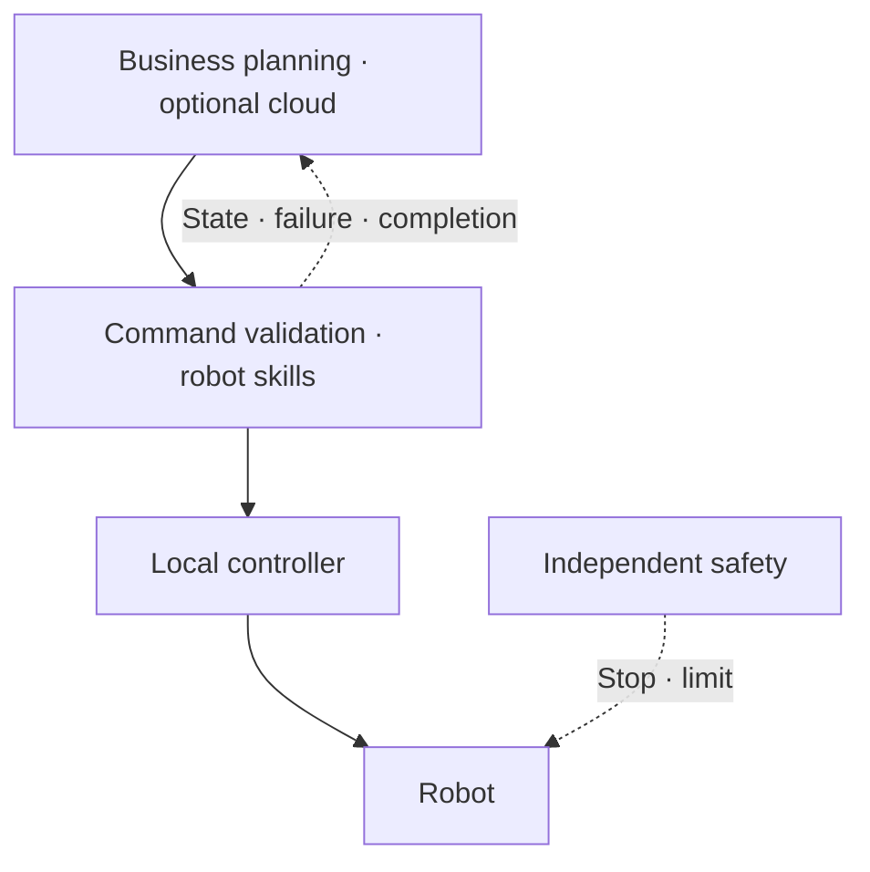

# Operations and recovery — cloud and robot responsibilities

_Last updated: 2026-09 · owner: Youngjin · volatility: medium_

**L0 TL;DR**: Separate business planning, robot skill execution, low-level control, and independent safety functions. This is a **design and test checklist**, not a claim of functional-safety certification or validated customer deployment.

## Four layers and owners { #layers }

| Layer | Role and placement | Owner |
|---|---|---|
| Business planning | Task requests, ordering, tool permissions. Cloud options such as AgentCore only when latency/data-processing requirements allow | Business/cloud team |
| Robot skills | Command validity, execution state, observation-based policies, cancellation/recovery. Keep outage-critical functions on site | Robotics/ML/SI |
| Low-level control | Joint, force, and velocity control; local controllers meeting device deadlines and jitter[^jitter] requirements | Robot vendor/control team |
| Independent safety | Stops and speed/access limits based on risk assessment; designed and validated independently of LLM/cloud connectivity | Site safety owner/qualified integrator |

**Model structure and placement are separate.** [Helix](https://www.figure.ai/news/helix) runs both System 2 and System 1 onboard `[1]`. Do not use that split as evidence for AgentCore/Jetson placement. AgentCore Policy restricts tool access through Gateway; it does not replace controllers checking physical state or safety devices ([AWS Policy](https://docs.aws.amazon.com/bedrock-agentcore/latest/devguide/policy.html)).

## Command and state contract { #contract }

Design example: include `command_id`, target robot, `issued_at`, `expires_at`, allowed skill/parameters, required model version, and preconditions. The edge checks expiry, permissions, and preconditions; duplicate IDs return the existing result without a new action. Define how deduplication survives restarts.

Example states: `accepted → running → succeeded / failed / cancelled / timed_out`. A transport ACK is not physical completion. Distinguish confirmed completion from unknown state; do not automatically reissue commands with uncertain outcomes.

## Failure tests { #failure }

| Scenario | Agreed behavior | Passing evidence |
|---|---|---|
| Network loss | Continue only preapproved local tasks or enter a defined safe state; discard stale queued commands on reconnect | Outage/reconnect timestamps and executed command/state log |
| Duplicate/expired command | Reject repeated execution and expired actions | Same-ID retry and delayed-delivery tests |
| Cancellation/timeout | Run local cancellation, confirm physical stop/completion, hand over to a person when required | Cancellation latency and final physical state |
| Missing observations/model failure | Defined fallback or stop; request human intervention | Camera blockage/process termination test |
| Failed update | Restore the last working model/app/configuration bundle and verify compatibility | Signature/hash, versions, recovery logs, rerun outcome |
| Permission error | Block unauthorized skills/out-of-range parameters; retain audit trail | Denial tests and operator traceability |

## Release approval and observability { #release }

Record success numerator/denominator and conditions, cycle time, interventions/hour, observation-to-action median and p95/p99 latency[^percentile], device availability, recovery time, and cost. Do not hide tail latency behind averages.

Progression: offline replay → simulation → supervised limited physical trial → small fleet → expansion. Each stage must pass the [pilot card](start.md#pilot). Release bundles include model/data/code versions, device compatibility, test outcomes, rollback target, and approver.

**Data boundaries**: record storage and inference-processing Regions separately. Seoul availability alone does not guarantee processing within Korea. See [evidence records](evidence.md#agentcore-residency) for Memory/Evaluations cross-region paths.

**➡️ Next action**: cloud, robotics, and site owners complete the failure matrix and handover procedure together; expand deployment only after testing disconnection, cancellation, and recovery.

<!-- 용어 각주 -->
[^jitter]: **Jitter** — Variation in execution or communication delay. Low average latency can still miss control deadlines when variation is large.
[^percentile]: **p95/p99 latency** — The value at or below which 95%/99% of measurements fall. Inspect the remaining slow requests and worst cases separately.

_owner: Youngjin · updated: 2026-09 · volatility: medium_
