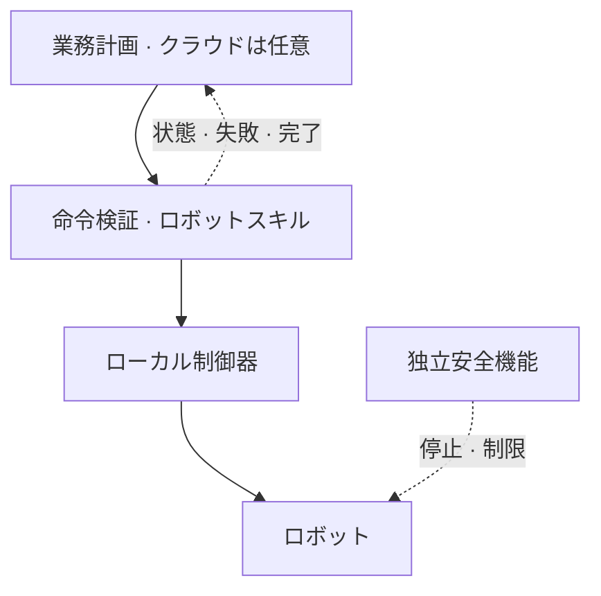

# 運用と復旧 — クラウドとロボットの責任分界

_最終更新: 2026-09 · owner: Youngjin · volatility: 中_

**L0 TL;DR**: 業務計画、ロボットスキル実行、低レベル制御、独立した安全機能を分けます。本ページは**設計・試験チェックリスト**であり、機能安全認証や顧客導入の検証済み実績を意味しません。

## 4階層と責任者 { #layers }

| 階層 | 役割と配置条件 | 責任者 |
|---|---|---|
| 業務計画 | 作業要求、順序、ツール権限。遅延・データ処理条件を満たす場合にAgentCoreなどのクラウドを使用 | 業務・クラウド担当 |
| ロボットスキル | 命令の有効性、状態、観測に基づくポリシー、取消・復旧。通信断で必要な機能は現場に配置 | ロボット・ML/SI |
| 低レベル制御 | 関節・力・速度制御。機器の期限・ジッター[^jitter]要件を満たすローカル制御器 | メーカー・制御担当 |
| 独立安全機能 | リスク評価に基づく停止・速度/接近制限。LLMやクラウド接続から独立して設計・検証 | 現場安全責任者・適格な統合者 |

**モデル構造と配置は別です。** [Helix](https://www.figure.ai/news/helix)のSystem 2とSystem 1は両方ともオンボードで動作します `[1]`。この分離をAgentCore/Jetson配置の根拠にしません。AgentCore PolicyはGateway経由のツールアクセスを制限しますが、物理状態を確認する制御器や安全装置の代替ではありません（[AWS Policy](https://docs.aws.amazon.com/bedrock-agentcore/latest/devguide/policy.html)）。

## 命令と状態の契約 { #contract }

設計例：命令に`command_id`、対象ロボット、`issued_at`、`expires_at`、許可スキル・パラメータ、必要モデル版、前提条件を含めます。エッジで期限・権限・前提条件を確認し、重複IDには新しい動作をせず既存結果を返します。再起動後の重複排除の保持範囲も決めます。

状態例：`accepted → running → succeeded / failed / cancelled / timed_out`。通信ACKは物理作業の完了ではありません。完了確認と不明状態を分け、不明な命令を自動再発行しません。

## 障害試験 { #failure }

| 状況 | 合意する動作 | 合格の証拠 |
|---|---|---|
| 通信断 | 事前許可したローカル作業のみ継続、または定義済み安全状態へ。再接続時に古いキューを破棄 | 切断・復帰時刻、実行命令・状態ログ |
| 重複・期限切れ | 重複実行・期限切れ動作を拒否 | 同じIDの再送・遅延配送試験 |
| 取消・タイムアウト | ローカル取消を実行し、実停止・完了を確認。必要に応じて人へ引継ぎ | 取消遅延・最終物理状態 |
| 観測欠落・モデル障害 | 定義済み代替動作または停止、人の介入を要求 | カメラ遮断・プロセス終了試験 |
| 更新失敗 | 正常だったモデル・アプリ・設定の組へ復旧し互換性を確認 | 署名・ハッシュ、版、復旧ログ・再実行結果 |
| 権限誤設定 | 未許可スキル・範囲外パラメータを拒否し監査記録を保持 | 拒否試験・操作者追跡 |

## 配備承認と観測 { #release }

成功数/試行数と条件、作業時間、時間当たり介入数、観測から動作までの遅延中央値・p95/p99[^percentile]、稼働率、復旧時間、費用を記録します。平均値で遅いケースを隠しません。

順序：オフライン再生 → シミュレーション → 監督下の限定実機試験 → 少数機 → 拡大。各段階で[パイロットカード](start.md#pilot)を満たします。配備パッケージにはモデル・データ・コードの版、機器互換性、試験結果、復旧先、承認者を含めます。

**データ境界**：保存リージョンと推論処理リージョンを別々に記録します。ソウル対応だけで韓国内の処理を保証しません。Memory・Evaluationsのクロスリージョン経路は[根拠記録](evidence.md#agentcore-residency)を確認します。

**➡️ 次のアクション**：クラウド・ロボット・現場担当者が障害試験表と引継ぎ手順を共同作成し、切断・取消・復旧試験を通過してから配備を広げます。

<!-- 용어 각주 -->
[^jitter]: **ジッター（jitter）** — 実行・通信遅延のばらつきです。平均遅延が小さくても大きなばらつきで制御期限を逃す場合があります。
[^percentile]: **p95/p99遅延** — 測定値の95%/99%がその値以下になる遅延です。残りの遅い要求や最悪ケースも別に確認します。

_owner: Youngjin · updated: 2026-09 · volatility: 中_
