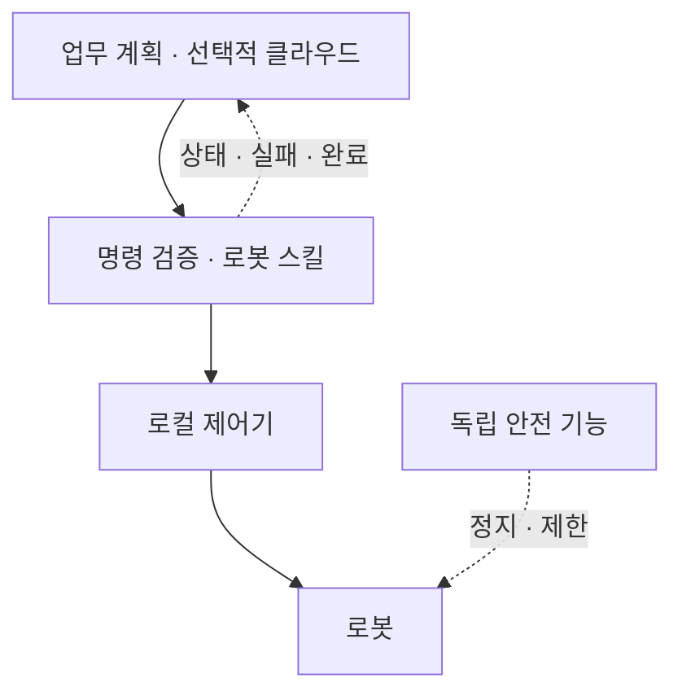

# 운영·복구 — 클라우드와 로봇의 책임 경계

_최종 갱신: 2026-09 · owner: Youngjin · volatility: 중간_

**L0 TL;DR**: 업무 계획, 로봇 스킬 실행, 저수준 제어, 독립 안전 기능을 구분한다. 이 페이지는 **설계·시험 체크리스트**이며 기능안전 인증이나 검증된 고객 배포를 주장하지 않는다.

## 네 계층과 담당자 { #layers }

| 계층 | 역할·배치 기준 | 책임자 |
|---|---|---|
| 업무 계획 | 작업 요청·순서·툴 권한. 지연·데이터 처리 조건을 충족하면 AgentCore 등 클라우드 사용 가능 | 업무·클라우드 담당 |
| 로봇 스킬 실행 | 명령 유효성, 실행 상태, 관측 기반 정책, 취소·복구. 네트워크 단절 중 필요한 기능은 현장에 둠 | 로봇·ML/SI |
| 저수준 제어 | 관절·힘·속도 제어. 장치별 기한·지터[^jitter]를 보장할 로컬 컨트롤러 | 로봇 제조사·제어 담당 |
| 독립 안전 기능 | 위험 평가에 따른 정지·속도/접근 제한. LLM·클라우드 연결과 독립적으로 작동하도록 설계·검증 | 현장 안전 책임자·적격 통합자 |

**모델 구조와 배치는 별개다.** [Helix](https://www.figure.ai/news/helix)의 System 2와 System 1은 둘 다 온보드다 `[1]`. 그 분리를 AgentCore/Jetson 배치의 증거로 쓰지 않는다. AgentCore Policy는 Gateway를 통한 툴 접근을 제한하는 층이며, 물리 상태를 검증하는 로봇 컨트롤러나 안전장치를 대체하지 않는다([AWS Policy](https://docs.aws.amazon.com/bedrock-agentcore/latest/devguide/policy.html)).

## 명령과 상태 계약 { #contract }

설계 예시: 명령마다 `command_id`, 대상 로봇, `issued_at`, `expires_at`, 허용된 스킬·파라미터, 요구 모델 버전, 사전 조건을 담는다. 엣지는 만료·권한·사전 조건을 검사하고, 중복 ID는 새 동작을 실행하지 않고 기존 결과를 반환하도록 구현한다. 재시작 후에도 중복 실행을 막을 보존 범위를 정한다.

상태 예시: `accepted → running → succeeded / failed / cancelled / timed_out`. 통신 ACK는 물리 작업 완료가 아니다. 실제 완료 확인과 불확실 상태를 구분하고, 불확실한 명령을 자동 재발행하지 않는다.

## 장애 시험 표 { #failure }

| 상황 | 합의할 동작 | 통과 증거 |
|---|---|---|
| 네트워크 단절 | 사전 허용된 로컬 작업만 지속하거나 정의된 안전 상태로 전환. 재접속 시 오래된 큐 폐기 | 단절·재접속 시간, 실행 명령·상태 기록 |
| 중복·만료 명령 | 중복 실행·유효기간 지난 동작 거부 | 동일 ID 재전송과 지연 전달 시험 |
| 취소·시간 초과 | 로컬 취소 절차 실행, 실제 정지·완료 상태 확인, 필요 시 사람에게 인계 | 취소 지연과 최종 물리 상태 |
| 관측 누락·모델 실패 | 정의된 대체 동작 또는 정지, 사람 개입 요청 | 카메라 차단·프로세스 종료 시험 |
| 업데이트 실패 | 이전 정상 모델·앱·설정 묶음으로 복구. 데이터/설정 호환성 확인 | 서명·해시, 버전, 복구 로그와 재실행 결과 |
| 권한 오설정 | 승인하지 않은 스킬·범위 밖 파라미터 차단, 감사 기록 | 거부 시험·운영자 추적 |

## 배포 승인과 관측 { #release }

기록 항목: 성공률의 분자/분모·조건, 작업 시간, 시간당 사람 개입, 관측→동작 지연의 중앙값·p95/p99[^percentile], 장치 가용성, 복구 시간, 비용. 평균만으로 최악 지연을 숨기지 않는다.

승인 순서: 오프라인 재생 → 시뮬레이션 → 감독하의 제한된 실기 시험 → 소수 장치 → 확대. 각 단계는 [파일럿 카드](start.md#pilot)의 기준을 충족해야 한다. 배포 묶음에는 모델·데이터·코드 버전, 장치 호환성, 시험 결과, 복구 대상, 승인자를 포함한다.

**데이터 처리 경계**: 저장 리전과 추론 처리 리전을 별도로 기록한다. AgentCore 서울 지원만으로 국내 처리를 보장하지 않는다. Memory·Evaluations 등의 교차 리전 경로는 [근거 기록](evidence.md#agentcore-residency)에서 확인한다.

**➡️ 다음 액션**: 클라우드·로봇·현장 책임자가 장애 시험 표와 인계 절차를 함께 작성하고, 실제 단절·취소·복구 시험을 통과한 뒤 배포 범위를 넓힌다.

<!-- 용어 각주 -->
[^jitter]: **지터(jitter)** — 반복 실행이나 통신의 지연이 매번 달라지는 정도. 평균 지연이 낮아도 큰 편차가 있으면 제어 기한을 놓칠 수 있다.
[^percentile]: **p95/p99 지연** — 측정값의 95%/99%가 그 값 이하인 지연. 나머지 느린 요청과 최악 사례도 별도로 살펴야 한다.

_owner: Youngjin · updated: 2026-09 · volatility: 중간_
