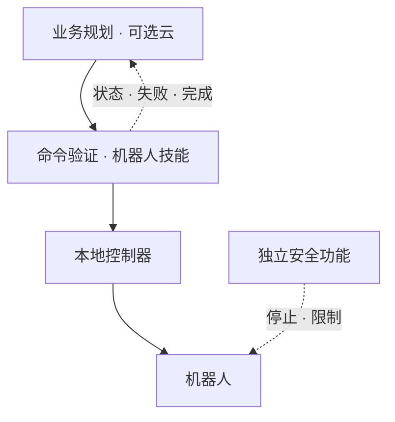

# 运营与恢复 — 云与机器人的责任边界

_最后更新: 2026-09 · owner: Youngjin · volatility: 中_

**L0 TL;DR**: 区分业务规划、机器人技能执行、底层控制和独立安全功能。本页是**设计及测试清单**，不代表功能安全认证或已验证的客户部署。

## 四层及负责人 { #layers }

| 层 | 职责及部署条件 | 负责人 |
|---|---|---|
| 业务规划 | 任务请求、顺序、工具权限；满足延迟及数据处理条件时可采用 AgentCore 等云服务 | 业务/云团队 |
| 机器人技能 | 命令有效性、执行状态、基于观测的策略、取消恢复；断网必需功能保留在现场 | 机器人/ML/SI |
| 底层控制 | 关节、力、速度控制；满足设备时限和抖动[^jitter]要求的本地控制器 | 机器人厂商/控制团队 |
| 独立安全 | 基于风险评估的停止、速度/接近限制；独立于 LLM 及云连接设计验证 | 现场安全负责人/合格集成商 |

**模型结构与部署位置是两回事。** [Helix](https://www.figure.ai/news/helix) 的 System 2 和 System 1 均在板载设备运行 `[1]`，不能据此证明 AgentCore/Jetson 的部署划分。AgentCore Policy 限制经 Gateway 的工具访问，不替代检查物理状态的控制器或安全装置（[AWS Policy](https://docs.aws.amazon.com/bedrock-agentcore/latest/devguide/policy.html)）。

## 命令与状态契约 { #contract }

设计示例：每条命令包含 `command_id`、目标机器人、`issued_at`、`expires_at`、允许的技能/参数、模型版本及前置条件。边缘检查过期、权限、前置条件；重复 ID 返回已有结果，不产生新动作。规定重启后的去重保留范围。

状态示例：`accepted → running → succeeded / failed / cancelled / timed_out`。传输 ACK 不等于物理任务完成。区分已确认完成和未知状态，不自动重发结果不确定的命令。

## 故障测试 { #failure }

| 情景 | 约定行为 | 通过证据 |
|---|---|---|
| 断网 | 仅继续预先允许的本地任务或进入定义的安全状态；重连丢弃过期队列 | 断网重连时间、已执行命令及状态日志 |
| 重复/过期命令 | 拒绝重复执行及过期动作 | 同 ID 重试、延迟投递测试 |
| 取消/超时 | 本地取消，确认实际停止/完成，必要时交接人工 | 取消延迟、最终物理状态 |
| 观测缺失/模型故障 | 定义的替代动作或停止，请求人工 | 遮挡相机、终止进程测试 |
| 更新失败 | 恢复此前正常的模型/应用/配置组合并检查兼容性 | 签名/哈希、版本、恢复日志及重跑结果 |
| 权限错误 | 拒绝未授权技能及越界参数，保留审计记录 | 拒绝测试、操作人追踪 |

## 发布批准与观测 { #release }

记录成功分子/分母及条件、周期、每小时人工介入、观测到动作延迟的中位数及 p95/p99[^percentile]、设备可用性、恢复时间及费用。不要用平均值掩盖尾部延迟。

顺序：离线回放 → 仿真 → 有人监督的有限实机测试 → 小规模设备 → 扩大。每阶段须满足[试点卡](start.md#pilot)。发布包包含模型/数据/代码版本、设备兼容性、测试结果、回退目标及批准人。

**数据边界**：分别记录存储区域与推理处理区域。首尔可用不保证在韩国境内处理。Memory/Evaluations 的跨区域路径见[证据记录](evidence.md#agentcore-residency)。

**➡️ 后续行动**：云、机器人、现场负责人共同填写故障测试表及交接流程；通过断网、取消、恢复测试后再扩大部署。

<!-- 용어 각주 -->
[^jitter]: **抖动（jitter）** — 执行或通信延迟的变化程度。平均延迟较低，仍可能因波动大而错过控制时限。
[^percentile]: **p95/p99 延迟** — 95%/99% 测量值不超过的延迟。还需单独检查其余慢请求及最坏情况。

_owner: Youngjin · updated: 2026-09 · volatility: 中_
