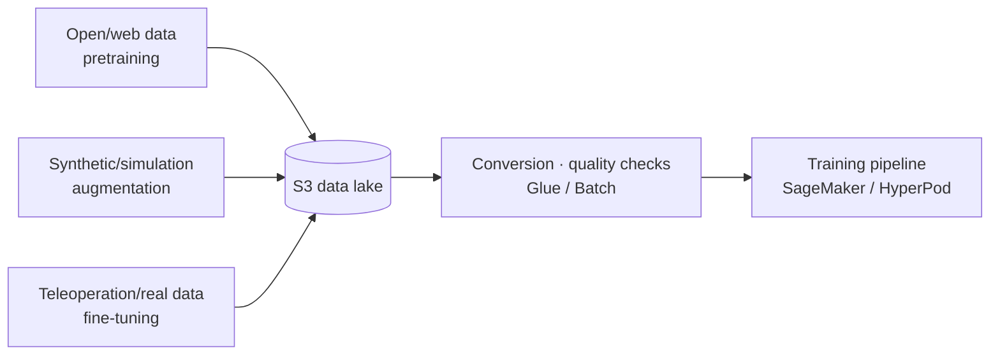
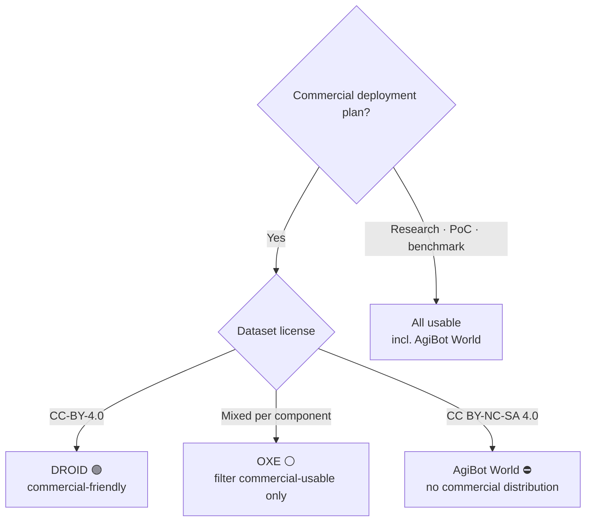
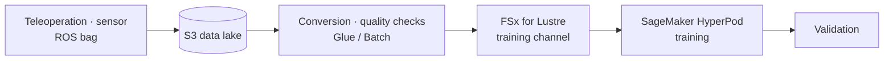

# Pillar 1 — Data Collection & Processing

_Last updated: 2026-07 · owner: comeddy · volatility: medium (dataset versions/sizes are high)_
_Unless separately noted, each item inherits the page metadata (owner/updated/volatility). When an item has its own owner, add an item footer._
[← back to index](index.md)

> **L0 TL;DR**: The bottleneck in Physical AI is not the model architecture but the **volume, diversity, and quality of robot behavior data**. Real data (teleoperation) is expensive and slow, open datasets are **a licensing minefield**, and synthetic data has only now become a practical pipeline. The SA's role is to design "where to get the data, and through which pipeline on AWS to turn it into a trainable form."

---

## Top 3 questions customers ask most in this pillar

1. **"Where do I get robot learning data? Can I just use open datasets?"** → [Open robot datasets](#1-open-robot-datasets--ga) (⚠️ check the license first)
2. **"I'm short on real data — can I fill the gap with synthetic data?"** → [Synthetic data generation](#2-synthetic-data-generation--isaac-sim-sdg--replicator--ga), [Cosmos WFM](#3-nvidia-cosmos-world-foundation-models--ga-open-models--aws-is-self-hosted-compute)
3. **"How do I turn our robot's teleoperation / ROS bag data into a training pipeline on AWS?"** → [Data pipeline reference architecture](#4-robot-learning-data-pipeline-reference-architecture--ga), [Formats & conversion](#5-data-formats--conversion--lerobot-v3--rlds--ga)

> **Stable principle (rarely changes)**: robot data is (1) **teleoperation/real data** — high quality, high cost, low diversity; (2) **synthetic/simulation data** — low cost, high diversity, with a domain gap; (3) **open/web data** — for pretraining, mind the license. The practical recipe is almost always a 3-stage mix: **"open-dataset pretraining → synthetic-data augmentation → small-batch real-demo fine-tuning."**

---

## 1. Open robot datasets  🟢 GA

**L0 TL;DR**: The de facto standard corpus for VLA pretraining. But because **each dataset's license governs whether commercial distribution is allowed**, if the customer plans to ship model weights commercially, a license audit is the first step.

**Customer need/problem**: "We can't afford to collect data from scratch and want to start with what's public. But can we use this in a commercial product?"

**Solution overview** `[1]`:

- **[Open X-Embodiment (OXE)](https://robotics-transformer-x.github.io/)** — ~1M+ episodes, 22 embodiments, integrating ~60 datasets. The standard pretraining corpus for OpenVLA · RT-2-X · π0 · GR00T. ⚠️ **Licenses differ per component** (mostly CC-BY-4.0/Apache-2.0, some research-only) → for commercial use, a component-level legal audit is mandatory. `[1]` arxiv 2310.08864
- **[DROID](https://droid-dataset.github.io/)** — 76,000 teleoperation trajectories, 350 hours, Franka. License **CC-BY-4.0** (commercial-friendly). The standard for the fine-tuning stage. `[1]` droid-dataset.github.io
- **[AgiBot World](https://agibot-world.com/)** — ~1,003,672 trajectories (~43.8TB), the largest scale. ⚠️ **License CC BY-NC-SA 4.0 = non-commercial**. Fine for research/benchmarks, but **commercial derivative weights cannot be distributed**. `[1]` arxiv 2503.06669
- **[RoboMIND](https://arxiv.org/abs/2412.13877)** — 107k trajectories, 4 embodiments, includes 5k failure demos (valuable). License needs re-confirmation on HF. `[1]` arxiv 2412.13877

**AWS mapping**: S3 (data lake) + FSx for Lustre (high-speed channel without downloading during training) + SageMaker/HyperPod. Datasets are mirrored to S3 from the Hugging Face Hub or the source before use.

**Decision criteria**:

- Commercial-product goal → **centered on DROID / RoboMIND (confirm license)**, exclude AgiBot World, and filter OXE to commercially usable components only.
- Research/PoC/internal benchmark → all usable (including AgiBot World).
- If the target embodiment (your own robot) differs in form, use them only for pretraining and assume real-demo fine-tuning.

**Customer case**: case pending (no public Korean case confirmed — many Korean robotics companies are currently NVIDIA-aligned).

**➡️ Next action**: if the customer has a commercial plan, **① confirm the target embodiment → ② provide a dataset license audit sheet (per OXE component) → ③ propose an "S3 mirroring + FSx Lustre training channel" PoC**. Flagging the license risk in the first meeting alone builds trust.

**🔗 Related assets**: (internal dataset license audit template — needs to be written ⚠️)

🔄 Volatile data (versions/sizes — subject to update)

| Dataset | Scale | License | Commercial | Checked |
|---|---|---|---|---|
| OXE | ~1M+ ep, 22 embodiments | mixed per component | partial (audit needed) | 2026-07 |
| DROID | 76,000 trajectories, 350h | CC-BY-4.0 | ✅ | 2026-07 |
| AgiBot World | ~1.0M trajectories, 43.8TB | CC BY-NC-SA 4.0 | ❌ non-commercial | 2026-07 |
| RoboMIND | 107k trajectories, 5k failures | HF confirmation needed | ⚠️ unconfirmed | 2026-07 |

_Note: some aggregators list DROID as "92,233 ep / Apache-2.0," but this is presumed to be a LeRobot-v3 repack; the official figures are 76k / CC-BY-4.0. Use the official values when citing._

---

## 2. Synthetic data generation — Isaac Sim SDG + Replicator  🟢 GA

**L0 TL;DR**: For perception/manipulation tasks short on real data, a simulator can **generate a large volume of training data with annotations attached automatically**. NVIDIA Isaac Sim 5.x is GA and open source, so the entry barrier is low.

**Customer need/problem**: "We have almost no data for our factory/warehouse environment, and can't afford the labeling cost. Can we create it with simulation?"

**Solution overview** `[1]`: With [Isaac Sim](https://developer.nvidia.com/isaac/sim)'s **Replicator**, generate synthetic images/segmentation/bounding boxes based on domain randomization (lighting, texture, pose, camera) programmatically (Replicator Functional API). Isaac Sim **5.0 GA (2025-08 SIGGRAPH)**, open source (GitHub), 5.1 GA, and 6.0 is the GTC'26 early developer release (2026-03/06). `[1]` developer.nvidia.com, github.com/isaac-sim

**AWS mapping**: run Isaac Sim on EC2 **G6e** (L40S) · **G7e** (RTX PRO 6000 Blackwell) GPU instances + parallelize large-scale offline data-generation jobs with **AWS Batch** + store in S3. Remote streaming via NICE DCV (→ see [pillar-3](pillar-3.md)).

**Decision criteria**:

- Perception tasks (detection/segmentation/pose estimation) → very high ROI for synthetic data (labels are free).
- Manipulation policy → synthetic-only leaves a large domain gap. Always pair with real-demo fine-tuning + sim-to-real methodology (→ [pillar-4](pillar-4.md)).
- Isaac Sim vs open source (Genesis/MuJoCo) choice → [decisions](decisions.md).

**Customer case**: case pending (no explicit Korean case confirmed).

**➡️ Next action**: **propose an "Isaac Sim SDG pipeline on EC2 G6e/G7e + AWS Batch" workshop**. If the customer has CAD/USD assets of their real environment, demo a synthetic-dataset sample generation in a 1-day PoC.

**🔗 Related assets**: [pillar-3 Simulation](pillar-3.md) · (internal Isaac-on-AWS workshop deck — confirm needed ⚠️)

---

## 3. NVIDIA Cosmos World Foundation Models  🟢 GA (open models · AWS is self-hosted compute)

**L0 TL;DR**: Foundation models that predict/generate the physical world, used for data augmentation by producing simulation assets, future frames, and behavior simulations. Because the weights are open, they **can be self-hosted on AWS compute (EKS/Batch/G7e)** — but ⚠️ AWS is not an NVIDIA-named managed host for Cosmos (→ [pillar-3](pillar-3.md)). "Training deployable policies from world-model-generated data" is also still at the early-adopter stage.

**Customer need/problem**: "We can't build simulator scenes one by one. We want to auto-generate diverse realistic scenarios."

**Solution overview** `[1]/[3]`: Cosmos WFM provides synthetic world generation + vision reasoning + behavior simulation. **Cosmos 3** is the latest (released 2026-05-31, announced at GTC Taipei 2026-06). FieldAI · Skild AI · Generalist AI and others use it for data generation. `[1]` nvidianews.nvidia.com

- ⚠️ **Hype boundary**: an "impressive generation demo" is different from "a policy trained on this data is in real deployment." The latter currently exists only in a handful of early-adopter cases → treat its real-world maturity as **Preview level**.

**AWS mapping** `[3]`: a **self-hosted reference architecture** — the customer runs Cosmos NIM containers themselves on **Amazon EKS** (real time) or **AWS Batch** (large-scale offline synthetic data generation). What is GA is the AWS compute services (EKS/Batch/G7e), not a "Cosmos-on-AWS product." `[3]` aws.amazon.com/blogs/hpc/running-nvidia-cosmos-world-foundation-models-on-aws

**Decision criteria**:

- Perception/navigation data needing large-scale diversity → worth trying.
- Making it the sole data source for precise manipulation policies → still risky. Position it as supplementary augmentation.

**Customer case**: **NAVER Labs** — uses Cosmos to build a "Seoul World Model" from street-view/spatial data (2026-06 NVIDIA agreement). ⚠️ **NVIDIA-aligned (not AWS)** `[3]`. **Doosan Robotics** — integrates Cosmos into its Agentic Robot OS (NVIDIA-aligned) `[3]`.

**➡️ Next action**: when a Korean robotics customer is interested in Cosmos → **propose from the angle of "open weights, so self-hostable on AWS EKS/Batch/G7e"** (drawing NVIDIA-aligned customers toward AWS compute). Be honest that it is not a managed host and that real-world training validation is at an early stage.

**🔗 Related assets**: [pillar-2 Model Training](pillar-2.md) · [pillar-3 Simulation](pillar-3.md)

---

## 4. Robot learning data pipeline reference architecture  🟢 GA

**L0 TL;DR**: collection (teleoperation/sensor/ROS bag) → S3 lake → conversion & quality checks → FSx Lustre training channel → HyperPod training → validation. The individual services are all GA, but **there is still no public end-to-end case for manipulation robots** (an honest whitespace).

**Customer need/problem**: "Our source data (robot logs, cameras, ROS bags) is just piling up in S3. We want to make it flow into a trainable form."

**Solution overview** `[1]`:

- **Collection/storage**: S3 (source data lake, with tiering for cost management)
- **Conversion/labeling**: AWS Glue/Batch (format conversion, quality filtering), and if needed SageMaker Ground Truth (labeling — though there is no public robot-specific case)
- **Training channel**: mount FSx for Lustre as a SageMaker training channel → high-speed reads without downloading
- **Training**: SageMaker HyperPod (→ [pillar-2](pillar-2.md))

**AWS mapping**: S3 · FSx for Lustre · Glue · Batch · SageMaker Ground Truth · HyperPod. (all GA)

**Decision criteria**:

- Dataset < a few TB, simple access pattern → S3 direct streaming (HyperPod/LeRobot streaming) is enough; FSx can be skipped.
- Repeated epochs, large scale, random-access bottleneck → adopt **FSx for Lustre**.
- Large labeling volume needing human review → Ground Truth. But robot data is usually auto-labeled (simulation/teleoperation records), so the need is low.

**Customer case**: **Zoox** — trains a multimodal AV foundation model with SageMaker HyperPod, 95% utilization on 64+ GPUs `[1]/[3]`. ⚠️ **This is autonomous driving (AV), not a manipulation robot** — use only as a basis for the reference architecture; do not exaggerate it as a manipulation case.

**➡️ Next action**: **draw the reference architecture diagram (S3→FSx→HyperPod) on a whiteboard**, and judge the need for FSx by the customer's data scale and access pattern. If ROS bags are the source, connect to item 5 below (the conversion gap).

**🔗 Related assets**: [pillar-2 Model Training](pillar-2.md) · [decisions: GPU-securing strategy](decisions.md)

---

## 5. Data formats & conversion — LeRobot v3 / RLDS  🟢 GA

**L0 TL;DR**: The two dominant robot data formats are **RLDS** (TFDS-based, consumed natively by VLA training pipelines) and **LeRobotDataset v3** (Parquet+MP4, the HF-ecosystem interchange standard). **ROS 2 bag → training-format conversion has no standard tool and requires custom work**, and this is an AWS pipeline opportunity.

**Customer need/problem**: "Our data is ROS 2 bags, but the VLA training code wants RLDS/LeRobot. How do we convert?"

**Solution overview** `[1]`:

- **[LeRobotDataset v3.0](https://github.com/huggingface/lerobot)** — bundles many episodes into a single Parquet, manages boundaries with MP4 video + metadata, Hub-native streaming. `lerobot >= 0.4.0`, latest **v0.6.0 (2026-07-06)**. NVIDIA is also redistributing datasets as LeRobot v3 (interchange standardization is progressing). `[1]` github.com/huggingface/lerobot
- **[RLDS](https://github.com/google-research/rlds)** — consumed natively by OpenVLA · RT-2-X · π0 · GR00T. Still the VLA training standard.
- ⚠️ **Gap**: the lerobot repo has **no native ROS 2 bag converter**. Large-scale rosbag2 → LeRobot/RLDS conversion is DIY.

**AWS mapping**: put a **custom rosbag2→LeRobot/RLDS converter on AWS Glue/Batch** as a container for large-scale parallel conversion + S3 storage. The HyperPod/training stage uses S3 streaming or FSx.

**Decision criteria**:

- Training framework is the LeRobot family → LeRobotDataset v3.
- Official recipes for the OpenVLA/GR00T/π family → RLDS.
- Source is ROS 2 bags → design the conversion job early in the pipeline (adding it later is costly).

**Customer case**: case pending.

**➡️ Next action**: if the customer's data is ROS bags, **propose including a "Glue/Batch-based rosbag2→LeRobot conversion job" on day 1 of the pipeline design** (an SA flagging this proactively builds great trust). Turn a reusable converter into an internal asset.

**🔗 Related assets**: (internal rosbag2 conversion converter — new development opportunity ⚠️)

---

## 6. Teleoperation data collection pipeline  🟡 Preview (open HW is 🔵 Research-only)

**L0 TL;DR**: The source of high-quality real demos. **Open teleoperation hardware (ALOHA/GELLO) is at the research/DIY stage**, and practical large-scale teleoperation is the **private data factories** of humanoid companies. What an SA handles is not the hardware but the **pipeline that collects, stores, and refines the teleoperation stream on AWS**.

**Customer need/problem**: "We want to collect and store, in real time, demos gathered by humans remotely operating a robot, and feed them into a training queue."

**Solution overview** `[1]/[4]`:

- Open HW: **[ALOHA/Mobile ALOHA](https://tonyzhaozh.github.io/aloha/)** (dual-arm low-cost teleoperation), **[GELLO](https://wuphilipp.github.io/gello_site/)** (<$300 leader arm, MIT license) — widely replicated in labs but no commercial product SKU, **Research-only**. `[1]`
- Practical: Figure · 1X · Physical Intelligence · Tesla operate VR-rig teleoperation farms (several hours a day). ⚠️ **Evidence is press/demo level, no public pipeline** `[4]`.
- SA focus: teleoperation telemetry stream → S3 collection → auto-labeling (success/failure, task tags) → into a training dataset.

**AWS mapping**: IoT Core/Kinesis (stream ingestion) → S3 → Glue (refinement/labeling) → [item 5 format conversion] → training. (Edge connectivity is [pillar-4](pillar-4.md))

**Decision criteria**:

- Goal is a small batch of high-quality demos (fine-tuning) → high value in investing in teleoperation.
- Goal is large-scale diversity (pretraining) → synthetic/open data is more cost-efficient. Limit teleoperation to the final fine-tuning stage.

**Customer case**: case pending (no public pipeline).

**➡️ Next action**: if the customer is collecting teleoperation data, **standardize the "collection stream → S3 → auto-label → training queue" pipeline** for them. Be cautious about recommending open HW itself (state it is research-only).

**🔗 Related assets**: [pillar-4 edge deployment](pillar-4.md) · [radar: ALOHA/GELLO](radar.md) · [LeRobot teleop data collection on Greengrass sample (aws-samples — SO-ARM101→LeRobot v3→S3)](https://github.com/aws-samples/sample-lerobot-data-collection-on-aws-iot-greengrass)

---

## The honest reality of this pillar (SA must-read)

- **There is no public end-to-end case of an AWS manipulation-robot data pipeline.** The real evidence is only (a) Cosmos self-hosted on EKS/Batch (reference architecture), (b) Zoox HyperPod (AV), and (c) Agility on EC2 G7e. The manipulation S3/Glue/Ground Truth/FSx pipeline is a **design pattern/opportunity, not a validated deployment** — do not speak of it as if it exists for the customer.
- **The Korean robotics leaders (NAVER, Doosan) are currently NVIDIA-aligned.** This is both a threat and an opportunity — positioning AWS as "the optimal compute/data platform to run Cosmos/Isaac" is the honest, winnable angle.
- **The license is the first risk.** Just pointing out that AgiBot World (the largest) is non-commercial earns customer trust.

---
_owner: comeddy · updated: 2026-07 · volatility: medium (dataset versions/sizes are high in the collapsed block) · sources: [1] official/paper, [3] vendor blog, [4] unverified_
