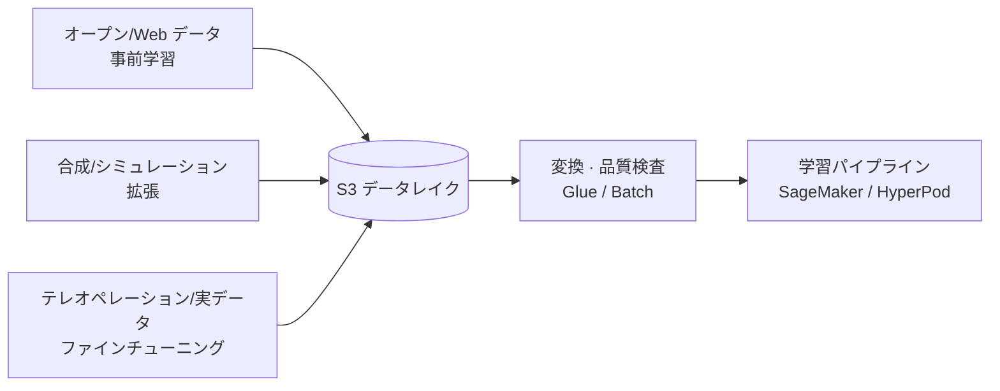
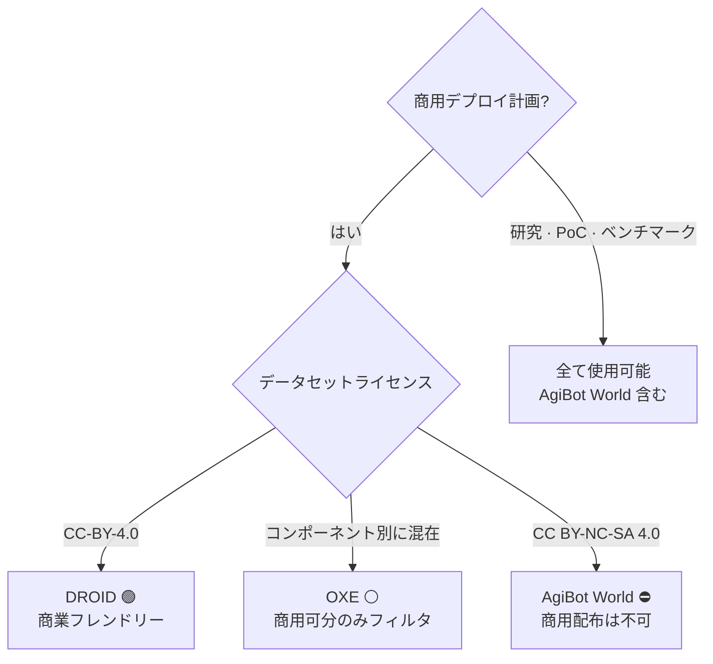
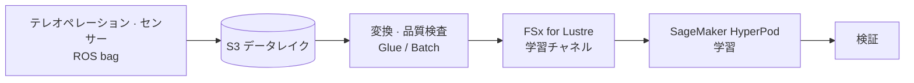

# Pillar 1 — データ収集 & 処理 (Data Collection & Processing)

_最終更新: 2026-07 · owner: Youngjin · volatility: 中（データセットのバージョン・サイズは高）_
_個別項目は別途表記が無い限りページメタデータ（owner/updated/volatility）を継承。項目別に owner を指定する場合は項目フッターを追加。_
[← index へ](index.md)

> **L0 TL;DR**: Physical AI のボトルネックはモデルアーキテクチャではなく、**ロボット行動データの量・多様性・品質** です。実データ（テレオペレーション[^teleop]）は高価で遅く、オープンデータセットは **ライセンスが地雷原** であり、合成データ[^sdg]は今ようやく実戦パイプラインになりました。SA の役割は「どこからデータを得て、AWS 上でどのパイプラインで学習可能な形態にするか」を設計してあげることです。

---

## このピラーで顧客が最も頻繁に問う質問 Top 3

1. **「ロボット学習データはどこで手に入れますか? オープンデータセットをそのまま使ってもいいですか?」** → [オープンロボットデータセット](#1-オープンロボットデータセット--ga)（⚠️ まずライセンスを見よ）
2. **「実データが不足していますが、合成データで埋められますか?」** → [合成データ生成](#2-合成データ生成--isaac-sim-sdg--replicator--ga)、[Cosmos WFM](#3-nvidia-cosmos-world-foundation-models--gaオープンモデル--aws-はセルフホスティングコンピュート)
3. **「自社ロボットのテレオペレーション/ROS bag[^rosbag] データを AWS でどう学習パイプラインにしますか?」** → [データパイプライン リファレンスアーキテクチャ](#4-ロボット学習データパイプライン-リファレンスアーキテクチャ--ga)、[フォーマット & 変換](#5-データフォーマット--変換--lerobot-v3--rlds--ga)

> **安定原理（あまり変わらない）**: ロボットデータは (1) **テレオペレーション/実データ** — 高品質・高コスト・低多様性、(2) **合成/シミュレーションデータ** — 低コスト・高多様性・ドメインギャップ[^gap]存在、(3) **オープン/Web データ** — 事前学習用・ライセンス注意。実戦レシピはほぼ常に **「オープンデータセット事前学習 → 合成データ拡張 → 少量の実デモでファインチューニング」** の3段混合です。

---

## 1. オープンロボットデータセット  🟢 GA

**L0 TL;DR**: VLA[^vla] 事前学習の事実上の標準コーパス。ただし **各データセットのライセンスが商用配布の可否を左右する** ため、顧客がモデル重みを商用リリースする計画なら、ライセンス監査が最初のステップです。

**顧客ニーズ/課題**: 「ゼロからデータを集める余力は無く、公開されたもので始めたい。でもこれを商用製品に使ってもいいのか?」

**ソリューション概要** `[1]`:

- **[Open X-Embodiment (OXE)](https://robotics-transformer-x.github.io/)** — ~1M+ エピソード[^traj]、22 embodiment[^embodiment]、60余のデータセットを統合。OpenVLA・RT-2-X・π0・GR00T の標準事前学習コーパス。⚠️ **ライセンスはコンポーネントごとに異なる**（多くは CC-BY-4.0/Apache-2.0、一部は research-only）→ 商用ならコンポーネント単位の法務監査が必須。`[1]` arxiv 2310.08864
- **[DROID](https://droid-dataset.github.io/)** — 76,000 テレオペレーション軌跡、350時間、Franka。ライセンス **CC-BY-4.0**（商業フレンドリー）。ファインチューニング段階の標準。`[1]` droid-dataset.github.io
- **[AgiBot World](https://agibot-world.com/)** — ~1,003,672 軌跡（~43.8TB）で最大規模。⚠️ **ライセンス CC BY-NC-SA 4.0 = 非商業**。研究・ベンチマークは可能だが **商用派生重みの配布は不可**。`[1]` arxiv 2503.06669
- **[RoboMIND](https://arxiv.org/abs/2412.13877)** — 107k 軌跡、4 embodiment、失敗デモ 5k を含む（貴重）。ライセンスは HF で再確認が必要。`[1]` arxiv 2412.13877

**AWS マッピング**: S3（データレイク）+ FSx for Lustre（学習時にダウンロード不要の高速チャネル）+ SageMaker/HyperPod。データセットは Hugging Face Hub または原本から S3 にミラーリング後に使用。

**意思決定基準**:

- 商用製品が目標 → **DROID / RoboMIND（ライセンス確認）中心**、AgiBot World は除外、OXE は商用可能なコンポーネントのみフィルタリング。
- 研究・PoC・内部ベンチマーク → 全て使用可能（AgiBot World 含む）。
- 特定の embodiment（自社ロボット）と形態が異なる場合は事前学習用にのみ使い、実デモでファインチューニングする前提。

**顧客事例**: 事例待ち（韓国の公開事例は未確認 — 韓国ロボット企業の多くが現在 NVIDIA アライン）。

**➡️ 次のアクション**: 顧客が商用計画なら **① 目標 embodiment の確認 → ② データセットライセンス監査シート（OXE コンポーネント別）の提供 → ③「S3 ミラーリング + FSx Lustre 学習チャネル」PoC の提案**。ライセンスリスクを初回ミーティングで指摘するだけで信頼を確保。

**🔗 関連資産**: （社内データセットライセンス監査テンプレート — 作成が必要 ⚠️）

🔄 揮発性データ（バージョン・サイズ — 更新対象）

| データセット | 規模 | ライセンス | 商用可能 | 確認日 |
|---|---|---|---|---|
| OXE | ~1M+ ep, 22 embodiment | コンポーネント別に混在 | 一部（監査が必要） | 2026-07 |
| DROID | 76,000 軌跡, 350h | CC-BY-4.0 | ✅ | 2026-07 |
| AgiBot World | ~1.0M 軌跡, 43.8TB | CC BY-NC-SA 4.0 | ❌ 非商業 | 2026-07 |
| RoboMIND | 107k 軌跡, 失敗 5k | HF 確認が必要 | ⚠️ 未確認 | 2026-07 |

_注意: 一部のアグリゲーターが DROID を「92,233 ep/Apache-2.0」と表記するが、これは LeRobot-v3 リパッキングと推定され、公式は 76k/CC-BY-4.0。引用時は公式値を使用。_

---

## 2. 合成データ生成 — Isaac Sim SDG + Replicator  🟢 GA

**L0 TL;DR**: 実データが不足している認識(perception)・操作タスクにおいて、シミュレーターで **アノテーションまで自動で付いた学習データを大量生成** します。NVIDIA Isaac Sim 5.x が GA かつオープンソースなので参入障壁が低いです。

**顧客ニーズ/課題**: 「自社の工場/倉庫環境のデータがほとんど無い。ラベリングコストも負担できない。シミュレーションで作れるのか?」

**ソリューション概要** `[1]`: [Isaac Sim](https://developer.nvidia.com/isaac/sim) の **Replicator** でドメインランダマイゼーション[^dr]（照明・質感・ポーズ・カメラ）ベースの合成画像/セグメンテーション/バウンディングボックスをプログラム的に（Replicator Functional API）生成。Isaac Sim **5.0 GA（2025-08 SIGGRAPH）**、オープンソース（GitHub）、5.1 GA、6.0 は GTC'26 早期開発者リリース（2026-03/06）。`[1]` developer.nvidia.com, github.com/isaac-sim

**AWS マッピング**: EC2 **G6e**(L40S)・**G7e**(RTX PRO 6000 Blackwell) GPU インスタンスで Isaac Sim を実行 + **AWS Batch** で大規模オフラインデータ生成ジョブを並列化 + S3 保存。NICE DCV でリモートストリーミング（→ [pillar-3](pillar-3.md) 参照）。

**意思決定基準**:

- 認識タスク（検出・分割・ポーズ推定）→ 合成データ ROI は非常に高い（ラベルが無料）。
- 操作ポリシー(manipulation policy) → 合成のみではドメインギャップが大きい。必ず実デモでのファインチューニング + sim-to-real 方法論を併行（→ [pillar-4](pillar-4.md)）。
- Isaac Sim vs オープンソース（Genesis/MuJoCo）の選択 → [decisions](decisions.md)。

**顧客事例**: 事例待ち（韓国の明示的事例は未確認）。

**➡️ 次のアクション**: **「EC2 G6e/G7e + AWS Batch で Isaac Sim SDG パイプライン」ワークショップを提案**。顧客の実環境の CAD/USD アセットがあれば1日 PoC で合成データセットサンプル生成デモ。

**🔗 関連資産**:

- プレイブック: [pillar-3 シミュレーション](pillar-3.md)
- （社内 Isaac-on-AWS ワークショップ deck — 確認が必要 ⚠️）
- [VAMS — Visual Asset Management System](https://github.com/awslabs/visual-asset-management-system) — awslabs。USD シーン·点群·CAD などビジュアルアセットの一元管理（バージョン·リネージ·ビューア）、シミュレーション環境·学習データ管理向け。CDK サーバーレス、near-production-grade

---

## 3. NVIDIA Cosmos World Foundation Models  🟢 GA（オープンモデル · AWS はセルフホスティングコンピュート）

**L0 TL;DR**: 物理世界を予測・生成する基盤モデル[^wfm]で、シミュレーション資産・未来フレーム・行動シミュレーションを作ってデータ拡張に使います。オープン重みなので **AWS コンピュート（EKS/Batch/G7e）上でセルフホスティング可能** — ただし ⚠️ AWS は NVIDIA が名指しした Cosmos マネージドホストではありません（→ [pillar-3](pillar-3.md)）。「ワールドモデルで作ったデータで実デプロイ用ポリシーを学習」もまだアーリーアダプター段階です。

**顧客ニーズ/課題**: 「シミュレーターのシーンを一つ一つ作れない。多様な現実的シナリオを自動生成したい。」

**ソリューション概要** `[1]/[3]`: Cosmos WFM が合成ワールド生成 + ビジョン推論 + 行動シミュレーションを提供。**Cosmos 3** が最新（2026-05-31 リリース、GTC Taipei 2026-06 発表）。FieldAI・Skild AI・Generalist AI などがデータ生成に使用。`[1]` nvidianews.nvidia.com

- ⚠️ **Hype 警戒**: 「印象的な生成デモ」と「このデータで学習したポリシーが実デプロイされた」は別物です。後者は現在少数のアーリーアダプター事例のみ存在 → 実戦の成熟度は **Preview レベルとして扱う**。

**AWS マッピング** `[3]`: **セルフホスティング リファレンスアーキテクチャ** — Cosmos NIM コンテナを **Amazon EKS**（リアルタイム）または **AWS Batch**（大規模オフライン合成データ生成）で顧客が自ら実行。GA なのは AWS コンピュートサービス（EKS/Batch/G7e）であって「Cosmos-on-AWS 製品」ではありません。`[3]` aws.amazon.com/blogs/hpc/running-nvidia-cosmos-world-foundation-models-on-aws

**意思決定基準**:

- 大量の多様性が必要な認識・ナビゲーションデータ → 試す価値が高い。
- 精密操作ポリシーの唯一のデータ源とすること → まだリスク。補助的な拡張として位置づけ。

**顧客事例**: **NAVER Labs** — ストリートビュー・空間データで「Seoul World Model」構築に Cosmos を使用（2026-06 NVIDIA 提携）。⚠️ **NVIDIA アライン（AWS ではない）** `[3]`。**Doosan Robotics** — Agentic Robot OS に Cosmos を統合（NVIDIA アライン）`[3]`。

**➡️ 次のアクション**: 韓国ロボット顧客が Cosmos に関心 → **「オープン重みなので AWS EKS/Batch/G7e でセルフホスティング可能」という角度で提案**（NVIDIA アラインの顧客を AWS コンピュートへ誘導）。マネージドホストではない点、実戦の学習検証がアーリー段階である点は正直に併記。

**🔗 関連資産**: [pillar-2 モデル学習](pillar-2.md) · [pillar-3 シミュレーション](pillar-3.md)

---

## 4. ロボット学習データパイプライン リファレンスアーキテクチャ  🟢 GA

**L0 TL;DR**: 収集（テレオペレーション/センサー/ROS bag）→ S3 レイク → 変換・品質検査 → FSx Lustre 学習チャネル → HyperPod 学習 → 検証。個別サービスは全て GA ですが、**マニピュレーションロボット向けのエンドツーエンド公開事例はまだありません**（正直なホワイトスペース）。

**顧客ニーズ/課題**: 「自分たちが集めたソースデータ（ロボットログ、カメラ、ROS bag）が S3 に溜まっているだけ。これを学習可能な形態で流したい。」

**ソリューション概要** `[1]`:

- **収集/保存**: S3（ソースデータレイク、ティアリングでコスト管理）
- **変換/ラベル**: AWS Glue/Batch（フォーマット変換・品質フィルタ）、必要に応じて SageMaker Ground Truth（ラベリング — ただしロボット特化の公開事例なし）
- **学習チャネル**: FSx for Lustre を SageMaker 学習チャネルとしてマウント → ダウンロード不要で高速 read
- **学習**: SageMaker HyperPod（→ [pillar-2](pillar-2.md)）

**AWS マッピング**: S3 · FSx for Lustre · Glue · Batch · SageMaker Ground Truth · HyperPod。（全て GA）

**意思決定基準**:

- データセット < 数 TB、アクセスパターンが単純 → S3 直接ストリーミング（HyperPod/LeRobot streaming）で十分、FSx は省略可能。
- 反復エポック・大規模・ランダムアクセスがボトルネック → **FSx for Lustre** を導入。
- ラベリング物量が大きく人手検収が必要 → Ground Truth。ただしロボットデータは大抵自動ラベル（シミュレーション/テレオペレーション記録）なので必要性は低い。

**顧客事例**: **Zoox** — SageMaker HyperPod でマルチモーダル AV 基盤モデルを学習、64+ GPU で 95% 使用率 `[1]/[3]`。⚠️ **自動運転(AV)であってマニピュレーションロボットではない** — リファレンスアーキテクチャの根拠としてのみ使用、マニピュレーション事例として誇張禁止。

**➡️ 次のアクション**: **リファレンスアーキテクチャ図（S3→FSx→HyperPod）をホワイトボードで描いてあげ**、顧客のデータ規模・アクセスパターンで FSx の必要性を判断。ROS bag がソースなら下記5番（変換ギャップ）と接続。

**🔗 関連資産**: [pillar-2 モデル学習](pillar-2.md) · [decisions: GPU 確保戦略](decisions.md)

---

## 5. データフォーマット & 変換 — LeRobot v3 / RLDS  🟢 GA

**L0 TL;DR**: ロボットデータの二大支配的フォーマット[^fmt]は **RLDS**（TFDS ベース、VLA 学習パイプラインがネイティブに消費）と **LeRobotDataset v3**（Parquet+MP4、HF エコシステムの相互交換標準）です。**ROS 2 bag → 学習フォーマットの変換は標準ツールが無くカスタム** が必要で、これが AWS パイプラインの機会です。

**顧客ニーズ/課題**: 「自分たちのデータは ROS 2 bag だが、VLA 学習コードは RLDS/LeRobot を求める。どう変換する?」

**ソリューション概要** `[1]`:

- **[LeRobotDataset v3.0](https://github.com/huggingface/lerobot)** — エピソード多数を単一の Parquet にまとめ、MP4 ビデオ + メタデータで境界を管理、Hub ネイティブストリーミング。`lerobot >= 0.4.0`、最新は **v0.6.0（2026-07-06）**。NVIDIA もデータセットを LeRobot v3 で再配布中（相互交換の標準化が進行中）。`[1]` github.com/huggingface/lerobot
- **[RLDS](https://github.com/google-research/rlds)** — OpenVLA・RT-2-X・π0・GR00T がネイティブに消費。依然として VLA 学習の標準。
- ⚠️ **ギャップ**: lerobot リポジトリに **ネイティブな ROS 2 bag コンバーターが無い**。rosbag2 → LeRobot/RLDS の大規模変換は DIY。

**AWS マッピング**: **カスタム rosbag2→LeRobot/RLDS コンバーター** をコンテナとして **AWS Glue/Batch** に載せて大規模並列変換 + S3 保存。HyperPod/学習段階は S3 ストリーミングまたは FSx。

**意思決定基準**:

- 学習フレームワークが LeRobot 系 → LeRobotDataset v3。
- OpenVLA/GR00T/π 系の公式レシピ → RLDS。
- ソースが ROS 2 bag → 変換ジョブをパイプライン初期に設計（事後追加はコストが大きい）。

**顧客事例**: 事例待ち。

**➡️ 次のアクション**: 顧客データが ROS bag なら **「Glue/Batch ベースの rosbag2→LeRobot 変換ジョブ」をパイプライン設計1日目に含める** よう提案（SA が先んじて指摘すれば大きな信頼）。再利用可能なコンバーターを社内資産化すること。

**🔗 関連資産**: （社内 rosbag2 変換コンバーター — 新規開発の機会 ⚠️）

---

## 6. テレオペレーションデータ収集パイプライン  🟡 Preview（オープン HW は 🔵 Research-only）

**L0 TL;DR**: 高品質な実デモの源泉。**オープンテレオペレーションハードウェア（ALOHA/GELLO）は研究・DIY 段階** であり、実戦の大規模テレオペレーションはヒューマノイド企業の **非公開データファクトリー** です。SA が扱う地点はハードウェアではなく、**テレオペレーションストリームを AWS へ収集・保存・精製するパイプライン** です。

**顧客ニーズ/課題**: 「人がロボットを遠隔操縦して集めたデモをリアルタイムで収集・保存し、学習キューに入れたい。」

**ソリューション概要** `[1]/[4]`:

- オープン HW: **[ALOHA/Mobile ALOHA](https://tonyzhaozh.github.io/aloha/)**（両腕の低価格テレオペレーション）、**[GELLO](https://wuphilipp.github.io/gello_site/)**（<$300 のリーダーアーム、MIT ライセンス）— ラボで広範に複製されるが商用製品 SKU は無く、**Research-only**。`[1]`
- 実戦: Figure・1X・Physical Intelligence・Tesla が VR リグのテレオペレーションファームを運営（1日数時間）。⚠️ **証拠はメディア・デモレベル、公開パイプラインは無し** `[4]`。
- SA の焦点: テレオペレーションのテレメトリストリーム → S3 収集 → 自動ラベル（成功/失敗、タスクタグ）→ 学習データセット化。

**AWS マッピング**: IoT Core/Kinesis（ストリーム収集）→ S3 → Glue（精製・ラベル）→ [5番のフォーマット変換] → 学習。（エッジ連携は [pillar-4](pillar-4.md)）

**意思決定基準**:

- 少量・高品質デモが目標（ファインチューニング）→ テレオペレーション投資の価値が高い。
- 大量の多様性が目標（事前学習）→ 合成/オープンデータがコスト効率的。テレオペレーションは最後のファインチューニング用に限定。

**顧客事例**: 事例待ち（公開パイプラインの不在）。

**➡️ 次のアクション**: 顧客がテレオペレーションデータを集めているなら **「収集ストリーム → S3 → 自動ラベル → 学習キュー」パイプラインを標準化** してあげよ。オープン HW 自体の推奨は慎重に（research-only を明示）。

**🔗 関連資産**:

- プレイブック: [pillar-4 エッジデプロイ](pillar-4.md) · [radar: ALOHA/GELLO](radar.md)
- [LeRobot テレオペ収集 on Greengrass サンプル](https://github.com/aws-samples/sample-lerobot-data-collection-on-aws-iot-greengrass) — aws-samples。SO-ARM101→LeRobot v3→S3
- [Android PAI データ収集アプリ](https://github.com/aws-samples/sample-physical-ai-data-collector-app) — aws-samples。現場スマートフォン映像+IMU→S3 オフラインキューアップロード。⚠️ 初期サンプル

---

## このピラーの正直な現実（SA 必読）

- **AWS マニピュレーションロボットデータパイプラインの公開エンドツーエンド事例は無い。** 実在の根拠は (a) Cosmos セルフホスティング on EKS/Batch（リファレンスアーキテクチャ）、(b) Zoox HyperPod（AV）、(c) Agility on EC2 G7e のみ。マニピュレーションの S3/Glue/Ground Truth/FSx パイプラインは **検証済みのデプロイではなく設計パターン/機会** です — 顧客にあるかのように言わないこと。
- **韓国ロボットリーダー（NAVER、Doosan）は現在 NVIDIA アライン。** これは脅威であり機会でもある — AWS は「Cosmos/Isaac を動かす最適なコンピュート・データプラットフォーム」としてポジショニングするのが正直で勝算のある角度。
- **ライセンスが最初のリスク。** AgiBot World（最大規模）が非商業だという事実一つを指摘するだけで顧客の信頼を得られます。

---
_owner: Youngjin · updated: 2026-07 · volatility: 中（データセットのバージョン・サイズは折りたたみブロックで高）· sources: [1] 公式/論文, [3] ベンダーブログ, [4] 未検証_

<!-- 용어 각주 -->

[^vla]: **VLA (Vision-Language-Action)** — カメラ映像（Vision）と自然言語の指示（Language）を入力に、ロボットの動作（Action）を直接出力する基盤モデルです。「コップを掴んで」と言えば関節の動きを生成する、という具合です。🎥 [NVIDIA Isaac GR00T N1 紹介](https://www.youtube.com/watch?v=m1CH-mgpdYg)
[^teleop]: **テレオペレーション** — 人が VR コントローラーやリーダーアームなどでロボットを遠隔操縦しながら実演動作を記録するデータ収集方式です。品質は最も高いものの、人の時間がそのままコストになります。🎥 [Stanford Mobile ALOHA テレオペレーション実演](https://www.youtube.com/watch?v=mnLVbwxSdNM)
[^sdg]: **合成データ生成（SDG, Synthetic Data Generation）** — シミュレーターで学習用画像とアノテーション（ラベル）を自動生成する技法です。ラベリングコストがゼロに収束するのが最大の利点です。🎥 [Isaac Sim Replicator SDG チュートリアル](https://www.youtube.com/watch?v=HHzNIh72B_Y)
[^traj]: **エピソード/軌跡（trajectory）** — ロボットが一つのタスクを開始から終了まで遂行した1回分の記録です。観測（カメラ・センサー）と行動（関節コマンド）の時系列の束であり、ロボット学習データの基本単位です。
[^embodiment]: **embodiment（エンボディメント）** — ロボットの物理的形態・自由度・センサー構成のことです。同じモデルでもロボットアームとヒューマノイドでは embodiment が異なり、データ・ポリシーをそのまま移植できません。
[^dr]: **ドメインランダマイゼーション（Domain Randomization）** — シミュレーションの照明・質感・物体位置・カメラ角度をランダムに変えながらデータを生成し、モデルがどんな環境でも通用する特徴を学ぶようにする技法です。sim-to-real ギャップを縮める代表的な処方です。
[^gap]: **ドメインギャップ（domain gap）** — シミュレーションと現実の差（物理・視覚）のため、シミュレーションでうまくいっていたモデルが実機では性能が落ちる現象です。このギャップを扱う方法論が [pillar-4](pillar-4.md) の sim-to-real です。
[^wfm]: **ワールド基盤モデル（WFM, World Foundation Model）** — 物理世界の次のシーンを予測・生成するよう学習された大型モデルです。テキスト・映像プロンプトから物理的にもっともらしい映像・シナリオを作り、ロボット学習データを拡張します。🎥 [NVIDIA Cosmos 紹介](https://www.youtube.com/watch?v=9Uch931cDx8)
[^rosbag]: **ROS bag（rosbag2）** — ロボットオペレーティングシステム ROS 2 がトピック（センサー・コマンドのストリーム）を丸ごと録画する標準ログフォーマットです。ロボット企業の元データの事実上のデフォルト形態ですが、そのままでは学習に使えず変換が必要です。
[^fmt]: **RLDS / LeRobotDataset** — ロボット学習データの二大保存フォーマットです。RLDS は TensorFlow Datasets ベースで主要な VLA 学習コードが直接読み込み、LeRobotDataset（v3）は Parquet+MP4 ベースの Hugging Face エコシステム標準です。
