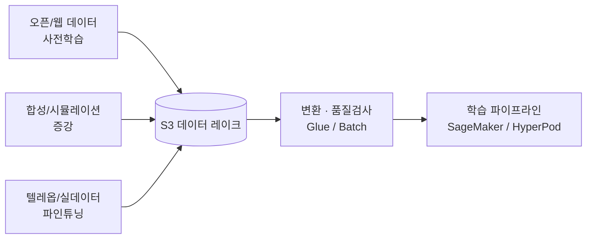
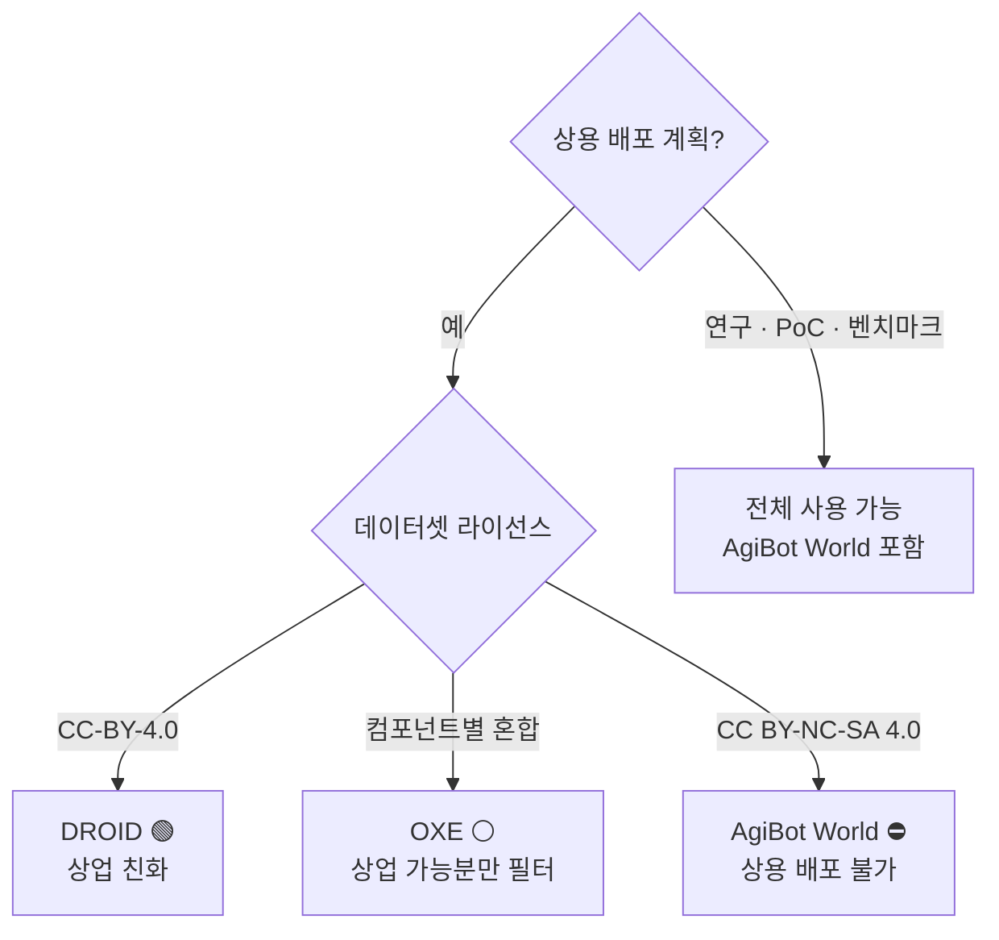
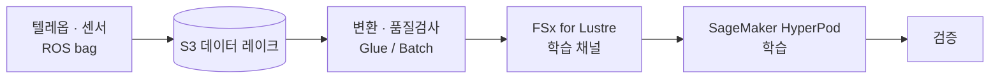

# Pillar 1 — 데이터 수집 & 처리 (Data Collection & Processing)

_최종 갱신: 2026-07 · owner: comeddy · volatility: 중간(데이터셋 버전·크기는 높음)_
_개별 항목은 별도 표기가 없는 한 페이지 메타데이터(owner/updated/volatility)를 상속. 항목별 owner 지정 시 항목 푸터 추가._
[← index로](index.md)

> **L0 TL;DR**: Physical AI의 병목은 모델 아키텍처가 아니라 **로봇 행동 데이터의 양·다양성·품질**이다. 실데이터(텔레옵)는 비싸고 느리고, 오픈 데이터셋은 **라이선스가 지뢰밭**이며, 합성 데이터는 이제야 실전 파이프라인이 됐다. SA의 역할은 "어디서 데이터를 얻고, AWS 위에서 어떤 파이프라인으로 학습 가능한 형태로 만드는가"를 설계해 주는 것.

---

## 이 필러에서 고객이 가장 자주 묻는 질문 Top 3

1. **"로봇 학습 데이터를 어디서 구하죠? 오픈 데이터셋 그냥 써도 되나요?"** → [오픈 로봇 데이터셋](#1-오픈-로봇-데이터셋--ga) (⚠️ 라이선스 먼저 보라)
2. **"실데이터가 부족한데 합성 데이터로 메울 수 있나요?"** → [합성 데이터 생성](#2-합성-데이터-생성--isaac-sim-sdg--replicator--ga), [Cosmos WFM](#3-nvidia-cosmos-world-foundation-models--ga-오픈-모델--aws는-셀프호스팅-컴퓨트)
3. **"우리 로봇의 텔레옵/ROS bag 데이터를 AWS에서 어떻게 학습 파이프라인으로 만들죠?"** → [데이터 파이프라인 참조 아키텍처](#4-로봇-학습-데이터-파이프라인-참조-아키텍처--ga), [포맷 & 변환](#5-데이터-포맷--변환--lerobot-v3--rlds--ga)

> **안정 원리 (잘 안 바뀜)**: 로봇 데이터는 (1) **텔레옵/실데이터** — 고품질·고비용·저다양성, (2) **합성/시뮬레이션 데이터** — 저비용·고다양성·도메인 갭 존재, (3) **오픈/웹 데이터** — 사전학습용·라이선스 주의. 실전 레시피는 거의 항상 **"오픈 데이터셋 사전학습 → 합성 데이터 증강 → 소량 실데모 파인튜닝"** 의 3단 혼합이다.

---

## 1. 오픈 로봇 데이터셋  🟢 GA

**L0 TL;DR**: VLA 사전학습의 사실상 표준 코퍼스. 다만 **각 데이터셋 라이선스가 상업적 배포 가능 여부를 좌우**하므로, 고객이 모델 가중치를 상용 출시할 계획이면 라이선스 감사가 첫 단계다.

**고객 니즈/문제**: "밑바닥부터 데이터를 모을 여력은 없고, 공개된 걸로 시작하고 싶다. 그런데 이걸 상용 제품에 써도 되나?"

**솔루션 개요** `[1]`:

- **[Open X-Embodiment (OXE)](https://robotics-transformer-x.github.io/)** — ~1M+ 에피소드, 22개 embodiment, 60여 데이터셋 통합. OpenVLA·RT-2-X·π0·GR00T의 표준 사전학습 코퍼스. ⚠️ **라이선스가 컴포넌트별로 다름**(대부분 CC-BY-4.0/Apache-2.0, 일부 research-only) → 상용이면 컴포넌트 단위 법무 감사 필수. `[1]` arxiv 2310.08864
- **[DROID](https://droid-dataset.github.io/)** — 76,000 텔레옵 궤적, 350시간, Franka. 라이선스 **CC-BY-4.0** (상업 친화적). 파인튜닝 단계 표준. `[1]` droid-dataset.github.io
- **[AgiBot World](https://agibot-world.com/)** — ~1,003,672 궤적(~43.8TB)로 최대 규모. ⚠️ **라이선스 CC BY-NC-SA 4.0 = 비상업**. 연구·벤치마크는 되지만 **상용 파생 가중치 배포 불가**. `[1]` arxiv 2503.06669
- **[RoboMIND](https://arxiv.org/abs/2412.13877)** — 107k 궤적, 4개 embodiment, 실패 데모 5k 포함(귀함). 라이선스는 HF에서 재확인 필요. `[1]` arxiv 2412.13877

**AWS 매핑**: S3(데이터 레이크) + FSx for Lustre(학습 시 다운로드 없이 고속 채널) + SageMaker/HyperPod. 데이터셋은 Hugging Face Hub 또는 원본에서 S3로 미러링 후 사용.

**의사결정 기준**:

- 상용 제품 목표 → **DROID / RoboMIND(라이선스 확인) 중심**, AgiBot World 제외, OXE는 상업 가능 컴포넌트만 필터링.
- 연구·PoC·내부 벤치마크 → 전체 사용 가능(AgiBot World 포함).
- 특정 embodiment(자사 로봇)와 형태가 다르면 사전학습용으로만 쓰고 실데모로 파인튜닝 전제.

**고객 사례**: 사례 대기 (국내 공개 사례 미확인 — 국내 로봇 기업 다수가 현재 NVIDIA 정렬).

**➡️ 다음 액션**: 고객이 상용 계획이면 **① 목표 embodiment 확인 → ② 데이터셋 라이선스 감사 시트(OXE 컴포넌트별) 제공 → ③ "S3 미러링 + FSx Lustre 학습 채널" PoC 제안**. 라이선스 리스크를 첫 미팅에서 짚는 것만으로 신뢰 확보.

**🔗 관련 자산**: (사내 데이터셋 라이선스 감사 템플릿 — 작성 필요 ⚠️)

🔄 휘발성 데이터 (버전·크기 — 갱신 대상)

| 데이터셋 | 규모 | 라이선스 | 상용가능 | 확인일 |
|---|---|---|---|---|
| OXE | ~1M+ ep, 22 embodiment | 컴포넌트별 혼합 | 부분(감사 필요) | 2026-07 |
| DROID | 76,000 궤적, 350h | CC-BY-4.0 | ✅ | 2026-07 |
| AgiBot World | ~1.0M 궤적, 43.8TB | CC BY-NC-SA 4.0 | ❌ 비상업 | 2026-07 |
| RoboMIND | 107k 궤적, 실패 5k | HF 확인 필요 | ⚠️ 미확인 | 2026-07 |

_주의: 일부 애그리게이터가 DROID를 "92,233 ep/Apache-2.0"로 표기하나 이는 LeRobot-v3 재패킹 추정이며 공식은 76k/CC-BY-4.0. 인용 시 공식 값 사용._

---

## 2. 합성 데이터 생성 — Isaac Sim SDG + Replicator  🟢 GA

**L0 TL;DR**: 실데이터가 부족한 인식(perception)·조작 태스크에서, 시뮬레이터로 **주석까지 자동으로 붙은 학습 데이터를 대량 생성**. NVIDIA Isaac Sim 5.x가 GA이자 오픈소스라 진입장벽이 낮다.

**고객 니즈/문제**: "우리 공장/창고 환경 데이터가 거의 없다. 라벨링 비용도 감당 안 된다. 시뮬레이션으로 만들 수 있나?"

**솔루션 개요** `[1]`: [Isaac Sim](https://developer.nvidia.com/isaac/sim)의 **Replicator**로 도메인 랜덤화(조명·질감·포즈·카메라) 기반 합성 이미지/세그멘테이션/바운딩박스를 프로그래밍 방식(Replicator Functional API)으로 생성. Isaac Sim **5.0 GA(2025-08 SIGGRAPH)**, 오픈소스(GitHub), 5.1 GA, 6.0은 GTC'26 얼리 개발자 릴리스(2026-03/06). `[1]` developer.nvidia.com, github.com/isaac-sim

**AWS 매핑**: EC2 **G6e**(L40S)·**G7e**(RTX PRO 6000 Blackwell) GPU 인스턴스에서 Isaac Sim 실행 + **AWS Batch**로 대규모 오프라인 데이터 생성 잡 병렬화 + S3 저장. NICE DCV로 원격 스트리밍(→ [pillar-3](pillar-3.md) 참조).

**의사결정 기준**:

- 인식 태스크(감지·분할·포즈추정) → 합성 데이터 ROI 매우 높음(라벨 공짜).
- 조작 정책(manipulation policy) → 합성만으로는 도메인 갭 큼. 반드시 실데모 파인튜닝 + sim-to-real 방법론 병행(→ [pillar-4](pillar-4.md)).
- Isaac Sim vs 오픈소스(Genesis/MuJoCo) 선택 → [decisions](decisions.md).

**고객 사례**: 사례 대기 (국내 명시 사례 미확인).

**➡️ 다음 액션**: **"EC2 G6e/G7e + AWS Batch로 Isaac Sim SDG 파이프라인" 워크숍 제안**. 고객 실제 환경 CAD/USD 자산이 있으면 1일 PoC로 합성 데이터셋 샘플 생성 데모.

**🔗 관련 자산**: [pillar-3 시뮬레이션](pillar-3.md) · (사내 Isaac-on-AWS 워크숍 deck — 확인 필요 ⚠️)

---

## 3. NVIDIA Cosmos World Foundation Models  🟢 GA (오픈 모델 · AWS는 셀프호스팅 컴퓨트)

**L0 TL;DR**: 물리 세계를 예측·생성하는 파운데이션 모델로, 시뮬레이션 자산·미래 프레임·행동 시뮬레이션을 만들어 데이터 증강에 쓴다. 오픈 가중치라 **AWS 컴퓨트(EKS/Batch/G7e) 위에서 셀프호스팅 가능** — 단 ⚠️ AWS는 NVIDIA가 명명한 Cosmos 매니지드 호스트가 아니다(→ [pillar-3](pillar-3.md)). "월드모델로 만든 데이터로 실배포 정책을 학습"도 아직 얼리어답터 단계.

**고객 니즈/문제**: "시뮬레이터 씬을 일일이 만들 수 없다. 다양한 현실적 시나리오를 자동 생성하고 싶다."

**솔루션 개요** `[1]/[3]`: Cosmos WFM이 합성 월드 생성 + 비전 추론 + 행동 시뮬레이션 제공. **Cosmos 3**가 최신(2026-05-31 릴리스, GTC Taipei 2026-06 발표). FieldAI·Skild AI·Generalist AI 등이 데이터 생성에 사용. `[1]` nvidianews.nvidia.com

- ⚠️ **Hype 경계**: "인상적 생성 데모"와 "이 데이터로 학습한 정책이 실배포됨"은 다르다. 후자는 현재 소수 얼리어답터 사례만 존재 → 실전 성숙도는 **Preview 수준으로 취급**.

**AWS 매핑** `[3]`: **셀프호스팅 참조 아키텍처** — Cosmos NIM 컨테이너를 **Amazon EKS**(실시간) 또는 **AWS Batch**(대규모 오프라인 합성 데이터 생성)에서 고객이 직접 실행. GA인 것은 AWS 컴퓨트 서비스(EKS/Batch/G7e)이지 "Cosmos-on-AWS 제품"이 아니다. `[3]` aws.amazon.com/blogs/hpc/running-nvidia-cosmos-world-foundation-models-on-aws

**의사결정 기준**:

- 대량 다양성이 필요한 인식·내비게이션 데이터 → 시도 가치 높음.
- 정밀 조작 정책의 유일 데이터원으로 삼는 것 → 아직 위험. 보조 증강으로 위치.

**고객 사례**: **NAVER Labs** — 스트리트뷰·공간 데이터로 "Seoul World Model" 구축에 Cosmos 사용(2026-06 NVIDIA 협약). ⚠️ **NVIDIA 정렬(AWS 아님)** `[3]`. **Doosan Robotics** — Agentic Robot OS에 Cosmos 통합(NVIDIA 정렬) `[3]`.

**➡️ 다음 액션**: 국내 로봇 고객이 Cosmos에 관심 → **"오픈 가중치라 AWS EKS/Batch/G7e에서 셀프호스팅 가능" 각도로 제안**(NVIDIA 정렬 고객을 AWS 컴퓨트로 유도). 매니지드 호스트가 아니라는 점, 실전 학습 검증이 얼리 단계라는 점은 정직하게 병기.

**🔗 관련 자산**: [pillar-2 모델 학습](pillar-2.md) · [pillar-3 시뮬레이션](pillar-3.md)

---

## 4. 로봇 학습 데이터 파이프라인 참조 아키텍처  🟢 GA

**L0 TL;DR**: 수집(텔레옵/센서/ROS bag) → S3 레이크 → 변환·품질검사 → FSx Lustre 학습 채널 → HyperPod 학습 → 검증. 개별 서비스는 전부 GA지만, **매니퓰레이션 로봇용 엔드투엔드 공개 사례는 아직 없다**(정직한 화이트스페이스).

**고객 니즈/문제**: "우리가 모은 원천 데이터(로봇 로그, 카메라, ROS bag)가 S3에 쌓여만 있다. 이걸 학습 가능한 형태로 흐르게 하고 싶다."

**솔루션 개요** `[1]`:

- **수집/저장**: S3(원천 데이터 레이크, 티어링으로 비용 관리)
- **변환/라벨**: AWS Glue/Batch(포맷 변환·품질 필터), 필요 시 SageMaker Ground Truth(라벨링 — 단 로봇 특화 공개 사례 없음)
- **학습 채널**: FSx for Lustre를 SageMaker 학습 채널로 마운트 → 다운로드 없이 고속 read
- **학습**: SageMaker HyperPod (→ [pillar-2](pillar-2.md))

**AWS 매핑**: S3 · FSx for Lustre · Glue · Batch · SageMaker Ground Truth · HyperPod. (전부 GA)

**의사결정 기준**:

- 데이터셋 < 수 TB, 접근 패턴 단순 → S3 직접 스트리밍(HyperPod/LeRobot streaming)으로 충분, FSx 생략 가능.
- 반복 에폭·대규모·랜덤 액세스 병목 → **FSx for Lustre** 도입.
- 라벨링 물량 크고 사람 검수 필요 → Ground Truth. 다만 로봇 데이터는 대개 자동 라벨(시뮬레이션/텔레옵 기록)이라 필요성 낮음.

**고객 사례**: **Zoox** — SageMaker HyperPod로 멀티모달 AV 파운데이션 모델 학습, 64+ GPU에서 95% 활용률 `[1]/[3]`. ⚠️ **자율주행(AV)이지 매니퓰레이션 로봇 아님** — 참조 아키텍처 근거로만 사용, 매니퓰레이션 사례로 과장 금지.

**➡️ 다음 액션**: **참조 아키텍처 다이어그램(S3→FSx→HyperPod)을 화이트보드로 그려주고**, 고객 데이터 규모·접근 패턴으로 FSx 필요성 판단. ROS bag이 원천이면 아래 5번(변환 갭)과 연결.

**🔗 관련 자산**: [pillar-2 모델 학습](pillar-2.md) · [decisions: GPU 확보 전략](decisions.md)

---

## 5. 데이터 포맷 & 변환 — LeRobot v3 / RLDS  🟢 GA

**L0 TL;DR**: 로봇 데이터의 두 지배적 포맷은 **RLDS**(TFDS 기반, VLA 학습 파이프라인이 네이티브 소비)와 **LeRobotDataset v3**(Parquet+MP4, HF 생태계 상호교환 표준). **ROS 2 bag → 학습 포맷 변환은 표준 도구가 없어 커스텀**이 필요하며, 이게 AWS 파이프라인 기회다.

**고객 니즈/문제**: "우리 데이터는 ROS 2 bag인데 VLA 학습 코드는 RLDS/LeRobot를 원한다. 어떻게 변환하지?"

**솔루션 개요** `[1]`:

- **[LeRobotDataset v3.0](https://github.com/huggingface/lerobot)** — 에피소드 다수를 Parquet 하나로 묶고 MP4 비디오 + 메타데이터로 경계 관리, Hub 네이티브 스트리밍. `lerobot >= 0.4.0`, 최신 **v0.6.0(2026-07-06)**. NVIDIA도 데이터셋을 LeRobot v3로 재배포 중(상호교환 표준화 진행). `[1]` github.com/huggingface/lerobot
- **[RLDS](https://github.com/google-research/rlds)** — OpenVLA·RT-2-X·π0·GR00T가 네이티브 소비. 여전히 VLA 학습 표준.
- ⚠️ **갭**: lerobot 레포에 **네이티브 ROS 2 bag 컨버터 없음**. rosbag2 → LeRobot/RLDS 대규모 변환은 DIY.

**AWS 매핑**: **AWS Glue/Batch에 커스텀 rosbag2→LeRobot/RLDS 컨버터**를 컨테이너로 올려 대규모 병렬 변환 + S3 저장. HyperPod/학습 단계는 S3 스트리밍 또는 FSx.

**의사결정 기준**:

- 학습 프레임워크가 LeRobot 계열 → LeRobotDataset v3.
- OpenVLA/GR00T/π 계열 공식 레시피 → RLDS.
- 원천이 ROS 2 bag → 변환 잡을 파이프라인 초기에 설계(사후 추가는 비용 큼).

**고객 사례**: 사례 대기.

**➡️ 다음 액션**: 고객 데이터가 ROS bag이면 **"Glue/Batch 기반 rosbag2→LeRobot 변환 잡" 을 파이프라인 설계 1일차에 포함**시키도록 제안(SA가 선제적으로 짚으면 큰 신뢰). 재사용 가능한 컨버터를 사내 자산화할 것.

**🔗 관련 자산**: (사내 rosbag2 변환 컨버터 — 신규 개발 기회 ⚠️)

---

## 6. 텔레오퍼레이션 데이터 수집 파이프라인  🟡 Preview (오픈 HW는 🔵 Research-only)

**L0 TL;DR**: 고품질 실데모의 원천. **오픈 텔레옵 하드웨어(ALOHA/GELLO)는 연구·DIY 단계**이고, 실전 대규모 텔레옵은 휴머노이드 기업의 **비공개 데이터 팩토리**다. SA가 다룰 지점은 하드웨어가 아니라 **텔레옵 스트림을 AWS로 수집·저장·정제하는 파이프라인**.

**고객 니즈/문제**: "사람이 로봇을 원격조종해 모은 데모를 실시간으로 수집·저장하고 학습 큐에 넣고 싶다."

**솔루션 개요** `[1]/[4]`:

- 오픈 HW: **[ALOHA/Mobile ALOHA](https://tonyzhaozh.github.io/aloha/)**(양팔 저가 텔레옵), **[GELLO](https://wuphilipp.github.io/gello_site/)**(<$300 리더암, MIT 라이선스) — 랩에서 광범위 복제되나 상용 제품 SKU 없음, **Research-only**. `[1]`
- 실전: Figure·1X·Physical Intelligence·Tesla가 VR 리그 텔레옵 팜을 운영(하루 수시간). ⚠️ **증거는 언론·데모 수준, 공개 파이프라인 없음** `[4]`.
- SA 초점: 텔레옵 원격측정 스트림 → S3 수집 → 자동 라벨(성공/실패, 태스크 태그) → 학습 데이터셋화.

**AWS 매핑**: IoT Core/Kinesis(스트림 수집) → S3 → Glue(정제·라벨) → [5번 포맷 변환] → 학습. (엣지 연결은 [pillar-4](pillar-4.md))

**의사결정 기준**:

- 소량·고품질 데모가 목표(파인튜닝) → 텔레옵 투자 가치 높음.
- 대량 다양성이 목표(사전학습) → 합성/오픈 데이터가 비용 효율. 텔레옵은 마지막 파인튜닝용으로 한정.

**고객 사례**: 사례 대기 (공개 파이프라인 부재).

**➡️ 다음 액션**: 고객이 텔레옵 데이터를 모으고 있다면 **"수집 스트림 → S3 → 자동 라벨 → 학습 큐" 파이프라인을 표준화**해 주라. 오픈 HW 자체 추천은 신중히(research-only 명시).

**🔗 관련 자산**: [pillar-4 엣지 배포](pillar-4.md) · [radar: ALOHA/GELLO](radar.md) · [LeRobot 텔레옵 수집 on Greengrass 샘플 (aws-samples — SO-ARM101→LeRobot v3→S3)](https://github.com/aws-samples/sample-lerobot-data-collection-on-aws-iot-greengrass) · [Android PAI 데이터 수집 앱 (aws-samples — 현장 스마트폰 영상+IMU→S3 오프라인 큐 업로드, ⚠️ 초기 샘플)](https://github.com/aws-samples/sample-physical-ai-data-collector-app)

---

## 이 필러의 정직한 현실 (SA 필독)

- **AWS 매니퓰레이션 로봇 데이터 파이프라인의 공개 엔드투엔드 사례는 없다.** 실제 근거는 (a) Cosmos 셀프호스팅 on EKS/Batch(참조 아키텍처), (b) Zoox HyperPod(AV), (c) Agility on EC2 G7e뿐. 매니퓰레이션 S3/Glue/Ground Truth/FSx 파이프라인은 **검증된 배포가 아니라 설계 패턴/기회**다 — 고객에게 있는 것처럼 말하지 말 것.
- **국내 로봇 리더(NAVER, Doosan)는 현재 NVIDIA 정렬.** 이건 위협이자 기회 — AWS는 "Cosmos/Isaac을 돌리는 최적 컴퓨트·데이터 플랫폼"으로 포지셔닝하는 게 정직하고 승산 있는 각도.
- **라이선스가 첫 리스크.** AgiBot World(최대 규모)가 비상업이라는 사실 하나만 짚어도 고객 신뢰를 얻는다.

---
_owner: comeddy · updated: 2026-07 · volatility: 중간 (데이터셋 버전·크기는 접힌 블록에서 높음) · sources: [1] 공식/논문, [3] 벤더 블로그, [4] 미검증_
