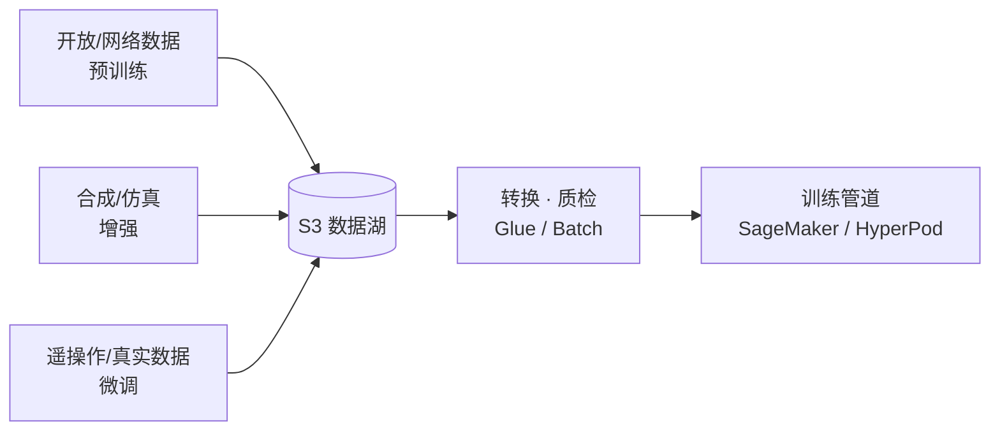
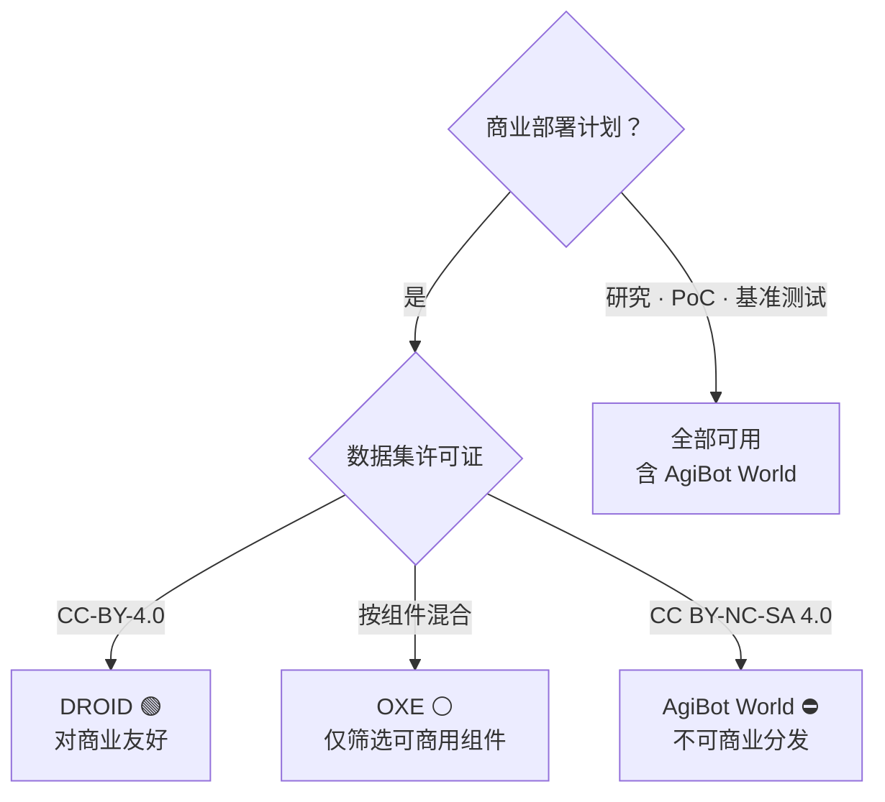
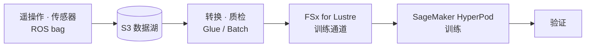

# Pillar 1 — 数据采集 & 处理 (Data Collection & Processing)

_最终更新: 2026-07 · owner: comeddy · volatility: 中（数据集版本·大小为高）_
_除非另有标注，各条目继承页面元数据（owner/updated/volatility）。按条目指定 owner 时在条目页脚补充。_
[← 返回 index](index.md)

> **L0 TL;DR**: Physical AI 的瓶颈不是模型架构，而是**机器人行为数据的量·多样性·质量**。真实数据（遥操作）昂贵又缓慢，开放数据集则是**许可证的雷区**，合成数据到现在才成为实战管道。SA 的角色是为客户设计"从哪里获取数据，以及在 AWS 上用什么管道把它变成可训练的形态"。

---

## 本支柱中客户最常问的问题 Top 3

1. **"机器人学习数据去哪找？开放数据集直接用可以吗？"** → [开放机器人数据集](#1-开放机器人数据集--ga)（⚠️ 先看许可证）
2. **"真实数据不足，能用合成数据来补吗？"** → [合成数据生成](#2-合成数据生成--isaac-sim-sdg--replicator--ga)、[Cosmos WFM](#3-nvidia-cosmos-world-foundation-models--ga开放模型--aws-为自托管算力)
3. **"我们机器人的遥操作/ROS bag 数据怎么在 AWS 上做成训练管道？"** → [数据管道参考架构](#4-机器人学习数据管道参考架构--ga)、[格式 & 转换](#5-数据格式--转换--lerobot-v3--rlds--ga)

> **稳定原理（几乎不变）**: 机器人数据分为 (1) **遥操作/真实数据** —— 高质量·高成本·低多样性，(2) **合成/仿真数据** —— 低成本·高多样性·存在域间差异，(3) **开放/网络数据** —— 用于预训练·注意许可证。实战配方几乎总是 **"开放数据集预训练 → 合成数据增强 → 少量真实演示微调"** 的三段混合。

---

## 1. 开放机器人数据集  🟢 GA

**L0 TL;DR**: VLA 预训练的事实标准语料库。但由于**每个数据集的许可证决定了能否商业分发**，如果客户计划将模型权重商用发布，许可证审计就是第一步。

**客户需求/问题**: "没有从零收集数据的余力，想用公开的先起步。但这个用在商用产品上可以吗？"

**解决方案概览** `[1]`:

- **[Open X-Embodiment (OXE)](https://robotics-transformer-x.github.io/)** —— ~1M+ 回合(episode)、22 个 embodiment、整合了 60 余个数据集。OpenVLA·RT-2-X·π0·GR00T 的标准预训练语料库。⚠️ **许可证按组件不同**（多为 CC-BY-4.0/Apache-2.0，部分为 research-only）→ 商用则必须按组件进行法务审计。`[1]` arxiv 2310.08864
- **[DROID](https://droid-dataset.github.io/)** —— 76,000 条遥操作轨迹、350 小时、Franka。许可证 **CC-BY-4.0**（对商业友好）。微调阶段的标准。`[1]` droid-dataset.github.io
- **[AgiBot World](https://agibot-world.com/)** —— ~1,003,672 条轨迹（~43.8TB），规模最大。⚠️ **许可证 CC BY-NC-SA 4.0 = 非商业**。研究·基准测试可以，但**不可分发商用衍生权重**。`[1]` arxiv 2503.06669
- **[RoboMIND](https://arxiv.org/abs/2412.13877)** —— 107k 条轨迹、4 个 embodiment、含 5k 失败演示（珍贵）。许可证需在 HF 上再次确认。`[1]` arxiv 2412.13877

**AWS 映射**: S3（数据湖）+ FSx for Lustre（训练时无需下载的高速通道）+ SageMaker/HyperPod。数据集从 Hugging Face Hub 或原始来源镜像到 S3 后使用。

**决策标准**:

- 目标为商用产品 → **以 DROID / RoboMIND（确认许可证）为主**，排除 AgiBot World，OXE 仅筛选可商用的组件。
- 研究·PoC·内部基准测试 → 可全部使用（含 AgiBot World）。
- 若与特定 embodiment（自家机器人）形态不同，则仅用于预训练，前提是用真实演示微调。

**客户案例**: 案例待定（未确认韩国公开案例 —— 目前多数韩国机器人企业为 NVIDIA 阵营）。

**➡️ 后续行动**: 若客户有商用计划，则 **① 确认目标 embodiment → ② 提供数据集许可证审计表（按 OXE 组件）→ ③ 提议"S3 镜像 + FSx Lustre 训练通道"PoC**。仅在首次会议就点出许可证风险，即可建立信任。

**🔗 相关资产**: （内部数据集许可证审计模板 —— 需编写 ⚠️）

🔄 易变数据（版本·大小 —— 更新对象）

| 数据集 | 规模 | 许可证 | 可商用 | 确认日 |
|---|---|---|---|---|
| OXE | ~1M+ ep, 22 embodiment | 按组件混合 | 部分（需审计） | 2026-07 |
| DROID | 76,000 轨迹, 350h | CC-BY-4.0 | ✅ | 2026-07 |
| AgiBot World | ~1.0M 轨迹, 43.8TB | CC BY-NC-SA 4.0 | ❌ 非商业 | 2026-07 |
| RoboMIND | 107k 轨迹, 失败 5k | 需 HF 确认 | ⚠️ 未确认 | 2026-07 |

_注意: 部分聚合方将 DROID 标为"92,233 ep/Apache-2.0"，但这被推测为 LeRobot-v3 重新打包，官方为 76k/CC-BY-4.0。引用时使用官方数值。_

---

## 2. 合成数据生成 — Isaac Sim SDG + Replicator  🟢 GA

**L0 TL;DR**: 在真实数据不足的感知(perception)·操作任务中，用仿真器**大量生成连标注都自动附好的训练数据**。NVIDIA Isaac Sim 5.x 已 GA 且开源，进入门槛低。

**客户需求/问题**: "我们工厂/仓库环境的数据几乎没有。标注成本也承受不起。能用仿真生成吗？"

**解决方案概览** `[1]`: 用 [Isaac Sim](https://developer.nvidia.com/isaac/sim) 的 **Replicator** 以域随机化（光照·纹理·姿态·相机）为基础，通过编程方式（Replicator Functional API）生成合成图像/分割/边界框。Isaac Sim **5.0 GA（2025-08 SIGGRAPH）**、开源（GitHub）、5.1 GA，6.0 为 GTC'26 早期开发者版本（2026-03/06）。`[1]` developer.nvidia.com, github.com/isaac-sim

**AWS 映射**: 在 EC2 **G6e**(L40S)·**G7e**(RTX PRO 6000 Blackwell) GPU 实例上运行 Isaac Sim + 用 **AWS Batch** 并行化大规模离线数据生成作业 + 存入 S3。用 NICE DCV 进行远程流传输（→ 参见 [pillar-3](pillar-3.md)）。

**决策标准**:

- 感知任务（检测·分割·姿态估计）→ 合成数据 ROI 极高（标注免费）。
- 操作策略(manipulation policy) → 仅靠合成域间差异大。务必并行真实演示微调 + sim-to-real 方法论（→ [pillar-4](pillar-4.md)）。
- Isaac Sim vs 开源（Genesis/MuJoCo）的选择 → [decisions](decisions.md)。

**客户案例**: 案例待定（未确认韩国明确案例）。

**➡️ 后续行动**: **提议"EC2 G6e/G7e + AWS Batch 的 Isaac Sim SDG 管道"研讨会**。若客户有实际环境的 CAD/USD 资产，可用 1 天 PoC 演示合成数据集样本生成。

**🔗 相关资产**: [pillar-3 仿真](pillar-3.md) · （内部 Isaac-on-AWS 研讨会 deck —— 需确认 ⚠️）

---

## 3. NVIDIA Cosmos World Foundation Models  🟢 GA（开放模型 · AWS 为自托管算力）

**L0 TL;DR**: 预测·生成物理世界的基础模型，用来制作仿真资产·未来帧·行为仿真以做数据增强。因为是开放权重，**可在 AWS 算力（EKS/Batch/G7e）上自托管** —— 但 ⚠️ AWS 并非 NVIDIA 指定的 Cosmos 托管主机（→ [pillar-3](pillar-3.md)）。"用世界模型生成的数据来训练可实际部署的策略"也仍处于早期采用者阶段。

**客户需求/问题**: "无法逐一制作仿真器场景。想自动生成多样的现实场景。"

**解决方案概览** `[1]/[3]`: Cosmos WFM 提供合成世界生成 + 视觉推理 + 行为仿真。**Cosmos 3** 为最新（2026-05-31 发布，GTC Taipei 2026-06 公布）。FieldAI·Skild AI·Generalist AI 等用于数据生成。`[1]` nvidianews.nvidia.com

- ⚠️ **Hype 警戒**: "令人印象深刻的生成演示"与"用该数据训练的策略已实际部署"是两回事。后者目前仅有少数早期采用者案例 → 实战成熟度**按 Preview 级别对待**。

**AWS 映射** `[3]`: **自托管参考架构** —— 客户自行在 **Amazon EKS**（实时）或 **AWS Batch**（大规模离线合成数据生成）上运行 Cosmos NIM 容器。GA 的是 AWS 算力服务（EKS/Batch/G7e），而非"Cosmos-on-AWS 产品"。`[3]` aws.amazon.com/blogs/hpc/running-nvidia-cosmos-world-foundation-models-on-aws

**决策标准**:

- 需要大量多样性的感知·导航数据 → 值得尝试。
- 将其作为精密操作策略的唯一数据源 → 仍有风险。定位为辅助增强。

**客户案例**: **NAVER Labs** —— 用街景·空间数据构建 "Seoul World Model" 时使用 Cosmos（2026-06 与 NVIDIA 签约）。⚠️ **NVIDIA 阵营（非 AWS）** `[3]`。**Doosan Robotics** —— 在 Agentic Robot OS 中整合 Cosmos（NVIDIA 阵营）`[3]`。

**➡️ 后续行动**: 韩国机器人客户对 Cosmos 感兴趣 → **以"因为是开放权重，可在 AWS EKS/Batch/G7e 上自托管"的角度提议**（把 NVIDIA 阵营客户引导到 AWS 算力）。要诚实地并列说明它并非托管主机、且实战训练验证尚处早期阶段。

**🔗 相关资产**: [pillar-2 模型训练](pillar-2.md) · [pillar-3 仿真](pillar-3.md)

---

## 4. 机器人学习数据管道参考架构  🟢 GA

**L0 TL;DR**: 采集（遥操作/传感器/ROS bag）→ S3 湖 → 转换·质检 → FSx Lustre 训练通道 → HyperPod 训练 → 验证。各服务全部 GA，但**面向机械臂操作机器人的端到端公开案例尚不存在**（诚实的空白地带）。

**客户需求/问题**: "我们收集的原始数据（机器人日志、相机、ROS bag）只是堆在 S3 里。想让它流动成可训练的形态。"

**解决方案概览** `[1]`:

- **采集/存储**: S3（原始数据湖，用分层管理成本）
- **转换/标注**: AWS Glue/Batch（格式转换·质量过滤），必要时 SageMaker Ground Truth（标注 —— 但无机器人专用公开案例）
- **训练通道**: 将 FSx for Lustre 挂载为 SageMaker 训练通道 → 无需下载即可高速 read
- **训练**: SageMaker HyperPod（→ [pillar-2](pillar-2.md)）

**AWS 映射**: S3 · FSx for Lustre · Glue · Batch · SageMaker Ground Truth · HyperPod。（全部 GA）

**决策标准**:

- 数据集 < 数 TB、访问模式简单 → S3 直接流式（HyperPod/LeRobot streaming）即够，可省略 FSx。
- 反复 epoch·大规模·随机访问瓶颈 → 引入 **FSx for Lustre**。
- 标注量大且需人工检查 → Ground Truth。但机器人数据大多为自动标注（仿真/遥操作记录），必要性低。

**客户案例**: **Zoox** —— 用 SageMaker HyperPod 训练多模态 AV 基础模型，在 64+ GPU 上达 95% 利用率 `[1]/[3]`。⚠️ **是自动驾驶(AV)而非机械臂操作机器人** —— 仅作为参考架构依据使用，禁止夸大为机械臂操作案例。

**➡️ 后续行动**: **在白板上为客户画出参考架构图（S3→FSx→HyperPod）**，用客户的数据规模·访问模式判断是否需要 FSx。若源头为 ROS bag，则与下面第 5 项（转换缺口）关联。

**🔗 相关资产**: [pillar-2 模型训练](pillar-2.md) · [decisions: GPU 获取策略](decisions.md)

---

## 5. 数据格式 & 转换 — LeRobot v3 / RLDS  🟢 GA

**L0 TL;DR**: 机器人数据的两种主导格式是 **RLDS**（基于 TFDS，VLA 训练管道原生消费）与 **LeRobotDataset v3**（Parquet+MP4，HF 生态互换标准）。**ROS 2 bag → 训练格式的转换没有标准工具，需要定制**，而这正是 AWS 管道的机会。

**客户需求/问题**: "我们的数据是 ROS 2 bag，但 VLA 训练代码要 RLDS/LeRobot。怎么转换？"

**解决方案概览** `[1]`:

- **[LeRobotDataset v3.0](https://github.com/huggingface/lerobot)** —— 将多个回合打包进单个 Parquet，用 MP4 视频 + 元数据管理边界，Hub 原生流式。`lerobot >= 0.4.0`，最新为 **v0.6.0（2026-07-06）**。NVIDIA 也正将数据集以 LeRobot v3 重新分发（互换标准化推进中）。`[1]` github.com/huggingface/lerobot
- **[RLDS](https://github.com/google-research/rlds)** —— OpenVLA·RT-2-X·π0·GR00T 原生消费。仍是 VLA 训练标准。
- ⚠️ **缺口**: lerobot 仓库中**没有原生 ROS 2 bag 转换器**。rosbag2 → LeRobot/RLDS 的大规模转换要 DIY。

**AWS 映射**: 将**定制的 rosbag2→LeRobot/RLDS 转换器**以容器形式放到 **AWS Glue/Batch** 上做大规模并行转换 + 存入 S3。HyperPod/训练阶段用 S3 流式或 FSx。

**决策标准**:

- 训练框架为 LeRobot 系 → LeRobotDataset v3。
- OpenVLA/GR00T/π 系官方配方 → RLDS。
- 源头为 ROS 2 bag → 在管道初期就设计转换作业（事后追加成本大）。

**客户案例**: 案例待定。

**➡️ 后续行动**: 若客户数据为 ROS bag，则**提议在管道设计第 1 天就纳入"基于 Glue/Batch 的 rosbag2→LeRobot 转换作业"**（SA 主动点出即可获得极大信任）。应将可复用的转换器沉淀为内部资产。

**🔗 相关资产**: （内部 rosbag2 转换器 —— 新开发机会 ⚠️）

---

## 6. 遥操作数据采集管道  🟡 Preview（开放 HW 为 🔵 Research-only）

**L0 TL;DR**: 高质量真实演示的源头。**开放遥操作硬件（ALOHA/GELLO）处于研究·DIY 阶段**，而实战大规模遥操作是人形机器人企业的**非公开数据工厂**。SA 要处理的点不是硬件，而是**把遥操作流采集·存储·净化到 AWS 的管道**。

**客户需求/问题**: "想把人远程操控机器人收集的演示实时采集·存储并送入训练队列。"

**解决方案概览** `[1]/[4]`:

- 开放 HW: **[ALOHA/Mobile ALOHA](https://tonyzhaozh.github.io/aloha/)**（双臂低价遥操作）、**[GELLO](https://wuphilipp.github.io/gello_site/)**（<$300 主导臂，MIT 许可证）—— 在实验室被广泛复制但无商用产品 SKU，**Research-only**。`[1]`
- 实战: Figure·1X·Physical Intelligence·Tesla 运营 VR 装置遥操作场（每天数小时）。⚠️ **证据仅为媒体·演示级别，无公开管道** `[4]`。
- SA 焦点: 遥操作遥测流 → S3 采集 → 自动标注（成功/失败、任务标签）→ 制作成训练数据集。

**AWS 映射**: IoT Core/Kinesis（流采集）→ S3 → Glue（净化·标注）→ [第 5 项格式转换] → 训练。（边缘连接见 [pillar-4](pillar-4.md)）

**决策标准**:

- 目标为少量·高质量演示（微调）→ 遥操作投资价值高。
- 目标为大量多样性（预训练）→ 合成/开放数据更具成本效益。遥操作仅限用于最后的微调。

**客户案例**: 案例待定（缺乏公开管道）。

**➡️ 后续行动**: 若客户正在收集遥操作数据，则**为其标准化"采集流 → S3 → 自动标注 → 训练队列"管道**。谨慎推荐开放 HW 本身（明确标注 research-only）。

**🔗 相关资产**: [pillar-4 边缘部署](pillar-4.md) · [radar: ALOHA/GELLO](radar.md) · [LeRobot 遥操作数据采集 on Greengrass 示例（aws-samples — SO-ARM101→LeRobot v3→S3）](https://github.com/aws-samples/sample-lerobot-data-collection-on-aws-iot-greengrass) · [Android PAI 数据采集应用（aws-samples — 现场智能手机视频+IMU→S3 离线队列上传，⚠️ 早期示例）](https://github.com/aws-samples/sample-physical-ai-data-collector-app)

---

## 本支柱的诚实现实（SA 必读）

- **AWS 机械臂操作机器人数据管道没有公开的端到端案例。** 实际依据只有 (a) Cosmos 自托管 on EKS/Batch（参考架构）、(b) Zoox HyperPod（AV）、(c) Agility on EC2 G7e。机械臂操作的 S3/Glue/Ground Truth/FSx 管道是**设计模式/机会，而非经过验证的部署** —— 不要对客户说得好像已经存在。
- **韩国机器人领军者（NAVER、Doosan）目前为 NVIDIA 阵营。** 这既是威胁也是机会 —— AWS 定位为"运行 Cosmos/Isaac 的最佳算力·数据平台"才是诚实且有胜算的角度。
- **许可证是首要风险。** 仅点出 AgiBot World（规模最大）为非商业这一事实，就能赢得客户信任。

---
_owner: comeddy · updated: 2026-07 · volatility: 中（数据集版本·大小在折叠块中为高）· sources: [1] 官方/论文, [3] 厂商博客, [4] 未经验证_
