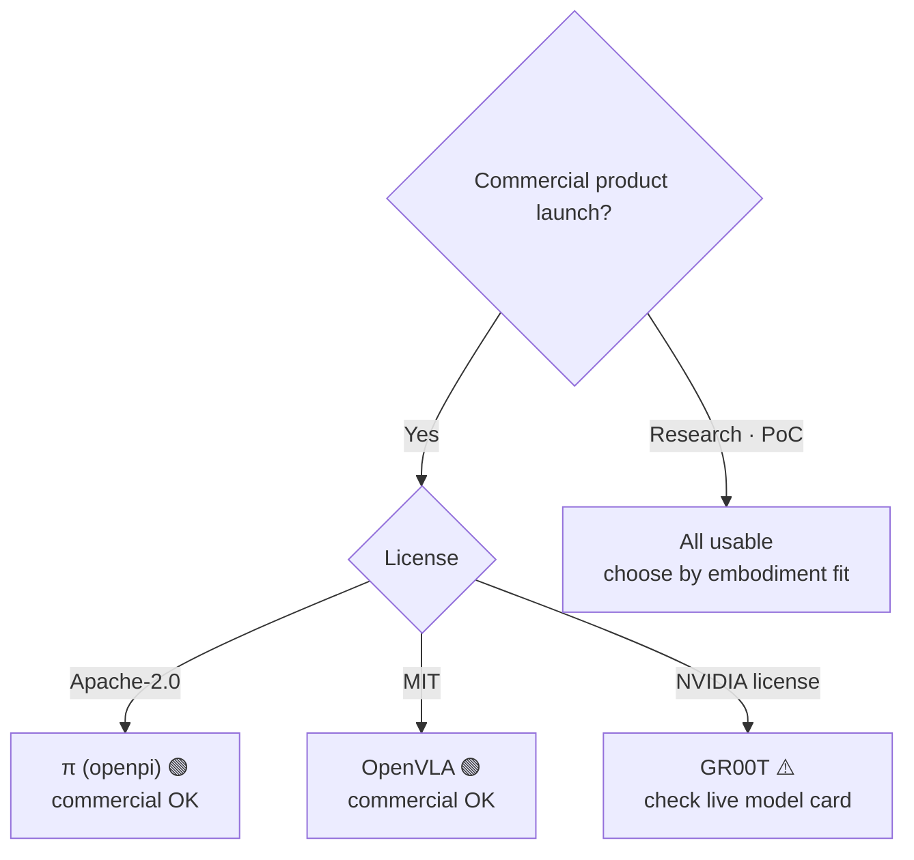
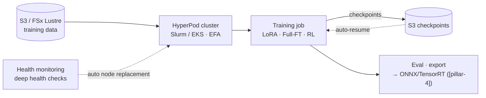
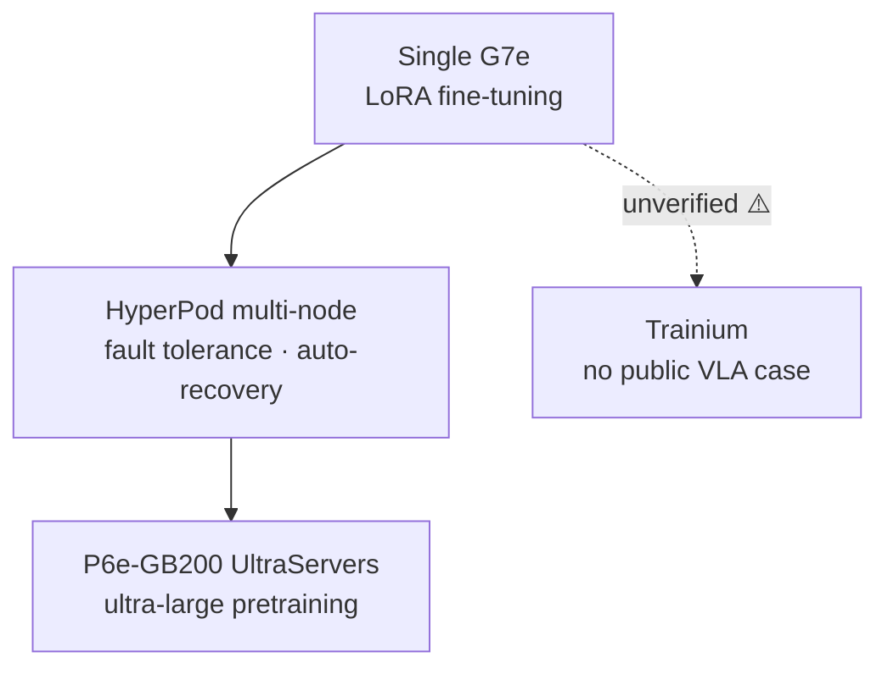

# Pillar 2 — Model Training (VLA)

_Last updated: 2026-09 · owner: Youngjin · volatility: high (model versions/licenses/instances change often)_
_Unless separately noted, each item inherits the page metadata (owner/updated/volatility). When an item has its own owner, add an item footer._
[← back to index](index.md)

> **L0 TL;DR**: Most customers **do not train a VLA[^vla] from scratch — they fine-tune[^ft] an open foundation model**. So the core questions are three: (1) which model to use (**the license governs commercial use**), (2) LoRA[^lora] or full fine-tuning (determines GPU scale), and (3) how to run it on AWS (HyperPod + EC2 GPU). There is still no public case of training a VLA on Trainium.

---

## Top 3 questions customers ask most in this pillar

1. **"Which VLA model do I start with? Which ones can I use commercially?"** → [Open VLA foundation models](#1-open-vla-foundation-models--licenses--ga) (⚠️ the GR00T license trap)
2. **"How many GPUs do I need for fine-tuning? Can LoRA do it on one?"** → [VLA fine-tuning in practice](#2-vla-fine-tuning-in-practice-lora-vs-full-ft--ga)
3. **"How do I run VLA training on AWS? With HyperPod? Can I use Trainium?"** → [AWS training stack](#3-aws-training-stack-hyperpod--ec2-gpu--ga)

> **Stable principle (rarely changes)**: (1) Almost no customer pretrains a frontier VLA — **fine-tuning is 99% of reality**. (2) VLA is converging on a **System 2[^sys] (slow VLM[^vlm] planner, 5~10Hz) + System 1 (fast action policy, 50~200Hz)** structure, and this dual structure decides "whether to put inference in the cloud or at the edge" (→ [pillar-4](pillar-4.md), [decisions](decisions.md)). (3) Continuous action generation standardizes on **flow-matching[^flow] / diffusion action head + action chunking[^chunk]**.

---

## 1. Open VLA foundation models & licenses  🟢 GA

**L0 TL;DR**: The starting point for fine-tuning. **The license matters as much as performance** — the most talked-about NVIDIA GR00T can be non-commercial depending on the version, while Physical Intelligence π (Apache-2.0) and OpenVLA (MIT) are **commercial-friendly with permissive licenses**.

**Customer need/problem**: "We want to adopt a VLA for humanoids/manipulators. Which open models are good, and can we use them commercially in our product?"

**Solution overview** `[1]`:

- **[NVIDIA Isaac GR00T](https://github.com/NVIDIA/Isaac-GR00T)** — open humanoid foundation model. N1 (2B), N1.5 (3B, flow-matching DiT action head), N1.6 (CES 2026, Cosmos Reason 2 backbone), N1.7 (claimed GA on GitHub). ⚠️ **License caution**: the N1.5 model card is **non-commercial (NVIDIA license, non-commercial)**. The claim that N1.6/N1.7 permit commercial use is **secondary-source only and unverified** → before any commercial judgment, **check the live model card directly**. `[1]` github.com/NVIDIA/Isaac-GR00T
- **[Physical Intelligence π (openpi)](https://github.com/Physical-Intelligence/openpi)** — π0, π0-FAST, π0.5 are all **Apache-2.0** (commercial OK). Provides DROID/ALOHA/LIBERO fine-tuning checkpoints. `[1]` github.com/Physical-Intelligence/openpi. ⚠️ π0.7 exists in secondary sources only (unverified).
- **[OpenVLA](https://github.com/openvla/openvla)** — 7B, **MIT license** (commercial OK), Llama2-based VLM backbone. Provides official fine-tuning scripts. `[1]` github.com/openvla/openvla (LICENSE file checked directly 2026-07)

**AWS mapping**: mirror the model weights from HF to S3 → fine-tune on EC2 GPU (P6/G7e) or SageMaker HyperPod (items 2 · 3 below). GR00T post-train/eval is possible with [LeRobot](https://github.com/huggingface/lerobot) (`groot` policy type).

**Decision criteria**:

- **Commercial product launch** → prefer π (Apache-2.0) or OpenVLA (MIT). GR00T only after the license is confirmed.
- **Full-body humanoid control** → GR00T is the most complete (SONIC controller, Cosmos Reason backbone), but confirm the license.
- **Research/PoC** → all usable; choose by performance/embodiment[^embodiment] fit.

**Customer case**: case pending (no public Korean VLA fine-tuning case confirmed).

**➡️ Next action**: if the customer is selecting a model, **present the "license matrix (GR00T=confirm needed / π=Apache-2.0 / OpenVLA=MIT) as the first slide."** For commercial use, propose a π0.5 or OpenVLA fine-tuning PoC on EC2 G7e.

**🔗 Related assets**: [pillar-1 dataset licenses](pillar-1.md) · [pillar-4 edge deployment](pillar-4.md) · [Robot foundation model paper reviews](https://hi-space.gitbook.io/physical-ai-on-aws/paper-review-tbd/robot-foundation-model) — Korean. Paper summaries of reasoning VLM (Cosmos-Reason 1) and VLA (RT-2, OpenVLA, Gemini Robotics, GR00T N1, π0.6)

🔄 Volatile data (model versions/licenses — subject to update, checked 2026-07)

| Model | Parameters | License | Commercial | Backbone / action head | Note |
|---|---|---|---|---|---|
| GR00T N1 | 2B | NVIDIA (non-commercial) | ❌ | SigLip2+T5 / flow-matching DiT | |
| GR00T N1.5 | 3B | NVIDIA (non-commercial) | ❌ | / flow-matching DiT | stated on model card |
| GR00T N1.6 | ~3B | commercial claimed [4] | ⚠️unverified | Cosmos Reason 2 | CES 2026 |
| GR00T N1.7 | 3B | NVIDIA Open Model | ⚠️unverified | Cosmos-Reason2-2B / diffusion | claimed GA on GitHub, 40 timestep horizon |
| π0 / π0-FAST / π0.5 | undisclosed | **Apache-2.0** | ✅ | flow-matching (π0-FAST=autoregressive) | |
| OpenVLA | 7B | **MIT** | ✅ | Llama2 VLM | license checked directly 2026-07 |

⚠️ **The N1.5 vs N1.6 vs N1.7 version-to-license mapping is inconsistent across sources.** Before any commercial claim, check the live HF/GitHub model card directly. This item carries the highest citation risk in Pillar 2.

---

## 2. VLA fine-tuning in practice (LoRA vs Full-FT)  🟢 GA

**L0 TL;DR**: The good news — **LoRA fine-tuning is possible on a single GPU (24GB class)**, and with 100~500 demos per task you get 80%+ success on a single task. Full fine-tuning needs 70~100GB (H100/A100 class).

**Customer need/problem**: "We want to adapt a VLA to our task — how many GPUs do we need to secure, and how much data?"

**Solution overview** `[1]`:

- **OpenVLA**: LoRA (rank 32) ~24GB single GPU (A100/RTX 4090). 48GB→batch 12, 80GB→batch 24. Full fine-tuning ~100GB. Official `vla-scripts/finetune.py`.
- **openpi (π0/π0.5)**: inference >8GB, LoRA >22.5GB (RTX 4090), **full fine-tuning >70GB (A100/H100)**. Official LoRA/full recipes, PyTorch support added 2025-09. 1~20 hours of data is enough for many tasks.
- **GR00T (N1.5/N1.7)**: fine-tuning 40GB+ GPU (H100/L40 recommended), inference 16GB+. NVIDIA official post-training recipe.
- **Sense of data volume**: LoRA, single task, 100~500 demos → 80%+ success. A small batch of high-quality real demos is key (→ [pillar-1 teleoperation](pillar-1.md)).
- **What to unfreeze — the component you train is the cost** `[1]/[2]`: a modern VLA is an assembly of (1) a VLM that understands, (2) a DiT[^dit] that generates actions, and (3) a per-robot adapter MLP ([GR00T N1 structure, arXiv:2503.14734](https://arxiv.org/abs/2503.14734)). "What you want to change" decides which component to open (unfreeze) and the cost:

| What you want to change | MLP (adapter) | DiT (action) | VLM (understanding) | Sense of cost `[2]` |
|---|---|---|---|---|
| Existing robot + existing motions | keep | keep | keep | no training needed (use as-is) |
| **New robot**, existing motions | **train** | freeze | freeze | 50~200 teleop demos, 2~6 hours, ~$10 on g5.2xlarge |
| New motion (verb not in pretraining) | train | **train** | freeze | half a day |
| Special camera modality (IR etc.) | train | train | LoRA | days, the most expensive |

- ⚠️ **New robot = adapter required** `[2]`: GR00T ships MLPs only for pre-registered embodiments (GR-1, Franka, etc.). Put it on an unregistered robot as-is and the output is meaningless (measured 0% success) — the minimum bar is **~100 demos + adapter training**. Common verbs like fold/pour/stack are already in pretraining, so the MLP alone suffices; unseen motions like welding need the DiT opened as well.

**AWS mapping**: for LoRA, **EC2 G6e (L40S) · G7e (RTX PRO 6000)** single/few GPUs suffice. For full fine-tuning / multi-embodiment, **P6-B200 / HyperPod multi-node** (item 3 below).

**Decision criteria**:

- Task-specific, small data → **LoRA + single G7e**. Cheapest, fastest. Most start here.
- Multiple embodiments, large scale, tuning down to the backbone → **full fine-tuning + P6/HyperPod**.
- Data <1 hour → consider few-shot/prompting before fine-tuning.

**Customer case**: case pending (no official AWS VLA fine-tuning case — the Unitree H1 in item 3 is RL locomotion, not VLA).

**➡️ Next action**: use **"LoRA fine-tuning 1-day PoC on a single G7e"** as the default entry proposal. If the customer has 100+ demos, you can show measured success rates right away. If GPU procurement gets blocked → [decisions](decisions.md).

**🔗 Related assets**: [pillar-1 data pipeline](pillar-1.md) · [decisions: Build vs Buy](decisions.md)

🔄 Volatile data (GPU requirements — per official repos as of 2026-07)

| Model | Inference | LoRA fine-tuning | Full fine-tuning |
|---|---|---|---|
| OpenVLA (7B) | — | ~24GB (single) | ~100GB |
| π0 / π0.5 | >8GB | >22.5GB | >70GB (A100/H100) |
| GR00T N1.5/N1.7 | 16GB+ | 40GB+ (H100/L40) | — |

---

## 3. AWS training stack (HyperPod + EC2 GPU)  🟢 GA

**L0 TL;DR**: SageMaker HyperPod handles fault tolerance, auto-recovery, and elastic scaling for distributed training, and EC2 goes from **G7e (single~few) → P6-B200/P6e-GB200 (large scale)**. But **there is no VLA-specific HyperPod recipe** (only LLM recipes) — VLA training is DIY on top of the cluster.

**Customer need/problem**: "We need infrastructure to run fine-tuning/training reliably. If a node dies, do we start over from scratch?"

**Solution overview** `[1]`:

- **[SageMaker HyperPod](https://aws.amazon.com/sagemaker/hyperpod/)** — supports Slurm + **EKS** + Training Jobs. **Checkpointless training** (auto-recovery within minutes on failure, no manual intervention), **Elastic training** (auto-scale by availability/priority, auto checkpoint/resume). **G7e + r5d.16xlarge support added 2026-04**. HyperPod CLI/SDK provided.
- **EC2 GPU ladder** `[1]`: **G7** (RTX PRO 4500, GA 2026-06) · **G7e** (RTX PRO 6000 Blackwell, GA 2026-01) · **G6e** (L40S) → **P6-B200** (8×B200, 1440GB HBM) · **[P6e-GB200 UltraServers](https://aws.amazon.com/ec2/ultraservers/)** (GB200 NVL72, up to 72 Blackwell/NVLink domain, secured via [Capacity Blocks](https://aws.amazon.com/ec2/capacityblocks/)).
- **Trainium**: Trn2 GA (2024-12), **Trn3 UltraServers GA (2025-12 re:Invent)**, Trn4 announced. ⚠️ **No public case of training VLA/robotics on Trainium** — the whole VLA toolchain is CUDA/NVIDIA. Trainium-for-VLA is unverified.
- **Latest generation in the Seoul Region** `[1]`: **[P6-B300](https://aws.amazon.com/about-aws/whats-new/2026/08/amazon-ec2-p6-b300/)** (8×NVIDIA Blackwell Ultra, 2.1TB HBM3e per instance, 6.4Tbps EFA) went **GA in the Seoul Region on 2026-08-20** — Korean teams get the latest accelerator within data residency, without waiting on overseas regions. Consumed via Capacity Blocks / Savings Plans / On-Demand. Honest scope: it is a general-purpose FM training platform, and Physical AI (simulation/VLA training) is one workload on top of it.
- **Recommended patterns by scale (3B-class VLA, validated on GR00T N1.6/N1.7)** `[2]`: ① <200 demos, LoRA (2~4 hours) → **AWS Batch + EC2 Spot (g6e)** — short and cheap, the recommended default. ② ~500 demos, full fine-tuning (8~24 hours) → **SageMaker Training Job** — automatic checkpoint/resume. ③ 500+ demos, multi-node (days) → **HyperPod** — automatic node recovery + EFA. Against GPU capacity shortages, pre-define an **instance fallback order** (e.g., g6e → g6 → g5) in the job definition so it moves to the next type without waiting.

**What HyperPod actually does** `[1]` (docs verified 2026-07):

| Component | Technical summary | For VLA training |
|---|---|---|
| **Orchestration** | Three modes — **Slurm[^slurm], EKS, and Training Jobs** — accommodating both HPC teams (Slurm) and Kubernetes teams (EKS) with their existing workflows | Run Isaac Lab RL (Slurm convention) and VLA fine-tuning (EKS) on the same cluster |
| **Resiliency stack** | A health-monitoring agent plus deep health checks continuously watch GPUs and network → **faulty nodes are replaced automatically and jobs auto-resume from the last checkpoint** (zero intervention). Checkpointless training recovers within minutes even without checkpoints | The direct answer to "if a node dies, do we start over?" on weeks-long runs |
| **Task Governance** | Per-team/project quotas **down to individual GPUs**, priority scheduling, preemption of low-priority jobs (checkpoint, pause, resume later), and lending idle compute across teams | Managing GPU idle rates when robot and model teams share one cluster |
| **Elastic training** | Jobs scale up/down automatically with capacity and priority, with automatic checkpoint/resume | Absorbs Capacity Blocks allocations as they fluctuate over time |
| **Network & storage** | **EFA[^efa]** low-latency inter-node communication + FSx for Lustre training channels (→ the [pillar-1](pillar-1.md) pipeline) | Removes the multi-node gradient-sync bottleneck |
| **Recipes** | Pre-validated training recipes for LLMs/FMs — ⚠️ **no VLA-specific recipes**; VLA training is DIY on the cluster | This gap is the SA's whitespace (an opportunity to build reusable fine-tuning recipes) |

**AWS mapping**: the services above are themselves the mapping. GPU-securing strategy (On-Demand vs Capacity Blocks vs Flexible Training Plans) → [decisions](decisions.md).

**Decision criteria**:

- Single/few-GPU LoRA → EC2 G7e directly, without HyperPod.
- Multi-node, long-running, needs fault tolerance → **HyperPod (EKS)** + checkpointless.
- Ultra-large pretraining → P6e-GB200 UltraServers + Capacity Blocks.
- Proposing Trainium → state that it is **currently safe for LLM targets, but unverified for VLA** and share the risk.

**Customer case** `[1]`:

- **Trained Unitree H1 humanoid RL on Isaac Lab + SageMaker (HyperPod)** — AWS official blog (2026-06-09). 19-joint velocity tracking, PPO (skrl), demonstrated HyperPod health monitoring, auto-replacement, and checkpoint resume. ⚠️ **This is RL locomotion, not VLA fine-tuning** — cite only as a reference architecture.
- **Zoox** — multimodal AV foundation model on HyperPod, 95% utilization on 64+ GPUs. ⚠️ AV.

**➡️ Next action**: **use the official AWS "Isaac Lab on SageMaker" blog as a workshop asset as-is** (the only reproducible AWS robotics training reference). If GPU availability is an issue, connect to Capacity Blocks / Flexible Training Plans.

**🔗 Related assets**:

- Playbook: [pillar-3 Simulation (Isaac Lab)](pillar-3.md) · [decisions: securing GPUs](decisions.md)
- [Physical AI E2E workshop](https://hi-space.gitbook.io/physical-ai-on-aws/guide/e2e-workshop) — Korean. GR00T VLA fine-tuning + SageMaker track
- [AWS Physical AI Recipes](https://github.com/hi-space/aws-physical-ai-recipes) — Korean, MIT. Hands-on recipe collection that includes the code behind the E2E workshop above: an Isaac Lab→GR00T fine-tuning→inference→monitoring E2E (CDK), SageMaker HyperPod VLA/RL distributed-training infrastructure (Slurm·FSx·MLflow), a GR00T-N1.6-3B SageMaker fine-tuning pipeline, and NVIDIA OSMO[^osmo] on EKS workflow orchestration
- [Physical AI 101 — a concept map for getting started](https://d2gup9k4vdzl3b.cloudfront.net/pai101/index.html) — single-page primer: big picture → research landscape → VLA fine-tuning → model internals → robot fundamentals → the role of AWS, with AWS PAI reference architectures and a glossary. Korean/English toggle built in; points to this playbook as the next step
- [Physical AI Scaffolding Kit](https://github.com/aws-samples/sample-physical-ai-scaffolding-kit) — aws-samples. HyperPod Slurm cluster + π0·GR00T·Isaac Lab Newton RL training samples, multilingual README (ko·ja·en). Official asset of the AWS Japan Physical AI Development Support Program
- [Embodied AI Platform](https://github.com/aws-samples/sample-embodied-ai-platform) — aws-samples. GR00T VLA teleoperation/imitation-learning fine-tuning on AWS Batch + DCV workstation → on-robot inference on SO-ARM100/101. ⚠️ Only the GR00T training component is Available; the rest is roadmap

---

## 4. System 2 + System 1 architecture  🟢 GA (stable principle)

**L0 TL;DR**: The dominant VLA structure in 2026. A **slow VLM (System 2, 5~10Hz) plans "what to do,"** and a **fast action policy (System 1, 50~200Hz) executes "how to move."** This separation **determines the inference deployment location (cloud vs edge)**, so it is a concept an SA must understand.

**Customer need/problem**: "It's real-time control — how do we run a large model? Isn't cloud latency a problem?"

**Solution overview** `[1]/[4]`:

- **[Figure Helix](https://www.figure.ai/news/helix)**: System 2 = on-board internet-pretrained VLM @ 7~9Hz (scene/language), System 1 = reactive visuomotor @ 200Hz. `[1]` figure.ai/news/helix
- **GR00T N1**: System 1 = diffusion policy ~10ms latency, System 2 = LLM planner (task decomposition).
- **General pattern**: a heavy VLM replans at 5~10Hz, and a lightweight flow-matching/diffusion "action expert" emits actions at 50~200Hz conditioned on the latest plan. Predict future action chunks via **action chunking** (GR00T = 40 timestep horizon).
- **The field-wide 2-axis taxonomy** `[1]`: before drowning in model names — most VLAs sit on a 2×2 of (1) **network structure**: Monolithic (single-net end-to-end) vs Hierarchical (planner + executor split), and (2) **thinking system**: Single-system vs Dual-system (sequential cascade / parallel). GR00T's "two brains" is a concrete instance of the hierarchical × dual-system (parallel) cell — System 1/2 is not a single model's story but the field's primary classification axis.
- **Effective control rate = inference Hz × chunk size**: even if π0.5 infers at ~10Hz on a Jetson, emitting a 10-step chunk per inference moves the robot at ~100Hz (the next chunk is precomputed while the current one runs). This arithmetic is the key to dispelling the "big model = slow robot" misconception.
- ⚠️ **Beware the "VLAs are dead (WAM[^wam] replaces them)" headline** `[1]/[4]`: a WAM (World Action Model) uses a video-diffusion backbone to **jointly predict** future video + actions — the physics prior from web video makes it strong at unseen-motion zero-shot ([DreamZero, arXiv:2602.15922](https://arxiv.org/abs/2602.15922): from only ~500 hours of robot data, unseen tasks 16%→40%s), but iterative denoising at 14B makes it **the slowest closed-loop, ~7Hz**. In the same period as the "VLAs are dead" keynote, NVIDIA itself shipped GR00T N1.7 (a VLA), and independent comparisons show a VLA (π0.5) matching a WAM when data diversity is sufficient — the real picture is **"VLA + World Model + RL post-training converging."** Do not repeat the headline verbatim in customer conversations (maturity tracking: [World-action models in the radar](radar.md)).
- ⚠️ **Maturity honesty**: this *pattern itself* is standard, but full-stack whole-body humanoids are mostly at the pilot/demo stage.

**AWS mapping**: putting **System 2 (planner) in the cloud/Bedrock AgentCore and System 1 (real-time control) at the edge (Jetson)** is the natural split (→ [pillar-5](pillar-5.md), [pillar-4](pillar-4.md), [decisions](decisions.md)).

**Decision criteria**: 30~100Hz real-time control requirement → System 1 **must be edge on-board**. System 2 (planning/reasoning) can be in the cloud if latency is tolerable. This boundary is the core of the [Cloud vs Edge tree in decisions](decisions.md).

**Customer case**: Figure (demo/PR), GR00T (open model). Validated production is limited.

**➡️ Next action**: when the customer asks "it's real-time — can it go to the cloud?", **draw the System1/System2 picture and frame it as "control loop at the edge, planning in the cloud."** This alone organizes the architecture conversation.

**🔗 Related assets**: [pillar-4 edge inference](pillar-4.md) · [pillar-5 orchestration](pillar-5.md) · [decisions](decisions.md)

---

## 5. (Competing stack) Google Gemini Robotics  🟡 Preview

**L0 TL;DR**: Google's robot VLA family. **Gemini Robotics-ER 1.6 is in preview (Gemini API/AI Studio)** as an embodied-reasoning (high-level reasoning · tool-calling) layer, while the low-level motor-control VLA is partner-only. It is a competing stack, but customers ask about it often, so we treat it honestly.

**Customer need/problem**: "Can't we just use Gemini Robotics? How does it relate to AWS?"

**Solution overview** `[1]`:

- **Gemini Robotics-ER 1.6** (2026-04 **Preview**, model id: `gemini-robotics-er-1.6-preview`, AI Studio + Gemini API) — agentic embodied reasoning: task decomposition, tool-calling (including Search), VLA invocation, reading analog gauges. **A reasoning/VLM layer, not low-level control**. Google's official docs state it is "currently in preview" `[1]`.
- **Gemini Robotics On-Device** (2025-06) — the first locally deployable VLA, supports fine-tuning (50~100 demos). **waitlist/trusted-tester (Preview)**.
- **Gemini Robotics 1.5 VLA** — partner-only.

**AWS mapping (competing stack → complemented by AWS)**: Gemini Robotics-ER plays the **planner (System 2) role** — even if a customer uses it, **robot fleet orchestration, tool gateway, and policy guardrails can be wrapped with Bedrock AgentCore** (→ [pillar-5](pillar-5.md)). For low-level control VLA, offer the alternative of fine-tuning open models (π/OpenVLA/GR00T) on AWS.

**Decision criteria**:

- Need fast high-level reasoning and can accept the Google ecosystem / preview risk → trying the ER 1.6 API is fine (but it is Preview — no production commitment).
- Commercial / on-prem / data sovereignty / low-level control customization → **fine-tuning open VLAs on AWS** is more flexible.

**Customer case**: partner deployments (many undisclosed).

**➡️ Next action**: if the customer is evaluating Gemini Robotics, **propose a hybrid where "even if you use that reasoning layer, you own orchestration, guardrails, and the low-level control model on AWS"** (a complementary, not competitive, angle).

**🔗 Related assets**: [pillar-5 AgentCore](pillar-5.md)

---

## 6. Training operations principles — checkpoint lineage and the IL ceiling  🟢 GA (stable principle)

**L0 TL;DR**: Two traps that repeatedly wreck customer training projects. (1) **Checkpoints are a tree** — specialization is one-way, so if you lose the generalist checkpoint you cannot go back. (2) **Low loss does not raise success rates** — that is imitation learning's covariate shift[^covshift], and evaluation must be done **only by rollout success rate**, not loss.

**Customer need/problem**: "Every round of fine-tuning erodes earlier capabilities" / "Training loss keeps falling but the real success rate doesn't move."

**Solution overview** `[1]/[2]`:

- **Checkpoint tree management**: weights grow by branching (spin-off) in the order generalist → embodiment-specialized → task-specialized (10~150 demos) → real-deployment calibration. **The chain is one-way** — restoring a generalist from specialized weights is effectively impossible (catastrophic forgetting[^forget]). When a branch overfits to a specific motion and collapses, don't push that branch further — **go back to an earlier (more general) checkpoint and re-branch**.
- **The real answer to "apply customer A's weights to customer B"**: not A's specialist weights but **a fresh fine-tune for B from the generalist above them**. If you branched with LoRA, you can detach just the adapter and return to the generalist — the operational reason to recommend LoRA branching from the start.
- **The "open weights" trap**: first check which stage of the lineage a public checkpoint is — a model released only as a Stage-3 specialist cannot be used outside that robot/environment (no reverse recovery). This is why OpenVLA, GR00T, and π0/π0.5 release generalist (foundation) checkpoints.
- **The IL ceiling = covariate shift**: BC learns only "state the expert was in → expert action" pairs, so when a small execution error drifts the policy into states outside the demo distribution (OOD), the data contains no way to recover and errors snowball — in the worst case compounding as T² over horizon T ([Ross et al., DAgger, arXiv:1011.0686](https://arxiv.org/abs/1011.0686)). **Neither training loss nor validation loss catches this** (both are measured on the same demo distribution).
- **The prescription**: not "a better val set" but **putting the distribution the policy actually visits into training** — DAgger[^dagger] (adding expert labels on states the policy visited) → on-policy data → RFT (item 7 below). Diagnostic signal: loss ≈ 0 with a flat success rate → time to change the approach, not train more.

**AWS mapping**: checkpoint lineage = S3 versioning + separate retention per stage (HyperPod automatic checkpointing is item 3). Evaluation rollouts = simulation sweeps ([pillar-3](pillar-3.md); limits of evaluation in [pillar-4 policy evaluation](pillar-4.md)).

**Decision criteria**: keep the generalist checkpoint separately in every case (never overwrite). Any training contract/milestone whose evaluation metric is loss should be renegotiated.

**Customer case**: case pending (the principle itself is grounded in public papers).

**➡️ Next action**: in any customer training-pipeline review, start with two questions — **"where do you keep the generalist checkpoint" and "do you evaluate by loss or by rollouts."** If these two wobble, the rest of the discussion is moot.

**🔗 Related assets**: [pillar-4 policy evaluation](pillar-4.md) · [pillar-1 teleoperation](pillar-1.md)

---

## 7. RL fine-tuning (RFT) — PPO vs GRPO and reward design  🟢 GA (algorithms) / 🔵 reward automation Research

**L0 TL;DR**: SFT (imitation) alone learns even the demonstrator's mistakes. The finishing stage driven by environment rewards is RFT[^rft] — algorithm-wise, **PPO[^ppo] is the long-standing standard and critic-free GRPO[^grpo] is surging** (the bigger the model, the bigger the compute win). The real battleground is not the algorithm but **reward design** — "simulator fidelity is reward fidelity."

**Customer need/problem**: "BC got us to 80% but we can't get past it. What do we use to finish with RL, and how?"

**Solution overview** `[1]`:

- **PPO** ([Schulman et al., arXiv:1707.06347](https://arxiv.org/abs/1707.06347)) — "only small steps near the previous policy." In RL the policy creates its own training data, so one big broken update collects worse data and spirals — the clip prevents that jump. The de facto standard for robot RL.
- **GRPO** ([DeepSeekMath, arXiv:2402.03300](https://arxiv.org/abs/2402.03300)) — removes the critic (value network) and uses the **group-mean return of N rollouts from the same state as the baseline**. The critic's compute/memory (as large as the policy net) disappears — a win for VLA-class large models. The group baseline can be higher-variance, so make N large enough.
- **Reward design is the battleground**: sparse (+1 only on success) yields no learning signal before the first success; dense (distance-based shaping) risks designer bias and reward hacking[^rhack] (maximizing the score without doing the task). The reward must measure **the outcome you actually want**, and how faithfully the simulator reproduces friction/contact/latency is the fidelity of the reward signal itself (→ [pillar-3](pillar-3.md)).
- **A validated practical recipe — the Teacher-Student pipeline** `[1]`: ① Teacher = **PPO + privileged state** (GT pose, contact, etc., in massively parallel Isaac Lab) → ② Student = **DAgger + BC distillation** (deployable inputs only: RGB + proprioception) → ③ bootstrap with **GRPO + binary success reward**. Demonstrated by [VIRAL (arXiv:2511.15200)](https://arxiv.org/abs/2511.15200) and [DoorMan (arXiv:2512.01061)](https://arxiv.org/abs/2512.01061) (both CVPR 2026) — DoorMan hits 83% SR, above the expert-teleoperation baseline (80%).
- 🔵 **Reward automation (Research)**: you can't hand-craft dense rewards per task — VLM-based per-step progress scoring like [GVL (arXiv:2411.04549)](https://arxiv.org/abs/2411.04549), [TopReward (arXiv:2602.19313)](https://arxiv.org/abs/2602.19313), and [VLLR (arXiv:2604.00055)](https://arxiv.org/abs/2604.00055) is active, but as of 2026 progress models that satisfy "commercially usable + low latency + open weights" all at once are rare. Where success is objectively verifiable (arrival, assembly complete), a deterministic verifier giving the reward directly — RLVR — is the safe starting point.

**AWS mapping**: teacher-side massively parallel RL = Isaac Lab on EC2 G6e/AWS Batch (→ [pillar-3](pillar-3.md)); distillation and GRPO bootstrap = the item-3 training stack as-is. [sample-vla-finetuning](https://github.com/aws-samples/sample-vla-finetuning) provides both IL/RL paths as IaC (related assets below).

**Decision criteria**: can collect hundreds of clean demonstrations → warm-start with IL. No demos + a good simulator/reward → RL. **The practical answer is usually hybrid (IL → RFT)**. Critic memory is the bottleneck on a large VLA → GRPO.

**Customer case**: case pending (VIRAL/DoorMan are paper demonstrations — not customer deployments).

**➡️ Next action**: for customers plateaued on BC, propose the **Teacher-Student (PPO→distill→GRPO) 3-stage recipe** — every stage completes inside simulation, so the existing AWS Batch/Isaac Lab stack is reused as-is.

**🔗 Related assets**: [pillar-3 parallel RL](pillar-3.md) · [sample-vla-finetuning](https://github.com/aws-samples/sample-vla-finetuning) — aws-samples, MIT-0. A one-command fine-tuning platform: give it the intent (IL demos or an RL task) and it auto-selects among the Batch+Spot / SageMaker Training / HyperPod patterns. GR00T·π0.5·ACT·SmolVLA plus an Isaac Lab RL path, with an MCP server (7 tools) for submit/monitoring from agent sessions

---

## The honest reality of this pillar (SA must-read)

- **The GR00T license is the biggest citation risk right now.** N1.5 is clearly non-commercial. Commercial permission for N1.6/N1.7 is secondary-source only → **check the live model card directly before any customer commercial judgment**. Getting it wrong is a legal risk.
- **Do not say "PI (Physical Intelligence) uses AWS."** The openpi checkpoints are on GCS (`gs://`), a **GCP signal**. There is no AWS-PI case.
- **There is no official AWS VLA fine-tuning case.** The only AWS robotics training reference is the **Unitree H1 RL locomotion** (not VLA). Do not exaggerate the VLA story.
- **Trainium-for-VLA is unverified.** The whole VLA toolchain is CUDA. State the risk when proposing.

---
_owner: Youngjin · updated: 2026-09 · volatility: high (model versions · licenses · GPU requirements · instances are managed in the collapsed block) · sources: [1] official/paper, [3] vendor, [4] unverified_

<!-- 용어 각주 -->

[^vla]: **VLA (Vision-Language-Action)** — a foundation model that takes camera images (Vision) and natural-language instructions (Language) as input and directly outputs robot actions (Action). Say "pick up the cup" and it generates the joint motions. 🎥 [NVIDIA Isaac GR00T N1 introduction](https://www.youtube.com/watch?v=m1CH-mgpdYg)
[^ft]: **fine-tuning** — additionally training a model pretrained on large-scale data with a small amount of data from your own task/robot. Saves tens to hundreds of times the data and GPU compared to training from scratch.
[^lora]: **LoRA (Low-Rank Adaptation)** — a lightweight fine-tuning technique that freezes the original weights and trains only small additional low-rank matrices. GPU memory demand is a fraction of full fine-tuning, so a single 24GB-class GPU is enough.
[^sys]: **System 2 / System 1** — the cognitive-science "slow thinking / fast reaction" distinction applied to robot architecture. System 2 is a slow large model that plans (5~10Hz); System 1 is a small policy that runs real-time control (50~200Hz). This becomes the criterion for whether inference goes to the cloud or the edge.
[^flow]: **flow-matching / diffusion action head** — an output module in the diffusion/flow family that generates a robot's continuous actions by gradually refining them from noise. It can express smooth, multi-modal action distributions, making it the standard action head of modern VLAs.
[^chunk]: **action chunking** — predicting a chunk of several future action steps at once instead of one action per step. Reduces the number of inference calls, making it easier to meet real-time control frequencies.
[^vlm]: **VLM (Vision-Language Model)** — a model that understands images and text together (e.g., answering questions about a photo). A VLA typically uses a VLM as its "eyes + brain" backbone and puts an action head on top.
[^embodiment]: **Embodiment** — a robot's physical form, degrees of freedom, and sensor configuration. Even with the same model, a robot arm and a humanoid have different embodiments, so data and policies cannot be transplanted as-is.
[^slurm]: **Slurm** — the standard open-source job scheduler for HPC clusters. It queues and allocates batch jobs across thousands of nodes, and is the workflow most familiar to teams from research labs and supercomputing.
[^efa]: **EFA (Elastic Fabric Adapter)** — a low-latency, OS-bypass network interface for EC2. It is key to reducing the gradient-synchronization (All-Reduce) bottleneck between GPUs in multi-node distributed training.
[^osmo]: **OSMO** — NVIDIA's workflow orchestration platform for robotics workloads. It schedules multi-stage jobs such as synthetic data generation, simulation, and model training across on-premises and cloud clusters (e.g., Kubernetes).
[^dit]: **DiT (Diffusion Transformer)** — a diffusion generator built on the Transformer architecture. In modern VLAs it serves as the "action engine" component that generates robot joint commands (action chunks) from noise.
[^wam]: **WAM (World Action Model)** — a model that uses a video-generation backbone to jointly predict future video and robot actions. Physics knowledge learned from web video makes it strong on unseen motions, but iterative denoising keeps its control frequency low. Not to be confused with a WFM (video generation only, no action output).
[^covshift]: **covariate shift** — the mismatch between the state distribution seen during training and the one actually encountered at execution. When an imitation-learned policy drifts via small errors into states absent from the demos, it never learned how to recover, and errors compound. (The correct term is "covariate," not "covariant.")
[^forget]: **catastrophic forgetting** — the phenomenon where a neural network overwrites and loses previously learned abilities while learning a new task. The reason a generalist cannot be recovered from a specialized checkpoint.
[^dagger]: **DAgger (Dataset Aggregation)** — an imitation-learning augmentation technique: run the learned policy, collect expert ground-truth labels on the states the policy actually visited, and retrain. The classic prescription for covariate shift.
[^rft]: **RFT (Reinforcement Fine-Tuning)** — the finishing stage that further improves an imitation-learned (SFT) policy with environment reward signals. Trial and error finds better behaviors that were not in the demonstrations.
[^ppo]: **PPO (Proximal Policy Optimization)** — the most widely used reinforcement-learning algorithm. It clips the update size so the policy "never moves too far from the previous one," converging stably — the de facto default for robot RL.
[^grpo]: **GRPO (Group Relative Policy Optimization)** — a reinforcement-learning algorithm that uses the group mean of several rollouts from the same state as the baseline, with no separate value network (critic). Removing the critic's training cost made it surge for large models (LLM/VLA).
[^rhack]: **reward hacking** — when the reward is misdesigned, the agent games the score itself instead of the intended goal (e.g., rewarding "distance moved forward" leads to spinning in place to fool the sensor). The reward must measure the outcome you actually want.
