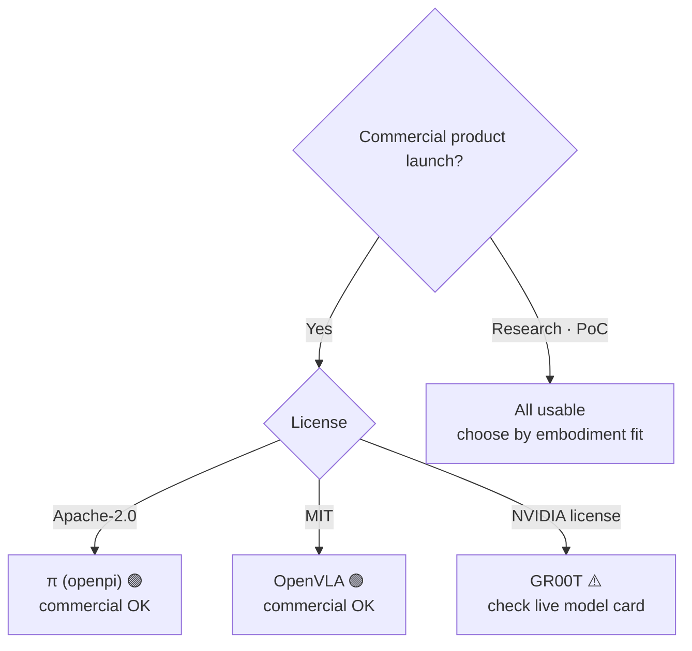
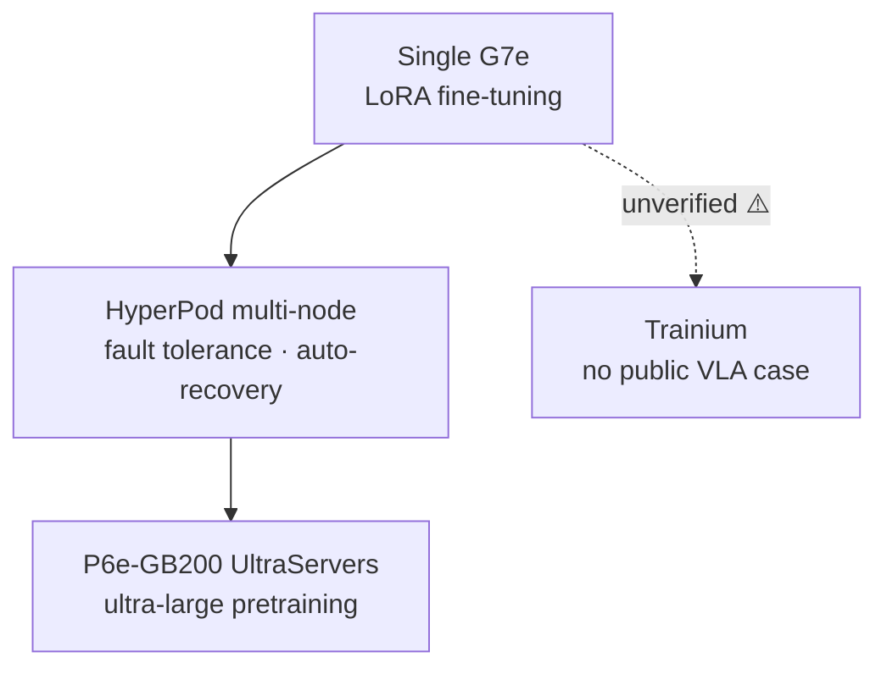

# Pillar 2 — Model Training (VLA)

_Last updated: 2026-07 · owner: Youngjin · volatility: high (model versions/licenses/instances change often)_
_Unless separately noted, each item inherits the page metadata (owner/updated/volatility). When an item has its own owner, add an item footer._
[← back to index](index.md)

> **L0 TL;DR**: Most customers **do not train a VLA from scratch — they fine-tune an open foundation model**. So the core questions are three: (1) which model to use (**the license governs commercial use**), (2) LoRA or full fine-tuning (determines GPU scale), and (3) how to run it on AWS (HyperPod + EC2 GPU). There is still no public case of training a VLA on Trainium.

---

## Top 3 questions customers ask most in this pillar

1. **"Which VLA model do I start with? Which ones can I use commercially?"** → [Open VLA foundation models](#1-open-vla-foundation-models--licenses--ga) (⚠️ the GR00T license trap)
2. **"How many GPUs do I need for fine-tuning? Can LoRA do it on one?"** → [VLA fine-tuning in practice](#2-vla-fine-tuning-in-practice-lora-vs-full-ft--ga)
3. **"How do I run VLA training on AWS? With HyperPod? Can I use Trainium?"** → [AWS training stack](#3-aws-training-stack-hyperpod--ec2-gpu--ga)

> **Stable principle (rarely changes)**: (1) Almost no customer pretrains a frontier VLA — **fine-tuning is 99% of reality**. (2) VLA is converging on a **System 2 (slow VLM planner, 5~10Hz) + System 1 (fast action policy, 50~200Hz)** structure, and this dual structure decides "whether to put inference in the cloud or at the edge" (→ [pillar-4](pillar-4.md), [decisions](decisions.md)). (3) Continuous action generation standardizes on **flow-matching / diffusion action head + action chunking**.

---

## 1. Open VLA foundation models & licenses  🟢 GA

**L0 TL;DR**: The starting point for fine-tuning. **The license matters as much as performance** — the most talked-about NVIDIA GR00T can be non-commercial depending on the version, while Physical Intelligence π (Apache-2.0) and OpenVLA (MIT) are **commercial-friendly with permissive licenses**.

**Customer need/problem**: "We want to adopt a VLA for humanoids/manipulators. Which open models are good, and can we use them commercially in our product?"

**Solution overview** `[1]`:

- **[NVIDIA Isaac GR00T](https://github.com/NVIDIA/Isaac-GR00T)** — open humanoid foundation model. N1 (2B), N1.5 (3B, flow-matching DiT action head), N1.6 (CES 2026, Cosmos Reason 2 backbone), N1.7 (claimed GA on GitHub). ⚠️ **License caution**: the N1.5 model card is **non-commercial (NVIDIA license, non-commercial)**. The claim that N1.6/N1.7 permit commercial use is **secondary-source only and unverified** → before any commercial judgment, **check the live model card directly**. `[1]` github.com/NVIDIA/Isaac-GR00T
- **[Physical Intelligence π (openpi)](https://github.com/Physical-Intelligence/openpi)** — π0, π0-FAST, π0.5 are all **Apache-2.0** (commercial OK). Provides DROID/ALOHA/LIBERO fine-tuning checkpoints. `[1]` github.com/Physical-Intelligence/openpi. ⚠️ π0.7 exists in secondary sources only (unverified).
- **[OpenVLA](https://github.com/openvla/openvla)** — 7B, **MIT license** (commercial OK), Llama2-based VLM backbone. Provides official fine-tuning scripts. `[1]` github.com/openvla/openvla (LICENSE file checked directly 2026-07)

**AWS mapping**: mirror the model weights from HF to S3 → fine-tune on EC2 GPU (P6/G7e) or SageMaker HyperPod (items 2 · 3 below). GR00T post-train/eval is possible with [LeRobot](https://github.com/huggingface/lerobot) (`groot` policy type).

**Decision criteria**:

- **Commercial product launch** → prefer π (Apache-2.0) or OpenVLA (MIT). GR00T only after the license is confirmed.
- **Full-body humanoid control** → GR00T is the most complete (SONIC controller, Cosmos Reason backbone), but confirm the license.
- **Research/PoC** → all usable; choose by performance/embodiment fit.

**Customer case**: case pending (no public Korean VLA fine-tuning case confirmed).

**➡️ Next action**: if the customer is selecting a model, **present the "license matrix (GR00T=confirm needed / π=Apache-2.0 / OpenVLA=MIT) as the first slide."** For commercial use, propose a π0.5 or OpenVLA fine-tuning PoC on EC2 G7e.

**🔗 Related assets**: [pillar-1 dataset licenses](pillar-1.md) · [pillar-4 edge deployment](pillar-4.md)

🔄 Volatile data (model versions/licenses — subject to update, checked 2026-07)

| Model | Parameters | License | Commercial | Backbone / action head | Note |
|---|---|---|---|---|---|
| GR00T N1 | 2B | NVIDIA (non-commercial) | ❌ | SigLip2+T5 / flow-matching DiT | |
| GR00T N1.5 | 3B | NVIDIA (non-commercial) | ❌ | / flow-matching DiT | stated on model card |
| GR00T N1.6 | ~3B | commercial claimed [4] | ⚠️unverified | Cosmos Reason 2 | CES 2026 |
| GR00T N1.7 | 3B | NVIDIA Open Model | ⚠️unverified | Cosmos-Reason2-2B / diffusion | claimed GA on GitHub, 40 timestep horizon |
| π0 / π0-FAST / π0.5 | undisclosed | **Apache-2.0** | ✅ | flow-matching (π0-FAST=autoregressive) | |
| OpenVLA | 7B | **MIT** | ✅ | Llama2 VLM | license checked directly 2026-07 |

⚠️ **The N1.5 vs N1.6 vs N1.7 version-to-license mapping is inconsistent across sources.** Before any commercial claim, check the live HF/GitHub model card directly. This item carries the highest citation risk in Pillar 2.

---

## 2. VLA fine-tuning in practice (LoRA vs Full-FT)  🟢 GA

**L0 TL;DR**: The good news — **LoRA fine-tuning is possible on a single GPU (24GB class)**, and with 100~500 demos per task you get 80%+ success on a single task. Full fine-tuning needs 70~100GB (H100/A100 class).

**Customer need/problem**: "We want to adapt a VLA to our task — how many GPUs do we need to secure, and how much data?"

**Solution overview** `[1]`:

- **OpenVLA**: LoRA (rank 32) ~24GB single GPU (A100/RTX 4090). 48GB→batch 12, 80GB→batch 24. Full fine-tuning ~100GB. Official `vla-scripts/finetune.py`.
- **openpi (π0/π0.5)**: inference >8GB, LoRA >22.5GB (RTX 4090), **full fine-tuning >70GB (A100/H100)**. Official LoRA/full recipes, PyTorch support added 2025-09. 1~20 hours of data is enough for many tasks.
- **GR00T (N1.5/N1.7)**: fine-tuning 40GB+ GPU (H100/L40 recommended), inference 16GB+. NVIDIA official post-training recipe.
- **Sense of data volume**: LoRA, single task, 100~500 demos → 80%+ success. A small batch of high-quality real demos is key (→ [pillar-1 teleoperation](pillar-1.md)).

**AWS mapping**: for LoRA, **EC2 G6e (L40S) · G7e (RTX PRO 6000)** single/few GPUs suffice. For full fine-tuning / multi-embodiment, **P6-B200 / HyperPod multi-node** (item 3 below).

**Decision criteria**:

- Task-specific, small data → **LoRA + single G7e**. Cheapest, fastest. Most start here.
- Multiple embodiments, large scale, tuning down to the backbone → **full fine-tuning + P6/HyperPod**.
- Data <1 hour → consider few-shot/prompting before fine-tuning.

**Customer case**: case pending (no official AWS VLA fine-tuning case — the Unitree H1 in item 3 is RL locomotion, not VLA).

**➡️ Next action**: use **"LoRA fine-tuning 1-day PoC on a single G7e"** as the default entry proposal. If the customer has 100+ demos, you can show measured success rates right away. If GPU procurement gets blocked → [decisions](decisions.md).

**🔗 Related assets**: [pillar-1 data pipeline](pillar-1.md) · [decisions: Build vs Buy](decisions.md)

🔄 Volatile data (GPU requirements — per official repos as of 2026-07)

| Model | Inference | LoRA fine-tuning | Full fine-tuning |
|---|---|---|---|
| OpenVLA (7B) | — | ~24GB (single) | ~100GB |
| π0 / π0.5 | >8GB | >22.5GB | >70GB (A100/H100) |
| GR00T N1.5/N1.7 | 16GB+ | 40GB+ (H100/L40) | — |

---

## 3. AWS training stack (HyperPod + EC2 GPU)  🟢 GA

**L0 TL;DR**: SageMaker HyperPod handles fault tolerance, auto-recovery, and elastic scaling for distributed training, and EC2 goes from **G7e (single~few) → P6-B200/P6e-GB200 (large scale)**. But **there is no VLA-specific HyperPod recipe** (only LLM recipes) — VLA training is DIY on top of the cluster.

**Customer need/problem**: "We need infrastructure to run fine-tuning/training reliably. If a node dies, do we start over from scratch?"

**Solution overview** `[1]`:

- **[SageMaker HyperPod](https://aws.amazon.com/sagemaker/hyperpod/)** — supports Slurm + **EKS** + Training Jobs. **Checkpointless training** (auto-recovery within minutes on failure, no manual intervention), **Elastic training** (auto-scale by availability/priority, auto checkpoint/resume). **G7e + r5d.16xlarge support added 2026-04**. HyperPod CLI/SDK provided.
- **EC2 GPU ladder** `[1]`: **G7** (RTX PRO 4500, GA 2026-06) · **G7e** (RTX PRO 6000 Blackwell, GA 2026-01) · **G6e** (L40S) → **P6-B200** (8×B200, 1440GB HBM) · **[P6e-GB200 UltraServers](https://aws.amazon.com/ec2/ultraservers/)** (GB200 NVL72, up to 72 Blackwell/NVLink domain, secured via [Capacity Blocks](https://aws.amazon.com/ec2/capacityblocks/)).
- **Trainium**: Trn2 GA (2024-12), **Trn3 UltraServers GA (2025-12 re:Invent)**, Trn4 announced. ⚠️ **No public case of training VLA/robotics on Trainium** — the whole VLA toolchain is CUDA/NVIDIA. Trainium-for-VLA is unverified.

**AWS mapping**: the services above are themselves the mapping. GPU-securing strategy (On-Demand vs Capacity Blocks vs Flexible Training Plans) → [decisions](decisions.md).

**Decision criteria**:

- Single/few-GPU LoRA → EC2 G7e directly, without HyperPod.
- Multi-node, long-running, needs fault tolerance → **HyperPod (EKS)** + checkpointless.
- Ultra-large pretraining → P6e-GB200 UltraServers + Capacity Blocks.
- Proposing Trainium → state that it is **currently safe for LLM targets, but unverified for VLA** and share the risk.

**Customer case** `[1]`:

- **Trained Unitree H1 humanoid RL on Isaac Lab + SageMaker (HyperPod)** — AWS official blog (2026-06-09). 19-joint velocity tracking, PPO (skrl), demonstrated HyperPod health monitoring, auto-replacement, and checkpoint resume. ⚠️ **This is RL locomotion, not VLA fine-tuning** — cite only as a reference architecture.
- **Zoox** — multimodal AV foundation model on HyperPod, 95% utilization on 64+ GPUs. ⚠️ AV.

**➡️ Next action**: **use the official AWS "Isaac Lab on SageMaker" blog as a workshop asset as-is** (the only reproducible AWS robotics training reference). If GPU availability is an issue, connect to Capacity Blocks / Flexible Training Plans.

**🔗 Related assets**:

- Playbook: [pillar-3 Simulation (Isaac Lab)](pillar-3.md) · [decisions: securing GPUs](decisions.md)
- [Physical AI E2E workshop](https://hi-space.gitbook.io/physical-ai-on-aws/guide/e2e-workshop) — Korean. GR00T VLA fine-tuning + SageMaker track
- [Physical AI Scaffolding Kit](https://github.com/aws-samples/sample-physical-ai-scaffolding-kit) — aws-samples. HyperPod Slurm cluster + π0·GR00T·Isaac Lab Newton RL training samples, multilingual README (ko·ja·en). Official asset of the AWS Japan Physical AI Development Support Program
- [Embodied AI Platform](https://github.com/aws-samples/sample-embodied-ai-platform) — aws-samples. GR00T VLA teleoperation/imitation-learning fine-tuning on AWS Batch + DCV workstation → on-robot inference on SO-ARM100/101. ⚠️ Only the GR00T training component is Available; the rest is roadmap

---

## 4. System 2 + System 1 architecture  🟢 GA (stable principle)

**L0 TL;DR**: The dominant VLA structure in 2026. A **slow VLM (System 2, 5~10Hz) plans "what to do,"** and a **fast action policy (System 1, 50~200Hz) executes "how to move."** This separation **determines the inference deployment location (cloud vs edge)**, so it is a concept an SA must understand.

**Customer need/problem**: "It's real-time control — how do we run a large model? Isn't cloud latency a problem?"

**Solution overview** `[1]/[4]`:

- **[Figure Helix](https://www.figure.ai/news/helix)**: System 2 = on-board internet-pretrained VLM @ 7~9Hz (scene/language), System 1 = reactive visuomotor @ 200Hz. `[1]` figure.ai/news/helix
- **GR00T N1**: System 1 = diffusion policy ~10ms latency, System 2 = LLM planner (task decomposition).
- **General pattern**: a heavy VLM replans at 5~10Hz, and a lightweight flow-matching/diffusion "action expert" emits actions at 50~200Hz conditioned on the latest plan. Predict future action chunks via **action chunking** (GR00T = 40 timestep horizon).
- ⚠️ **Maturity honesty**: this *pattern itself* is standard, but full-stack whole-body humanoids are mostly at the pilot/demo stage.

**AWS mapping**: putting **System 2 (planner) in the cloud/Bedrock AgentCore and System 1 (real-time control) at the edge (Jetson)** is the natural split (→ [pillar-5](pillar-5.md), [pillar-4](pillar-4.md), [decisions](decisions.md)).

**Decision criteria**: 30~100Hz real-time control requirement → System 1 **must be edge on-board**. System 2 (planning/reasoning) can be in the cloud if latency is tolerable. This boundary is the core of the [Cloud vs Edge tree in decisions](decisions.md).

**Customer case**: Figure (demo/PR), GR00T (open model). Validated production is limited.

**➡️ Next action**: when the customer asks "it's real-time — can it go to the cloud?", **draw the System1/System2 picture and frame it as "control loop at the edge, planning in the cloud."** This alone organizes the architecture conversation.

**🔗 Related assets**: [pillar-4 edge inference](pillar-4.md) · [pillar-5 orchestration](pillar-5.md) · [decisions](decisions.md)

---

## 5. (Competing stack) Google Gemini Robotics  🟡 Preview

**L0 TL;DR**: Google's robot VLA family. **Gemini Robotics-ER 1.6 is in preview (Gemini API/AI Studio)** as an embodied-reasoning (high-level reasoning · tool-calling) layer, while the low-level motor-control VLA is partner-only. It is a competing stack, but customers ask about it often, so we treat it honestly.

**Customer need/problem**: "Can't we just use Gemini Robotics? How does it relate to AWS?"

**Solution overview** `[1]`:

- **Gemini Robotics-ER 1.6** (2026-04 **Preview**, model id: `gemini-robotics-er-1.6-preview`, AI Studio + Gemini API) — agentic embodied reasoning: task decomposition, tool-calling (including Search), VLA invocation, reading analog gauges. **A reasoning/VLM layer, not low-level control**. Google's official docs state it is "currently in preview" `[1]`.
- **Gemini Robotics On-Device** (2025-06) — the first locally deployable VLA, supports fine-tuning (50~100 demos). **waitlist/trusted-tester (Preview)**.
- **Gemini Robotics 1.5 VLA** — partner-only.

**AWS mapping (competing stack → complemented by AWS)**: Gemini Robotics-ER plays the **planner (System 2) role** — even if a customer uses it, **robot fleet orchestration, tool gateway, and policy guardrails can be wrapped with Bedrock AgentCore** (→ [pillar-5](pillar-5.md)). For low-level control VLA, offer the alternative of fine-tuning open models (π/OpenVLA/GR00T) on AWS.

**Decision criteria**:

- Need fast high-level reasoning and can accept the Google ecosystem / preview risk → trying the ER 1.6 API is fine (but it is Preview — no production commitment).
- Commercial / on-prem / data sovereignty / low-level control customization → **fine-tuning open VLAs on AWS** is more flexible.

**Customer case**: partner deployments (many undisclosed).

**➡️ Next action**: if the customer is evaluating Gemini Robotics, **propose a hybrid where "even if you use that reasoning layer, you own orchestration, guardrails, and the low-level control model on AWS"** (a complementary, not competitive, angle).

**🔗 Related assets**: [pillar-5 AgentCore](pillar-5.md)

---

## The honest reality of this pillar (SA must-read)

- **The GR00T license is the biggest citation risk right now.** N1.5 is clearly non-commercial. Commercial permission for N1.6/N1.7 is secondary-source only → **check the live model card directly before any customer commercial judgment**. Getting it wrong is a legal risk.
- **Do not say "PI (Physical Intelligence) uses AWS."** The openpi checkpoints are on GCS (`gs://`), a **GCP signal**. There is no AWS-PI case.
- **There is no official AWS VLA fine-tuning case.** The only AWS robotics training reference is the **Unitree H1 RL locomotion** (not VLA). Do not exaggerate the VLA story.
- **Trainium-for-VLA is unverified.** The whole VLA toolchain is CUDA. State the risk when proposing.

---
_owner: Youngjin · updated: 2026-07 · volatility: high (model versions · licenses · GPU requirements · instances are managed in the collapsed block) · sources: [1] official/paper, [3] vendor, [4] unverified_
