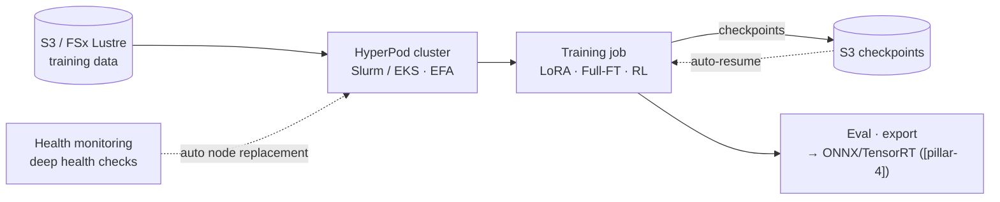
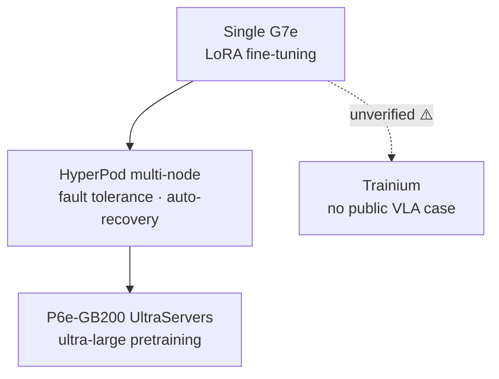

# Pillar 2 — Model Training (VLA)

_Last updated: 2026-09 · owner: Youngjin · volatility: high (model versions/licenses/instances change often)_
_Unless separately noted, each item inherits the page metadata (owner/updated/volatility). When an item has its own owner, add an item footer._
[← back to index](index.md)

> **L0 TL;DR**: Compare [existing methods, purchases, and SI](decisions.md) before choosing model adaptation. If learning is selected, establish model/data rights, observation/action compatibility, measured resource requirements, and independent evaluation.

---

> **Review scope**: the page edit date does not revalidate every technical item. See [Evidence](evidence.md) for core corrections, check dates, and reproduction/human review status; legacy item dates still apply.

## Top 3 questions customers ask most in this pillar

> These are discovery examples, not a measured ranking of customer inquiries.

1. **"Which VLA model do I start with? Which ones can I use commercially?"** → [Open VLA foundation models](#1-open-vla-foundation-models--licenses--ga) (⚠️ the GR00T license trap)
2. **"How many GPUs do I need for fine-tuning? Can LoRA do it on one?"** → [VLA fine-tuning in practice](#2-vla-fine-tuning-in-practice-lora-vs-full-ft--ga)
3. **"How do I run VLA training on AWS? With HyperPod? Can I use Trainium?"** → [AWS training stack](#3-aws-training-stack-hyperpod--ec2-gpu--ga)

> **L0/L1**: Validate model choice, trainable scope, and placement separately. System 1/2[^sys] is not a cloud-placement rule; action chunking[^chunk] does not automatically increase feedback frequency.

---

## 1. Open VLA selection and licenses — check each model { #1-open-vla-foundation-models--licenses--ga }

**L0 TL;DR**: Select for performance, robot compatibility, and usage rights. **Separate licenses for code, pretrained weights, base models, and datasets**, and check the exact version's official model card. Public weights do not establish customer-site validation.

**Customer need/problem**: "Can we use this model for our robot/task commercially or for research?"

| Candidate | Primary source to inspect | Scope |
|---|---|---|
| [NVIDIA Isaac GR00T](https://github.com/NVIDIA/Isaac-GR00T) | Selected version's model card, weight terms, code LICENSE | Do not assign one license to every generation |
| [Physical Intelligence openpi](https://github.com/Physical-Intelligence/openpi) | Code LICENSE, checkpoint, base-model access/use terms | Apache-2.0 code does not decide every weight/data right |
| [OpenVLA](https://github.com/openvla/openvla#pretrained-vlas) | README: Model Licensing & Commercial Use | **MIT code / Llama Community License for Llama-2-derived weights** `[1]` |

**OpenVLA correction**: withdraw “MIT, therefore commercial use is allowed.” The official README separates code and pretrained-weight terms. [Claim check date and sources](evidence.md#openvla-license).

**AWS mapping**: store permitted weights/data in S3 and first measure single-GPU memory/throughput. Choose the needed EC2, Batch, or SageMaker environment; public samples are not AWS operational guarantees.

**Decision criteria**: inspect terms for commercial use, internal PoCs, and research separately. Calling an activity a PoC does not establish non-commercial use. Check robot observation/action definitions and checkpoint compatibility.

**Customer case**: this table provides a licensing review path, not deployment evidence.

**➡️ Next action**: record candidate code/weights/base model/data, versions, permitted purpose, source URL/check date, and reviewer; proceed to the [fine-tuning path](execution.md#finetuning).

**🔗 Related assets**: [pillar-1 dataset licenses](pillar-1.md) · [pillar-4 edge deployment](pillar-4.md) · [Robot foundation model paper reviews](https://hi-space.gitbook.io/physical-ai-on-aws/paper-review-tbd/robot-foundation-model) — Korean. Paper summaries of reasoning VLM (Cosmos-Reason 1) and VLA (RT-2, OpenVLA, Gemini Robotics, GR00T N1, π0.6)

---

## 2. VLA fine-tuning — sizing and evaluation { #2-vla-fine-tuning-in-practice-lora-vs-full-ft--ga }

**L0 TL;DR**: Some models/configurations can fine-tune on one GPU, but **memory size or demo counts do not guarantee success or duration**. Start with compatibility checks, then measure training/evaluation costs on customer data.

**Customer need/problem**: "How do we size data, GPU resources, and completion criteria?"

**Solution overview** `[1]`: inspect the selected versions of [OpenVLA LoRA](https://github.com/openvla/openvla#fine-tuning-openvla-via-lora) and [openpi](https://github.com/Physical-Intelligence/openpi). Measure memory for the model, precision, image count/resolution, sequence length, batch, and trainable modules. Test which action head, adapter, or VLM modules need training for the robot/task change.

| Stage | Required evidence | Cost/scaling decision |
|---|---|---|
| Data/model compatibility | Observation/action formats, units, loading and inference | Check on a small dataset first |
| Baseline evaluation | Pre-training success numerator/denominator, cycle time, interventions | Establish whether fine-tuning is needed |
| Limited training | Fixed data/config, runtime, peak memory, checkpoint | Stay small when one GPU fits |
| Independent evaluation | Separate tasks/environments, repeats, performance spread/latency | Revisit data/hypothesis if targets fail |

**Correction**: do not generalize “100–500 demos yields 80%+,” “100 demos gives a one-day PoC,” or “an adapter alone solves a new robot.” Previous cost/0%-success measurements lack reproduction logs and conditions, so cannot support customer promises. [Evidence](evidence.md#finetuning-outcomes).

**AWS mapping and choice**: consider EC2/Batch for one-GPU experiments, SageMaker Training for long managed jobs, and HyperPod when multi-node requirements are demonstrated. Demo count alone does not choose a service.

**Customer case**: distinguish sample runs from customer-site outcomes.

**➡️ Next action**: use [path C](execution.md#finetuning) prerequisites, dry-run, evaluation, and stop criteria to estimate customer-specific time/cost ranges.

**🔗 Related assets**: [pillar-1 data pipeline](pillar-1.md) · [decisions: Build vs Buy](decisions.md)

---

## 3. AWS training stack (HyperPod + EC2 GPU)  🟢 GA

**L0 TL;DR**: SageMaker HyperPod handles fault tolerance, auto-recovery, and elastic scaling for distributed training, and EC2 goes from **G7e (single~few) → P6-B200/P6e-GB200 (large scale)**. But **there is no VLA-specific HyperPod recipe** (only LLM recipes) — VLA training is DIY on top of the cluster.

**Customer need/problem**: "We need infrastructure to run fine-tuning/training reliably. If a node dies, do we start over from scratch?"

**Solution overview** `[1]`:

- **[SageMaker HyperPod](https://aws.amazon.com/sagemaker/hyperpod/)** — supports Slurm + **EKS** + Training Jobs. **Checkpointless training** (auto-recovery within minutes on failure, no manual intervention), **Elastic training** (auto-scale by availability/priority, auto checkpoint/resume). **G7e + r5d.16xlarge support added 2026-04**. HyperPod CLI/SDK provided.
- **EC2 GPU ladder** `[1]`: **G7** (RTX PRO 4500, GA 2026-06) · **G7e** (RTX PRO 6000 Blackwell, GA 2026-01) · **G6e** (L40S) → **P6-B200** (8×B200, 1440GB HBM) · **[P6e-GB200 UltraServers](https://aws.amazon.com/ec2/ultraservers/)** (GB200 NVL72, up to 72 Blackwell/NVLink domain, secured via [Capacity Blocks](https://aws.amazon.com/ec2/capacityblocks/)).
- **Trainium**: Trn2 GA (2024-12), **Trn3 UltraServers GA (2025-12 re:Invent)**, Trn4 announced. ⚠️ **No public case of training VLA/robotics on Trainium** — the whole VLA toolchain is CUDA/NVIDIA. Trainium-for-VLA is unverified.
- **Latest generation in the Seoul Region** `[1]`: **[P6-B300](https://aws.amazon.com/about-aws/whats-new/2026/08/amazon-ec2-p6-b300/)** (8×NVIDIA Blackwell Ultra, 2.1TB HBM3e per instance, 6.4Tbps EFA) went **GA in the Seoul Region on 2026-08-20** — Korean teams get the latest accelerator within data residency, without waiting on overseas regions. Consumed via Capacity Blocks / Savings Plans / On-Demand. Honest scope: it is a general-purpose FM training platform, and Physical AI (simulation/VLA training) is one workload on top of it.
- **Training scale**: choose one GPU, multiple GPUs on one node, or multiple nodes using model, precision, input size, peak memory, measured runtime, and communication volume. Demo count alone does not select Batch/Training/HyperPod. Check [path C](execution.md#finetuning) first.

**What HyperPod actually does** `[1]` (docs verified 2026-07):

| Component | Technical summary | For VLA training |
|---|---|---|
| **Orchestration** | Three modes — **Slurm[^slurm], EKS, and Training Jobs** — accommodating both HPC teams (Slurm) and Kubernetes teams (EKS) with their existing workflows | Run Isaac Lab RL (Slurm convention) and VLA fine-tuning (EKS) on the same cluster |
| **Resiliency stack** | A health-monitoring agent plus deep health checks continuously watch GPUs and network → **faulty nodes are replaced automatically and jobs auto-resume from the last checkpoint** (zero intervention). Checkpointless training recovers within minutes even without checkpoints | The direct answer to "if a node dies, do we start over?" on weeks-long runs |
| **Task Governance** | Per-team/project quotas **down to individual GPUs**, priority scheduling, preemption of low-priority jobs (checkpoint, pause, resume later), and lending idle compute across teams | Managing GPU idle rates when robot and model teams share one cluster |
| **Elastic training** | Jobs scale up/down automatically with capacity and priority, with automatic checkpoint/resume | Absorbs Capacity Blocks allocations as they fluctuate over time |
| **Network & storage** | **EFA[^efa]** low-latency inter-node communication + FSx for Lustre training channels (→ the [pillar-1](pillar-1.md) pipeline) | Removes the multi-node gradient-sync bottleneck |
| **Recipes** | Pre-validated training recipes for LLMs/FMs — ⚠️ **no VLA-specific recipes**; VLA training is DIY on the cluster | This gap is the SA's integration gap (an opportunity to build reusable fine-tuning recipes) |

**AWS mapping**: the services above are themselves the mapping. GPU-securing strategy (On-Demand vs Capacity Blocks vs Flexible Training Plans) → [decisions](decisions.md).

```mermaid
graph LR
    D[("S3 / FSx Lustre<br>training data")] --> C["HyperPod cluster<br>Slurm / EKS · EFA"]
    C --> J["Training job<br>LoRA · Full-FT · RL"]
    HM["Health monitoring<br>deep health checks"] -. auto node replacement .-> C
    J -- checkpoints --> CK[(S3 checkpoints)]
    CK -. auto-resume .-> J
    J --> E["Eval · export<br>→ ONNX/TensorRT ([pillar-4])"]
```

**Decision criteria**:

- Single/few-GPU LoRA → EC2 G7e directly, without HyperPod.
- Multi-node, long-running, needs fault tolerance → **HyperPod (EKS)** + checkpointless.
- Ultra-large pretraining → P6e-GB200 UltraServers + Capacity Blocks.
- Proposing Trainium → state that it is **currently safe for LLM targets, but unverified for VLA** and share the risk.

```mermaid
graph TD
    A["Single G7e<br>LoRA fine-tuning"] --> B["HyperPod multi-node<br>fault tolerance · auto-recovery"]
    B --> C["P6e-GB200 UltraServers<br>ultra-large pretraining"]
    A -. unverified ⚠️ .-> T["Trainium<br>no public VLA case"]
```

**Customer case** `[1]`:

- **Trained Unitree H1 humanoid RL on Isaac Lab + SageMaker (HyperPod)** — AWS official blog (2026-06-09). 19-joint velocity tracking, PPO (skrl), demonstrated HyperPod health monitoring, auto-replacement, and checkpoint resume. ⚠️ **This is RL locomotion, not VLA fine-tuning** — cite only as a reference architecture.
- **Zoox** — multimodal AV foundation model on HyperPod, 95% utilization on 64+ GPUs. ⚠️ AV.

**➡️ Next action**: **use the official AWS "Isaac Lab on SageMaker" blog as a workshop asset as-is** (the only reproducible AWS robotics training reference). If GPU availability is an issue, connect to Capacity Blocks / Flexible Training Plans.

**🔗 Related assets**:

- Playbook: [pillar-3 Simulation (Isaac Lab)](pillar-3.md) · [decisions: securing GPUs](decisions.md)
- [Physical AI E2E workshop](https://hi-space.gitbook.io/physical-ai-on-aws/guide/e2e-workshop) — Korean. GR00T VLA fine-tuning + SageMaker track
- [AWS Physical AI Recipes](https://github.com/hi-space/aws-physical-ai-recipes) — Korean, MIT. Hands-on recipe collection that includes the code behind the E2E workshop above: an Isaac Lab→GR00T fine-tuning→inference→monitoring E2E (CDK), SageMaker HyperPod VLA/RL distributed-training infrastructure (Slurm·FSx·MLflow), a GR00T-N1.6-3B SageMaker fine-tuning pipeline, and NVIDIA OSMO[^osmo] on EKS workflow orchestration
- [Physical AI 101 — a concept map for getting started](https://d2gup9k4vdzl3b.cloudfront.net/pai101/index.html) — single-page primer: big picture → research landscape → VLA fine-tuning → model internals → robot fundamentals → the role of AWS, with AWS PAI reference architectures and a glossary. Korean/English toggle built in; points to this playbook as the next step
- [Physical AI Scaffolding Kit](https://github.com/aws-samples/sample-physical-ai-scaffolding-kit) — aws-samples. HyperPod Slurm cluster + π0·GR00T·Isaac Lab Newton RL training samples, multilingual README (ko·ja·en). Official asset of the AWS Japan Physical AI Development Support Program
- [Embodied AI Platform](https://github.com/aws-samples/sample-embodied-ai-platform) — aws-samples. GR00T VLA teleoperation/imitation-learning fine-tuning on AWS Batch + DCV workstation → on-robot inference on SO-ARM100/101. ⚠️ Only the GR00T training component is Available; the rest is roadmap

---

## 4. System 2 + System 1 — model structure and placement { #4-system-2--system-1-architecture--ga-stable-principle }

**L0 TL;DR**: System 1/2 describes model components operating at different timescales. **It does not automatically decide cloud/edge placement.** Design business planning and observation-based control deadlines/outage behavior separately.

**Solution overview** `[1]`: [Figure Helix](https://www.figure.ai/news/helix) describes onboard S2 (7–9Hz) and onboard S1 (200Hz), linked by latent representations. Do not assume this is the same interface as cloud AgentCore tool calls.

**Action chunking[^chunk]** generates several future actions per inference. **Action execution, new observations, inference completion, and replanning have different rates.** Do not multiply inference Hz by chunk size to claim feedback-control frequency. [PI RTC](https://www.physicalintelligence.company/research/real_time_chunking) handles transitions and latency separately. Validate execution horizons and transitions per model ([evidence](evidence.md#action-chunking)).

**AWS mapping/decision**: consider AgentCore for business planning when latency and processing requirements allow. Keep tightly timed observation-based policies/control on site and measure them. Use [four layers and owners](operations.md#layers) with [Cloud vs Edge](decisions.md).

**Customer case**: Helix is a vendor architecture disclosure, not an AWS cloud deployment case.

**➡️ Next action**: record observation-to-action delay, worst-case jitter, outages, and cancellation behavior before choosing placement.

**🔗 Related assets**: [pillar-4 edge inference](pillar-4.md) · [pillar-5 orchestration](pillar-5.md) · [decisions](decisions.md)

---

## 5. (Competing stack) Google Gemini Robotics  🟡 Preview

**L0 TL;DR**: Google's robot VLA family. **Gemini Robotics-ER 1.6 is in preview (Gemini API/AI Studio)** as an embodied-reasoning (high-level reasoning · tool-calling) layer, while the low-level motor-control VLA is partner-only. It is a competing stack, but customers ask about it often, so we treat it honestly.

**Customer need/problem**: "Can't we just use Gemini Robotics? How does it relate to AWS?"

**Solution overview** `[1]`:

- **Gemini Robotics-ER 1.6** (2026-04 **Preview**, model id: `gemini-robotics-er-1.6-preview`, AI Studio + Gemini API) — agentic embodied reasoning: task decomposition, tool-calling (including Search), VLA invocation, reading analog gauges. **A reasoning/VLM layer, not low-level control**. Google's official docs state it is "currently in preview" `[1]`.
- **Gemini Robotics On-Device** (2025-06) — the first locally deployable VLA, supports fine-tuning (50~100 demos). **waitlist/trusted-tester (Preview)**.
- **Gemini Robotics 1.5 VLA** — partner-only.

**AWS mapping (competing stack → complemented by AWS)**: Gemini Robotics-ER plays the **planner (System 2) role** — even if a customer uses it, **robot fleet orchestration, tool gateway, and policy guardrails can be wrapped with Bedrock AgentCore** (→ [pillar-5](pillar-5.md)). For low-level control VLA, offer the alternative of fine-tuning open models (π/OpenVLA/GR00T) on AWS.

**Decision criteria**:

- Need fast high-level reasoning and can accept the Google ecosystem / preview risk → trying the ER 1.6 API is fine (but it is Preview — no production commitment).
- Commercial / on-prem / data sovereignty / low-level control customization → **fine-tuning open VLAs on AWS** is more flexible.

**Customer case**: partner deployments (many undisclosed).

**➡️ Next action**: if the customer is evaluating Gemini Robotics, **propose a hybrid where "even if you use that reasoning layer, you own orchestration, guardrails, and the low-level control model on AWS"** (a complementary, not competitive, angle).

**🔗 Related assets**: [pillar-5 AgentCore](pillar-5.md)

---

## 6. Training operations — checkpoints and evaluation { #6-training-operations-principles--checkpoint-lineage-and-the-il-ceiling--ga-stable-principle }

**L0 TL;DR**: Two traps that repeatedly wreck customer training projects. (1) **Checkpoints are a tree** — specialization is one-way, so if you lose the generalist checkpoint you cannot go back. (2) **Low loss does not raise success rates** — that is imitation learning's covariate shift[^covshift], and evaluation must be done **only by rollout success rate**, not loss.

**Customer need/problem**: "Every round of fine-tuning erodes earlier capabilities" / "Training loss keeps falling but the real success rate doesn't move."

**Solution overview** `[1]/[2]`:

- **Checkpoint tree management**: weights grow by branching (spin-off) in the order generalist → embodiment-specialized → task-specialized (10~150 demos) → real-deployment calibration. **The chain is one-way** — restoring a generalist from specialized weights is effectively impossible (catastrophic forgetting[^forget]). When a branch overfits to a specific motion and collapses, don't push that branch further — **go back to an earlier (more general) checkpoint and re-branch**.
- **The real answer to "apply customer A's weights to customer B"**: not A's specialist weights but **a fresh fine-tune for B from the generalist above them**. If you branched with LoRA, you can detach just the adapter and return to the generalist — the operational reason to recommend LoRA branching from the start.
- **The "open weights" trap**: first check which stage of the lineage a public checkpoint is — a model released only as a Stage-3 specialist cannot be used outside that robot/environment (no reverse recovery). This is why OpenVLA, GR00T, and π0/π0.5 release generalist (foundation) checkpoints.
- **The IL ceiling = covariate shift**: BC learns only "state the expert was in → expert action" pairs, so when a small execution error drifts the policy into states outside the demo distribution (OOD), the data contains no way to recover and errors snowball — in the worst case compounding as T² over horizon T ([Ross et al., DAgger, arXiv:1011.0686](https://arxiv.org/abs/1011.0686)). **Neither training loss nor validation loss catches this** (both are measured on the same demo distribution).
- **The prescription**: not "a better val set" but **putting the distribution the policy actually visits into training** — DAgger[^dagger] (adding expert labels on states the policy visited) → on-policy data → RFT (item 7 below). Diagnostic signal: loss ≈ 0 with a flat success rate → time to change the approach, not train more.

**AWS mapping**: checkpoint lineage = S3 versioning + separate retention per stage (HyperPod automatic checkpointing is item 3). Evaluation rollouts = simulation sweeps ([pillar-3](pillar-3.md); limits of evaluation in [pillar-4 policy evaluation](pillar-4.md)).

**Decision criteria**: keep the generalist checkpoint separately in every case (never overwrite). Any training contract/milestone whose evaluation metric is loss should be renegotiated.

**Customer case**: case pending (the principle itself is grounded in public papers).

**➡️ Next action**: in any customer training-pipeline review, start with two questions — **"where do you keep the generalist checkpoint" and "do you evaluate by loss or by rollouts."** If these two wobble, the rest of the discussion is moot.

**🔗 Related assets**: [pillar-4 policy evaluation](pillar-4.md) · [pillar-1 teleoperation](pillar-1.md)

---

## 7. RL fine-tuning — algorithms and research scope { #7-rl-fine-tuning-rft--ppo-vs-grpo-and-reward-design--ga-algorithms---reward-automation-research }

**L0 TL;DR**: SFT (imitation) alone learns even the demonstrator's mistakes. The finishing stage driven by environment rewards is RFT[^rft] — algorithm-wise, **PPO[^ppo] is the long-standing standard and critic-free GRPO[^grpo] is surging** (the bigger the model, the bigger the compute win). The real battleground is not the algorithm but **reward design** — "simulator fidelity is reward fidelity."

**Customer need/problem**: "BC got us to 80% but we can't get past it. What do we use to finish with RL, and how?"

**Solution overview** `[1]`:

- **PPO** ([Schulman et al., arXiv:1707.06347](https://arxiv.org/abs/1707.06347)) — "only small steps near the previous policy." In RL the policy creates its own training data, so one big broken update collects worse data and spirals — the clip prevents that jump. The de facto standard for robot RL.
- **GRPO** ([DeepSeekMath, arXiv:2402.03300](https://arxiv.org/abs/2402.03300)) — removes the critic (value network) and uses the **group-mean return of N rollouts from the same state as the baseline**. The critic's compute/memory (as large as the policy net) disappears — a win for VLA-class large models. The group baseline can be higher-variance, so make N large enough.
- **Reward design is the battleground**: sparse (+1 only on success) yields no learning signal before the first success; dense (distance-based shaping) risks designer bias and reward hacking[^rhack] (maximizing the score without doing the task). The reward must measure **the outcome you actually want**, and how faithfully the simulator reproduces friction/contact/latency is the fidelity of the reward signal itself (→ [pillar-3](pillar-3.md)).
- **A validated practical recipe — the Teacher-Student pipeline** `[1]`: ① Teacher = **PPO + privileged state** (GT pose, contact, etc., in massively parallel Isaac Lab) → ② Student = **DAgger + BC distillation** (deployable inputs only: RGB + proprioception) → ③ bootstrap with **GRPO + binary success reward**. Demonstrated by [VIRAL (arXiv:2511.15200)](https://arxiv.org/abs/2511.15200) and [DoorMan (arXiv:2512.01061)](https://arxiv.org/abs/2512.01061) (both CVPR 2026) — DoorMan hits 83% SR, above the expert-teleoperation baseline (80%).
- 🔵 **Reward automation (Research)**: you can't hand-craft dense rewards per task — VLM-based per-step progress scoring like [GVL (arXiv:2411.04549)](https://arxiv.org/abs/2411.04549), [TopReward (arXiv:2602.19313)](https://arxiv.org/abs/2602.19313), and [VLLR (arXiv:2604.00055)](https://arxiv.org/abs/2604.00055) is active, but as of 2026 progress models that satisfy "commercially usable + low latency + open weights" all at once are rare. Where success is objectively verifiable (arrival, assembly complete), a deterministic verifier giving the reward directly — RLVR — is the safe starting point.

**AWS mapping**: teacher-side massively parallel RL = Isaac Lab on EC2 G6e/AWS Batch (→ [pillar-3](pillar-3.md)); distillation and GRPO bootstrap = the item-3 training stack as-is. [sample-vla-finetuning](https://github.com/aws-samples/sample-vla-finetuning) provides both IL/RL paths as IaC (related assets below).

**Decision criteria**: can collect hundreds of clean demonstrations → warm-start with IL. No demos + a good simulator/reward → RL. **The practical answer is usually hybrid (IL → RFT)**. Critic memory is the bottleneck on a large VLA → GRPO.

**Customer case**: case pending (VIRAL/DoorMan are paper demonstrations — not customer deployments).

**➡️ Next action**: evaluate teacher-student/RL post-training as a task-specific research hypothesis. Specify reward, simulator, real data, and evaluation conditions; compare with the imitation baseline. Check the [sample validation scope](execution.md#finetuning) separately.

**🔗 Related assets**: [sample-vla-finetuning](https://github.com/aws-samples/sample-vla-finetuning) — MIT-0 sample. The author reports an IL Pattern A (Batch) completion. B/C deployment, RL GPU execution, and forced Spot recovery are unverified. [Pinned commit and procedure](execution.md#finetuning).

---

## The honest reality of this pillar (SA must-read)

- **Check code, weights, base models, and data licenses separately.** Use version-specific model cards and [evidence](evidence.md#openvla-license).
- **Do not say "PI (Physical Intelligence) uses AWS."** The openpi checkpoints are on GCS (`gs://`), a **GCP signal**. There is no AWS-PI case.
- **There is no official AWS VLA fine-tuning case.** The only AWS robotics training reference is the **Unitree H1 RL locomotion** (not VLA). Do not exaggerate the VLA story.
- **Trainium-for-VLA is unverified.** The whole VLA toolchain is CUDA. State the risk when proposing.

---
_owner: Youngjin · updated: 2026-09 · volatility: high (model versions · licenses · GPU requirements · instances are managed in the collapsed block) · sources: [1] official/paper, [3] vendor, [4] unverified_

<!-- 용어 각주 -->

[^sys]: **System 2 / System 1** — Model layers operating at different timescales. Rates and placement depend on the model; both layers may run onboard.
[^chunk]: **Action chunking** — Generating several future actions per inference. Execution rate differs from response to fresh observations; validate horizons, transitions, and latency per model.
[^slurm]: **Slurm** — the standard open-source job scheduler for HPC clusters. It queues and allocates batch jobs across thousands of nodes, and is the workflow most familiar to teams from research labs and supercomputing.
[^efa]: **EFA (Elastic Fabric Adapter)** — a low-latency, OS-bypass network interface for EC2. It is key to reducing the gradient-synchronization (All-Reduce) bottleneck between GPUs in multi-node distributed training.
[^osmo]: **OSMO** — NVIDIA's workflow orchestration platform for robotics workloads. It schedules multi-stage jobs such as synthetic data generation, simulation, and model training across on-premises and cloud clusters (e.g., Kubernetes).
[^covshift]: **covariate shift** — the mismatch between the state distribution seen during training and the one actually encountered at execution. When an imitation-learned policy drifts via small errors into states absent from the demos, it never learned how to recover, and errors compound. (The correct term is "covariate," not "covariant.")
[^forget]: **catastrophic forgetting** — the phenomenon where a neural network overwrites and loses previously learned abilities while learning a new task. The reason a generalist cannot be recovered from a specialized checkpoint.
[^dagger]: **DAgger (Dataset Aggregation)** — an imitation-learning augmentation technique: run the learned policy, collect expert ground-truth labels on the states the policy actually visited, and retrain. The classic prescription for covariate shift.
[^rft]: **RFT (Reinforcement Fine-Tuning)** — the finishing stage that further improves an imitation-learned (SFT) policy with environment reward signals. Trial and error finds better behaviors that were not in the demonstrations.
[^ppo]: **PPO (Proximal Policy Optimization)** — the most widely used reinforcement-learning algorithm. It clips the update size so the policy "never moves too far from the previous one," converging stably — the de facto default for robot RL.
[^grpo]: **GRPO (Group Relative Policy Optimization)** — a reinforcement-learning algorithm that uses the group mean of several rollouts from the same state as the baseline, with no separate value network (critic). Removing the critic's training cost made it surge for large models (LLM/VLA).
[^rhack]: **reward hacking** — when the reward is misdesigned, the agent games the score itself instead of the intended goal (e.g., rewarding "distance moved forward" leads to spinning in place to fool the sensor). The reward must measure the outcome you actually want.
