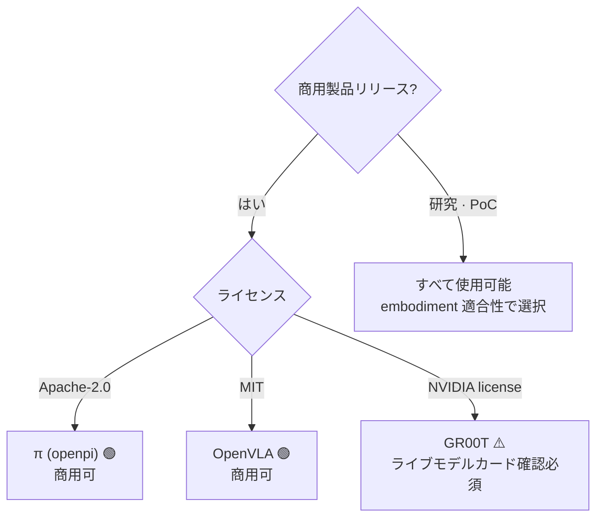
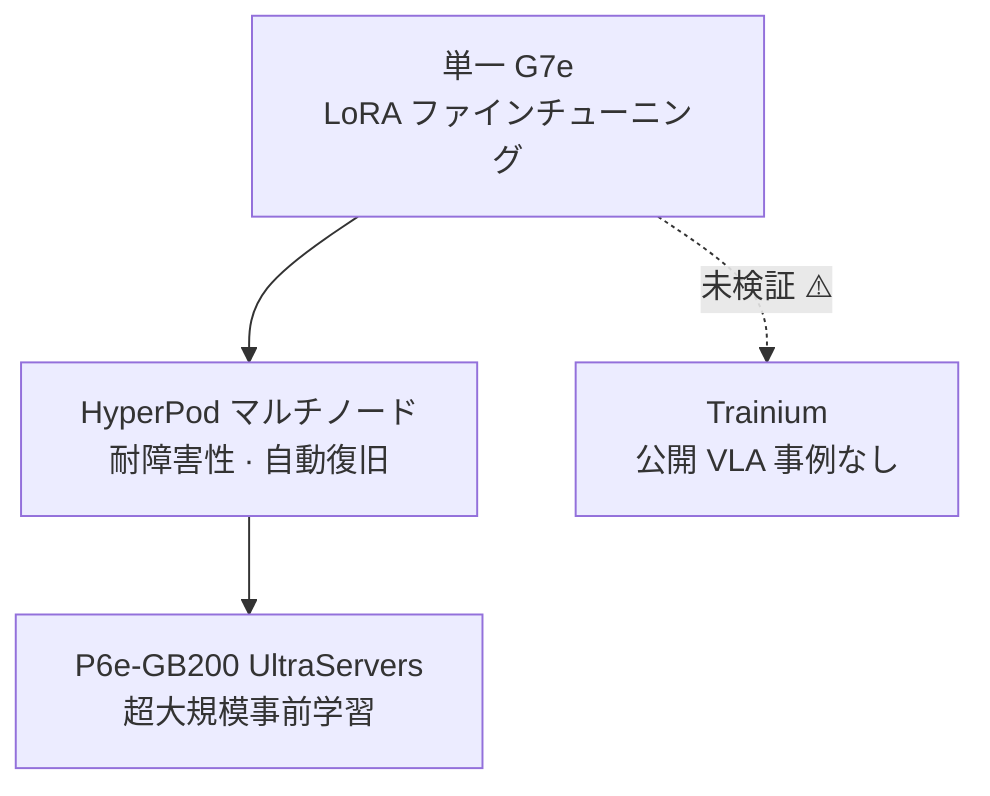

# Pillar 2 — モデル学習 (Model Training · VLA)

_最終更新: 2026-07 · owner: comeddy · volatility: 高（モデルバージョン・ライセンス・インスタンスが頻繁に変わる）_
_個別項目は別途表記がない限りページメタデータ（owner/updated/volatility）を継承します。項目ごとに owner を指定する場合は項目フッターを追加します。_
[← index へ](index.md)

> **L0 TL;DR**: ほとんどの顧客は **VLA をゼロから学習しません —— オープン基盤モデルをファインチューニング**します。そのため核心的な問いは三つです: (1) どのモデルを使うか（**ライセンスが商用可否を左右する**）、(2) LoRA かフルファインチューニングか（GPU 規模を決める）、(3) AWS でどう回すか（HyperPod + EC2 GPU）。Trainium で VLA を学習した公開事例はまだ存在しません。

---

## このピラーで顧客が最もよく尋ねる質問 Top 3

1. **「どの VLA モデルから始めますか？商用で使えるのはどれですか？」** → [オープン VLA 基盤モデル](#1-オープン-vla-基盤モデル--ライセンス--ga)（⚠️ GR00T ライセンスの落とし穴）
2. **「ファインチューニングに GPU は何枚必要ですか？LoRA なら 1 枚で済みますか？」** → [VLA ファインチューニング実践](#2-vla-ファインチューニング実践-lora-vs-full-ft--ga)
3. **「AWS で VLA 学習をどう回しますか？HyperPod で？Trainium は使えますか？」** → [AWS 学習スタック](#3-aws-学習スタック-hyperpod--ec2-gpu--ga)

> **安定原理（ほとんど変わらない）**: (1) フロンティア VLA を事前学習する顧客はほぼいません —— **ファインチューニングが 99% の現実**です。(2) VLA は **System 2（遅い VLM プランナー、5~10Hz）+ System 1（速いアクションポリシー、50~200Hz）** 構造へ収束しつつあり、この二層構造が「推論をクラウドに置くかエッジに置くか」を決めます（→ [pillar-4](pillar-4.md)、[decisions](decisions.md)）。(3) 連続アクション生成は **flow-matching / diffusion action head + action chunking** が標準です。

---

## 1. オープン VLA 基盤モデル & ライセンス  🟢 GA

**L0 TL;DR**: ファインチューニングの出発点。**ライセンスは性能と同じくらい重要** —— 最も話題の NVIDIA GR00T はバージョンによって非商用の場合があり、Physical Intelligence π（Apache-2.0）と OpenVLA（MIT）は **寛容なライセンスで商用フレンドリー**です。

**顧客ニーズ/課題**: 「ヒューマノイド/マニピュレーター向けの VLA を導入したい。どのオープンモデルが良く、当社の製品に商用で使えるか？」

**ソリューション概要** `[1]`:

- **[NVIDIA Isaac GR00T](https://github.com/NVIDIA/Isaac-GR00T)** —— オープンなヒューマノイド基盤モデル。N1(2B)、N1.5(3B, flow-matching DiT action head)、N1.6(CES 2026, Cosmos Reason 2 バックボーン)、N1.7（GitHub 上で GA と主張）。⚠️ **ライセンス注意**: N1.5 モデルカードは **非商用（NVIDIA license, non-commercial）**。N1.6/N1.7 が商用許可だという主張は **2次出典のみで未検証** → 商用判断の前に **ライブモデルカードを直接確認することが必須**。`[1]` github.com/NVIDIA/Isaac-GR00T
- **[Physical Intelligence π (openpi)](https://github.com/Physical-Intelligence/openpi)** —— π0、π0-FAST、π0.5 すべて **Apache-2.0**（商用可）。DROID/ALOHA/LIBERO ファインチューニングチェックポイントを提供。`[1]` github.com/Physical-Intelligence/openpi。⚠️ π0.7 は2次出典のみ存在（未検証）。
- **[OpenVLA](https://github.com/openvla/openvla)** —— 7B、**MIT ライセンス**（商用可）、Llama2 ベースの VLM バックボーン。公式ファインチューニングスクリプトを提供。`[1]` github.com/openvla/openvla（LICENSE ファイルを 2026-07 に直接確認）

**AWS マッピング**: モデル重みを HF から S3 へミラーリング → EC2 GPU(P6/G7e) または SageMaker HyperPod でファインチューニング（下記 2・3 番）。[LeRobot](https://github.com/huggingface/lerobot)（`groot` policy type）で GR00T の post-train/eval が可能。

**意思決定基準**:

- **商用製品リリース** → π（Apache-2.0）または OpenVLA（MIT）を優先。GR00T はライセンス確定後のみ。
- **ヒューマノイド全身制御** → GR00T が最も完成型（SONIC controller、Cosmos Reason バックボーン）、ただしライセンス確認。
- **研究・PoC** → すべて使用可能、性能/embodiment 適合性で選択。

**顧客事例**: 事例待ち（韓国公開の VLA ファインチューニング事例は未確認）。

**➡️ 次のアクション**: 顧客がモデル選定中なら **「ライセンスマトリクス（GR00T=確認必要 / π=Apache-2.0 / OpenVLA=MIT）を最初のスライドに」** 提示。商用なら π0.5 または OpenVLA ファインチューニング PoC を EC2 G7e 上で提案。

**🔗 関連資産**: [pillar-1 データセットライセンス](pillar-1.md) · [pillar-4 エッジデプロイ](pillar-4.md)

🔄 揮発性データ（モデルバージョン・ライセンス —— 更新対象、2026-07 確認）

| モデル | パラメータ | ライセンス | 商用 | バックボーン / アクションヘッド | 備考 |
|---|---|---|---|---|---|
| GR00T N1 | 2B | NVIDIA（非商用） | ❌ | SigLip2+T5 / flow-matching DiT | |
| GR00T N1.5 | 3B | NVIDIA（非商用） | ❌ | / flow-matching DiT | モデルカード明示 |
| GR00T N1.6 | ~3B | 商用主張 [4] | ⚠️未検証 | Cosmos Reason 2 | CES 2026 |
| GR00T N1.7 | 3B | NVIDIA Open Model | ⚠️未検証 | Cosmos-Reason2-2B / diffusion | GitHub GA 主張, 40 timestep horizon |
| π0 / π0-FAST / π0.5 | 未公開 | **Apache-2.0** | ✅ | flow-matching (π0-FAST=autoregressive) | |
| OpenVLA | 7B | **MIT** | ✅ | Llama2 VLM | ライセンス 2026-07 直接確認 |

⚠️ **N1.5 vs N1.6 vs N1.7 のバージョン-ライセンスマッピングが出典間で不一致。** 商用クレームの前にライブ HF/GitHub モデルカードを直接確認。この項目がピラー 2 で最も引用リスクが大きい。

---

## 2. VLA ファインチューニング実践 (LoRA vs Full-FT)  🟢 GA

**L0 TL;DR**: 良いニュース —— **LoRA ファインチューニングは GPU 1 枚（24GB 級）で可能**で、タスクあたり 100~500 デモあれば単一タスク 80%+ の成功率が出ます。フルファインチューニングは 70~100GB（H100/A100 級）が必要です。

**顧客ニーズ/課題**: 「当社のタスクに合わせて VLA を調整したいが、GPU をどれだけ確保すべきで、データはどれだけ必要か？」

**ソリューション概要** `[1]`:

- **OpenVLA**: LoRA(rank 32) ~24GB 単一 GPU(A100/RTX 4090)。48GB→batch 12、80GB→batch 24。フルファインチューニング ~100GB。公式 `vla-scripts/finetune.py`。
- **openpi (π0/π0.5)**: 推論 >8GB、LoRA >22.5GB(RTX 4090)、**フルファインチューニング >70GB(A100/H100)**。公式 LoRA/full レシピ、2025-09 に PyTorch サポート追加。データ 1~20 時間あれば多数のタスクに十分。
- **GR00T (N1.5/N1.7)**: ファインチューニング 40GB+ GPU（H100/L40 推奨）、推論 16GB+。NVIDIA 公式 post-training レシピ。
- **データ量の感覚**: LoRA 単一タスク 100~500 デモ → 80%+ 成功率。少量・高品質の実デモが鍵（→ [pillar-1 テレオペレーション](pillar-1.md)）。

**AWS マッピング**: LoRA なら **EC2 G6e(L40S)・G7e(RTX PRO 6000)** 単一/少数 GPU で十分。フルファインチューニング・マルチ embodiment なら **P6-B200 / HyperPod マルチノード**（下記 3 番）。

**意思決定基準**:

- タスク特化・データ少量 → **LoRA + 単一 G7e**。最も安価・高速。多くはここから始める。
- 多 embodiment・大規模・バックボーンまで調整 → **フルファインチューニング + P6/HyperPod**。
- データ <1 時間 → ファインチューニングより few-shot/プロンプトを優先検討。

**顧客事例**: 事例待ち（公式 AWS VLA ファインチューニング事例なし —— 3 番の Unitree H1 は RL locomotion であって VLA ではない）。

**➡️ 次のアクション**: **「単一 G7e での LoRA ファインチューニング 1 日 PoC」** をデフォルトのエントリー提案に。顧客データが 100 デモ以上あれば、すぐに実測成功率を見せられる。GPU 確保が詰まったら → [decisions](decisions.md)。

**🔗 関連資産**: [pillar-1 データパイプライン](pillar-1.md) · [decisions: Build vs Buy](decisions.md)

🔄 揮発性データ（GPU 要件 —— 2026-07 公式リポジトリ基準）

| モデル | 推論 | LoRA ファインチューニング | フルファインチューニング |
|---|---|---|---|
| OpenVLA (7B) | — | ~24GB（単一） | ~100GB |
| π0 / π0.5 | >8GB | >22.5GB | >70GB (A100/H100) |
| GR00T N1.5/N1.7 | 16GB+ | 40GB+ (H100/L40) | — |

---

## 3. AWS 学習スタック (HyperPod + EC2 GPU)  🟢 GA

**L0 TL;DR**: SageMaker HyperPod が分散学習の耐障害性・自動復旧・エラスティックスケーリングを処理し、EC2 は **G7e（単一~少数）→ P6-B200/P6e-GB200（大規模）** へと段階的に伸びます。ただし、**VLA 専用の HyperPod レシピはありません**（LLM レシピのみ）—— VLA 学習はクラスタ上で DIY。

**顧客ニーズ/課題**: 「ファインチューニング/学習を安定して回すインフラが必要だ。ノードが死んだら最初からやり直しか？」

**ソリューション概要** `[1]`:

- **[SageMaker HyperPod](https://aws.amazon.com/sagemaker/hyperpod/)** —— Slurm + **EKS** + Training Jobs をサポート。**Checkpointless training**（障害時に数分内で自動復旧、手動介入なし）、**Elastic training**（可用量・優先度に応じて自動スケール、自動チェックポイント/再開）。**2026-04 に G7e + r5d.16xlarge サポート追加**。HyperPod CLI/SDK を提供。
- **EC2 GPU の梯子** `[1]`: **G7**(RTX PRO 4500, 2026-06 GA) · **G7e**(RTX PRO 6000 Blackwell, 2026-01 GA) · **G6e**(L40S) → **P6-B200**(8×B200, 1440GB HBM) · **[P6e-GB200 UltraServers](https://aws.amazon.com/ec2/ultraservers/)**(GB200 NVL72, 最大 72 Blackwell/NVLink ドメイン, [Capacity Blocks](https://aws.amazon.com/ec2/capacityblocks/) で確保)。
- **Trainium**: Trn2 GA(2024-12)、**Trn3 UltraServers GA(2025-12 re:Invent)**、Trn4 発表。⚠️ **Trainium で VLA/ロボティクスを学習した公開事例なし** —— VLA ツールチェーン全体が CUDA/NVIDIA。Trainium-for-VLA は未検証。

**AWS マッピング**: 上記サービス自体がマッピング。GPU 確保戦略（On-Demand vs Capacity Blocks vs Flexible Training Plans）は → [decisions](decisions.md)。

**意思決定基準**:

- 単一/少数 GPU LoRA → HyperPod なしで EC2 G7e を直接。
- マルチノード・長時間・耐障害性が必要 → **HyperPod(EKS)** + checkpointless。
- 超大規模事前学習 → P6e-GB200 UltraServers + Capacity Blocks。
- Trainium 提案時 → **現在は LLM 対象には安全、VLA は未検証**と明示しリスクを共有。

**顧客事例** `[1]`:

- **Unitree H1 ヒューマノイド RL を Isaac Lab + SageMaker(HyperPod) で学習** —— AWS 公式ブログ(2026-06-09)。19 関節 velocity tracking、PPO(skrl)、HyperPod ヘルスモニタリング・自動交換・チェックポイント再開をデモ。⚠️ **RL locomotion であって VLA ファインチューニングではない** —— リファレンスアーキテクチャとしてのみ引用。
- **Zoox** —— HyperPod でマルチモーダル AV 基盤モデル、64+ GPU で 95% 稼働率。⚠️ AV。

**➡️ 次のアクション**: **AWS 公式「Isaac Lab on SageMaker」ブログをそのままワークショップ資産として活用**（再現可能な唯一の AWS ロボティクス学習リファレンス）。GPU 可用性の問題なら Capacity Blocks/Flexible Training Plans へ接続。

**🔗 関連資産**: [pillar-3 シミュレーション(Isaac Lab)](pillar-3.md) · [decisions: GPU 確保](decisions.md) · [Physical AI E2E ワークショップ（韓国語 — GR00T VLA ファインチューニング + SageMaker トラック）](https://hi-space.gitbook.io/physical-ai-on-aws/guide/e2e-workshop) · [Physical AI Scaffolding Kit（aws-samples — HyperPod Slurm クラスター + π0·GR00T·Isaac Lab Newton RL 学習サンプル、多言語 README（韓・日・英）。AWS Japan Physical AI 開発支援プログラム公式アセット）](https://github.com/aws-samples/sample-physical-ai-scaffolding-kit)

---

## 4. System 2 + System 1 アーキテクチャ  🟢 GA（安定原理）

**L0 TL;DR**: 2026 年の支配的な VLA 構造。**遅い VLM（System 2, 5~10Hz）が「何をするか」を計画**し、**速いアクションポリシー（System 1, 50~200Hz）が「どう動くか」を実行**します。この分離が **推論デプロイの位置（クラウド vs エッジ）を決める** ため、SA が必ず理解すべき概念です。

**顧客ニーズ/課題**: 「リアルタイム制御なのに大きなモデルをどう回す？クラウド遅延が問題では？」

**ソリューション概要** `[1]/[4]`:

- **[Figure Helix](https://www.figure.ai/news/helix)**: System 2 = オンボードのインターネット事前学習 VLM @ 7~9Hz（シーン/言語）、System 1 = 反応型 visuomotor @ 200Hz。`[1]` figure.ai/news/helix
- **GR00T N1**: System 1 = diffusion policy ~10ms 遅延、System 2 = LLM プランナー（タスク分解）。
- **一般パターン**: 重量級 VLM が 5~10Hz で再計画し、軽量な flow-matching/diffusion "action expert" が最新の計画を条件として 50~200Hz でアクションを放出。**action chunking**（GR00T=40 timestep horizon）で未来のアクションチャンクを予測。
- ⚠️ **成熟度は正直に**: この*パターン自体*は標準だが、全身ヒューマノイドのフルスタックは大半がパイロット/デモ段階。

**AWS マッピング**: **System 2（プランナー）はクラウド/Bedrock AgentCore に、System 1（リアルタイム制御）はエッジ（Jetson）に** 置くのが自然な分担（→ [pillar-5](pillar-5.md)、[pillar-4](pillar-4.md)、[decisions](decisions.md)）。

**意思決定基準**: 30~100Hz のリアルタイム制御要求 → System 1 は **必ずエッジオンボード**。System 2（計画・推論）は遅延が許容されればクラウド可能。この境界が [decisions の Cloud vs Edge ツリー](decisions.md)の核心。

**顧客事例**: Figure（デモ/PR）、GR00T（オープンモデル）。検証済みの本番環境は限定的。

**➡️ 次のアクション**: 顧客が「リアルタイムなのにクラウドで大丈夫？」と尋ねたら **System1/System2 の図を描いて「制御ループはエッジ、計画はクラウド」と整理**。これだけでアーキテクチャの会話が整う。

**🔗 関連資産**: [pillar-4 エッジ推論](pillar-4.md) · [pillar-5 オーケストレーション](pillar-5.md) · [decisions](decisions.md)

---

## 5. （競合スタック）Google Gemini Robotics  🟡 Preview

**L0 TL;DR**: Google のロボット VLA ファミリー。**Gemini Robotics-ER 1.6 はプレビュー（Gemini API/AI Studio）** として公開された embodied reasoning（高レベル推論・ツールコール）レイヤーで、低レベルのモーター制御 VLA はパートナー限定です。競合スタックですが顧客がよく尋ねるので正直に扱います。

**顧客ニーズ/課題**: 「Gemini Robotics を使えばいいのでは？AWS とどう関係する？」

**ソリューション概要** `[1]`:

- **Gemini Robotics-ER 1.6** (2026-04 **Preview**, model id: `gemini-robotics-er-1.6-preview`, AI Studio + Gemini API) —— エージェンティックな embodied reasoning: タスク分解、ツールコール（Search 含む）、VLA 呼び出し、アナログゲージ読み取り。**推論/VLM レイヤーであって低レベル制御ではない**。Google 公式ドキュメントが "currently in preview" と明示 `[1]`。
- **Gemini Robotics On-Device** (2025-06) —— ローカルデプロイ可能な最初の VLA、ファインチューニング対応（50~100 デモ）。**waitlist/trusted-tester(Preview)**。
- **Gemini Robotics 1.5 VLA** —— パートナー限定。

**AWS マッピング（競合スタック → AWS 補完）**: Gemini Robotics-ER は **プランナー（System 2）の役割** —— 顧客がこれを使うとしても、**ロボットフリートのオーケストレーション・ツールゲートウェイ・ポリシーガードレールは Bedrock AgentCore で包める**（→ [pillar-5](pillar-5.md)）。低レベル制御 VLA はオープンモデル（π/OpenVLA/GR00T）を AWS でファインチューニングする代替を提示。

**意思決定基準**:

- 速い高レベル推論が必要で Google エコシステム・プレビューリスクを受容可能 → ER 1.6 API を試せる（ただし Preview —— 本番コミット禁止）。
- 商用・オンプレ・データ主権・低レベル制御のカスタマイズ → **オープン VLA を AWS でファインチューニング** の方が柔軟。

**顧客事例**: パートナーデプロイ（非公開が多数）。

**➡️ 次のアクション**: 顧客が Gemini Robotics を検討中なら **「推論レイヤーはそれを使うとしても、オーケストレーション・ガードレール・低レベル制御モデルは AWS で所有」** するハイブリッドを提案（競争ではなく補完の角度）。

**🔗 関連資産**: [pillar-5 AgentCore](pillar-5.md)

---

## このピラーの正直な現実（SA 必読）

- **GR00T ライセンスは今、引用の最大リスク。** N1.5 は明確に非商用。N1.6/N1.7 の商用許可は2次出典のみ → **顧客の商用判断の前にライブモデルカードを直接確認**。間違えれば法務リスク。
- **「PI(Physical Intelligence) が AWS を使う」という言い方は禁止。** openpi チェックポイントが GCS(`gs://`) にあり **GCP のシグナル**。AWS-PI 事例なし。
- **公式の AWS VLA ファインチューニング事例はない。** 唯一の AWS ロボティクス学習リファレンスは **Unitree H1 RL locomotion**（VLA ではない）。VLA ストーリーを誇張しないこと。
- **Trainium-for-VLA は未検証。** VLA ツールチェーン全体が CUDA。提案時はリスクを明示。

---
_owner: comeddy · updated: 2026-07 · volatility: 高（モデルバージョン・ライセンス・GPU 要件・インスタンスは折りたたみブロックで管理）· sources: [1] 公式/論文, [3] ベンダー, [4] 未検証_
