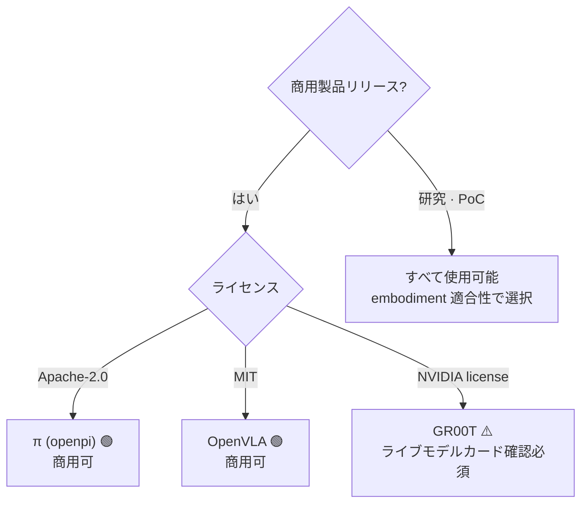
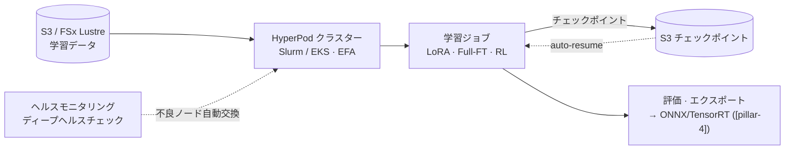
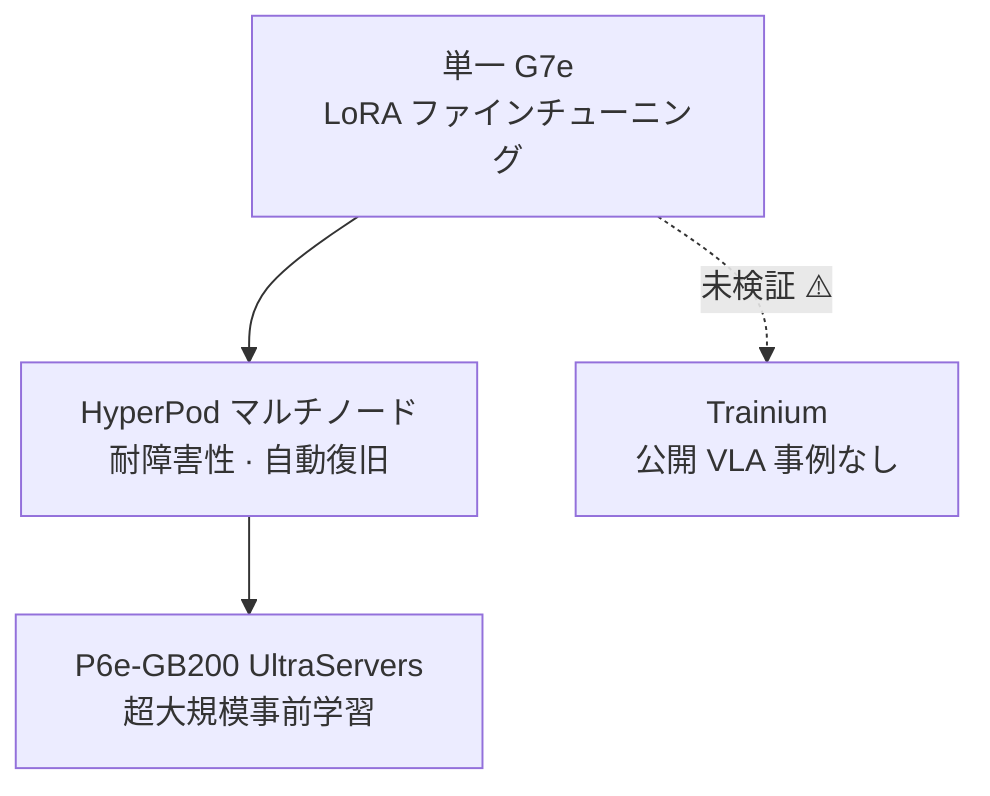

# Pillar 2 — モデル学習 (Model Training · VLA)

_最終更新: 2026-09 · owner: Youngjin · volatility: 高（モデルバージョン・ライセンス・インスタンスが頻繁に変わる）_
_個別項目は別途表記がない限りページメタデータ（owner/updated/volatility）を継承します。項目ごとに owner を指定する場合は項目フッターを追加します。_
[← index へ](index.md)

> **L0 TL;DR**: ほとんどの顧客は **VLA[^vla] をゼロから学習しません —— オープン基盤モデルをファインチューニング[^ft]**します。そのため核心的な問いは三つです: (1) どのモデルを使うか（**ライセンスが商用可否を左右する**）、(2) LoRA[^lora] かフルファインチューニングか（GPU 規模を決める）、(3) AWS でどう回すか（HyperPod + EC2 GPU）。Trainium で VLA を学習した公開事例はまだ存在しません。

---

## このピラーで顧客が最もよく尋ねる質問 Top 3

1. **「どの VLA モデルから始めますか？商用で使えるのはどれですか？」** → [オープン VLA 基盤モデル](#1-オープン-vla-基盤モデル--ライセンス--ga)（⚠️ GR00T ライセンスの落とし穴）
2. **「ファインチューニングに GPU は何枚必要ですか？LoRA なら 1 枚で済みますか？」** → [VLA ファインチューニング実践](#2-vla-ファインチューニング実践-lora-vs-full-ft--ga)
3. **「AWS で VLA 学習をどう回しますか？HyperPod で？Trainium は使えますか？」** → [AWS 学習スタック](#3-aws-学習スタック-hyperpod--ec2-gpu--ga)

> **安定原理（ほとんど変わらない）**: (1) フロンティア VLA を事前学習する顧客はほぼいません —— **ファインチューニングが 99% の現実**です。(2) VLA は **System 2[^sys]（遅い VLM[^vlm] プランナー、5~10Hz）+ System 1（速いアクションポリシー、50~200Hz）** 構造へ収束しつつあり、この二層構造が「推論をクラウドに置くかエッジに置くか」を決めます（→ [pillar-4](pillar-4.md)、[decisions](decisions.md)）。(3) 連続アクション生成は **flow-matching[^flow] / diffusion action head + action chunking[^chunk]** が標準です。

---

## 1. オープン VLA 基盤モデル & ライセンス  🟢 GA

**L0 TL;DR**: ファインチューニングの出発点。**ライセンスは性能と同じくらい重要** —— 最も話題の NVIDIA GR00T はバージョンによって非商用の場合があり、Physical Intelligence π（Apache-2.0）と OpenVLA（MIT）は **寛容なライセンスで商用フレンドリー**です。

**顧客ニーズ/課題**: 「ヒューマノイド/マニピュレーター向けの VLA を導入したい。どのオープンモデルが良く、当社の製品に商用で使えるか？」

**ソリューション概要** `[1]`:

- **[NVIDIA Isaac GR00T](https://github.com/NVIDIA/Isaac-GR00T)** —— オープンなヒューマノイド基盤モデル。N1(2B)、N1.5(3B, flow-matching DiT action head)、N1.6(CES 2026, Cosmos Reason 2 バックボーン)、N1.7（GitHub 上で GA と主張）。⚠️ **ライセンス注意**: N1.5 モデルカードは **非商用（NVIDIA license, non-commercial）**。N1.6/N1.7 が商用許可だという主張は **2次出典のみで未検証** → 商用判断の前に **ライブモデルカードを直接確認することが必須**。`[1]` github.com/NVIDIA/Isaac-GR00T
- **[Physical Intelligence π (openpi)](https://github.com/Physical-Intelligence/openpi)** —— π0、π0-FAST、π0.5 すべて **Apache-2.0**（商用可）。DROID/ALOHA/LIBERO ファインチューニングチェックポイントを提供。`[1]` github.com/Physical-Intelligence/openpi。⚠️ π0.7 は2次出典のみ存在（未検証）。
- **[OpenVLA](https://github.com/openvla/openvla)** —— 7B、**MIT ライセンス**（商用可）、Llama2 ベースの VLM バックボーン。公式ファインチューニングスクリプトを提供。`[1]` github.com/openvla/openvla（LICENSE ファイルを 2026-07 に直接確認）

**AWS マッピング**: モデル重みを HF から S3 へミラーリング → EC2 GPU(P6/G7e) または SageMaker HyperPod でファインチューニング（下記 2・3 番）。[LeRobot](https://github.com/huggingface/lerobot)（`groot` policy type）で GR00T の post-train/eval が可能。

**意思決定基準**:

- **商用製品リリース** → π（Apache-2.0）または OpenVLA（MIT）を優先。GR00T はライセンス確定後のみ。
- **ヒューマノイド全身制御** → GR00T が最も完成型（SONIC controller、Cosmos Reason バックボーン）、ただしライセンス確認。
- **研究・PoC** → すべて使用可能、性能/embodiment[^embodiment] 適合性で選択。

**顧客事例**: 事例待ち（韓国公開の VLA ファインチューニング事例は未確認）。

**➡️ 次のアクション**: 顧客がモデル選定中なら **「ライセンスマトリクス（GR00T=確認必要 / π=Apache-2.0 / OpenVLA=MIT）を最初のスライドに」** 提示。商用なら π0.5 または OpenVLA ファインチューニング PoC を EC2 G7e 上で提案。

**🔗 関連資産**: [pillar-1 データセットライセンス](pillar-1.md) · [pillar-4 エッジデプロイ](pillar-4.md) · [ロボット基盤モデル論文レビュー](https://hi-space.gitbook.io/physical-ai-on-aws/paper-review-tbd/robot-foundation-model) — 韓国語。推論 VLM（Cosmos-Reason 1）と VLA（RT-2、OpenVLA、Gemini Robotics、GR00T N1、π0.6）の論文まとめ

🔄 揮発性データ（モデルバージョン・ライセンス —— 更新対象、2026-07 確認）

| モデル | パラメータ | ライセンス | 商用 | バックボーン / アクションヘッド | 備考 |
|---|---|---|---|---|---|
| GR00T N1 | 2B | NVIDIA（非商用） | ❌ | SigLip2+T5 / flow-matching DiT | |
| GR00T N1.5 | 3B | NVIDIA（非商用） | ❌ | / flow-matching DiT | モデルカード明示 |
| GR00T N1.6 | ~3B | 商用主張 [4] | ⚠️未検証 | Cosmos Reason 2 | CES 2026 |
| GR00T N1.7 | 3B | NVIDIA Open Model | ⚠️未検証 | Cosmos-Reason2-2B / diffusion | GitHub GA 主張, 40 timestep horizon |
| π0 / π0-FAST / π0.5 | 未公開 | **Apache-2.0** | ✅ | flow-matching (π0-FAST=autoregressive) | |
| OpenVLA | 7B | **MIT** | ✅ | Llama2 VLM | ライセンス 2026-07 直接確認 |

⚠️ **N1.5 vs N1.6 vs N1.7 のバージョン-ライセンスマッピングが出典間で不一致。** 商用クレームの前にライブ HF/GitHub モデルカードを直接確認。この項目がピラー 2 で最も引用リスクが大きい。

---

## 2. VLA ファインチューニング実践 (LoRA vs Full-FT)  🟢 GA

**L0 TL;DR**: 良いニュース —— **LoRA ファインチューニングは GPU 1 枚（24GB 級）で可能**で、タスクあたり 100~500 デモあれば単一タスク 80%+ の成功率が出ます。フルファインチューニングは 70~100GB（H100/A100 級）が必要です。

**顧客ニーズ/課題**: 「当社のタスクに合わせて VLA を調整したいが、GPU をどれだけ確保すべきで、データはどれだけ必要か？」

**ソリューション概要** `[1]`:

- **OpenVLA**: LoRA(rank 32) ~24GB 単一 GPU(A100/RTX 4090)。48GB→batch 12、80GB→batch 24。フルファインチューニング ~100GB。公式 `vla-scripts/finetune.py`。
- **openpi (π0/π0.5)**: 推論 >8GB、LoRA >22.5GB(RTX 4090)、**フルファインチューニング >70GB(A100/H100)**。公式 LoRA/full レシピ、2025-09 に PyTorch サポート追加。データ 1~20 時間あれば多数のタスクに十分。
- **GR00T (N1.5/N1.7)**: ファインチューニング 40GB+ GPU（H100/L40 推奨）、推論 16GB+。NVIDIA 公式 post-training レシピ。
- **データ量の感覚**: LoRA 単一タスク 100~500 デモ → 80%+ 成功率。少量・高品質の実デモが鍵（→ [pillar-1 テレオペレーション](pillar-1.md)）。
- **何を unfreeze するか — 部品ごとの学習範囲がそのままコスト** `[1]/[2]`: 最新の VLA は (1) 理解する VLM + (2) 行動を生成する DiT[^dit] + (3) ロボットの身体に合わせるアダプタ MLP の組み立てです（[GR00T N1 構造, arXiv:2503.14734](https://arxiv.org/abs/2503.14734)）。「何を変えたいか」がどの部品を開く（unfreeze する）かとコストを決めます:

| 変えたいもの | MLP（アダプタ） | DiT（アクション） | VLM（理解） | コスト感覚 `[2]` |
|---|---|---|---|---|
| 既存ロボット + 既存動作 | 維持 | 維持 | 維持 | 学習不要（すぐ使用） |
| **新しいロボット**、既存動作 | **学習** | freeze | freeze | テレオペレーションデモ 50~200 個、2~6 時間、g5.2xlarge ~$10 |
| 新しい動作（事前学習にない verb） | 学習 | **学習** | freeze | 半日 |
| 特殊なカメラモダリティ（赤外線など） | 学習 | 学習 | LoRA | 数日、最も高価 |

- ⚠️ **新しいロボット = アダプタ必須** `[2]`: GR00T は事前登録された embodiment（GR-1・Franka など）の MLP のみ内蔵しています。未登録のロボットにそのまま載せると無意味な出力になります（実測 0% 成功）— 最低条件は **デモ ~100 個 + アダプタ学習**。fold・pour・stack のような一般的な動作は事前学習に含まれ MLP だけで済みますが、溶接のような未知の動作は DiT まで開く必要があります。

**AWS マッピング**: LoRA なら **EC2 G6e(L40S)・G7e(RTX PRO 6000)** 単一/少数 GPU で十分。フルファインチューニング・マルチ embodiment なら **P6-B200 / HyperPod マルチノード**（下記 3 番）。

**意思決定基準**:

- タスク特化・データ少量 → **LoRA + 単一 G7e**。最も安価・高速。多くはここから始める。
- 多 embodiment・大規模・バックボーンまで調整 → **フルファインチューニング + P6/HyperPod**。
- データ <1 時間 → ファインチューニングより few-shot/プロンプトを優先検討。

**顧客事例**: 事例待ち（公式 AWS VLA ファインチューニング事例なし —— 3 番の Unitree H1 は RL locomotion であって VLA ではない）。

**➡️ 次のアクション**: **「単一 G7e での LoRA ファインチューニング 1 日 PoC」** をデフォルトのエントリー提案に。顧客データが 100 デモ以上あれば、すぐに実測成功率を見せられる。GPU 確保が詰まったら → [decisions](decisions.md)。

**🔗 関連資産**: [pillar-1 データパイプライン](pillar-1.md) · [decisions: Build vs Buy](decisions.md)

🔄 揮発性データ（GPU 要件 —— 2026-07 公式リポジトリ基準）

| モデル | 推論 | LoRA ファインチューニング | フルファインチューニング |
|---|---|---|---|
| OpenVLA (7B) | — | ~24GB（単一） | ~100GB |
| π0 / π0.5 | >8GB | >22.5GB | >70GB (A100/H100) |
| GR00T N1.5/N1.7 | 16GB+ | 40GB+ (H100/L40) | — |

---

## 3. AWS 学習スタック (HyperPod + EC2 GPU)  🟢 GA

**L0 TL;DR**: SageMaker HyperPod が分散学習の耐障害性・自動復旧・エラスティックスケーリングを処理し、EC2 は **G7e（単一~少数）→ P6-B200/P6e-GB200（大規模）** へと段階的に伸びます。ただし、**VLA 専用の HyperPod レシピはありません**（LLM レシピのみ）—— VLA 学習はクラスタ上で DIY。

**顧客ニーズ/課題**: 「ファインチューニング/学習を安定して回すインフラが必要だ。ノードが死んだら最初からやり直しか？」

**ソリューション概要** `[1]`:

- **[SageMaker HyperPod](https://aws.amazon.com/sagemaker/hyperpod/)** —— Slurm + **EKS** + Training Jobs をサポート。**Checkpointless training**（障害時に数分内で自動復旧、手動介入なし）、**Elastic training**（可用量・優先度に応じて自動スケール、自動チェックポイント/再開）。**2026-04 に G7e + r5d.16xlarge サポート追加**。HyperPod CLI/SDK を提供。
- **EC2 GPU の梯子** `[1]`: **G7**(RTX PRO 4500, 2026-06 GA) · **G7e**(RTX PRO 6000 Blackwell, 2026-01 GA) · **G6e**(L40S) → **P6-B200**(8×B200, 1440GB HBM) · **[P6e-GB200 UltraServers](https://aws.amazon.com/ec2/ultraservers/)**(GB200 NVL72, 最大 72 Blackwell/NVLink ドメイン, [Capacity Blocks](https://aws.amazon.com/ec2/capacityblocks/) で確保)。
- **Trainium**: Trn2 GA(2024-12)、**Trn3 UltraServers GA(2025-12 re:Invent)**、Trn4 発表。⚠️ **Trainium で VLA/ロボティクスを学習した公開事例なし** —— VLA ツールチェーン全体が CUDA/NVIDIA。Trainium-for-VLA は未検証。
- **ソウルリージョンの最新世代** `[1]`: **[P6-B300](https://aws.amazon.com/about-aws/whats-new/2026/08/amazon-ec2-p6-b300/)**（8×NVIDIA Blackwell Ultra、インスタンスあたり 2.1TB HBM3e・6.4Tbps EFA）が **2026-08-20 ソウルリージョンで GA** — 韓国のチームが最新アクセラレータを海外リージョン待ちなしに、データレジデンシーの範囲内で使えます。Capacity Blocks/Savings Plans/On-Demand で消費。範囲は正直に: 汎用 FM 学習プラットフォームであり、Physical AI（シミュレーション・VLA 学習）はその上の一つのワークロードです。
- **規模別の推奨パターン（3B 級 VLA 基準、GR00T N1.6/N1.7 検証）** `[2]`: ① デモ <200 個・LoRA（2~4 時間）→ **AWS Batch + EC2 Spot(g6e)** — 短く安価、推奨デフォルト。② デモ ~500 個・フルファインチューニング（8~24 時間）→ **SageMaker Training Job** — 自動チェックポイント/再開。③ デモ 500 個+・マルチノード（数日）→ **HyperPod** — ノード自動復旧 + EFA。GPU 容量不足に備えて **インスタンス fallback 順序**（例: g6e → g6 → g5）をジョブ定義にあらかじめ入れておけば、待たずに次のタイプへ移れます。

**HyperPod が実際に提供するもの** `[1]`（docs 2026-07 確認）:

| 構成要素 | 技術要約 | VLA 学習の観点 |
|---|---|---|
| **オーケストレーション** | **Slurm[^slurm]・EKS・Training Jobs** の 3 モード — HPC チーム（Slurm）と Kubernetes チーム（EKS）の既存ワークフローをそのまま受け入れる | Isaac Lab RL（Slurm 慣例）と VLA ファインチューニング（EKS）を同じクラスターで |
| **耐障害性スタック** | ヘルスモニタリングエージェント + ディープヘルスチェックが GPU・ネットワークを常時監視 → **不良ノードを自動交換し、最新チェックポイントから auto-resume**（介入ゼロ）。Checkpointless training はチェックポイントなしでも数分で復旧 | 数週間規模の学習での「ノードが落ちたら最初から？」への直接の答え |
| **Task Governance** | チーム・プロジェクト別クォータを **GPU 単位まで細分割り当て**、優先度スケジューリング、低優先度ジョブのプリエンプション（チェックポイント保存後に一時停止→再開）、チーム間の遊休コンピュート貸借 | ロボットチームとモデルチームが 1 つのクラスターを共有する際の GPU 遊休率管理 |
| **Elastic training** | 可用容量・優先度に応じてジョブ規模を自動拡縮、自動チェックポイント・再開 | Capacity Blocks の確保分が時間帯で変動しても自動吸収 |
| **ネットワーク・ストレージ** | **EFA[^efa]** の低遅延ノード間通信 + FSx for Lustre 学習チャネル（→ [pillar-1](pillar-1.md) パイプライン） | マルチノードの勾配同期ボトルネックを解消 |
| **レシピ** | LLM/FM 向けの事前検証済み学習レシピを提供 — ⚠️ **VLA 専用レシピはなし**、クラスター上で DIY | このギャップこそ SA のホワイトスペース（ファインチューニングレシピの資産化機会） |

**AWS マッピング**: 上記サービス自体がマッピング。GPU 確保戦略（On-Demand vs Capacity Blocks vs Flexible Training Plans）は → [decisions](decisions.md)。

**意思決定基準**:

- 単一/少数 GPU LoRA → HyperPod なしで EC2 G7e を直接。
- マルチノード・長時間・耐障害性が必要 → **HyperPod(EKS)** + checkpointless。
- 超大規模事前学習 → P6e-GB200 UltraServers + Capacity Blocks。
- Trainium 提案時 → **現在は LLM 対象には安全、VLA は未検証**と明示しリスクを共有。

**顧客事例** `[1]`:

- **Unitree H1 ヒューマノイド RL を Isaac Lab + SageMaker(HyperPod) で学習** —— AWS 公式ブログ(2026-06-09)。19 関節 velocity tracking、PPO(skrl)、HyperPod ヘルスモニタリング・自動交換・チェックポイント再開をデモ。⚠️ **RL locomotion であって VLA ファインチューニングではない** —— リファレンスアーキテクチャとしてのみ引用。
- **Zoox** —— HyperPod でマルチモーダル AV 基盤モデル、64+ GPU で 95% 稼働率。⚠️ AV。

**➡️ 次のアクション**: **AWS 公式「Isaac Lab on SageMaker」ブログをそのままワークショップ資産として活用**（再現可能な唯一の AWS ロボティクス学習リファレンス）。GPU 可用性の問題なら Capacity Blocks/Flexible Training Plans へ接続。

**🔗 関連資産**:

- プレイブック: [pillar-3 シミュレーション(Isaac Lab)](pillar-3.md) · [decisions: GPU 確保](decisions.md)
- [Physical AI E2E ワークショップ](https://hi-space.gitbook.io/physical-ai-on-aws/guide/e2e-workshop) — 韓国語。GR00T VLA ファインチューニング + SageMaker トラック
- [AWS Physical AI Recipes](https://github.com/hi-space/aws-physical-ai-recipes) — 韓国語、MIT。上記 E2E ワークショップのコードも含む実践レシピ集: Isaac Lab→GR00T ファインチューニング→推論→モニタリングの E2E（CDK）、SageMaker HyperPod VLA/RL 分散学習インフラ（Slurm·FSx·MLflow）、GR00T-N1.6-3B SageMaker ファインチューニングパイプライン、NVIDIA OSMO[^osmo] on EKS ワークフローオーケストレーション
- [Physical AI 101 — はじめての人のための概念マップ](https://d2gup9k4vdzl3b.cloudfront.net/pai101/index.html) — 入門者向け単一ページ：全体像→研究の地形→VLA ファインチューニング→モデル内部→ロボット基礎概念→AWS の役割、AWS PAI リファレンスアーキテクチャ・用語集付き。ページ内で韓国語/英語切替、締めくくりに本プレイブックを次のステップとして案内
- [Physical AI Scaffolding Kit](https://github.com/aws-samples/sample-physical-ai-scaffolding-kit) — aws-samples。HyperPod Slurm クラスター + π0·GR00T·Isaac Lab Newton RL 学習サンプル、多言語 README（韓・日・英）。AWS Japan Physical AI 開発支援プログラム公式アセット
- [Embodied AI Platform](https://github.com/aws-samples/sample-embodied-ai-platform) — aws-samples。GR00T VLA テレオペレーション·模倣学習ファインチューニング on AWS Batch + DCV ワークステーション → SO-ARM100/101 実機推論。⚠️ 現在 Available なのは GR00T 学習コンポーネント 1 つのみ、残りはロードマップ

---

## 4. System 2 + System 1 アーキテクチャ  🟢 GA（安定原理）

**L0 TL;DR**: 2026 年の支配的な VLA 構造。**遅い VLM（System 2, 5~10Hz）が「何をするか」を計画**し、**速いアクションポリシー（System 1, 50~200Hz）が「どう動くか」を実行**します。この分離が **推論デプロイの位置（クラウド vs エッジ）を決める** ため、SA が必ず理解すべき概念です。

**顧客ニーズ/課題**: 「リアルタイム制御なのに大きなモデルをどう回す？クラウド遅延が問題では？」

**ソリューション概要** `[1]/[4]`:

- **[Figure Helix](https://www.figure.ai/news/helix)**: System 2 = オンボードのインターネット事前学習 VLM @ 7~9Hz（シーン/言語）、System 1 = 反応型 visuomotor @ 200Hz。`[1]` figure.ai/news/helix
- **GR00T N1**: System 1 = diffusion policy ~10ms 遅延、System 2 = LLM プランナー（タスク分解）。
- **一般パターン**: 重量級 VLM が 5~10Hz で再計画し、軽量な flow-matching/diffusion "action expert" が最新の計画を条件として 50~200Hz でアクションを放出。**action chunking**（GR00T=40 timestep horizon）で未来のアクションチャンクを予測。
- **フィールド全体の 2 軸 taxonomy** `[1]`: モデル名に埋もれる前に — ほとんどの VLA は (1) **ネットワーク構造**: Monolithic（単一ネットワークのエンドツーエンド）vs Hierarchical（プランナー+実行器の分離）、(2) **思考システム**: Single-system vs Dual-system（逐次 cascade / 並列 parallel）の 2×2 上に置けます。GR00T の「二つの脳」は hierarchical × dual-system(parallel) のマスの具体例 — System 1/2 は特定モデルの話ではなく、フィールドの一次分類軸です。
- **実効制御周波数 = 推論 Hz × chunk サイズ**: π0.5 が Jetson 上で ~10Hz の推論でも、一度に 10 ステップの chunk を出せばロボットは ~100Hz で動きます（chunk 実行中に次の chunk を先読み計算）。この算数が「大きなモデル = 遅いロボット」という誤解を解く鍵です。
- ⚠️ **「VLA は死んだ（WAM[^wam] が代替）」というヘッドラインに注意** `[1]/[4]`: WAM（World Action Model）は video-diffusion バックボーンで未来の映像+行動を **同時予測** します — Web ビデオの物理 prior のおかげで未学習動作の zero-shot に強い（[DreamZero, arXiv:2602.15922](https://arxiv.org/abs/2602.15922): ロボットデータ ~500 時間だけで unseen task 16%→40% 台）ものの、14B の反復 denoising のため closed-loop **~7Hz と最も遅い**です。「VLAs are dead」キーノートと同時期に NVIDIA 本体が GR00T N1.7（VLA）をリリースし、独立比較ではデータ多様性が十分なら VLA（π0.5）が WAM と同等 — 実際の絵は **「VLA + World Model + RL 事後学習の収束」** です。顧客との会話でヘッドラインをそのまま伝えないこと（成熟度の追跡は [radar の World-action models](radar.md)）。
- ⚠️ **成熟度は正直に**: この*パターン自体*は標準だが、全身ヒューマノイドのフルスタックは大半がパイロット/デモ段階。

**AWS マッピング**: **System 2（プランナー）はクラウド/Bedrock AgentCore に、System 1（リアルタイム制御）はエッジ（Jetson）に** 置くのが自然な分担（→ [pillar-5](pillar-5.md)、[pillar-4](pillar-4.md)、[decisions](decisions.md)）。

**意思決定基準**: 30~100Hz のリアルタイム制御要求 → System 1 は **必ずエッジオンボード**。System 2（計画・推論）は遅延が許容されればクラウド可能。この境界が [decisions の Cloud vs Edge ツリー](decisions.md)の核心。

**顧客事例**: Figure（デモ/PR）、GR00T（オープンモデル）。検証済みの本番環境は限定的。

**➡️ 次のアクション**: 顧客が「リアルタイムなのにクラウドで大丈夫？」と尋ねたら **System1/System2 の図を描いて「制御ループはエッジ、計画はクラウド」と整理**。これだけでアーキテクチャの会話が整う。

**🔗 関連資産**: [pillar-4 エッジ推論](pillar-4.md) · [pillar-5 オーケストレーション](pillar-5.md) · [decisions](decisions.md)

---

## 5. （競合スタック）Google Gemini Robotics  🟡 Preview

**L0 TL;DR**: Google のロボット VLA ファミリー。**Gemini Robotics-ER 1.6 はプレビュー（Gemini API/AI Studio）** として公開された embodied reasoning（高レベル推論・ツールコール）レイヤーで、低レベルのモーター制御 VLA はパートナー限定です。競合スタックですが顧客がよく尋ねるので正直に扱います。

**顧客ニーズ/課題**: 「Gemini Robotics を使えばいいのでは？AWS とどう関係する？」

**ソリューション概要** `[1]`:

- **Gemini Robotics-ER 1.6** (2026-04 **Preview**, model id: `gemini-robotics-er-1.6-preview`, AI Studio + Gemini API) —— エージェンティックな embodied reasoning: タスク分解、ツールコール（Search 含む）、VLA 呼び出し、アナログゲージ読み取り。**推論/VLM レイヤーであって低レベル制御ではない**。Google 公式ドキュメントが "currently in preview" と明示 `[1]`。
- **Gemini Robotics On-Device** (2025-06) —— ローカルデプロイ可能な最初の VLA、ファインチューニング対応（50~100 デモ）。**waitlist/trusted-tester(Preview)**。
- **Gemini Robotics 1.5 VLA** —— パートナー限定。

**AWS マッピング（競合スタック → AWS 補完）**: Gemini Robotics-ER は **プランナー（System 2）の役割** —— 顧客がこれを使うとしても、**ロボットフリートのオーケストレーション・ツールゲートウェイ・ポリシーガードレールは Bedrock AgentCore で包める**（→ [pillar-5](pillar-5.md)）。低レベル制御 VLA はオープンモデル（π/OpenVLA/GR00T）を AWS でファインチューニングする代替を提示。

**意思決定基準**:

- 速い高レベル推論が必要で Google エコシステム・プレビューリスクを受容可能 → ER 1.6 API を試せる（ただし Preview —— 本番コミット禁止）。
- 商用・オンプレ・データ主権・低レベル制御のカスタマイズ → **オープン VLA を AWS でファインチューニング** の方が柔軟。

**顧客事例**: パートナーデプロイ（非公開が多数）。

**➡️ 次のアクション**: 顧客が Gemini Robotics を検討中なら **「推論レイヤーはそれを使うとしても、オーケストレーション・ガードレール・低レベル制御モデルは AWS で所有」** するハイブリッドを提案（競争ではなく補完の角度）。

**🔗 関連資産**: [pillar-5 AgentCore](pillar-5.md)

---

## 6. 学習運用の原則 — チェックポイント系譜と IL の天井  🟢 GA（安定原理）

**L0 TL;DR**: 顧客の学習プロジェクトを繰り返し崩壊させる二つの落とし穴。(1) **チェックポイントは木である** — specialize は一方通行で、generalist チェックポイントを失うと元に戻せません。(2) **loss が下がっても成功率は上がらない** — 模倣学習の covariate shift[^covshift] が原因で、評価は loss ではなく **rollout 成功率のみ** で行います。

**顧客ニーズ/課題**: 「ファインチューニングを重ねるほど以前の能力が消えていく」/「training loss は下がり続けるのに実際の成功率が動かない」。

**ソリューション概要** `[1]/[2]`:

- **チェックポイント tree 管理**: 重みは generalist → embodiment 特化 → task 特化（デモ 10~150 個）→ 実デプロイ補正の順に枝分かれ（spin-off）しながら育ちます。**chain は一方通行** — 一度 specialize された重みから generalist の逆復元は事実上不可能（catastrophic forgetting[^forget]）。ある枝が特定の動作に過学習して崩れたら、その枝をさらに押すのではなく **前の（より general な）チェックポイントに戻って再分岐** します。
- **「顧客 A の重みを顧客 B に適用」という質問への実際の答え**: A の specialist weight ではなく **その上の generalist から B へ新たにファインチューニング** です。LoRA で分岐しておけばアダプタだけ外して generalist に復帰できます — 最初から LoRA 分岐を勧める運用上の理由です。
- **「open weights」の落とし穴**: 公開チェックポイントが系譜のどの段階かをまず確認 — Stage 3 の specialist だけが公開されたモデルは、そのロボット・環境の外では使えません（逆復元不可）。OpenVLA・GR00T・π0/π0.5 が generalist（foundation）チェックポイントを公開する理由がこれです。
- **IL の天井 = covariate shift**: BC は「エキスパートがいた状態 → エキスパートの行動」のペアだけを学ぶため、実行中の小さな誤差でデモ分布の外（OOD）の状態に入ると、回復方法がデータになく誤差が雪だるま式に累積します — 最悪の場合、時間ホライズン T に対して T² で（[Ross et al., DAgger, arXiv:1011.0686](https://arxiv.org/abs/1011.0686)）。**training loss も validation loss もこの問題を捉えられません**（どちらも同じデモ分布で測るため）。
- **処方**: 「より良い val set」ではなく **ポリシーが実際に訪れる分布を学習に入れること** — DAgger[^dagger]（ポリシーが行った状態にエキスパートのラベルを追加）→ on-policy データ → RFT（下記 7 番）。診断シグナル: loss ≈ 0 なのに成功率が横ばい → さらに学習するのではなくアプローチを変えるとき。

**AWS マッピング**: チェックポイント系譜 = S3 バージョニング + 段階別の別途保存（HyperPod 自動チェックポイントは 3 番）。評価 rollout = シミュレーションスイープ（[pillar-3](pillar-3.md)、評価の限界は [pillar-4 ポリシー評価](pillar-4.md)）。

**意思決定基準**: generalist チェックポイントはどんな場合でも別途保存（上書き禁止）。評価指標を loss に置いた学習契約・マイルストーンは再交渉の対象。

**顧客事例**: 事例待ち（原則自体は公開論文に基づく）。

**➡️ 次のアクション**: 顧客の学習パイプラインレビューでは **「generalist チェックポイントをどこに保管しているか」+「評価を loss で行うか rollout で行うか」** の二つの質問から。この二つが揺らぐと残りの議論は無意味です。

**🔗 関連資産**: [pillar-4 ポリシー評価](pillar-4.md) · [pillar-1 テレオペレーション](pillar-1.md)

---

## 7. RL ファインチューニング (RFT) — PPO vs GRPO と報酬設計  🟢 GA（アルゴリズム）/ 🔵 報酬自動化は Research

**L0 TL;DR**: SFT（模倣）だけでは実演のミスまで学びます。環境の報酬で仕上げる段階が RFT[^rft] — アルゴリズムは **PPO[^ppo] が長年の標準、critic 不要の GRPO[^grpo] が急浮上**（大型モデルほどコンピュートの利得）。真の勝負所はアルゴリズムではなく **報酬設計** です — "simulator fidelity is reward fidelity"。

**顧客ニーズ/課題**: 「BC で 80% まで来たがそれ以上が出ない。RL で仕上げるには何をどう使うのか？」

**ソリューション概要** `[1]`:

- **PPO**（[Schulman et al., arXiv:1707.06347](https://arxiv.org/abs/1707.06347)）— 「直前のポリシーの近くだけを少しずつ」。RL はポリシーが自分の学習データを自ら作るため、一度の大きな更新で壊れると、より悪いデータを集めて悪循環に陥ります — clip がその急変を防ぎます。ロボット RL の事実上の標準。
- **GRPO**（[DeepSeekMath, arXiv:2402.03300](https://arxiv.org/abs/2402.03300)）— critic（value network）をなくし、同じ状態で N 個の rollout を回して **グループ平均 return を baseline** に使います。ポリシーネットワーク並みにかかっていた critic の演算・メモリが消え、VLA 級の大型モデルで有利。ただしグループ baseline は分散が大きくなり得るため N を十分に増やします。
- **報酬設計が勝負所**: sparse（成功時のみ +1）は最初の成功まで学習シグナル自体がなく、dense（距離ベースの shaping）は設計者のバイアスと reward hacking[^rhack]（点数だけ稼いで目標は達成しない）のリスク。報酬は **達成したい結果そのもの** を測るべきで、シミュレーターが摩擦・接触・遅延をどれだけ忠実に再現するかがそのまま報酬シグナルの忠実度です（→ [pillar-3](pillar-3.md)）。
- **検証済みの実戦レシピ — Teacher-Student パイプライン** `[1]`: ① Teacher = **PPO + privileged state**（GT pose・contact などの特権情報、Isaac Lab 大規模並列）→ ② Student = **DAgger + BC 蒸留**（デプロイ可能な RGB+proprioception 入力のみ）→ ③ **GRPO + binary success reward** でブートストラップ。[VIRAL(arXiv:2511.15200)](https://arxiv.org/abs/2511.15200)・[DoorMan(arXiv:2512.01061)](https://arxiv.org/abs/2512.01061)（いずれも CVPR 2026）が実証 — DoorMan は 83% SR でエキスパートテレオペレーションの基準線（80%）を上回りました。
- 🔵 **報酬自動化（Research）**: タスクごとに dense 報酬を手で書くのは非現実的 — VLM で毎ステップの進捗を自動採点する [GVL(arXiv:2411.04549)](https://arxiv.org/abs/2411.04549)・[TopReward(arXiv:2602.19313)](https://arxiv.org/abs/2602.19313)・[VLLR(arXiv:2604.00055)](https://arxiv.org/abs/2604.00055) が活発ですが、2026 年時点で「商用利用可 + 低遅延 + open-weight」をすべて満たす progress model は稀です。成功判定が客観的なら（到着・組立完了）決定論的 verifier で直接報酬を与える RLVR が安全な出発点。

**AWS マッピング**: Teacher の大規模並列 RL = Isaac Lab on EC2 G6e/AWS Batch（→ [pillar-3](pillar-3.md)）、蒸留・GRPO ブートストラップ = 3 番の学習スタックをそのまま。[sample-vla-finetuning](https://github.com/aws-samples/sample-vla-finetuning) が IL/RL の両経路を IaC で提供（下記関連資産）。

**意思決定基準**: きれいな実演を数百個確保できる → IL で warm-start。実演なし + 良いシミュレーター・報酬 → RL。**実戦の正解はたいてい hybrid（IL → RFT）**。大型 VLA で critic のメモリがボトルネック → GRPO。

**顧客事例**: 事例待ち（VIRAL/DoorMan は論文実証 — 顧客デプロイ事例ではない）。

**➡️ 次のアクション**: BC の性能が頭打ちの顧客に **Teacher-Student（PPO→蒸留→GRPO）3 段階レシピ** を提案 — 全段階がシミュレーション内で完結するため、既存の AWS Batch/Isaac Lab スタックをそのまま再利用できます。

**🔗 関連資産**: [pillar-3 並列 RL](pillar-3.md) · [sample-vla-finetuning](https://github.com/aws-samples/sample-vla-finetuning) — aws-samples、MIT-0。意図（IL デモ or RL タスク）を与えるだけで Batch+Spot / SageMaker Training / HyperPod の 3 パターンを自動決定するワンコマンドのファインチューニングプラットフォーム。GR00T・π0.5・ACT・SmolVLA + Isaac Lab RL 経路、MCP サーバー（7 tools）でエージェントセッションから submit・モニタリングまで

---

## このピラーの正直な現実（SA 必読）

- **GR00T ライセンスは今、引用の最大リスク。** N1.5 は明確に非商用。N1.6/N1.7 の商用許可は2次出典のみ → **顧客の商用判断の前にライブモデルカードを直接確認**。間違えれば法務リスク。
- **「PI(Physical Intelligence) が AWS を使う」という言い方は禁止。** openpi チェックポイントが GCS(`gs://`) にあり **GCP のシグナル**。AWS-PI 事例なし。
- **公式の AWS VLA ファインチューニング事例はない。** 唯一の AWS ロボティクス学習リファレンスは **Unitree H1 RL locomotion**（VLA ではない）。VLA ストーリーを誇張しないこと。
- **Trainium-for-VLA は未検証。** VLA ツールチェーン全体が CUDA。提案時はリスクを明示。

---
_owner: Youngjin · updated: 2026-09 · volatility: 高（モデルバージョン・ライセンス・GPU 要件・インスタンスは折りたたみブロックで管理）· sources: [1] 公式/論文, [3] ベンダー, [4] 未検証_

<!-- 용어 각주 -->

[^vla]: **VLA (Vision-Language-Action)** — カメラ映像（Vision）と自然言語の指示（Language）を入力に、ロボットの動作（Action）を直接出力する基盤モデルです。「コップを掴んで」と言えば関節の動きを生成する、という具合です。🎥 [NVIDIA Isaac GR00T N1 紹介](https://www.youtube.com/watch?v=m1CH-mgpdYg)
[^ft]: **ファインチューニング（fine-tuning）** — 大規模データで事前学習されたモデルを、自分のタスク・ロボットの少量データで追加学習させることです。ゼロから学習するよりデータ・GPU が数十~数百倍節約できます。
[^lora]: **LoRA (Low-Rank Adaptation)** — 元の重みは凍結したまま、小さな低ランク（low-rank）行列だけを追加で学習する軽量ファインチューニング手法です。GPU メモリ要求がフルファインチューニングの数分の 1 のため、24GB 級 GPU 1 枚でも可能です。
[^sys]: **System 2 / System 1** — 認知科学の「遅い思考 / 速い反応」の区分をロボットアーキテクチャに適用した構造です。System 2 は遅い大型モデルが計画を（5~10Hz）、System 1 は小さなポリシーがリアルタイム制御を（50~200Hz）担います。推論をクラウドに置くかエッジに置くかを分ける基準になります。
[^flow]: **flow-matching / diffusion action head** — ロボットの連続動作をノイズから徐々に洗練して生成する拡散（diffusion）・フロー系の出力モジュールです。滑らかでマルチモーダル（multi-modal）な動作分布を表現でき、最新 VLA の標準アクションヘッドです。
[^chunk]: **action chunking** — 毎ステップ動作 1 個ではなく、将来の動作を複数ステップ（チャンク）まとめて一度に予測する手法です。推論回数を減らし、リアルタイム制御の周波数を満たしやすくします。
[^vlm]: **VLM (Vision-Language Model)** — 画像とテキストを一緒に理解するモデルです（例: 写真を見て質問に答える）。VLA は通常 VLM を「目+頭脳」のバックボーンとして使い、その上にアクションヘッドを載せます。
[^embodiment]: **embodiment（エンボディメント）** — ロボットの物理的形態・自由度・センサー構成のことです。同じモデルでもロボットアームとヒューマノイドでは embodiment が異なり、データ・ポリシーをそのまま移植できません。
[^slurm]: **Slurm** — HPC クラスターの標準的なオープンソースジョブスケジューラーです。数千ノードにバッチジョブをキューイング・割り当てし、研究室・スパコン出身のチームに最もなじみのあるワークフローです。
[^efa]: **EFA（Elastic Fabric Adapter）** — EC2 向けの低遅延・OS バイパスのネットワークインターフェースです。マルチノード分散学習で GPU 間の勾配同期（All-Reduce）ボトルネックを減らす鍵になります。
[^osmo]: **OSMO** — NVIDIA のロボティクスワークロード向けワークフローオーケストレーションプラットフォームです。合成データ生成・シミュレーション・モデル学習などのマルチステージジョブを、オンプレミスとクラウドの複数クラスター（Kubernetes など）にスケジューリングします。
[^dit]: **DiT (Diffusion Transformer)** — Transformer 構造で作られた拡散（diffusion）生成器です。最新の VLA では、ノイズからロボットの関節コマンド（action chunk）を生成する「行動エンジン」部品として使われます。
[^wam]: **WAM (World Action Model)** — ビデオ生成モデルをバックボーンに、未来の映像とロボットの行動を同時に予測するモデルです。Web ビデオで学んだ物理知識のおかげで未学習の動作に強い一方、反復 denoising のため制御周波数が低くなります。WFM（映像のみ生成、行動出力なし）との混同に注意。
[^covshift]: **covariate shift（共変量シフト）** — 学習時に見た状態分布と実行時に実際に遭遇する状態分布がずれる現象です。模倣学習のポリシーが小さな誤差でデモにない状態へ漂流すると、回復方法を学んだことがないため誤差が累積します。（「covariant」ではなく「covariate」が正しい表記です。）
[^forget]: **catastrophic forgetting（破滅的忘却）** — ニューラルネットワークが新しいタスクを学習する過程で、以前に学んだ能力を上書きして失う現象です。specialize されたチェックポイントから generalist を復元できない理由です。
[^dagger]: **DAgger (Dataset Aggregation)** — 学習したポリシーを実際に実行させ、ポリシーが訪れた状態にエキスパートの正解ラベルを追加で集めて再学習する模倣学習の補強手法です。covariate shift への古典的な処方です。
[^rft]: **RFT (Reinforcement Fine-Tuning、強化ファインチューニング)** — 模倣学習（SFT）で作ったポリシーを環境の報酬シグナルで追加改善する仕上げ段階です。実演になかったより良い行動を試行錯誤で見つけ出します。
[^ppo]: **PPO (Proximal Policy Optimization)** — 最も広く使われる強化学習アルゴリズムです。「直前のポリシーから離れすぎない」よう更新幅を clip で制限して安定的に収束します — ロボット RL の事実上のデフォルトです。
[^grpo]: **GRPO (Group Relative Policy Optimization)** — 別途の価値ネットワーク（critic）なしに、同じ状態で複数の rollout を回してそのグループ平均を基準線（baseline）に使う強化学習アルゴリズムです。critic の学習コストが消えるため、大型モデル（LLM・VLA）で急浮上しました。
[^rhack]: **reward hacking** — 報酬設計を誤ると、エージェントが意図した目標の代わりに点数そのものを攻略する現象です（例:「前進距離」の報酬にその場回転でセンサーを騙す）。報酬は達成したい結果そのものを測るべきです。
