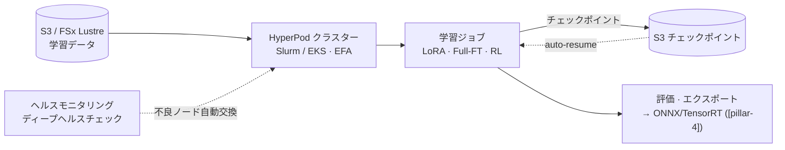
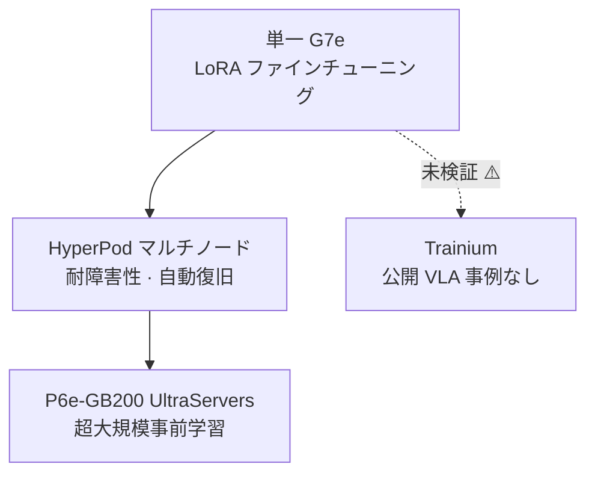

# Pillar 2 — モデル学習 (Model Training · VLA)

_最終更新: 2026-09 · owner: Youngjin · volatility: 高（モデルバージョン・ライセンス・インスタンスが頻繁に変わる）_
_個別項目は別途表記がない限りページメタデータ（owner/updated/volatility）を継承します。項目ごとに owner を指定する場合は項目フッターを追加します。_
[← index へ](index.md)

> **L0 TL;DR**: モデル適応前に[既存方式・購入・SI](decisions.md)と比較します。学習を選ぶ場合は利用権、観測・動作互換性、実測資源、独立評価を設計します。

---

> **確認範囲**：ページ更新日は全項目の再確認日ではありません。主要訂正の日付・再現/人の確認状態は[根拠](evidence.md)を参照し、既存項目の確認日は従来どおり適用します。

## このピラーで顧客が最もよく尋ねる質問 Top 3

> 質問は探索例であり、実測した問い合わせ頻度順位ではありません。

1. **「どの VLA モデルから始めますか？商用で使えるのはどれですか？」** → [オープン VLA 基盤モデル](#1-オープン-vla-基盤モデル--ライセンス--ga)（⚠️ GR00T ライセンスの落とし穴）
2. **「ファインチューニングに GPU は何枚必要ですか？LoRA なら 1 枚で済みますか？」** → [VLA ファインチューニング実践](#2-vla-ファインチューニング実践-lora-vs-full-ft--ga)
3. **「AWS で VLA 学習をどう回しますか？HyperPod で？Trainium は使えますか？」** → [AWS 学習スタック](#3-aws-学習スタック-hyperpod--ec2-gpu--ga)

> **L0/L1**: モデル・学習範囲・配置を個別検証します。System 1/2[^sys]はクラウド配置規則ではなく、action chunking[^chunk]は反応頻度を自動で高めません。

---

## 1. オープンVLA選定とライセンス — モデル別確認 { #1-オープン-vla-基盤モデル--ライセンス--ga }

**L0 TL;DR**: 性能、ロボット適合性、利用権を合わせて選びます。**コード・事前学習重み・基盤モデル・データセットのライセンスを分離**し、対象版の公式モデルカードを確認します。重み公開は現場検証を意味しません。

**顧客ニーズ/課題**：「自社ロボット・業務で商用または研究利用できますか？」

| 候補 | 確認する一次資料 | 判断範囲 |
|---|---|---|
| [NVIDIA Isaac GR00T](https://github.com/NVIDIA/Isaac-GR00T) | 対象版モデルカード・重み規約・コードLICENSE | 全世代を同一ライセンスにまとめません |
| [Physical Intelligence openpi](https://github.com/Physical-Intelligence/openpi) | コードLICENSE・チェックポイント・基盤モデル条件 | コードのApache-2.0だけで全重み・データの権利を判断しません |
| [OpenVLA](https://github.com/openvla/openvla#pretrained-vlas) | READMEのModel Licensing & Commercial Use | **コードMIT / Llama-2派生重みはLlama Community License** `[1]` |

**OpenVLA訂正**：「MITなので商用可能」を撤回します。公式READMEはコードと事前学習重みを区別しています。[確認日と出典](evidence.md#openvla-license)を参照します。

**AWSマッピング**：利用権を確認した重み・データをS3へ保存し、単一GPUのメモリ・処理量を先に測定します。必要なEC2・Batch・SageMaker環境を選び、公開サンプルをAWSの運用保証と解釈しません。

**意思決定基準**：商用・社内PoC・研究それぞれの条件を確認します。PoCという名称だけで非商用条件を満たすとは限りません。ロボットの観測・動作定義とチェックポイントの適合性を確認します。

**顧客事例**：本表はライセンス確認経路であり、顧客配備の証拠ではありません。

**➡️ 次のアクション**：コード/重み/基盤モデル/データ、版、許可目的、出典URL・確認日、確認担当者を記録し、[ファインチューニング手順](execution.md#finetuning)へ進みます。

**🔗 関連資産**: [pillar-1 データセットライセンス](pillar-1.md) · [pillar-4 エッジデプロイ](pillar-4.md) · [ロボット基盤モデル論文レビュー](https://hi-space.gitbook.io/physical-ai-on-aws/paper-review-tbd/robot-foundation-model) — 韓国語。推論 VLM（Cosmos-Reason 1）と VLA（RT-2、OpenVLA、Gemini Robotics、GR00T N1、π0.6）の論文まとめ

---

## 2. VLAファインチューニング — 資源見積と評価 { #2-vla-ファインチューニング実践-lora-vs-full-ft--ga }

**L0 TL;DR**: 一部のモデル・設定は単一GPUで学習できますが、**メモリ容量・実演数だけでは成功率や期間を保証できません**。小さい互換性実験の後、顧客データで学習・評価費用を測ります。

**顧客ニーズ/課題**：「データ量、GPU、完了条件をどう見積もりますか？」

**ソリューション概要** `[1]`：[OpenVLA LoRA](https://github.com/openvla/openvla#fine-tuning-openvla-via-lora)と[openpi](https://github.com/Physical-Intelligence/openpi)の対象版を確認します。モデル、精度、画像数・解像度、系列長、バッチ、学習モジュールごとにメモリを測定します。ロボット・業務変更に応じてアクションヘッド・アダプター・VLMの学習範囲を試験します。

| 段階 | 必要な証拠 | 費用・拡大判断 |
|---|---|---|
| データ・モデル互換性 | 観測・動作形式、単位、ロード・推論 | 少量データで先に確認 |
| 基準モデル評価 | 学習前の成功数/試行数、時間、介入 | 学習の必要性を判断 |
| 限定学習 | 固定データ・設定、時間、最大メモリ、チェックポイント | 単一GPUで収まれば小規模維持 |
| 独立評価 | 分離した業務・環境、反復、性能分散・遅延 | 未達ならデータ・仮説を見直し |

**訂正**：「100～500実演で80%以上」「100実演で1日PoC」「新機体はアダプターのみで解決」を一般化しません。以前の費用・成功率0%の実測は再現ログ・条件がないため顧客への約束に使いません。[根拠記録](evidence.md#finetuning-outcomes)を参照します。

**AWSマッピング・選択**：単一GPUはEC2/Batch、長い管理型ジョブはSageMaker Training、実証した複数ノード要件にはHyperPodを検討します。実演数だけでサービスを選びません。

**顧客事例**：サンプル実行と現場の成果を区別します。

**➡️ 次のアクション**：[手順C](execution.md#finetuning)の準備・dry-run・評価・中止条件から顧客別の期間・費用範囲を作ります。

**🔗 関連資産**: [pillar-1 データパイプライン](pillar-1.md) · [decisions: Build vs Buy](decisions.md)

---

## 3. AWS 学習スタック (HyperPod + EC2 GPU)  🟢 GA

**L0 TL;DR**: SageMaker HyperPod が分散学習の耐障害性・自動復旧・エラスティックスケーリングを処理し、EC2 は **G7e（単一~少数）→ P6-B200/P6e-GB200（大規模）** へと段階的に伸びます。ただし、**VLA 専用の HyperPod レシピはありません**（LLM レシピのみ）—— VLA 学習はクラスタ上で DIY。

**顧客ニーズ/課題**: 「ファインチューニング/学習を安定して回すインフラが必要だ。ノードが死んだら最初からやり直しか？」

**ソリューション概要** `[1]`:

- **[SageMaker HyperPod](https://aws.amazon.com/sagemaker/hyperpod/)** —— Slurm + **EKS** + Training Jobs をサポート。**Checkpointless training**（障害時に数分内で自動復旧、手動介入なし）、**Elastic training**（可用量・優先度に応じて自動スケール、自動チェックポイント/再開）。**2026-04 に G7e + r5d.16xlarge サポート追加**。HyperPod CLI/SDK を提供。
- **EC2 GPU の梯子** `[1]`: **G7**(RTX PRO 4500, 2026-06 GA) · **G7e**(RTX PRO 6000 Blackwell, 2026-01 GA) · **G6e**(L40S) → **P6-B200**(8×B200, 1440GB HBM) · **[P6e-GB200 UltraServers](https://aws.amazon.com/ec2/ultraservers/)**(GB200 NVL72, 最大 72 Blackwell/NVLink ドメイン, [Capacity Blocks](https://aws.amazon.com/ec2/capacityblocks/) で確保)。
- **Trainium**: Trn2 GA(2024-12)、**Trn3 UltraServers GA(2025-12 re:Invent)**、Trn4 発表。⚠️ **Trainium で VLA/ロボティクスを学習した公開事例なし** —— VLA ツールチェーン全体が CUDA/NVIDIA。Trainium-for-VLA は未検証。
- **ソウルリージョンの最新世代** `[1]`: **[P6-B300](https://aws.amazon.com/about-aws/whats-new/2026/08/amazon-ec2-p6-b300/)**（8×NVIDIA Blackwell Ultra、インスタンスあたり 2.1TB HBM3e・6.4Tbps EFA）が **2026-08-20 ソウルリージョンで GA** — 韓国のチームが最新アクセラレータを海外リージョン待ちなしに、データレジデンシーの範囲内で使えます。Capacity Blocks/Savings Plans/On-Demand で消費。範囲は正直に: 汎用 FM 学習プラットフォームであり、Physical AI（シミュレーション・VLA 学習）はその上の一つのワークロードです。
- **学習規模**：モデル・精度・入力・最大メモリ・実測時間・通信量で単一GPU・単一ノード複数GPU・複数ノードを選びます。実演数だけでサービスを選ばず[手順C](execution.md#finetuning)を確認します。

**HyperPod が実際に提供するもの** `[1]`（docs 2026-07 確認）:

| 構成要素 | 技術要約 | VLA 学習の観点 |
|---|---|---|
| **オーケストレーション** | **Slurm[^slurm]・EKS・Training Jobs** の 3 モード — HPC チーム（Slurm）と Kubernetes チーム（EKS）の既存ワークフローをそのまま受け入れる | Isaac Lab RL（Slurm 慣例）と VLA ファインチューニング（EKS）を同じクラスターで |
| **耐障害性スタック** | ヘルスモニタリングエージェント + ディープヘルスチェックが GPU・ネットワークを常時監視 → **不良ノードを自動交換し、最新チェックポイントから auto-resume**（介入ゼロ）。Checkpointless training はチェックポイントなしでも数分で復旧 | 数週間規模の学習での「ノードが落ちたら最初から？」への直接の答え |
| **Task Governance** | チーム・プロジェクト別クォータを **GPU 単位まで細分割り当て**、優先度スケジューリング、低優先度ジョブのプリエンプション（チェックポイント保存後に一時停止→再開）、チーム間の遊休コンピュート貸借 | ロボットチームとモデルチームが 1 つのクラスターを共有する際の GPU 遊休率管理 |
| **Elastic training** | 可用容量・優先度に応じてジョブ規模を自動拡縮、自動チェックポイント・再開 | Capacity Blocks の確保分が時間帯で変動しても自動吸収 |
| **ネットワーク・ストレージ** | **EFA[^efa]** の低遅延ノード間通信 + FSx for Lustre 学習チャネル（→ [pillar-1](pillar-1.md) パイプライン） | マルチノードの勾配同期ボトルネックを解消 |
| **レシピ** | LLM/FM 向けの事前検証済み学習レシピを提供 — ⚠️ **VLA 専用レシピはなし**、クラスター上で DIY | このギャップこそ SA の統合検証課題（ファインチューニングレシピの資産化機会） |

**AWS マッピング**: 上記サービス自体がマッピング。GPU 確保戦略（On-Demand vs Capacity Blocks vs Flexible Training Plans）は → [decisions](decisions.md)。

```mermaid
graph LR
    D[("S3 / FSx Lustre<br>学習データ")] --> C["HyperPod クラスター<br>Slurm / EKS · EFA"]
    C --> J["学習ジョブ<br>LoRA · Full-FT · RL"]
    HM["ヘルスモニタリング<br>ディープヘルスチェック"] -. 不良ノード自動交換 .-> C
    J -- チェックポイント --> CK[(S3 チェックポイント)]
    CK -. auto-resume .-> J
    J --> E["評価 · エクスポート<br>→ ONNX/TensorRT ([pillar-4])"]
```

**意思決定基準**:

- 単一/少数 GPU LoRA → HyperPod なしで EC2 G7e を直接。
- マルチノード・長時間・耐障害性が必要 → **HyperPod(EKS)** + checkpointless。
- 超大規模事前学習 → P6e-GB200 UltraServers + Capacity Blocks。
- Trainium 提案時 → **現在は LLM 対象には安全、VLA は未検証**と明示しリスクを共有。

```mermaid
graph TD
    A["単一 G7e<br>LoRA ファインチューニング"] --> B["HyperPod マルチノード<br>耐障害性 · 自動復旧"]
    B --> C["P6e-GB200 UltraServers<br>超大規模事前学習"]
    A -. 未検証 ⚠️ .-> T["Trainium<br>公開 VLA 事例なし"]
```

**顧客事例** `[1]`:

- **Unitree H1 ヒューマノイド RL を Isaac Lab + SageMaker(HyperPod) で学習** —— AWS 公式ブログ(2026-06-09)。19 関節 velocity tracking、PPO(skrl)、HyperPod ヘルスモニタリング・自動交換・チェックポイント再開をデモ。⚠️ **RL locomotion であって VLA ファインチューニングではない** —— リファレンスアーキテクチャとしてのみ引用。
- **Zoox** —— HyperPod でマルチモーダル AV 基盤モデル、64+ GPU で 95% 稼働率。⚠️ AV。

**➡️ 次のアクション**: **AWS 公式「Isaac Lab on SageMaker」ブログをそのままワークショップ資産として活用**（再現可能な唯一の AWS ロボティクス学習リファレンス）。GPU 可用性の問題なら Capacity Blocks/Flexible Training Plans へ接続。

**🔗 関連資産**:

- プレイブック: [pillar-3 シミュレーション(Isaac Lab)](pillar-3.md) · [decisions: GPU 確保](decisions.md)
- [Physical AI E2E ワークショップ](https://hi-space.gitbook.io/physical-ai-on-aws/guide/e2e-workshop) — 韓国語。GR00T VLA ファインチューニング + SageMaker トラック
- [AWS Physical AI Recipes](https://github.com/hi-space/aws-physical-ai-recipes) — 韓国語、MIT。上記 E2E ワークショップのコードも含む実践レシピ集: Isaac Lab→GR00T ファインチューニング→推論→モニタリングの E2E（CDK）、SageMaker HyperPod VLA/RL 分散学習インフラ（Slurm·FSx·MLflow）、GR00T-N1.6-3B SageMaker ファインチューニングパイプライン、NVIDIA OSMO[^osmo] on EKS ワークフローオーケストレーション
- [Physical AI 101 — はじめての人のための概念マップ](https://d2gup9k4vdzl3b.cloudfront.net/pai101/index.html) — 入門者向け単一ページ：全体像→研究の地形→VLA ファインチューニング→モデル内部→ロボット基礎概念→AWS の役割、AWS PAI リファレンスアーキテクチャ・用語集付き。ページ内で韓国語/英語切替、締めくくりに本プレイブックを次のステップとして案内
- [Physical AI Scaffolding Kit](https://github.com/aws-samples/sample-physical-ai-scaffolding-kit) — aws-samples。HyperPod Slurm クラスター + π0·GR00T·Isaac Lab Newton RL 学習サンプル、多言語 README（韓・日・英）。AWS Japan Physical AI 開発支援プログラム公式アセット
- [Embodied AI Platform](https://github.com/aws-samples/sample-embodied-ai-platform) — aws-samples。GR00T VLA テレオペレーション·模倣学習ファインチューニング on AWS Batch + DCV ワークステーション → SO-ARM100/101 実機推論。⚠️ 現在 Available なのは GR00T 学習コンポーネント 1 つのみ、残りはロードマップ

---

## 4. System 2 + System 1 — モデル構造と配置 { #4-system-2--system-1-アーキテクチャ--ga安定原理 }

**L0 TL;DR**: System 1/2はモデル内の処理時間尺度を表す用語で、**クラウド・エッジ配置を自動決定しません**。業務計画と観測に基づく制御の期限・通信断動作を別に設計します。

**概要** `[1]`：[Figure Helix](https://www.figure.ai/news/helix)はオンボードS2（7～9Hz）とオンボードS1（200Hz）を記載しています。潜在表現による接続をクラウドAgentCoreのツール呼出しと同じインターフェースとは仮定しません。

**Action chunking[^chunk]**は1回の推論で複数の未来動作を生成します。**動作実行・新観測・推論完了・再計画の頻度は別です**。推論Hzとchunk長の積をフィードバック制御周波数にしません。[PI RTC](https://www.physicalintelligence.company/research/real_time_chunking)は切替・遅延を別に扱います。モデル別に実行horizonと切替を検証します（[根拠](evidence.md#action-chunking)）。

**AWSマッピング・判断**：遅延・処理条件を満たす業務計画にAgentCoreを検討します。期限の厳しい観測ポリシー・制御は現場に置いて測ります。[4階層と責任者](operations.md#layers)と[Cloud vs Edge](decisions.md)を併用します。

**顧客事例**：Helixはメーカーの構造公開であり、AWSクラウド配備事例ではありません。

**➡️ 次のアクション**：観測→動作遅延、最悪ジッター、通信断・取消動作を記録して配置を決めます。

**🔗 関連資産**: [pillar-4 エッジ推論](pillar-4.md) · [pillar-5 オーケストレーション](pillar-5.md) · [decisions](decisions.md)

---

## 5. （競合スタック）Google Gemini Robotics  🟡 Preview

**L0 TL;DR**: Google のロボット VLA ファミリー。**Gemini Robotics-ER 1.6 はプレビュー（Gemini API/AI Studio）** として公開された embodied reasoning（高レベル推論・ツールコール）レイヤーで、低レベルのモーター制御 VLA はパートナー限定です。競合スタックですが顧客がよく尋ねるので正直に扱います。

**顧客ニーズ/課題**: 「Gemini Robotics を使えばいいのでは？AWS とどう関係する？」

**ソリューション概要** `[1]`:

- **Gemini Robotics-ER 1.6** (2026-04 **Preview**, model id: `gemini-robotics-er-1.6-preview`, AI Studio + Gemini API) —— エージェンティックな embodied reasoning: タスク分解、ツールコール（Search 含む）、VLA 呼び出し、アナログゲージ読み取り。**推論/VLM レイヤーであって低レベル制御ではない**。Google 公式ドキュメントが "currently in preview" と明示 `[1]`。
- **Gemini Robotics On-Device** (2025-06) —— ローカルデプロイ可能な最初の VLA、ファインチューニング対応（50~100 デモ）。**waitlist/trusted-tester(Preview)**。
- **Gemini Robotics 1.5 VLA** —— パートナー限定。

**AWS マッピング（競合スタック → AWS 補完）**: Gemini Robotics-ER は **プランナー（System 2）の役割** —— 顧客がこれを使うとしても、**ロボットフリートのオーケストレーション・ツールゲートウェイ・ポリシーガードレールは Bedrock AgentCore で包める**（→ [pillar-5](pillar-5.md)）。低レベル制御 VLA はオープンモデル（π/OpenVLA/GR00T）を AWS でファインチューニングする代替を提示。

**意思決定基準**:

- 速い高レベル推論が必要で Google エコシステム・プレビューリスクを受容可能 → ER 1.6 API を試せる（ただし Preview —— 本番コミット禁止）。
- 商用・オンプレ・データ主権・低レベル制御のカスタマイズ → **オープン VLA を AWS でファインチューニング** の方が柔軟。

**顧客事例**: パートナーデプロイ（非公開が多数）。

**➡️ 次のアクション**: 顧客が Gemini Robotics を検討中なら **「推論レイヤーはそれを使うとしても、オーケストレーション・ガードレール・低レベル制御モデルは AWS で所有」** するハイブリッドを提案（競争ではなく補完の角度）。

**🔗 関連資産**: [pillar-5 AgentCore](pillar-5.md)

---

## 6. 学習運用 — チェックポイントと評価 { #6-学習運用の原則--チェックポイント系譜と-il-の天井--ga安定原理 }

**L0 TL;DR**: 顧客の学習プロジェクトを繰り返し崩壊させる二つの落とし穴。(1) **チェックポイントは木である** — specialize は一方通行で、generalist チェックポイントを失うと元に戻せません。(2) **loss が下がっても成功率は上がらない** — 模倣学習の covariate shift[^covshift] が原因で、評価は loss ではなく **rollout 成功率のみ** で行います。

**顧客ニーズ/課題**: 「ファインチューニングを重ねるほど以前の能力が消えていく」/「training loss は下がり続けるのに実際の成功率が動かない」。

**ソリューション概要** `[1]/[2]`:

- **チェックポイント tree 管理**: 重みは generalist → embodiment 特化 → task 特化（デモ 10~150 個）→ 実デプロイ補正の順に枝分かれ（spin-off）しながら育ちます。**chain は一方通行** — 一度 specialize された重みから generalist の逆復元は事実上不可能（catastrophic forgetting[^forget]）。ある枝が特定の動作に過学習して崩れたら、その枝をさらに押すのではなく **前の（より general な）チェックポイントに戻って再分岐** します。
- **「顧客 A の重みを顧客 B に適用」という質問への実際の答え**: A の specialist weight ではなく **その上の generalist から B へ新たにファインチューニング** です。LoRA で分岐しておけばアダプタだけ外して generalist に復帰できます — 最初から LoRA 分岐を勧める運用上の理由です。
- **「open weights」の落とし穴**: 公開チェックポイントが系譜のどの段階かをまず確認 — Stage 3 の specialist だけが公開されたモデルは、そのロボット・環境の外では使えません（逆復元不可）。OpenVLA・GR00T・π0/π0.5 が generalist（foundation）チェックポイントを公開する理由がこれです。
- **IL の天井 = covariate shift**: BC は「エキスパートがいた状態 → エキスパートの行動」のペアだけを学ぶため、実行中の小さな誤差でデモ分布の外（OOD）の状態に入ると、回復方法がデータになく誤差が雪だるま式に累積します — 最悪の場合、時間ホライズン T に対して T² で（[Ross et al., DAgger, arXiv:1011.0686](https://arxiv.org/abs/1011.0686)）。**training loss も validation loss もこの問題を捉えられません**（どちらも同じデモ分布で測るため）。
- **処方**: 「より良い val set」ではなく **ポリシーが実際に訪れる分布を学習に入れること** — DAgger[^dagger]（ポリシーが行った状態にエキスパートのラベルを追加）→ on-policy データ → RFT（下記 7 番）。診断シグナル: loss ≈ 0 なのに成功率が横ばい → さらに学習するのではなくアプローチを変えるとき。

**AWS マッピング**: チェックポイント系譜 = S3 バージョニング + 段階別の別途保存（HyperPod 自動チェックポイントは 3 番）。評価 rollout = シミュレーションスイープ（[pillar-3](pillar-3.md)、評価の限界は [pillar-4 ポリシー評価](pillar-4.md)）。

**意思決定基準**: generalist チェックポイントはどんな場合でも別途保存（上書き禁止）。評価指標を loss に置いた学習契約・マイルストーンは再交渉の対象。

**顧客事例**: 事例待ち（原則自体は公開論文に基づく）。

**➡️ 次のアクション**: 顧客の学習パイプラインレビューでは **「generalist チェックポイントをどこに保管しているか」+「評価を loss で行うか rollout で行うか」** の二つの質問から。この二つが揺らぐと残りの議論は無意味です。

**🔗 関連資産**: [pillar-4 ポリシー評価](pillar-4.md) · [pillar-1 テレオペレーション](pillar-1.md)

---

## 7. RLファインチューニング — 手法と研究範囲 { #7-rl-ファインチューニング-rft--ppo-vs-grpo-と報酬設計--gaアルゴリズム--報酬自動化は-research }

**L0 TL;DR**: SFT（模倣）だけでは実演のミスまで学びます。環境の報酬で仕上げる段階が RFT[^rft] — アルゴリズムは **PPO[^ppo] が長年の標準、critic 不要の GRPO[^grpo] が急浮上**（大型モデルほどコンピュートの利得）。真の勝負所はアルゴリズムではなく **報酬設計** です — "simulator fidelity is reward fidelity"。

**顧客ニーズ/課題**: 「BC で 80% まで来たがそれ以上が出ない。RL で仕上げるには何をどう使うのか？」

**ソリューション概要** `[1]`:

- **PPO**（[Schulman et al., arXiv:1707.06347](https://arxiv.org/abs/1707.06347)）— 「直前のポリシーの近くだけを少しずつ」。RL はポリシーが自分の学習データを自ら作るため、一度の大きな更新で壊れると、より悪いデータを集めて悪循環に陥ります — clip がその急変を防ぎます。ロボット RL の事実上の標準。
- **GRPO**（[DeepSeekMath, arXiv:2402.03300](https://arxiv.org/abs/2402.03300)）— critic（value network）をなくし、同じ状態で N 個の rollout を回して **グループ平均 return を baseline** に使います。ポリシーネットワーク並みにかかっていた critic の演算・メモリが消え、VLA 級の大型モデルで有利。ただしグループ baseline は分散が大きくなり得るため N を十分に増やします。
- **報酬設計が勝負所**: sparse（成功時のみ +1）は最初の成功まで学習シグナル自体がなく、dense（距離ベースの shaping）は設計者のバイアスと reward hacking[^rhack]（点数だけ稼いで目標は達成しない）のリスク。報酬は **達成したい結果そのもの** を測るべきで、シミュレーターが摩擦・接触・遅延をどれだけ忠実に再現するかがそのまま報酬シグナルの忠実度です（→ [pillar-3](pillar-3.md)）。
- **検証済みの実戦レシピ — Teacher-Student パイプライン** `[1]`: ① Teacher = **PPO + privileged state**（GT pose・contact などの特権情報、Isaac Lab 大規模並列）→ ② Student = **DAgger + BC 蒸留**（デプロイ可能な RGB+proprioception 入力のみ）→ ③ **GRPO + binary success reward** でブートストラップ。[VIRAL(arXiv:2511.15200)](https://arxiv.org/abs/2511.15200)・[DoorMan(arXiv:2512.01061)](https://arxiv.org/abs/2512.01061)（いずれも CVPR 2026）が実証 — DoorMan は 83% SR でエキスパートテレオペレーションの基準線（80%）を上回りました。
- 🔵 **報酬自動化（Research）**: タスクごとに dense 報酬を手で書くのは非現実的 — VLM で毎ステップの進捗を自動採点する [GVL(arXiv:2411.04549)](https://arxiv.org/abs/2411.04549)・[TopReward(arXiv:2602.19313)](https://arxiv.org/abs/2602.19313)・[VLLR(arXiv:2604.00055)](https://arxiv.org/abs/2604.00055) が活発ですが、2026 年時点で「商用利用可 + 低遅延 + open-weight」をすべて満たす progress model は稀です。成功判定が客観的なら（到着・組立完了）決定論的 verifier で直接報酬を与える RLVR が安全な出発点。

**AWS マッピング**: Teacher の大規模並列 RL = Isaac Lab on EC2 G6e/AWS Batch（→ [pillar-3](pillar-3.md)）、蒸留・GRPO ブートストラップ = 3 番の学習スタックをそのまま。[sample-vla-finetuning](https://github.com/aws-samples/sample-vla-finetuning) が IL/RL の両経路を IaC で提供（下記関連資産）。

**意思決定基準**: きれいな実演を数百個確保できる → IL で warm-start。実演なし + 良いシミュレーター・報酬 → RL。**実戦の正解はたいてい hybrid（IL → RFT）**。大型 VLA で critic のメモリがボトルネック → GRPO。

**顧客事例**: 事例待ち（VIRAL/DoorMan は論文実証 — 顧客デプロイ事例ではない）。

**➡️ 次のアクション**：Teacher-Student・RL後学習を業務別の研究仮説として評価します。報酬・シミュレーター・実データ・評価条件を明示し模倣学習と比較します。[サンプル検証範囲](execution.md#finetuning)は別途確認します。

**🔗 関連資産**：[sample-vla-finetuning](https://github.com/aws-samples/sample-vla-finetuning) — MIT-0サンプル。作者がIL Pattern A（Batch）の完走を報告しています。B/C配備、RL GPU実行、強制Spot復旧は未検証です。[固定コミット・手順](execution.md#finetuning)。

---

## このピラーの正直な現実（SA 必読）

- **コード・重み・基盤モデル・データの利用権を別々に確認します。** 対象版モデルカードと[根拠記録](evidence.md#openvla-license)を使用します。
- **「PI(Physical Intelligence) が AWS を使う」という言い方は禁止。** openpi チェックポイントが GCS(`gs://`) にあり **GCP のシグナル**。AWS-PI 事例なし。
- **公式の AWS VLA ファインチューニング事例はない。** 唯一の AWS ロボティクス学習リファレンスは **Unitree H1 RL locomotion**（VLA ではない）。VLA ストーリーを誇張しないこと。
- **Trainium-for-VLA は未検証。** VLA ツールチェーン全体が CUDA。提案時はリスクを明示。

---
_owner: Youngjin · updated: 2026-09 · volatility: 高（モデルバージョン・ライセンス・GPU 要件・インスタンスは折りたたみブロックで管理）· sources: [1] 公式/論文, [3] ベンダー, [4] 未検証_

<!-- 용어 각주 -->

[^sys]: **System 2 / System 1** — 異なる処理時間尺度のモデル層です。周波数・配置はモデル依存で、両方オンボードの場合もあります。
[^chunk]: **Action chunking** — 1回の推論で複数の未来動作を生成します。実行頻度と新観測への反応頻度は別で、実行区間・切替・遅延をモデル別に検証します。
[^slurm]: **Slurm** — HPC クラスターの標準的なオープンソースジョブスケジューラーです。数千ノードにバッチジョブをキューイング・割り当てし、研究室・スパコン出身のチームに最もなじみのあるワークフローです。
[^efa]: **EFA（Elastic Fabric Adapter）** — EC2 向けの低遅延・OS バイパスのネットワークインターフェースです。マルチノード分散学習で GPU 間の勾配同期（All-Reduce）ボトルネックを減らす鍵になります。
[^osmo]: **OSMO** — NVIDIA のロボティクスワークロード向けワークフローオーケストレーションプラットフォームです。合成データ生成・シミュレーション・モデル学習などのマルチステージジョブを、オンプレミスとクラウドの複数クラスター（Kubernetes など）にスケジューリングします。
[^covshift]: **covariate shift（共変量シフト）** — 学習時に見た状態分布と実行時に実際に遭遇する状態分布がずれる現象です。模倣学習のポリシーが小さな誤差でデモにない状態へ漂流すると、回復方法を学んだことがないため誤差が累積します。（「covariant」ではなく「covariate」が正しい表記です。）
[^forget]: **catastrophic forgetting（破滅的忘却）** — ニューラルネットワークが新しいタスクを学習する過程で、以前に学んだ能力を上書きして失う現象です。specialize されたチェックポイントから generalist を復元できない理由です。
[^dagger]: **DAgger (Dataset Aggregation)** — 学習したポリシーを実際に実行させ、ポリシーが訪れた状態にエキスパートの正解ラベルを追加で集めて再学習する模倣学習の補強手法です。covariate shift への古典的な処方です。
[^rft]: **RFT (Reinforcement Fine-Tuning、強化ファインチューニング)** — 模倣学習（SFT）で作ったポリシーを環境の報酬シグナルで追加改善する仕上げ段階です。実演になかったより良い行動を試行錯誤で見つけ出します。
[^ppo]: **PPO (Proximal Policy Optimization)** — 最も広く使われる強化学習アルゴリズムです。「直前のポリシーから離れすぎない」よう更新幅を clip で制限して安定的に収束します — ロボット RL の事実上のデフォルトです。
[^grpo]: **GRPO (Group Relative Policy Optimization)** — 別途の価値ネットワーク（critic）なしに、同じ状態で複数の rollout を回してそのグループ平均を基準線（baseline）に使う強化学習アルゴリズムです。critic の学習コストが消えるため、大型モデル（LLM・VLA）で急浮上しました。
[^rhack]: **reward hacking** — 報酬設計を誤ると、エージェントが意図した目標の代わりに点数そのものを攻略する現象です（例:「前進距離」の報酬にその場回転でセンサーを騙す）。報酬は達成したい結果そのものを測るべきです。
