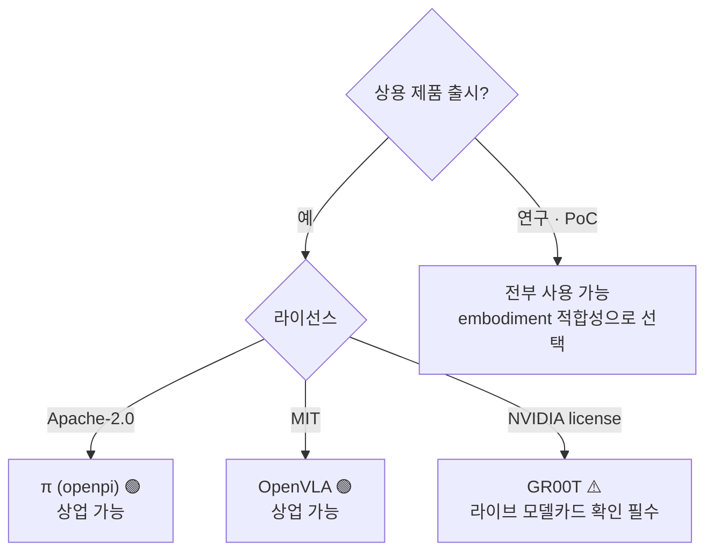
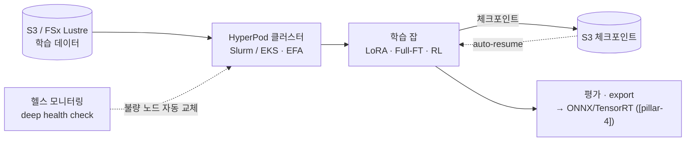
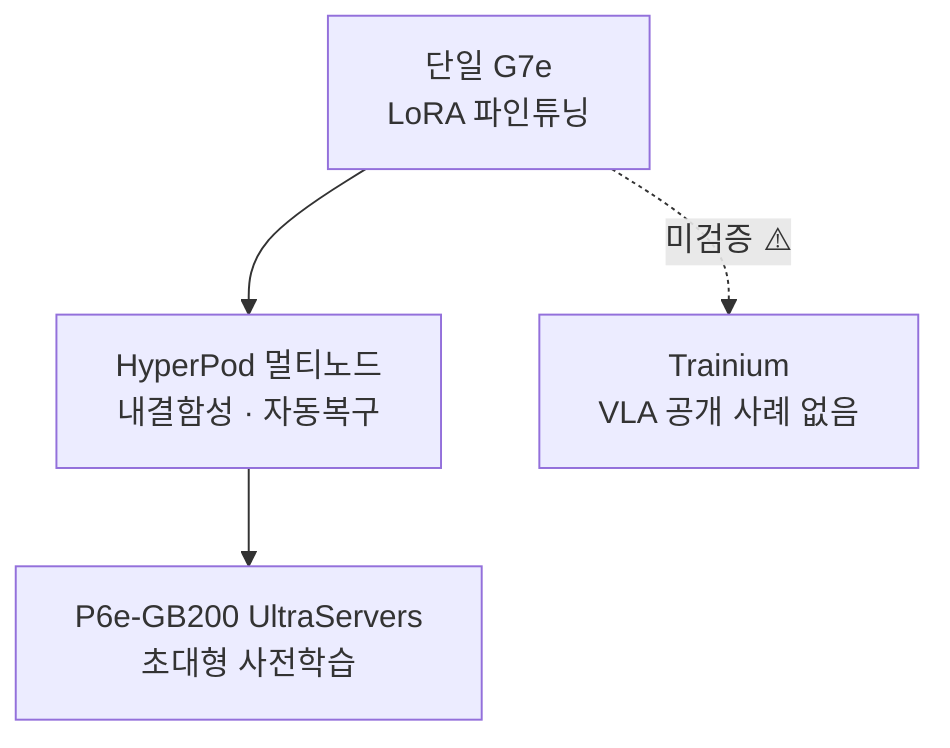

# Pillar 2 — 모델 학습 (Model Training · VLA)

_최종 갱신: 2026-09 · owner: Youngjin · volatility: 높음(모델 버전·라이선스·인스턴스가 자주 바뀜)_
_개별 항목은 별도 표기가 없는 한 페이지 메타데이터(owner/updated/volatility)를 상속. 항목별 owner 지정 시 항목 푸터 추가._
[← index로](index.md)

> **L0 TL;DR**: 대부분의 고객은 **VLA[^vla]를 밑바닥부터 학습하지 않는다 — 오픈 파운데이션 모델을 파인튜닝[^ft]**한다. 그래서 핵심 질문은 세 가지다: (1) 어느 모델을 쓸 것인가(**라이선스가 상용 여부를 좌우**), (2) LoRA[^lora]냐 풀 파인튜닝이냐(GPU 규모 결정), (3) AWS에서 어떻게 돌릴 것인가(HyperPod + EC2 GPU). Trainium으로 VLA를 학습한 공개 사례는 아직 없다.

---

## 이 필러에서 고객이 가장 자주 묻는 질문 Top 3

1. **"어느 VLA 모델로 시작하죠? 상업적으로 써도 되는 게 뭐예요?"** → [오픈 VLA 파운데이션 모델](#1-오픈-vla-파운데이션-모델--라이선스--ga) (⚠️ GR00T 라이선스 함정)
2. **"파인튜닝에 GPU 몇 장 필요하죠? LoRA면 한 장으로 되나요?"** → [VLA 파인튜닝 실전](#2-vla-파인튜닝-실전-lora-vs-full-ft--ga)
3. **"AWS에서 VLA 학습을 어떻게 돌리죠? HyperPod로? Trainium 써도 되나요?"** → [AWS 학습 스택](#3-aws-학습-스택-hyperpod--ec2-gpu--ga)

> **안정 원리 (잘 안 바뀜)**: (1) 프런티어 VLA를 사전학습하는 고객은 거의 없다 — **파인튜닝이 99%의 현실**. (2) VLA는 **System 2[^sys](느린 VLM[^vlm] 플래너, 5~10Hz) + System 1(빠른 액션 정책, 50~200Hz)** 구조로 수렴 중이며, 이 이중 구조가 "추론을 클라우드에 둘지 엣지에 둘지"를 결정한다(→ [pillar-4](pillar-4.md), [decisions](decisions.md)). (3) 연속 액션 생성은 **flow-matching[^flow] / diffusion action head + action chunking[^chunk]**이 표준.

---

## 1. 오픈 VLA 파운데이션 모델 & 라이선스  🟢 GA

**L0 TL;DR**: 파인튜닝의 출발점. 성능만큼 **라이선스가 중요** — 가장 화제인 NVIDIA GR00T가 버전에 따라 비상업일 수 있고, Physical Intelligence π(Apache-2.0)와 OpenVLA(MIT)는 **허용적 라이선스로 상업 친화적**이다.

**고객 니즈/문제**: "휴머노이드/매니퓰레이터용 VLA를 도입하고 싶다. 어떤 오픈 모델이 좋고, 우리 제품에 상업적으로 써도 되나?"

**솔루션 개요** `[1]`:

- **[NVIDIA Isaac GR00T](https://github.com/NVIDIA/Isaac-GR00T)** — 오픈 휴머노이드 파운데이션 모델. N1(2B), N1.5(3B, flow-matching DiT action head), N1.6(CES 2026, Cosmos Reason 2 백본), N1.7(GitHub상 GA 주장). ⚠️ **라이선스 주의**: N1.5 모델 카드는 **비상업(NVIDIA license, non-commercial)**. N1.6/N1.7이 상업 허용이라는 주장은 **2차 출처뿐이라 미검증** → 상용 판단 전 **라이브 모델 카드 직접 확인 필수**. `[1]` github.com/NVIDIA/Isaac-GR00T
- **[Physical Intelligence π (openpi)](https://github.com/Physical-Intelligence/openpi)** — π0, π0-FAST, π0.5 전부 **Apache-2.0**(상업 가능). DROID/ALOHA/LIBERO 파인튜닝 체크포인트 제공. `[1]` github.com/Physical-Intelligence/openpi. ⚠️ π0.7은 2차 출처만 존재(미검증).
- **[OpenVLA](https://github.com/openvla/openvla)** — 7B, **MIT 라이선스**(상업 가능), Llama2 기반 VLM 백본. 공식 파인튜닝 스크립트 제공. `[1]` github.com/openvla/openvla (LICENSE 파일 2026-07 직접 확인)

**AWS 매핑**: 모델 가중치를 HF에서 S3로 미러링 → EC2 GPU(P6/G7e) 또는 SageMaker HyperPod에서 파인튜닝(아래 2·3번). [LeRobot](https://github.com/huggingface/lerobot)(`groot` policy type)으로 GR00T post-train/eval 가능.

**의사결정 기준**:

- **상용 제품 출시** → π(Apache-2.0) 또는 OpenVLA(MIT) 우선. GR00T는 라이선스 확정 후에만.
- **휴머노이드 전신 제어** → GR00T가 가장 완성형(SONIC controller, Cosmos Reason 백본), 단 라이선스 확인.
- **연구·PoC** → 전부 사용 가능, 성능/embodiment[^embodiment] 적합성으로 선택.

**고객 사례**: 사례 대기 (국내 공개 VLA 파인튜닝 사례 미확인).

**➡️ 다음 액션**: 고객이 모델 선정 중이면 **"라이선스 매트릭스(GR00T=확인필요 / π=Apache-2.0 / OpenVLA=MIT)를 첫 슬라이드로"** 제시. 상용이면 π0.5 또는 OpenVLA 파인튜닝 PoC를 EC2 G7e 위에서 제안.

**🔗 관련 자산**: [pillar-1 데이터셋 라이선스](pillar-1.md) · [pillar-4 엣지 배포](pillar-4.md) · [로봇 파운데이션 모델 페이퍼 리뷰](https://hi-space.gitbook.io/physical-ai-on-aws/paper-review-tbd/robot-foundation-model) — 한국어. 추론 VLM(Cosmos-Reason 1)·VLA(RT-2, OpenVLA, Gemini Robotics, GR00T N1, π0.6) 논문 정리

🔄 휘발성 데이터 (모델 버전·라이선스 — 갱신 대상, 2026-07 확인)

| 모델 | 파라미터 | 라이선스 | 상용 | 백본 / 액션헤드 | 비고 |
|---|---|---|---|---|---|
| GR00T N1 | 2B | NVIDIA (비상업) | ❌ | SigLip2+T5 / flow-matching DiT | |
| GR00T N1.5 | 3B | NVIDIA (비상업) | ❌ | / flow-matching DiT | 모델카드 명시 |
| GR00T N1.6 | ~3B | 상업 주장 [4] | ⚠️미검증 | Cosmos Reason 2 | CES 2026 |
| GR00T N1.7 | 3B | NVIDIA Open Model | ⚠️미검증 | Cosmos-Reason2-2B / diffusion | GitHub GA 주장, 40 timestep horizon |
| π0 / π0-FAST / π0.5 | 미공개 | **Apache-2.0** | ✅ | flow-matching (π0-FAST=autoregressive) | |
| OpenVLA | 7B | **MIT** | ✅ | Llama2 VLM | 라이선스 2026-07 직접 확인 |

⚠️ **N1.5 vs N1.6 vs N1.7 버전-라이선스 매핑이 출처 간 불일치.** 상용 클레임 전 라이브 HF/GitHub 모델 카드 직접 확인. 이 항목이 필러 2에서 가장 인용 위험이 큼.

---

## 2. VLA 파인튜닝 실전 (LoRA vs Full-FT)  🟢 GA

**L0 TL;DR**: 좋은 소식 — **LoRA 파인튜닝은 GPU 한 장(24GB급)으로 가능**하고, 태스크당 100~500 데모면 단일 태스크 80%+ 성공률이 나온다. 풀 파인튜닝은 70~100GB(H100/A100급)가 필요하다.

**고객 니즈/문제**: "우리 태스크에 맞게 VLA를 조정하고 싶은데, GPU를 얼마나 확보해야 하고 데이터는 얼마나 필요한가?"

**솔루션 개요** `[1]`:

- **OpenVLA**: LoRA(rank 32) ~24GB 단일 GPU(A100/RTX 4090). 48GB→batch 12, 80GB→batch 24. 풀 파인튜닝 ~100GB. 공식 `vla-scripts/finetune.py`.
- **openpi (π0/π0.5)**: 추론 >8GB, LoRA >22.5GB(RTX 4090), **풀 파인튜닝 >70GB(A100/H100)**. 공식 LoRA/full 레시피, 2025-09 PyTorch 지원 추가. 데이터 1~20시간이면 다수 태스크 충분.
- **GR00T (N1.5/N1.7)**: 파인튜닝 40GB+ GPU(H100/L40 권장), 추론 16GB+. NVIDIA 공식 post-training 레시피.
- **데이터량 감(感)**: LoRA 단일 태스크 100~500 데모 → 80%+ 성공. 소량·고품질 실데모가 핵심(→ [pillar-1 텔레옵](pillar-1.md)).
- **무엇을 unfreeze하나 — 부품별 학습 범위가 곧 비용** `[1]/[2]`: 최신 VLA는 (1) 이해하는 VLM + (2) 행동을 생성하는 DiT[^dit] + (3) 로봇 몸에 맞추는 어댑터 MLP의 조립이다([GR00T N1 구조, arXiv:2503.14734](https://arxiv.org/abs/2503.14734)). "무엇을 바꾸려는가"가 어느 부품을 열지(unfreeze)와 비용을 결정한다:

| 바꾸려는 것 | MLP(어댑터) | DiT(액션) | VLM(이해) | 비용 감각 `[2]` |
|---|---|---|---|---|
| 기존 로봇 + 기존 동작 | 유지 | 유지 | 유지 | 학습 불필요(바로 사용) |
| **새 로봇**, 기존 동작 | **학습** | freeze | freeze | 텔레옵 데모 50~200개, 2~6시간, g5.2xlarge ~$10 |
| 새 동작(사전학습에 없던 verb) | 학습 | **학습** | freeze | 반나절 |
| 특수 카메라 모달리티(적외선 등) | 학습 | 학습 | LoRA | 수 일, 가장 비쌈 |

- ⚠️ **새 로봇 = 어댑터 필수** `[2]`: GR00T는 사전 등록된 embodiment(GR-1·Franka 등)의 MLP만 내장한다. 미등록 로봇에 그대로 올리면 무의미한 출력이 나온다(실측 0% 성공) — 최소 조건은 **데모 ~100개 + 어댑터 학습**. fold·pour·stack 같은 흔한 동작은 사전학습에 있어 MLP만으로 되지만, 용접처럼 없던 동작은 DiT까지 열어야 한다.

**AWS 매핑**: LoRA면 **EC2 G6e(L40S)·G7e(RTX PRO 6000)** 단일/소수 GPU로 충분. 풀 파인튜닝·멀티 embodiment면 **P6-B200 / HyperPod 멀티노드**(아래 3번).

**의사결정 기준**:

- 태스크 특화·데이터 소량 → **LoRA + 단일 G7e**. 가장 저렴·빠름. 대부분 여기서 시작.
- 다중 embodiment·대규모·백본까지 조정 → **풀 파인튜닝 + P6/HyperPod**.
- 데이터 <1시간 → 파인튜닝보다 few-shot/프롬프트 우선 검토.

**고객 사례**: 사례 대기 (공식 AWS VLA 파인튜닝 사례 없음 — 3번의 Unitree H1은 RL locomotion이지 VLA 아님).

**➡️ 다음 액션**: **"단일 G7e에서 LoRA 파인튜닝 1일 PoC"** 를 기본 엔트리 제안으로. 고객 데이터가 100 데모 이상이면 바로 실측 성공률을 보여줄 수 있다. GPU 확보가 막히면 → [decisions](decisions.md).

**🔗 관련 자산**: [pillar-1 데이터 파이프라인](pillar-1.md) · [decisions: Build vs Buy](decisions.md)

🔄 휘발성 데이터 (GPU 요구 — 2026-07 공식 레포 기준)

| 모델 | 추론 | LoRA 파인튜닝 | 풀 파인튜닝 |
|---|---|---|---|
| OpenVLA (7B) | — | ~24GB (단일) | ~100GB |
| π0 / π0.5 | >8GB | >22.5GB | >70GB (A100/H100) |
| GR00T N1.5/N1.7 | 16GB+ | 40GB+ (H100/L40) | — |

---

## 3. AWS 학습 스택 (HyperPod + EC2 GPU)  🟢 GA

**L0 TL;DR**: SageMaker HyperPod가 분산 학습의 내결함성·자동복구·엘라스틱 스케일링을 처리하고, EC2는 **G7e(단일~소수) → P6-B200/P6e-GB200(대규모)** 로 이어진다. 단, **VLA 전용 HyperPod 레시피는 없다**(LLM 레시피만) — VLA 학습은 클러스터 위에서 DIY.

**고객 니즈/문제**: "파인튜닝/학습을 안정적으로 돌릴 인프라가 필요하다. 노드 죽으면 처음부터 다시 하나?"

**솔루션 개요** `[1]`:

- **[SageMaker HyperPod](https://aws.amazon.com/sagemaker/hyperpod/)** — Slurm + **EKS** + Training Jobs 지원. **Checkpointless training**(장애 시 수분 내 자동복구, 수동개입 없음), **Elastic training**(가용량·우선순위 따라 자동 스케일, 자동 체크포인트/재개). **2026-04 G7e + r5d.16xlarge 지원 추가**. HyperPod CLI/SDK 제공.
- **EC2 GPU 사다리** `[1]`: **G7**(RTX PRO 4500, 2026-06 GA) · **G7e**(RTX PRO 6000 Blackwell, 2026-01 GA) · **G6e**(L40S) → **P6-B200**(8×B200, 1440GB HBM) · **[P6e-GB200 UltraServers](https://aws.amazon.com/ec2/ultraservers/)**(GB200 NVL72, 최대 72 Blackwell/NVLink 도메인, [Capacity Blocks](https://aws.amazon.com/ec2/capacityblocks/)로 확보).
- **Trainium**: Trn2 GA(2024-12), **Trn3 UltraServers GA(2025-12 re:Invent)**, Trn4 발표. ⚠️ **VLA/로보틱스를 Trainium으로 학습한 공개 사례 없음** — 전체 VLA 툴체인이 CUDA/NVIDIA. Trainium-for-VLA는 미검증.
- **서울 리전 최신 세대** `[1]`: **[P6-B300](https://aws.amazon.com/about-aws/whats-new/2026/08/amazon-ec2-p6-b300/)**(8×NVIDIA Blackwell Ultra, 인스턴스당 2.1TB HBM3e·6.4Tbps EFA)이 **2026-08-20 서울 리전 GA** — 한국 팀이 최신 accelerator를 해외 리전 대기 없이 데이터 레지던시 안에서 쓴다. Capacity Blocks/Savings Plans/On-Demand 소비. 범위는 정직하게: 범용 FM 학습 플랫폼이고 Physical AI(시뮬·VLA 학습)는 그 위의 한 워크로드다.
- **규모별 권장 패턴 (3B급 VLA 기준, GR00T N1.6/N1.7 검증)** `[2]`: ① 데모 <200개·LoRA(2~4시간) → **AWS Batch + EC2 Spot(g6e)** — 짧고 저렴, 권장 기본값. ② 데모 ~500개·풀 파인튜닝(8~24시간) → **SageMaker Training Job** — 자동 체크포인트/재개. ③ 데모 500개+·멀티노드(며칠) → **HyperPod** — 노드 자동복구 + EFA. GPU 용량 부족에 대비해 **인스턴스 fallback 순서**(예: g6e → g6 → g5)를 잡 정의에 미리 넣어두면 대기 없이 다음 유형으로 넘어간다.

**HyperPod가 실제로 해주는 것** `[1]` (docs 2026-07 확인):

| 구성요소 | 기술 요약 | VLA 학습 관점 |
|---|---|---|
| **오케스트레이션** | **Slurm[^slurm]·EKS·Training Jobs** 3가지 모드 — HPC팀(Slurm)과 쿠버네티스팀(EKS)의 기존 워크플로우를 그대로 수용 | Isaac Lab RL(Slurm 관례)과 VLA 파인튜닝(EKS)을 같은 클러스터에서 |
| **내결함성 스택** | 헬스 모니터링 에이전트 + deep health check가 GPU·네트워크를 상시 감시 → **불량 노드 자동 교체 + 마지막 체크포인트 auto-resume**(개입 0). Checkpointless training은 체크포인트 없이도 수분 내 복구 | 수 주짜리 학습의 "노드 죽으면 처음부터?"에 대한 직접적인 답 |
| **Task Governance** | 팀·프로젝트별 쿼터를 **GPU 단위까지 세분 할당**, 우선순위 스케줄링, 저순위 잡 선점(체크포인트 저장 후 일시정지→재개), 유휴 컴퓨트 팀 간 대여 | 로봇팀·모델팀이 한 클러스터를 나눠 쓸 때 GPU 유휴율 관리 |
| **Elastic training** | 가용량·우선순위에 따라 잡 규모 자동 확대/축소, 자동 체크포인트·재개 | Capacity Blocks 확보분이 시간대별로 변할 때 자동 흡수 |
| **네트워크·스토리지** | **EFA[^efa]** 저지연 노드 간 통신 + FSx for Lustre 학습 채널(→ [pillar-1](pillar-1.md) 파이프라인) | 멀티노드 그래디언트 동기화 병목 제거 |
| **레시피** | LLM/FM용 사전 검증 학습 레시피 제공 — ⚠️ **VLA 전용 레시피는 없음**, 클러스터 위에서 DIY | 이 갭이 곧 SA의 화이트스페이스(파인튜닝 레시피 자산화 기회) |

**AWS 매핑**: 위 서비스 자체가 매핑. GPU 확보 전략(On-Demand vs Capacity Blocks vs Flexible Training Plans)은 → [decisions](decisions.md).

**의사결정 기준**:

- 단일/소수 GPU LoRA → HyperPod 없이 EC2 G7e 직접.
- 멀티노드·장시간·내결함성 필요 → **HyperPod(EKS)** + checkpointless.
- 초대형 사전학습 → P6e-GB200 UltraServers + Capacity Blocks.
- Trainium 제안 → **현재는 LLM 대상에 안전, VLA는 미검증**이라 명시하고 리스크 공유.

**고객 사례** `[1]`:

- **Unitree H1 휴머노이드 RL을 Isaac Lab + SageMaker(HyperPod)에서 학습** — AWS 공식 블로그(2026-06-09). 19관절 velocity tracking, PPO(skrl), HyperPod 헬스모니터링·자동교체·체크포인트 재개 시연. ⚠️ **RL locomotion이지 VLA 파인튜닝 아님** — 참조 아키텍처로만 인용.
- **Zoox** — HyperPod로 멀티모달 AV 파운데이션 모델, 64+ GPU 95% 활용률. ⚠️ AV.

**➡️ 다음 액션**: **AWS 공식 "Isaac Lab on SageMaker" 블로그를 그대로 워크숍 자산으로 활용**(재현 가능한 유일한 AWS 로보틱스 학습 레퍼런스). GPU 가용성 이슈면 Capacity Blocks/Flexible Training Plans로 연결.

**🔗 관련 자산**:

- 플레이북: [pillar-3 시뮬레이션(Isaac Lab)](pillar-3.md) · [decisions: GPU 확보](decisions.md)
- [Physical AI E2E 워크숍](https://hi-space.gitbook.io/physical-ai-on-aws/guide/e2e-workshop) — 한국어. GR00T VLA 파인튜닝 + SageMaker 트랙
- [AWS Physical AI Recipes](https://github.com/hi-space/aws-physical-ai-recipes) — 한국어, MIT. 위 E2E 워크숍의 코드까지 담은 실전 레시피 모음: Isaac Lab→GR00T 파인튜닝→추론→모니터링 E2E(CDK), SageMaker HyperPod VLA/RL 분산 학습 인프라(Slurm·FSx·MLflow), GR00T-N1.6-3B SageMaker 파인튜닝 파이프라인, NVIDIA OSMO[^osmo] on EKS 워크플로 오케스트레이션
- [Physical AI 101 — 처음 시작하는 사람을 위한 개념 지도](https://d2gup9k4vdzl3b.cloudfront.net/pai101/index.html) — 입문자용 단일 페이지: 큰 그림→연구 지형→VLA 파인튜닝→모델 내부→로봇 기초 개념→AWS의 역할, AWS PAI 참조 아키텍처·용어집 포함. 페이지 내 한국어/영어 전환, 말미에 이 플레이북을 다음 단계로 안내
- [Physical AI Scaffolding Kit](https://github.com/aws-samples/sample-physical-ai-scaffolding-kit) — aws-samples. HyperPod Slurm 클러스터 + π0·GR00T·Isaac Lab Newton RL 학습 샘플, 다국어 README(ko·ja·en). AWS Japan Physical AI 개발 지원 프로그램 공식 자산
- [Embodied AI Platform](https://github.com/aws-samples/sample-embodied-ai-platform) — aws-samples. GR00T VLA 텔레옵·모방학습 파인튜닝 on AWS Batch + DCV 워크스테이션 → SO-ARM100/101 실기 추론. ⚠️ 현재 GR00T 학습 컴포넌트 1개만 Available, 나머지 로드맵

---

## 4. System 2 + System 1 아키텍처  🟢 GA (안정 원리)

**L0 TL;DR**: 2026년 지배적 VLA 구조. **느린 VLM(System 2, 5~10Hz)이 "무엇을 할지"를 계획**하고, **빠른 액션 정책(System 1, 50~200Hz)이 "어떻게 움직일지"를 실행**한다. 이 분리가 **추론 배포 위치(클라우드 vs 엣지)를 결정**하므로 SA가 반드시 이해할 개념.

**고객 니즈/문제**: "실시간 제어인데 큰 모델을 어떻게 돌리나? 클라우드 지연이 문제 아닌가?"

**솔루션 개요** `[1]/[4]`:

- **[Figure Helix](https://www.figure.ai/news/helix)**: System 2 = 온보드 인터넷 사전학습 VLM @ 7~9Hz(장면/언어), System 1 = 반응형 visuomotor @ 200Hz. `[1]` figure.ai/news/helix
- **GR00T N1**: System 1 = diffusion policy ~10ms 지연, System 2 = LLM 플래너(태스크 분해).
- **일반 패턴**: 무거운 VLM이 5~10Hz로 재계획, 경량 flow-matching/diffusion "action expert"가 최신 계획 조건으로 50~200Hz 액션 방출. **action chunking**(GR00T=40 timestep horizon)으로 미래 액션 청크 예측.
- **필드 전체의 2축 taxonomy** `[1]`: 모델 이름에 파묻히기 전에 — 대부분의 VLA는 (1) **망 구조**: Monolithic(단일망 end-to-end) vs Hierarchical(계획자+실행자 분리), (2) **사고 시스템**: Single-system vs Dual-system(순차 cascade / 병렬 parallel)의 2×2 위에 놓인다. GR00T의 "두 개의 뇌"는 hierarchical × dual-system(parallel) 칸의 구체 사례 — System 1/2는 특정 모델 얘기가 아니라 필드의 1차 분류축이다.
- **실효 제어 주기 = 추론 Hz × chunk 크기**: π0.5가 Jetson에서 ~10Hz로 추론해도 한 번에 10스텝 chunk를 뱉으면 로봇은 ~100Hz로 움직인다(chunk 실행 중 다음 chunk 선계산). 이 산수가 "큰 모델 = 느린 로봇" 오해를 푸는 열쇠.
- ⚠️ **"VLA는 죽었다(WAM[^wam]이 대체)" 헤드라인 주의** `[1]/[4]`: WAM(World Action Model)은 video-diffusion 백본으로 미래 영상+행동을 **동시 예측**한다 — 웹 비디오의 물리 prior 덕에 미학습 동작 zero-shot이 강점([DreamZero, arXiv:2602.15922](https://arxiv.org/abs/2602.15922): 로봇 데이터 ~500시간만으로 unseen task 16%→40%대)이나, 14B 반복 denoising 탓에 closed-loop **~7Hz로 가장 느리다**. "VLAs are dead" 키노트와 같은 시기에 NVIDIA 본체가 GR00T N1.7(VLA)을 출시했고, 독립 비교에선 데이터 다양성이 충분하면 VLA(π0.5)가 WAM과 대등 — 실제 그림은 **"VLA + World Model + RL 후학습의 수렴"**이다. 고객 대화에서 헤드라인을 그대로 옮기지 말 것(성숙도 추적은 [radar의 World-action models](radar.md)).
- ⚠️ **성숙도 정직**: 이 *패턴 자체*는 표준이지만, 전신 휴머노이드 풀스택은 대부분 파일럿/데모 단계.

**AWS 매핑**: **System 2(플래너)는 클라우드/Bedrock AgentCore에, System 1(실시간 제어)은 엣지(Jetson)에** 두는 것이 자연스러운 분할(→ [pillar-5](pillar-5.md), [pillar-4](pillar-4.md), [decisions](decisions.md)).

**의사결정 기준**: 30~100Hz 실시간 제어 요구 → System 1은 **반드시 엣지 온보드**. System 2(계획·추론)는 지연 허용되면 클라우드 가능. 이 경계가 [decisions의 Cloud vs Edge 트리](decisions.md)의 핵심.

**고객 사례**: Figure(데모/PR), GR00T(오픈 모델). 검증된 프로덕션은 제한적.

**➡️ 다음 액션**: 고객이 "실시간인데 클라우드로 되나?"라고 물으면 **System1/System2 그림을 그려주고 "제어 루프는 엣지, 계획은 클라우드"로 정리**. 이것만으로 아키텍처 대화가 정돈된다.

**🔗 관련 자산**: [pillar-4 엣지 추론](pillar-4.md) · [pillar-5 오케스트레이션](pillar-5.md) · [decisions](decisions.md)

---

## 5. (경쟁 스택) Google Gemini Robotics  🟡 Preview

**L0 TL;DR**: 구글의 로봇 VLA 패밀리. **Gemini Robotics-ER 1.6은 프리뷰(Gemini API/AI Studio)** 로 공개된 embodied reasoning(고수준 추론·툴콜) 레이어이고, 저수준 모터 제어 VLA는 파트너 한정. 경쟁 스택이지만 고객이 자주 물으므로 정직하게 다룬다.

**고객 니즈/문제**: "Gemini Robotics 쓰면 되는 거 아닌가요? AWS랑 어떻게 관계되죠?"

**솔루션 개요** `[1]`:

- **Gemini Robotics-ER 1.6** (2026-04 **Preview**, model id: `gemini-robotics-er-1.6-preview`, AI Studio + Gemini API) — 에이전틱 embodied reasoning: 태스크 분해, 툴콜(Search 포함), VLA 호출, 아날로그 게이지 판독. **추론/VLM 레이어이지 저수준 제어 아님**. Google 공식 문서가 "currently in preview" 명시 `[1]`.
- **Gemini Robotics On-Device** (2025-06) — 로컬 배포 가능한 첫 VLA, 파인튜닝 지원(50~100 데모). **waitlist/trusted-tester(Preview)**.
- **Gemini Robotics 1.5 VLA** — 파트너 한정.

**AWS 매핑 (경쟁 스택 → AWS 보완)**: Gemini Robotics-ER는 **플래너(System 2) 역할** — 고객이 이를 쓰더라도 **로봇 플릿 오케스트레이션·툴 게이트웨이·정책 가드레일은 Bedrock AgentCore로 감쌀 수 있다**(→ [pillar-5](pillar-5.md)). 저수준 제어 VLA는 오픈 모델(π/OpenVLA/GR00T)을 AWS에서 파인튜닝하는 대안 제시.

**의사결정 기준**:

- 빠른 고수준 추론이 필요하고 구글 생태계·프리뷰 리스크 수용 가능 → ER 1.6 API 시도 가능(단 Preview — 프로덕션 약정 금지).
- 상용·온프렘·데이터 주권·저수준 제어 커스터마이즈 → **오픈 VLA를 AWS에서 파인튜닝**이 더 유연.

**고객 사례**: 파트너 배포(비공개 다수).

**➡️ 다음 액션**: 고객이 Gemini Robotics를 검토 중이면 **"추론 레이어는 그걸 쓰더라도, 오케스트레이션·가드레일·저수준 제어 모델은 AWS에서 소유"** 하는 하이브리드를 제안(경쟁이 아니라 보완 각도).

**🔗 관련 자산**: [pillar-5 AgentCore](pillar-5.md)

---

## 6. 학습 운영 원리 — 체크포인트 계보와 IL의 천장  🟢 GA (안정 원리)

**L0 TL;DR**: 고객 학습 프로젝트를 반복적으로 무너뜨리는 함정 둘. (1) **체크포인트는 나무다** — specialize는 단방향이라 generalist 체크포인트를 잃으면 되돌릴 수 없다. (2) **loss가 낮아도 성공률은 안 오른다** — 모방학습의 covariate shift[^covshift] 때문이며, 평가는 loss가 아니라 **rollout 성공률로만** 한다.

**고객 니즈/문제**: "파인튜닝을 거듭할수록 이전 능력이 사라진다" / "training loss는 계속 내려가는데 실제 성공률이 안 움직인다".

**솔루션 개요** `[1]/[2]`:

- **체크포인트 tree 관리**: 가중치는 generalist → embodiment 특화 → task 특화(데모 10~150개) → 실배포 보정 순으로 가지를 치며(spin-off) 자란다. **chain은 단방향** — 한 번 specialize된 가중치에서 generalist 역복원은 사실상 불가(catastrophic forgetting[^forget]). 어떤 가지가 특정 동작에 과적합해 무너지면 그 가지를 더 밀지 말고 **이전(더 general한) 체크포인트로 되돌아가 재분기**한다.
- **"고객 A의 가중치를 고객 B에 적용" 질문의 실제 답**: A의 specialist weight가 아니라 **그 위 generalist에서 B로 새로 파인튜닝**이다. LoRA로 분기해 뒀다면 어댑터만 떼어 generalist로 복귀할 수 있다 — 처음부터 LoRA 분기를 권하는 운영상 이유.
- **"open weights"의 함정**: 공개 체크포인트가 계보의 어느 단계인지 먼저 확인 — Stage 3 specialist 하나만 풀린 모델은 그 로봇·환경 밖에서 못 쓴다(역복원 불가). OpenVLA·GR00T·π0/π0.5가 generalist(foundation) 체크포인트를 공개하는 이유가 이것.
- **IL의 천장 = covariate shift**: BC는 "전문가가 있던 상태 → 전문가 행동" 쌍만 배우므로, 실행 중 작은 오차로 데모 분포 밖(OOD) 상태에 들어가면 회복 방법이 데이터에 없어 오차가 눈덩이처럼 누적된다 — 최악의 경우 시간 지평 T에 대해 T²로([Ross et al., DAgger, arXiv:1011.0686](https://arxiv.org/abs/1011.0686)). **training loss도 validation loss도 이 문제를 못 잡는다**(둘 다 같은 데모 분포에서 재기 때문).
- **처방**: "더 좋은 val set"이 아니라 **정책이 실제 방문하는 분포를 학습에 넣는 것** — DAgger[^dagger](정책이 간 상태에 전문가 라벨 추가) → on-policy 데이터 → RFT(아래 7번). 진단 신호: loss ≈ 0인데 성공률 평탄 → 더 학습할 게 아니라 접근을 바꿀 때.

**AWS 매핑**: 체크포인트 계보 = S3 버전닝 + 단계별 별도 보존(HyperPod 자동 체크포인트는 3번). 평가 rollout = 시뮬레이션 스윕([pillar-3](pillar-3.md), 평가의 한계는 [pillar-4 정책 평가](pillar-4.md)).

**의사결정 기준**: generalist 체크포인트는 어떤 경우에도 별도 보존(덮어쓰기 금지). 평가 지표를 loss로 잡은 학습 계약·마일스톤은 재협상 대상.

**고객 사례**: 사례 대기 (원리 자체는 공개 논문 근거).

**➡️ 다음 액션**: 고객 학습 파이프라인 리뷰에서 **"generalist 체크포인트를 어디 보관하나" + "평가를 loss로 하나 rollout으로 하나"** 두 질문부터. 이 둘이 흔들리면 나머지 논의가 무의미하다.

**🔗 관련 자산**: [pillar-4 정책 평가](pillar-4.md) · [pillar-1 텔레옵](pillar-1.md)

---

## 7. RL 파인튜닝 (RFT) — PPO vs GRPO와 보상 설계  🟢 GA (알고리즘) / 🔵 보상 자동화 Research

**L0 TL;DR**: SFT(모방)만으로는 시연의 실수까지 배운다. 환경 보상으로 마무리하는 단계가 RFT[^rft] — 알고리즘은 **PPO[^ppo]가 오랜 표준, critic 없는 GRPO[^grpo]가 급부상**(대형 모델일수록 compute 이득). 진짜 승부처는 알고리즘이 아니라 **보상 설계**다 — "simulator fidelity is reward fidelity".

**고객 니즈/문제**: "BC로 80%까지 왔는데 그 이상이 안 나온다. RL로 마무리하려면 뭘 어떻게 쓰나?"

**솔루션 개요** `[1]`:

- **PPO** ([Schulman et al., arXiv:1707.06347](https://arxiv.org/abs/1707.06347)) — "직전 정책 근처로만 조금씩". RL은 정책이 자기 학습 데이터를 스스로 만들므로, 한 번의 큰 업데이트로 망가지면 더 나쁜 데이터를 모아 악순환에 빠진다 — clip이 그 급변을 막는다. 로봇 RL 사실상 표준.
- **GRPO** ([DeepSeekMath, arXiv:2402.03300](https://arxiv.org/abs/2402.03300)) — critic(value network)을 없애고, 같은 상태에서 N개 rollout을 돌려 **그룹 평균 return을 baseline**으로 쓴다. 정책망만큼 들던 critic의 연산·메모리가 사라져 VLA급 대형 모델에서 이득. 단 그룹 baseline은 분산이 클 수 있어 N을 충분히 키운다.
- **보상 설계가 승부처**: sparse(성공 시만 +1)는 첫 성공 전까지 학습 신호 자체가 없고, dense(거리 기반 shaping)는 설계자 편견과 reward hacking[^rhack](점수만 올리고 목표는 안 함) 위험. 보상은 **달성하려는 결과 그 자체**를 재야 하며, 시뮬레이터가 마찰·접촉·지연을 얼마나 충실히 재현하느냐가 곧 보상 신호의 충실도다(→ [pillar-3](pillar-3.md)).
- **검증된 실전 레시피 — Teacher-Student 파이프라인** `[1]`: ① Teacher = **PPO + privileged state**(GT pose·contact 등 특권 정보, Isaac Lab 대규모 병렬) → ② Student = **DAgger + BC 증류**(배포 가능한 RGB+proprioception 입력만) → ③ **GRPO + binary success reward**로 부트스트랩. [VIRAL(arXiv:2511.15200)](https://arxiv.org/abs/2511.15200)·[DoorMan(arXiv:2512.01061)](https://arxiv.org/abs/2512.01061)(둘 다 CVPR 2026) 실증 — DoorMan은 83% SR로 전문가 텔레옵 기준선(80%)을 상회.
- 🔵 **보상 자동화(Research)**: 태스크마다 dense 보상을 손으로 못 짠다 — VLM으로 매 스텝 진행도를 자동 채점하는 [GVL(arXiv:2411.04549)](https://arxiv.org/abs/2411.04549)·[TopReward(arXiv:2602.19313)](https://arxiv.org/abs/2602.19313)·[VLLR(arXiv:2604.00055)](https://arxiv.org/abs/2604.00055)이 활발하나, 2026 기준 "상업 이용 가능 + 저지연 + open-weight"를 모두 만족하는 progress model은 드물다. 성공 판정이 객관적이면(도착·조립 완료) 결정론적 verifier로 직접 보상을 주는 RLVR이 안전한 출발점.

**AWS 매핑**: Teacher 대규모 병렬 RL = Isaac Lab on EC2 G6e/AWS Batch(→ [pillar-3](pillar-3.md)), 증류·GRPO 부트스트랩 = 3번 학습 스택 그대로. [sample-vla-finetuning](https://github.com/aws-samples/sample-vla-finetuning)이 IL/RL 두 경로를 IaC로 제공(아래 관련 자산).

**의사결정 기준**: 깨끗한 시연 수백 개 확보 가능 → IL로 warm-start. 시연 없음 + 좋은 시뮬레이터·보상 → RL. **실전 정답은 대개 hybrid(IL → RFT)**. 대형 VLA에서 critic 메모리가 병목 → GRPO.

**고객 사례**: 사례 대기 (VIRAL/DoorMan은 논문 실증 — 고객 배포 사례 아님).

**➡️ 다음 액션**: BC 성능 정체 고객에게 **Teacher-Student(PPO→증류→GRPO) 3단계 레시피**를 제안 — 전 단계가 시뮬레이션 안에서 완결되므로 기존 AWS Batch/Isaac Lab 스택을 그대로 재사용한다.

**🔗 관련 자산**: [pillar-3 병렬 RL](pillar-3.md) · [sample-vla-finetuning](https://github.com/aws-samples/sample-vla-finetuning) — aws-samples, MIT-0. 의도(IL 데모 or RL 태스크)만 주면 Batch+Spot / SageMaker Training / HyperPod 3패턴을 자동 결정하는 원-커맨드 파인튜닝 플랫폼. GR00T·π0.5·ACT·SmolVLA + Isaac Lab RL 경로, MCP 서버(7 tools)로 에이전트 세션에서 submit·모니터링까지

---

## 이 필러의 정직한 현실 (SA 필독)

- **GR00T 라이선스는 지금 인용 최대 위험.** N1.5는 명백히 비상업. N1.6/N1.7 상업 허용은 2차 출처뿐 → **고객 상용 판단 전 라이브 모델 카드 직접 확인**. 틀리면 법무 리스크.
- **"PI(Physical Intelligence)가 AWS 쓴다" 는 말 금지.** openpi 체크포인트가 GCS(`gs://`)에 있어 **GCP 신호**. AWS-PI 사례 없음.
- **공식 AWS VLA 파인튜닝 사례는 없다.** 유일한 AWS 로보틱스 학습 레퍼런스는 **Unitree H1 RL locomotion**(VLA 아님). VLA 스토리를 과장하지 말 것.
- **Trainium-for-VLA는 미검증.** 전체 VLA 툴체인이 CUDA. 제안 시 리스크 명시.

---
_owner: Youngjin · updated: 2026-09 · volatility: 높음 (모델 버전·라이선스·GPU 요구·인스턴스는 접힌 블록에서 관리) · sources: [1] 공식/논문, [3] 벤더, [4] 미검증_

<!-- 용어 각주 -->

[^vla]: **VLA (Vision-Language-Action)** — 카메라 영상(Vision)과 자연어 지시(Language)를 입력받아 로봇의 동작(Action)을 직접 출력하는 파운데이션 모델. "컵을 집어"라고 말하면 관절 움직임을 생성하는 식. 🎥 [NVIDIA Isaac GR00T N1 소개](https://www.youtube.com/watch?v=m1CH-mgpdYg)
[^ft]: **파인튜닝(fine-tuning)** — 대규모 데이터로 사전학습된 모델을 자기 태스크·로봇의 소량 데이터로 추가 학습시키는 것. 밑바닥부터 학습하는 것보다 데이터·GPU가 수십~수백 배 절약된다.
[^lora]: **LoRA (Low-Rank Adaptation)** — 원본 가중치는 얼려두고 작은 저랭크(low-rank) 행렬만 추가로 학습하는 경량 파인튜닝 기법. GPU 메모리 요구가 풀 파인튜닝의 수분의 1이라 24GB급 GPU 한 장으로도 가능하다.
[^sys]: **System 2 / System 1** — 인지과학의 "느린 사고 / 빠른 반응" 구분을 로봇 아키텍처에 적용한 구조. System 2는 느린 대형 모델이 계획을(5~10Hz), System 1은 작은 정책이 실시간 제어를(50~200Hz) 맡는다. 추론을 클라우드에 둘지 엣지에 둘지를 가르는 기준이 된다.
[^flow]: **flow-matching / diffusion action head** — 로봇의 연속 동작을 노이즈에서 점진적으로 다듬어 생성하는 확산(diffusion)·플로우 계열의 출력 모듈. 부드럽고 여러 가지 가능한(multi-modal) 동작 분포를 표현할 수 있어 최신 VLA의 표준 액션 헤드다.
[^chunk]: **action chunking** — 매 스텝 동작 1개가 아니라 앞으로의 동작 여러 스텝(청크)을 한 번에 예측하는 기법. 추론 횟수를 줄여 실시간 제어 주파수를 맞추기 쉽게 한다.
[^vlm]: **VLM (Vision-Language Model)** — 이미지와 텍스트를 함께 이해하는 모델(예: 사진을 보고 질문에 답함). VLA는 보통 VLM을 "눈+두뇌" 백본으로 쓰고 그 위에 액션 헤드를 얹는다.
[^embodiment]: **embodiment(임바디먼트)** — 로봇의 물리적 형태·자유도·센서 구성. 같은 모델이라도 로봇 팔과 휴머노이드는 embodiment가 달라 데이터·정책을 그대로 이식할 수 없다.
[^slurm]: **Slurm** — HPC 클러스터의 표준 오픈소스 잡 스케줄러. 수천 노드에 배치 잡을 큐잉·할당하며, 연구실·슈퍼컴 출신 팀에게 가장 익숙한 워크플로우다.
[^efa]: **EFA (Elastic Fabric Adapter)** — EC2용 저지연·OS 바이패스 네트워크 인터페이스. 멀티노드 분산 학습에서 GPU 간 그래디언트 동기화(All-Reduce) 병목을 줄이는 핵심이다.
[^osmo]: **OSMO** — NVIDIA의 로보틱스 워크로드용 워크플로 오케스트레이션 플랫폼. 합성 데이터 생성·시뮬레이션·모델 학습 같은 멀티스테이지 잡을 온프레미스·클라우드의 여러 클러스터(Kubernetes 등)에 걸쳐 스케줄링한다.
[^dit]: **DiT (Diffusion Transformer)** — Transformer 구조로 만든 확산(diffusion) 생성기. 최신 VLA에서 노이즈로부터 로봇 관절 명령(action chunk)을 생성하는 "행동 엔진" 부품으로 쓰인다.
[^wam]: **WAM (World Action Model)** — 비디오 생성 모델을 백본으로 미래 영상과 로봇 행동을 동시에 예측하는 모델. 웹 비디오로 배운 물리 지식 덕에 안 배운 동작에 강하지만, 반복 denoising 탓에 제어 주파수가 낮다. WFM(영상만 생성, 행동 출력 없음)과 혼동 주의.
[^covshift]: **covariate shift(공변량 이동)** — 학습 때 본 상태 분포와 실행 때 실제 마주치는 상태 분포가 어긋나는 현상. 모방학습 정책이 작은 오차로 데모에 없던 상태로 표류하면 회복 방법을 배운 적이 없어 오차가 누적된다. ("covariant"가 아니라 "covariate"가 맞는 표기.)
[^forget]: **catastrophic forgetting(파국적 망각)** — 신경망이 새 작업을 학습하면서 이전에 배운 능력을 덮어써 잃어버리는 현상. specialize된 체크포인트에서 generalist를 복원할 수 없는 이유다.
[^dagger]: **DAgger (Dataset Aggregation)** — 학습된 정책을 실제로 실행시켜 정책이 방문한 상태들에 전문가 정답 라벨을 추가로 모아 재학습하는 모방학습 보강 기법. covariate shift에 대한 고전적 처방이다.
[^rft]: **RFT (Reinforcement Fine-Tuning, 강화 미세조정)** — 모방학습(SFT)으로 만든 정책을 환경 보상 신호로 추가 개선하는 마무리 단계. 시연에 없던 더 나은 행동을 시행착오로 찾아낸다.
[^ppo]: **PPO (Proximal Policy Optimization)** — 가장 널리 쓰이는 강화학습 알고리즘. "직전 정책에서 너무 멀리 가지 않게" 업데이트 폭을 clip으로 제한해 안정적으로 수렴한다 — 로봇 RL의 사실상 기본값.
[^grpo]: **GRPO (Group Relative Policy Optimization)** — 별도 가치망(critic) 없이, 같은 상태에서 여러 rollout을 돌려 그 그룹 평균을 기준선(baseline)으로 쓰는 강화학습 알고리즘. critic 학습 비용이 사라져 대형 모델(LLM·VLA)에서 급부상했다.
[^rhack]: **reward hacking** — 보상을 잘못 설계하면 에이전트가 의도한 목표 대신 점수 자체를 파고드는 현상(예: "전진 거리" 보상에 제자리 회전으로 센서 속이기). 보상은 달성하려는 결과 그 자체를 재야 한다.
