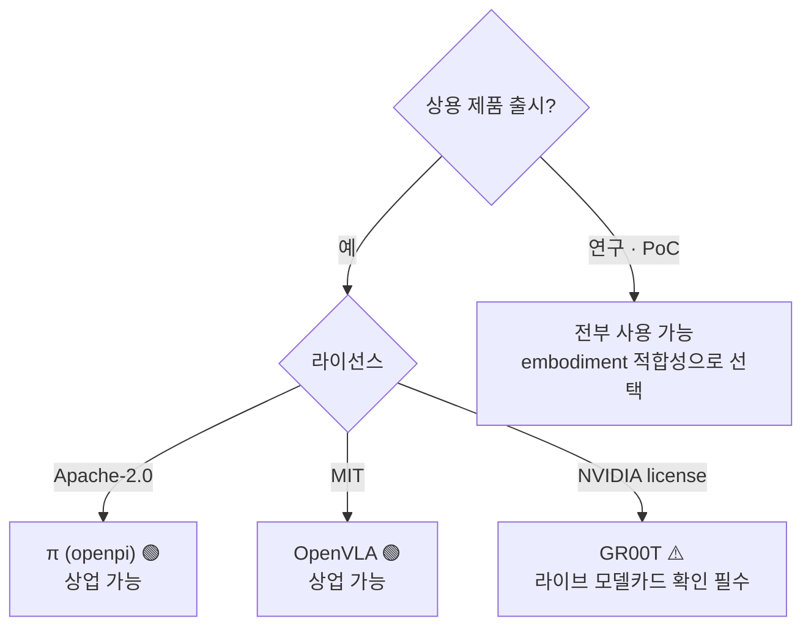
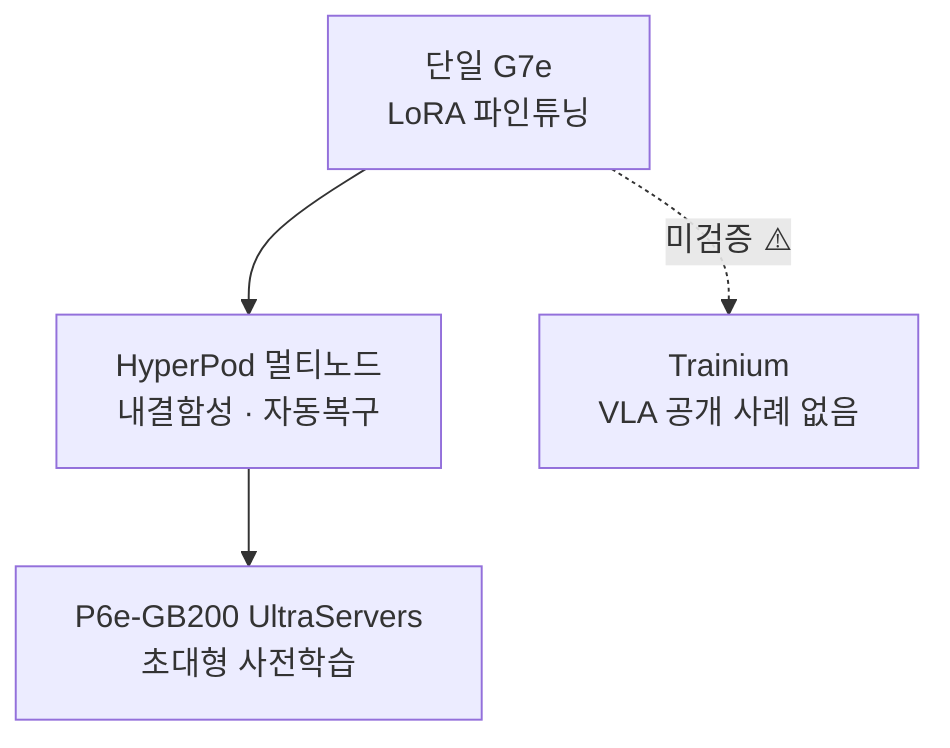

# Pillar 2 — 모델 학습 (Model Training · VLA)

_최종 갱신: 2026-07 · owner: Youngjin · volatility: 높음(모델 버전·라이선스·인스턴스가 자주 바뀜)_
_개별 항목은 별도 표기가 없는 한 페이지 메타데이터(owner/updated/volatility)를 상속. 항목별 owner 지정 시 항목 푸터 추가._
[← index로](index.md)

> **L0 TL;DR**: 대부분의 고객은 **VLA[^vla]를 밑바닥부터 학습하지 않는다 — 오픈 파운데이션 모델을 파인튜닝[^ft]**한다. 그래서 핵심 질문은 세 가지다: (1) 어느 모델을 쓸 것인가(**라이선스가 상용 여부를 좌우**), (2) LoRA[^lora]냐 풀 파인튜닝이냐(GPU 규모 결정), (3) AWS에서 어떻게 돌릴 것인가(HyperPod + EC2 GPU). Trainium으로 VLA를 학습한 공개 사례는 아직 없다.

---

## 이 필러에서 고객이 가장 자주 묻는 질문 Top 3

1. **"어느 VLA 모델로 시작하죠? 상업적으로 써도 되는 게 뭐예요?"** → [오픈 VLA 파운데이션 모델](#1-오픈-vla-파운데이션-모델--라이선스--ga) (⚠️ GR00T 라이선스 함정)
2. **"파인튜닝에 GPU 몇 장 필요하죠? LoRA면 한 장으로 되나요?"** → [VLA 파인튜닝 실전](#2-vla-파인튜닝-실전-lora-vs-full-ft--ga)
3. **"AWS에서 VLA 학습을 어떻게 돌리죠? HyperPod로? Trainium 써도 되나요?"** → [AWS 학습 스택](#3-aws-학습-스택-hyperpod--ec2-gpu--ga)

> **안정 원리 (잘 안 바뀜)**: (1) 프런티어 VLA를 사전학습하는 고객은 거의 없다 — **파인튜닝이 99%의 현실**. (2) VLA는 **System 2[^sys](느린 VLM[^vlm] 플래너, 5~10Hz) + System 1(빠른 액션 정책, 50~200Hz)** 구조로 수렴 중이며, 이 이중 구조가 "추론을 클라우드에 둘지 엣지에 둘지"를 결정한다(→ [pillar-4](pillar-4.md), [decisions](decisions.md)). (3) 연속 액션 생성은 **flow-matching[^flow] / diffusion action head + action chunking[^chunk]**이 표준.

---

## 1. 오픈 VLA 파운데이션 모델 & 라이선스  🟢 GA

**L0 TL;DR**: 파인튜닝의 출발점. 성능만큼 **라이선스가 중요** — 가장 화제인 NVIDIA GR00T가 버전에 따라 비상업일 수 있고, Physical Intelligence π(Apache-2.0)와 OpenVLA(MIT)는 **허용적 라이선스로 상업 친화적**이다.

**고객 니즈/문제**: "휴머노이드/매니퓰레이터용 VLA를 도입하고 싶다. 어떤 오픈 모델이 좋고, 우리 제품에 상업적으로 써도 되나?"

**솔루션 개요** `[1]`:

- **[NVIDIA Isaac GR00T](https://github.com/NVIDIA/Isaac-GR00T)** — 오픈 휴머노이드 파운데이션 모델. N1(2B), N1.5(3B, flow-matching DiT action head), N1.6(CES 2026, Cosmos Reason 2 백본), N1.7(GitHub상 GA 주장). ⚠️ **라이선스 주의**: N1.5 모델 카드는 **비상업(NVIDIA license, non-commercial)**. N1.6/N1.7이 상업 허용이라는 주장은 **2차 출처뿐이라 미검증** → 상용 판단 전 **라이브 모델 카드 직접 확인 필수**. `[1]` github.com/NVIDIA/Isaac-GR00T
- **[Physical Intelligence π (openpi)](https://github.com/Physical-Intelligence/openpi)** — π0, π0-FAST, π0.5 전부 **Apache-2.0**(상업 가능). DROID/ALOHA/LIBERO 파인튜닝 체크포인트 제공. `[1]` github.com/Physical-Intelligence/openpi. ⚠️ π0.7은 2차 출처만 존재(미검증).
- **[OpenVLA](https://github.com/openvla/openvla)** — 7B, **MIT 라이선스**(상업 가능), Llama2 기반 VLM 백본. 공식 파인튜닝 스크립트 제공. `[1]` github.com/openvla/openvla (LICENSE 파일 2026-07 직접 확인)

**AWS 매핑**: 모델 가중치를 HF에서 S3로 미러링 → EC2 GPU(P6/G7e) 또는 SageMaker HyperPod에서 파인튜닝(아래 2·3번). [LeRobot](https://github.com/huggingface/lerobot)(`groot` policy type)으로 GR00T post-train/eval 가능.

**의사결정 기준**:

- **상용 제품 출시** → π(Apache-2.0) 또는 OpenVLA(MIT) 우선. GR00T는 라이선스 확정 후에만.
- **휴머노이드 전신 제어** → GR00T가 가장 완성형(SONIC controller, Cosmos Reason 백본), 단 라이선스 확인.
- **연구·PoC** → 전부 사용 가능, 성능/embodiment[^embodiment] 적합성으로 선택.

**고객 사례**: 사례 대기 (국내 공개 VLA 파인튜닝 사례 미확인).

**➡️ 다음 액션**: 고객이 모델 선정 중이면 **"라이선스 매트릭스(GR00T=확인필요 / π=Apache-2.0 / OpenVLA=MIT)를 첫 슬라이드로"** 제시. 상용이면 π0.5 또는 OpenVLA 파인튜닝 PoC를 EC2 G7e 위에서 제안.

**🔗 관련 자산**: [pillar-1 데이터셋 라이선스](pillar-1.md) · [pillar-4 엣지 배포](pillar-4.md)

🔄 휘발성 데이터 (모델 버전·라이선스 — 갱신 대상, 2026-07 확인)

| 모델 | 파라미터 | 라이선스 | 상용 | 백본 / 액션헤드 | 비고 |
|---|---|---|---|---|---|
| GR00T N1 | 2B | NVIDIA (비상업) | ❌ | SigLip2+T5 / flow-matching DiT | |
| GR00T N1.5 | 3B | NVIDIA (비상업) | ❌ | / flow-matching DiT | 모델카드 명시 |
| GR00T N1.6 | ~3B | 상업 주장 [4] | ⚠️미검증 | Cosmos Reason 2 | CES 2026 |
| GR00T N1.7 | 3B | NVIDIA Open Model | ⚠️미검증 | Cosmos-Reason2-2B / diffusion | GitHub GA 주장, 40 timestep horizon |
| π0 / π0-FAST / π0.5 | 미공개 | **Apache-2.0** | ✅ | flow-matching (π0-FAST=autoregressive) | |
| OpenVLA | 7B | **MIT** | ✅ | Llama2 VLM | 라이선스 2026-07 직접 확인 |

⚠️ **N1.5 vs N1.6 vs N1.7 버전-라이선스 매핑이 출처 간 불일치.** 상용 클레임 전 라이브 HF/GitHub 모델 카드 직접 확인. 이 항목이 필러 2에서 가장 인용 위험이 큼.

---

## 2. VLA 파인튜닝 실전 (LoRA vs Full-FT)  🟢 GA

**L0 TL;DR**: 좋은 소식 — **LoRA 파인튜닝은 GPU 한 장(24GB급)으로 가능**하고, 태스크당 100~500 데모면 단일 태스크 80%+ 성공률이 나온다. 풀 파인튜닝은 70~100GB(H100/A100급)가 필요하다.

**고객 니즈/문제**: "우리 태스크에 맞게 VLA를 조정하고 싶은데, GPU를 얼마나 확보해야 하고 데이터는 얼마나 필요한가?"

**솔루션 개요** `[1]`:

- **OpenVLA**: LoRA(rank 32) ~24GB 단일 GPU(A100/RTX 4090). 48GB→batch 12, 80GB→batch 24. 풀 파인튜닝 ~100GB. 공식 `vla-scripts/finetune.py`.
- **openpi (π0/π0.5)**: 추론 >8GB, LoRA >22.5GB(RTX 4090), **풀 파인튜닝 >70GB(A100/H100)**. 공식 LoRA/full 레시피, 2025-09 PyTorch 지원 추가. 데이터 1~20시간이면 다수 태스크 충분.
- **GR00T (N1.5/N1.7)**: 파인튜닝 40GB+ GPU(H100/L40 권장), 추론 16GB+. NVIDIA 공식 post-training 레시피.
- **데이터량 감(感)**: LoRA 단일 태스크 100~500 데모 → 80%+ 성공. 소량·고품질 실데모가 핵심(→ [pillar-1 텔레옵](pillar-1.md)).

**AWS 매핑**: LoRA면 **EC2 G6e(L40S)·G7e(RTX PRO 6000)** 단일/소수 GPU로 충분. 풀 파인튜닝·멀티 embodiment면 **P6-B200 / HyperPod 멀티노드**(아래 3번).

**의사결정 기준**:

- 태스크 특화·데이터 소량 → **LoRA + 단일 G7e**. 가장 저렴·빠름. 대부분 여기서 시작.
- 다중 embodiment·대규모·백본까지 조정 → **풀 파인튜닝 + P6/HyperPod**.
- 데이터 <1시간 → 파인튜닝보다 few-shot/프롬프트 우선 검토.

**고객 사례**: 사례 대기 (공식 AWS VLA 파인튜닝 사례 없음 — 3번의 Unitree H1은 RL locomotion이지 VLA 아님).

**➡️ 다음 액션**: **"단일 G7e에서 LoRA 파인튜닝 1일 PoC"** 를 기본 엔트리 제안으로. 고객 데이터가 100 데모 이상이면 바로 실측 성공률을 보여줄 수 있다. GPU 확보가 막히면 → [decisions](decisions.md).

**🔗 관련 자산**: [pillar-1 데이터 파이프라인](pillar-1.md) · [decisions: Build vs Buy](decisions.md)

🔄 휘발성 데이터 (GPU 요구 — 2026-07 공식 레포 기준)

| 모델 | 추론 | LoRA 파인튜닝 | 풀 파인튜닝 |
|---|---|---|---|
| OpenVLA (7B) | — | ~24GB (단일) | ~100GB |
| π0 / π0.5 | >8GB | >22.5GB | >70GB (A100/H100) |
| GR00T N1.5/N1.7 | 16GB+ | 40GB+ (H100/L40) | — |

---

## 3. AWS 학습 스택 (HyperPod + EC2 GPU)  🟢 GA

**L0 TL;DR**: SageMaker HyperPod가 분산 학습의 내결함성·자동복구·엘라스틱 스케일링을 처리하고, EC2는 **G7e(단일~소수) → P6-B200/P6e-GB200(대규모)** 로 이어진다. 단, **VLA 전용 HyperPod 레시피는 없다**(LLM 레시피만) — VLA 학습은 클러스터 위에서 DIY.

**고객 니즈/문제**: "파인튜닝/학습을 안정적으로 돌릴 인프라가 필요하다. 노드 죽으면 처음부터 다시 하나?"

**솔루션 개요** `[1]`:

- **[SageMaker HyperPod](https://aws.amazon.com/sagemaker/hyperpod/)** — Slurm + **EKS** + Training Jobs 지원. **Checkpointless training**(장애 시 수분 내 자동복구, 수동개입 없음), **Elastic training**(가용량·우선순위 따라 자동 스케일, 자동 체크포인트/재개). **2026-04 G7e + r5d.16xlarge 지원 추가**. HyperPod CLI/SDK 제공.
- **EC2 GPU 사다리** `[1]`: **G7**(RTX PRO 4500, 2026-06 GA) · **G7e**(RTX PRO 6000 Blackwell, 2026-01 GA) · **G6e**(L40S) → **P6-B200**(8×B200, 1440GB HBM) · **[P6e-GB200 UltraServers](https://aws.amazon.com/ec2/ultraservers/)**(GB200 NVL72, 최대 72 Blackwell/NVLink 도메인, [Capacity Blocks](https://aws.amazon.com/ec2/capacityblocks/)로 확보).
- **Trainium**: Trn2 GA(2024-12), **Trn3 UltraServers GA(2025-12 re:Invent)**, Trn4 발표. ⚠️ **VLA/로보틱스를 Trainium으로 학습한 공개 사례 없음** — 전체 VLA 툴체인이 CUDA/NVIDIA. Trainium-for-VLA는 미검증.

**AWS 매핑**: 위 서비스 자체가 매핑. GPU 확보 전략(On-Demand vs Capacity Blocks vs Flexible Training Plans)은 → [decisions](decisions.md).

**의사결정 기준**:

- 단일/소수 GPU LoRA → HyperPod 없이 EC2 G7e 직접.
- 멀티노드·장시간·내결함성 필요 → **HyperPod(EKS)** + checkpointless.
- 초대형 사전학습 → P6e-GB200 UltraServers + Capacity Blocks.
- Trainium 제안 → **현재는 LLM 대상에 안전, VLA는 미검증**이라 명시하고 리스크 공유.

**고객 사례** `[1]`:

- **Unitree H1 휴머노이드 RL을 Isaac Lab + SageMaker(HyperPod)에서 학습** — AWS 공식 블로그(2026-06-09). 19관절 velocity tracking, PPO(skrl), HyperPod 헬스모니터링·자동교체·체크포인트 재개 시연. ⚠️ **RL locomotion이지 VLA 파인튜닝 아님** — 참조 아키텍처로만 인용.
- **Zoox** — HyperPod로 멀티모달 AV 파운데이션 모델, 64+ GPU 95% 활용률. ⚠️ AV.

**➡️ 다음 액션**: **AWS 공식 "Isaac Lab on SageMaker" 블로그를 그대로 워크숍 자산으로 활용**(재현 가능한 유일한 AWS 로보틱스 학습 레퍼런스). GPU 가용성 이슈면 Capacity Blocks/Flexible Training Plans로 연결.

**🔗 관련 자산**:

- 플레이북: [pillar-3 시뮬레이션(Isaac Lab)](pillar-3.md) · [decisions: GPU 확보](decisions.md)
- [Physical AI E2E 워크숍](https://hi-space.gitbook.io/physical-ai-on-aws/guide/e2e-workshop) — 한국어. GR00T VLA 파인튜닝 + SageMaker 트랙
- [Physical AI Scaffolding Kit](https://github.com/aws-samples/sample-physical-ai-scaffolding-kit) — aws-samples. HyperPod Slurm 클러스터 + π0·GR00T·Isaac Lab Newton RL 학습 샘플, 다국어 README(ko·ja·en). AWS Japan Physical AI 개발 지원 프로그램 공식 자산
- [Embodied AI Platform](https://github.com/aws-samples/sample-embodied-ai-platform) — aws-samples. GR00T VLA 텔레옵·모방학습 파인튜닝 on AWS Batch + DCV 워크스테이션 → SO-ARM100/101 실기 추론. ⚠️ 현재 GR00T 학습 컴포넌트 1개만 Available, 나머지 로드맵

---

## 4. System 2 + System 1 아키텍처  🟢 GA (안정 원리)

**L0 TL;DR**: 2026년 지배적 VLA 구조. **느린 VLM(System 2, 5~10Hz)이 "무엇을 할지"를 계획**하고, **빠른 액션 정책(System 1, 50~200Hz)이 "어떻게 움직일지"를 실행**한다. 이 분리가 **추론 배포 위치(클라우드 vs 엣지)를 결정**하므로 SA가 반드시 이해할 개념.

**고객 니즈/문제**: "실시간 제어인데 큰 모델을 어떻게 돌리나? 클라우드 지연이 문제 아닌가?"

**솔루션 개요** `[1]/[4]`:

- **[Figure Helix](https://www.figure.ai/news/helix)**: System 2 = 온보드 인터넷 사전학습 VLM @ 7~9Hz(장면/언어), System 1 = 반응형 visuomotor @ 200Hz. `[1]` figure.ai/news/helix
- **GR00T N1**: System 1 = diffusion policy ~10ms 지연, System 2 = LLM 플래너(태스크 분해).
- **일반 패턴**: 무거운 VLM이 5~10Hz로 재계획, 경량 flow-matching/diffusion "action expert"가 최신 계획 조건으로 50~200Hz 액션 방출. **action chunking**(GR00T=40 timestep horizon)으로 미래 액션 청크 예측.
- ⚠️ **성숙도 정직**: 이 *패턴 자체*는 표준이지만, 전신 휴머노이드 풀스택은 대부분 파일럿/데모 단계.

**AWS 매핑**: **System 2(플래너)는 클라우드/Bedrock AgentCore에, System 1(실시간 제어)은 엣지(Jetson)에** 두는 것이 자연스러운 분할(→ [pillar-5](pillar-5.md), [pillar-4](pillar-4.md), [decisions](decisions.md)).

**의사결정 기준**: 30~100Hz 실시간 제어 요구 → System 1은 **반드시 엣지 온보드**. System 2(계획·추론)는 지연 허용되면 클라우드 가능. 이 경계가 [decisions의 Cloud vs Edge 트리](decisions.md)의 핵심.

**고객 사례**: Figure(데모/PR), GR00T(오픈 모델). 검증된 프로덕션은 제한적.

**➡️ 다음 액션**: 고객이 "실시간인데 클라우드로 되나?"라고 물으면 **System1/System2 그림을 그려주고 "제어 루프는 엣지, 계획은 클라우드"로 정리**. 이것만으로 아키텍처 대화가 정돈된다.

**🔗 관련 자산**: [pillar-4 엣지 추론](pillar-4.md) · [pillar-5 오케스트레이션](pillar-5.md) · [decisions](decisions.md)

---

## 5. (경쟁 스택) Google Gemini Robotics  🟡 Preview

**L0 TL;DR**: 구글의 로봇 VLA 패밀리. **Gemini Robotics-ER 1.6은 프리뷰(Gemini API/AI Studio)** 로 공개된 embodied reasoning(고수준 추론·툴콜) 레이어이고, 저수준 모터 제어 VLA는 파트너 한정. 경쟁 스택이지만 고객이 자주 물으므로 정직하게 다룬다.

**고객 니즈/문제**: "Gemini Robotics 쓰면 되는 거 아닌가요? AWS랑 어떻게 관계되죠?"

**솔루션 개요** `[1]`:

- **Gemini Robotics-ER 1.6** (2026-04 **Preview**, model id: `gemini-robotics-er-1.6-preview`, AI Studio + Gemini API) — 에이전틱 embodied reasoning: 태스크 분해, 툴콜(Search 포함), VLA 호출, 아날로그 게이지 판독. **추론/VLM 레이어이지 저수준 제어 아님**. Google 공식 문서가 "currently in preview" 명시 `[1]`.
- **Gemini Robotics On-Device** (2025-06) — 로컬 배포 가능한 첫 VLA, 파인튜닝 지원(50~100 데모). **waitlist/trusted-tester(Preview)**.
- **Gemini Robotics 1.5 VLA** — 파트너 한정.

**AWS 매핑 (경쟁 스택 → AWS 보완)**: Gemini Robotics-ER는 **플래너(System 2) 역할** — 고객이 이를 쓰더라도 **로봇 플릿 오케스트레이션·툴 게이트웨이·정책 가드레일은 Bedrock AgentCore로 감쌀 수 있다**(→ [pillar-5](pillar-5.md)). 저수준 제어 VLA는 오픈 모델(π/OpenVLA/GR00T)을 AWS에서 파인튜닝하는 대안 제시.

**의사결정 기준**:

- 빠른 고수준 추론이 필요하고 구글 생태계·프리뷰 리스크 수용 가능 → ER 1.6 API 시도 가능(단 Preview — 프로덕션 약정 금지).
- 상용·온프렘·데이터 주권·저수준 제어 커스터마이즈 → **오픈 VLA를 AWS에서 파인튜닝**이 더 유연.

**고객 사례**: 파트너 배포(비공개 다수).

**➡️ 다음 액션**: 고객이 Gemini Robotics를 검토 중이면 **"추론 레이어는 그걸 쓰더라도, 오케스트레이션·가드레일·저수준 제어 모델은 AWS에서 소유"** 하는 하이브리드를 제안(경쟁이 아니라 보완 각도).

**🔗 관련 자산**: [pillar-5 AgentCore](pillar-5.md)

---

## 이 필러의 정직한 현실 (SA 필독)

- **GR00T 라이선스는 지금 인용 최대 위험.** N1.5는 명백히 비상업. N1.6/N1.7 상업 허용은 2차 출처뿐 → **고객 상용 판단 전 라이브 모델 카드 직접 확인**. 틀리면 법무 리스크.
- **"PI(Physical Intelligence)가 AWS 쓴다" 는 말 금지.** openpi 체크포인트가 GCS(`gs://`)에 있어 **GCP 신호**. AWS-PI 사례 없음.
- **공식 AWS VLA 파인튜닝 사례는 없다.** 유일한 AWS 로보틱스 학습 레퍼런스는 **Unitree H1 RL locomotion**(VLA 아님). VLA 스토리를 과장하지 말 것.
- **Trainium-for-VLA는 미검증.** 전체 VLA 툴체인이 CUDA. 제안 시 리스크 명시.

---
_owner: Youngjin · updated: 2026-07 · volatility: 높음 (모델 버전·라이선스·GPU 요구·인스턴스는 접힌 블록에서 관리) · sources: [1] 공식/논문, [3] 벤더, [4] 미검증_

<!-- 용어 각주 -->

[^vla]: **VLA (Vision-Language-Action)** — 카메라 영상(Vision)과 자연어 지시(Language)를 입력받아 로봇의 동작(Action)을 직접 출력하는 파운데이션 모델. "컵을 집어"라고 말하면 관절 움직임을 생성하는 식. 🎥 [NVIDIA Isaac GR00T N1 소개](https://www.youtube.com/watch?v=m1CH-mgpdYg)
[^ft]: **파인튜닝(fine-tuning)** — 대규모 데이터로 사전학습된 모델을 자기 태스크·로봇의 소량 데이터로 추가 학습시키는 것. 밑바닥부터 학습하는 것보다 데이터·GPU가 수십~수백 배 절약된다.
[^lora]: **LoRA (Low-Rank Adaptation)** — 원본 가중치는 얼려두고 작은 저랭크(low-rank) 행렬만 추가로 학습하는 경량 파인튜닝 기법. GPU 메모리 요구가 풀 파인튜닝의 수분의 1이라 24GB급 GPU 한 장으로도 가능하다.
[^sys]: **System 2 / System 1** — 인지과학의 "느린 사고 / 빠른 반응" 구분을 로봇 아키텍처에 적용한 구조. System 2는 느린 대형 모델이 계획을(5~10Hz), System 1은 작은 정책이 실시간 제어를(50~200Hz) 맡는다. 추론을 클라우드에 둘지 엣지에 둘지를 가르는 기준이 된다.
[^flow]: **flow-matching / diffusion action head** — 로봇의 연속 동작을 노이즈에서 점진적으로 다듬어 생성하는 확산(diffusion)·플로우 계열의 출력 모듈. 부드럽고 여러 가지 가능한(multi-modal) 동작 분포를 표현할 수 있어 최신 VLA의 표준 액션 헤드다.
[^chunk]: **action chunking** — 매 스텝 동작 1개가 아니라 앞으로의 동작 여러 스텝(청크)을 한 번에 예측하는 기법. 추론 횟수를 줄여 실시간 제어 주파수를 맞추기 쉽게 한다.
[^vlm]: **VLM (Vision-Language Model)** — 이미지와 텍스트를 함께 이해하는 모델(예: 사진을 보고 질문에 답함). VLA는 보통 VLM을 "눈+두뇌" 백본으로 쓰고 그 위에 액션 헤드를 얹는다.
[^embodiment]: **embodiment(임바디먼트)** — 로봇의 물리적 형태·자유도·센서 구성. 같은 모델이라도 로봇 팔과 휴머노이드는 embodiment가 달라 데이터·정책을 그대로 이식할 수 없다.
