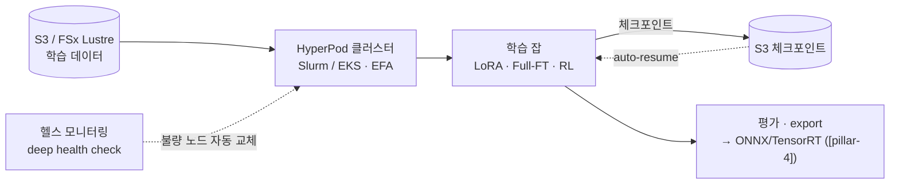
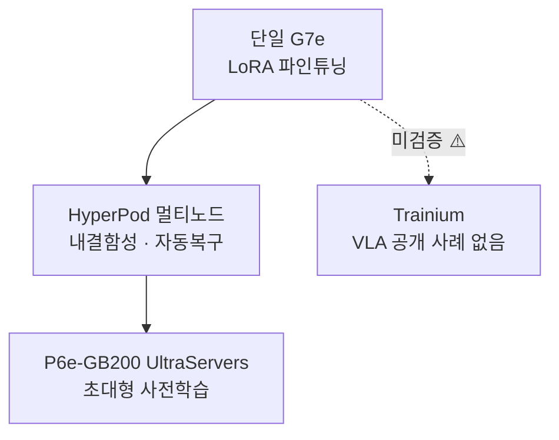

# Pillar 2 — 모델 학습 (Model Training · VLA)

_최종 갱신: 2026-09 · owner: Youngjin · volatility: 높음(모델 버전·라이선스·인스턴스가 자주 바뀜)_
_개별 항목은 별도 표기가 없는 한 페이지 메타데이터(owner/updated/volatility)를 상속. 항목별 owner 지정 시 항목 푸터 추가._
[← index로](index.md)

> **L0 TL;DR**: 모델 적응이 필요한지 [기존 방식·구매·SI](decisions.md)와 먼저 비교한다. 학습을 선택하면 모델·데이터 사용 권리, 관측/행동 호환성, 실측 자원 요구와 독립 평가를 설계한다.

---

> **검토 범위**: 페이지 수정일은 모든 기술 항목의 재검증일이 아니다. 핵심 정정의 확인일·재현/사람 검토 상태는 [근거 기록](evidence.md)에 있으며, 기존 항목의 개별 확인일은 그대로 적용한다.

## 이 필러에서 고객이 가장 자주 묻는 질문 Top 3

> 질문은 탐색용 예시다. 실제 문의 빈도 순위로 검증되지 않았다.

1. **"어느 VLA 모델로 시작하죠? 상업적으로 써도 되는 게 뭐예요?"** → [오픈 VLA 파운데이션 모델](#1-오픈-vla-파운데이션-모델--라이선스--ga) (⚠️ GR00T 라이선스 함정)
2. **"파인튜닝에 GPU 몇 장 필요하죠? LoRA면 한 장으로 되나요?"** → [VLA 파인튜닝 실전](#2-vla-파인튜닝-실전-lora-vs-full-ft--ga)
3. **"AWS에서 VLA 학습을 어떻게 돌리죠? HyperPod로? Trainium 써도 되나요?"** → [AWS 학습 스택](#3-aws-학습-스택-hyperpod--ec2-gpu--ga)

> **L0/L1**: 모델 선택·학습 범위·배포 위치는 각각 검증한다. System 1/2[^sys]는 클라우드 배치 규칙이 아니며, action chunking[^chunk]은 피드백 주파수를 자동으로 높이지 않는다.

---

## 1. 오픈 VLA 모델 선택 & 라이선스 — 모델별 확인 { #1-오픈-vla-파운데이션-모델--라이선스--ga }

**L0 TL;DR**: 모델 선택은 성능·로봇 적합성·사용 권리를 함께 본다. **코드, 사전학습 가중치, 기반 모델, 데이터셋의 라이선스를 분리**하고 특정 버전의 공식 모델 카드에서 확인한다. 공개 가중치가 고객 현장 검증을 뜻하지 않는다.

**고객 니즈/문제**: "우리 로봇·태스크에 맞는 모델을 상용 또는 연구 목적으로 사용할 수 있나?"

| 후보 | 확인할 1차 출처 | 판단 범위 |
|---|---|---|
| [NVIDIA Isaac GR00T](https://github.com/NVIDIA/Isaac-GR00T) | 선택한 버전의 모델 카드·가중치 약관·코드 LICENSE | 모델 세대 전체를 동일 라이선스로 묶지 않음 |
| [Physical Intelligence openpi](https://github.com/Physical-Intelligence/openpi) | 코드 LICENSE·체크포인트·기반 모델 접근/사용 조건 | 코드의 Apache-2.0 표기만으로 모든 가중치·데이터 권리를 판단하지 않음 |
| [OpenVLA](https://github.com/openvla/openvla#pretrained-vlas) | README의 Model Licensing & Commercial Use | **코드 MIT / Llama-2 파생 가중치 Llama Community License** `[1]` |

**OpenVLA 정정**: 기존 ‘MIT이므로 상업 가능’ 표기를 철회한다. 공식 README는 코드와 사전학습 가중치 조건을 구분한다. [주장별 확인일·출처](evidence.md#openvla-license).

**AWS 매핑**: 사용 권리를 확인한 가중치·데이터를 S3에 저장하고, 우선 단일 GPU 메모리·처리량을 측정한다. EC2·Batch·SageMaker 중 필요한 실행 환경을 고르며, 공개 샘플을 AWS의 운영 보증으로 해석하지 않는다.

**의사결정 기준**: 상용·사내 PoC·연구 목적 각각에 적용되는 약관을 확인한다. PoC라는 이름만으로 비상업 조건을 충족한다고 가정하지 않는다. 로봇 관측·행동 정의와 체크포인트의 적합성을 검사한다.

**고객 사례**: 이 표는 라이선스 검토 경로이며 고객 배포 증거가 아니다.

**➡️ 다음 액션**: 후보별 코드/가중치/기반 모델/데이터, 버전, 허용 목적, 근거 URL·확인일, 검토자를 기록하고 [파인튜닝 실행 경로](execution.md#finetuning)로 진행한다.

**🔗 관련 자산**: [pillar-1 데이터셋 라이선스](pillar-1.md) · [pillar-4 엣지 배포](pillar-4.md) · [로봇 파운데이션 모델 페이퍼 리뷰](https://hi-space.gitbook.io/physical-ai-on-aws/paper-review-tbd/robot-foundation-model) — 한국어. 추론 VLM(Cosmos-Reason 1)·VLA(RT-2, OpenVLA, Gemini Robotics, GR00T N1, π0.6) 논문 정리

---

## 2. VLA 파인튜닝 — 자원 산정과 평가 { #2-vla-파인튜닝-실전-lora-vs-full-ft--ga }

**L0 TL;DR**: 일부 모델·설정은 단일 GPU로 파인튜닝할 수 있지만, **GPU 메모리·데모 수만으로 성공률이나 기간을 보장할 수 없다**. 작은 호환성 실험 후 고객 데이터로 학습·평가 비용을 측정한다.

**고객 니즈/문제**: "필요한 데이터와 GPU, 완료 기준을 어떻게 산정하나?"

**솔루션 개요** `[1]`: [OpenVLA LoRA 레시피](https://github.com/openvla/openvla#fine-tuning-openvla-via-lora)와 [openpi](https://github.com/Physical-Intelligence/openpi)의 선택 버전을 확인한다. 메모리 사용량은 모델, 정밀도, 이미지 수/해상도, 시퀀스 길이, 배치, 학습할 모듈에 따라 실측한다. 액션 헤드·어댑터·VLM 중 무엇을 학습할지는 로봇과 태스크 변경을 기준으로 실험한다.

| 단계 | 필요한 증거 | 비용·확대 판단 |
|---|---|---|
| 데이터·모델 호환성 | 관측/행동 형식, 단위, 정상 데이터 로딩과 추론 | 작은 데이터로 먼저 확인 |
| 기준 모델 평가 | 학습 전 성공 분자/분모, 작업 시간, 사람 개입 | 파인튜닝 필요성을 판단 |
| 제한 학습 | 고정 데이터/설정, 학습 시간, 최대 메모리, 체크포인트 | 단일 GPU에 들어가면 작은 환경 유지 |
| 독립 평가 | 학습과 분리한 작업/환경, 반복 실행, 성능 편차·지연 | 목표 미달이면 데이터·가설 재검토 |

**정정**: ‘100~500 데모면 80%+’, ‘100 데모면 1일 PoC’, ‘새 로봇은 어댑터만으로 해결’ 같은 일반화를 사용하지 않는다. 이전 비용·0% 성공 실측은 재현 로그와 조건을 제공하지 못하므로 고객 약속의 근거에서 제외한다. [근거 기록](evidence.md#finetuning-outcomes).

**AWS 매핑·선택**: 단일 GPU 실험은 EC2/Batch부터 검토하고, 긴 관리형 잡은 SageMaker Training, 검증된 멀티노드 필요가 생기면 HyperPod를 검토한다. 데모 개수만으로 서비스를 결정하지 않는다.

**고객 사례**: 공개 샘플의 실행 결과와 고객 현장 성과를 구분한다.

**➡️ 다음 액션**: [실행 경로 C](execution.md#finetuning)의 준비·dry-run·평가·중단 조건을 따라 고객별 시간·비용 범위를 만든다.

**🔗 관련 자산**: [pillar-1 데이터 파이프라인](pillar-1.md) · [decisions: Build vs Buy](decisions.md)

---

## 3. AWS 학습 스택 (HyperPod + EC2 GPU)  🟢 GA

**L0 TL;DR**: SageMaker HyperPod가 분산 학습의 내결함성·자동복구·엘라스틱 스케일링을 처리하고, EC2는 **G7e(단일~소수) → P6-B200/P6e-GB200(대규모)** 로 이어진다. 단, **VLA 전용 HyperPod 레시피는 없다**(LLM 레시피만) — VLA 학습은 클러스터 위에서 DIY.

**고객 니즈/문제**: "파인튜닝/학습을 안정적으로 돌릴 인프라가 필요하다. 노드 죽으면 처음부터 다시 하나?"

**솔루션 개요** `[1]`:

- **[SageMaker HyperPod](https://aws.amazon.com/sagemaker/hyperpod/)** — Slurm + **EKS** + Training Jobs 지원. **Checkpointless training**(장애 시 수분 내 자동복구, 수동개입 없음), **Elastic training**(가용량·우선순위 따라 자동 스케일, 자동 체크포인트/재개). **2026-04 G7e + r5d.16xlarge 지원 추가**. HyperPod CLI/SDK 제공.
- **EC2 GPU 사다리** `[1]`: **G7**(RTX PRO 4500, 2026-06 GA) · **G7e**(RTX PRO 6000 Blackwell, 2026-01 GA) · **G6e**(L40S) → **P6-B200**(8×B200, 1440GB HBM) · **[P6e-GB200 UltraServers](https://aws.amazon.com/ec2/ultraservers/)**(GB200 NVL72, 최대 72 Blackwell/NVLink 도메인, [Capacity Blocks](https://aws.amazon.com/ec2/capacityblocks/)로 확보).
- **Trainium**: Trn2 GA(2024-12), **Trn3 UltraServers GA(2025-12 re:Invent)**, Trn4 발표. ⚠️ **VLA/로보틱스를 Trainium으로 학습한 공개 사례 없음** — 전체 VLA 툴체인이 CUDA/NVIDIA. Trainium-for-VLA는 미검증.
- **서울 리전 최신 세대** `[1]`: **[P6-B300](https://aws.amazon.com/about-aws/whats-new/2026/08/amazon-ec2-p6-b300/)**(8×NVIDIA Blackwell Ultra, 인스턴스당 2.1TB HBM3e·6.4Tbps EFA)이 **2026-08-20 서울 리전 GA** — 한국 팀이 최신 accelerator를 해외 리전 대기 없이 데이터 레지던시 안에서 쓴다. Capacity Blocks/Savings Plans/On-Demand 소비. 범위는 정직하게: 범용 FM 학습 플랫폼이고 Physical AI(시뮬·VLA 학습)는 그 위의 한 워크로드다.
- **학습 규모 판단**: 모델·정밀도·입력 크기·최대 메모리·실측 시간·통신량을 기준으로 단일 GPU, 단일 노드 다중 GPU, 멀티노드를 선택한다. 데모 개수만으로 Batch/Training/HyperPod를 배정하지 않는다. [실행 경로 C](execution.md#finetuning)의 범위를 먼저 확인한다.

**HyperPod가 실제로 해주는 것** `[1]` (docs 2026-07 확인):

| 구성요소 | 기술 요약 | VLA 학습 관점 |
|---|---|---|
| **오케스트레이션** | **Slurm[^slurm]·EKS·Training Jobs** 3가지 모드 — HPC팀(Slurm)과 쿠버네티스팀(EKS)의 기존 워크플로우를 그대로 수용 | Isaac Lab RL(Slurm 관례)과 VLA 파인튜닝(EKS)을 같은 클러스터에서 |
| **내결함성 스택** | 헬스 모니터링 에이전트 + deep health check가 GPU·네트워크를 상시 감시 → **불량 노드 자동 교체 + 마지막 체크포인트 auto-resume**(개입 0). Checkpointless training은 체크포인트 없이도 수분 내 복구 | 수 주짜리 학습의 "노드 죽으면 처음부터?"에 대한 직접적인 답 |
| **Task Governance** | 팀·프로젝트별 쿼터를 **GPU 단위까지 세분 할당**, 우선순위 스케줄링, 저순위 잡 선점(체크포인트 저장 후 일시정지→재개), 유휴 컴퓨트 팀 간 대여 | 로봇팀·모델팀이 한 클러스터를 나눠 쓸 때 GPU 유휴율 관리 |
| **Elastic training** | 가용량·우선순위에 따라 잡 규모 자동 확대/축소, 자동 체크포인트·재개 | Capacity Blocks 확보분이 시간대별로 변할 때 자동 흡수 |
| **네트워크·스토리지** | **EFA[^efa]** 저지연 노드 간 통신 + FSx for Lustre 학습 채널(→ [pillar-1](pillar-1.md) 파이프라인) | 멀티노드 그래디언트 동기화 병목 제거 |
| **레시피** | LLM/FM용 사전 검증 학습 레시피 제공 — ⚠️ **VLA 전용 레시피는 없음**, 클러스터 위에서 DIY | 이 갭이 곧 SA의 통합 검증 과제(파인튜닝 레시피 자산화 기회) |

**AWS 매핑**: 위 서비스 자체가 매핑. GPU 확보 전략(On-Demand vs Capacity Blocks vs Flexible Training Plans)은 → [decisions](decisions.md).

```mermaid
graph LR
    D[("S3 / FSx Lustre<br>학습 데이터")] --> C["HyperPod 클러스터<br>Slurm / EKS · EFA"]
    C --> J["학습 잡<br>LoRA · Full-FT · RL"]
    HM["헬스 모니터링<br>deep health check"] -. 불량 노드 자동 교체 .-> C
    J -- 체크포인트 --> CK[(S3 체크포인트)]
    CK -. auto-resume .-> J
    J --> E["평가 · export<br>→ ONNX/TensorRT ([pillar-4])"]
```

**의사결정 기준**:

- 단일/소수 GPU LoRA → HyperPod 없이 EC2 G7e 직접.
- 멀티노드·장시간·내결함성 필요 → **HyperPod(EKS)** + checkpointless.
- 초대형 사전학습 → P6e-GB200 UltraServers + Capacity Blocks.
- Trainium 제안 → **현재는 LLM 대상에 안전, VLA는 미검증**이라 명시하고 리스크 공유.

```mermaid
graph TD
    A["단일 G7e<br>LoRA 파인튜닝"] --> B["HyperPod 멀티노드<br>내결함성 · 자동복구"]
    B --> C["P6e-GB200 UltraServers<br>초대형 사전학습"]
    A -. 미검증 ⚠️ .-> T["Trainium<br>VLA 공개 사례 없음"]
```

**고객 사례** `[1]`:

- **Unitree H1 휴머노이드 RL을 Isaac Lab + SageMaker(HyperPod)에서 학습** — AWS 공식 블로그(2026-06-09). 19관절 velocity tracking, PPO(skrl), HyperPod 헬스모니터링·자동교체·체크포인트 재개 시연. ⚠️ **RL locomotion이지 VLA 파인튜닝 아님** — 참조 아키텍처로만 인용.
- **Zoox** — HyperPod로 멀티모달 AV 파운데이션 모델, 64+ GPU 95% 활용률. ⚠️ AV.

**➡️ 다음 액션**: **AWS 공식 "Isaac Lab on SageMaker" 블로그를 그대로 워크숍 자산으로 활용**(재현 가능한 유일한 AWS 로보틱스 학습 레퍼런스). GPU 가용성 이슈면 Capacity Blocks/Flexible Training Plans로 연결.

**🔗 관련 자산**:

- 플레이북: [pillar-3 시뮬레이션(Isaac Lab)](pillar-3.md) · [decisions: GPU 확보](decisions.md)
- [Physical AI E2E 워크숍](https://hi-space.gitbook.io/physical-ai-on-aws/guide/e2e-workshop) — 한국어. GR00T VLA 파인튜닝 + SageMaker 트랙
- [AWS Physical AI Recipes](https://github.com/hi-space/aws-physical-ai-recipes) — 한국어, MIT. 위 E2E 워크숍의 코드까지 담은 실전 레시피 모음: Isaac Lab→GR00T 파인튜닝→추론→모니터링 E2E(CDK), SageMaker HyperPod VLA/RL 분산 학습 인프라(Slurm·FSx·MLflow), GR00T-N1.6-3B SageMaker 파인튜닝 파이프라인, NVIDIA OSMO[^osmo] on EKS 워크플로 오케스트레이션
- [Physical AI 101 — 처음 시작하는 사람을 위한 개념 지도](https://d2gup9k4vdzl3b.cloudfront.net/pai101/index.html) — 입문자용 단일 페이지: 큰 그림→연구 지형→VLA 파인튜닝→모델 내부→로봇 기초 개념→AWS의 역할, AWS PAI 참조 아키텍처·용어집 포함. 페이지 내 한국어/영어 전환, 말미에 이 플레이북을 다음 단계로 안내
- [Physical AI Scaffolding Kit](https://github.com/aws-samples/sample-physical-ai-scaffolding-kit) — aws-samples. HyperPod Slurm 클러스터 + π0·GR00T·Isaac Lab Newton RL 학습 샘플, 다국어 README(ko·ja·en). AWS Japan Physical AI 개발 지원 프로그램 공식 자산
- [Embodied AI Platform](https://github.com/aws-samples/sample-embodied-ai-platform) — aws-samples. GR00T VLA 텔레옵·모방학습 파인튜닝 on AWS Batch + DCV 워크스테이션 → SO-ARM100/101 실기 추론. ⚠️ 현재 GR00T 학습 컴포넌트 1개만 Available, 나머지 로드맵

---

## 4. System 2 + System 1 — 모델 구조와 배치 { #4-system-2--system-1-아키텍처--ga-안정-원리 }

**L0 TL;DR**: System 1/2는 모델의 서로 다른 처리 속도를 설명하는 용어다. **클라우드·엣지 배치를 자동으로 정하지 않는다.** 업무 계획과 관측 기반 제어의 기한·통신 단절 요구를 별도로 설계한다.

**솔루션 개요** `[1]`: [Figure Helix](https://www.figure.ai/news/helix)는 온보드 S2(7~9Hz)와 온보드 S1(200Hz)을 설명한다. 두 모델은 잠재 표현으로 연결되며, 이것이 클라우드 AgentCore 툴 호출과 같은 인터페이스라고 가정하지 않는다.

**action chunking[^chunk]**: 한 추론에서 여러 미래 동작을 생성한다. **동작 실행 빈도·새 관측 빈도·추론 완료 빈도·재계획 빈도는 서로 다르다.** 추론 Hz에 chunk 크기를 곱한 값을 피드백 제어 주파수로 쓰지 않는다. [PI RTC](https://www.physicalintelligence.company/research/real_time_chunking)는 chunk 사이의 전환과 지연 처리를 별도로 다룬다. 모델별로 실행 horizon과 전환 방식을 검증한다([근거](evidence.md#action-chunking)).

**AWS 매핑·의사결정**: 지연과 데이터 처리 요건을 만족하는 업무 계획에는 AgentCore를 검토한다. 시간 제한이 엄격한 관측 기반 정책·제어는 현장에 두고 측정한다. [네 계층과 책임자](operations.md#layers) 및 [Cloud vs Edge](decisions.md)를 함께 사용한다.

**고객 사례**: Helix는 벤더 아키텍처 공개이며 AWS 클라우드 배포 사례가 아니다.

**➡️ 다음 액션**: 고객의 관측→동작 지연, 최악 지터, 통신 단절·취소 동작을 기록하고 배치 위치를 정한다.

**🔗 관련 자산**: [pillar-4 엣지 추론](pillar-4.md) · [pillar-5 오케스트레이션](pillar-5.md) · [decisions](decisions.md)

---

## 5. (경쟁 스택) Google Gemini Robotics  🟡 Preview

**L0 TL;DR**: 구글의 로봇 VLA 패밀리. **Gemini Robotics-ER 1.6은 프리뷰(Gemini API/AI Studio)** 로 공개된 embodied reasoning(고수준 추론·툴콜) 레이어이고, 저수준 모터 제어 VLA는 파트너 한정. 경쟁 스택이지만 고객이 자주 물으므로 정직하게 다룬다.

**고객 니즈/문제**: "Gemini Robotics 쓰면 되는 거 아닌가요? AWS랑 어떻게 관계되죠?"

**솔루션 개요** `[1]`:

- **Gemini Robotics-ER 1.6** (2026-04 **Preview**, model id: `gemini-robotics-er-1.6-preview`, AI Studio + Gemini API) — 에이전틱 embodied reasoning: 태스크 분해, 툴콜(Search 포함), VLA 호출, 아날로그 게이지 판독. **추론/VLM 레이어이지 저수준 제어 아님**. Google 공식 문서가 "currently in preview" 명시 `[1]`.
- **Gemini Robotics On-Device** (2025-06) — 로컬 배포 가능한 첫 VLA, 파인튜닝 지원(50~100 데모). **waitlist/trusted-tester(Preview)**.
- **Gemini Robotics 1.5 VLA** — 파트너 한정.

**AWS 매핑 (경쟁 스택 → AWS 보완)**: Gemini Robotics-ER는 **플래너(System 2) 역할** — 고객이 이를 쓰더라도 **로봇 플릿 오케스트레이션·툴 게이트웨이·정책 가드레일은 Bedrock AgentCore로 감쌀 수 있다**(→ [pillar-5](pillar-5.md)). 저수준 제어 VLA는 오픈 모델(π/OpenVLA/GR00T)을 AWS에서 파인튜닝하는 대안 제시.

**의사결정 기준**:

- 빠른 고수준 추론이 필요하고 구글 생태계·프리뷰 리스크 수용 가능 → ER 1.6 API 시도 가능(단 Preview — 프로덕션 약정 금지).
- 상용·온프렘·데이터 주권·저수준 제어 커스터마이즈 → **오픈 VLA를 AWS에서 파인튜닝**이 더 유연.

**고객 사례**: 파트너 배포(비공개 다수).

**➡️ 다음 액션**: 고객이 Gemini Robotics를 검토 중이면 **"추론 레이어는 그걸 쓰더라도, 오케스트레이션·가드레일·저수준 제어 모델은 AWS에서 소유"** 하는 하이브리드를 제안(경쟁이 아니라 보완 각도).

**🔗 관련 자산**: [pillar-5 AgentCore](pillar-5.md)

---

## 6. 학습 운영 원리 — 체크포인트·평가 { #6-학습-운영-원리--체크포인트-계보와-il의-천장--ga-안정-원리 }

**L0 TL;DR**: 고객 학습 프로젝트를 반복적으로 무너뜨리는 함정 둘. (1) **체크포인트는 나무다** — specialize는 단방향이라 generalist 체크포인트를 잃으면 되돌릴 수 없다. (2) **loss가 낮아도 성공률은 안 오른다** — 모방학습의 covariate shift[^covshift] 때문이며, 평가는 loss가 아니라 **rollout 성공률로만** 한다.

**고객 니즈/문제**: "파인튜닝을 거듭할수록 이전 능력이 사라진다" / "training loss는 계속 내려가는데 실제 성공률이 안 움직인다".

**솔루션 개요** `[1]/[2]`:

- **체크포인트 tree 관리**: 가중치는 generalist → embodiment 특화 → task 특화(데모 10~150개) → 실배포 보정 순으로 가지를 치며(spin-off) 자란다. **chain은 단방향** — 한 번 specialize된 가중치에서 generalist 역복원은 사실상 불가(catastrophic forgetting[^forget]). 어떤 가지가 특정 동작에 과적합해 무너지면 그 가지를 더 밀지 말고 **이전(더 general한) 체크포인트로 되돌아가 재분기**한다.
- **"고객 A의 가중치를 고객 B에 적용" 질문의 실제 답**: A의 specialist weight가 아니라 **그 위 generalist에서 B로 새로 파인튜닝**이다. LoRA로 분기해 뒀다면 어댑터만 떼어 generalist로 복귀할 수 있다 — 처음부터 LoRA 분기를 권하는 운영상 이유.
- **"open weights"의 함정**: 공개 체크포인트가 계보의 어느 단계인지 먼저 확인 — Stage 3 specialist 하나만 풀린 모델은 그 로봇·환경 밖에서 못 쓴다(역복원 불가). OpenVLA·GR00T·π0/π0.5가 generalist(foundation) 체크포인트를 공개하는 이유가 이것.
- **IL의 천장 = covariate shift**: BC는 "전문가가 있던 상태 → 전문가 행동" 쌍만 배우므로, 실행 중 작은 오차로 데모 분포 밖(OOD) 상태에 들어가면 회복 방법이 데이터에 없어 오차가 눈덩이처럼 누적된다 — 최악의 경우 시간 지평 T에 대해 T²로([Ross et al., DAgger, arXiv:1011.0686](https://arxiv.org/abs/1011.0686)). **training loss도 validation loss도 이 문제를 못 잡는다**(둘 다 같은 데모 분포에서 재기 때문).
- **처방**: "더 좋은 val set"이 아니라 **정책이 실제 방문하는 분포를 학습에 넣는 것** — DAgger[^dagger](정책이 간 상태에 전문가 라벨 추가) → on-policy 데이터 → RFT(아래 7번). 진단 신호: loss ≈ 0인데 성공률 평탄 → 더 학습할 게 아니라 접근을 바꿀 때.

**AWS 매핑**: 체크포인트 계보 = S3 버전닝 + 단계별 별도 보존(HyperPod 자동 체크포인트는 3번). 평가 rollout = 시뮬레이션 스윕([pillar-3](pillar-3.md), 평가의 한계는 [pillar-4 정책 평가](pillar-4.md)).

**의사결정 기준**: generalist 체크포인트는 어떤 경우에도 별도 보존(덮어쓰기 금지). 평가 지표를 loss로 잡은 학습 계약·마일스톤은 재협상 대상.

**고객 사례**: 사례 대기 (원리 자체는 공개 논문 근거).

**➡️ 다음 액션**: 고객 학습 파이프라인 리뷰에서 **"generalist 체크포인트를 어디 보관하나" + "평가를 loss로 하나 rollout으로 하나"** 두 질문부터. 이 둘이 흔들리면 나머지 논의가 무의미하다.

**🔗 관련 자산**: [pillar-4 정책 평가](pillar-4.md) · [pillar-1 텔레옵](pillar-1.md)

---

## 7. RL 파인튜닝 — 알고리즘과 연구 범위 { #7-rl-파인튜닝-rft--ppo-vs-grpo와-보상-설계--ga-알고리즘---보상-자동화-research }

**L0 TL;DR**: SFT(모방)만으로는 시연의 실수까지 배운다. 환경 보상으로 마무리하는 단계가 RFT[^rft] — 알고리즘은 **PPO[^ppo]가 오랜 표준, critic 없는 GRPO[^grpo]가 급부상**(대형 모델일수록 compute 이득). 진짜 승부처는 알고리즘이 아니라 **보상 설계**다 — "simulator fidelity is reward fidelity".

**고객 니즈/문제**: "BC로 80%까지 왔는데 그 이상이 안 나온다. RL로 마무리하려면 뭘 어떻게 쓰나?"

**솔루션 개요** `[1]`:

- **PPO** ([Schulman et al., arXiv:1707.06347](https://arxiv.org/abs/1707.06347)) — "직전 정책 근처로만 조금씩". RL은 정책이 자기 학습 데이터를 스스로 만들므로, 한 번의 큰 업데이트로 망가지면 더 나쁜 데이터를 모아 악순환에 빠진다 — clip이 그 급변을 막는다. 로봇 RL 사실상 표준.
- **GRPO** ([DeepSeekMath, arXiv:2402.03300](https://arxiv.org/abs/2402.03300)) — critic(value network)을 없애고, 같은 상태에서 N개 rollout을 돌려 **그룹 평균 return을 baseline**으로 쓴다. 정책망만큼 들던 critic의 연산·메모리가 사라져 VLA급 대형 모델에서 이득. 단 그룹 baseline은 분산이 클 수 있어 N을 충분히 키운다.
- **보상 설계가 승부처**: sparse(성공 시만 +1)는 첫 성공 전까지 학습 신호 자체가 없고, dense(거리 기반 shaping)는 설계자 편견과 reward hacking[^rhack](점수만 올리고 목표는 안 함) 위험. 보상은 **달성하려는 결과 그 자체**를 재야 하며, 시뮬레이터가 마찰·접촉·지연을 얼마나 충실히 재현하느냐가 곧 보상 신호의 충실도다(→ [pillar-3](pillar-3.md)).
- **검증된 실전 레시피 — Teacher-Student 파이프라인** `[1]`: ① Teacher = **PPO + privileged state**(GT pose·contact 등 특권 정보, Isaac Lab 대규모 병렬) → ② Student = **DAgger + BC 증류**(배포 가능한 RGB+proprioception 입력만) → ③ **GRPO + binary success reward**로 부트스트랩. [VIRAL(arXiv:2511.15200)](https://arxiv.org/abs/2511.15200)·[DoorMan(arXiv:2512.01061)](https://arxiv.org/abs/2512.01061)(둘 다 CVPR 2026) 실증 — DoorMan은 83% SR로 전문가 텔레옵 기준선(80%)을 상회.
- 🔵 **보상 자동화(Research)**: 태스크마다 dense 보상을 손으로 못 짠다 — VLM으로 매 스텝 진행도를 자동 채점하는 [GVL(arXiv:2411.04549)](https://arxiv.org/abs/2411.04549)·[TopReward(arXiv:2602.19313)](https://arxiv.org/abs/2602.19313)·[VLLR(arXiv:2604.00055)](https://arxiv.org/abs/2604.00055)이 활발하나, 2026 기준 "상업 이용 가능 + 저지연 + open-weight"를 모두 만족하는 progress model은 드물다. 성공 판정이 객관적이면(도착·조립 완료) 결정론적 verifier로 직접 보상을 주는 RLVR이 안전한 출발점.

**AWS 매핑**: Teacher 대규모 병렬 RL = Isaac Lab on EC2 G6e/AWS Batch(→ [pillar-3](pillar-3.md)), 증류·GRPO 부트스트랩 = 3번 학습 스택 그대로. [sample-vla-finetuning](https://github.com/aws-samples/sample-vla-finetuning)이 IL/RL 두 경로를 IaC로 제공(아래 관련 자산).

**의사결정 기준**: 깨끗한 시연 수백 개 확보 가능 → IL로 warm-start. 시연 없음 + 좋은 시뮬레이터·보상 → RL. **실전 정답은 대개 hybrid(IL → RFT)**. 대형 VLA에서 critic 메모리가 병목 → GRPO.

**고객 사례**: 사례 대기 (VIRAL/DoorMan은 논문 실증 — 고객 배포 사례 아님).

**➡️ 다음 액션**: Teacher-Student·RL 후학습은 고객 태스크에 맞는 연구 가설로 평가한다. 보상·시뮬레이터·실데이터·평가 조건을 명시하고 기존 모방학습 기준선과 비교한다. [파인튜닝 샘플의 검증 범위](execution.md#finetuning)는 별도로 확인한다.

**🔗 관련 자산**: [sample-vla-finetuning](https://github.com/aws-samples/sample-vla-finetuning) — MIT-0 샘플. 작성자의 IL Pattern A(Batch) 완료 실행 보고가 있다. B/C 배포, RL GPU 실행, 강제 Spot 중단 복구는 미검증이다. [고정 커밋·실행 절차](execution.md#finetuning).

---

## 이 필러의 정직한 현실 (SA 필독)

- **라이선스는 선택한 코드·가중치·기반 모델·데이터별로 확인한다.** 버전별 공식 모델 카드와 [근거 기록](evidence.md#openvla-license)을 사용한다.
- **"PI(Physical Intelligence)가 AWS 쓴다" 는 말 금지.** openpi 체크포인트가 GCS(`gs://`)에 있어 **GCP 신호**. AWS-PI 사례 없음.
- **공식 AWS VLA 파인튜닝 사례는 없다.** 유일한 AWS 로보틱스 학습 레퍼런스는 **Unitree H1 RL locomotion**(VLA 아님). VLA 스토리를 과장하지 말 것.
- **Trainium-for-VLA는 미검증.** 전체 VLA 툴체인이 CUDA. 제안 시 리스크 명시.

---
_owner: Youngjin · updated: 2026-09 · volatility: 높음 (모델 버전·라이선스·GPU 요구·인스턴스는 접힌 블록에서 관리) · sources: [1] 공식/논문, [3] 벤더, [4] 미검증_

<!-- 용어 각주 -->

[^sys]: **System 2 / System 1** — 서로 다른 처리 시간 척도의 모델 계층을 설명하는 구분. 실제 주파수·배치 위치는 모델별로 다르며, 두 계층 모두 온보드일 수 있다.
[^chunk]: **action chunking** — 한 추론에서 미래 동작 여러 개를 생성하는 기법. 동작 실행 빈도와 새 관측에 반응하는 빈도는 다르며, 모델별 실행 구간·전환·지연을 검증해야 한다.
[^slurm]: **Slurm** — HPC 클러스터의 표준 오픈소스 잡 스케줄러. 수천 노드에 배치 잡을 큐잉·할당하며, 연구실·슈퍼컴 출신 팀에게 가장 익숙한 워크플로우다.
[^efa]: **EFA (Elastic Fabric Adapter)** — EC2용 저지연·OS 바이패스 네트워크 인터페이스. 멀티노드 분산 학습에서 GPU 간 그래디언트 동기화(All-Reduce) 병목을 줄이는 핵심이다.
[^osmo]: **OSMO** — NVIDIA의 로보틱스 워크로드용 워크플로 오케스트레이션 플랫폼. 합성 데이터 생성·시뮬레이션·모델 학습 같은 멀티스테이지 잡을 온프레미스·클라우드의 여러 클러스터(Kubernetes 등)에 걸쳐 스케줄링한다.
[^covshift]: **covariate shift(공변량 이동)** — 학습 때 본 상태 분포와 실행 때 실제 마주치는 상태 분포가 어긋나는 현상. 모방학습 정책이 작은 오차로 데모에 없던 상태로 표류하면 회복 방법을 배운 적이 없어 오차가 누적된다. ("covariant"가 아니라 "covariate"가 맞는 표기.)
[^forget]: **catastrophic forgetting(파국적 망각)** — 신경망이 새 작업을 학습하면서 이전에 배운 능력을 덮어써 잃어버리는 현상. specialize된 체크포인트에서 generalist를 복원할 수 없는 이유다.
[^dagger]: **DAgger (Dataset Aggregation)** — 학습된 정책을 실제로 실행시켜 정책이 방문한 상태들에 전문가 정답 라벨을 추가로 모아 재학습하는 모방학습 보강 기법. covariate shift에 대한 고전적 처방이다.
[^rft]: **RFT (Reinforcement Fine-Tuning, 강화 미세조정)** — 모방학습(SFT)으로 만든 정책을 환경 보상 신호로 추가 개선하는 마무리 단계. 시연에 없던 더 나은 행동을 시행착오로 찾아낸다.
[^ppo]: **PPO (Proximal Policy Optimization)** — 가장 널리 쓰이는 강화학습 알고리즘. "직전 정책에서 너무 멀리 가지 않게" 업데이트 폭을 clip으로 제한해 안정적으로 수렴한다 — 로봇 RL의 사실상 기본값.
[^grpo]: **GRPO (Group Relative Policy Optimization)** — 별도 가치망(critic) 없이, 같은 상태에서 여러 rollout을 돌려 그 그룹 평균을 기준선(baseline)으로 쓰는 강화학습 알고리즘. critic 학습 비용이 사라져 대형 모델(LLM·VLA)에서 급부상했다.
[^rhack]: **reward hacking** — 보상을 잘못 설계하면 에이전트가 의도한 목표 대신 점수 자체를 파고드는 현상(예: "전진 거리" 보상에 제자리 회전으로 센서 속이기). 보상은 달성하려는 결과 그 자체를 재야 한다.
