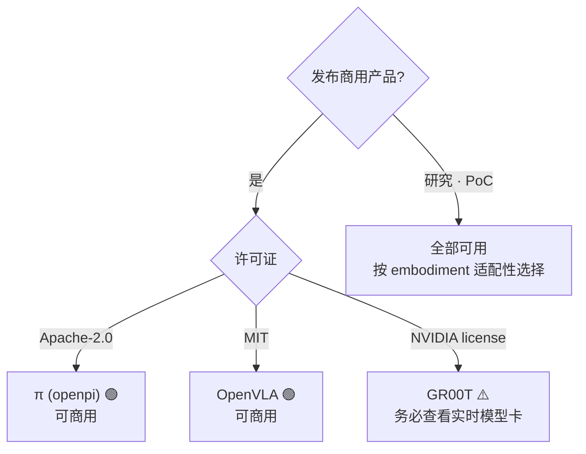
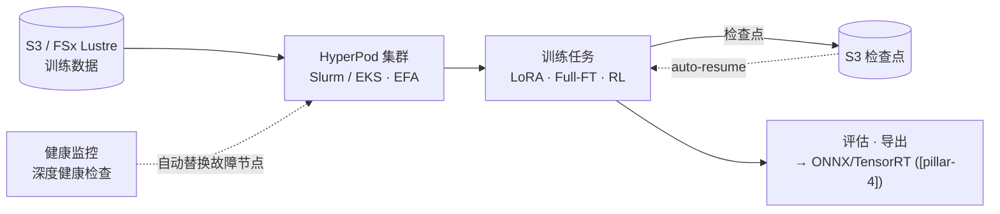
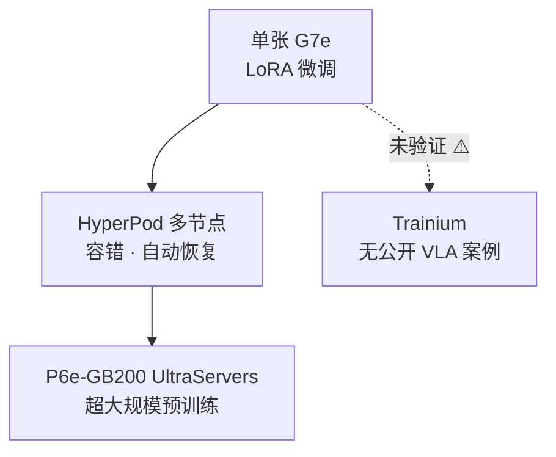

# Pillar 2 — 模型训练 (Model Training · VLA)

_最终更新: 2026-09 · owner: Youngjin · volatility: 高（模型版本·许可证·实例经常变动）_
_除非另有标注，各条目继承页面元数据（owner/updated/volatility）。按条目指定 owner 时在条目页脚补充。_
[← 返回 index](index.md)

> **L0 TL;DR**: 大多数客户**不会从零训练 VLA[^vla] —— 而是微调[^ft]开放基础模型**。所以核心问题有三个: (1) 用哪个模型（**许可证决定能否商用**），(2) LoRA[^lora] 还是全量微调（决定 GPU 规模），(3) 在 AWS 上怎么跑（HyperPod + EC2 GPU）。用 Trainium 训练 VLA 的公开案例尚不存在。

---

## 本支柱中客户最常问的问题 Top 3

1. **"从哪个 VLA 模型开始？哪些可以商用？"** → [开放 VLA 基础模型](#1-开放-vla-基础模型--许可证--ga)（⚠️ GR00T 许可证陷阱）
2. **"微调需要几张 GPU？用 LoRA 一张就够吗？"** → [VLA 微调实战](#2-vla-微调实战-lora-vs-full-ft--ga)
3. **"在 AWS 上怎么跑 VLA 训练？用 HyperPod？能用 Trainium 吗？"** → [AWS 训练栈](#3-aws-训练栈-hyperpod--ec2-gpu--ga)

> **稳定原理（几乎不变）**: (1) 几乎没有客户会预训练前沿 VLA —— **微调才是 99% 的现实**。(2) VLA 正收敛于 **System 2[^sys]（慢速 VLM[^vlm] 规划器，5~10Hz）+ System 1（快速动作策略，50~200Hz）** 结构，而这种双层结构决定了"推理放云上还是边缘"（→ [pillar-4](pillar-4.md)、[decisions](decisions.md)）。(3) 连续动作生成以 **flow-matching[^flow] / diffusion action head + action chunking[^chunk]** 为标准。

---

## 1. 开放 VLA 基础模型 & 许可证  🟢 GA

**L0 TL;DR**: 微调的起点。**许可证与性能同样重要** —— 最热门的 NVIDIA GR00T 可能因版本不同而为非商业，而 Physical Intelligence π（Apache-2.0）与 OpenVLA（MIT）**采用宽松许可证，对商业友好**。

**客户需求/问题**: "想引入面向人形/机械臂的 VLA。哪个开放模型好，能商用在我们产品上吗？"

**解决方案概览** `[1]`:

- **[NVIDIA Isaac GR00T](https://github.com/NVIDIA/Isaac-GR00T)** —— 开放人形基础模型。N1(2B)、N1.5(3B, flow-matching DiT action head)、N1.6(CES 2026, Cosmos Reason 2 骨干)、N1.7（GitHub 上声称 GA）。⚠️ **许可证注意**: N1.5 模型卡为**非商业（NVIDIA license, non-commercial）**。N1.6/N1.7 允许商用的说法**仅来自二手来源，未经验证** → 做商用判断前**务必直接查看实时模型卡**。`[1]` github.com/NVIDIA/Isaac-GR00T
- **[Physical Intelligence π (openpi)](https://github.com/Physical-Intelligence/openpi)** —— π0、π0-FAST、π0.5 全部为 **Apache-2.0**（可商用）。提供 DROID/ALOHA/LIBERO 微调检查点。`[1]` github.com/Physical-Intelligence/openpi。⚠️ π0.7 仅存在于二手来源（未经验证）。
- **[OpenVLA](https://github.com/openvla/openvla)** —— 7B、**MIT 许可证**（可商用），基于 Llama2 的 VLM 骨干。提供官方微调脚本。`[1]` github.com/openvla/openvla（LICENSE 文件 2026-07 直接确认）

**AWS 映射**: 将模型权重从 HF 镜像到 S3 → 在 EC2 GPU(P6/G7e) 或 SageMaker HyperPod 上微调（下方第 2·3 项）。可用 [LeRobot](https://github.com/huggingface/lerobot)（`groot` policy type）对 GR00T 做 post-train/eval。

**决策标准**:

- **发布商用产品** → 优先 π（Apache-2.0）或 OpenVLA（MIT）。GR00T 仅在确定许可证后使用。
- **人形全身控制** → GR00T 最完整（SONIC controller、Cosmos Reason 骨干），但需确认许可证。
- **研究·PoC** → 全部可用，按性能/embodiment[^embodiment] 适配性选择。

**客户案例**: 案例待定（未确认韩国公开的 VLA 微调案例）。

**➡️ 后续行动**: 若客户正在选型，则**将"许可证矩阵（GR00T=需确认 / π=Apache-2.0 / OpenVLA=MIT）作为第一张幻灯片"**呈现。若为商用，则提议在 EC2 G7e 上做 π0.5 或 OpenVLA 微调 PoC。

**🔗 相关资产**: [pillar-1 数据集许可证](pillar-1.md) · [pillar-4 边缘部署](pillar-4.md) · [机器人基础模型论文评读](https://hi-space.gitbook.io/physical-ai-on-aws/paper-review-tbd/robot-foundation-model) —— 韩语。推理 VLM（Cosmos-Reason 1）与 VLA（RT-2、OpenVLA、Gemini Robotics、GR00T N1、π0.6）论文整理

🔄 易变数据（模型版本·许可证 —— 更新对象，2026-07 确认）

| 模型 | 参数 | 许可证 | 商用 | 骨干 / 动作头 | 备注 |
|---|---|---|---|---|---|
| GR00T N1 | 2B | NVIDIA（非商业） | ❌ | SigLip2+T5 / flow-matching DiT | |
| GR00T N1.5 | 3B | NVIDIA（非商业） | ❌ | / flow-matching DiT | 模型卡明示 |
| GR00T N1.6 | ~3B | 声称商用 [4] | ⚠️未验证 | Cosmos Reason 2 | CES 2026 |
| GR00T N1.7 | 3B | NVIDIA Open Model | ⚠️未验证 | Cosmos-Reason2-2B / diffusion | GitHub 声称 GA, 40 timestep horizon |
| π0 / π0-FAST / π0.5 | 未公开 | **Apache-2.0** | ✅ | flow-matching (π0-FAST=autoregressive) | |
| OpenVLA | 7B | **MIT** | ✅ | Llama2 VLM | 许可证 2026-07 直接确认 |

⚠️ **N1.5 vs N1.6 vs N1.7 的版本-许可证映射在各来源间不一致。** 做商用声明前直接查看实时 HF/GitHub 模型卡。此条目在支柱 2 中引用风险最大。

---

## 2. VLA 微调实战 (LoRA vs Full-FT)  🟢 GA

**L0 TL;DR**: 好消息 —— **LoRA 微调用一张 GPU（24GB 级）就能做**，每个任务 100~500 个演示即可让单任务成功率达 80%+。全量微调则需要 70~100GB（H100/A100 级）。

**客户需求/问题**: "想按我们的任务调整 VLA，需要准备多少 GPU、需要多少数据？"

**解决方案概览** `[1]`:

- **OpenVLA**: LoRA(rank 32) ~24GB 单 GPU(A100/RTX 4090)。48GB→batch 12，80GB→batch 24。全量微调 ~100GB。官方 `vla-scripts/finetune.py`。
- **openpi (π0/π0.5)**: 推理 >8GB，LoRA >22.5GB(RTX 4090)，**全量微调 >70GB(A100/H100)**。官方 LoRA/full 配方，2025-09 新增 PyTorch 支持。数据 1~20 小时即可满足多数任务。
- **GR00T (N1.5/N1.7)**: 微调 40GB+ GPU（推荐 H100/L40），推理 16GB+。NVIDIA 官方 post-training 配方。
- **数据量的直觉**: LoRA 单任务 100~500 个演示 → 80%+ 成功率。少量·高质量的真实演示是关键（→ [pillar-1 遥操作](pillar-1.md)）。
- **解冻（unfreeze）哪个部件 — 训练范围即成本** `[1]/[2]`: 最新 VLA 是 (1) 负责理解的 VLM + (2) 生成动作的 DiT[^dit] + (3) 适配机器人身体的适配器 MLP 的组装（[GR00T N1 结构, arXiv:2503.14734](https://arxiv.org/abs/2503.14734)）。"想改变什么"决定了要打开（unfreeze）哪个部件以及成本:

| 想改变的 | MLP（适配器） | DiT（动作） | VLM（理解） | 成本直觉 `[2]` |
|---|---|---|---|---|
| 现有机器人 + 现有动作 | 保持 | 保持 | 保持 | 无需训练（直接使用） |
| **新机器人**、现有动作 | **训练** | freeze | freeze | 遥操作演示 50~200 个、2~6 小时、g5.2xlarge 约 $10 |
| 新动作（预训练中没有的 verb） | 训练 | **训练** | freeze | 半天 |
| 特殊相机模态（红外等） | 训练 | 训练 | LoRA | 数天，最贵 |

- ⚠️ **新机器人 = 必须有适配器** `[2]`: GR00T 只内置预注册 embodiment（GR-1·Franka 等）的 MLP。未注册的机器人直接部署会输出无意义结果（实测 0% 成功率）— 最低条件是**约 100 个演示 + 适配器训练**。fold·pour·stack 等常见动作已在预训练中，只调 MLP 即可；焊接等没有的动作则要打开 DiT。

**AWS 映射**: LoRA 用 **EC2 G6e(L40S)·G7e(RTX PRO 6000)** 单/少数 GPU 即可。全量微调·多 embodiment 则用 **P6-B200 / HyperPod 多节点**（下方第 3 项）。

**决策标准**:

- 任务特化·数据少 → **LoRA + 单张 G7e**。最便宜·最快。大多从这里开始。
- 多 embodiment·大规模·连骨干一起调 → **全量微调 + P6/HyperPod**。
- 数据 <1 小时 → 优先考虑 few-shot/提示而非微调。

**客户案例**: 案例待定（无官方 AWS VLA 微调案例 —— 第 3 项的 Unitree H1 是 RL locomotion 而非 VLA）。

**➡️ 后续行动**: **将"在单张 G7e 上做 LoRA 微调 1 天 PoC"作为默认入门提议**。若客户数据超过 100 个演示，即可立即展示实测成功率。GPU 获取受阻 → [decisions](decisions.md)。

**🔗 相关资产**: [pillar-1 数据管道](pillar-1.md) · [decisions: Build vs Buy](decisions.md)

🔄 易变数据（GPU 需求 —— 2026-07 官方仓库为准）

| 模型 | 推理 | LoRA 微调 | 全量微调 |
|---|---|---|---|
| OpenVLA (7B) | — | ~24GB（单张） | ~100GB |
| π0 / π0.5 | >8GB | >22.5GB | >70GB (A100/H100) |
| GR00T N1.5/N1.7 | 16GB+ | 40GB+ (H100/L40) | — |

---

## 3. AWS 训练栈 (HyperPod + EC2 GPU)  🟢 GA

**L0 TL;DR**: SageMaker HyperPod 处理分布式训练的容错·自动恢复·弹性伸缩，EC2 则从 **G7e（单~少数）→ P6-B200/P6e-GB200（大规模）** 逐级递进。不过**没有 VLA 专用的 HyperPod 配方**（只有 LLM 配方）—— VLA 训练要在集群上 DIY。

**客户需求/问题**: "需要能稳定跑微调/训练的基础设施。节点挂了要从头再来吗？"

**解决方案概览** `[1]`:

- **[SageMaker HyperPod](https://aws.amazon.com/sagemaker/hyperpod/)** —— 支持 Slurm + **EKS** + Training Jobs。**Checkpointless training**（故障时数分钟内自动恢复，无需人工介入）、**Elastic training**（按可用量·优先级自动伸缩，自动检查点/恢复）。**2026-04 新增 G7e + r5d.16xlarge 支持**。提供 HyperPod CLI/SDK。
- **EC2 GPU 阶梯** `[1]`: **G7**(RTX PRO 4500, 2026-06 GA) · **G7e**(RTX PRO 6000 Blackwell, 2026-01 GA) · **G6e**(L40S) → **P6-B200**(8×B200, 1440GB HBM) · **[P6e-GB200 UltraServers](https://aws.amazon.com/ec2/ultraservers/)**(GB200 NVL72, 最多 72 Blackwell/NVLink 域, 用 [Capacity Blocks](https://aws.amazon.com/ec2/capacityblocks/) 获取)。
- **Trainium**: Trn2 GA(2024-12)、**Trn3 UltraServers GA(2025-12 re:Invent)**、Trn4 已公布。⚠️ **没有用 Trainium 训练 VLA/机器人的公开案例** —— 整个 VLA 工具链都是 CUDA/NVIDIA。Trainium-for-VLA 未经验证。
- **首尔区域的最新一代** `[1]`: **[P6-B300](https://aws.amazon.com/about-aws/whats-new/2026/08/amazon-ec2-p6-b300/)**（8×NVIDIA Blackwell Ultra，每实例 2.1TB HBM3e·6.4Tbps EFA）**2026-08-20 首尔区域 GA** —— 韩国团队无需等待海外区域，即可在数据驻留范围内使用最新加速器。以 Capacity Blocks/Savings Plans/On-Demand 消费。范围要诚实说明: 它是通用 FM 训练平台，Physical AI（仿真·VLA 训练）只是其上的一种工作负载。
- **按规模推荐的模式（以 3B 级 VLA 为准，GR00T N1.6/N1.7 验证）** `[2]`: ① 演示 <200 个·LoRA（2~4 小时）→ **AWS Batch + EC2 Spot(g6e)** —— 短且便宜，推荐默认值。② 演示 ~500 个·全量微调（8~24 小时）→ **SageMaker Training Job** —— 自动检查点/恢复。③ 演示 500 个以上·多节点（数天）→ **HyperPod** —— 节点自动恢复 + EFA。为防 GPU 容量不足，提前在作业定义里写好**实例 fallback 顺序**（例: g6e → g6 → g5），即可不等待直接切换到下一类型。

**HyperPod 实际提供的能力** `[1]`（docs 2026-07 核实）:

| 组成 | 技术要点 | VLA 训练视角 |
|---|---|---|
| **编排** | **Slurm[^slurm]·EKS·Training Jobs** 三种模式 —— 原样承接 HPC 团队（Slurm）与 Kubernetes 团队（EKS）的既有工作流 | 在同一集群上跑 Isaac Lab RL（Slurm 惯例）与 VLA 微调（EKS） |
| **容错栈** | 健康监控代理 + 深度健康检查持续监视 GPU·网络 → **自动替换故障节点并从最近检查点 auto-resume**（零人工干预）。Checkpointless training 即使没有检查点也能在数分钟内恢复 | 对数周级训练"节点挂了要从头来吗？"的直接回答 |
| **Task Governance** | 按团队·项目分配配额可**细化到单个 GPU**，优先级调度、抢占低优先级任务（保存检查点后暂停→稍后恢复）、团队间出借空闲算力 | 机器人团队·模型团队共用一个集群时的 GPU 空闲率管理 |
| **Elastic training** | 任务规模随可用容量·优先级自动扩缩，自动检查点·恢复 | 自动吸收 Capacity Blocks 配额随时间的波动 |
| **网络·存储** | **EFA[^efa]** 低延迟节点间通信 + FSx for Lustre 训练通道（→ [pillar-1](pillar-1.md) 管道） | 消除多节点梯度同步瓶颈 |
| **配方** | 提供 LLM/FM 的预验证训练配方 —— ⚠️ **无 VLA 专用配方**，VLA 训练需在集群上 DIY | 这一空白正是 SA 的机会（微调配方资产化） |

**AWS 映射**: 上述服务本身即映射。GPU 获取策略（On-Demand vs Capacity Blocks vs Flexible Training Plans）→ [decisions](decisions.md)。

**决策标准**:

- 单/少数 GPU LoRA → 无需 HyperPod，直接用 EC2 G7e。
- 多节点·长时间·需要容错 → **HyperPod(EKS)** + checkpointless。
- 超大规模预训练 → P6e-GB200 UltraServers + Capacity Blocks。
- 提议 Trainium 时 → 明示**当前对 LLM 场景安全，VLA 未经验证**并共享风险。

**客户案例** `[1]`:

- **在 Isaac Lab + SageMaker(HyperPod) 上训练 Unitree H1 人形 RL** —— AWS 官方博客(2026-06-09)。演示了 19 关节 velocity tracking、PPO(skrl)、HyperPod 健康监控·自动替换·检查点恢复。⚠️ **是 RL locomotion 而非 VLA 微调** —— 仅作为参考架构引用。
- **Zoox** —— 用 HyperPod 训练多模态 AV 基础模型，64+ GPU 达 95% 利用率。⚠️ AV。

**➡️ 后续行动**: **直接把 AWS 官方"Isaac Lab on SageMaker"博客当作研讨会资产用**（唯一可复现的 AWS 机器人训练参考）。GPU 可用性有问题则连接到 Capacity Blocks/Flexible Training Plans。

**🔗 相关资产**:

- Playbook: [pillar-3 仿真(Isaac Lab)](pillar-3.md) · [decisions: GPU 获取](decisions.md)
- [Physical AI E2E 研讨会](https://hi-space.gitbook.io/physical-ai-on-aws/guide/e2e-workshop) —— 韩语。GR00T VLA 微调 + SageMaker 轨道
- [AWS Physical AI Recipes](https://github.com/hi-space/aws-physical-ai-recipes) —— 韩语，MIT。包含上述 E2E 研讨会代码的实战配方集: Isaac Lab→GR00T 微调→推理→监控 E2E（CDK）、SageMaker HyperPod VLA/RL 分布式训练基础设施（Slurm·FSx·MLflow）、GR00T-N1.6-3B SageMaker 微调管道、NVIDIA OSMO[^osmo] on EKS 工作流编排
- [Physical AI 101 — 入门概念地图](https://d2gup9k4vdzl3b.cloudfront.net/pai101/index.html) —— 面向初学者的单页教程：全局→研究版图→VLA 微调→模型内部→机器人基础概念→AWS 的角色，含 AWS PAI 参考架构与术语表。页内韩语/英语切换，结尾引导至本手册作为下一步
- [Physical AI Scaffolding Kit](https://github.com/aws-samples/sample-physical-ai-scaffolding-kit) —— aws-samples。HyperPod Slurm 集群 + π0·GR00T·Isaac Lab Newton RL 训练示例，多语言 README（韩·日·英）。AWS Japan Physical AI 开发支持计划官方资产
- [Embodied AI Platform](https://github.com/aws-samples/sample-embodied-ai-platform) —— aws-samples。GR00T VLA 遥操作·模仿学习微调 on AWS Batch + DCV 工作站 → SO-ARM100/101 实机推理。⚠️ 目前仅 GR00T 训练组件为 Available，其余为路线图

---

## 4. System 2 + System 1 架构  🟢 GA（稳定原理）

**L0 TL;DR**: 2026 年主导的 VLA 结构。**慢速 VLM（System 2, 5~10Hz）规划"做什么"**，**快速动作策略（System 1, 50~200Hz）执行"怎么动"**。这种分离**决定了推理部署的位置（云 vs 边缘）**，是 SA 必须理解的概念。

**客户需求/问题**: "实时控制场景下，大模型怎么跑？云延迟不成问题吗？"

**解决方案概览** `[1]/[4]`:

- **[Figure Helix](https://www.figure.ai/news/helix)**: System 2 = 板载互联网预训练 VLM @ 7~9Hz（场景/语言），System 1 = 反应式 visuomotor @ 200Hz。`[1]` figure.ai/news/helix
- **GR00T N1**: System 1 = diffusion policy ~10ms 延迟，System 2 = LLM 规划器（任务分解）。
- **通用模式**: 重型 VLM 以 5~10Hz 重新规划，轻量 flow-matching/diffusion "action expert" 以最新计划为条件，以 50~200Hz 发出动作。用 **action chunking**（GR00T=40 timestep horizon）预测未来动作块。
- **整个领域的双轴分类法** `[1]`: 在被模型名字淹没之前 —— 大多数 VLA 都落在 (1) **网络结构**: Monolithic（单网络端到端）vs Hierarchical（规划者+执行者分离），(2) **思考系统**: Single-system vs Dual-system（顺序 cascade / 并行 parallel）的 2×2 之上。GR00T 的"两个大脑"是 hierarchical × dual-system(parallel) 那一格的具体案例 —— System 1/2 不是某个模型的专属说法，而是整个领域的一级分类轴。
- **有效控制频率 = 推理 Hz × chunk 大小**: 即使 π0.5 在 Jetson 上只有 ~10Hz 推理，只要一次输出 10 步的 chunk，机器人就能以 ~100Hz 运动（执行 chunk 期间预计算下一个 chunk）。这道算术是解开"大模型 = 慢机器人"误解的钥匙。
- ⚠️ **警惕"VLA 已死（将被 WAM[^wam] 取代）"的标题党** `[1]/[4]`: WAM（World Action Model）以 video-diffusion 为骨干**同时预测**未来视频+动作 —— 得益于网络视频的物理先验，未学过动作的 zero-shot 是强项（[DreamZero, arXiv:2602.15922](https://arxiv.org/abs/2602.15922): 仅约 500 小时机器人数据就把 unseen task 从 16% 提到 40% 档），但因 14B 反复 denoising，closed-loop 仅 **~7Hz，是最慢的**。与"VLAs are dead"主题演讲同期，NVIDIA 自己发布了 GR00T N1.7（VLA）；独立比较中只要数据多样性充足，VLA（π0.5）与 WAM 表现相当 —— 真实图景是 **"VLA + World Model + RL 后训练的收敛"**。不要在客户对话中照搬标题（成熟度跟踪见 [radar 的 World-action models](radar.md)）。
- ⚠️ **成熟度要诚实**: 这个*模式本身*已是标准，但全身人形的全栈大多处于试点/演示阶段。

**AWS 映射**: 将 **System 2（规划器）放在云/Bedrock AgentCore，System 1（实时控制）放在边缘（Jetson）** 是自然的分工（→ [pillar-5](pillar-5.md)、[pillar-4](pillar-4.md)、[decisions](decisions.md)）。

**决策标准**: 要求 30~100Hz 实时控制 → System 1 **必须在边缘板载**。System 2（规划·推理）在能容忍延迟时可放云上。这条边界是 [decisions 的 Cloud vs Edge 树](decisions.md)的核心。

**客户案例**: Figure（演示/PR）、GR00T（开放模型）。经过验证的生产环境有限。

**➡️ 后续行动**: 客户问"实时场景能用云吗？"时，**画出 System1/System2 图，归纳为"控制回路在边缘、规划在云上"**。仅此一点就能理清架构对话。

**🔗 相关资产**: [pillar-4 边缘推理](pillar-4.md) · [pillar-5 编排](pillar-5.md) · [decisions](decisions.md)

---

## 5. （竞品栈）Google Gemini Robotics  🟡 Preview

**L0 TL;DR**: 谷歌的机器人 VLA 家族。**Gemini Robotics-ER 1.6 以预览形式（Gemini API/AI Studio）公开**，是 embodied reasoning（高层推理·工具调用）层，而低层电机控制 VLA 仅限合作伙伴。虽是竞品栈，但客户常问，故诚实对待。

**客户需求/问题**: "用 Gemini Robotics 不就行了吗？它和 AWS 怎么关联？"

**解决方案概览** `[1]`:

- **Gemini Robotics-ER 1.6** (2026-04 **Preview**, model id: `gemini-robotics-er-1.6-preview`, AI Studio + Gemini API) —— 智能体式 embodied reasoning: 任务分解、工具调用（含 Search）、VLA 调用、模拟仪表读数。**是推理/VLM 层而非低层控制**。谷歌官方文档明示 "currently in preview" `[1]`。
- **Gemini Robotics On-Device** (2025-06) —— 首个可本地部署的 VLA，支持微调（50~100 个演示）。**waitlist/trusted-tester(Preview)**。
- **Gemini Robotics 1.5 VLA** —— 仅限合作伙伴。

**AWS 映射（竞品栈 → AWS 补充）**: Gemini Robotics-ER 承担 **规划器（System 2）角色** —— 即使客户使用它，**机器人机群编排·工具网关·策略护栏也可以用 Bedrock AgentCore 包裹**（→ [pillar-5](pillar-5.md)）。低层控制 VLA 则提议在 AWS 上微调开放模型（π/OpenVLA/GR00T）作为替代。

**决策标准**:

- 需要快速的高层推理且能接受谷歌生态·预览风险 → 可尝试 ER 1.6 API（但为 Preview —— 禁止生产承诺）。
- 商用·本地部署·数据主权·低层控制定制 → **在 AWS 上微调开放 VLA** 更灵活。

**客户案例**: 合作伙伴部署（多为非公开）。

**➡️ 后续行动**: 若客户正在评估 Gemini Robotics，则**提议"推理层用它，但编排·护栏·低层控制模型由 AWS 拥有"** 的混合方案（以补充而非竞争的角度）。

**🔗 相关资产**: [pillar-5 AgentCore](pillar-5.md)

---

## 6. 训练运营原则 — checkpoint 谱系与 IL 的天花板  🟢 GA（稳定原理）

**L0 TL;DR**: 有两个陷阱反复摧毁客户的训练项目。(1) **checkpoint 是一棵树** —— specialize 是单向的，丢了 generalist 检查点就无法回头。(2) **loss 再低成功率也不涨** —— 这是模仿学习的 covariate shift[^covshift] 所致，评估只能用 **rollout 成功率**而非 loss。

**客户需求/问题**: "微调越做越丢失之前的能力" / "training loss 一直在降，实际成功率却纹丝不动"。

**解决方案概览** `[1]/[2]`:

- **checkpoint tree 管理**: 权重按 generalist → embodiment 特化 → 任务特化（10~150 个演示）→ 实机部署校正的顺序分叉（spin-off）生长。**链是单向的** —— 一旦 specialize 的权重几乎无法还原回 generalist（catastrophic forgetting[^forget]）。若某个分支对特定动作过拟合而崩坏，不要继续硬推，而是**回到上一个（更 general 的）检查点重新分叉**。
- **"把客户 A 的权重用到客户 B"这个问题的真实答案**: 不是 A 的 specialist 权重，而是**从其上层 generalist 向 B 重新微调**。如果当初用 LoRA 分叉，摘下适配器即可回到 generalist —— 这是从一开始就推荐 LoRA 分叉的运营理由。
- **"open weights"的陷阱**: 先确认公开检查点处于谱系哪个阶段 —— 只放出 Stage 3 specialist 的模型在那台机器人·那个环境之外用不了（无法逆向还原）。OpenVLA·GR00T·π0/π0.5 公开 generalist（foundation）检查点的原因正在于此。
- **IL 的天花板 = covariate shift**: BC 只学"专家所在状态 → 专家动作"的配对，执行中一点小误差就会进入演示分布之外（OOD）的状态，而数据里没有恢复方法，误差便像雪球一样累积 —— 最坏情况下随时间跨度 T 按 T² 累积（[Ross et al., DAgger, arXiv:1011.0686](https://arxiv.org/abs/1011.0686)）。**training loss 和 validation loss 都抓不到这个问题**（两者都在同一演示分布上测量）。
- **处方**: 不是"更好的 val set"，而是**把策略实际访问的分布放进训练** —— DAgger[^dagger]（为策略走到的状态补充专家标签）→ on-policy 数据 → RFT（下面第 7 节）。诊断信号: loss ≈ 0 而成功率平坦 → 不是该继续训练，而是该换方法。

**AWS 映射**: checkpoint 谱系 = S3 版本控制 + 按阶段单独保存（HyperPod 自动检查点见第 3 节）。评估 rollout = 仿真扫描（[pillar-3](pillar-3.md)，评估的局限见 [pillar-4 策略评估](pillar-4.md)）。

**决策标准**: generalist 检查点在任何情况下都要单独保存（禁止覆盖）。以 loss 为评估指标的训练合同·里程碑属于需要重新谈判的对象。

**客户案例**: 案例待定（原理本身有公开论文依据）。

**➡️ 后续行动**: 审阅客户训练管道时先问两个问题 —— **"generalist 检查点存在哪里" + "评估用 loss 还是 rollout"**。这两点不稳，其余讨论都没有意义。

**🔗 相关资产**: [pillar-4 策略评估](pillar-4.md) · [pillar-1 遥操作](pillar-1.md)

---

## 7. RL 微调 (RFT) — PPO vs GRPO 与奖励设计  🟢 GA（算法）/ 🔵 奖励自动化 Research

**L0 TL;DR**: 只靠 SFT（模仿）连示范中的失误也会一并学会。用环境奖励收尾的阶段是 RFT[^rft] —— 算法上 **PPO[^ppo] 是长期标准，无 critic 的 GRPO[^grpo] 正在迅速崛起**（模型越大算力收益越大）。真正的胜负点不是算法而是**奖励设计** —— "simulator fidelity is reward fidelity"。

**客户需求/问题**: "用 BC 做到了 80%，再上不去了。要用 RL 收尾该怎么用？"

**解决方案概览** `[1]`:

- **PPO**（[Schulman et al., arXiv:1707.06347](https://arxiv.org/abs/1707.06347)）—— "只在上一个策略附近小步前进"。RL 中策略自己生成自己的训练数据，一次大更新搞坏了策略就会收集更差的数据陷入恶性循环 —— clip 正是用来阻止这种突变。机器人 RL 的事实标准。
- **GRPO**（[DeepSeekMath, arXiv:2402.03300](https://arxiv.org/abs/2402.03300)）—— 去掉 critic（value network），在同一状态跑 N 个 rollout，用**组平均 return 作为 baseline**。省掉了与策略网络同量级的 critic 计算·内存，对 VLA 级大模型有利。但组 baseline 方差可能偏大，需要把 N 取足够大。
- **奖励设计才是胜负点**: sparse（只在成功时 +1）在首次成功前根本没有学习信号；dense（基于距离的 shaping）则有设计者偏见与 reward hacking[^rhack]（只刷分不干活）的风险。奖励必须测量**想达成的结果本身**，而仿真器对摩擦·接触·延迟的还原度就是奖励信号的还原度（→ [pillar-3](pillar-3.md)）。
- **经过验证的实战配方 — Teacher-Student 管道** `[1]`: ① Teacher = **PPO + privileged state**（GT pose·contact 等特权信息，Isaac Lab 大规模并行）→ ② Student = **DAgger + BC 蒸馏**（只输入可部署的 RGB+proprioception）→ ③ 用 **GRPO + binary success reward** 引导提升。[VIRAL(arXiv:2511.15200)](https://arxiv.org/abs/2511.15200)·[DoorMan(arXiv:2512.01061)](https://arxiv.org/abs/2512.01061)（均为 CVPR 2026）实证 —— DoorMan 以 83% SR 超过专家遥操作基线（80%）。
- 🔵 **奖励自动化（Research）**: 没法为每个任务手写 dense 奖励 —— 用 VLM 自动评分每步进度的 [GVL(arXiv:2411.04549)](https://arxiv.org/abs/2411.04549)·[TopReward(arXiv:2602.19313)](https://arxiv.org/abs/2602.19313)·[VLLR(arXiv:2604.00055)](https://arxiv.org/abs/2604.00055) 很活跃，但 2026 年"可商用 + 低延迟 + open-weight"三者兼备的 progress model 仍然稀少。若成功判定客观（到达·装配完成），用确定性 verifier 直接给奖励的 RLVR 是安全起点。

**AWS 映射**: Teacher 大规模并行 RL = Isaac Lab on EC2 G6e/AWS Batch（→ [pillar-3](pillar-3.md)），蒸馏·GRPO 引导 = 直接复用第 3 节训练栈。[sample-vla-finetuning](https://github.com/aws-samples/sample-vla-finetuning) 以 IaC 提供 IL/RL 两条路径（见下方相关资产）。

**决策标准**: 能拿到数百个干净示范 → 用 IL warm-start。没有示范 + 有好的仿真器·奖励 → RL。**实战正解大多是 hybrid（IL → RFT）**。大型 VLA 中 critic 内存成瓶颈 → GRPO。

**客户案例**: 案例待定（VIRAL/DoorMan 为论文实证 —— 非客户部署案例）。

**➡️ 后续行动**: 对 BC 性能停滞的客户提议 **Teacher-Student（PPO→蒸馏→GRPO）三阶段配方** —— 全部阶段都在仿真内完成，可直接复用既有 AWS Batch/Isaac Lab 栈。

**🔗 相关资产**: [pillar-3 并行 RL](pillar-3.md) · [sample-vla-finetuning](https://github.com/aws-samples/sample-vla-finetuning) —— aws-samples，MIT-0。只需给出意图（IL 演示 or RL 任务）即可自动决定 Batch+Spot / SageMaker Training / HyperPod 三种模式的单命令微调平台。支持 GR00T·π0.5·ACT·SmolVLA + Isaac Lab RL 路径，含 MCP 服务器（7 tools），可在智能体会话中完成 submit·监控

---

## 本支柱的诚实现实（SA 必读）

- **GR00T 许可证是目前引用的最大风险。** N1.5 明确为非商业。N1.6/N1.7 允许商用仅来自二手来源 → **客户做商用判断前直接查看实时模型卡**。搞错就是法务风险。
- **禁止说"PI(Physical Intelligence) 用 AWS"。** openpi 检查点放在 GCS(`gs://`)，是 **GCP 信号**。无 AWS-PI 案例。
- **没有官方的 AWS VLA 微调案例。** 唯一的 AWS 机器人训练参考是 **Unitree H1 RL locomotion**（非 VLA）。不要夸大 VLA 故事。
- **Trainium-for-VLA 未经验证。** 整个 VLA 工具链是 CUDA。提议时明示风险。

---
_owner: Youngjin · updated: 2026-09 · volatility: 高（模型版本·许可证·GPU 需求·实例在折叠块中管理）· sources: [1] 官方/论文, [3] 厂商, [4] 未经验证_

<!-- 용어 각주 -->

[^vla]: **VLA (Vision-Language-Action)** — 以相机图像（Vision）与自然语言指令（Language）为输入、直接输出机器人动作（Action）的基础模型。对它说"把杯子拿起来"，它就会生成关节运动。🎥 [NVIDIA Isaac GR00T N1 介绍](https://www.youtube.com/watch?v=m1CH-mgpdYg)
[^ft]: **微调（fine-tuning）** — 用自己任务·机器人的少量数据，对经过大规模数据预训练的模型进行追加训练。相比从零训练，数据·GPU 可节省数十~数百倍。
[^lora]: **LoRA (Low-Rank Adaptation)** — 冻结原始权重、只额外训练小型低秩（low-rank）矩阵的轻量微调技术。GPU 内存需求仅为全量微调的几分之一，一张 24GB 级 GPU 即可完成。
[^sys]: **System 2 / System 1** — 把认知科学中"慢思考 / 快反应"的区分应用到机器人架构的结构。System 2 由慢速大模型负责规划（5~10Hz），System 1 由小型策略负责实时控制（50~200Hz）。它是决定推理放云上还是边缘的标准。
[^flow]: **flow-matching / diffusion action head** — 通过从噪声逐步细化来生成机器人连续动作的扩散（diffusion）·流（flow）系输出模块。能表达平滑且多模态（multi-modal）的动作分布，是最新 VLA 的标准动作头。
[^chunk]: **action chunking** — 不是每步只预测 1 个动作，而是一次预测未来多步动作（块）的技术。减少推理次数，更容易满足实时控制频率。
[^vlm]: **VLM (Vision-Language Model)** — 同时理解图像和文本的模型（例如看照片回答问题）。VLA 通常以 VLM 作为"眼睛+大脑"骨干，并在其上加装动作头。
[^embodiment]: **embodiment（具身形态）** — 机器人的物理形态·自由度·传感器配置。即使模型相同，机械臂与人形机器人的 embodiment 不同，数据·策略无法直接移植。
[^slurm]: **Slurm** — HPC 集群的标准开源作业调度器。可在数千节点上排队·分配批处理作业，是研究室·超算出身团队最熟悉的工作流。
[^efa]: **EFA（Elastic Fabric Adapter）** — 面向 EC2 的低延迟·绕过操作系统的网络接口。是消除多节点分布式训练中 GPU 间梯度同步（All-Reduce）瓶颈的关键。
[^osmo]: **OSMO** — NVIDIA 面向机器人工作负载的工作流编排平台。将合成数据生成、仿真、模型训练等多阶段作业调度到本地与云端的多个集群（如 Kubernetes）。
[^dit]: **DiT (Diffusion Transformer)** — 用 Transformer 结构构建的扩散（diffusion）生成器。在最新 VLA 中作为从噪声生成机器人关节命令（action chunk）的"动作引擎"部件使用。
[^wam]: **WAM (World Action Model)** — 以视频生成模型为骨干、同时预测未来视频与机器人动作的模型。得益于从网络视频学到的物理知识，对未学过的动作较强，但因反复 denoising 控制频率偏低。注意不要与 WFM（只生成视频、不输出动作）混淆。
[^covshift]: **covariate shift（协变量偏移）** — 训练时见过的状态分布与执行时实际遇到的状态分布错位的现象。模仿学习策略因小误差漂移到演示中没有的状态时，由于从未学过如何恢复，误差会不断累积。（正确写法是"covariate"而非"covariant"。）
[^forget]: **catastrophic forgetting（灾难性遗忘）** — 神经网络在学习新任务时覆盖并丢失之前所学能力的现象。这是无法从 specialize 的检查点还原 generalist 的原因。
[^dagger]: **DAgger (Dataset Aggregation)** — 实际运行已训练的策略，为策略访问过的状态额外收集专家正确标签并重新训练的模仿学习增强技术。是应对 covariate shift 的经典处方。
[^rft]: **RFT (Reinforcement Fine-Tuning，强化微调)** — 用环境奖励信号进一步改进模仿学习（SFT）所得策略的收尾阶段。通过试错找到示范中没有的更优动作。
[^ppo]: **PPO (Proximal Policy Optimization)** — 应用最广的强化学习算法。用 clip 限制更新幅度使其"不要离上一个策略太远"，从而稳定收敛 — 机器人 RL 的事实默认值。
[^grpo]: **GRPO (Group Relative Policy Optimization)** — 不用单独的价值网络（critic），在同一状态跑多个 rollout、以组平均作为基线（baseline）的强化学习算法。省去 critic 训练成本，在大模型（LLM·VLA）中迅速崛起。
[^rhack]: **reward hacking** — 奖励设计不当时，智能体不追求预期目标而是钻分数空子的现象（例: 对"前进距离"给奖励，就原地打转欺骗传感器）。奖励必须测量想达成的结果本身。
