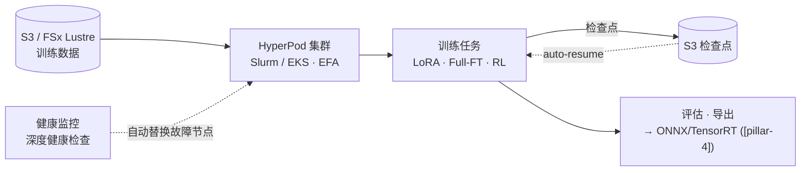
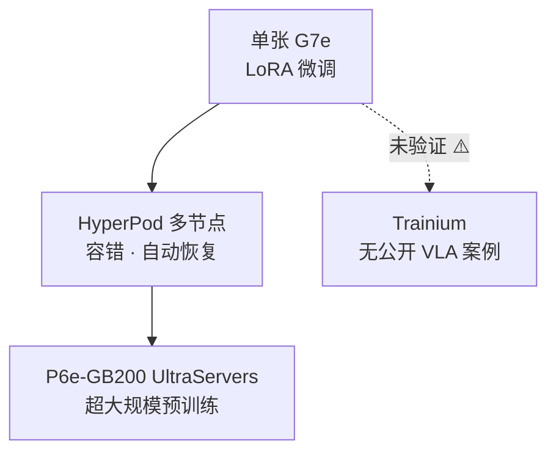

# Pillar 2 — 模型训练 (Model Training · VLA)

_最终更新: 2026-09 · owner: Youngjin · volatility: 高（模型版本·许可证·实例经常变动）_
_除非另有标注，各条目继承页面元数据（owner/updated/volatility）。按条目指定 owner 时在条目页脚补充。_
[← 返回 index](index.md)

> **L0 TL;DR**: 选择模型适配前，先与[现有方式、采购及 SI](decisions.md)比较。需要学习时确认模型数据权利、观测动作兼容、实测资源和独立评估。

---

> **复核范围**：页面修改日不代表所有技术条目已重验。核心修正日期、复现/人工状态见[证据](evidence.md)，旧条目仍使用各自确认日期。

## 本支柱中客户最常问的问题 Top 3

> 以下为探索问题示例，不是已验证的客户咨询频率排名。

1. **"从哪个 VLA 模型开始？哪些可以商用？"** → [开放 VLA 基础模型](#1-开放-vla-基础模型--许可证--ga)（⚠️ GR00T 许可证陷阱）
2. **"微调需要几张 GPU？用 LoRA 一张就够吗？"** → [VLA 微调实战](#2-vla-微调实战-lora-vs-full-ft--ga)
3. **"在 AWS 上怎么跑 VLA 训练？用 HyperPod？能用 Trainium 吗？"** → [AWS 训练栈](#3-aws-训练栈-hyperpod--ec2-gpu--ga)

> **L0/L1**: 分别验证模型、训练范围、部署位置。System 1/2[^sys] 不是云部署规则，action chunking[^chunk] 不自动提高反馈频率。

---

## 1. 开放 VLA 选型与许可证 — 逐模型确认 { #1-开放-vla-基础模型--许可证--ga }

**L0 TL;DR**: 同时评估性能、机器人适配和使用权。**区分代码、预训练权重、基础模型和数据集的许可证**，核对具体版本的官方模型卡。公开权重不代表客户现场验证。

**客户需求/问题**：“能否将该模型用于我们的机器人/任务，进行商业或研究使用？”

| 候选 | 要核对的一手来源 | 判断范围 |
|---|---|---|
| [NVIDIA Isaac GR00T](https://github.com/NVIDIA/Isaac-GR00T) | 所选版本模型卡、权重条款、代码 LICENSE | 不将所有代际归为同一许可证 |
| [Physical Intelligence openpi](https://github.com/Physical-Intelligence/openpi) | 代码 LICENSE、checkpoint、基础模型访问/使用条件 | 代码 Apache-2.0 不决定所有权重/数据权利 |
| [OpenVLA](https://github.com/openvla/openvla#pretrained-vlas) | README 的 Model Licensing & Commercial Use | **代码 MIT / Llama-2 派生权重 Llama Community License** `[1]` |

**OpenVLA 修正**：撤回“MIT 因而可商用”的表述。官方 README 区分代码与预训练权重条件。[确认日期及来源](evidence.md#openvla-license)。

**AWS 映射**：将具有使用权的权重及数据存入 S3，先测量单 GPU 显存和吞吐量。选择所需 EC2、Batch、SageMaker 环境，公开样本不是 AWS 运营保证。

**决策标准**：分别核对商业、内部 PoC、研究用途条款。称作 PoC 不自动满足非商业条件。检查机器人观测/动作定义与 checkpoint 兼容性。

**客户案例**：该表是许可证审查路径，不是部署证据。

**➡️ 后续行动**：记录代码/权重/基础模型/数据、版本、允许用途、来源 URL/日期及复核人，再进入[微调路径](execution.md#finetuning)。

**🔗 相关资产**: [pillar-1 数据集许可证](pillar-1.md) · [pillar-4 边缘部署](pillar-4.md) · [机器人基础模型论文评读](https://hi-space.gitbook.io/physical-ai-on-aws/paper-review-tbd/robot-foundation-model) —— 韩语。推理 VLM（Cosmos-Reason 1）与 VLA（RT-2、OpenVLA、Gemini Robotics、GR00T N1、π0.6）论文整理

---

## 2. VLA 微调 — 资源估算与评估 { #2-vla-微调实战-lora-vs-full-ft--ga }

**L0 TL;DR**: 部分模型/配置可用单 GPU 微调，但**显存或演示数量不保证成功率及周期**。先做兼容性检查，再用客户数据测量训练/评估成本。

**客户需求/问题**：“如何估算数据、GPU 及完成条件？”

**解决方案概览** `[1]`：核对所选版 [OpenVLA LoRA](https://github.com/openvla/openvla#fine-tuning-openvla-via-lora) 和 [openpi](https://github.com/Physical-Intelligence/openpi)。显存需按模型、精度、图像数/分辨率、序列长度、batch、训练模块实测。根据机器人和任务变化，实验确定动作头、适配器、VLM 的训练范围。

| 阶段 | 所需证据 | 费用/扩展判断 |
|---|---|---|
| 数据/模型兼容 | 观测动作格式、单位、加载与推理 | 先用小数据确认 |
| 基线评估 | 训练前成功分子/分母、周期、介入 | 判断是否需要微调 |
| 限制训练 | 固定数据/配置、耗时、峰值显存、checkpoint | 单 GPU 可容纳则保持小规模 |
| 独立评估 | 分离任务/环境、重复实验、性能波动/延迟 | 未达标则重审数据与假设 |

**修正**：不泛化“100~500 演示达 80%+”“100 演示一天 PoC”“新机器人只需适配器”。旧费用及 0% 成功测量缺少复现日志和条件，不作为客户承诺依据。[证据记录](evidence.md#finetuning-outcomes)。

**AWS 映射及选择**：单 GPU 实验先考虑 EC2/Batch；长管理型任务考虑 SageMaker Training；证实多节点需求后考虑 HyperPod。不按演示数量决定服务。

**客户案例**：区分样本运行与客户现场成果。

**➡️ 后续行动**：按[路径 C](execution.md#finetuning)的准备、dry-run、评估及停止条件制定客户特定周期和成本范围。

**🔗 相关资产**: [pillar-1 数据管道](pillar-1.md) · [decisions: Build vs Buy](decisions.md)

---

## 3. AWS 训练栈 (HyperPod + EC2 GPU)  🟢 GA

**L0 TL;DR**: SageMaker HyperPod 处理分布式训练的容错·自动恢复·弹性伸缩，EC2 则从 **G7e（单~少数）→ P6-B200/P6e-GB200（大规模）** 逐级递进。不过**没有 VLA 专用的 HyperPod 配方**（只有 LLM 配方）—— VLA 训练要在集群上 DIY。

**客户需求/问题**: "需要能稳定跑微调/训练的基础设施。节点挂了要从头再来吗？"

**解决方案概览** `[1]`:

- **[SageMaker HyperPod](https://aws.amazon.com/sagemaker/hyperpod/)** —— 支持 Slurm + **EKS** + Training Jobs。**Checkpointless training**（故障时数分钟内自动恢复，无需人工介入）、**Elastic training**（按可用量·优先级自动伸缩，自动检查点/恢复）。**2026-04 新增 G7e + r5d.16xlarge 支持**。提供 HyperPod CLI/SDK。
- **EC2 GPU 阶梯** `[1]`: **G7**(RTX PRO 4500, 2026-06 GA) · **G7e**(RTX PRO 6000 Blackwell, 2026-01 GA) · **G6e**(L40S) → **P6-B200**(8×B200, 1440GB HBM) · **[P6e-GB200 UltraServers](https://aws.amazon.com/ec2/ultraservers/)**(GB200 NVL72, 最多 72 Blackwell/NVLink 域, 用 [Capacity Blocks](https://aws.amazon.com/ec2/capacityblocks/) 获取)。
- **Trainium**: Trn2 GA(2024-12)、**Trn3 UltraServers GA(2025-12 re:Invent)**、Trn4 已公布。⚠️ **没有用 Trainium 训练 VLA/机器人的公开案例** —— 整个 VLA 工具链都是 CUDA/NVIDIA。Trainium-for-VLA 未经验证。
- **首尔区域的最新一代** `[1]`: **[P6-B300](https://aws.amazon.com/about-aws/whats-new/2026/08/amazon-ec2-p6-b300/)**（8×NVIDIA Blackwell Ultra，每实例 2.1TB HBM3e·6.4Tbps EFA）**2026-08-20 首尔区域 GA** —— 韩国团队无需等待海外区域，即可在数据驻留范围内使用最新加速器。以 Capacity Blocks/Savings Plans/On-Demand 消费。范围要诚实说明: 它是通用 FM 训练平台，Physical AI（仿真·VLA 训练）只是其上的一种工作负载。
- **训练规模**：按模型、精度、输入、峰值显存、实测耗时及通信量选择单 GPU、单节点多 GPU、多节点。不按演示数分配 Batch/Training/HyperPod，先检查[路径 C](execution.md#finetuning)。

**HyperPod 实际提供的能力** `[1]`（docs 2026-07 核实）:

| 组成 | 技术要点 | VLA 训练视角 |
|---|---|---|
| **编排** | **Slurm[^slurm]·EKS·Training Jobs** 三种模式 —— 原样承接 HPC 团队（Slurm）与 Kubernetes 团队（EKS）的既有工作流 | 在同一集群上跑 Isaac Lab RL（Slurm 惯例）与 VLA 微调（EKS） |
| **容错栈** | 健康监控代理 + 深度健康检查持续监视 GPU·网络 → **自动替换故障节点并从最近检查点 auto-resume**（零人工干预）。Checkpointless training 即使没有检查点也能在数分钟内恢复 | 对数周级训练"节点挂了要从头来吗？"的直接回答 |
| **Task Governance** | 按团队·项目分配配额可**细化到单个 GPU**，优先级调度、抢占低优先级任务（保存检查点后暂停→稍后恢复）、团队间出借空闲算力 | 机器人团队·模型团队共用一个集群时的 GPU 空闲率管理 |
| **Elastic training** | 任务规模随可用容量·优先级自动扩缩，自动检查点·恢复 | 自动吸收 Capacity Blocks 配额随时间的波动 |
| **网络·存储** | **EFA[^efa]** 低延迟节点间通信 + FSx for Lustre 训练通道（→ [pillar-1](pillar-1.md) 管道） | 消除多节点梯度同步瓶颈 |
| **配方** | 提供 LLM/FM 的预验证训练配方 —— ⚠️ **无 VLA 专用配方**，VLA 训练需在集群上 DIY | 这一空白正是 SA 的机会（微调配方资产化） |

**AWS 映射**: 上述服务本身即映射。GPU 获取策略（On-Demand vs Capacity Blocks vs Flexible Training Plans）→ [decisions](decisions.md)。

```mermaid
graph LR
    D[("S3 / FSx Lustre<br>训练数据")] --> C["HyperPod 集群<br>Slurm / EKS · EFA"]
    C --> J["训练任务<br>LoRA · Full-FT · RL"]
    HM["健康监控<br>深度健康检查"] -. 自动替换故障节点 .-> C
    J -- 检查点 --> CK[(S3 检查点)]
    CK -. auto-resume .-> J
    J --> E["评估 · 导出<br>→ ONNX/TensorRT ([pillar-4])"]
```

**决策标准**:

- 单/少数 GPU LoRA → 无需 HyperPod，直接用 EC2 G7e。
- 多节点·长时间·需要容错 → **HyperPod(EKS)** + checkpointless。
- 超大规模预训练 → P6e-GB200 UltraServers + Capacity Blocks。
- 提议 Trainium 时 → 明示**当前对 LLM 场景安全，VLA 未经验证**并共享风险。

```mermaid
graph TD
    A["单张 G7e<br>LoRA 微调"] --> B["HyperPod 多节点<br>容错 · 自动恢复"]
    B --> C["P6e-GB200 UltraServers<br>超大规模预训练"]
    A -. 未验证 ⚠️ .-> T["Trainium<br>无公开 VLA 案例"]
```

**客户案例** `[1]`:

- **在 Isaac Lab + SageMaker(HyperPod) 上训练 Unitree H1 人形 RL** —— AWS 官方博客(2026-06-09)。演示了 19 关节 velocity tracking、PPO(skrl)、HyperPod 健康监控·自动替换·检查点恢复。⚠️ **是 RL locomotion 而非 VLA 微调** —— 仅作为参考架构引用。
- **Zoox** —— 用 HyperPod 训练多模态 AV 基础模型，64+ GPU 达 95% 利用率。⚠️ AV。

**➡️ 后续行动**: **直接把 AWS 官方"Isaac Lab on SageMaker"博客当作研讨会资产用**（唯一可复现的 AWS 机器人训练参考）。GPU 可用性有问题则连接到 Capacity Blocks/Flexible Training Plans。

**🔗 相关资产**:

- Playbook: [pillar-3 仿真(Isaac Lab)](pillar-3.md) · [decisions: GPU 获取](decisions.md)
- [Physical AI E2E 研讨会](https://hi-space.gitbook.io/physical-ai-on-aws/guide/e2e-workshop) —— 韩语。GR00T VLA 微调 + SageMaker 轨道
- [AWS Physical AI Recipes](https://github.com/hi-space/aws-physical-ai-recipes) —— 韩语，MIT。包含上述 E2E 研讨会代码的实战配方集: Isaac Lab→GR00T 微调→推理→监控 E2E（CDK）、SageMaker HyperPod VLA/RL 分布式训练基础设施（Slurm·FSx·MLflow）、GR00T-N1.6-3B SageMaker 微调管道、NVIDIA OSMO[^osmo] on EKS 工作流编排
- [Physical AI 101 — 入门概念地图](https://d2gup9k4vdzl3b.cloudfront.net/pai101/index.html) —— 面向初学者的单页教程：全局→研究版图→VLA 微调→模型内部→机器人基础概念→AWS 的角色，含 AWS PAI 参考架构与术语表。页内韩语/英语切换，结尾引导至本手册作为下一步
- [Physical AI Scaffolding Kit](https://github.com/aws-samples/sample-physical-ai-scaffolding-kit) —— aws-samples。HyperPod Slurm 集群 + π0·GR00T·Isaac Lab Newton RL 训练示例，多语言 README（韩·日·英）。AWS Japan Physical AI 开发支持计划官方资产
- [Embodied AI Platform](https://github.com/aws-samples/sample-embodied-ai-platform) —— aws-samples。GR00T VLA 遥操作·模仿学习微调 on AWS Batch + DCV 工作站 → SO-ARM100/101 实机推理。⚠️ 目前仅 GR00T 训练组件为 Available，其余为路线图

---

## 4. System 2 + System 1 — 模型结构与部署 { #4-system-2--system-1-架构--ga稳定原理 }

**L0 TL;DR**: System 1/2 描述模型组件的不同处理时序，**不自动决定云/边缘部署**。分别设计业务规划和基于观测的控制时限及断网行为。

**解决方案概览** `[1]`：[Figure Helix](https://www.figure.ai/news/helix) 描述板载 S2（7~9Hz）和板载 S1（200Hz），通过潜在表示连接。不能假定它等同于云 AgentCore 工具调用接口。

**Action chunking[^chunk]**：一次推理生成多个未来动作。**动作执行、新观测、推理完成、重新规划的频率不同**。不能以推理 Hz 乘 chunk 大小作为反馈控制频率。[PI RTC](https://www.physicalintelligence.company/research/real_time_chunking) 单独处理切换及延迟；应逐模型验证执行 horizon 和切换方式（[证据](evidence.md#action-chunking)）。

**AWS 映射及决策**：满足延迟和处理条件时考虑 AgentCore 业务规划。严格时限的观测策略/控制保留现场并实测。结合[四层及负责人](operations.md#layers)和 [Cloud vs Edge](decisions.md)。

**客户案例**：Helix 是厂商架构公开，不是 AWS 云部署案例。

**➡️ 后续行动**：记录观测到动作延迟、最坏抖动、断网及取消行为后确定部署位置。

**🔗 相关资产**: [pillar-4 边缘推理](pillar-4.md) · [pillar-5 编排](pillar-5.md) · [decisions](decisions.md)

---

## 5. （竞品栈）Google Gemini Robotics  🟡 Preview

**L0 TL;DR**: 谷歌的机器人 VLA 家族。**Gemini Robotics-ER 1.6 以预览形式（Gemini API/AI Studio）公开**，是 embodied reasoning（高层推理·工具调用）层，而低层电机控制 VLA 仅限合作伙伴。虽是竞品栈，但客户常问，故诚实对待。

**客户需求/问题**: "用 Gemini Robotics 不就行了吗？它和 AWS 怎么关联？"

**解决方案概览** `[1]`:

- **Gemini Robotics-ER 1.6** (2026-04 **Preview**, model id: `gemini-robotics-er-1.6-preview`, AI Studio + Gemini API) —— 智能体式 embodied reasoning: 任务分解、工具调用（含 Search）、VLA 调用、模拟仪表读数。**是推理/VLM 层而非低层控制**。谷歌官方文档明示 "currently in preview" `[1]`。
- **Gemini Robotics On-Device** (2025-06) —— 首个可本地部署的 VLA，支持微调（50~100 个演示）。**waitlist/trusted-tester(Preview)**。
- **Gemini Robotics 1.5 VLA** —— 仅限合作伙伴。

**AWS 映射（竞品栈 → AWS 补充）**: Gemini Robotics-ER 承担 **规划器（System 2）角色** —— 即使客户使用它，**机器人机群编排·工具网关·策略护栏也可以用 Bedrock AgentCore 包裹**（→ [pillar-5](pillar-5.md)）。低层控制 VLA 则提议在 AWS 上微调开放模型（π/OpenVLA/GR00T）作为替代。

**决策标准**:

- 需要快速的高层推理且能接受谷歌生态·预览风险 → 可尝试 ER 1.6 API（但为 Preview —— 禁止生产承诺）。
- 商用·本地部署·数据主权·低层控制定制 → **在 AWS 上微调开放 VLA** 更灵活。

**客户案例**: 合作伙伴部署（多为非公开）。

**➡️ 后续行动**: 若客户正在评估 Gemini Robotics，则**提议"推理层用它，但编排·护栏·低层控制模型由 AWS 拥有"** 的混合方案（以补充而非竞争的角度）。

**🔗 相关资产**: [pillar-5 AgentCore](pillar-5.md)

---

## 6. 训练运营 — checkpoint 与评估 { #6-训练运营原则--checkpoint-谱系与-il-的天花板--ga稳定原理 }

**L0 TL;DR**: 有两个陷阱反复摧毁客户的训练项目。(1) **checkpoint 是一棵树** —— specialize 是单向的，丢了 generalist 检查点就无法回头。(2) **loss 再低成功率也不涨** —— 这是模仿学习的 covariate shift[^covshift] 所致，评估只能用 **rollout 成功率**而非 loss。

**客户需求/问题**: "微调越做越丢失之前的能力" / "training loss 一直在降，实际成功率却纹丝不动"。

**解决方案概览** `[1]/[2]`:

- **checkpoint tree 管理**: 权重按 generalist → embodiment 特化 → 任务特化（10~150 个演示）→ 实机部署校正的顺序分叉（spin-off）生长。**链是单向的** —— 一旦 specialize 的权重几乎无法还原回 generalist（catastrophic forgetting[^forget]）。若某个分支对特定动作过拟合而崩坏，不要继续硬推，而是**回到上一个（更 general 的）检查点重新分叉**。
- **"把客户 A 的权重用到客户 B"这个问题的真实答案**: 不是 A 的 specialist 权重，而是**从其上层 generalist 向 B 重新微调**。如果当初用 LoRA 分叉，摘下适配器即可回到 generalist —— 这是从一开始就推荐 LoRA 分叉的运营理由。
- **"open weights"的陷阱**: 先确认公开检查点处于谱系哪个阶段 —— 只放出 Stage 3 specialist 的模型在那台机器人·那个环境之外用不了（无法逆向还原）。OpenVLA·GR00T·π0/π0.5 公开 generalist（foundation）检查点的原因正在于此。
- **IL 的天花板 = covariate shift**: BC 只学"专家所在状态 → 专家动作"的配对，执行中一点小误差就会进入演示分布之外（OOD）的状态，而数据里没有恢复方法，误差便像雪球一样累积 —— 最坏情况下随时间跨度 T 按 T² 累积（[Ross et al., DAgger, arXiv:1011.0686](https://arxiv.org/abs/1011.0686)）。**training loss 和 validation loss 都抓不到这个问题**（两者都在同一演示分布上测量）。
- **处方**: 不是"更好的 val set"，而是**把策略实际访问的分布放进训练** —— DAgger[^dagger]（为策略走到的状态补充专家标签）→ on-policy 数据 → RFT（下面第 7 节）。诊断信号: loss ≈ 0 而成功率平坦 → 不是该继续训练，而是该换方法。

**AWS 映射**: checkpoint 谱系 = S3 版本控制 + 按阶段单独保存（HyperPod 自动检查点见第 3 节）。评估 rollout = 仿真扫描（[pillar-3](pillar-3.md)，评估的局限见 [pillar-4 策略评估](pillar-4.md)）。

**决策标准**: generalist 检查点在任何情况下都要单独保存（禁止覆盖）。以 loss 为评估指标的训练合同·里程碑属于需要重新谈判的对象。

**客户案例**: 案例待定（原理本身有公开论文依据）。

**➡️ 后续行动**: 审阅客户训练管道时先问两个问题 —— **"generalist 检查点存在哪里" + "评估用 loss 还是 rollout"**。这两点不稳，其余讨论都没有意义。

**🔗 相关资产**: [pillar-4 策略评估](pillar-4.md) · [pillar-1 遥操作](pillar-1.md)

---

## 7. RL 微调 — 算法及研究范围 { #7-rl-微调-rft--ppo-vs-grpo-与奖励设计--ga算法--奖励自动化-research }

**L0 TL;DR**: 只靠 SFT（模仿）连示范中的失误也会一并学会。用环境奖励收尾的阶段是 RFT[^rft] —— 算法上 **PPO[^ppo] 是长期标准，无 critic 的 GRPO[^grpo] 正在迅速崛起**（模型越大算力收益越大）。真正的胜负点不是算法而是**奖励设计** —— "simulator fidelity is reward fidelity"。

**客户需求/问题**: "用 BC 做到了 80%，再上不去了。要用 RL 收尾该怎么用？"

**解决方案概览** `[1]`:

- **PPO**（[Schulman et al., arXiv:1707.06347](https://arxiv.org/abs/1707.06347)）—— "只在上一个策略附近小步前进"。RL 中策略自己生成自己的训练数据，一次大更新搞坏了策略就会收集更差的数据陷入恶性循环 —— clip 正是用来阻止这种突变。机器人 RL 的事实标准。
- **GRPO**（[DeepSeekMath, arXiv:2402.03300](https://arxiv.org/abs/2402.03300)）—— 去掉 critic（value network），在同一状态跑 N 个 rollout，用**组平均 return 作为 baseline**。省掉了与策略网络同量级的 critic 计算·内存，对 VLA 级大模型有利。但组 baseline 方差可能偏大，需要把 N 取足够大。
- **奖励设计才是胜负点**: sparse（只在成功时 +1）在首次成功前根本没有学习信号；dense（基于距离的 shaping）则有设计者偏见与 reward hacking[^rhack]（只刷分不干活）的风险。奖励必须测量**想达成的结果本身**，而仿真器对摩擦·接触·延迟的还原度就是奖励信号的还原度（→ [pillar-3](pillar-3.md)）。
- **经过验证的实战配方 — Teacher-Student 管道** `[1]`: ① Teacher = **PPO + privileged state**（GT pose·contact 等特权信息，Isaac Lab 大规模并行）→ ② Student = **DAgger + BC 蒸馏**（只输入可部署的 RGB+proprioception）→ ③ 用 **GRPO + binary success reward** 引导提升。[VIRAL(arXiv:2511.15200)](https://arxiv.org/abs/2511.15200)·[DoorMan(arXiv:2512.01061)](https://arxiv.org/abs/2512.01061)（均为 CVPR 2026）实证 —— DoorMan 以 83% SR 超过专家遥操作基线（80%）。
- 🔵 **奖励自动化（Research）**: 没法为每个任务手写 dense 奖励 —— 用 VLM 自动评分每步进度的 [GVL(arXiv:2411.04549)](https://arxiv.org/abs/2411.04549)·[TopReward(arXiv:2602.19313)](https://arxiv.org/abs/2602.19313)·[VLLR(arXiv:2604.00055)](https://arxiv.org/abs/2604.00055) 很活跃，但 2026 年"可商用 + 低延迟 + open-weight"三者兼备的 progress model 仍然稀少。若成功判定客观（到达·装配完成），用确定性 verifier 直接给奖励的 RLVR 是安全起点。

**AWS 映射**: Teacher 大规模并行 RL = Isaac Lab on EC2 G6e/AWS Batch（→ [pillar-3](pillar-3.md)），蒸馏·GRPO 引导 = 直接复用第 3 节训练栈。[sample-vla-finetuning](https://github.com/aws-samples/sample-vla-finetuning) 以 IaC 提供 IL/RL 两条路径（见下方相关资产）。

**决策标准**: 能拿到数百个干净示范 → 用 IL warm-start。没有示范 + 有好的仿真器·奖励 → RL。**实战正解大多是 hybrid（IL → RFT）**。大型 VLA 中 critic 内存成瓶颈 → GRPO。

**客户案例**: 案例待定（VIRAL/DoorMan 为论文实证 —— 非客户部署案例）。

**➡️ 后续行动**：将 Teacher-Student/RL 后训练作为任务特定研究假设，明确奖励、仿真器、实数据、评估条件，并与模仿学习基线比较。另查[样本验证范围](execution.md#finetuning)。

**🔗 相关资产**：[sample-vla-finetuning](https://github.com/aws-samples/sample-vla-finetuning) — MIT-0 样本。作者报告 IL Pattern A（Batch）完成。B/C 部署、RL GPU 执行、强制 Spot 恢复未验证。[固定提交及步骤](execution.md#finetuning)。

---

## 本支柱的诚实现实（SA 必读）

- **分别核对代码、权重、基础模型、数据许可证。** 使用具体版本模型卡及[证据记录](evidence.md#openvla-license)。
- **禁止说"PI(Physical Intelligence) 用 AWS"。** openpi 检查点放在 GCS(`gs://`)，是 **GCP 信号**。无 AWS-PI 案例。
- **没有官方的 AWS VLA 微调案例。** 唯一的 AWS 机器人训练参考是 **Unitree H1 RL locomotion**（非 VLA）。不要夸大 VLA 故事。
- **Trainium-for-VLA 未经验证。** 整个 VLA 工具链是 CUDA。提议时明示风险。

---
_owner: Youngjin · updated: 2026-09 · volatility: 高（模型版本·许可证·GPU 需求·实例在折叠块中管理）· sources: [1] 官方/论文, [3] 厂商, [4] 未经验证_

<!-- 용어 각주 -->

[^sys]: **System 2 / System 1** — 描述不同处理时序的模型层。频率及部署因模型而异，两层均可板载运行。
[^chunk]: **Action chunking** — 一次推理生成多个未来动作。执行频率不同于新观测响应频率，需逐模型验证执行区间、切换及延迟。
[^slurm]: **Slurm** — HPC 集群的标准开源作业调度器。可在数千节点上排队·分配批处理作业，是研究室·超算出身团队最熟悉的工作流。
[^efa]: **EFA（Elastic Fabric Adapter）** — 面向 EC2 的低延迟·绕过操作系统的网络接口。是消除多节点分布式训练中 GPU 间梯度同步（All-Reduce）瓶颈的关键。
[^osmo]: **OSMO** — NVIDIA 面向机器人工作负载的工作流编排平台。将合成数据生成、仿真、模型训练等多阶段作业调度到本地与云端的多个集群（如 Kubernetes）。
[^covshift]: **covariate shift（协变量偏移）** — 训练时见过的状态分布与执行时实际遇到的状态分布错位的现象。模仿学习策略因小误差漂移到演示中没有的状态时，由于从未学过如何恢复，误差会不断累积。（正确写法是"covariate"而非"covariant"。）
[^forget]: **catastrophic forgetting（灾难性遗忘）** — 神经网络在学习新任务时覆盖并丢失之前所学能力的现象。这是无法从 specialize 的检查点还原 generalist 的原因。
[^dagger]: **DAgger (Dataset Aggregation)** — 实际运行已训练的策略，为策略访问过的状态额外收集专家正确标签并重新训练的模仿学习增强技术。是应对 covariate shift 的经典处方。
[^rft]: **RFT (Reinforcement Fine-Tuning，强化微调)** — 用环境奖励信号进一步改进模仿学习（SFT）所得策略的收尾阶段。通过试错找到示范中没有的更优动作。
[^ppo]: **PPO (Proximal Policy Optimization)** — 应用最广的强化学习算法。用 clip 限制更新幅度使其"不要离上一个策略太远"，从而稳定收敛 — 机器人 RL 的事实默认值。
[^grpo]: **GRPO (Group Relative Policy Optimization)** — 不用单独的价值网络（critic），在同一状态跑多个 rollout、以组平均作为基线（baseline）的强化学习算法。省去 critic 训练成本，在大模型（LLM·VLA）中迅速崛起。
[^rhack]: **reward hacking** — 奖励设计不当时，智能体不追求预期目标而是钻分数空子的现象（例: 对"前进距离"给奖励，就原地打转欺骗传感器）。奖励必须测量想达成的结果本身。
