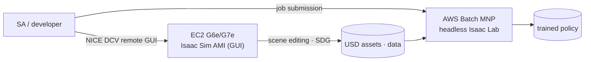
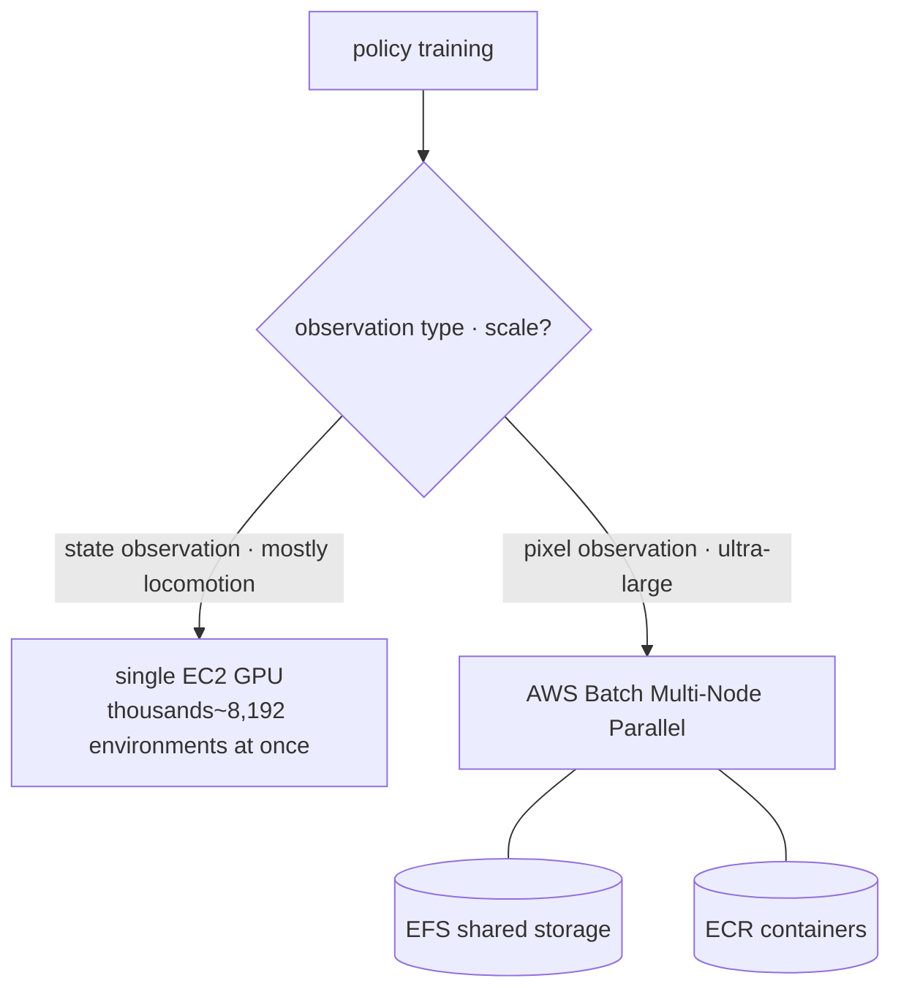
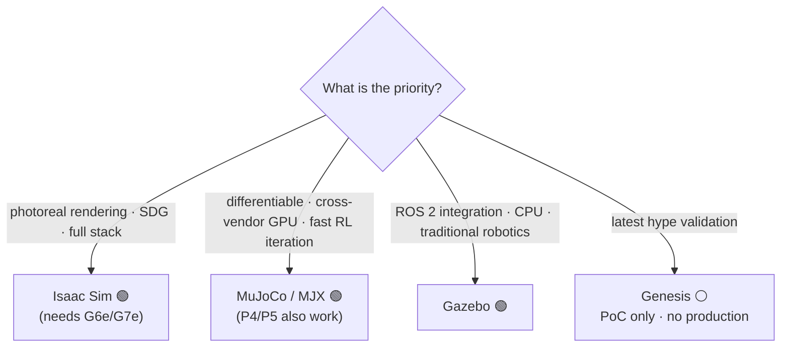

# Pillar 3 — Simulation

_Last updated: 2026-07 · owner: Youngjin · volatility: high (versions/instances change often)_
_Unless separately noted, each item inherits the page metadata (owner/updated/volatility). When an item has its own owner, add an item footer._
[← back to index](index.md)

> **L0 TL;DR**: Robot policies are trained thousands of times faster and more safely in simulation than on real hardware. The right stack on AWS is **EC2 G6e/G7e (RTX GPU) + NVIDIA Isaac Sim AMI (GUI) + AWS Batch (headless[^headless] large-scale RL[^rl])**. ⚠️ **AWS RoboMaker was discontinued 2025-09-10** — never propose it. The latest Isaac Sim GA is **5.1.0**, and 6.0 is still Preview.

---

## Top 3 questions customers ask most in this pillar

1. **"How do I run Isaac Sim/Lab on AWS? On which instances?"** → [Isaac on AWS](#1-isaac-sim--isaac-lab-on-aws--ga)
2. **"How do I scale thousands~tens of thousands of parallel RL environments in the cloud?"** → [Large-scale parallel RL](#2-large-scale-parallel-rl-simulation--ga)
3. **"Do I have to bet everything on NVIDIA? What about open-source alternatives?"** → [Open-source alternatives](#3-open-source-simulator-alternatives--ga---partly-hype), [decisions](decisions.md)

> **Stable principle (rarely changes)**: the value of simulation is (1) **parallelism** (thousands~8,000 environments at once on a single GPU)[^parallel], (2) **safety** (exploring risky policies without breaking real hardware), and (3) **automatic labeling** (perfect ground truth)[^gt]. Rendering **requires an RTX (RT Core)[^rtcore] GPU**, so A100/H100 (compute GPUs) cannot be used for Isaac Sim rendering — an invariant constraint that governs instance selection.

---

## 1. Isaac Sim & Isaac Lab on AWS  🟢 GA

**L0 TL;DR**: The canonical path to running NVIDIA Isaac Sim (simulator) + Isaac Lab (RL framework) on AWS EC2 GPUs. A **free AMI** in the Marketplace makes entry easy.

**Customer need/problem**: "A local workstation GPU isn't enough. I want to use Isaac Sim in the cloud with a GUI, and run training headless at large scale."

**Solution overview** `[1]`:

- **Versions**: latest Isaac Sim **GA = 5.1.0 (2025-10-30)**. **6.0 is Preview** ("Early Developer Release," GTC'26) — even if the GitHub patch tag is mislabeled "GA," **do not call 6.0 GA**. Isaac Lab stable is 2.3.x; 3.0 is beta (introduces the Newton physics engine).
- **License**: Isaac Sim **source is Apache 2.0** (free for commercial). But redistributing/offering-as-SaaS/turnkey-installing the **Omniverse Kit runtime** to third parties requires an **NVIDIA AI Enterprise license**. Not needed for internal R&D or selling only the output. [Isaac Lab](https://github.com/isaac-sim/IsaacLab) is BSD-3.
- **GPU requirement**: **RTX (RT Core) required**. Minimum RTX 4080 (16GB), ideal RTX PRO 6000 Blackwell (48GB). **A100/H100 not supported** (no RT Core).

**AWS mapping** `[1]`:

- **Instances**: G6e (L40S 48GB) / **G7e (RTX PRO 6000 Blackwell 96GB, GA 2026-01)**. The official **[Isaac Sim Development Workstation AMI](https://aws.amazon.com/marketplace/pp/prodview-bl35herdyozhw)** (build 2026.1.1, Ubuntu 24.04, free) supports G6e/G7e, with `g6e.4xlarge` recommended.
- **Access**: remote GUI streaming via [NICE DCV](https://aws.amazon.com/hpc/dcv/) (= Amazon DCV) client/web.
- **Reference architecture**: the **AWS Solutions Guidance "Physical AI for Robotics on AWS"** (Isaac Sim on GPU EC2 + Isaac Lab + SageMaker + IoT Greengrass edge). AWS has a **dedicated Physical AI blog channel** (aws.amazon.com/blogs/physical-ai/).

**Decision criteria**:

- GUI scene editing · SDG[^sdg] → G6e (cost) or G7e (performance, large scenes).
- Large-scale headless RL → item 2 (AWS Batch).
- Whether open source suffices → item 3 / [decisions](decisions.md).

**Customer case**: case pending (for Unitree H1 training, see the AWS blog in [pillar-2](pillar-2.md)).

**➡️ Next action**: use **"a 30-minute hands-on launching the Marketplace Isaac Sim AMI on g6e.4xlarge and connecting via NICE DCV"** as the first proposal, then connect to headless training with **[pai-sim-isaaclab end-to-end hands-on](https://github.com/comeddy/pai-sim-isaaclab)** (Terraform provisions g6e → Isaac Lab quadruped PPO[^ppo] headless training → policy export, ~2h/$12). If license questions arise, precisely explain "source is Apache, but redistribution/SaaS requires AI Enterprise."

**🔗 Related assets**:

- Playbook: [pillar-2 training stack](pillar-2.md) · [pillar-1 synthetic data](pillar-1.md) · [decisions](decisions.md)
- [NVIDIA Isaac Lab on AWS workshop](https://catalog.us-east-1.prod.workshops.aws/workshops/075ce3fe-6888-4ea9-986e-5bdd1b767ef7/en-US) — Batch MNP headless RL
- [Physical AI E2E workshop](https://hi-space.gitbook.io/physical-ai-on-aws/guide/e2e-workshop) — Korean. Isaac Lab RL + Batch track
- [(internal) AWS·NVIDIA robotics reference architecture](https://gitlab.aws.dev/yhyoo/aws-nvidia-robotics-reference-architecture) — AWS internal network required
- [Physical AI Scaffolding Kit — Isaac Sim workstation](https://github.com/aws-samples/sample-physical-ai-scaffolding-kit) — aws-samples. Isaac Sim/Lab dev environment on EC2
- [VLA Simulator — 1-Click VLA simulation on AWS](https://github.com/aws-samples/sample-vla-simulator-on-aws) — aws-samples. Demo/benchmark GR00T N1.7/N1.6·π0.5·OpenVLA-OFT·LAP-3B·MolmoAct2·RLDX-1 on LIBERO/RoboCasa/SimplerEnv/Isaac Lab via one-command CDK deploy to EC2 GPU (g5/g6/g6e); results as MP4→S3+SNS, auto-terminating EC2. Measured per-policy success rates and validation dates documented

🔄 Volatile data (versions — checked 2026-07, some years to be re-confirmed on GitHub)

| Component | Status | Note |
|---|---|---|
| Isaac Sim 5.1.0 | 🟢 GA (2025-10-30) | latest GA |
| Isaac Sim 6.0 | 🟡 Preview | Early Dev Release, PhysX+Newton multi-backend |
| Isaac Lab 2.3.x | 🟢 GA | compatible with Isaac Sim 5.1 |
| Isaac Lab 3.0 | 🟡 beta | Newton physics engine |
| Isaac Sim AMI | 🟢 GA | build 2026.1.1, G6e/G7e |

---

## 2. Large-scale parallel RL simulation  🟢 GA

**L0 TL;DR**: Isaac Lab simulates **thousands~8,192 environments at once on a single GPU**. On AWS, the official path for headless large-scale RL is **AWS Batch (Multi-Node Parallel)**.

**Customer need/problem**: "Training a single policy takes days. I want to mass-parallelize environments and scale across multiple nodes."

**Solution overview** `[1]/[3]`:

- Isaac Lab **simulates thousands~8,000 environments at once on a single GPU** and scales near-linearly across multiple nodes (concrete numbers in the collapsed block below — always cite with measurement conditions).
- **[AWS Batch Multi-Node Parallel Jobs](https://docs.aws.amazon.com/batch/latest/userguide/multi-node-parallel-jobs.html)** is the AWS-recommended orchestrator (also the RoboMaker migration path). The AWS HPC/Physical AI blog has an Isaac Lab on G6e + Batch MNP + EFS + ECR reference.

🔄 Volatile data (benchmarks — NVIDIA official performance benches, "with training" basis, checked 2026-07)

| Task | Envs | GPU | Throughput |
|---|---|---|---|
| Cartpole-Direct | 4,096 | 1×RTX 4090 | 510,000 FPS |
| Humanoid (Velocity-Rough-G1) | 4,096 | 1×RTX 4090 | 82,000 FPS |
| Cartpole-Direct | 4,096 | 16×L40 (4 nodes) | 3,500,000 FPS |
| Precise manipulation (Repose-Cube-Shadow) | 8,192 | 1×RTX 4090 | 170,000 FPS |

_Source: isaac-sim.github.io/IsaacLab performance benchmarks `[1]`_

**AWS mapping** `[1]`: **AWS Batch (MNP)** + EFS (shared storage) + ECR (containers) + G6e/G5. On the NVIDIA side, OSMO handles multi-node orchestration. ⚠️ **There is no official Isaac reference architecture for EKS · ParallelCluster** — Batch is the documented path.

**Decision criteria**:

- Single GPU with thousands of environments is enough (most locomotion) → single EC2 instance.
- Multi-node needed (ultra-large, pixel observations) → **AWS Batch MNP**.
- Want to integrate the training loop with SageMaker → the Isaac Lab on SageMaker blog in [pillar-2](pillar-2.md).

**Customer case**: **Unitree H1 RL (Isaac Lab on SageMaker)** — see [pillar-2](pillar-2.md).

**➡️ Next action**: **draw the "scale Isaac Lab parallel RL with AWS Batch MNP" architecture**, and judge scaling by whether the customer's task is pixel-observation (→ multi-node needed) or state-observation (→ single GPU is enough). When citing benchmarks, always include measurement conditions (env count · GPU).

**🔗 Related assets**: [pillar-2 HyperPod](pillar-2.md) · [decisions: securing GPUs](decisions.md)

---

## 3. Open-source simulator alternatives  🟢 GA / ⚪ partly Hype

**L0 TL;DR**: If you dislike the NVIDIA full stack, or for certain workloads open source is better. **MuJoCo (+MJX)** is the most reliable alternative (Unitree actually uses it), **Gazebo** is the ROS-native standard, and **Genesis** is under-validated relative to its hype (the famous "430,000×" claim was refuted).

**Customer need/problem**: "NVIDIA lock-in is a burden" / "ROS integration comes first" / "I need differentiable physics."

**Solution overview** `[1]`:

- **[MuJoCo / MJX](https://github.com/google-deepmind/mujoco)** — the C engine is GA (v3.10), **MJX-JAX** is a mature RL workhorse (differentiable, cross-vendor), and **MuJoCo Warp is Alpha** (not production). **Unitree maintains its own MuJoCo repo for Go2/G1/H1 RL = real vendor adoption**. [MuJoCo Playground](https://playground.mujoco.org/) is RSS 2025 validated, sim-to-real on 6 platforms.
- **[Gazebo](https://gazebosim.org/)** — latest LTS **Jetty** (2025-09), **Harmonic** is the most widely deployed. ROS 2 native. ⚠️ **Gazebo Classic 11 is EOL as of 2025-01** — no Classic for new projects. CPU-based, so unsuited for GPU parallel RL (an Isaac complement).
- **[Genesis](https://github.com/Genesis-Embodied-AI/Genesis)** — Apache 2.0, active, but the **"43M FPS / 430,000×" claim is refuted on realistic workloads** (actually 3~10× slower than ManiSkill on contact-rich manipulation). Not validated as an Isaac replacement → **⚪ hype caution**.

**AWS mapping**: all runnable on EC2. MuJoCo/MJX (JAX) can **also use A100/H100 (P4/P5)** (no RTX rendering needed) — unlike Isaac, being able to use compute GPUs is an advantage. Large scale via AWS Batch.

**Decision criteria** (details → [decisions](decisions.md)):

- Photoreal rendering · SDG · full stack → **Isaac Sim**.
- Differentiable · lightweight · cross-vendor GPU · fast RL iteration → **MuJoCo/MJX**.
- ROS 2 integration · CPU · traditional robotics → **Gazebo**.
- Genesis → PoC/experiment only, no production dependence.

**Customer case**: **Unitree** (MuJoCo, training on production HW).

**➡️ Next action**: for customers worried about "NVIDIA lock-in," present the **neutral position "AWS runs Isaac, MuJoCo, and Gazebo all well — just choose by workload."** With MuJoCo, emphasize the cost benefit of being able to reuse compute GPUs (P5).

**🔗 Related assets**: [decisions: NVIDIA vs open source](decisions.md)

---

## 4. NVIDIA Cosmos 3 (world foundation model)  🟢 GA · ⚠️ not hosted on AWS

**L0 TL;DR**: A foundation model that generates, reasons about, and simulates the physical world. **Commercially usable (OpenMDW-1.1)**. ⚠️ But **AWS did not make the list as an official Cosmos 3 cloud host** (Azure/CoreWeave/Baseten and others host it) — a competitive reality an SA should know.

**Customer need/problem**: "We want to generate diverse real-world scenarios for training/evaluation." (For the data-generation angle, see [pillar-1](pillar-1.md).)

**Solution overview** `[1]`: **[Cosmos 3](https://www.nvidia.com/en-us/ai/cosmos/)** (GA at GTC Taipei 2026-05-31) is the current flagship — Reasoner (VLM) + Generator (diffusion), MoT architecture. **Super 64B** (data center), **Nano 16B** (RTX PRO 6000, real-time robotics, includes Nano-Policy-DROID), **Edge** (Jetson, planned — parameters undisclosed). License **OpenMDW-1.1 (commercial OK)**. Distributed on HF/GitHub/NGC. ⚠️ The old Predict/Transfer/Reason lineup is in maintenance mode (advised to migrate to Cosmos 3).

**AWS mapping**: **weak direct mapping** — Cosmos 3 does not have AWS as a named host. But because the weights are open (HF/GitHub), it **can be self-hosted on EC2 G7e (Nano 16B, RTX PRO 6000)**. That's AWS's angle: "not a managed host, but you can run it directly on the optimal GPU."

**Decision criteria**: need managed Cosmos NIM → another cloud. Open-weight self-hosting · data sovereignty · integration with an existing AWS stack → EC2 G7e.

**Customer case** (⚠️ announced only, not production-validated): many Korean companies announced as Cosmos 3 adopters, including **Doosan Robotics, LG Electronics, Samsung Electronics** — high Korean relevance, but "announced adoption," not validated production.

**➡️ Next action**: when a Korean customer is interested in Cosmos 3 → respond with a **"self-host Cosmos 3 Nano on AWS G7e" PoC** (turning the absence of managed hosting into a self-hosting + data-sovereignty strength).

**🔗 Related assets**: [pillar-1 Cosmos data generation](pillar-1.md) · [pillar-4 sim-to-real](pillar-4.md)

---

## 5. Digital twin — IoT TwinMaker & Omniverse on AWS  🟢 GA (low velocity)

**L0 TL;DR**: **AWS IoT TwinMaker was not discontinued** (the third-party "discontinued" claim is misinformation, confused with SiteWise maintenance). It is GA and open to new customers, but **new features are slow** (low velocity). Omniverse is also GA via an AWS Marketplace AMI.

**Customer need/problem**: "We want to build a digital twin[^dtwin] of our equipment/factory and connect it to robot simulation and monitoring."

**Solution overview** `[1]`:

- **[AWS IoT TwinMaker](https://aws.amazon.com/iot-twinmaker/)** — GA, official product page active, no discontinuation banner (confirmed 2026-07-11). ⚠️ The "discontinued" claim from innfactory.de/oneuptime.com etc. is an **unverified rumor**; do not repeat. But with no major new features in 2025~26, it is **low velocity**.
- **NVIDIA Omniverse on AWS** — Marketplace AMI (Developer/Production, Linux/Windows). Runs on **EC2 G6e/G7e**. The Production AMI is a paid subscription bundling an AI Enterprise license + support. ⚠️ **There is no dedicated "OVX" instance family** — Omniverse on AWS = G6e/G7e + AMI. There is no clear basis for a managed "Omniverse Enterprise on AWS."

🔄 Volatile data (AMI versions/pricing — checked 2026-07)

| Item | Value |
|---|---|
| Latest AMI | 2026.1.0 (Ubuntu 24.04, 2026 Q1 Refresh) |
| Production AMI subscription | ~$1.00/hr (Marketplace listed price, includes AI Enterprise + support) |

**AWS mapping**: IoT TwinMaker + IoT SiteWise + Omniverse AMI (G6e/G7e).

**Decision criteria**: equipment data integration · lightweight twin → TwinMaker (given the low velocity). Photoreal simulation · USD[^usd] collaboration → Omniverse AMI.

**Customer case**: case pending.

**➡️ Next action**: if the customer asks "isn't TwinMaker dead?", **correct it immediately** ("GA, open to new customers, just low velocity"). If they want twin + simulation integration, connect to the Omniverse AMI. If they ask "is there OVX?", answer precisely "no, G6e/G7e + AMI."

**🔗 Related assets**:

- Playbook: [pillar-1](pillar-1.md)
- [AWS IoT TwinMaker end-to-end workshop](https://catalog.us-east-1.prod.workshops.aws/workshops/4b8a4050-893e-40f3-9788-8256025024b4/en-US)
- [Omniverse digital twin hands-on](https://github.com/kimjoonhyung/nvidia-omniverse-digital-twin) — Korean. Isaac Sim + Kinesis real-time data, CDK
- (internal digital twin workshop — confirm needed ⚠️)

---

## The honest reality of this pillar (SA must-read)

- **AWS RoboMaker is dead (support ended 2025-09-10).** Never present it as an option. The successor stack = EC2 G6e/G7e + Isaac Sim AMI + AWS Batch MNP.
- **Isaac Sim 6.0 is not GA (Preview).** The latest GA is 5.1.0. Don't be fooled by the GitHub patch-tag label.
- **AWS is not a named Cosmos 3 host** (Azure/CoreWeave host it). Responding with self-hosting (G7e) is the honest angle.
- **A100/H100 cannot render in Isaac Sim** (no RT Core). Rendering is G6e/G7e; compute RL can also use P5 (MuJoCo).
- **The TwinMaker discontinuation story is a rumor** — correct it, but honestly acknowledge "low velocity."
- **Genesis "430,000×" is refuted**, **MuJoCo Warp is Alpha**, **Unity Robotics Hub is effectively abandoned (since 2022)**, **Habitat has been unmaintained since v0.3.4** — do not exaggerate open-source maturity.

---
_owner: Youngjin · updated: 2026-07 · volatility: high (versions · instances are managed in the collapsed block) · sources: [1] official/paper, [3] vendor, [4] unverified. Some GitHub release years advised to re-confirm._

<!-- 용어 각주 -->

[^rl]: **Reinforcement learning (RL)** — training a policy through trial and error to maximize a reward signal. In simulation, thousands of parallel environments let robots learn control policies such as locomotion quickly.
[^parallel]: **Parallel environments** — replicating the same simulation environment thousands of times on a single GPU and running them simultaneously. Speeds up RL experience collection by thousands of times — the core value of simulation.
[^headless]: **Headless** — running the simulator without a GUI. No rendering overhead, so large-scale parallel training jobs run headless.
[^rtcore]: **RT Core / RTX GPU** — the NVIDIA GPU family with dedicated ray-tracing hardware (RT Cores). Required for Isaac Sim's photoreal rendering, so A100/H100 (no RT Cores) cannot be used for rendering.
[^gt]: **Ground truth** — the exact answer data that serves as the reference for training and evaluation. In simulation the engine already knows every object's position and segmentation mask, so perfect labels are generated automatically.
[^usd]: **USD (Universal Scene Description)** — the standard 3D scene description format created by Pixar. Isaac Sim scenes, robots, and assets are all described in USD; it is the common language of the Omniverse ecosystem.
[^sdg]: **Synthetic Data Generation (SDG)** — a technique that uses a simulator to auto-generate training images and annotations (labels). Its biggest advantage: labeling cost converges to zero. 🎥 [Isaac Sim Replicator SDG tutorial](https://www.youtube.com/watch?v=HHzNIh72B_Y)
[^ppo]: **PPO (Proximal Policy Optimization)** — the most widely used reinforcement learning algorithm. Converges stably and is the de facto default for robot locomotion training.
[^dtwin]: **Digital twin** — A physically faithful virtual replica of a real factory, warehouse, or robot. Enables policy training, validation, and scenario experiments without touching the real environment.
