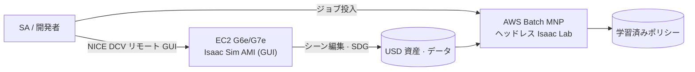
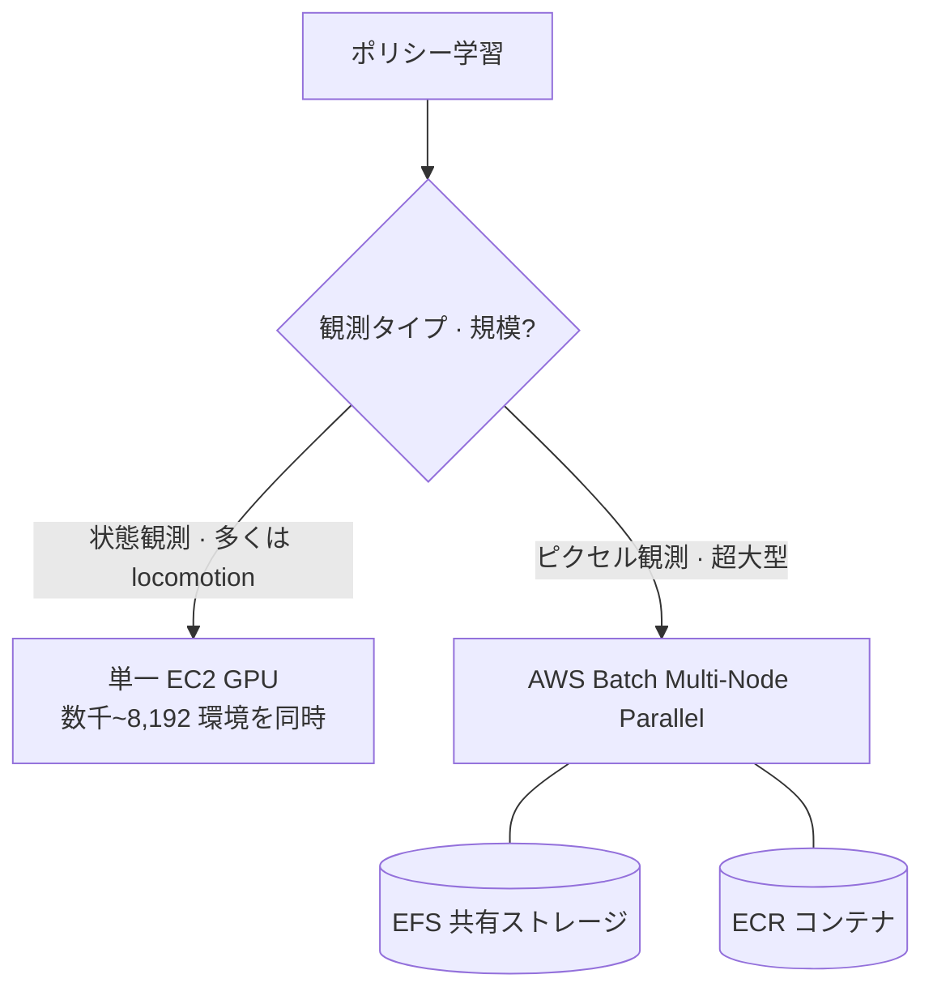
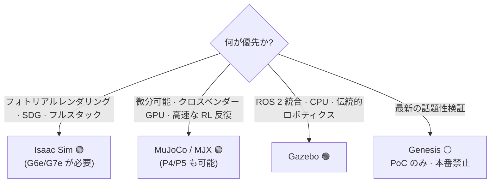

# Pillar 3 — シミュレーション (Simulation)

_最終更新: 2026-07 · owner: comeddy · volatility: 高（バージョン・インスタンスが頻繁に変わる）_
_特に別途表記がない限り、各項目はページメタデータ（owner/updated/volatility）を継承します。項目ごとに owner を指定する場合は項目フッターに追記します。_
[← index へ](index.md)

> **L0 TL;DR**: ロボットポリシーはシミュレーションで実機よりも数千倍速く安全に学習されます。AWS での正解スタックは **EC2 G6e/G7e(RTX GPU) + NVIDIA Isaac Sim AMI(GUI) + AWS Batch(ヘッドレス大規模 RL)** です。⚠️ **AWS RoboMaker は 2025-09-10 に終了** —— 絶対に提案しないでください。Isaac Sim の最新 GA は **5.1.0** で、6.0 はまだ Preview です。

---

## このピラーで顧客が最もよく聞く質問 Top 3

1. **「Isaac Sim/Lab を AWS でどう動かしますか? どのインスタンスで?」** → [Isaac on AWS](#1-isaac-sim--isaac-lab-on-aws--ga)
2. **「数千~数万環境の並列 RL をクラウドでどうスケールしますか?」** → [大規模並列 RL](#2-大規模並列-rl-シミュレーション--ga)
3. **「NVIDIA に全部賭けるべきですか? オープンソースの代替は?」** → [オープンソース代替](#3-オープンソースシミュレーター代替--ga---一部-hype)、[decisions](decisions.md)

> **安定原理（あまり変わらない）**: シミュレーションの価値は (1) **並列性**（GPU 1 枚で数千~8 千環境を同時に）、(2) **安全**（実機を破損せずに危険なポリシーを探索）、(3) **自動ラベル**（完璧な ground truth）にあります。レンダリングには **RTX(RT Core) GPU が必須**なので、A100/H100（コンピュート GPU）は Isaac Sim のレンダリングには使えません —— これはインスタンス選択を左右する不変の制約です。

---

## 1. Isaac Sim & Isaac Lab on AWS  🟢 GA

**L0 TL;DR**: NVIDIA Isaac Sim（シミュレーター）+ Isaac Lab（RL フレームワーク）を AWS EC2 GPU 上で動かす王道の経路です。Marketplace に**無料 AMI** があり、導入が容易です。

**顧客ニーズ/課題**: 「ローカルワークステーションの GPU では不足している。Isaac Sim をクラウドで GUI で使い、学習はヘッドレスで大規模に動かしたい。」

**ソリューション概要** `[1]`:

- **バージョン**: Isaac Sim の最新 **GA = 5.1.0(2025-10-30)**。**6.0 は Preview**（"Early Developer Release", GTC'26）—— たとえ GitHub のパッチタグが誤って "GA" と付いていても、**6.0 を GA と言わないでください**。Isaac Lab 安定版は 2.3.x、3.0 は beta（Newton 物理エンジンを導入）。
- **ライセンス**: Isaac Sim の**ソースは Apache 2.0**（商用無料）。ただし **Omniverse Kit ランタイム**を第三者再配布/SaaS 提供/ターンキー設置する場合は、**NVIDIA AI Enterprise ライセンスが必要**です。社内 R&D や成果物のみを販売する場合は不要。[Isaac Lab](https://github.com/isaac-sim/IsaacLab) は BSD-3。
- **GPU 要件**: **RTX(RT Core) 必須**。最低 RTX 4080(16GB)、理想は RTX PRO 6000 Blackwell(48GB)。**A100/H100 非対応**（RT Core なし）。

**AWS マッピング** `[1]`:

- **インスタンス**: G6e(L40S 48GB) / **G7e(RTX PRO 6000 Blackwell 96GB, 2026-01 GA)**。公式 **[Isaac Sim Development Workstation AMI](https://aws.amazon.com/marketplace/pp/prodview-bl35herdyozhw)**(build 2026.1.1, Ubuntu 24.04, 無料)が G6e・G7e に対応、`g6e.4xlarge` 推奨。
- **接続**: [NICE DCV](https://aws.amazon.com/hpc/dcv/)(=Amazon DCV) クライアント/ウェブでリモート GUI ストリーミング。
- **リファレンスアーキテクチャ**: **AWS Solutions Guidance "Physical AI for Robotics on AWS"**(Isaac Sim on GPU EC2 + Isaac Lab + SageMaker + IoT Greengrass エッジ)。AWS に **Physical AI 専用ブログチャンネル**(aws.amazon.com/blogs/physical-ai/) が存在します。

**意思決定基準**:

- GUI シーン編集・SDG → G6e（コスト）または G7e（性能・大きなシーン）。
- 大規模ヘッドレス RL → 2 番（AWS Batch）。
- オープンソースで十分か → 3 番 / [decisions](decisions.md)。

**顧客事例**: 事例待ち（Unitree H1 学習は [pillar-2](pillar-2.md) の AWS ブログを参照）。

**➡️ 次のアクション**: **「Marketplace の Isaac Sim AMI を g6e.4xlarge に立ち上げ、NICE DCV で接続する 30 分ハンズオン」** を最初の提案に、続いて **[pai-sim-isaaclab エンドツーエンドハンズオン](https://github.com/comeddy/pai-sim-isaaclab)**（Terraform で g6e をプロビジョニング → Isaac Lab 四足歩行 PPO ヘッドレス学習 → ポリシー export、約2時間/$12）でヘッドレス学習まで接続。ライセンスの質問が出たら「ソースは Apache だが再配布/SaaS なら AI Enterprise が必要」を正確に案内。

**🔗 関連資産**: [pillar-2 学習スタック](pillar-2.md) · [pillar-1 合成データ](pillar-1.md) · [decisions](decisions.md) · [NVIDIA Isaac Lab on AWS ワークショップ（Batch MNP ヘッドレス RL）](https://catalog.us-east-1.prod.workshops.aws/workshops/075ce3fe-6888-4ea9-986e-5bdd1b767ef7/en-US)

🔄 揮発性データ（バージョン —— 2026-07 確認、一部の年は GitHub で再確認が必要）

| コンポーネント | 状態 | 備考 |
|---|---|---|
| Isaac Sim 5.1.0 | 🟢 GA (2025-10-30) | 最新 GA |
| Isaac Sim 6.0 | 🟡 Preview | Early Dev Release, PhysX+Newton マルチバックエンド |
| Isaac Lab 2.3.x | 🟢 GA | Isaac Sim 5.1 互換 |
| Isaac Lab 3.0 | 🟡 beta | Newton 物理エンジン |
| Isaac Sim AMI | 🟢 GA | build 2026.1.1, G6e/G7e |

---

## 2. 大規模並列 RL シミュレーション  🟢 GA

**L0 TL;DR**: Isaac Lab は **GPU 1 枚で数千~8,192 個の環境を同時に**シミュレーションします。AWS でヘッドレス大規模 RL を行う公式経路は **AWS Batch(Multi-Node Parallel)** です。

**顧客ニーズ/課題**: 「ポリシー 1 つの学習に数日かかる。環境を大量に並列化し、複数ノードでスケールしたい。」

**ソリューション概要** `[1]/[3]`:

- Isaac Lab は **GPU 1 枚で数千~8 千環境を同時にシミュレーション**し、マルチノードでほぼ線形にスケールします（具体的な数値は下の折りたたみブロック —— 引用時は必ず測定条件を併記）。
- **[AWS Batch Multi-Node Parallel Jobs](https://docs.aws.amazon.com/batch/latest/userguide/multi-node-parallel-jobs.html)** が AWS 推奨のオーケストレーター（RoboMaker の移行経路でもある）。AWS HPC/Physical AI ブログに Isaac Lab on G6e + Batch MNP + EFS + ECR のリファレンスが存在します。

🔄 揮発性データ（ベンチマーク —— NVIDIA 公式性能ベンチ, "with training" 基準, 2026-07 確認）

| タスク | 環境数 | GPU | スループット |
|---|---|---|---|
| Cartpole-Direct | 4,096 | 1×RTX 4090 | 510,000 FPS |
| ヒューマノイド(Velocity-Rough-G1) | 4,096 | 1×RTX 4090 | 82,000 FPS |
| Cartpole-Direct | 4,096 | 16×L40 (4 ノード) | 3,500,000 FPS |
| 精密操作(Repose-Cube-Shadow) | 8,192 | 1×RTX 4090 | 170,000 FPS |

_出典: isaac-sim.github.io/IsaacLab performance benchmarks `[1]`_

**AWS マッピング** `[1]`: **AWS Batch(MNP)** + EFS（共有ストレージ）+ ECR（コンテナ）+ G6e/G5。NVIDIA 側は OSMO でマルチノードオーケストレーション。⚠️ **EKS・ParallelCluster 向けの Isaac 公式リファレンスアーキテクチャはない** —— Batch が文書化された経路です。

**意思決定基準**:

- 単一 GPU で数千環境が十分（多くの locomotion）→ EC2 単一インスタンス。
- マルチノードが必要（超大型・ピクセル観測）→ **AWS Batch MNP**。
- SageMaker で学習ループを統合したい → [pillar-2](pillar-2.md) の Isaac Lab on SageMaker ブログ。

**顧客事例**: **Unitree H1 RL(Isaac Lab on SageMaker)** —— [pillar-2](pillar-2.md) を参照。

**➡️ 次のアクション**: **「AWS Batch MNP で Isaac Lab 並列 RL をスケール」アーキテクチャを描き**、顧客のタスクがピクセル観測か（→ マルチノードが必要）状態観測か（→ 単一 GPU で十分）でスケールを判断。ベンチマーク引用時は必ず測定条件（環境数・GPU）を併記。

**🔗 関連資産**: [pillar-2 HyperPod](pillar-2.md) · [decisions: GPU 確保](decisions.md)

---

## 3. オープンソースシミュレーター代替  🟢 GA / ⚪ 一部 Hype

**L0 TL;DR**: NVIDIA フルスタックが好みでない、あるいは特定ワークロードにはオープンソースの方が良い場合。**MuJoCo(+MJX)** が最も信頼できる代替（Unitree が実際に使用）、**Gazebo** は ROS ネイティブ標準、**Genesis** は話題性の割に検証が不十分（有名な "430,000 倍" の主張は反論されている）。

**顧客ニーズ/課題**: 「NVIDIA 依存が負担」 / 「ROS 統合が優先」 / 「微分可能物理が必要」。

**ソリューション概要** `[1]`:

- **[MuJoCo / MJX](https://github.com/google-deepmind/mujoco)** —— C エンジンは GA(v3.10)、**MJX-JAX** は成熟した RL の主力（微分可能、クロスベンダー）、**MuJoCo Warp は Alpha**（本番ではない）。**Unitree が Go2/G1/H1 の RL に自前の MuJoCo リポジトリを維持 = 実際のベンダー採用**。[MuJoCo Playground](https://playground.mujoco.org/) は RSS 2025 で検証、6 プラットフォームで sim-to-real。
- **[Gazebo](https://gazebosim.org/)** —— 最新 LTS は **Jetty**(2025-09)、**Harmonic** が最も広く展開。ROS 2 ネイティブ。⚠️ **Gazebo Classic 11 は 2025-01 に EOL** —— 新規プロジェクトでは Classic 禁止。CPU ベースのため GPU 並列 RL には不向き（Isaac の補完）。
- **[Genesis](https://github.com/Genesis-Embodied-AI/Genesis)** —— Apache 2.0、活発だが**「43M FPS/430,000 倍」の主張は現実のワークロードで反論されている**（接触の多い操作ではむしろ ManiSkill より 3~10 倍遅い）。Isaac の代替としては未検証 → **⚪ 誇張に注意**。

**AWS マッピング**: すべて EC2 で実行可能。MuJoCo/MJX(JAX) は **A100/H100(P4/P5) も活用可能**（RTX レンダリング不要）—— Isaac と異なりコンピュート GPU を使えるのが利点。大規模は AWS Batch。

**意思決定基準**（詳細 → [decisions](decisions.md)）:

- フォトリアルレンダリング・SDG・フルスタック → **Isaac Sim**。
- 微分可能・軽量・クロスベンダー GPU・高速な RL 反復 → **MuJoCo/MJX**。
- ROS 2 統合・CPU・伝統的ロボティクス → **Gazebo**。
- Genesis → PoC/実験のみ、本番依存は禁止。

**顧客事例**: **Unitree**（MuJoCo、本番 HW の学習）。

**➡️ 次のアクション**: 「NVIDIA 依存」を懸念する顧客に **「AWS は Isaac も MuJoCo/Gazebo もどれもうまく動かせる —— ワークロードで選べばよい」** という中立ポジションを提示。MuJoCo ならコンピュート GPU(P5) を再活用できるというコスト面の利点を強調。

**🔗 関連資産**: [decisions: NVIDIA vs オープンソース](decisions.md)

---

## 4. NVIDIA Cosmos 3（ワールド基盤モデル）  🟢 GA · ⚠️ AWS 未ホスティング

**L0 TL;DR**: 物理世界を生成・推論・シミュレーションする基盤モデル。**商用利用可能(OpenMDW-1.1)**。⚠️ しかし **AWS は公式 Cosmos 3 クラウドホストとして名を連ねられていません**（Azure/CoreWeave/Baseten などがホスト）—— SA が知っておくべき競争の現実です。

**顧客ニーズ/課題**: 「多様な現実シナリオを生成して学習/評価に使いたい。」（データ生成の観点は [pillar-1](pillar-1.md)）

**ソリューション概要** `[1]`: **[Cosmos 3](https://www.nvidia.com/en-us/ai/cosmos/)**(2026-05-31 GTC Taipei GA) が現行フラッグシップ —— Reasoner(VLM) + Generator(diffusion)、MoT アーキテクチャ。**Super 64B**（データセンター）、**Nano 16B**（RTX PRO 6000、リアルタイムロボティクス、Nano-Policy-DROID を含む）、**Edge**（Jetson、予定 —— パラメータ未公開）。ライセンスは **OpenMDW-1.1（商用可能）**。HF/GitHub/NGC で配布。⚠️ 旧 Predict/Transfer/Reason ラインナップはメンテナンスモード（Cosmos 3 への移行を推奨）。

**AWS マッピング**: **直接マッピングは弱い** —— Cosmos 3 は AWS を指定ホストとしていません。ただしオープンウェイト(HF/GitHub)なので、**EC2 G7e(Nano 16B, RTX PRO 6000) でセルフホスティング可能**です。これが AWS の角度: 「マネージドホストではなくとも、最適な GPU で自前で動かせる」。

**意思決定基準**: マネージド Cosmos NIM が必要 → 他のクラウド。オープンウェイトのセルフホスティング・データ主権・既存の AWS スタック統合 → EC2 G7e。

**顧客事例**（⚠️ 発表のみ、本番未検証）: Cosmos 3 の採用企業として **Doosan Robotics、LG Electronics、Samsung Electronics** など韓国企業が多数発表 —— 国内での関連性は高いものの、「発表された採用」であって検証された本番ではありません。

**➡️ 次のアクション**: 国内顧客が Cosmos 3 に関心 → **「AWS G7e で Cosmos 3 Nano をセルフホスティング」PoC** で対応（マネージドホスティングの不在をセルフホスティング+データ主権の強みに転換）。

**🔗 関連資産**: [pillar-1 Cosmos データ生成](pillar-1.md) · [pillar-4 sim-to-real](pillar-4.md)

---

## 5. デジタルツイン — IoT TwinMaker & Omniverse on AWS  🟢 GA（低速度）

**L0 TL;DR**: **AWS IoT TwinMaker は廃止されていません**（第三者の "discontinued" 主張は誤情報 —— SiteWise のメンテナンスとの混同）。GA であり新規顧客に開放されていますが、**新機能の進みが遅い**（低速度）です。Omniverse も AWS Marketplace AMI として GA。

**顧客ニーズ/課題**: 「設備/工場のデジタルツインを作り、ロボットのシミュレーション・監視と連携したい。」

**ソリューション概要** `[1]`:

- **[AWS IoT TwinMaker](https://aws.amazon.com/iot-twinmaker/)** —— GA、公式製品ページは有効、廃止バナーなし（2026-07-11 確認）。⚠️ innfactory.de/oneuptime.com などの "discontinued" 主張は**未検証の噂**であり、繰り返し禁止。ただし 2025~26 に主要な新機能がないため**低速度**。
- **NVIDIA Omniverse on AWS** —— Marketplace AMI(Developer/Production, Linux/Windows)。**EC2 G6e/G7e** で実行。Production AMI は AI Enterprise ライセンス + サポートがバンドルされた有償サブスクリプション。⚠️ **専用の "OVX" インスタンスファミリーはない** —— Omniverse on AWS = G6e/G7e + AMI。マネージドの "Omniverse Enterprise on AWS" は明確な根拠がありません。

🔄 揮発性データ（AMI バージョン・価格 —— 2026-07 確認）

| 項目 | 値 |
|---|---|
| 最新 AMI | 2026.1.0 (Ubuntu 24.04, 2026 Q1 Refresh) |
| Production AMI サブスクリプション | ~$1.00/hr（Marketplace 表示価格、AI Enterprise + サポート込み） |

**AWS マッピング**: IoT TwinMaker + IoT SiteWise + Omniverse AMI(G6e/G7e)。

**意思決定基準**: 設備データ統合・軽量ツイン → TwinMaker（ただし低速度を考慮）。フォトリアルシミュレーション・USD コラボレーション → Omniverse AMI。

**顧客事例**: 事例待ち。

**➡️ 次のアクション**: 顧客が「TwinMaker は死んだと聞いたが?」と聞いたら**即座に訂正**（「GA、新規開放、ただし低速度」）。ツイン+シミュレーション統合を望むなら Omniverse AMI に接続。「OVX はあるか」と聞かれたら「ない、G6e/G7e + AMI」と正確に。

**🔗 関連資産**: [pillar-1](pillar-1.md) · [AWS IoT TwinMaker E2E ワークショップ](https://catalog.us-east-1.prod.workshops.aws/workshops/4b8a4050-893e-40f3-9788-8256025024b4/en-US) — 要確認 ⚠️ · （社内デジタルツインワークショップ —— 要確認 ⚠️）

---

## このピラーの正直な現実（SA 必読）

- **AWS RoboMaker は死んだ（2025-09-10 サポート終了）。** 絶対にオプションとして提示禁止。後続スタック = EC2 G6e/G7e + Isaac Sim AMI + AWS Batch MNP。
- **Isaac Sim 6.0 は GA ではない（Preview）。** 最新 GA は 5.1.0。GitHub のパッチタグラベルに惑わされないこと。
- **AWS は Cosmos 3 の指定ホストではない**（Azure/CoreWeave がホスト）。セルフホスティング(G7e)で対応するのが正直な角度。
- **A100/H100 は Isaac Sim のレンダリング不可**（RT Core なし）。レンダリングは G6e/G7e、コンピュート RL は P5 も可能（MuJoCo）。
- **TwinMaker 廃止説は噂** —— 訂正しつつ「低速度」は正直に認める。
- **Genesis「430,000 倍」は反論済み**、**MuJoCo Warp は Alpha**、**Unity Robotics Hub は事実上放置（2022 年以降）**、**Habitat は v0.3.4 以降メンテナンス停止** —— オープンソースの成熟度を誇張しないこと。

---
_owner: comeddy · updated: 2026-07 · volatility: 高（バージョン・インスタンスは折りたたみブロックで管理）· sources: [1] 公式/論文, [3] ベンダー, [4] 未検証。GitHub リリースの年の一部は再確認を推奨。_
