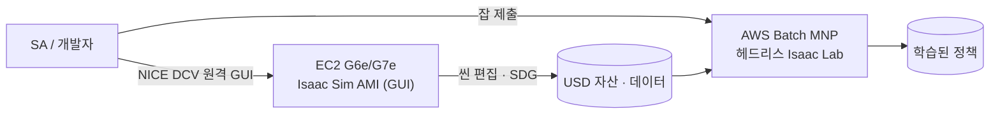
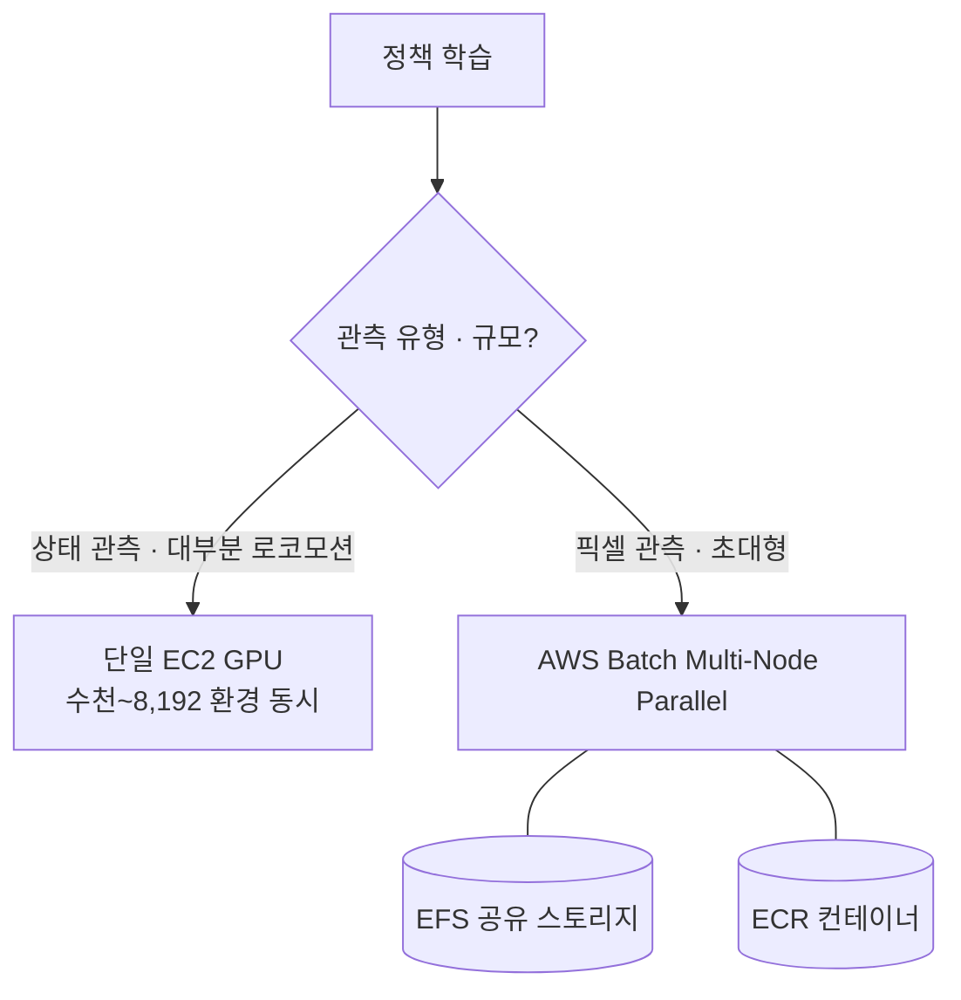
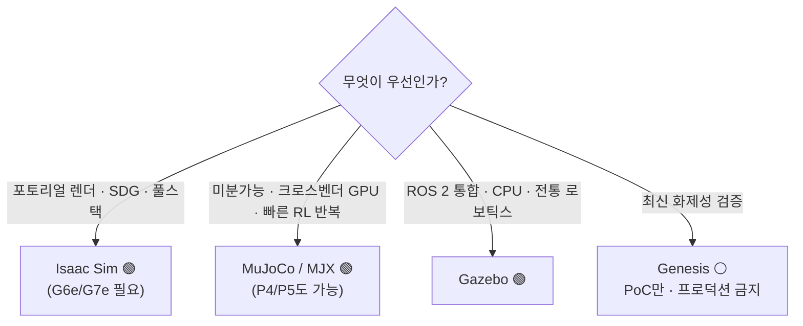

# Pillar 3 — 시뮬레이션 (Simulation)

_최종 갱신: 2026-07 · owner: Youngjin · volatility: 높음(버전·인스턴스가 자주 바뀜)_
_개별 항목은 별도 표기가 없는 한 페이지 메타데이터(owner/updated/volatility)를 상속. 항목별 owner 지정 시 항목 푸터 추가._
[← index로](index.md)

> **L0 TL;DR**: 로봇 정책은 실기체보다 시뮬레이션에서 수천 배 빠르고 안전하게 학습된다. AWS에서의 정답 스택은 **EC2 G6e/G7e(RTX GPU) + NVIDIA Isaac Sim AMI(GUI) + AWS Batch(헤드리스[^headless] 대규모 RL[^rl])** 다. ⚠️ **AWS RoboMaker는 2025-09-10 종료** — 절대 제안하지 말 것. Isaac Sim 최신 GA는 **5.1.0**이며 6.0은 아직 Preview다.

---

## 이 필러에서 고객이 가장 자주 묻는 질문 Top 3

1. **"Isaac Sim/Lab을 AWS에서 어떻게 돌리죠? 어떤 인스턴스로?"** → [Isaac on AWS](#1-isaac-sim--isaac-lab-on-aws--ga)
2. **"수천~수만 환경 병렬 RL을 클라우드에서 어떻게 스케일하죠?"** → [대규모 병렬 RL](#2-대규모-병렬-rl-시뮬레이션--ga)
3. **"NVIDIA에 다 걸어야 하나요? 오픈소스 대안은요?"** → [오픈소스 대안](#3-오픈소스-시뮬레이터-대안--ga---일부-hype), [decisions](decisions.md)

> **안정 원리 (잘 안 바뀜)**: 시뮬레이션의 가치는 (1) **병렬성**(GPU 한 장에서 수천~8천 환경 동시)[^parallel], (2) **안전**(실기체 파손 없이 위험 정책 탐색), (3) **자동 라벨**(완벽한 ground truth)[^gt]. 렌더링에는 **RTX(RT Core)[^rtcore] GPU가 필수**라 A100/H100(컴퓨트 GPU)은 Isaac Sim 렌더링에 못 쓴다 — 이건 인스턴스 선택을 좌우하는 불변 제약.

---

## 1. Isaac Sim & Isaac Lab on AWS  🟢 GA

**L0 TL;DR**: NVIDIA Isaac Sim(시뮬레이터) + Isaac Lab(RL 프레임워크)을 AWS EC2 GPU 위에서 돌리는 정석 경로. Marketplace에 **무료 AMI**가 있어 진입이 쉽다.

**고객 니즈/문제**: "로컬 워크스테이션 GPU로는 부족하다. Isaac Sim을 클라우드에서 GUI로 쓰고, 학습은 헤드리스로 대규모로 돌리고 싶다."

**솔루션 개요** `[1]`:

- **버전**: Isaac Sim 최신 **GA = 5.1.0(2025-10-30)**. **6.0은 Preview**("Early Developer Release", GTC'26) — GitHub 패치태그가 "GA"로 잘못 붙어있어도 **6.0을 GA로 말하지 말 것**. Isaac Lab 안정판 2.3.x, 3.0은 beta(Newton 물리엔진 도입).
- **라이선스**: Isaac Sim **소스는 Apache 2.0**(상업 무료). 단 **Omniverse Kit 런타임**을 3자 재배포/SaaS 제공/턴키 설치하면 **NVIDIA AI Enterprise 라이선스 필요**. 내부 R&D나 결과물만 판매하면 불필요. [Isaac Lab](https://github.com/isaac-sim/IsaacLab)은 BSD-3.
- **GPU 요구**: **RTX(RT Core) 필수**. 최소 RTX 4080(16GB), 이상적 RTX PRO 6000 Blackwell(48GB). **A100/H100 미지원**(RT Core 없음).

**스택 구성요소가 실제로 해주는 것** `[1]` (docs 2026-07 확인):

| 구성요소 | 기술 요약 | 시뮬레이션 관점 |
|---|---|---|
| **Isaac Sim** | RTX 레이트레이싱 기반 고충실 시뮬레이터 — USD 씬, 카메라·LiDAR 등 센서 시뮬, Replicator SDG | 사실적 렌더링이 필요한 인식·합성 데이터 축 |
| **Isaac Lab** | Isaac Sim 위의 RL/모방학습 프레임워크 — GPU 한 장에서 수천 병렬 환경, skrl·rsl_rl 등 라이브러리 연동 | 보행·조작 정책 학습의 표준 진입점 |
| **Marketplace AMI** | Isaac Sim 사전 구성 이미지(무료) — 드라이버·의존성 설치 없이 부팅 즉시 사용 | "30분 핸즈온"을 가능하게 하는 진입 장벽 제거 |
| **NICE DCV** | AWS 원격 디스플레이 프로토콜 — 고화질·저지연 스트리밍, EC2에서 추가 라이선스 비용 없음 | 클라우드 GPU의 Isaac Sim GUI를 로컬처럼 조작 |
| **AWS Batch MNP** | 멀티노드 병렬[^mnp] 배치 잡 — 컨테이너 잡을 여러 노드에 걸쳐 큐·스케줄링 | GUI 없는 헤드리스 대규모 RL 잡의 병렬화(2번) |
| **G6e / G7e** | RT Core 탑재 렌더링 가능 GPU 인스턴스 | 안정 원리의 불변 제약(A100/H100 불가)을 만족하는 유일 계열 |

**AWS 매핑** `[1]`:

- **인스턴스**: G6e(L40S 48GB) / **G7e(RTX PRO 6000 Blackwell 96GB, 2026-01 GA)**. 공식 **[Isaac Sim Development Workstation AMI](https://aws.amazon.com/marketplace/pp/prodview-bl35herdyozhw)**(build 2026.1.1, Ubuntu 24.04, 무료)가 G6e·G7e 지원, `g6e.4xlarge` 권장.
- **접속**: [NICE DCV](https://aws.amazon.com/hpc/dcv/)(=Amazon DCV) 클라이언트/웹으로 원격 GUI 스트리밍.
- **참조 아키텍처**: **AWS Solutions Guidance "Physical AI for Robotics on AWS"**(Isaac Sim on GPU EC2 + Isaac Lab + SageMaker + IoT Greengrass 엣지). AWS에 **Physical AI 전용 블로그 채널**(aws.amazon.com/blogs/physical-ai/) 존재.

**의사결정 기준**:

- GUI 씬 편집·SDG[^sdg] → G6e(비용) 또는 G7e(성능·큰 씬).
- 대규모 헤드리스 RL → 2번(AWS Batch).
- 오픈소스로 충분한지 → 3번 / [decisions](decisions.md).

**고객 사례**: 사례 대기 (Unitree H1 학습은 [pillar-2](pillar-2.md)의 AWS 블로그 참조).

**➡️ 다음 액션**: **"Marketplace Isaac Sim AMI를 g6e.4xlarge에 띄우고 NICE DCV로 접속하는 30분 핸즈온"** 을 첫 제안으로, 이어서 **[pai-sim-isaaclab 엔드투엔드 핸즈온](https://github.com/comeddy/pai-sim-isaaclab)**(Terraform으로 g6e 프로비저닝 → Isaac Lab 4족보행 PPO[^ppo] 헤드리스 학습 → 정책 export, ~2h/$12)으로 헤드리스 학습까지 연결. 라이선스 질문 나오면 "소스 Apache지만 재배포/SaaS면 AI Enterprise 필요" 를 정확히 안내.

**🔗 관련 자산**:

- 플레이북: [pillar-2 학습 스택](pillar-2.md) · [pillar-1 합성 데이터](pillar-1.md) · [decisions](decisions.md)
- [NVIDIA Isaac Lab on AWS 워크숍](https://catalog.us-east-1.prod.workshops.aws/workshops/075ce3fe-6888-4ea9-986e-5bdd1b767ef7/en-US) — Batch MNP 헤드리스 RL
- [Physical AI E2E 워크숍](https://hi-space.gitbook.io/physical-ai-on-aws/guide/e2e-workshop) — 한국어. Isaac Lab RL + Batch 트랙
- [(사내) AWS·NVIDIA 로보틱스 참조 아키텍처](https://gitlab.aws.dev/yhyoo/aws-nvidia-robotics-reference-architecture) — AWS 내부망 필요
- [Physical AI Scaffolding Kit — Isaac Sim 워크스테이션](https://github.com/aws-samples/sample-physical-ai-scaffolding-kit) — aws-samples. EC2에 Isaac Sim/Lab 개발 환경 구축
- [VLA Simulator — 1-Click VLA 시뮬레이션 on AWS](https://github.com/aws-samples/sample-vla-simulator-on-aws) — aws-samples. GR00T N1.7/N1.6·π0.5·OpenVLA-OFT·LAP-3B·MolmoAct2·RLDX-1을 LIBERO/RoboCasa/SimplerEnv/Isaac Lab에서 CDK 원클릭으로 EC2 GPU(g5/g6/g6e) 데모·벤치마킹. 결과 MP4→S3+SNS 자동 수신·EC2 자동 종료, 정책별 실측 성공률·검증 일자 명시

🔄 휘발성 데이터 (버전 — 2026-07 확인, 연도 일부 GitHub 재확인 필요)

| 컴포넌트 | 상태 | 비고 |
|---|---|---|
| Isaac Sim 5.1.0 | 🟢 GA (2025-10-30) | 최신 GA |
| Isaac Sim 6.0 | 🟡 Preview | Early Dev Release, PhysX+Newton 멀티백엔드 |
| Isaac Lab 2.3.x | 🟢 GA | Isaac Sim 5.1 호환 |
| Isaac Lab 3.0 | 🟡 beta | Newton 물리엔진 |
| Isaac Sim AMI | 🟢 GA | build 2026.1.1, G6e/G7e |

---

## 2. 대규모 병렬 RL 시뮬레이션  🟢 GA

**L0 TL;DR**: Isaac Lab은 **GPU 한 장에서 수천~8,192개 환경을 동시** 시뮬레이션한다. AWS에서 헤드리스 대규모 RL의 공식 경로는 **AWS Batch(Multi-Node Parallel)** 다.

**고객 니즈/문제**: "정책 하나 학습에 며칠 걸린다. 환경을 대량 병렬화하고 여러 노드로 스케일하고 싶다."

**솔루션 개요** `[1]/[3]`:

- Isaac Lab은 **GPU 한 장에서 수천~8천 환경을 동시 시뮬레이션**하고, 멀티노드로 선형에 가깝게 스케일한다(구체 수치는 아래 접힌 블록 — 인용 시 반드시 측정조건 병기).
- **[AWS Batch Multi-Node Parallel Jobs](https://docs.aws.amazon.com/batch/latest/userguide/multi-node-parallel-jobs.html)**가 AWS 권장 오케스트레이터(RoboMaker 마이그레이션 경로이기도). AWS HPC/Physical AI 블로그에 Isaac Lab on G6e + Batch MNP + EFS + ECR 레퍼런스 존재.

🔄 휘발성 데이터 (벤치마크 — NVIDIA 공식 성능 벤치, "with training" 기준, 2026-07 확인)

| 태스크 | 환경 수 | GPU | 처리량 |
|---|---|---|---|
| Cartpole-Direct | 4,096 | 1×RTX 4090 | 510,000 FPS |
| 휴머노이드(Velocity-Rough-G1) | 4,096 | 1×RTX 4090 | 82,000 FPS |
| Cartpole-Direct | 4,096 | 16×L40 (4노드) | 3,500,000 FPS |
| 정밀조작(Repose-Cube-Shadow) | 8,192 | 1×RTX 4090 | 170,000 FPS |

_출처: isaac-sim.github.io/IsaacLab performance benchmarks `[1]`_

**AWS 매핑** `[1]`: **AWS Batch(MNP)** + EFS(공유 스토리지) + ECR(컨테이너) + G6e/G5. NVIDIA 쪽은 OSMO로 멀티노드 오케스트레이션. ⚠️ **EKS·ParallelCluster용 Isaac 공식 레퍼런스 아키텍처는 없음** — Batch가 문서화된 경로.

**의사결정 기준**:

- 단일 GPU로 수천 환경 충분(대부분 로코모션) → EC2 단일 인스턴스.
- 멀티노드 필요(초대형·픽셀 관측) → **AWS Batch MNP**.
- SageMaker로 학습 루프 통합 원함 → [pillar-2](pillar-2.md)의 Isaac Lab on SageMaker 블로그.

**고객 사례**: **Unitree H1 RL(Isaac Lab on SageMaker)** — [pillar-2](pillar-2.md) 참조.

**➡️ 다음 액션**: **"AWS Batch MNP로 Isaac Lab 병렬 RL 스케일" 아키텍처를 그려주고**, 고객 태스크가 픽셀 관측인지(→ 멀티노드 필요) 상태 관측인지(→ 단일 GPU 충분)로 스케일 판단. 벤치마크 인용 시 반드시 측정조건(환경 수·GPU) 병기.

**🔗 관련 자산**: [pillar-2 HyperPod](pillar-2.md) · [decisions: GPU 확보](decisions.md)

---

## 3. 오픈소스 시뮬레이터 대안  🟢 GA / ⚪ 일부 Hype

**L0 TL;DR**: NVIDIA 풀스택이 싫거나 특정 워크로드엔 오픈소스가 낫다. **MuJoCo(+MJX)** 가 가장 신뢰할 대안(Unitree가 실제 사용), **Gazebo**는 ROS 네이티브 표준, **Genesis**는 화제성 대비 검증 미흡(유명한 "430,000배" 주장은 반박됨).

**고객 니즈/문제**: "NVIDIA 종속이 부담스럽다" / "ROS 통합이 우선이다" / "미분가능 물리가 필요하다".

**솔루션 개요** `[1]`:

- **[MuJoCo / MJX](https://github.com/google-deepmind/mujoco)** — C 엔진 GA(v3.10), **MJX-JAX**는 성숙한 RL 워크호스(미분가능, 크로스벤더), **MuJoCo Warp는 Alpha**(프로덕션 아님). **Unitree가 Go2/G1/H1 RL에 자체 MuJoCo 레포 유지 = 실제 벤더 채택**. [MuJoCo Playground](https://playground.mujoco.org/)는 RSS 2025 검증, 6개 플랫폼 sim-to-real.
- **[Gazebo](https://gazebosim.org/)** — 최신 LTS **Jetty**(2025-09), **Harmonic**이 가장 널리 배포. ROS 2 네이티브. ⚠️ **Gazebo Classic 11은 2025-01 EOL** — 신규 프로젝트에 Classic 금지. CPU 기반이라 GPU 병렬 RL엔 부적합(Isaac 보완재).
- **[Genesis](https://github.com/Genesis-Embodied-AI/Genesis)** — Apache 2.0, 활발하나 **"43M FPS/430,000배" 주장은 현실 워크로드에서 반박됨**(접촉 많은 조작에서 오히려 ManiSkill보다 3~10배 느림). Isaac 대체재로 검증 안 됨 → **⚪ 과장 주의**.

**AWS 매핑**: 전부 EC2에서 실행 가능. MuJoCo/MJX(JAX)는 **A100/H100(P4/P5)도 활용 가능**(RTX 렌더링 불필요) — Isaac과 달리 컴퓨트 GPU 사용 가능한 게 장점. 대규모는 AWS Batch.

**의사결정 기준** (상세 → [decisions](decisions.md)):

- 포토리얼 렌더·SDG·풀스택 → **Isaac Sim**.
- 미분가능·경량·크로스벤더 GPU·빠른 RL 반복 → **MuJoCo/MJX**.
- ROS 2 통합·CPU·전통 로보틱스 → **Gazebo**.
- Genesis → PoC/실험만, 프로덕션 의존 금지.

**고객 사례**: **Unitree**(MuJoCo, 프로덕션 HW 학습).

**➡️ 다음 액션**: "NVIDIA 종속" 우려 고객에게 **"AWS는 Isaac도 MuJoCo/Gazebo도 다 잘 돌린다 — 워크로드로 고르면 된다"** 는 중립 포지션 제시. MuJoCo면 컴퓨트 GPU(P5) 재활용 가능하다는 비용 이점 강조.

**🔗 관련 자산**: [decisions: NVIDIA vs 오픈소스](decisions.md)

---

## 4. NVIDIA Cosmos 3 (월드 파운데이션 모델)  🟢 GA · ⚠️ AWS 미호스팅

**L0 TL;DR**: 물리 세계를 생성·추론·시뮬레이션하는 파운데이션 모델. **상업 사용 가능(OpenMDW-1.1)**. ⚠️ 하지만 **AWS는 공식 Cosmos 3 클라우드 호스트로 이름을 올리지 못했다**(Azure/CoreWeave/Baseten 등이 호스트) — SA가 알아야 할 경쟁 현실.

**고객 니즈/문제**: "다양한 현실 시나리오를 생성해 학습/평가에 쓰고 싶다." (데이터 생성 관점은 [pillar-1](pillar-1.md))

**솔루션 개요** `[1]`: **[Cosmos 3](https://www.nvidia.com/en-us/ai/cosmos/)**(2026-05-31 GTC Taipei GA)가 현 플래그십 — Reasoner(VLM) + Generator(diffusion), MoT 아키텍처. **Super 64B**(데이터센터), **Nano 16B**(RTX PRO 6000, 실시간 로보틱스, Nano-Policy-DROID 포함), **Edge**(Jetson, 예정 — 파라미터 미공개). 라이선스 **OpenMDW-1.1(상업 가능)**. HF/GitHub/NGC 배포. ⚠️ 구 Predict/Transfer/Reason 라인업은 유지보수 모드(Cosmos 3로 이전 권고).

**AWS 매핑**: **직접 매핑 약함** — Cosmos 3는 AWS가 명시 호스트가 아님. 다만 오픈 가중치(HF/GitHub)라 **EC2 G7e(Nano 16B, RTX PRO 6000)에서 셀프 호스팅 가능**. 이게 AWS의 각도: "매니지드 호스트는 아니어도 최적 GPU로 직접 돌릴 수 있다".

**의사결정 기준**: 매니지드 Cosmos NIM 필요 → 타 클라우드. 오픈 가중치 셀프호스팅·데이터 주권·기존 AWS 스택 통합 → EC2 G7e.

**고객 사례** (⚠️ 발표만, 프로덕션 미검증): Cosmos 3 채택사로 **Doosan Robotics, LG Electronics, Samsung Electronics** 등 한국 기업 다수 발표 — 국내 관련성 높으나 "발표된 채택"이지 검증된 프로덕션 아님.

**➡️ 다음 액션**: 국내 고객이 Cosmos 3 관심 → **"AWS G7e에서 Cosmos 3 Nano 셀프호스팅" PoC**로 대응(매니지드 호스팅 부재를 셀프호스팅+데이터주권 강점으로 전환).

**🔗 관련 자산**: [pillar-1 Cosmos 데이터 생성](pillar-1.md) · [pillar-4 sim-to-real](pillar-4.md)

---

## 5. 디지털 트윈 — IoT TwinMaker & Omniverse on AWS  🟢 GA (저속도)

**L0 TL;DR**: **AWS IoT TwinMaker는 폐기되지 않았다**(3rd-party "discontinued" 주장은 오정보 — SiteWise 유지보수와 혼동). GA이고 신규 고객 오픈 상태지만 **신기능이 느리다**(저속도). Omniverse도 AWS Marketplace AMI로 GA.

**고객 니즈/문제**: "설비/공장 디지털 트윈[^dtwin]을 만들어 로봇 시뮬레이션·모니터링과 연결하고 싶다."

**솔루션 개요** `[1]`:

- **[AWS IoT TwinMaker](https://aws.amazon.com/iot-twinmaker/)** — GA, 공식 제품 페이지 활성, 폐기 배너 없음(2026-07-11 확인). ⚠️ innfactory.de/oneuptime.com 등의 "discontinued" 주장은 **미검증 루머**로 반복 금지. 단 2025~26 주요 신기능 없어 **저속도**.
- **NVIDIA Omniverse on AWS** — Marketplace AMI(Developer/Production, Linux/Windows). **EC2 G6e/G7e** 실행. Production AMI는 AI Enterprise 라이선스 + 지원이 번들된 유상 구독. ⚠️ **전용 "OVX" 인스턴스 패밀리 없음** — Omniverse on AWS = G6e/G7e + AMI. 매니지드 "Omniverse Enterprise on AWS"는 명확한 근거 없음.

🔄 휘발성 데이터 (AMI 버전·가격 — 2026-07 확인)

| 항목 | 값 |
|---|---|
| 최신 AMI | 2026.1.0 (Ubuntu 24.04, 2026 Q1 Refresh) |
| Production AMI 구독 | ~$1.00/hr (Marketplace 표시가, AI Enterprise + 지원 포함) |

**AWS 매핑**: IoT TwinMaker + IoT SiteWise + Omniverse AMI(G6e/G7e).

**의사결정 기준**: 설비 데이터 통합·경량 트윈 → TwinMaker(단 저속도 감안). 포토리얼 시뮬레이션·USD[^usd] 협업 → Omniverse AMI.

**고객 사례**: 사례 대기.

**➡️ 다음 액션**: 고객이 "TwinMaker 죽었다던데?" 물으면 **즉시 정정**("GA, 신규 오픈, 다만 저속도"). 트윈+시뮬레이션 통합 원하면 Omniverse AMI로 연결. "OVX 있냐" 물으면 "없다, G6e/G7e + AMI" 로 정확히.

**🔗 관련 자산**:

- 플레이북: [pillar-1](pillar-1.md)
- [AWS IoT TwinMaker E2E 워크숍](https://catalog.us-east-1.prod.workshops.aws/workshops/4b8a4050-893e-40f3-9788-8256025024b4/en-US)
- [Omniverse 디지털 트윈 핸즈온](https://github.com/kimjoonhyung/nvidia-omniverse-digital-twin) — 한국어. Isaac Sim + Kinesis 실시간 데이터, CDK
- (사내 디지털 트윈 워크숍 — 확인 필요 ⚠️)

---

## 이 필러의 정직한 현실 (SA 필독)

- **AWS RoboMaker는 죽었다(2025-09-10 지원 종료).** 절대 옵션으로 제시 금지. 후속 스택 = EC2 G6e/G7e + Isaac Sim AMI + AWS Batch MNP.
- **Isaac Sim 6.0은 GA 아님(Preview).** 최신 GA는 5.1.0. GitHub 패치태그 라벨에 속지 말 것.
- **AWS는 Cosmos 3 명시 호스트가 아니다**(Azure/CoreWeave가 호스트). 셀프호스팅(G7e)으로 대응하는 게 정직한 각도.
- **A100/H100은 Isaac Sim 렌더링 불가**(RT Core 없음). 렌더는 G6e/G7e, 컴퓨트 RL은 P5도 가능(MuJoCo).
- **TwinMaker 폐기설은 루머** — 정정하되 "저속도"는 정직하게 인정.
- **Genesis "430,000배"는 반박됨**, **MuJoCo Warp는 Alpha**, **Unity Robotics Hub는 사실상 방치(2022년 이후)**, **Habitat은 v0.3.4 이후 유지보수 중단** — 오픈소스 성숙도 과장 금지.

---
_owner: Youngjin · updated: 2026-07 · volatility: 높음 (버전·인스턴스는 접힌 블록에서 관리) · sources: [1] 공식/논문, [3] 벤더, [4] 미검증. GitHub 릴리스 연도 일부 재확인 권고._

<!-- 용어 각주 -->

[^rl]: **강화학습(RL, Reinforcement Learning)** — 보상 신호를 최대화하도록 시행착오로 정책을 학습시키는 방법. 시뮬레이션에서 수천 개 환경을 병렬로 돌려 로봇 보행 같은 제어 정책을 빠르게 학습한다.
[^parallel]: **병렬 환경(parallel environments)** — GPU 한 장에서 같은 시뮬레이션 환경을 수천 개 복제해 동시에 돌리는 기법. 강화학습의 경험 수집 속도를 수천 배 끌어올리는 시뮬레이션의 핵심 가치다.
[^headless]: **헤드리스(headless)** — GUI 화면 없이 시뮬레이터를 실행하는 모드. 렌더링 오버헤드가 없어 대규모 병렬 학습 잡은 헤드리스로 돌린다.
[^rtcore]: **RT Core / RTX GPU** — 레이트레이싱 전용 하드웨어(RT Core)를 탑재한 NVIDIA GPU 계열. Isaac Sim의 사실적 렌더링에 필수라서, RT Core가 없는 A100/H100은 렌더링용으로 쓸 수 없다.
[^gt]: **ground truth(정답 라벨)** — 학습·평가의 기준이 되는 정확한 정답 데이터. 시뮬레이션에서는 모든 물체의 위치·분할 마스크를 엔진이 이미 알고 있으므로 완벽한 라벨이 자동으로 생성된다.
[^usd]: **USD (Universal Scene Description)** — 픽사(Pixar)가 만든 3D 씬 기술 표준 포맷. Isaac Sim의 씬·로봇·자산이 모두 USD로 기술되며, Omniverse 생태계의 공용 언어다.
[^sdg]: **합성 데이터 생성(SDG, Synthetic Data Generation)** — 시뮬레이터로 학습용 이미지와 주석(라벨)을 자동 생성하는 기법. 라벨링 비용이 0에 수렴하는 것이 최대 장점. 🎥 [Isaac Sim Replicator SDG 튜토리얼](https://www.youtube.com/watch?v=HHzNIh72B_Y)
[^ppo]: **PPO (Proximal Policy Optimization)** — 가장 널리 쓰이는 강화학습 알고리즘. 안정적으로 수렴해 로봇 보행 학습의 사실상 기본값이다.
[^dtwin]: **디지털 트윈(digital twin)** — 실제 공장·창고·로봇을 물리적으로 충실하게 본뜬 가상 복제본. 실환경을 건드리지 않고 정책 학습·검증·시나리오 실험을 할 수 있게 한다.
[^mnp]: **MNP (Multi-Node Parallel)** — AWS Batch가 하나의 잡을 여러 EC2 노드에 걸쳐 실행하는 모드. 노드 간 통신이 필요한 대규모 학습·시뮬레이션 잡을 배치 큐로 관리할 수 있게 한다.
