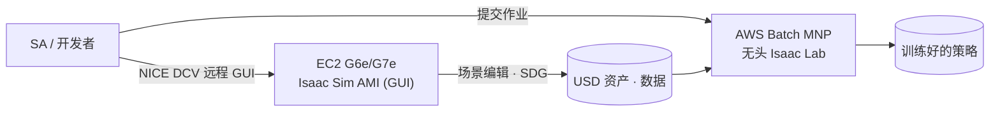
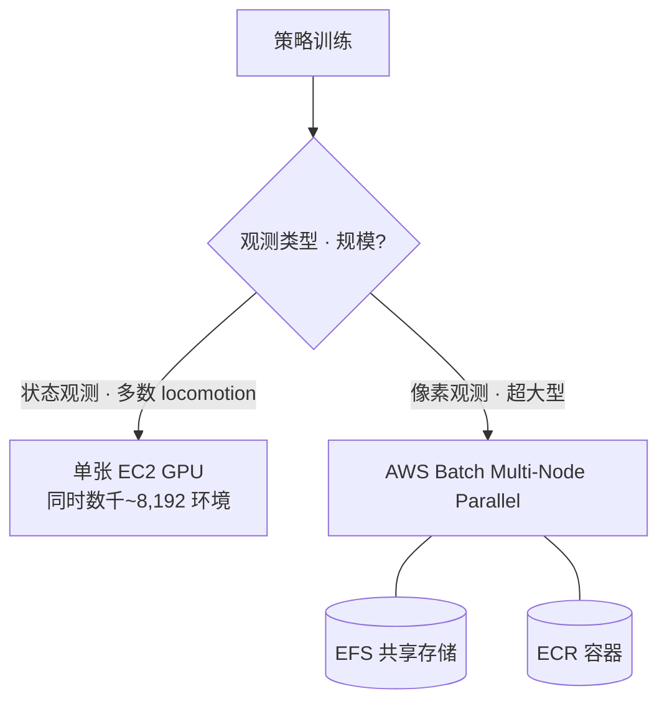
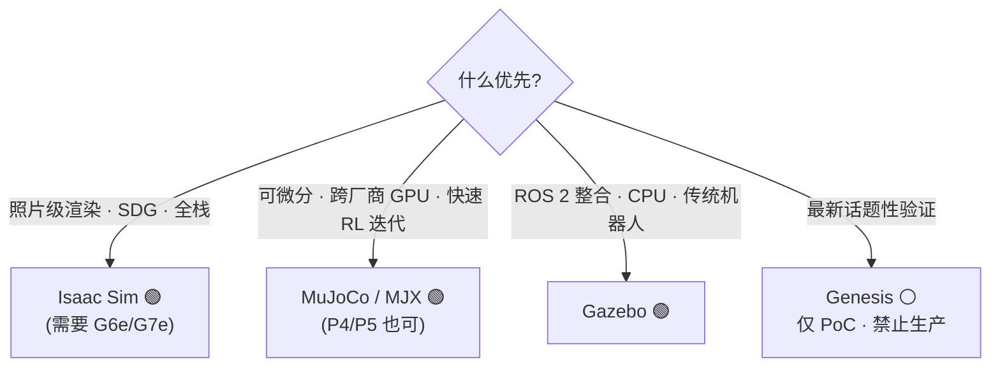

# Pillar 3 — 仿真 (Simulation)

_最终更新: 2026-07 · owner: Youngjin · volatility: 高（版本·实例经常变动）_
_除非另有标注，各条目继承页面元数据（owner/updated/volatility）。按条目指定 owner 时在条目页脚补充。_
[← 返回 index](index.md)

> **L0 TL;DR**: 机器人策略在仿真中比在真实机体上训练快数千倍且更安全。AWS 上的正解栈是 **EC2 G6e/G7e(RTX GPU) + NVIDIA Isaac Sim AMI(GUI) + AWS Batch(无头[^headless]大规模 RL[^rl])**。⚠️ **AWS RoboMaker 已于 2025-09-10 终止** —— 绝对不要提议。Isaac Sim 最新 GA 为 **5.1.0**，6.0 仍为 Preview。

---

## 本支柱中客户最常问的问题 Top 3

1. **"Isaac Sim/Lab 在 AWS 上怎么跑？用哪种实例？"** → [Isaac on AWS](#1-isaac-sim--isaac-lab-on-aws--ga)
2. **"数千~数万环境的并行 RL 在云上怎么扩展？"** → [大规模并行 RL](#2-大规模并行-rl-仿真--ga)
3. **"必须全押 NVIDIA 吗？开源替代方案呢？"** → [开源替代方案](#3-开源仿真器替代方案--ga---部分-hype)、[decisions](decisions.md)

> **稳定原理（几乎不变）**: 仿真的价值在于 (1) **并行性**（一张 GPU 上同时数千~8 千环境）[^parallel]，(2) **安全**（无需损坏真实机体即可探索危险策略），(3) **自动标注**（完美的 ground truth）[^gt]。渲染**必须用 RTX(RT Core)[^rtcore] GPU**，所以 A100/H100（计算 GPU）无法用于 Isaac Sim 渲染 —— 这是左右实例选择的不变约束。

---

## 1. Isaac Sim & Isaac Lab on AWS  🟢 GA

**L0 TL;DR**: 在 AWS EC2 GPU 上运行 NVIDIA Isaac Sim（仿真器）+ Isaac Lab（RL 框架）的正统路径。Marketplace 上有**免费 AMI**，进入很容易。

**客户需求/问题**: "本地工作站 GPU 不够。想在云上用 GUI 使用 Isaac Sim，训练则以无头方式大规模跑。"

**解决方案概览** `[1]`:

- **版本**: Isaac Sim 最新 **GA = 5.1.0(2025-10-30)**。**6.0 为 Preview**（"Early Developer Release", GTC'26）—— 即便 GitHub 补丁标签被错误标为 "GA"，也**不要把 6.0 说成 GA**。Isaac Lab 稳定版 2.3.x，3.0 为 beta（引入 Newton 物理引擎）。
- **许可证**: Isaac Sim **源码为 Apache 2.0**（商用免费）。但若将 **Omniverse Kit 运行时**做第三方再分发/SaaS 提供/交钥匙安装，则**需要 NVIDIA AI Enterprise 许可证**。内部 R&D 或仅销售产出物则无需。[Isaac Lab](https://github.com/isaac-sim/IsaacLab) 为 BSD-3。
- **GPU 需求**: **必须 RTX(RT Core)**。最低 RTX 4080(16GB)，理想为 RTX PRO 6000 Blackwell(48GB)。**不支持 A100/H100**（无 RT Core）。

**栈中各组件实际提供的能力** `[1]`（docs 2026-07 核实）:

| 组件 | 技术要点 | 仿真视角 |
|---|---|---|
| **Isaac Sim** | 基于 RTX 光线追踪的高保真仿真器 —— USD 场景、相机·LiDAR 等传感器仿真、Replicator SDG | 需要逼真渲染的感知·合成数据轴 |
| **Isaac Lab** | Isaac Sim 之上的 RL/模仿学习框架 —— 单张 GPU 上数千并行环境，联动 skrl·rsl_rl 等库 | 步行·操作策略学习的标准入口 |
| **Marketplace AMI** | Isaac Sim 预配置镜像（免费）—— 无需安装驱动·依赖，开机即用 | 消除门槛，让"30 分钟实操"成为可能 |
| **NICE DCV** | AWS 远程显示协议 —— 高画质·低延迟流传输，在 EC2 上无额外许可费用 | 像本地一样操作云 GPU 上的 Isaac Sim GUI |
| **AWS Batch MNP** | 多节点并行[^mnp]批处理作业 —— 将容器作业跨多节点排队·调度 | 无 GUI 的大规模 headless RL 作业并行化（第 2 节） |
| **G6e / G7e** | 搭载 RT Core 的可渲染 GPU 实例 | 满足不变约束（A100/H100 不可用）的唯一系列 |

**AWS 映射** `[1]`:

- **实例**: G6e(L40S 48GB) / **G7e(RTX PRO 6000 Blackwell 96GB, 2026-01 GA)**。官方 **[Isaac Sim Development Workstation AMI](https://aws.amazon.com/marketplace/pp/prodview-bl35herdyozhw)**(build 2026.1.1, Ubuntu 24.04, 免费) 支持 G6e·G7e，推荐 `g6e.4xlarge`。
- **接入**: 用 [NICE DCV](https://aws.amazon.com/hpc/dcv/)(=Amazon DCV) 客户端/网页进行远程 GUI 流传输。
- **参考架构**: **AWS Solutions Guidance "Physical AI for Robotics on AWS"**(Isaac Sim on GPU EC2 + Isaac Lab + SageMaker + IoT Greengrass 边缘)。AWS 上存在 **Physical AI 专属博客频道**(aws.amazon.com/blogs/physical-ai/)。

**决策标准**:

- GUI 场景编辑·SDG[^sdg] → G6e（成本）或 G7e（性能·大场景）。
- 大规模无头 RL → 第 2 项（AWS Batch）。
- 开源是否够用 → 第 3 项 / [decisions](decisions.md)。

**客户案例**: 案例待定（Unitree H1 训练见 [pillar-2](pillar-2.md) 的 AWS 博客）。

**➡️ 后续行动**: **将"在 g6e.4xlarge 上启动 Marketplace Isaac Sim AMI 并用 NICE DCV 接入的 30 分钟 hands-on"作为首个提议**，随后以 **[pai-sim-isaaclab 端到端实操](https://github.com/aws-samples/sample-issac-lab-on-aws)**（Terraform 预置 g6e → Isaac Lab 四足 PPO[^ppo] 无头训练 → 策略导出，约 2 小时/$12）衔接到无头训练。出现许可证问题则准确说明"源码 Apache，但再分发/SaaS 需 AI Enterprise"。

**🔗 相关资产**:

- Playbook: [pillar-2 训练栈](pillar-2.md) · [pillar-1 合成数据](pillar-1.md) · [decisions](decisions.md)
- [NVIDIA Isaac Lab on AWS 研讨会](https://catalog.us-east-1.prod.workshops.aws/workshops/075ce3fe-6888-4ea9-986e-5bdd1b767ef7/en-US) —— Batch MNP 无头 RL
- [Physical AI E2E 研讨会](https://hi-space.gitbook.io/physical-ai-on-aws/guide/e2e-workshop) —— 韩语。Isaac Lab RL + Batch 轨道
- [（内部）AWS·NVIDIA 机器人参考架构](https://gitlab.aws.dev/yhyoo/aws-nvidia-robotics-reference-architecture) —— 需 AWS 内网
- [Physical AI Scaffolding Kit — Isaac Sim 工作站](https://github.com/aws-samples/sample-physical-ai-scaffolding-kit) —— aws-samples。在 EC2 上构建 Isaac Sim/Lab 开发环境
- [VLA Simulator — 1-Click VLA 仿真 on AWS](https://github.com/aws-samples/sample-vla-simulator-on-aws) —— aws-samples。通过 CDK 一键部署到 EC2 GPU（g5/g6/g6e），在 LIBERO/RoboCasa/SimplerEnv/Isaac Lab 上演示·基准测试 GR00T N1.7/N1.6·π0.5·OpenVLA-OFT·LAP-3B·MolmoAct2·RLDX-1。结果以 MP4→S3+SNS 自动送达并自动终止 EC2，逐策略实测成功率·验证日期均有记录
- [robotic-cellsim-tools — 多机器人工业单元仿真工具](https://github.com/aws-samples/sample-robotic-cellsim-tools) —— aws-samples。接收现成 URDF，装配·验证·驱动 Isaac Sim 5.1+ USDA 场景（PhysX 关节·ROS 2 话题·逐链接接触遥测）的 Rust CLI 工具集。确定性（相同输入=相同输出）·带版本化 REST API —— 为智能体/MCP 可组合的仿真原语而设计

🔄 易变数据（版本 —— 2026-07 确认，部分年份需在 GitHub 再确认）

| 组件 | 状态 | 备注 |
|---|---|---|
| Isaac Sim 5.1.0 | 🟢 GA (2025-10-30) | 最新 GA |
| Isaac Sim 6.0 | 🟡 Preview | Early Dev Release, PhysX+Newton 多后端 |
| Isaac Lab 2.3.x | 🟢 GA | 兼容 Isaac Sim 5.1 |
| Isaac Lab 3.0 | 🟡 beta | Newton 物理引擎 |
| Isaac Sim AMI | 🟢 GA | build 2026.1.1, G6e/G7e |

---

## 2. 大规模并行 RL 仿真  🟢 GA

**L0 TL;DR**: Isaac Lab 在**一张 GPU 上同时仿真数千~8,192 个环境**。在 AWS 上进行无头大规模 RL 的官方路径是 **AWS Batch(Multi-Node Parallel)**。

**客户需求/问题**: "训练一个策略要好几天。想大量并行化环境并用多节点扩展。"

**解决方案概览** `[1]/[3]`:

- Isaac Lab 在**一张 GPU 上同时仿真数千~8 千环境**，并可随多节点近乎线性扩展（具体数值见下方折叠块 —— 引用时务必并列注明测量条件）。
- **[AWS Batch Multi-Node Parallel Jobs](https://docs.aws.amazon.com/batch/latest/userguide/multi-node-parallel-jobs.html)** 是 AWS 推荐的编排器（也是 RoboMaker 的迁移路径）。AWS HPC/Physical AI 博客中存在 Isaac Lab on G6e + Batch MNP + EFS + ECR 的参考。

🔄 易变数据（基准 —— NVIDIA 官方性能基准, "with training" 为准, 2026-07 确认）

| 任务 | 环境数 | GPU | 吞吐量 |
|---|---|---|---|
| Cartpole-Direct | 4,096 | 1×RTX 4090 | 510,000 FPS |
| 人形(Velocity-Rough-G1) | 4,096 | 1×RTX 4090 | 82,000 FPS |
| Cartpole-Direct | 4,096 | 16×L40 (4 节点) | 3,500,000 FPS |
| 精密操作(Repose-Cube-Shadow) | 8,192 | 1×RTX 4090 | 170,000 FPS |

_来源: isaac-sim.github.io/IsaacLab performance benchmarks `[1]`_

**AWS 映射** `[1]`: **AWS Batch(MNP)** + EFS（共享存储）+ ECR（容器）+ G6e/G5。NVIDIA 侧用 OSMO 做多节点编排。⚠️ **没有面向 EKS·ParallelCluster 的 Isaac 官方参考架构** —— Batch 是有文档的路径。

**决策标准**:

- 单 GPU 数千环境即够（多数 locomotion）→ EC2 单实例。
- 需要多节点（超大型·像素观测）→ **AWS Batch MNP**。
- 想用 SageMaker 整合训练循环 → [pillar-2](pillar-2.md) 的 Isaac Lab on SageMaker 博客。

**客户案例**: **Unitree H1 RL(Isaac Lab on SageMaker)** —— 见 [pillar-2](pillar-2.md)。

**➡️ 后续行动**: **画出"用 AWS Batch MNP 扩展 Isaac Lab 并行 RL"架构**，用客户任务是像素观测（→ 需要多节点）还是状态观测（→ 单 GPU 即够）来判断扩展。引用基准时务必并列注明测量条件（环境数·GPU）。

**🔗 相关资产**: [pillar-2 HyperPod](pillar-2.md) · [decisions: GPU 获取](decisions.md)

---

## 3. 开源仿真器替代方案  🟢 GA / ⚪ 部分 Hype

**L0 TL;DR**: 不喜欢 NVIDIA 全栈，或特定工作负载用开源更好。**MuJoCo(+MJX)** 是最可信的替代（Unitree 实际使用），**Gazebo** 是 ROS 原生标准，**Genesis** 则话题性高于验证（著名的 "430,000 倍" 主张已被反驳）。

**客户需求/问题**: "NVIDIA 依赖有负担" / "ROS 整合优先" / "需要可微分物理"。

**解决方案概览** `[1]`:

- **[MuJoCo / MJX](https://github.com/google-deepmind/mujoco)** —— C 引擎 GA(v3.10)，**MJX-JAX** 是成熟的 RL 主力（可微分、跨厂商），**MuJoCo Warp 为 Alpha**（非生产）。**Unitree 为 Go2/G1/H1 的 RL 维护自有 MuJoCo 仓库 = 实际厂商采用**。[MuJoCo Playground](https://playground.mujoco.org/) 经 RSS 2025 验证，6 个平台 sim-to-real。
- **[Gazebo](https://gazebosim.org/)** —— 最新 LTS **Jetty**(2025-09)，**Harmonic** 部署最广。ROS 2 原生。⚠️ **Gazebo Classic 11 于 2025-01 EOL** —— 新项目禁用 Classic。基于 CPU，不适合 GPU 并行 RL（是 Isaac 的补充）。
- **[Genesis](https://github.com/Genesis-Embodied-AI/Genesis)** —— Apache 2.0，活跃但**"43M FPS/430,000 倍"主张在现实工作负载中被反驳**（在接触多的操作中反而比 ManiSkill 慢 3~10 倍）。作为 Isaac 替代未获验证 → **⚪ 注意夸大**。

**AWS 映射**: 全部可在 EC2 上运行。MuJoCo/MJX(JAX) **也可利用 A100/H100(P4/P5)**（无需 RTX 渲染）—— 与 Isaac 不同，能用计算 GPU 是其优势。大规模用 AWS Batch。

**决策标准**（详情 → [decisions](decisions.md)）:

- 照片级渲染·SDG·全栈 → **Isaac Sim**。
- 可微分·轻量·跨厂商 GPU·快速 RL 迭代 → **MuJoCo/MJX**。
- ROS 2 整合·CPU·传统机器人 → **Gazebo**。
- Genesis → 仅限 PoC/实验，禁止生产依赖。

**客户案例**: **Unitree**（MuJoCo，训练生产 HW）。

**➡️ 后续行动**: 对担心"NVIDIA 依赖"的客户提出**"AWS 对 Isaac、MuJoCo/Gazebo 都能跑好 —— 按工作负载选即可"**的中立立场。若用 MuJoCo，强调可复用计算 GPU(P5) 的成本优势。

**🔗 相关资产**: [decisions: NVIDIA vs 开源](decisions.md)

---

## 4. NVIDIA Cosmos 3（世界基础模型）  🟢 GA · ⚠️ AWS 未托管

**L0 TL;DR**: 生成·推理·仿真物理世界的基础模型。**可商用(OpenMDW-1.1)**。⚠️ 但 **AWS 未被列为官方 Cosmos 3 云托管方**（Azure/CoreWeave/Baseten 等为托管方）—— 这是 SA 应了解的竞争现实。

**客户需求/问题**: "想生成多样的现实场景用于训练/评估。"（数据生成视角见 [pillar-1](pillar-1.md)）

**解决方案概览** `[1]`: **[Cosmos 3](https://www.nvidia.com/en-us/ai/cosmos/)**(2026-05-31 GTC Taipei GA) 是当前旗舰 —— Reasoner(VLM) + Generator(diffusion)，MoT 架构。**Super 64B**（数据中心）、**Nano 16B**（RTX PRO 6000，实时机器人，含 Nano-Policy-DROID）、**Edge**（Jetson，计划中 —— 参数未公开）。许可证 **OpenMDW-1.1（可商用）**。HF/GitHub/NGC 分发。⚠️ 旧的 Predict/Transfer/Reason 系列进入维护模式（建议迁移到 Cosmos 3）。

**AWS 映射**: **直接映射较弱** —— Cosmos 3 不以 AWS 为指定托管方。但因是开放权重(HF/GitHub)，**可在 EC2 G7e(Nano 16B, RTX PRO 6000) 上自托管**。这就是 AWS 的角度: "即便不是托管主机，也能用最佳 GPU 自行运行"。

**决策标准**: 需要托管 Cosmos NIM → 其他云。开放权重自托管·数据主权·整合既有 AWS 栈 → EC2 G7e。

**客户案例**（⚠️ 仅为公布，未经生产验证）: 作为 Cosmos 3 采用方，**Doosan Robotics、LG Electronics、Samsung Electronics** 等多家韩国企业已公布 —— 韩国相关性高，但为"已公布的采用"而非经过验证的生产。

**➡️ 后续行动**: 韩国客户对 Cosmos 3 感兴趣 → **以"在 AWS G7e 上自托管 Cosmos 3 Nano" PoC 应对**（把缺乏托管服务转化为自托管+数据主权的优势）。

**🔗 相关资产**: [pillar-1 Cosmos 数据生成](pillar-1.md) · [pillar-4 sim-to-real](pillar-4.md)

---

## 5. 数字孪生 — IoT TwinMaker & Omniverse on AWS  🟢 GA（低速度）

**L0 TL;DR**: **AWS IoT TwinMaker 并未被废弃**（第三方"discontinued"主张是误信息 —— 与 SiteWise 的维护混淆）。它是 GA 且对新客户开放，但**新功能推进缓慢**（低速度）。Omniverse 也以 AWS Marketplace AMI 形式 GA。

**客户需求/问题**: "想制作设备/工厂数字孪生[^dtwin]，并与机器人仿真·监控连接。"

**解决方案概览** `[1]`:

- **[AWS IoT TwinMaker](https://aws.amazon.com/iot-twinmaker/)** —— GA，官方产品页面有效，无废弃横幅（2026-07-11 确认）。⚠️ innfactory.de/oneuptime.com 等的 "discontinued" 主张是**未经验证的传闻**，禁止重复。但 2025~26 无重大新功能，故为**低速度**。
- **NVIDIA Omniverse on AWS** —— Marketplace AMI(Developer/Production, Linux/Windows)。运行于 **EC2 G6e/G7e**。Production AMI 是捆绑 AI Enterprise 许可证 + 支持的付费订阅。⚠️ **没有专用的 "OVX" 实例家族** —— Omniverse on AWS = G6e/G7e + AMI。托管的 "Omniverse Enterprise on AWS" 无明确依据。

🔄 易变数据（AMI 版本·价格 —— 2026-07 确认）

| 项目 | 值 |
|---|---|
| 最新 AMI | 2026.1.0 (Ubuntu 24.04, 2026 Q1 Refresh) |
| Production AMI 订阅 | ~$1.00/hr（Marketplace 标示价，含 AI Enterprise + 支持） |

**AWS 映射**: IoT TwinMaker + IoT SiteWise + Omniverse AMI(G6e/G7e)。

**决策标准**: 设备数据整合·轻量孪生 → TwinMaker（但需考虑低速度）。照片级仿真·USD[^usd] 协作 → Omniverse AMI。

**客户案例**: 案例待定。

**➡️ 后续行动**: 客户问"听说 TwinMaker 死了？"时**立即更正**（"GA、对新客户开放，只是低速度"）。想整合孪生+仿真则连接到 Omniverse AMI。问"有 OVX 吗"则准确回答"没有，是 G6e/G7e + AMI"。

**🔗 相关资产**:

- Playbook: [pillar-1](pillar-1.md)
- [AWS IoT TwinMaker 端到端研讨会](https://catalog.us-east-1.prod.workshops.aws/workshops/4b8a4050-893e-40f3-9788-8256025024b4/en-US)
- [Omniverse 数字孪生实操](https://github.com/kimjoonhyung/nvidia-omniverse-digital-twin) —— 韩语。Isaac Sim + Kinesis 实时数据，CDK
- （内部数字孪生研讨会 —— 需确认 ⚠️）

---

## 本支柱的诚实现实（SA 必读）

- **AWS RoboMaker 已死（2025-09-10 支持终止）。** 绝对禁止作为选项提出。后续栈 = EC2 G6e/G7e + Isaac Sim AMI + AWS Batch MNP。
- **Isaac Sim 6.0 不是 GA（Preview）。** 最新 GA 是 5.1.0。不要被 GitHub 补丁标签迷惑。
- **AWS 不是 Cosmos 3 的指定托管方**（Azure/CoreWeave 为托管方）。以自托管(G7e)应对才是诚实的角度。
- **A100/H100 无法用于 Isaac Sim 渲染**（无 RT Core）。渲染用 G6e/G7e，计算型 RL 也可用 P5（MuJoCo）。
- **TwinMaker 废弃说是传闻** —— 更正的同时诚实承认"低速度"。
- **Genesis "430,000 倍"已被反驳**，**MuJoCo Warp 为 Alpha**，**Unity Robotics Hub 实际处于放置状态（2022 年以后）**，**Habitat 在 v0.3.4 之后停止维护** —— 禁止夸大开源成熟度。

---
_owner: Youngjin · updated: 2026-07 · volatility: 高（版本·实例在折叠块中管理）· sources: [1] 官方/论文, [3] 厂商, [4] 未经验证。建议再确认部分 GitHub 发布年份。_

<!-- 용어 각주 -->

[^rl]: **强化学习（RL, Reinforcement Learning）** — 通过试错学习策略以最大化奖励信号的方法。在仿真中并行运行数千个环境，可快速学习机器人行走等控制策略。
[^parallel]: **并行环境（parallel environments）** — 在一张 GPU 上把同一仿真环境复制数千份并同时运行的技术。将强化学习的经验收集速度提升数千倍，是仿真的核心价值。
[^headless]: **无头（headless）** — 不显示 GUI 画面运行仿真器的模式。没有渲染开销，因此大规模并行训练作业以无头方式运行。
[^rtcore]: **RT Core / RTX GPU** — 搭载光线追踪专用硬件（RT Core）的 NVIDIA GPU 系列。Isaac Sim 的逼真渲染必需，因此没有 RT Core 的 A100/H100 无法用于渲染。
[^gt]: **ground truth（真值标签）** — 作为训练·评估基准的准确答案数据。在仿真中，引擎已知所有物体的位置·分割掩码，因此可自动生成完美标签。
[^usd]: **USD (Universal Scene Description)** — 皮克斯（Pixar）创建的 3D 场景描述标准格式。Isaac Sim 的场景·机器人·资产均以 USD 描述，是 Omniverse 生态的通用语言。
[^sdg]: **合成数据生成（SDG, Synthetic Data Generation）** — 用仿真器自动生成训练图像与标注（标签）的技术。最大优点是标注成本趋近于零。🎥 [Isaac Sim Replicator SDG 教程](https://www.youtube.com/watch?v=HHzNIh72B_Y)
[^ppo]: **PPO (Proximal Policy Optimization)** — 使用最广泛的强化学习算法。收敛稳定，是机器人行走学习的事实默认值。
[^dtwin]: **数字孪生（digital twin）** — 对真实工厂·仓库·机器人进行物理上忠实复刻的虚拟副本。无需触碰真实环境即可进行策略训练·验证·场景实验。
[^mnp]: **MNP（Multi-Node Parallel）** — AWS Batch 将一个作业跨多台 EC2 节点执行的模式。使需要节点间通信的大规模训练·仿真作业也能通过批处理队列管理。
