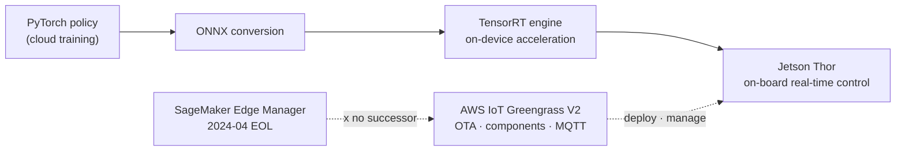
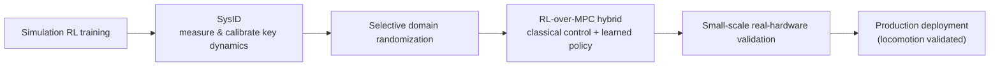

# Pillar 4 — Sim-to-Real

_Last updated: 2026-07 · owner: Youngjin · volatility: medium (edge HW/models are high)_
_Unless separately noted, each item inherits the page metadata (owner/updated/volatility). When an item has its own owner, add an item footer._
[← back to index](index.md)

> **L0 TL;DR**: The honest one-liner — **locomotion (walking)[^loco] sim-to-real[^s2r] is essentially solved and deployed** (ANYmal, Agility Digit). **Manipulation[^manip] sim-to-real is not yet** — even frontier VLAs are trained on **real-hardware data**, not simulation, and simulation is used mainly for evaluation/adaptation. And the invariant architecture law: **30~100Hz real-time control must be at the edge (on-board)**, with only high-level planning in the cloud.

---

## Top 3 questions customers ask most in this pillar

1. **"Does sim-to-real actually work? Are there validated cases?"** → [Locomotion (it works)](#2-locomotion-sim-to-real--validated-production), [Manipulation (not yet)](#4-manipulation-sim-to-real--research---narrow-production)
2. **"It's real-time control — should inference be at the edge or in the cloud?"** → [Edge inference deployment](#1-edge-inference-deployment--ga), [decisions](decisions.md)
3. **"How do I validate that a policy works before deploying to real hardware?"** → [Policy evaluation](#5-policy-evaluation--pre-deployment-validation--research-unsolved-problem)

> **Stable principle (rarely changes)**: the sim-to-real gap is really (1) **dynamics[^dyn] mismatch** (sim physics ≠ real, especially contact) and (2) **visual mismatch** (render ≠ real camera). Locomotion works well because robot+ground is simple, forgiving dynamics; manipulation doesn't because contact dynamics are hard. The proven prescription is a **hybrid of selective domain randomization (DR)[^dr] + system identification (SysID)[^sysid] + RL layered on MPC[^mpc]**.

---

## 1. Edge inference deployment  🟢 GA

**L0 TL;DR**: Real-time control inference must run on the robot on-board. The 2026 standard path = **NVIDIA Jetson Thor (GA) + AWS IoT Greengrass V2 + ONNX[^onnx]/TensorRT**. ⚠️ **SageMaker Edge Manager was discontinued 2024-04** — there is no replacement; go with ONNX+Greengrass.

**Customer need/problem**: "We trained in the cloud — how do we deploy to the robot and manage it OTA[^ota]? It's real-time, so a cloud round-trip won't work, right?"

**Solution overview** `[1]/[3]`:

- **Edge HW**: **[Jetson](https://www.nvidia.com/en-us/autonomous-machines/embedded-systems/jetson-thor/) Thor (Blackwell) GA**, T5000 production module in distribution. The Jetson Orin line is still produced (low power). Specs/prices in the collapsed block below.
- **Deployment/management**: **[AWS IoT Greengrass V2](https://docs.aws.amazon.com/greengrass/v2/developerguide/what-is-iot-greengrass.html)** (GA) — Lambda/Docker/custom components, ML inference components, MQTT telemetry. ⚠️ **Greengrass V1 support ended 2026-06-01** — only V2 is current.
- **Model path**: PyTorch policy → **[ONNX](https://onnx.ai/)** → **[TensorRT](https://developer.nvidia.com/tensorrt)** engine compilation (on-device acceleration) is the standard path to meet the real-time control latency budget (sub-20~30ms class)[^latency]. [SageMaker Neo](https://docs.aws.amazon.com/sagemaker/latest/dg/neo.html) (edge compilation) survives and combines with Greengrass.
- ⚠️ **SageMaker Edge Manager EOL (2024-04-26)** — console/API all unavailable. **No drop-in managed successor service**. AWS recommendation = ONNX + Greengrass V2 (+ optionally SageMaker Neo).

🔄 Volatile data (edge HW specs/prices — checked 2026-07)

| Item | Value | Source |
|---|---|---|
| Jetson Thor GA | announced 2025-08-25, dev kit $3,499, shipping began 2025-11 | NVIDIA `[3]` |
| AGX Thor specs | Blackwell GPU, 128GB unified LPDDR5X, 130W, FP4 support | NVIDIA `[3]` |
| Thor vs Orin | NVIDIA official: ~7.5× normalized AI compute, ~3.5× energy efficiency. ⚠️ Thor=FP4/FP8 TFLOPS, Orin=INT8 TOPS — do not directly compare raw numbers | NVIDIA `[3]` |
| ONNX→TensorRT acceleration | ~7× (vendor number, NVIDIA Jetson blog 2025, model/HW dependent — include conditions when citing) | NVIDIA `[3]` |

**AWS mapping**: IoT Greengrass V2 + IoT Core (MQTT) + SageMaker Neo (compilation) + S3 (model artifacts) + IoT Jobs (OTA). Collect edge telemetry with Model Monitor.

**Decision criteria** (details → [decisions Cloud vs Edge](decisions.md)):

- **30~100Hz+ reactive control** (balance · force · grasp · walking) → **must be on-board Jetson**. Cloud round-trip not viable.
- **sub-1Hz~few-Hz high-level planning · VLA inference** → cloud/async possible. **action chunking** is the bridge between the two rates.
- Want a managed edge service → honestly say there is none, and provide an ONNX+Greengrass V2 design.

**Customer case**: (public AWS robot cases of edge deployment itself are limited — centered on reference architectures)

**➡️ Next action**: **draw the "Jetson Thor (on-board control) + Greengrass V2 (OTA/management) + ONNX→TensorRT" edge reference architecture**, and proactively inform the customer that "Edge Manager is gone" to correct wrong expectations. Ask the real-time Hz requirement to fix the edge/cloud boundary.

**🔗 Related assets**: [pillar-2 System1/System2](pillar-2.md) · [pillar-5 orchestration](pillar-5.md) · [decisions](decisions.md)

---

## 2. Locomotion Sim-to-Real  🟢 validated (production)

**L0 TL;DR**: Here is the evidence that sim-to-real "works." Quadrupedal walking (ANYmal) and bipedal logistics robots (Agility Digit) were trained with RL in simulation and **deployed to actual paying industrial sites**.

**Customer need/problem**: "Isn't sim-to-real marketing? Is there a robot actually getting paid to work?"

**Solution overview** `[1]/[3]`:

- **ANYmal ([ANYbotics](https://www.anybotics.com/anymal/))** 🟢 — walking trained with large-scale parallel simulation RL, **hundreds of units deployed to industrial inspection worldwide (oil & gas, mining, chemical)**. ETH RL-walking lineage (peer-reviewed). **Production + evidence**.
- **[Agility Digit](https://agilityrobotics.com/robots) @ GXO** 🟢 — **paid commercial work under a multi-year RaaS contract**, **100k+ tote moves** as of 2025-11, ~1 year continuous full-time, 65k+ operating hours. **The best-validated paid humanoid work** (cross-confirmed by customer GXO). But a narrow, structured tote-moving task.
- ⚠️ **Boston Dynamics Spot ships with MPC (classical control) in the product — not RL**. Spot's RL walking (5.2m/s) exists only in a research kit (BD+NVIDIA+RAI). **The most frequently mis-stated fact in this industry** — do not say the opposite.

**AWS mapping**: training (→[pillar-2](pillar-2.md), [pillar-3](pillar-3.md)) + edge deployment (→ item 1). Per-vendor infrastructure is undisclosed.

**Decision criteria**: customer use case is walking/locomotion → sim-to-real is mature, can propose actively. Precise manipulation → cautious (item 4).

**Customer case**: ANYmal (industrial inspection, production), Agility Digit@GXO (logistics, paid). ⚠️ **No independent third-party autonomy audit exists for any humanoid** — based on vendor/customer PR ([3]).

**➡️ Next action**: if the customer is skeptical of sim-to-real, **use ANYmal/Digit@GXO as evidence that "it works," but be clear that "it works because it's locomotion."** Knowing the Spot=MPC fact precisely earns trust.

**🔗 Related assets**: [pillar-3 parallel RL](pillar-3.md) · [pillar-2 training](pillar-2.md)

🔄 Volatile data (humanoid demo↔production ladder — 2026-07)

| Stage | Case |
|---|---|
| Paid · validated | ANYmal (quadruped, hundreds), Agility Digit@GXO (100k+ totes) |
| Production pilot (metrics · autonomy, vendor-reported) | Figure 02@BMW (~1,250h, 90k+ parts→Figure 03), Apptronik Apollo@Mercedes |
| Product shipped but not autonomous | 1X Neo (autonomy ~60~70%, rest VR teleoperation "Expert Mode") |
| Impressive demo / research | Atlas agile motions, Spot RL research kit (product is MPC), Unitree agile skills, Figure 03 "8-hour autonomy" claim (CEO tweet) |
| Announced · roadmap (0 units operating) | Hyundai Atlas 25k units (2028, union opposition), Tesla Optimus V3 |

---

## 3. Sim-to-Real methodology  🟢 GA (stable principle)

**L0 TL;DR**: The proven prescription is not some flashy new technique but a **hybrid of selective DR + SysID + RL layered on MPC**. Randomizing everything indiscriminately makes RL unstable.

**Customer need/problem**: "How do you actually close the sim-to-real gap? Which techniques work in production?"

**Solution overview** `[1]/[3]`:

- **Selective domain randomization (DR)** 🟢 — the locomotion standard. But **excessive randomization destabilizes training** → do it selectively.
- **System identification (SysID) + selective DR** 🟢 — measure and calibrate the key dynamics parameters, then apply selective DR. The current best practice.
- **RL-over-MPC hybrid** 🟢 — not pure end-to-end RL but a classical MPC base + a learned policy for robustness. **Boston Dynamics uses this hybrid too = closest to real deployment**.
- **Research stage** (not production): residual real2sim2real (ASAP), distributional SysID (Spot research), VLM-based SysID (Vid2Sid) — 🔵 impressive but single-lab demos.

**AWS mapping**: the methodology itself is cloud-neutral. Parallelize large-scale DR/SysID sweeps with AWS Batch (→[pillar-3](pillar-3.md)).

**Decision criteria**: locomotion → trust DR+SysID+hybrid. Manipulation → this prescription alone is insufficient; must pair with real data (item 4).

**Customer case**: ANYmal · Digit (item 2 above) are products of this methodology.

**➡️ Next action**: if the customer's team is floundering with "indiscriminate DR," redirect them to **"selective DR + SysID + MPC hybrid."** Label research techniques (ASAP, etc.) honestly as "research stage."

**🔗 Related assets**: [pillar-3 Simulation](pillar-3.md)

---

## 4. Manipulation Sim-to-Real  🔵 Research / 🟡 narrow production

**L0 TL;DR**: The honest bad news — **general contact-rich manipulation sim-to-real is not solved**. That's why frontier VLAs (OpenVLA, π0.5, Gemini Robotics) are trained on **real-hardware data**, not simulation. Production is only narrow, low-difficulty loco-manipulation (moving totes/parts).

**Customer need/problem**: "We need manipulation like assembly/grasping. Can we train it with simulation?"

**Solution overview** `[1]`:

- **Why it lags**: manipulation has a large **contact-dynamics mismatch**, with reported sim-to-real performance drops of ~24~30%, and success rates falling 30~50% from lighting/camera-pose changes alone.
- **Key insight — VLAs depend on real data**: **[OpenVLA](https://github.com/openvla/openvla)** (7B) is trained on ~970k **real-hardware** demos (Open X-Embodiment). **π0/π0.5**, **RT-2**, and **Gemini Robotics** all center on large-scale **real-robot data**, with simulation as an evaluation/adaptation aid. Gemini Robotics bundles MuJoCo in its SDK for evaluation.
- **Maturity**: precise, multi-finger contact manipulation and open-world VLA housework (π0.5) → **impressive demo / trusted-tester Preview**. **As of 2026-07, there is no general-purpose VLA that has validated contact-rich manipulation as GA production.**

**AWS mapping**: the real-data pipeline is the crux → [pillar-1](pillar-1.md). Simulation is an evaluation aid (item 5).

**Decision criteria**:

- Narrow, structured grasp/move → possible (Digit class).
- General, precise, contact-rich manipulation → **currently unsolved**, assumes large-scale real-data collection + expectation management.
- "A manipulation policy from simulation alone" → risky; real-demo fine-tuning is essential.

**Customer case**: only narrow loco-manipulation (Digit, Figure 02) is in production. Precise manipulation is research/Preview.

**➡️ Next action**: for manipulation customers, **manage expectations honestly** — say first "it's not solved as well as locomotion, real data is key," then connect to the [pillar-1 real-data pipeline](pillar-1.md). No over-promising.

**🔗 Related assets**: [pillar-1 teleoperation/real data](pillar-1.md) · [pillar-2 VLA fine-tuning](pillar-2.md)

---

## 5. Policy evaluation — pre-deployment validation  🔵 Research (unsolved problem)

**L0 TL;DR**: The uncomfortable truth — **no simulation evaluation suite is trusted as a real-deployment gate**. Popular benchmarks (LIBERO/SimplerEnv/CALVIN) have exposed shortcut, overfitting, and statistical-insignificance problems. The current direction is real-to-sim reconstruction + distributed real-world A/B.

**Customer need/problem**: "Before putting it on real hardware, how do I gain confidence that the policy really works?"

**Solution overview** `[1]`:

- **Sim evaluation suites**: SimplerEnv, LIBERO, Meta-World, etc. exist but exposed limits. A 2026-06 audit: a 90M probe with no language encoder matched SOTA on LIBERO 3/4 (shortcut), only ~20% of reported "progress" was statistically substantiated, and CALVIN dropped 25% from placement-pose resampling alone. **sim↔real correlation is low**.
- **Real-world evaluation**: **[RoboArena](https://robo-arena.github.io/)** — distributed double-blind A/B (giving only the policy IP and hiding its identity), 7 institutions, 4,284 episodes, Bradley-Terry/Elo. A research framework, but it points the direction.
- **New direction**: real-to-sim (Gaussian Splatting/world-model scene reconstruction) + distributed real A/B. A single sim suite ≠ a trusted gate.

**AWS mapping**: parallelize large-scale evaluation sweeps → AWS Batch. Real-world A/B data collection → IoT/S3. (There is no managed robot-evaluation service.)

**Decision criteria**: do not make deployment decisions on sim benchmark scores alone. Pair **sim screening + staged real-world validation**. When citing benchmark scores, check statistical significance and measurement conditions.

**Customer case**: (evaluation itself is a research area)

**➡️ Next action**: if the customer wants to "deploy because sim got 95%," **advise them to design staged real-world validation on the basis of "recent research showing low sim↔real correlation."** This honesty prevents accidents.

**🔗 Related assets**: [pillar-3 Simulation](pillar-3.md) · [pillar-1 real data](pillar-1.md)

---

## The honest reality of this pillar (SA must-read)

- **Locomotion works, manipulation doesn't yet.** This one sentence is the backbone of the sim-to-real conversation. Over-promising loses trust.
- **Spot = MPC, not RL.** The most common error in this industry. Say the opposite and your expertise gets doubted.
- **Frontier VLAs are trained on real data**, with simulation as an evaluation/adaptation aid — "a manipulation policy from simulation alone" is a trap.
- **SageMaker Edge Manager is dead (2024-04)**, no successor → ONNX + Greengrass V2. **Greengrass V1 also ended 2026-06**, only V2 is current.
- **30~100Hz control must be at the edge.** action chunking is the bridge between cloud planning and edge control.
- **Humanoid "production" metrics are mostly vendor PR** — no independent autonomy audit. Only Digit@GXO · Figure@BMW are customer cross-confirmed. 1X Neo is "a product, but actually teleoperated."

---
_owner: Youngjin · updated: 2026-07 · volatility: medium (edge HW · vendor metrics are high) · sources: [1] official/paper, [2] AWS internal validation, [3] vendor/PR, [4] unverified. 2026 arXiv preprints are non-peer-reviewed (illustrative)._

<!-- 용어 각주 -->

[^s2r]: **sim-to-real** — Transferring a policy trained in simulation to a real robot, or the methodology for doing so. The physical and visual differences between simulation and reality (the domain gap) mean a naive transfer collapses performance. 🎥 [NVIDIA Isaac GR00T N1 introduction](https://www.youtube.com/watch?v=m1CH-mgpdYg)
[^loco]: **locomotion** — A robot's ability to move: walking, driving, etc. Thanks to the relatively simple physics of robot-ground contact, it is the area where sim-to-real was solved first.
[^manip]: **manipulation** — The ability to grasp, move, and assemble objects. The physics of fingertip contact is complex, so this is the area where sim-to-real remains unsolved.
[^dyn]: **dynamics** — The physics of motion produced by force, friction, and collision. Contact dynamics when grasping an object is the hardest part for a simulator to reproduce accurately.
[^dr]: **Domain Randomization (DR)** — Training while randomly varying the simulation's physics parameters, lighting, and textures so the policy withstands any environmental change. The signature sim-to-real prescription.
[^sysid]: **SysID (System Identification)** — Measuring the real robot's physical parameters (friction, mass, motor response) to calibrate the simulator to the real hardware.
[^mpc]: **MPC (Model Predictive Control)** — A classical control technique that controls by repeatedly predicting and optimizing over a short future horizon. The hybrid of a learned RL policy layered on MPC has become the proven prescription.
[^onnx]: **ONNX / TensorRT** — ONNX is the standard format for exchanging models between frameworks; TensorRT is NVIDIA's inference-optimization compiler for its GPUs. The "PyTorch → ONNX → TensorRT" conversion is the standard path for real-time edge inference.
[^ota]: **OTA (Over-The-Air)** — Updating and deploying a robot's models and software remotely over the network.
[^latency]: **latency budget** — The maximum inference time a real-time control loop allows. At 30~100Hz control, one cycle is 10~33ms, so inference must finish within it — the reason a cloud round-trip is impossible.
