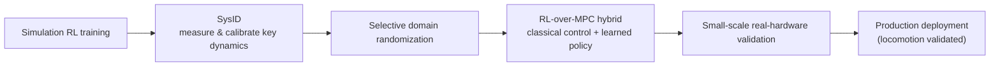

# Pillar 4 — Sim-to-Real

_Last updated: 2026-09 · owner: Youngjin · volatility: medium (edge HW/models are high)_
_Unless separately noted, each item inherits the page metadata (owner/updated/volatility). When an item has its own owner, add an item footer._
[← back to index](index.md)

> **L0 TL;DR**: Validate simulation results on the specific robot, task, and environment. Place functions using observation-to-action deadlines and outage needs; design [independent safety, cancellation, and recovery](operations.md). Locomotion/manipulation labels alone do not approve deployment.

---

> **Review scope**: the page edit date does not revalidate every technical item. See [Evidence](evidence.md) for core corrections, check dates, and reproduction/human review status; legacy item dates still apply.

## Top 3 questions customers ask most in this pillar

> These are discovery examples, not a measured ranking of customer inquiries.

1. **"Does sim-to-real actually work? Are there validated cases?"** → [Locomotion (it works)](#2-locomotion-sim-to-real--validated-production), [Manipulation (not yet)](#4-manipulation-sim-to-real--research---narrow-production)
2. **"It's real-time control — should inference be at the edge or in the cloud?"** → [Edge inference deployment](#1-edge-inference-deployment--ga), [decisions](decisions.md)
3. **"How do I validate that a policy works before deploying to real hardware?"** → [Policy evaluation](#5-policy-evaluation--pre-deployment-validation--research-unsolved-problem)

> **Stable principle (rarely changes)**: the sim-to-real gap is really (1) **dynamics[^dyn] mismatch** (sim physics ≠ real, especially contact) and (2) **visual mismatch** (render ≠ real camera). Locomotion works well because robot+ground is simple, forgiving dynamics; manipulation doesn't because contact dynamics are hard. The proven prescription is a **hybrid of selective domain randomization (DR)[^dr] + system identification (SysID)[^sysid] + RL layered on MPC[^mpc]**.

---

## 1. Edge inference deployment — validate per model { #1-edge-inference-deployment--ga }

**L0 TL;DR**: Validate deployment for the model, device, and control timing. Run deadline-critical control locally; use cloud resources for training, management, and latency-tolerant business planning.

**Overview**: [Greengrass V2](https://docs.aws.amazon.com/greengrass/v2/developerguide/what-is-iot-greengrass.html) supports component deployment/management `[1]`. Choose supported PyTorch or ONNX/TensorRT paths per policy; do not assume identical export or latency for every VLA. After [Edge Manager retirement](https://docs.aws.amazon.com/sagemaker/latest/dg/edge-eol.html), the project still owns conversion, device validation, and operations.

| Check | Evidence |
|---|---|
| Model/device compatibility | Weights, runtime, drivers, sensors, action units/normalization |
| Timing | Observation refresh, inference delay, action execution interval, worst-case jitter |
| Updates | Model/app/config versions, signatures/hashes, last working bundle |
| Operations | Network loss, cancellation/timeouts, interventions, recovery tests |

**Action chunking correction**: outputting future actions differs from feedback on new observations. Inference Hz × chunk size is not control frequency. Nor is always executing the entire native chunk a universal rule. Re-evaluate per model, execution horizon, and transition method ([PI RTC](https://www.physicalintelligence.company/research/real_time_chunking), [evidence](evidence.md#action-chunking)).

**AWS mapping**: combine S3 artifacts, Greengrass V2/IoT Jobs deployment management, and IoT Core state/events as needed. This combination does not certify safety or guarantee real-time control.

**Decision and next action**: assign [four-layer owners](operations.md#layers), define [failure tests](operations.md#failure), and hand over [path C](execution.md#finetuning) outputs to a supervised small-device trial.

**🔗 Related assets**:

- Playbook: [pillar-2 System1/System2](pillar-2.md) · [pillar-5 orchestration](pillar-5.md) · [decisions](decisions.md)
- [VLA Hub — real-time VLA inference hub on AWS](https://github.com/aws-samples/sample-vla-hub-on-aws) — aws-samples. Deploys six OSS VLAs (GR00T N1.6/N1.7 · π0.5 · OpenVLA-7B · SmolVLA-450M · LAP-3B) as independent per-model gRPC endpoints via CDK (ECS on EC2 g5/g6, internal NLB). Probes GPU-available AZs at deploy time; includes a Jetson (Orin/Thor) single-device track with the same container/proto — one codebase covering the VLA cloud/edge inference paths. Its capability matrix (per-model licenses, adaptation cost, scenario picks) is useful in customer conversations. ⚠️ Early-stage (created 2026-05) · internal NLB only (clients must sit in the same VPC) · GR00T requires a license check
- [ROS2 OTA firmware updates](https://github.com/aws-samples/ros2-ota-firmware-updates) — aws-samples. Reference implementation of OTA firmware updates for ROS2 fleets with Greengrass V2 + IoT Jobs — a device agent pulls images from a Docker registry, auto-rolls back to the last known-good version on failure, and devices without internet access go through the Greengrass proxy. Shows the IoT Jobs row of the table above as working code

---

## 2. Locomotion Sim-to-Real  🟢 validated (production)

**L0 TL;DR**: Here is the evidence that sim-to-real "works." Quadrupedal walking (ANYmal) and bipedal logistics robots (Agility Digit) were trained with RL in simulation and **deployed to actual paying industrial sites**.

**Customer need/problem**: "Isn't sim-to-real marketing? Is there a robot actually getting paid to work?"

**Solution overview** `[1]/[3]`:

- **ANYmal ([ANYbotics](https://www.anybotics.com/anymal/))** 🟢 — walking trained with large-scale parallel simulation RL, **hundreds of units deployed to industrial inspection worldwide (oil & gas, mining, chemical)**. ETH RL-walking lineage (peer-reviewed). **Production + evidence**.
- **[Agility Digit](https://agilityrobotics.com/robots) @ GXO** 🟢 — **paid commercial work under a multi-year RaaS contract**, **100k+ tote moves** as of 2025-11, ~1 year continuous full-time, 65k+ operating hours. **The best-validated paid humanoid work** (cross-confirmed by customer GXO). But a narrow, structured tote-moving task.
- ⚠️ **Boston Dynamics Spot ships with MPC (classical control) in the product — not RL**. Spot's RL walking (5.2m/s) exists only in a research kit (BD+NVIDIA+RAI). **The most frequently mis-stated fact in this industry** — do not say the opposite.

**AWS mapping**: training (→[pillar-2](pillar-2.md), [pillar-3](pillar-3.md)) + edge deployment (→ item 1). Per-vendor infrastructure is undisclosed.

**Decision criteria**: customer use case is walking/locomotion → sim-to-real is mature, can propose actively. Precise manipulation → cautious (item 4).

**Customer case**: ANYmal (industrial inspection, production), Agility Digit@GXO (logistics, paid). ⚠️ **No independent third-party autonomy audit exists for any humanoid** — based on vendor/customer PR ([3]).

**➡️ Next action**: if the customer is skeptical of sim-to-real, **use ANYmal/Digit@GXO as evidence that "it works," but be clear that "it works because it's locomotion."** Knowing the Spot=MPC fact precisely earns trust.

**🔗 Related assets**: [pillar-3 parallel RL](pillar-3.md) · [pillar-2 training](pillar-2.md)

🔄 Volatile data (humanoid demo↔production ladder — 2026-07)

| Stage | Case |
|---|---|
| Paid · validated | ANYmal (quadruped, hundreds), Agility Digit@GXO (100k+ totes) |
| Production pilot (metrics · autonomy, vendor-reported) | Figure 02@BMW (~1,250h, 90k+ parts→Figure 03), Apptronik Apollo@Mercedes |
| Product shipped but not autonomous | 1X Neo (mixed autonomy + VR teleoperation "Expert Mode" — the "60–70% autonomy" figure has no primary source, see [radar](radar.md)) |
| Impressive demo / research | Atlas agile motions, Spot RL research kit (product is MPC), Unitree agile skills, Figure 03 "8-hour autonomy" claim (CEO tweet) |
| Announced · roadmap (0 units operating) | Hyundai Atlas 25k units (2028, union opposition), Tesla Optimus V3 |

---

## 3. Sim-to-Real methods — assess applicability { #3-sim-to-real-methodology--ga-stable-principle }

**L0 TL;DR**: The proven prescription is not some flashy new technique but a **hybrid of selective DR + SysID + RL layered on MPC**. Randomizing everything indiscriminately makes RL unstable.

**Customer need/problem**: "How do you actually close the sim-to-real gap? Which techniques work in production?"

**Solution overview** `[1]/[3]`:

- **Selective domain randomization (DR)** 🟢 — the locomotion standard. But **excessive randomization destabilizes training** → do it selectively.
- **System identification (SysID) + selective DR** 🟢 — measure and calibrate the key dynamics parameters, then apply selective DR. The current best practice.
- **RL-over-MPC hybrid** 🟢 — not pure end-to-end RL but a classical MPC base + a learned policy for robustness. **Boston Dynamics uses this hybrid too = closest to real deployment**.
- **Research stage** (not production): residual real2sim2real (ASAP), distributional SysID (Spot research), VLM-based SysID (Vid2Sid) — 🔵 impressive but single-lab demos.
- **Deploy-side gap — most deployment failures are "wiring," not physics** `[2]`: separate from the training-side gap (physics/render mismatch), most failures at the stage of executing a trained policy on real hardware come from **observation-layout and actuation-scale mismatches**. Example: Unitree G1 whole-body control requires the observation array of 86 slots × 6 ticks = 516 dimensions and constants like `action_scale=0.25` to match the sim exactly (matched: stable ~0.38 m/s walk on a 0.5 m/s command; mismatched: cannot walk). Number one on the policy-porting checklist — check this before discussing DR/SysID.

```mermaid
graph LR
    SIM["Simulation RL training"] --> SID["SysID<br>measure & calibrate key dynamics"]
    SID --> DR["Selective domain randomization"]
    DR --> MPC["RL-over-MPC hybrid<br>classical control + learned policy"]
    MPC --> VAL["Small-scale real-hardware validation"]
    VAL --> DEP["Production deployment<br>(locomotion validated)"]
```

**AWS mapping**: the methodology itself is cloud-neutral. Parallelize large-scale DR/SysID sweeps with AWS Batch (→[pillar-3](pillar-3.md)).

**Decision criteria**: locomotion → trust DR+SysID+hybrid. Manipulation → this prescription alone is insufficient; must pair with real data (item 4).

**Customer case**: ANYmal · Digit (item 2 above) are products of this methodology.

**➡️ Next action**: if the customer's team is floundering with "indiscriminate DR," redirect them to **"selective DR + SysID + MPC hybrid."** Label research techniques (ASAP, etc.) honestly as "research stage."

**🔗 Related assets**: [pillar-3 Simulation](pillar-3.md)

---

## 4. Manipulation Sim-to-Real  🔵 Research / 🟡 narrow production

**L0 TL;DR**: The honest bad news — **general contact-rich manipulation sim-to-real is not solved**. That's why frontier VLAs (OpenVLA, π0.5, Gemini Robotics) are trained on **real-hardware data**, not simulation. Production is only narrow, low-difficulty loco-manipulation (moving totes/parts).

**Customer need/problem**: "We need manipulation like assembly/grasping. Can we train it with simulation?"

**Solution overview** `[1]`:

- **Why it lags**: manipulation has a large **contact-dynamics mismatch**, with reported sim-to-real performance drops of ~24~30%, and success rates falling 30~50% from lighting/camera-pose changes alone.
- **Key insight — VLAs depend on real data**: **[OpenVLA](https://github.com/openvla/openvla)** (7B) is trained on ~970k **real-hardware** demos (Open X-Embodiment). **π0/π0.5**, **RT-2**, and **Gemini Robotics** all center on large-scale **real-robot data**, with simulation as an evaluation/adaptation aid. Gemini Robotics bundles MuJoCo in its SDK for evaluation.
- **Maturity**: precise, multi-finger contact manipulation and open-world VLA housework (π0.5) → **impressive demo / trusted-tester Preview**. **As of 2026-07, there is no general-purpose VLA that has validated contact-rich manipulation as GA production.**

**AWS mapping**: the real-data pipeline is the crux → [pillar-1](pillar-1.md). Simulation is an evaluation aid (item 5).

**Decision criteria**:

- Narrow, structured grasp/move → possible (Digit class).
- General, precise, contact-rich manipulation → **currently unsolved**, assumes large-scale real-data collection + expectation management.
- "A manipulation policy from simulation alone" → risky; real-demo fine-tuning is essential.

**Customer case**: only narrow loco-manipulation (Digit, Figure 02) is in production. Precise manipulation is research/Preview.

**➡️ Next action**: for manipulation customers, **manage expectations honestly** — say first "it's not solved as well as locomotion, real data is key," then connect to the [pillar-1 real-data pipeline](pillar-1.md). No over-promising.

**🔗 Related assets**: [pillar-1 teleoperation/real data](pillar-1.md) · [pillar-2 VLA fine-tuning](pillar-2.md)

---

## 5. Policy evaluation — pre-deployment validation  🔵 Research (unsolved problem)

**L0 TL;DR**: The uncomfortable truth — **no simulation evaluation suite is trusted as a real-deployment gate**. Popular benchmarks (LIBERO/SimplerEnv/CALVIN) have exposed shortcut, overfitting, and statistical-insignificance problems. The current direction is real-to-sim reconstruction + distributed real-world A/B.

**Customer need/problem**: "Before putting it on real hardware, how do I gain confidence that the policy really works?"

**Solution overview** `[1]`:

- **Sim evaluation suites**: SimplerEnv, LIBERO, Meta-World, etc. exist but exposed limits. A 2026-06 audit: a 90M probe with no language encoder matched SOTA on LIBERO 3/4 (shortcut), only ~20% of reported "progress" was statistically substantiated, and CALVIN dropped 25% from placement-pose resampling alone. **sim↔real correlation is low**.
- **Real-world evaluation**: **[RoboArena](https://robo-arena.github.io/)** — distributed double-blind A/B (giving only the policy IP and hiding its identity), 7 institutions, 4,284 episodes, Bradley-Terry/Elo. A research framework, but it points the direction.
- **New direction**: real-to-sim (Gaussian Splatting/world-model scene reconstruction) + distributed real A/B. A single sim suite ≠ a trusted gate.

**AWS mapping**: parallelize large-scale evaluation sweeps → AWS Batch. Real-world A/B data collection → IoT/S3. (There is no managed robot-evaluation service.)

**Decision criteria**: do not make deployment decisions on sim benchmark scores alone. Pair **sim screening + staged real-world validation**. When citing benchmark scores, check statistical significance and measurement conditions.

**Customer case**: (evaluation itself is a research area)

**➡️ Next action**: if the customer wants to "deploy because sim got 95%," **advise them to design staged real-world validation on the basis of "recent research showing low sim↔real correlation."** This honesty prevents accidents.

**🔗 Related assets**: [pillar-3 Simulation](pillar-3.md) · [pillar-1 real data](pillar-1.md)

---

## 6. Robot-cell safety requirements — assess each installation { #6-safety-regulation-for-physical-robot-cells--international-standards-and-korean-legal-requirements--ga-regulation--low-volatility }

**L0 TL;DR**: A robot that moves near people must be guarded by law. Internationally it is **ISO 10218-1/-2:2025 + ISO/TS 15066 (collaborative robots)**; Korea adds **Article 223 of the Rules on Occupational Safety and Health Standards (in principle a fence at least 1.8 m high) + KCs[^kcs] mandatory-safety-certified protective devices**. This setup cost and lead time is the third wall slowing physical-hardware validation — and, flipped around, the economic argument for simulation (→ [pillar-3](pillar-3.md)).

**Customer need/problem**: "What do we legally need to install a robot cell in a Korean factory? If it's a collaborative robot, can we skip the fence?"

**Solution overview** `[1]`:

- **International standards map**: [ISO 10218-1:2025](https://www.iso.org/standard/73933.html) (robot itself) · ISO 10218-2:2025 (robot cell/integration) · ISO/TS 15066:2016 (collaborative robots) · IEC 61496-2/-3 (light curtains[^aopd] / safety laser scanners) · ISO 12100 (risk assessment) · ANSI/RIA R15.06 (US).
- **The four collaborative safety modes** (ISO/TS 15066): ① safety-rated monitored stop ② hand guiding ③ speed & separation monitoring ④ power & force limiting. To share space with people, one of these must be **implemented and verified with certified sensors/equipment**. **In the 2025 revision, ISO/TS 15066's contact force/pressure limits were absorbed into the ISO 10218-2 main text.**
- **Korea's legally required combination** — [Article 223 of the Rules on Occupational Safety and Health Standards](https://www.law.go.kr/법령/산업안전보건기준에관한규칙): to protect workers during industrial-robot operation, it requires in principle a **fence (barrier) at least 1.8 m high**; where a fence is impossible (openings/entries), contact must be blocked by sensing protective devices such as safety mats or photoelectric devices (light curtains). Those protective devices must be **KCs mandatory-safety-certified products** under [Article 84 of the Occupational Safety and Health Act](https://www.law.go.kr/법령/산업안전보건법) (light curtain = IEC 61496-2, laser scanner = IEC 61496-3 per the Ministry of Employment and Labor's protective-device certification notice). In short, a robot work zone in Korea is effectively the statutory combination of **"1.8 m fence + (at openings) KCs-certified light curtain/safety mat."** ⚠️ Confirm exact articles/clauses against the original text in the National Law Information Center.
- **Sense of cost** `[4]`: safety laser scanners run thousands of dollars each; safety fencing roughly $60–120 per meter (rough estimates with wide vendor/spec variance) + risk-assessment/certification lead time. Guarding is a hidden cost beyond the robot itself.

**AWS mapping**: no direct mapping (regulation sits outside AWS) — but this regulatory burden is the premise of the [pillar-3 simulation economics](pillar-3.md) ("sim has no fences, certification, or accidents") and of the [pillar-5 layered defense](pillar-5.md) (agent-layer Policy + robot-layer deterministic ISO safety).

**Decision criteria**: "collaborative robot, therefore no fence" is not automatic — **the risk assessment (ISO 12100) decides which of the four modes must be implemented with which certified equipment**. For Korean installation consultations, connect to clause verification + the KIRIA (Korea Institute for Robot Industry Advancement) industrial-robot safety manual.

**Customer case**: (regulatory compliance is a precondition of deployment, not a case study)

**➡️ Next action**: advise customers to put **guarding costs and KCs certification lead time as line items from the start** of any physical PoC proposal — discovered late, they push the whole schedule. Proposing "sim-first validation" (→ [pillar-3](pillar-3.md)) on the same slide completes the argument.

**🔗 Related assets**: [pillar-3 why simulation](pillar-3.md) · [pillar-5 safety & guardrails](pillar-5.md)

---

## The honest reality of this pillar (SA must-read)

- **Locomotion works, manipulation doesn't yet.** This one sentence is the backbone of the sim-to-real conversation. Over-promising loses trust.
- **Spot = MPC, not RL.** The most common error in this industry. Say the opposite and your expertise gets doubted.
- **Frontier VLAs are trained on real data**, with simulation as an evaluation/adaptation aid — "a manipulation policy from simulation alone" is a trap.
- **SageMaker Edge Manager is dead (2024-04)**, no successor → ONNX + Greengrass V2. **Greengrass V1 also ended 2026-06**, only V2 is current.
- **30~100Hz control must be at the edge.** action chunking is the bridge between cloud planning and edge control.
- **Humanoid "production" metrics are mostly vendor PR** — no independent autonomy audit. Only Digit@GXO · Figure@BMW are customer cross-confirmed. 1X Neo is "a product, but actually teleoperated."

---
_owner: Youngjin · updated: 2026-09 · volatility: medium (edge HW · vendor metrics are high) · sources: [1] official/paper, [3] vendor/PR, [4] unverified. 2026 arXiv preprints are non-peer-reviewed (illustrative)._

<!-- 용어 각주 -->

[^dyn]: **dynamics** — the physics of motion produced by force, friction, and collision. Contact dynamics when grasping an object is the hardest part for a simulator to reproduce accurately.
[^dr]: **Domain Randomization (DR)** — a technique that randomly varies the simulation's lighting, textures, object positions, camera angles, and physics parameters during data generation or training. The policy withstands any environmental change — the signature sim-to-real prescription.
[^sysid]: **SysID (System Identification)** — measuring the real robot's physical parameters (friction, mass, motor response) to calibrate the simulator to the real hardware.
[^mpc]: **MPC (Model Predictive Control)** — A classical control technique that controls by repeatedly predicting and optimizing over a short future horizon. The hybrid of a learned RL policy layered on MPC has become the proven prescription.
[^kcs]: **KCs (safety certification)** — the mandatory safety-certification mark for hazardous machines, equipment, and protective devices under Article 84 of Korea's Occupational Safety and Health Act. Only KCs-certified protective devices such as light curtains and laser scanners count as statutory protective devices.
[^aopd]: **Light curtain (AOPD, active opto-electronic protective device)** — a sensing protective device that forms a virtual "wall of light" from many infrared beams and stops the machine instantly when a body part interrupts a beam. Used at openings where a fence cannot be installed; the international standard is IEC 61496-2 (area-scanning safety laser scanners are IEC 61496-3).
