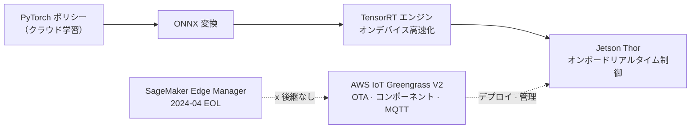

# Pillar 4 — Sim-to-Real

_最終更新: 2026-07 · owner: comeddy · volatility: 中（エッジ HW・モデルは高）_
_特に注記がない限り、各項目はページのメタデータ（owner/updated/volatility）を継承します。項目ごとに owner を指定する場合は項目フッターに追記します。_
[← index へ](index.md)

> **L0 TL;DR**: 正直な一言 — **locomotion（歩行）の sim-to-real はほぼ解決され、デプロイ済みです**（ANYmal、Agility Digit）。**マニピュレーション(manipulation) の sim-to-real はまだです** — フロンティア VLA でさえシミュレーションではなく、**実機体データで学習**しており、シミュレーションは主に評価/適応に使われます。さらにアーキテクチャの不変法則: **30~100Hz のリアルタイム制御は必ずエッジ（オンボード）**、高レベルの計画のみをクラウドに置きます。

---

## このピラーで顧客が最もよく尋ねる質問 Top 3

1. **「sim-to-real は実際に可能ですか？検証された事例はありますか？」** → [locomotion（可能）](#2-locomotion-sim-to-real--検証済み本番)、[マニピュレーション（まだ）](#4-マニピュレーション-manipulation-sim-to-real--research---狭い本番)
2. **「リアルタイム制御ですが、推論はエッジに置くべきですか、クラウドに置くべきですか？」** → [エッジ推論デプロイ](#1-エッジ推論デプロイ--ga)、[decisions](decisions.md)
3. **「実機体にデプロイする前に、ポリシーがうまく機能するかどうかをどう検証しますか？」** → [ポリシー評価](#5-ポリシー評価--デプロイ前検証--research未解決問題)

> **安定原理（ほとんど変わりません）**: sim-to-real gap の正体は (1) **動力学の不一致**（シミュ物理 ≠ 実物、特に接触）、(2) **視覚の不一致**（レンダリング ≠ 実カメラ）です。locomotion がうまくいく理由はロボット+地面というシンプルで寛容な動力学であり、マニピュレーションがうまくいかない理由は接触動力学が厄介だからです。検証された処方は **選択的ドメインランダマイゼーション(DR) + システム同定(SysID) + RL を MPC の上に載せるハイブリッド**です。

---

## 1. エッジ推論デプロイ  🟢 GA

**L0 TL;DR**: リアルタイム制御の推論はロボットのオンボードで動かす必要があります。2026 年の標準経路 = **NVIDIA Jetson Thor(GA) + AWS IoT Greengrass V2 + ONNX/TensorRT**。⚠️ **SageMaker Edge Manager は 2024-04 に終了** — 代替はありません、ONNX+Greengrass で進めます。

**顧客ニーズ/問題**: 「学習はクラウドで行いましたが、ロボットにどうデプロイして OTA で管理しますか？リアルタイムなのにクラウド往復はできないのでは？」

**ソリューション概要** `[1]/[3]`:

- **エッジ HW**: **[Jetson](https://www.nvidia.com/en-us/autonomous-machines/embedded-systems/jetson-thor/) Thor(Blackwell) GA**、T5000 本番モジュールが流通中。Jetson Orin 系列も引き続き生産（低消費電力）。スペック・価格は下の折りたたみブロック参照。
- **デプロイ/管理**: **[AWS IoT Greengrass V2](https://docs.aws.amazon.com/greengrass/v2/developerguide/what-is-iot-greengrass.html)**(GA) — Lambda/Docker/カスタムコンポーネント、ML 推論コンポーネント、MQTT テレメトリ。⚠️ **Greengrass V1 は 2026-06-01 にサポート終了** — V2 のみが現行です。
- **モデル経路**: PyTorch ポリシー → **[ONNX](https://onnx.ai/)** → **[TensorRT](https://developer.nvidia.com/tensorrt)** エンジンのコンパイル（オンデバイス高速化）でリアルタイム制御の遅延予算（sub-20~30ms 級）を満たすのが標準経路です。[SageMaker Neo](https://docs.aws.amazon.com/sagemaker/latest/dg/neo.html)（エッジコンパイル）は存続しており、Greengrass と組み合わせられます。
- ⚠️ **SageMaker Edge Manager EOL(2024-04-26)** — コンソール・API がすべて利用不可。**ドロップイン可能なマネージド後継サービスはありません**。AWS の推奨 = ONNX + Greengrass V2（+ オプションで SageMaker Neo）。

🔄 揮発性データ（エッジ HW スペック・価格 — 2026-07 確認）

| 項目 | 値 | 出典 |
|---|---|---|
| Jetson Thor GA | 2025-08-25 発表, dev kit $3,499, 2025-11 出荷開始 | NVIDIA `[3]` |
| AGX Thor スペック | Blackwell GPU, 128GB 統合 LPDDR5X, 130W, FP4 サポート | NVIDIA `[3]` |
| Thor vs Orin | NVIDIA 公式: 正規化 AI コンピュート ~7.5 倍, エネルギー効率 ~3.5 倍。⚠️ Thor=FP4/FP8 TFLOPS, Orin=INT8 TOPS — 生の数値の直接比較は禁止 | NVIDIA `[3]` |
| ONNX→TensorRT 高速化 | ~7 倍（ベンダー数値, NVIDIA Jetson ブログ 2025, モデル・HW に依存 — 引用時は条件を併記） | NVIDIA `[3]` |

**AWS マッピング**: IoT Greengrass V2 + IoT Core(MQTT) + SageMaker Neo（コンパイル）+ S3（モデルアーティファクト）+ IoT Jobs(OTA)。Model Monitor でエッジテレメトリを収集。

**意思決定基準**（詳細 → [decisions Cloud vs Edge](decisions.md)）:

- **30~100Hz+ の反応型制御**（バランス・力・把持・歩行）→ **必ずオンボード Jetson**。クラウド往復は不可。
- **sub-1Hz~few-Hz の高レベル計画・VLA 推論** → クラウド/非同期が可能。**action chunking** が 2 つの rate をつなぐ橋です。
- マネージドのエッジサービスを希望 → 存在しないと正直に伝え、ONNX+Greengrass V2 の設計を提供。

**顧客事例**: （エッジデプロイ自体の公開 AWS ロボット事例は限定的 — リファレンスアーキテクチャ中心）

**➡️ 次のアクション**: **「Jetson Thor（オンボード制御）+ Greengrass V2(OTA/管理) + ONNX→TensorRT」エッジリファレンスアーキテクチャを描き**、「Edge Manager は無くなった」という点を先手で伝えて顧客の誤った期待を訂正します。リアルタイム要求の Hz を尋ねてエッジ/クラウドの境界を確定します。

**🔗 関連資産**: [pillar-2 System1/System2](pillar-2.md) · [pillar-5 オーケストレーション](pillar-5.md) · [decisions](decisions.md)

---

## 2. Locomotion Sim-to-Real  🟢 検証済み（本番）

**L0 TL;DR**: sim-to-real が「可能」である証拠がここにあります。四足歩行(ANYmal)と二足物流ロボット(Agility Digit) はシミュレーションで RL により学習し、**実際の有料の産業現場にデプロイ**されました。

**顧客ニーズ/問題**: 「sim-to-real はマーケティングではないのですか？実際にお金をもらって働くロボットはいますか？」

**ソリューション概要** `[1]/[3]`:

- **ANYmal ([ANYbotics](https://www.anybotics.com/anymal/))** 🟢 — 大規模並列シミュレーション RL で学習した歩行、**数百台が世界中の産業点検（石油・ガス・鉱山・化学）にデプロイ**。ETH RL-walking 系譜（peer-reviewed）。**本番 + 証拠**。
- **[Agility Digit](https://agilityrobotics.com/robots) @ GXO** 🟢 — **複数年 RaaS 契約の下での有料商業作業**、2025-11 時点で **10 万+ トート移動**、約 1 年連続フルタイム、6.5 万+ 稼働時間。**最もよく検証された有料ヒューマノイド作業**（顧客 GXO がクロスチェック）。ただし狭い構造化トート移動タスクに限定。
- ⚠️ **Boston Dynamics Spot は製品に MPC（古典制御）を搭載 — RL ではありません**。Spot の RL 歩行(5.2m/s) は研究キット(BD+NVIDIA+RAI)にのみ存在します。**この業界で最もよく間違えられる事実** — 逆に言わないこと。

**AWS マッピング**: 学習(→[pillar-2](pillar-2.md)、[pillar-3](pillar-3.md)) + エッジデプロイ(→第 1 項)。ベンダーごとのインフラは非公開。

**意思決定基準**: 顧客のユースケースが歩行・移動(locomotion) → sim-to-real は成熟しており、積極的に提案可能。精密マニピュレーション → 慎重に（第 4 項）。

**顧客事例**: ANYmal（産業点検、本番）、Agility Digit@GXO（物流、有料）。⚠️ **どのヒューマノイドにも独立第三者による自律性監査はありません** — ベンダー/顧客 PR ベース([3])。

**➡️ 次のアクション**: 顧客が sim-to-real に懐疑的な場合、**ANYmal/Digit@GXO を「可能」の根拠として使い、ただし「locomotion だから可能」を明確にします**。Spot=MPC の事実を正確に理解して信頼を確保します。

**🔗 関連資産**: [pillar-3 並列 RL](pillar-3.md) · [pillar-2 学習](pillar-2.md)

🔄 揮発性データ（ヒューマノイド デモ↔本番 のはしご — 2026-07）

| 段階 | 事例 |
|---|---|
| 有料・検証済み | ANYmal（四足、数百台）, Agility Digit@GXO（10 万+ トート） |
| 本番パイロット（メトリクス・自律あり、ベンダー報告） | Figure 02@BMW（~1,250h, 9 万+ 部品→Figure 03）, Apptronik Apollo@Mercedes |
| 製品リリース済みだが自律ではない | 1X Neo（自律 ~60~70%、残りは VR 遠隔操作 "Expert Mode"） |
| 印象的なデモ/研究 | Atlas のアジャイル動作, Spot RL 研究キット（製品は MPC）, Unitree のアジャイルスキル, Figure 03 「8 時間自律」の主張（CEO ツイート） |
| 発表・ロードマップ（0 台稼働） | Hyundai Atlas 2.5 万台（2028、労組反対）, Tesla Optimus V3 |

---

## 3. Sim-to-Real 方法論  🟢 GA（安定原理）

**L0 TL;DR**: 検証された処方は派手な新技法ではなく、**選択的 DR + SysID + RL を MPC の上に載せるハイブリッド**です。むやみにすべてをランダム化すると RL が不安定になります。

**顧客ニーズ/問題**: 「sim-to-real gap を実際にどう縮めますか？どの技法が本番で通用しますか？」

**ソリューション概要** `[1]/[3]`:

- **選択的ドメインランダマイゼーション(DR)** 🟢 — locomotion の標準。ただし**過度なランダム化は学習を不安定にする** → 選択的に行います。
- **システム同定(SysID) + 選択的 DR** 🟢 — コアな動力学パラメータを実測で校正してから選択的 DR。現在のベストプラクティス。
- **RL over MPC ハイブリッド** 🟢 — 純粋な end-to-end RL ではなく、古典 MPC をベースに + 学習ポリシーで堅牢化。**Boston Dynamics もこのハイブリッド = 実際のデプロイに最も近い**。
- **研究段階**（本番ではない）: 残差 real2sim2real(ASAP)、分布的 SysID(Spot 研究)、VLM ベースの SysID(Vid2Sid) — 🔵 印象的だが単一ラボのデモ。

**AWS マッピング**: 方法論自体はクラウド中立。大規模 DR/SysID スイープは AWS Batch で並列化(→[pillar-3](pillar-3.md))。

**意思決定基準**: locomotion → DR+SysID+ハイブリッドを信頼。マニピュレーション → この処方だけでは不十分、実データの並行が必須（第 4 項）。

**顧客事例**: ANYmal・Digit（上の第 2 項）がこの方法論の産物。

**➡️ 次のアクション**: 顧客チームが「むやみに DR」で迷走している場合、**「選択的 DR + SysID + MPC ハイブリッド」で方向を修正します**。研究の新技法(ASAP など)は「研究段階」と正直にラベル付けします。

**🔗 関連資産**: [pillar-3 シミュレーション](pillar-3.md)

---

## 4. マニピュレーション (Manipulation) Sim-to-Real  🔵 Research / 🟡 狭い本番

**L0 TL;DR**: 正直な悪い知らせ — **一般的な接触の多いマニピュレーションの sim-to-real は解決していません**。だからフロンティア VLA(OpenVLA, π0.5, Gemini Robotics) はシミュレーションではなく、**実機体データ**で学習します。本番は狭い低難度の loco-manipulation（トート/部品移動）のみです。

**顧客ニーズ/問題**: 「私たちは組立/把持のようなマニピュレーションが必要です。シミュレーションで学習して可能ですか？」

**ソリューション概要** `[1]`:

- **なぜ遅れているか**: マニピュレーションは**接触動力学の不一致**が大きく、報告された sim-to-real の性能低下 ~24~30%、照明/カメラポーズの変化だけで成功率が 30~50% 低下。
- **核心的洞察 — VLA は実データに依存**: **[OpenVLA](https://github.com/openvla/openvla)**(7B) は約 97 万個の**実機体**デモ(Open X-Embodiment)で学習。**π0/π0.5**、**RT-2**、**Gemini Robotics** はすべて大規模な**実ロボットデータ**中心で、シミュレーションは評価/適応の補助です。Gemini Robotics は SDK に MuJoCo を評価用にバンドルしています。
- **成熟度**: 精密・多指接触マニピュレーション、オープンワールド VLA 家事(π0.5) → **印象的なデモ/trusted-tester Preview**。**2026-07 時点で接触の多いマニピュレーションを GA 本番として検証した汎用 VLA はありません**。

**AWS マッピング**: 実データパイプラインが鍵 → [pillar-1](pillar-1.md)。シミュレーションは評価補助（第 5 項）。

**意思決定基準**:

- 狭い構造化把持・移動 → 可能（Digit 級）。
- 汎用・精密・接触の多いマニピュレーション → **現在未解決**、実データの大量収集が前提 + 期待値管理。
- 「シミュレーションだけでマニピュレーションポリシー」→ リスクあり、実デモでのファインチューニングが必須。

**顧客事例**: 狭い loco-manipulation(Digit, Figure 02) のみが本番。精密マニピュレーションは研究/Preview。

**➡️ 次のアクション**: マニピュレーション顧客には**期待値を正直に管理** — 「locomotion ほど解決していない、実データが鍵」を先に伝え、[pillar-1 実データパイプライン](pillar-1.md)へつなげます。過剰な約束は禁止。

**🔗 関連資産**: [pillar-1 テレオペレーション/実データ](pillar-1.md) · [pillar-2 VLA ファインチューニング](pillar-2.md)

---

## 5. ポリシー評価 — デプロイ前検証  🔵 Research（未解決問題）

**L0 TL;DR**: 不都合な真実 — **どのシミュレーション評価スイートも実デプロイのゲートとして信頼されていません**。人気のベンチマーク(LIBERO/SimplerEnv/CALVIN) が shortcut・過学習・統計的に有意でない問題を露呈しました。現在の方向は real-to-sim 再構成 + 分散実世界 A/B です。

**顧客ニーズ/問題**: 「実機体に載せる前に、ポリシーが本当にうまく機能すると確信するにはどうしますか？」

**ソリューション概要** `[1]`:

- **sim 評価スイート**: SimplerEnv、LIBERO、Meta-World などが存在するが限界を露呈。2026-06 監査: 言語エンコーダのない 90M プローブが LIBERO 3/4 で SOTA に一致（shortcut）、報告された「進歩」のうち統計的裏付けがあるのは ~20% のみ、CALVIN は配置ポーズの再サンプルだけで 25% 低下。**sim↔real の相関が低い**。
- **実世界評価**: **[RoboArena](https://robo-arena.github.io/)** — 分散二重盲検 A/B（ポリシー IP のみを与え、その正体を隠す）、7 機関 4,284 エピソード、Bradley-Terry/Elo。研究フレームワークだが方向を示す。
- **新方向**: real-to-sim（Gaussian Splatting/ワールドモデルによるシーン再構成）+ 分散実 A/B。単一 sim スイート = 信頼できるゲートではない。

**AWS マッピング**: 大規模評価スイープの並列化 → AWS Batch。実世界 A/B データ収集 → IoT/S3。（マネージドなロボット評価サービスはありません）

**意思決定基準**: sim ベンチマークスコアだけでデプロイ判断をするのは禁止。**sim スクリーニング + 実世界の段階的検証**を並行。ベンチマークスコアを引用する際は統計的有意性・測定条件を確認。

**顧客事例**: （評価自体は研究領域）

**➡️ 次のアクション**: 顧客が「sim で 95% 出たからデプロイ」しようとする場合、**「sim↔real の相関が低いという最新研究」を根拠に、段階的な実世界検証を設計する**よう助言します。この正直さが事故を防ぎます。

**🔗 関連資産**: [pillar-3 シミュレーション](pillar-3.md) · [pillar-1 実データ](pillar-1.md)

---

## このピラーの正直な現実（SA 必読）

- **locomotion は可能、マニピュレーションはまだ。** この一文が sim-to-real の会話の骨格です。過剰な約束は信頼を失います。
- **Spot = MPC、RL ではない。** この業界で最も多い誤り。逆に言うと専門性を疑われます。
- **フロンティア VLA は実データで学習**、シミュレーションは評価/適応の補助 — 「シミュレーションだけでマニピュレーションポリシー」は罠です。
- **SageMaker Edge Manager は死亡(2024-04)**、後継なし → ONNX + Greengrass V2。**Greengrass V1 も 2026-06 終了**、V2 のみが現行。
- **30~100Hz 制御は必ずエッジ。** action chunking がクラウドの計画とエッジの制御をつなぐ橋です。
- **ヒューマノイドの「本番」指標はほとんどがベンダー PR** — 独立した自律性監査はありません。Digit@GXO・Figure@BMW のみが顧客のクロスチェック済み。1X Neo は「製品だが実際には遠隔操作」。

---
_owner: comeddy · updated: 2026-07 · volatility: 中（エッジ HW・ベンダー指標は高）· sources: [1] 公式/論文, [2] AWS 内部検証, [3] ベンダー/PR, [4] 未検証。2026 arXiv プレプリントは非査読(illustrative)。_
