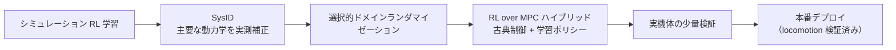

# Pillar 4 — Sim-to-Real

_最終更新: 2026-09 · owner: Youngjin · volatility: 中（エッジ HW・モデルは高）_
_特に注記がない限り、各項目はページのメタデータ（owner/updated/volatility）を継承します。項目ごとに owner を指定する場合は項目フッターに追記します。_
[← index へ](index.md)

> **L0 TL;DR**: ロボット・業務・環境ごとに実機検証します。観測→動作期限と通信断要件で配置し、[独立安全・取消・復旧](operations.md)を設計します。歩行・操作の分類だけで配備可否を決めません。

---

> **確認範囲**：ページ更新日は全項目の再確認日ではありません。主要訂正の日付・再現/人の確認状態は[根拠](evidence.md)を参照し、既存項目の確認日は従来どおり適用します。

## このピラーで顧客が最もよく尋ねる質問 Top 3

> 質問は探索例であり、実測した問い合わせ頻度順位ではありません。

1. **「sim-to-real は実際に可能ですか？検証された事例はありますか？」** → [locomotion（可能）](#2-locomotion-sim-to-real--検証済み本番)、[マニピュレーション（まだ）](#4-マニピュレーション-manipulation-sim-to-real--research---狭い本番)
2. **「リアルタイム制御ですが、推論はエッジに置くべきですか、クラウドに置くべきですか？」** → [エッジ推論デプロイ](#1-エッジ推論デプロイ--ga)、[decisions](decisions.md)
3. **「実機体にデプロイする前に、ポリシーがうまく機能するかどうかをどう検証しますか？」** → [ポリシー評価](#5-ポリシー評価--デプロイ前検証--research未解決問題)

> **安定原理（ほとんど変わりません）**: sim-to-real gap の正体は (1) **動力学[^dyn]の不一致**（シミュ物理 ≠ 実物、特に接触）、(2) **視覚の不一致**（レンダリング ≠ 実カメラ）です。locomotion がうまくいく理由はロボット+地面というシンプルで寛容な動力学であり、マニピュレーションがうまくいかない理由は接触動力学が厄介だからです。検証された処方は **選択的ドメインランダマイゼーション(DR)[^dr] + システム同定(SysID)[^sysid] + RL を MPC[^mpc] の上に載せるハイブリッド**です。

---

## 1. エッジ推論配備 — モデル別検証 { #1-エッジ推論デプロイ--ga }

**L0 TL;DR**: モデル・機器・制御時序に合わせ配備を検証します。厳しい期限の制御はローカルで実行し、クラウドは学習・管理・遅延許容の業務計画に使用します。

**概要**：[Greengrass V2](https://docs.aws.amazon.com/greengrass/v2/developerguide/what-is-iot-greengrass.html)はコンポーネント配備・管理を支援します `[1]`。モデルが対応するPyTorch・ONNX/TensorRT等を選び、全VLAに同一export・遅延を仮定しません。[Edge Manager終了](https://docs.aws.amazon.com/sagemaker/latest/dg/edge-eol.html)後も、変換・機器検証・運用の責任をプロジェクトで定めます。

| 確認項目 | 証拠 |
|---|---|
| モデル・機器互換性 | 重み、ランタイム、ドライバー、センサー、動作単位・正規化 |
| 時間条件 | 観測更新、推論遅延、動作周期、最悪ジッター |
| 更新 | モデル・アプリ・設定版、署名・ハッシュ、前回正常な組 |
| 運用 | 通信断、取消・タイムアウト、介入、復旧試験 |

**Action chunking訂正**：未来動作の出力は新観測へのフィードバックとは異なります。推論Hz×chunk長を制御周波数にしません。native chunk全体を必ず実行する共通規則もなく、モデル・実行horizon・切替方式ごとに評価します（[PI RTC](https://www.physicalintelligence.company/research/real_time_chunking)、[根拠](evidence.md#action-chunking)）。

**AWSマッピング**：S3モデル資産、Greengrass V2・IoT Jobs配備管理、IoT Core状態・イベントを必要に応じて組み合わせます。安全認証やリアルタイム制御の保証ではありません。

**判断・次のアクション**：[4階層の責任者](operations.md#layers)と[障害試験](operations.md#failure)を定め、[手順C](execution.md#finetuning)の出力を監督下の少数機試験に引き継ぎます。

**🔗 関連資産**:

- プレイブック: [pillar-2 System1/System2](pillar-2.md) · [pillar-5 オーケストレーション](pillar-5.md) · [decisions](decisions.md)
- [VLA Hub — AWS 上のリアルタイム VLA 推論ハブ](https://github.com/aws-samples/sample-vla-hub-on-aws) — aws-samples。OSS VLA 6 種（GR00T N1.6/N1.7・π0.5・OpenVLA-7B・SmolVLA-450M・LAP-3B）をモデルごとの独立 gRPC エンドポイントとして CDK でデプロイ（ECS on EC2 g5/g6、内部 NLB）。デプロイ時に GPU 容量のある AZ を自動検出。同一コンテナ・proto の Jetson（Orin/Thor）単一デバイストラックを含み、System 2 のクラウド/エッジ推論経路を 1 つのコードベースでカバー。モデル別ライセンス・適応コスト・シナリオ推奨をまとめた capability matrix は顧客対話に有用。⚠️ 初期段階（2026-05 作成）・内部 NLB のみ（クライアントは同一 VPC 必須）・GR00T はライセンス確認必須
- [ROS2 OTA ファームウェア更新](https://github.com/aws-samples/ros2-ota-firmware-updates) — aws-samples。Greengrass V2 + IoT Jobs による ROS2 フリートのファームウェア OTA リファレンス実装 — デバイスエージェントが Docker レジストリからイメージを取得し、失敗時は直前の正常バージョンへ自動ロールバック、インターネット非接続デバイスは Greengrass プロキシ経由。上表の IoT Jobs 行を実コードで示すアセット

---

## 2. Locomotion Sim-to-Real  🟢 検証済み（本番）

**L0 TL;DR**: sim-to-real が「可能」である証拠がここにあります。四足歩行(ANYmal)と二足物流ロボット(Agility Digit) はシミュレーションで RL により学習し、**実際の有料の産業現場にデプロイ**されました。

**顧客ニーズ/問題**: 「sim-to-real はマーケティングではないのですか？実際にお金をもらって働くロボットはいますか？」

**ソリューション概要** `[1]/[3]`:

- **ANYmal ([ANYbotics](https://www.anybotics.com/anymal/))** 🟢 — 大規模並列シミュレーション RL で学習した歩行、**数百台が世界中の産業点検（石油・ガス・鉱山・化学）にデプロイ**。ETH RL-walking 系譜（peer-reviewed）。**本番 + 証拠**。
- **[Agility Digit](https://agilityrobotics.com/robots) @ GXO** 🟢 — **複数年 RaaS 契約の下での有料商業作業**、2025-11 時点で **10 万+ トート移動**、約 1 年連続フルタイム、6.5 万+ 稼働時間。**最もよく検証された有料ヒューマノイド作業**（顧客 GXO がクロスチェック）。ただし狭い構造化トート移動タスクに限定。
- ⚠️ **Boston Dynamics Spot は製品に MPC（古典制御）を搭載 — RL ではありません**。Spot の RL 歩行(5.2m/s) は研究キット(BD+NVIDIA+RAI)にのみ存在します。**この業界で最もよく間違えられる事実** — 逆に言わないこと。

**AWS マッピング**: 学習(→[pillar-2](pillar-2.md)、[pillar-3](pillar-3.md)) + エッジデプロイ(→第 1 項)。ベンダーごとのインフラは非公開。

**意思決定基準**: 顧客のユースケースが歩行・移動(locomotion) → sim-to-real は成熟しており、積極的に提案可能。精密マニピュレーション → 慎重に（第 4 項）。

**顧客事例**: ANYmal（産業点検、本番）、Agility Digit@GXO（物流、有料）。⚠️ **どのヒューマノイドにも独立第三者による自律性監査はありません** — ベンダー/顧客 PR ベース([3])。

**➡️ 次のアクション**: 顧客が sim-to-real に懐疑的な場合、**ANYmal/Digit@GXO を「可能」の根拠として使い、ただし「locomotion だから可能」を明確にします**。Spot=MPC の事実を正確に理解して信頼を確保します。

**🔗 関連資産**: [pillar-3 並列 RL](pillar-3.md) · [pillar-2 学習](pillar-2.md)

🔄 揮発性データ（ヒューマノイド デモ↔本番 のはしご — 2026-07）

| 段階 | 事例 |
|---|---|
| 有料・検証済み | ANYmal（四足、数百台）, Agility Digit@GXO（10 万+ トート） |
| 本番パイロット（メトリクス・自律あり、ベンダー報告） | Figure 02@BMW（~1,250h, 9 万+ 部品→Figure 03）, Apptronik Apollo@Mercedes |
| 製品リリース済みだが自律ではない | 1X Neo（自律 + VR 遠隔操作 "Expert Mode" の混合運用 — 「自律 60~70%」という数字は一次ソースなし、[radar](radar.md) 参照） |
| 印象的なデモ/研究 | Atlas のアジャイル動作, Spot RL 研究キット（製品は MPC）, Unitree のアジャイルスキル, Figure 03 「8 時間自律」の主張（CEO ツイート） |
| 発表・ロードマップ（0 台稼働） | Hyundai Atlas 2.5 万台（2028、労組反対）, Tesla Optimus V3 |

---

## 3. Sim-to-Real手法 — 適用条件確認 { #3-sim-to-real-方法論--ga安定原理 }

**L0 TL;DR**: 検証された処方は派手な新技法ではなく、**選択的 DR + SysID + RL を MPC の上に載せるハイブリッド**です。むやみにすべてをランダム化すると RL が不安定になります。

**顧客ニーズ/問題**: 「sim-to-real gap を実際にどう縮めますか？どの技法が本番で通用しますか？」

**ソリューション概要** `[1]/[3]`:

- **選択的ドメインランダマイゼーション(DR)** 🟢 — locomotion の標準。ただし**過度なランダム化は学習を不安定にする** → 選択的に行います。
- **システム同定(SysID) + 選択的 DR** 🟢 — コアな動力学パラメータを実測で校正してから選択的 DR。現在のベストプラクティス。
- **RL over MPC ハイブリッド** 🟢 — 純粋な end-to-end RL ではなく、古典 MPC をベースに + 学習ポリシーで堅牢化。**Boston Dynamics もこのハイブリッド = 実際のデプロイに最も近い**。
- **研究段階**（本番ではない）: 残差 real2sim2real(ASAP)、分布的 SysID(Spot 研究)、VLM ベースの SysID(Vid2Sid) — 🔵 印象的だが単一ラボのデモ。
- **deploy-side gap — デプロイ失敗の多くは物理ではなく「配線」** `[2]`: 学習側のギャップ（物理・レンダリングの不一致）とは別に、学習済みポリシーを実機で実行する段階の失敗の多くは **観測 layout・actuation スケールの不一致** から来ます。例: Unitree G1 の whole-body 制御は、観測 86 項目×6 ティック=516 次元の配列順序と `action_scale=0.25` のような定数がシミュレーションと正確に一致する必要があります（一致すれば 0.5m/s コマンドで ~0.38m/s の安定歩行、不一致なら歩行不能）。ポリシー移植チェックリストの第一項目 — DR・SysID を論じる前にこれを。

```mermaid
graph LR
    SIM["シミュレーション RL 学習"] --> SID["SysID<br>主要な動力学を実測補正"]
    SID --> DR["選択的ドメインランダマイゼーション"]
    DR --> MPC["RL over MPC ハイブリッド<br>古典制御 + 学習ポリシー"]
    MPC --> VAL["実機体の少量検証"]
    VAL --> DEP["本番デプロイ<br>（locomotion 検証済み）"]
```

**AWS マッピング**: 方法論自体はクラウド中立。大規模 DR/SysID スイープは AWS Batch で並列化(→[pillar-3](pillar-3.md))。

**意思決定基準**: locomotion → DR+SysID+ハイブリッドを信頼。マニピュレーション → この処方だけでは不十分、実データの並行が必須（第 4 項）。

**顧客事例**: ANYmal・Digit（上の第 2 項）がこの方法論の産物。

**➡️ 次のアクション**: 顧客チームが「むやみに DR」で迷走している場合、**「選択的 DR + SysID + MPC ハイブリッド」で方向を修正します**。研究の新技法(ASAP など)は「研究段階」と正直にラベル付けします。

**🔗 関連資産**: [pillar-3 シミュレーション](pillar-3.md)

---

## 4. マニピュレーション (Manipulation) Sim-to-Real  🔵 Research / 🟡 狭い本番

**L0 TL;DR**: 正直な悪い知らせ — **一般的な接触の多いマニピュレーションの sim-to-real は解決していません**。だからフロンティア VLA(OpenVLA, π0.5, Gemini Robotics) はシミュレーションではなく、**実機体データ**で学習します。本番は狭い低難度の loco-manipulation（トート/部品移動）のみです。

**顧客ニーズ/問題**: 「私たちは組立/把持のようなマニピュレーションが必要です。シミュレーションで学習して可能ですか？」

**ソリューション概要** `[1]`:

- **なぜ遅れているか**: マニピュレーションは**接触動力学の不一致**が大きく、報告された sim-to-real の性能低下 ~24~30%、照明/カメラポーズの変化だけで成功率が 30~50% 低下。
- **核心的洞察 — VLA は実データに依存**: **[OpenVLA](https://github.com/openvla/openvla)**(7B) は約 97 万個の**実機体**デモ(Open X-Embodiment)で学習。**π0/π0.5**、**RT-2**、**Gemini Robotics** はすべて大規模な**実ロボットデータ**中心で、シミュレーションは評価/適応の補助です。Gemini Robotics は SDK に MuJoCo を評価用にバンドルしています。
- **成熟度**: 精密・多指接触マニピュレーション、オープンワールド VLA 家事(π0.5) → **印象的なデモ/trusted-tester Preview**。**2026-07 時点で接触の多いマニピュレーションを GA 本番として検証した汎用 VLA はありません**。

**AWS マッピング**: 実データパイプラインが鍵 → [pillar-1](pillar-1.md)。シミュレーションは評価補助（第 5 項）。

**意思決定基準**:

- 狭い構造化把持・移動 → 可能（Digit 級）。
- 汎用・精密・接触の多いマニピュレーション → **現在未解決**、実データの大量収集が前提 + 期待値管理。
- 「シミュレーションだけでマニピュレーションポリシー」→ リスクあり、実デモでのファインチューニングが必須。

**顧客事例**: 狭い loco-manipulation(Digit, Figure 02) のみが本番。精密マニピュレーションは研究/Preview。

**➡️ 次のアクション**: マニピュレーション顧客には**期待値を正直に管理** — 「locomotion ほど解決していない、実データが鍵」を先に伝え、[pillar-1 実データパイプライン](pillar-1.md)へつなげます。過剰な約束は禁止。

**🔗 関連資産**: [pillar-1 テレオペレーション/実データ](pillar-1.md) · [pillar-2 VLA ファインチューニング](pillar-2.md)

---

## 5. ポリシー評価 — デプロイ前検証  🔵 Research（未解決問題）

**L0 TL;DR**: 不都合な真実 — **どのシミュレーション評価スイートも実デプロイのゲートとして信頼されていません**。人気のベンチマーク(LIBERO/SimplerEnv/CALVIN) が shortcut・過学習・統計的に有意でない問題を露呈しました。現在の方向は real-to-sim 再構成 + 分散実世界 A/B です。

**顧客ニーズ/問題**: 「実機体に載せる前に、ポリシーが本当にうまく機能すると確信するにはどうしますか？」

**ソリューション概要** `[1]`:

- **sim 評価スイート**: SimplerEnv、LIBERO、Meta-World などが存在するが限界を露呈。2026-06 監査: 言語エンコーダのない 90M プローブが LIBERO 3/4 で SOTA に一致（shortcut）、報告された「進歩」のうち統計的裏付けがあるのは ~20% のみ、CALVIN は配置ポーズの再サンプルだけで 25% 低下。**sim↔real の相関が低い**。
- **実世界評価**: **[RoboArena](https://robo-arena.github.io/)** — 分散二重盲検 A/B（ポリシー IP のみを与え、その正体を隠す）、7 機関 4,284 エピソード、Bradley-Terry/Elo。研究フレームワークだが方向を示す。
- **新方向**: real-to-sim（Gaussian Splatting/ワールドモデルによるシーン再構成）+ 分散実 A/B。単一 sim スイート = 信頼できるゲートではない。

**AWS マッピング**: 大規模評価スイープの並列化 → AWS Batch。実世界 A/B データ収集 → IoT/S3。（マネージドなロボット評価サービスはありません）

**意思決定基準**: sim ベンチマークスコアだけでデプロイ判断をするのは禁止。**sim スクリーニング + 実世界の段階的検証**を並行。ベンチマークスコアを引用する際は統計的有意性・測定条件を確認。

**顧客事例**: （評価自体は研究領域）

**➡️ 次のアクション**: 顧客が「sim で 95% 出たからデプロイ」しようとする場合、**「sim↔real の相関が低いという最新研究」を根拠に、段階的な実世界検証を設計する**よう助言します。この正直さが事故を防ぎます。

**🔗 関連資産**: [pillar-3 シミュレーション](pillar-3.md) · [pillar-1 実データ](pillar-1.md)

---

## 6. 実機セルの安全要求 — 設置別確認 { #6-実機セルの安全規制--国際標準と韓国の法定要件--ga規制--低変動 }

**L0 TL;DR**: 人のそばで動くロボットは、法律により防護装置を備える必要があります。国際的には **ISO 10218-1/-2:2025 + ISO/TS 15066（協働ロボット）**、韓国ではさらに **「産業安全保健基準に関する規則」第223条（原則として高さ 1.8m 以上のフェンス）+ KCs[^kcs] 義務安全認証の防護装置** が上乗せされます。このセットアップのコスト・リードタイムが実機検証を遅くする第三の壁であり、裏を返せばシミュレーションの経済的論拠です（→ [pillar-3](pillar-3.md)）。

**顧客ニーズ/問題**: 「ロボットセルを韓国の工場に設置するには、法的に何を備える必要があるか？協働ロボットならフェンスなしで済むのか？」

**ソリューション概要** `[1]`:

- **国際標準の地図**: [ISO 10218-1:2025](https://www.iso.org/standard/73933.html)（ロボット本体）· ISO 10218-2:2025（ロボットセル・統合）· ISO/TS 15066:2016（協働ロボット）· IEC 61496-2/-3（ライトカーテン[^aopd]/安全レーザースキャナ）· ISO 12100（リスクアセスメント）· ANSI/RIA R15.06（米国）。
- **協働ロボットの 4 つの安全運転モード**（ISO/TS 15066）: ① 安全定格監視停止（safety-rated monitored stop）② ハンドガイディング ③ 速度・間隔監視（speed & separation monitoring）④ 動力・力の制限（power & force limiting）。人と同じ空間を共有するには、このうち一つを **認証済みのセンサー・機器で実装し検証** する必要があります。**2025 年改訂で ISO/TS 15066 の接触力・圧力の限界値が ISO 10218-2 本文に吸収** されました。
- **韓国の法定の組み合わせ** — [「産業安全保健基準に関する規則」第223条](https://www.law.go.kr/법령/산업안전보건기준에관한규칙): 産業用ロボットの運転中の労働者の危険防止のため、原則として **高さ 1.8m 以上のフェンス（防護柵）** の設置を要求し、フェンスを設置できない開口部・進入区間には安全マットまたは光電子式防護装置（ライトカーテン）などの感応型防護装置で接触を遮断しなければなりません。この防護装置は [「産業安全保健法」第84条](https://www.law.go.kr/법령/산업안전보건법)に基づく **KCs 義務安全認証品**（ライトカーテン=IEC 61496-2、レーザースキャナ=IEC 61496-3 に対応、雇用労働部「防護装置安全認証告示」）でなければなりません。つまり韓国のロボット作業区域は **「1.8m フェンス +（開口部は）KCs 認証ライトカーテン/安全マット」が事実上の法定の組み合わせ** です。⚠️ 正確な条文・項は韓国の国家法令情報センターの原文で最終確認を。
- **コスト感覚** `[4]`: 安全レーザースキャナは 1 台あたり数千ドル台、安全フェンスはメートルあたりおよそ $60–120（メーカー・仕様による偏差が大きい推定値）+ リスクアセスメント・認証のリードタイム。防護セットアップはロボット本体以外の隠れた原価です。

**AWS マッピング**: 直接のマッピングなし（規制は AWS の外）— ただしこの規制負担が [pillar-3 シミュレーション経済学](pillar-3.md)（「シミュレーションにはフェンス・認証・事故がない」）と [pillar-5 多層防御](pillar-5.md)（エージェント層 Policy + ロボット層 ISO 決定論的安全）の前提になります。

**意思決定基準**: 「協働ロボットだからフェンス不要」は自動ではありません — **リスクアセスメント（ISO 12100）の結果が、4 モードのどれをどの認証機器で実装するかを決めます**。韓国での設置相談は条文確認 + 韓国ロボット産業振興院（KIRIA）の産業用ロボット安全マニュアル参照へ接続。

**顧客事例**: （規制順守は事例ではなくデプロイの前提条件）

**➡️ 次のアクション**: 実機 PoC の提案書に **防護セットアップのコスト・KCs 認証のリードタイムを最初からラインアイテムとして** 入れるよう助言 — 後から発覚するとスケジュールが丸ごと遅れます。同じスライドで「シミュレーション先行検証」（→ [pillar-3](pillar-3.md)）を提案すれば説得が完成します。

**🔗 関連資産**: [pillar-3 なぜシミュレーションか](pillar-3.md) · [pillar-5 安全 & ガードレール](pillar-5.md)

---

## このピラーの正直な現実（SA 必読）

- **locomotion は可能、マニピュレーションはまだ。** この一文が sim-to-real の会話の骨格です。過剰な約束は信頼を失います。
- **Spot = MPC、RL ではない。** この業界で最も多い誤り。逆に言うと専門性を疑われます。
- **フロンティア VLA は実データで学習**、シミュレーションは評価/適応の補助 — 「シミュレーションだけでマニピュレーションポリシー」は罠です。
- **SageMaker Edge Manager は死亡(2024-04)**、後継なし → ONNX + Greengrass V2。**Greengrass V1 も 2026-06 終了**、V2 のみが現行。
- **30~100Hz 制御は必ずエッジ。** action chunking がクラウドの計画とエッジの制御をつなぐ橋です。
- **ヒューマノイドの「本番」指標はほとんどがベンダー PR** — 独立した自律性監査はありません。Digit@GXO・Figure@BMW のみが顧客のクロスチェック済み。1X Neo は「製品だが実際には遠隔操作」。

---
_owner: Youngjin · updated: 2026-09 · volatility: 中（エッジ HW・ベンダー指標は高）· sources: [1] 公式/論文, [3] ベンダー/PR, [4] 未検証。2026 arXiv プレプリントは非査読(illustrative)。_

<!-- 용어 각주 -->

[^dyn]: **動力学（dynamics）** — 力・摩擦・衝突が生み出す運動の物理です。特に物体をつかむ際の接触動力学は、シミュレーターが正確に再現するのが最も難しい部分です。
[^dr]: **ドメインランダマイゼーション（Domain Randomization）** — シミュレーションの照明・質感・物体位置・カメラ角度・物理パラメータをランダムに変えながらデータ生成・学習を行う技法です。ポリシーがどんな環境変化にも耐えられるようになります — sim-to-real の代表的な処方です。
[^sysid]: **システム同定（SysID, System Identification）** — 実機ロボットの物理パラメータ（摩擦・質量・モーター応答）を測定し、シミュレーターを実物に合わせて校正する作業です。
[^mpc]: **MPC（Model Predictive Control）** — 短い未来を繰り返し予測・最適化しながら制御する古典制御技法です。学習した RL ポリシーを MPC の上に載せるハイブリッドが検証済みの処方として定着しました。
[^kcs]: **KCs（安全認証）** — 韓国の産業安全保健法第84条に基づく危険な機械・器具・防護装置の義務安全認証マークです。ライトカーテン・レーザースキャナのような防護装置は KCs 認証品のみが法定の防護装置として認められます。
[^aopd]: **ライトカーテン（AOPD、光電子式防護装置）** — 多数の赤外線ビームで仮想の「光の壁」を作り、人の身体がビームを遮ると即座に機械を停止させる感応型防護装置です。フェンスを設置できない開口部に使われ、国際規格は IEC 61496-2（面積監視型のレーザースキャナは IEC 61496-3）です。
