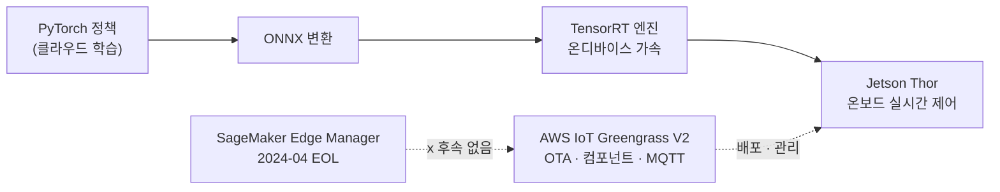

# Pillar 4 — Sim-to-Real

_최종 갱신: 2026-09 · owner: Youngjin · volatility: 중간(엣지 HW·모델은 높음)_
_개별 항목은 별도 표기가 없는 한 페이지 메타데이터(owner/updated/volatility)를 상속. 항목별 owner 지정 시 항목 푸터 추가._
[← index로](index.md)

> **L0 TL;DR**: 정직한 한 줄 — **로코모션(보행)[^loco] sim-to-real[^s2r]은 사실상 풀렸고 배포됐다**(ANYmal, Agility Digit). **조작(manipulation)[^manip] sim-to-real은 아직 아니다** — 프런티어 VLA조차 시뮬레이션이 아니라 **실기체 데이터로 학습**하고, 시뮬레이션은 주로 평가/적응에 쓴다. 그리고 아키텍처 불변 법칙: **30~100Hz 실시간 제어는 반드시 엣지(온보드)**, 고수준 계획만 클라우드로.

---

## 이 필러에서 고객이 가장 자주 묻는 질문 Top 3

1. **"sim-to-real이 실제로 되나요? 검증된 사례가 있나요?"** → [로코모션(된다)](#2-로코모션-sim-to-real--검증됨-프로덕션), [조작(아직)](#4-조작-manipulation-sim-to-real--research---좁은-프로덕션)
2. **"실시간 제어인데 추론을 엣지에 둬야 하나요, 클라우드에 둬야 하나요?"** → [엣지 추론 배포](#1-엣지-추론-배포--ga), [decisions](decisions.md)
3. **"실기체 배포 전에 정책이 잘 되는지 어떻게 검증하죠?"** → [정책 평가](#5-정책-평가--배포-전-검증--research-미해결-문제)

> **안정 원리 (잘 안 바뀜)**: sim-to-real gap의 정체는 (1) **동역학[^dyn] 불일치**(시뮬 물리 ≠ 실물, 특히 접촉), (2) **시각 불일치**(렌더 ≠ 실카메라). 로코모션이 잘 되는 이유는 로봇+지면이라는 단순·관대한 동역학이고, 조작이 안 되는 이유는 접촉 동역학이 까다롭기 때문. 검증된 처방은 **선택적 도메인 랜덤화(DR)[^dr] + 시스템 식별(SysID)[^sysid] + RL을 MPC[^mpc] 위에 얹는 하이브리드**.

---

## 1. 엣지 추론 배포  🟢 GA

**L0 TL;DR**: 실시간 제어 추론은 로봇 온보드에서 돌려야 한다. 2026년 표준 경로 = **NVIDIA Jetson Thor(GA) + AWS IoT Greengrass V2 + ONNX[^onnx]/TensorRT**. ⚠️ **SageMaker Edge Manager는 2024-04 종료** — 대체 없다, ONNX+Greengrass로 간다.

**고객 니즈/문제**: "학습은 클라우드에서 했는데, 로봇에 어떻게 배포하고 OTA[^ota]로 관리하나? 실시간인데 클라우드 왕복은 안 되지 않나?"

**솔루션 개요** `[1]/[3]`:

- **엣지 HW**: **[Jetson](https://www.nvidia.com/en-us/autonomous-machines/embedded-systems/jetson-thor/) Thor(Blackwell) GA**, T5000 프로덕션 모듈 유통. Jetson Orin 계열도 여전히 생산(저전력). 스펙·가격은 아래 접힌 블록.
- **배포/관리**: **[AWS IoT Greengrass V2](https://docs.aws.amazon.com/greengrass/v2/developerguide/what-is-iot-greengrass.html)**(GA) — Lambda/Docker/커스텀 컴포넌트, ML 추론 컴포넌트, MQTT[^mqtt] 텔레메트리. ⚠️ **Greengrass V1은 2026-06-01 지원 종료** — V2만 현행.
- **모델 경로**: PyTorch 정책 → **[ONNX](https://onnx.ai/)** → **[TensorRT](https://developer.nvidia.com/tensorrt)** 엔진 컴파일(온디바이스 가속)로 실시간 제어 지연 예산(sub-20~30ms급)[^latency]을 맞추는 것이 표준 경로. [SageMaker Neo](https://docs.aws.amazon.com/sagemaker/latest/dg/neo.html)(엣지 컴파일)는 존속하며 Greengrass와 조합.
- ⚠️ **SageMaker Edge Manager EOL(2024-04-26)** — 콘솔·API 전부 불가. **드롭인 매니지드 후속 서비스 없음**. AWS 권고 = ONNX + Greengrass V2 (+ 선택적 SageMaker Neo).

🔄 휘발성 데이터 (엣지 HW 스펙·가격 — 2026-07 확인)

| 항목 | 값 | 출처 |
|---|---|---|
| Jetson Thor GA | 2025-08-25 발표, dev kit $3,499(→ 2026-07 인상 $5,499), 2025-11 출하 시작 | NVIDIA `[3]` |
| Jetson 가격 인상 (2026-07-22) | Orin Nano Super devkit $249→$399 · Orin NX 16GB 모듈 $599→$999 · AGX Orin 64GB 모듈 $1,599→$2,999 · **AGX Thor devkit $3,499→$5,499** · T5000(Thor 모듈) $2,999→$4,999 — 엣지 BOM 산정 시 구가격 견적 주의 | NVIDIA 스토어 `[3]` |
| AGX Thor 스펙 | Blackwell GPU, 128GB 통합 LPDDR5X, 130W, FP4 지원 | NVIDIA `[3]` |
| Thor vs Orin | NVIDIA 공식: 정규화 AI 컴퓨트 ~7.5배, 에너지효율 ~3.5배. ⚠️ Thor=FP4/FP8 TFLOPS, Orin=INT8 TOPS — 원시 수치 직접 비교 금지 | NVIDIA `[3]` |
| ONNX→TensorRT 가속 | ~7배(벤더 수치, NVIDIA Jetson 블로그 2025, 모델·HW 의존 — 인용 시 조건 병기) | NVIDIA `[3]` |

**배포 스택이 실제로 해주는 것** `[1]` (docs 2026-07 확인):

| 구성요소 | 기술 요약 | 엣지 배포 관점 |
|---|---|---|
| **Jetson Thor** | Blackwell GPU 온보드 엣지 컴퓨터(128GB 통합 메모리) — 실시간 추론을 로봇 안에서 해결 | System 1 정책이 사는 곳 |
| **Greengrass V2** | **컴포넌트**(레시피 + S3 아티팩트) 단위 소프트웨어 배포 런타임 — 플릿 OTA, 프로세스 간 통신(IPC)·MQTT 프록시, 로그 매니저 | 모델·추론 앱을 로봇 플릿에 버전 관리하며 배포하는 통로 |
| **ONNX → TensorRT** | 프레임워크 중립 포맷으로 export 후 디바이스 GPU에 맞춰 커널 융합·정밀도 최적화 컴파일 | sub-20~30ms 지연 예산을 맞추는 표준 경로 |
| **SageMaker Neo** | 타깃 하드웨어별 모델 컴파일 매니지드 서비스(선택) | TensorRT를 직접 다루기 어려운 팀의 대안 |
| **IoT Core (MQTT)** | 경량 발행/구독 메시징 브로커 — 텔레메트리 상향, 명령 하향 | 로봇 상태·이벤트의 클라우드 연결점 |
| **IoT Jobs** | 플릿 대상 원격 작업(OTA) 오케스트레이션 — 단계적 롤아웃·중단·재시도 | 모델 v2를 100대에 안전하게 밀어넣는 메커니즘 |

**AWS 매핑**: IoT Greengrass V2 + IoT Core(MQTT) + SageMaker Neo(컴파일) + S3(모델 아티팩트) + IoT Jobs(OTA). Model Monitor로 엣지 텔레메트리 수집.

**의사결정 기준** (상세 → [decisions Cloud vs Edge](decisions.md)):

- **30~100Hz+ 반응형 제어**(균형·힘·파지·보행) → **반드시 온보드 Jetson**. 클라우드 왕복 불가.
- **sub-1Hz~few-Hz 고수준 계획·VLA 추론** → 클라우드/비동기 가능. **action chunking**이 두 rate를 잇는 다리 — **실효 제어 주기 = 추론 Hz × chunk 크기**(π0.5가 Jetson에서 ~10Hz 추론이어도 chunk 10스텝이면 실효 ~100Hz).
- ⚠️ **chunk는 저장 포맷이 아니라 정책의 일부** `[2]`: native chunk를 쪼개 1-step씩 실행하면 정책이 무너진다(실측: 20-step 실행 3/10 성공 → 1-step 실행 0/48). **실행은 학습된 native chunk 그대로, 저장만 per-step으로**.
- 매니지드 엣지 서비스 원함 → 없다고 정직히 말하고 ONNX+Greengrass V2 설계 제공.

**고객 사례**: (엣지 배포 자체의 공개 AWS 로봇 사례 제한적 — 참조 아키텍처 중심)

**➡️ 다음 액션**: **"Jetson Thor(온보드 제어) + Greengrass V2(OTA/관리) + ONNX→TensorRT" 엣지 참조 아키텍처를 그려주고**, "Edge Manager 없어졌다"는 점을 선제적으로 알려 고객의 잘못된 기대를 정정. 실시간 요구 Hz를 물어 엣지/클라우드 경계 확정.

**🔗 관련 자산**:

- 플레이북: [pillar-2 System1/System2](pillar-2.md) · [pillar-5 오케스트레이션](pillar-5.md) · [decisions](decisions.md)
- [VLA Hub — 실시간 VLA 추론 허브 on AWS](https://github.com/aws-samples/sample-vla-hub-on-aws) — aws-samples. OSS VLA 6종(GR00T N1.6/N1.7·π0.5·OpenVLA-7B·SmolVLA-450M·LAP-3B)을 모델별 독립 gRPC 엔드포인트로 CDK 배포(ECS on EC2 g5/g6, 내부 NLB). 배포 시점에 GPU 가용 AZ 자동 탐지, 동일 컨테이너·proto의 Jetson(Orin/Thor) 단일 디바이스 트랙 포함 — System 2 클라우드/엣지 추론 경로를 한 코드베이스로. 모델별 라이선스·적응 비용·시나리오 추천을 정리한 capability matrix가 고객 상담용으로 유용. ⚠️ 초기 단계(2026-05 생성)·내부 NLB 전용(클라이언트 동일 VPC 필수)·GR00T는 라이선스 확인 필수
- [ROS2 OTA 펌웨어 업데이트](https://github.com/aws-samples/ros2-ota-firmware-updates) — aws-samples. Greengrass V2 + IoT Jobs로 ROS2 플릿 펌웨어 OTA 참조 구현 — 디바이스 에이전트가 Docker 레지스트리에서 이미지 풀, 실패 시 이전 정상 버전 자동 롤백, 인터넷 미연결 디바이스는 Greengrass 프록시 경유. 위 표의 IoT Jobs 행을 실코드로 보여주는 자산

---

## 2. 로코모션 Sim-to-Real  🟢 검증됨 (프로덕션)

**L0 TL;DR**: sim-to-real이 "된다"는 증거가 여기 있다. 사족보행(ANYmal)과 이족 물류로봇(Agility Digit)은 시뮬레이션에서 RL로 학습해 **실제 유료 산업 현장에 배포**됐다.

**고객 니즈/문제**: "sim-to-real이 마케팅 아니냐? 실제로 돈 받고 일하는 로봇이 있나?"

**솔루션 개요** `[1]/[3]`:

- **ANYmal ([ANYbotics](https://www.anybotics.com/anymal/))** 🟢 — 대규모 병렬 시뮬레이션 RL로 학습한 보행, **수백 대가 전 세계 산업 점검(석유·가스·광산·화학)에 배포**. ETH RL-walking 계보(peer-reviewed). **프로덕션 + 증거**.
- **[Agility Digit](https://agilityrobotics.com/robots) @ GXO** 🟢 — **다년 RaaS 계약 하에 유료 상업 작업**, 2025-11 기준 **10만+ 토트 이동**, ~1년 연속 풀타임, 6.5만+ 가동시간. **가장 잘 검증된 유료 휴머노이드 작업**(고객 GXO가 교차 확인). 단 좁은 구조화 토트 이동 태스크.
- ⚠️ **Boston Dynamics Spot은 제품에 MPC(고전 제어) 탑재 — RL 아님**. Spot의 RL 보행(5.2m/s)은 연구킷(BD+NVIDIA+RAI)에만 존재. **이 업계에서 가장 자주 틀리는 사실** — 반대로 말하지 말 것.

**AWS 매핑**: 학습(→[pillar-2](pillar-2.md), [pillar-3](pillar-3.md)) + 엣지 배포(→1번). 벤더별 인프라는 비공개.

**의사결정 기준**: 고객 유스케이스가 보행·이동(로코모션) → sim-to-real 성숙, 적극 제안 가능. 정밀 조작 → 신중(4번).

**고객 사례**: ANYmal(산업 점검, 프로덕션), Agility Digit@GXO(물류, 유료). ⚠️ **독립 3자 자율성 감사는 어떤 휴머노이드에도 없음** — 벤더/고객 PR 기준([3]).

**➡️ 다음 액션**: 고객이 sim-to-real 회의적이면 **ANYmal/Digit@GXO를 "된다"의 근거로, 단 "로코모션이라 된다"를 명확히**. Spot=MPC 사실을 정확히 알아 신뢰 확보.

**🔗 관련 자산**: [pillar-3 병렬 RL](pillar-3.md) · [pillar-2 학습](pillar-2.md)

🔄 휘발성 데이터 (휴머노이드 데모↔프로덕션 사다리 — 2026-07)

| 단계 | 사례 |
|---|---|
| 유료·검증 | ANYmal(사족, 수백 대), Agility Digit@GXO(10만+ 토트) |
| 프로덕션 파일럿(메트릭·자율, 벤더보고) | Figure 02@BMW(~1,250h, 9만+ 부품→Figure 03), Apptronik Apollo@Mercedes |
| 제품 출시했으나 자율 아님 | 1X Neo(자율+VR 원격조작 "Expert Mode" 혼합 운용 — "자율 60~70%" 수치는 1차 출처 없음, [radar](radar.md) 참조) |
| 인상적 데모/연구 | Atlas 애자일 동작, Spot RL 연구킷(제품은 MPC), Unitree 애자일 스킬, Figure 03 "8시간 자율" 주장(CEO 트윗) |
| 발표·로드맵(0대 가동) | Hyundai Atlas 2.5만 대(2028, 노조 반대), Tesla Optimus V3 |

---

## 3. Sim-to-Real 방법론  🟢 GA (안정 원리)

**L0 TL;DR**: 검증된 처방은 화려한 신기법이 아니라 **선택적 DR + SysID + RL을 MPC 위에 얹는 하이브리드**다. 무작정 다 랜덤화하면 RL이 불안정해진다.

**고객 니즈/문제**: "sim-to-real gap을 실제로 어떻게 좁히나? 어떤 기법이 프로덕션에서 통하나?"

**솔루션 개요** `[1]/[3]`:

- **선택적 도메인 랜덤화(DR)** 🟢 — 로코모션 표준. 단 **과도한 랜덤화는 학습 불안정** → 선택적으로.
- **시스템 식별(SysID) + 선택적 DR** 🟢 — 핵심 동역학 파라미터를 실측 보정 후 선택적 DR. 현 베스트 프랙티스.
- **RL over MPC 하이브리드** 🟢 — 순수 end-to-end RL이 아니라 고전 MPC 베이스 + 학습 정책으로 강건화. **Boston Dynamics도 이 하이브리드 = 실제 배포에 가장 근접**.
- **연구 단계**(프로덕션 아님): 잔차 real2sim2real(ASAP), 분포적 SysID(Spot 연구), VLM 기반 SysID(Vid2Sid) — 🔵 인상적이나 단일 랩 데모.
- **deploy-side gap — 배포 실패의 다수는 물리가 아니라 "배선"** `[2]`: 학습-side 갭(물리·렌더 불일치)과 별개로, 학습된 정책을 실기에서 실행하는 단계의 실패 다수는 **관측 layout·actuation 스케일 불일치**에서 온다. 예: Unitree G1 whole-body 제어는 관측 86칸×6틱=516차원의 배열 순서와 `action_scale=0.25` 같은 상수가 sim과 정확히 일치해야 한다(일치 시 0.5m/s 명령에 ~0.38m/s 안정 보행, 불일치 시 보행 불능). 정책 이식 체크리스트의 1순위 — DR·SysID를 논하기 전에 이것부터.

**AWS 매핑**: 방법론 자체는 클라우드 중립. 대규모 DR/SysID 스윕은 AWS Batch 병렬화(→[pillar-3](pillar-3.md)).

**의사결정 기준**: 로코모션 → DR+SysID+하이브리드 신뢰. 조작 → 이 처방만으론 부족, 실데이터 병행 필수(4번).

**고객 사례**: ANYmal·Digit(위 2번)이 이 방법론의 산물.

**➡️ 다음 액션**: 고객 팀이 "무작정 DR"로 헤매면 **"선택적 DR + SysID + MPC 하이브리드"** 로 방향 교정. 연구 신기법(ASAP 등)은 "연구단계"로 정직히 라벨.

**🔗 관련 자산**: [pillar-3 시뮬레이션](pillar-3.md)

---

## 4. 조작 (Manipulation) Sim-to-Real  🔵 Research / 🟡 좁은 프로덕션

**L0 TL;DR**: 정직한 나쁜 소식 — **일반 접촉 풍부 조작의 sim-to-real은 안 풀렸다**. 그래서 프런티어 VLA(OpenVLA, π0.5, Gemini Robotics)는 시뮬레이션이 아니라 **실기체 데이터**로 학습한다. 프로덕션은 좁은 저난도 로코-매니퓰레이션(토트/부품 이동)만.

**고객 니즈/문제**: "우리는 조립/파지 같은 조작이 필요하다. 시뮬레이션으로 학습해서 되나?"

**솔루션 개요** `[1]`:

- **왜 뒤처지나**: 조작은 **접촉 동역학 불일치**가 커서, 보고된 sim-to-real 성능 저하 ~24~30%, 조명/카메라 포즈 변화만으로 성공률 30~50% 하락.
- **핵심 통찰 — VLA는 실데이터에 의존**: **[OpenVLA](https://github.com/openvla/openvla)**(7B)는 ~97만 개 **실기체** 데모(Open X-Embodiment)로 학습. **π0/π0.5**, **RT-2**, **Gemini Robotics** 전부 대규모 **실로봇 데이터** 중심, 시뮬레이션은 평가/적응 보조. Gemini Robotics는 SDK에 MuJoCo를 평가용으로 번들.
- **성숙도**: 정밀·다지 접촉 조작, 오픈월드 VLA 가사(π0.5) → **인상적 데모/trusted-tester Preview**. **2026-07 기준 접촉 풍부 조작을 GA 프로덕션으로 검증한 범용 VLA는 없음**.

**AWS 매핑**: 실데이터 파이프라인이 관건 → [pillar-1](pillar-1.md). 시뮬레이션은 평가 보조(5번).

**의사결정 기준**:

- 좁은 구조화 파지·이동 → 가능(Digit급).
- 범용·정밀·접촉 풍부 조작 → **현재 미해결**, 실데이터 대량 수집 전제 + 기대치 관리.
- "시뮬레이션만으로 조작 정책" → 위험, 실데모 파인튜닝 필수.

**고객 사례**: 좁은 로코-매니퓰레이션(Digit, Figure 02)만 프로덕션. 정밀 조작은 연구/Preview.

**➡️ 다음 액션**: 조작 고객에겐 **기대치를 정직하게 관리** — "로코모션만큼 안 풀렸다, 실데이터가 핵심"을 먼저 말하고, [pillar-1 실데이터 파이프라인](pillar-1.md)으로 연결. 과약속 금지.

**🔗 관련 자산**: [pillar-1 텔레옵/실데이터](pillar-1.md) · [pillar-2 VLA 파인튜닝](pillar-2.md)

---

## 5. 정책 평가 — 배포 전 검증  🔵 Research (미해결 문제)

**L0 TL;DR**: 불편한 진실 — **어떤 시뮬레이션 평가 스위트도 실배포 게이트로 신뢰받지 못한다**. 인기 벤치마크(LIBERO/SimplerEnv/CALVIN)가 shortcut·과적합·통계적 무의미 문제를 드러냈다. 현재 방향은 real-to-sim 재구성 + 분산 실세계 A/B.

**고객 니즈/문제**: "실기체에 올리기 전에 정책이 진짜 잘 되는지 어떻게 확신하나?"

**솔루션 개요** `[1]`:

- **sim 평가 스위트**: SimplerEnv, LIBERO, Meta-World 등 존재하나 한계 노출. 2026-06 감사: 언어 인코더 없는 90M 프로브가 LIBERO 3/4에서 SOTA 매칭(shortcut), 보고된 "진보"의 ~20%만 통계적 입증, CALVIN은 배치 포즈 리샘플만으로 25% 하락. **sim↔real 상관 낮음**.
- **실세계 평가**: **[RoboArena](https://robo-arena.github.io/)** — 분산 이중맹검 A/B(정책 IP만 주고 정체 숨김), 7기관 4,284 에피소드, Bradley-Terry/Elo. 연구 프레임워크지만 방향 제시.
- **신방향**: real-to-sim(Gaussian Splatting/월드모델 씬 재구성) + 분산 실 A/B. 단일 sim 스위트 = 신뢰 게이트 아님.

**AWS 매핑**: 대규모 평가 스윕 병렬화 → AWS Batch. 실세계 A/B 데이터 수집 → IoT/S3. (매니지드 로봇 평가 서비스는 없음)

**의사결정 기준**: sim 벤치 점수만으로 배포 결정 금지. **sim 스크리닝 + 실세계 단계적 검증** 병행. 벤치 점수 인용 시 통계적 유의성·측정조건 확인.

**고객 사례**: (평가 자체는 연구 영역)

**➡️ 다음 액션**: 고객이 "sim에서 95% 나왔으니 배포" 하려 하면 **"sim↔real 상관이 낮다는 최신 연구"를 근거로 단계적 실세계 검증을 설계**하도록 조언. 이 정직함이 사고를 막는다.

**🔗 관련 자산**: [pillar-3 시뮬레이션](pillar-3.md) · [pillar-1 실데이터](pillar-1.md)

---

## 6. 실기체 셀의 안전 규제 — 국제 표준과 한국 법정 요구  🟢 GA (규제 — 저변동)

**L0 TL;DR**: 사람 곁에서 움직이는 로봇은 법으로 방호장치를 갖춰야 한다. 국제적으로는 **ISO 10218-1/-2:2025 + ISO/TS 15066(협동로봇)**, 한국은 여기에 **「산업안전보건기준에 관한 규칙」 제223조(원칙적 높이 1.8m 이상 울타리) + KCs[^kcs] 의무안전인증 방호장치**가 얹힌다. 이 셋업 비용·리드타임이 실기체 검증을 느리게 만드는 세 번째 벽이고, 뒤집으면 시뮬레이션의 경제 논거다(→ [pillar-3](pillar-3.md)).

**고객 니즈/문제**: "로봇 셀을 국내 공장에 설치하려면 법적으로 뭘 갖춰야 하나? 협동로봇이면 울타리 없이 되나?"

**솔루션 개요** `[1]`:

- **국제 표준 지도**: [ISO 10218-1:2025](https://www.iso.org/standard/73933.html)(로봇 본체) · ISO 10218-2:2025(로봇 셀·통합) · ISO/TS 15066:2016(협동로봇) · IEC 61496-2/-3(라이트커튼[^aopd]/안전 레이저 스캐너) · ISO 12100(리스크평가) · ANSI/RIA R15.06(미국).
- **협동로봇 4가지 안전 운전 모드**(ISO/TS 15066): ① 안전정격 모니터링 정지(safety-rated monitored stop) ② 핸드 가이딩 ③ 속도·간격 모니터링(speed & separation monitoring) ④ 동력·힘 제한(power & force limiting). 사람과 같은 공간을 쓰려면 이 중 하나를 **인증 센서·장비로 구현하고 검증**해야 한다. **2025 개정에서 ISO/TS 15066의 접촉 힘·압력 한계값이 ISO 10218-2 본문으로 흡수**됐다.
- **한국 법정 조합** — [「산업안전보건기준에 관한 규칙」 제223조](https://www.law.go.kr/법령/산업안전보건기준에관한규칙): 산업용 로봇 운전 중 근로자 위험 방지를 위해 원칙적으로 **높이 1.8m 이상 울타리(방책)** 설치를 요구하고, 울타리를 칠 수 없는 개구부·진입 구간은 안전매트 또는 광전자식 방호장치(라이트커튼) 등 감응형 방호장치로 접촉을 차단해야 한다. 이때 방호장치는 [「산업안전보건법」 제84조](https://www.law.go.kr/법령/산업안전보건법)에 따른 **KCs 의무안전인증품**(라이트커튼=IEC 61496-2, 레이저 스캐너=IEC 61496-3 대응, 고용노동부 「방호장치 안전인증 고시」)이어야 한다. 즉 한국에서 로봇 작업구역은 **「1.8m 울타리 + (개구부) KCs 인증 라이트커튼/안전매트」가 사실상 법정 조합**이다. ⚠️ 정확한 조문·항은 국가법령정보센터 원문으로 최종 확인.
- **비용 감각** `[4]`: 안전 레이저 스캐너 대당 수천 달러대, 안전 펜스 미터당 대략 $60–120(제조사·사양별 편차 큰 추정치) + 리스크평가·인증 리드타임. 방호 셋업은 로봇 본체 외의 숨은 원가다.

**AWS 매핑**: 직접 매핑 없음(규제는 AWS 밖) — 단 이 규제 부담이 [pillar-3 시뮬레이션 경제학](pillar-3.md)("sim에는 울타리·인증·사고가 없다")과 [pillar-5 계층 방어](pillar-5.md)(에이전트층 Policy + 로봇층 ISO 결정적 안전)의 전제가 된다.

**의사결정 기준**: "협동로봇이라 울타리 불요"는 자동이 아니다 — **리스크평가(ISO 12100) 결과가 4모드 중 무엇을 어떤 인증 장비로 구현할지를 결정**한다. 국내 설치 상담은 조문 확인 + 한국로봇산업진흥원(KIRIA) 산업용 로봇 안전 매뉴얼 참조로 연결.

**고객 사례**: (규제 준수는 사례가 아니라 배포의 전제 조건)

**➡️ 다음 액션**: 실기체 PoC 제안서에 **방호 셋업 비용·KCs 인증 리드타임을 처음부터 라인아이템으로** 넣도록 조언 — 뒤늦게 발견되면 일정이 통째로 밀린다. 같은 슬라이드에서 "sim 선행 검증"(→ [pillar-3](pillar-3.md))을 제안하면 설득이 완성된다.

**🔗 관련 자산**: [pillar-3 왜 시뮬레이션인가](pillar-3.md) · [pillar-5 안전 & 가드레일](pillar-5.md)

---

## 이 필러의 정직한 현실 (SA 필독)

- **로코모션은 된다, 조작은 아직이다.** 이 한 문장이 sim-to-real 대화의 뼈대. 과약속은 신뢰를 잃는다.
- **Spot = MPC, RL 아님.** 이 업계 최다 오류. 반대로 말하면 전문성 의심받는다.
- **프런티어 VLA는 실데이터로 학습**, 시뮬레이션은 평가/적응 보조 — "시뮬레이션만으로 조작 정책"은 함정.
- **SageMaker Edge Manager 죽음(2024-04)**, 후속 없음 → ONNX + Greengrass V2. **Greengrass V1도 2026-06 종료**, V2만 현행.
- **30~100Hz 제어는 반드시 엣지.** action chunking이 클라우드 계획과 엣지 제어를 잇는 다리.
- **휴머노이드 "프로덕션" 지표는 대부분 벤더 PR** — 독립 자율성 감사 없음. Digit@GXO·Figure@BMW만 고객 교차확인. 1X Neo는 "제품이지만 실제론 원격조작".

---
_owner: Youngjin · updated: 2026-09 · volatility: 중간 (엣지 HW·벤더 지표는 높음) · sources: [1] 공식/논문, [3] 벤더/PR, [4] 미검증. 2026 arXiv 프리프린트는 비심사(illustrative)._

<!-- 용어 각주 -->

[^s2r]: **sim-to-real** — 시뮬레이션에서 학습한 정책을 실제 로봇으로 옮기는 것, 또는 그 방법론. 시뮬레이션과 현실의 물리·시각 차이(도메인 갭) 때문에 그냥 옮기면 성능이 무너진다. 🎥 [NVIDIA sim-to-real 로보틱스 쇼케이스](https://www.youtube.com/watch?v=sffNvv3GkRA)
[^loco]: **로코모션(locomotion)** — 보행·주행 등 로봇이 이동하는 능력. 로봇과 지면의 접촉이라는 상대적으로 단순한 물리 덕분에 sim-to-real이 가장 먼저 풀린 영역이다.
[^manip]: **매니퓰레이션(manipulation, 조작)** — 물체를 집고 옮기고 조립하는 능력. 손끝 접촉의 물리가 복잡해 sim-to-real이 아직 풀리지 않은 영역이다.
[^dyn]: **동역학(dynamics)** — 힘·마찰·충돌이 만드는 운동의 물리. 특히 물체를 쥘 때의 접촉 동역학은 시뮬레이터가 정확히 재현하기 가장 어려운 부분이다.
[^dr]: **도메인 랜덤화(Domain Randomization)** — 시뮬레이션의 조명·질감·물체 위치·카메라 각도·물리 파라미터를 무작위로 바꿔가며 데이터를 생성·학습시키는 기법. 정책이 어떤 환경 변화에도 견디게 만든다 — sim-to-real의 대표 처방.
[^sysid]: **시스템 식별(SysID, System Identification)** — 실물 로봇의 물리 파라미터(마찰·질량·모터 응답)를 측정해 시뮬레이터를 실물에 맞게 보정하는 작업.
[^mpc]: **MPC (Model Predictive Control)** — 짧은 미래를 반복 예측·최적화하며 제어하는 고전 제어 기법. 학습된 RL 정책을 MPC 위에 얹는 하이브리드가 검증된 처방으로 자리 잡았다.
[^onnx]: **ONNX / TensorRT** — ONNX는 프레임워크 간 모델 교환 표준 포맷, TensorRT는 NVIDIA GPU용 추론 최적화 컴파일러. "PyTorch → ONNX → TensorRT" 변환이 엣지 실시간 추론의 표준 경로다.
[^ota]: **OTA (Over-The-Air)** — 네트워크로 원격에서 로봇의 모델·소프트웨어를 갱신·배포하는 방식.
[^latency]: **지연 예산(latency budget)** — 실시간 제어 루프가 허용하는 최대 추론 시간. 30~100Hz 제어면 한 사이클이 10~33ms이므로, 추론이 이 안에 끝나야 한다 — 클라우드 왕복이 불가능한 이유다.
[^mqtt]: **MQTT** — IoT 표준 경량 발행/구독(pub/sub) 메시징 프로토콜. 불안정한 네트워크에서도 작은 대역폭으로 로봇 텔레메트리와 명령을 주고받는 데 쓰인다.
[^kcs]: **KCs (안전인증)** — 한국 산업안전보건법 제84조에 따른 위험 기계·기구·방호장치의 의무 안전인증 마크. 라이트커튼·레이저 스캐너 같은 방호장치는 KCs 인증품만 법정 방호장치로 인정된다.
[^aopd]: **라이트커튼 (AOPD, 광전자식 방호장치)** — 다수의 적외선 빔으로 가상의 "빛의 벽"을 만들어, 사람 신체가 빔을 가리면 즉시 기계를 정지시키는 감응형 방호장치. 울타리를 칠 수 없는 개구부에 쓰며, 국제 규격은 IEC 61496-2(면적 감시형 레이저 스캐너는 IEC 61496-3)다.
