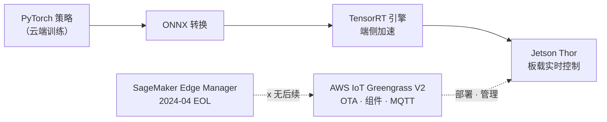
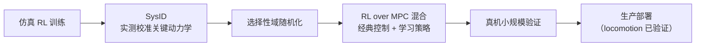

# Pillar 4 — Sim-to-Real

_最终更新: 2026-07 · owner: Youngjin · volatility: 中（边缘 HW·模型为高）_
_除非另有标注，各条目继承页面元数据（owner/updated/volatility）。按条目指定 owner 时在条目页脚补充。_
[← 返回 index](index.md)

> **L0 TL;DR**: 诚实的一句话 —— **locomotion（行走）[^loco]的 sim-to-real[^s2r] 基本已解决且已部署**（ANYmal、Agility Digit）。**操作(manipulation)[^manip] 的 sim-to-real 还没有** —— 即便是前沿 VLA 也不是靠仿真，而是用**真实机体数据训练**，仿真主要用于评估/适配。还有架构不变定律: **30~100Hz 实时控制必须在边缘（板载）**，只有高层规划放到云上。

---

## 本支柱中客户最常问的问题 Top 3

1. **"sim-to-real 实际可行吗？有经过验证的案例吗？"** → [locomotion（可以）](#2-locomotion-sim-to-real--已验证生产)、[操作（还不行）](#4-操作-manipulation-sim-to-real--research---狭窄生产)
2. **"实时控制场景，推理该放边缘还是云上？"** → [边缘推理部署](#1-边缘推理部署--ga)、[decisions](decisions.md)
3. **"真机部署前怎么验证策略是否可行？"** → [策略评估](#5-策略评估--部署前验证--research未解决问题)

> **稳定原理（几乎不变）**: sim-to-real gap 的本质是 (1) **动力学[^dyn]不匹配**（仿真物理 ≠ 实物，尤其是接触），(2) **视觉不匹配**（渲染 ≠ 真实相机）。locomotion 之所以好做，是因为机器人+地面这种简单·宽容的动力学；操作之所以难做，是因为接触动力学棘手。经过验证的处方是 **选择性域随机化(DR)[^dr] + 系统辨识(SysID)[^sysid] + 把 RL 叠加在 MPC[^mpc] 之上的混合**。

---

## 1. 边缘推理部署  🟢 GA

**L0 TL;DR**: 实时控制推理必须在机器人板载运行。2026 年的标准路径 = **NVIDIA Jetson Thor(GA) + AWS IoT Greengrass V2 + ONNX[^onnx]/TensorRT**。⚠️ **SageMaker Edge Manager 已于 2024-04 终止** —— 没有替代品，走 ONNX+Greengrass。

**客户需求/问题**: "训练在云上做了，怎么部署到机器人并用 OTA[^ota] 管理？实时场景下云端往返不是不行吗？"

**解决方案概览** `[1]/[3]`:

- **边缘 HW**: **[Jetson](https://www.nvidia.com/en-us/autonomous-machines/embedded-systems/jetson-thor/) Thor(Blackwell) GA**，T5000 生产模块已流通。Jetson Orin 系列仍在生产（低功耗）。规格·价格见下方折叠块。
- **部署/管理**: **[AWS IoT Greengrass V2](https://docs.aws.amazon.com/greengrass/v2/developerguide/what-is-iot-greengrass.html)**(GA) —— Lambda/Docker/自定义组件、ML 推理组件、MQTT[^mqtt] 遥测。⚠️ **Greengrass V1 于 2026-06-01 支持终止** —— 只有 V2 是现行的。
- **模型路径**: PyTorch 策略 → **[ONNX](https://onnx.ai/)** → 编译 **[TensorRT](https://developer.nvidia.com/tensorrt)** 引擎（端侧加速）以满足实时控制的延迟预算（sub-20~30ms 级）[^latency]是标准路径。[SageMaker Neo](https://docs.aws.amazon.com/sagemaker/latest/dg/neo.html)（边缘编译）仍在，可与 Greengrass 组合。
- ⚠️ **SageMaker Edge Manager EOL(2024-04-26)** —— 控制台·API 全部不可用。**没有可直接替换的托管后续服务**。AWS 建议 = ONNX + Greengrass V2（+ 可选 SageMaker Neo）。

🔄 易变数据（边缘 HW 规格·价格 —— 2026-07 确认）

| 项目 | 值 | 来源 |
|---|---|---|
| Jetson Thor GA | 2025-08-25 公布, dev kit $3,499, 2025-11 开始出货 | NVIDIA `[3]` |
| AGX Thor 规格 | Blackwell GPU, 128GB 统一 LPDDR5X, 130W, 支持 FP4 | NVIDIA `[3]` |
| Thor vs Orin | NVIDIA 官方: 归一化 AI 算力 ~7.5 倍, 能效 ~3.5 倍。⚠️ Thor=FP4/FP8 TFLOPS, Orin=INT8 TOPS —— 禁止直接比较原始数值 | NVIDIA `[3]` |
| ONNX→TensorRT 加速 | ~7 倍（厂商数值, NVIDIA Jetson 博客 2025, 依赖模型·HW —— 引用时并列注明条件） | NVIDIA `[3]` |

**部署栈实际提供的能力** `[1]`（docs 2026-07 核实）:

| 组件 | 技术要点 | 边缘部署视角 |
|---|---|---|
| **Jetson Thor** | 搭载 Blackwell GPU 的机载边缘计算机（128GB 统一内存）—— 在机器人内部解决实时推理 | System 1 策略的驻地 |
| **Greengrass V2** | 以**组件**（配方 + S3 工件）为单位的软件部署运行时 —— 机群 OTA、进程间通信（IPC）·MQTT 代理、日志管理器 | 向机器人机群按版本交付模型·推理应用的通道 |
| **ONNX → TensorRT** | 导出为框架中立格式后，针对设备 GPU 做算子融合·精度优化编译 | 满足 sub-20~30ms 延迟预算的标准路径 |
| **SageMaker Neo** | 面向目标硬件的托管模型编译服务（可选） | 难以直接驾驭 TensorRT 的团队的替代方案 |
| **IoT Core (MQTT)** | 轻量发布/订阅消息代理 —— 遥测上行、命令下行 | 机器人状态·事件的云端连接点 |
| **IoT Jobs** | 面向机群的远程作业（OTA）编排 —— 分阶段发布·中止·重试 | 把模型 v2 安全推送到 100 台机器人的机制 |

**AWS 映射**: IoT Greengrass V2 + IoT Core(MQTT) + SageMaker Neo（编译）+ S3（模型工件）+ IoT Jobs(OTA)。用 Model Monitor 采集边缘遥测。

**决策标准**（详情 → [decisions Cloud vs Edge](decisions.md)）:

- **30~100Hz+ 反应式控制**（平衡·力·抓取·行走）→ **必须板载 Jetson**。不能云端往返。
- **sub-1Hz~few-Hz 高层规划·VLA 推理** → 可放云/异步。**action chunking** 是连接两种 rate 的桥梁。
- 想要托管的边缘服务 → 诚实说明没有，并提供 ONNX+Greengrass V2 设计。

**客户案例**: （边缘部署本身的公开 AWS 机器人案例有限 —— 以参考架构为主）

**➡️ 后续行动**: **画出 "Jetson Thor（板载控制）+ Greengrass V2(OTA/管理) + ONNX→TensorRT" 边缘参考架构**，并主动告知"Edge Manager 已消失"以更正客户的错误预期。询问实时要求的 Hz 来确定边缘/云边界。

**🔗 相关资产**:

- Playbook: [pillar-2 System1/System2](pillar-2.md) · [pillar-5 编排](pillar-5.md) · [decisions](decisions.md)
- [VLA Hub — AWS 上的实时 VLA 推理中心](https://github.com/aws-samples/sample-vla-hub-on-aws) — aws-samples。用 CDK 将 6 个 OSS VLA（GR00T N1.6/N1.7·π0.5·OpenVLA-7B·SmolVLA-450M·LAP-3B）部署为按模型独立的 gRPC 端点（ECS on EC2 g5/g6，内部 NLB）。部署时自动探测有 GPU 容量的 AZ；包含使用相同容器·proto 的 Jetson（Orin/Thor）单设备轨道 — 一套代码覆盖 System 2 云端/边缘推理路径。其 capability matrix（按模型的许可证·适配成本·场景推荐）在客户沟通中很有用。⚠️ 早期阶段（2026-05 创建）·仅内部 NLB（客户端须在同一 VPC）·GR00T 须确认许可证

---

## 2. Locomotion Sim-to-Real  🟢 已验证（生产）

**L0 TL;DR**: sim-to-real "可以"的证据在此。四足行走(ANYmal)与双足物流机器人(Agility Digit) 在仿真中用 RL 训练，并**部署到实际付费的工业现场**。

**客户需求/问题**: "sim-to-real 不就是营销吗？真的有拿钱干活的机器人吗？"

**解决方案概览** `[1]/[3]`:

- **ANYmal ([ANYbotics](https://www.anybotics.com/anymal/))** 🟢 —— 用大规模并行仿真 RL 训练的行走，**数百台部署于全球工业巡检（石油·天然气·矿山·化工）**。ETH RL-walking 谱系（peer-reviewed）。**生产 + 证据**。
- **[Agility Digit](https://agilityrobotics.com/robots) @ GXO** 🟢 —— **在多年 RaaS 合同下付费商业作业**，截至 2025-11 **移动 10 万+ 料箱**、约 1 年连续全职、6.5 万+ 运行小时。**验证最充分的付费人形作业**（客户 GXO 交叉确认）。但仅限狭窄的结构化料箱搬运任务。
- ⚠️ **Boston Dynamics Spot 产品搭载 MPC（经典控制）—— 不是 RL**。Spot 的 RL 行走(5.2m/s) 只存在于研究套件(BD+NVIDIA+RAI)。**这是本行业最常搞错的事实** —— 不要说反了。

**AWS 映射**: 训练(→[pillar-2](pillar-2.md)、[pillar-3](pillar-3.md)) + 边缘部署(→第 1 项)。各厂商基础设施为非公开。

**决策标准**: 客户用例为行走·移动(locomotion) → sim-to-real 成熟，可积极提议。精密操作 → 谨慎（第 4 项）。

**客户案例**: ANYmal（工业巡检，生产），Agility Digit@GXO（物流，付费）。⚠️ **任何人形机器人都没有独立第三方自主性审计** —— 以厂商/客户 PR 为准([3])。

**➡️ 后续行动**: 客户对 sim-to-real 持怀疑时，**用 ANYmal/Digit@GXO 作为"可以"的依据，但明确"是因为 locomotion 才可以"**。准确了解 Spot=MPC 的事实以建立信任。

**🔗 相关资产**: [pillar-3 并行 RL](pillar-3.md) · [pillar-2 训练](pillar-2.md)

🔄 易变数据（人形机器人 演示↔生产 阶梯 —— 2026-07）

| 阶段 | 案例 |
|---|---|
| 付费·已验证 | ANYmal（四足，数百台）, Agility Digit@GXO（10 万+ 料箱） |
| 生产试点（有指标·自主，厂商报告） | Figure 02@BMW（~1,250h, 9 万+ 零件→Figure 03）, Apptronik Apollo@Mercedes |
| 已发布产品但非自主 | 1X Neo（自主 ~60~70%，其余为 VR 远程操作 "Expert Mode"） |
| 令人印象深刻的演示/研究 | Atlas 敏捷动作, Spot RL 研究套件（产品为 MPC）, Unitree 敏捷技能, Figure 03 "8 小时自主"主张（CEO 推文） |
| 公布·路线图（0 台运行） | Hyundai Atlas 2.5 万台（2028，工会反对）, Tesla Optimus V3 |

---

## 3. Sim-to-Real 方法论  🟢 GA（稳定原理）

**L0 TL;DR**: 经过验证的处方不是花哨的新技法，而是 **选择性 DR + SysID + 把 RL 叠加在 MPC 之上的混合**。盲目地全部随机化会让 RL 不稳定。

**客户需求/问题**: "实际上怎么缩小 sim-to-real gap？哪些技法在生产中管用？"

**解决方案概览** `[1]/[3]`:

- **选择性域随机化(DR)** 🟢 —— locomotion 标准。但**过度随机化会导致训练不稳定** → 要选择性地做。
- **系统辨识(SysID) + 选择性 DR** 🟢 —— 对核心动力学参数做实测校准后再做选择性 DR。当前最佳实践。
- **RL over MPC 混合** 🟢 —— 不是纯 end-to-end RL，而是经典 MPC 基础 + 学习策略来增强鲁棒性。**Boston Dynamics 也用这种混合 = 最接近实际部署**。
- **研究阶段**（非生产）: 残差 real2sim2real(ASAP)、分布式 SysID(Spot 研究)、基于 VLM 的 SysID(Vid2Sid) —— 🔵 令人印象深刻但为单一实验室演示。

**AWS 映射**: 方法论本身对云中立。大规模 DR/SysID 扫描用 AWS Batch 并行化(→[pillar-3](pillar-3.md))。

**决策标准**: locomotion → 信赖 DR+SysID+混合。操作 → 仅靠此处方不够，必须并行真实数据（第 4 项）。

**客户案例**: ANYmal·Digit（上方第 2 项）是此方法论的产物。

**➡️ 后续行动**: 若客户团队在"盲目 DR"中迷失，则**用"选择性 DR + SysID + MPC 混合"进行方向纠正**。研究新技法(ASAP 等)诚实地标注为"研究阶段"。

**🔗 相关资产**: [pillar-3 仿真](pillar-3.md)

---

## 4. 操作 (Manipulation) Sim-to-Real  🔵 Research / 🟡 狭窄生产

**L0 TL;DR**: 诚实的坏消息 —— **通用的接触丰富操作的 sim-to-real 没有解决**。所以前沿 VLA(OpenVLA, π0.5, Gemini Robotics) 不是靠仿真，而是用**真实机体数据**训练。生产仅限狭窄的低难度 loco-manipulation（料箱/零件搬运）。

**客户需求/问题**: "我们需要装配/抓取这样的操作。用仿真训练能行吗？"

**解决方案概览** `[1]`:

- **为什么落后**: 操作的**接触动力学不匹配**很大，报告的 sim-to-real 性能下降 ~24~30%，仅光照/相机姿态变化就使成功率下降 30~50%。
- **核心洞察 —— VLA 依赖真实数据**: **[OpenVLA](https://github.com/openvla/openvla)**(7B) 用约 97 万个**真实机体**演示(Open X-Embodiment)训练。**π0/π0.5**、**RT-2**、**Gemini Robotics** 全部以大规模**真实机器人数据**为中心，仿真作为评估/适配的辅助。Gemini Robotics 在 SDK 中捆绑 MuJoCo 用于评估。
- **成熟度**: 精密·多指接触操作、开放世界 VLA 家务(π0.5) → **令人印象深刻的演示/trusted-tester Preview**。**截至 2026-07，没有把接触丰富操作验证为 GA 生产的通用 VLA**。

**AWS 映射**: 真实数据管道是关键 → [pillar-1](pillar-1.md)。仿真为评估辅助（第 5 项）。

**决策标准**:

- 狭窄结构化抓取·搬运 → 可行（Digit 级）。
- 通用·精密·接触丰富操作 → **目前未解决**，前提是大量收集真实数据 + 管理预期。
- "仅靠仿真做操作策略" → 有风险，必须用真实演示微调。

**客户案例**: 只有狭窄 loco-manipulation(Digit, Figure 02) 进入生产。精密操作为研究/Preview。

**➡️ 后续行动**: 对操作客户要**诚实地管理预期** —— 先说明"没有像 locomotion 那样解决，真实数据是关键"，再连接到 [pillar-1 真实数据管道](pillar-1.md)。禁止过度承诺。

**🔗 相关资产**: [pillar-1 遥操作/真实数据](pillar-1.md) · [pillar-2 VLA 微调](pillar-2.md)

---

## 5. 策略评估 — 部署前验证  🔵 Research（未解决问题）

**L0 TL;DR**: 不便的真相 —— **没有任何仿真评估套件被信赖为实际部署的门禁**。热门基准(LIBERO/SimplerEnv/CALVIN) 暴露了 shortcut·过拟合·统计不显著的问题。当前方向是 real-to-sim 重建 + 分布式真实世界 A/B。

**客户需求/问题**: "上真机之前，怎么确信策略真的可行？"

**解决方案概览** `[1]`:

- **sim 评估套件**: SimplerEnv、LIBERO、Meta-World 等存在但暴露局限。2026-06 审计: 无语言编码器的 90M 探针在 LIBERO 3/4 上匹配 SOTA（shortcut），报告的"进步"仅 ~20% 有统计支撑，CALVIN 仅重采样布置姿态就下降 25%。**sim↔real 相关性低**。
- **真实世界评估**: **[RoboArena](https://robo-arena.github.io/)** —— 分布式双盲 A/B（只给策略 IP 并隐藏其身份），7 机构 4,284 回合，Bradley-Terry/Elo。是研究框架但指明了方向。
- **新方向**: real-to-sim（Gaussian Splatting/世界模型场景重建）+ 分布式真实 A/B。单一 sim 套件 = 不是可信门禁。

**AWS 映射**: 大规模评估扫描并行化 → AWS Batch。真实世界 A/B 数据采集 → IoT/S3。（没有托管的机器人评估服务）

**决策标准**: 禁止仅凭 sim 基准分数就做部署决定。**sim 筛选 + 真实世界分阶段验证**并行。引用基准分数时确认统计显著性·测量条件。

**客户案例**: （评估本身属研究领域）

**➡️ 后续行动**: 若客户想"sim 里达 95% 就部署"，则**以"sim↔real 相关性低的最新研究"为依据，建议设计分阶段的真实世界验证**。这份诚实能防止事故。

**🔗 相关资产**: [pillar-3 仿真](pillar-3.md) · [pillar-1 真实数据](pillar-1.md)

---

## 本支柱的诚实现实（SA 必读）

- **locomotion 可以，操作还不行。** 这一句话是 sim-to-real 对话的骨架。过度承诺会失去信任。
- **Spot = MPC，不是 RL。** 本行业最多的错误。说反了会被怀疑专业性。
- **前沿 VLA 用真实数据训练**，仿真为评估/适配辅助 —— "仅靠仿真做操作策略"是陷阱。
- **SageMaker Edge Manager 已死(2024-04)**，无后续 → ONNX + Greengrass V2。**Greengrass V1 也于 2026-06 终止**，只有 V2 现行。
- **30~100Hz 控制必须在边缘。** action chunking 是连接云端规划与边缘控制的桥梁。
- **人形机器人"生产"指标大多是厂商 PR** —— 无独立自主性审计。只有 Digit@GXO·Figure@BMW 经客户交叉确认。1X Neo 是"产品但实际上是远程操作"。

---
_owner: Youngjin · updated: 2026-07 · volatility: 中（边缘 HW·厂商指标为高）· sources: [1] 官方/论文, [2] AWS 内部验证, [3] 厂商/PR, [4] 未经验证。2026 arXiv 预印本为非评审(illustrative)。_

<!-- 용어 각주 -->

[^s2r]: **sim-to-real** — 把在仿真中训练的策略迁移到真实机器人上，或指其方法论。由于仿真与现实的物理·视觉差异（域间差异），直接迁移会导致性能崩溃。🎥 [NVIDIA sim-to-real 机器人展示](https://www.youtube.com/watch?v=sffNvv3GkRA)
[^loco]: **locomotion（行走/移动）** — 行走·行驶等机器人的移动能力。得益于机器人与地面接触这种相对简单的物理，它是 sim-to-real 最先被解决的领域。
[^manip]: **操作（manipulation）** — 抓取、搬运、装配物体的能力。指尖接触的物理很复杂，是 sim-to-real 尚未解决的领域。
[^dyn]: **动力学（dynamics）** — 力·摩擦·碰撞所产生的运动物理。尤其是抓取物体时的接触动力学，是仿真器最难精确再现的部分。
[^dr]: **域随机化（Domain Randomization）** — 随机改变仿真的光照·纹理·物体位置·相机角度·物理参数来生成数据或进行训练的技法。使策略能承受任何环境变化 — sim-to-real 的代表性处方。
[^sysid]: **系统辨识（SysID, System Identification）** — 测量真实机器人的物理参数（摩擦·质量·电机响应），把仿真器校准到与实物一致的工作。
[^mpc]: **MPC（Model Predictive Control）** — 反复预测·优化短期未来来进行控制的经典控制技法。把学习到的 RL 策略叠加在 MPC 之上的混合已成为经过验证的处方。
[^onnx]: **ONNX / TensorRT** — ONNX 是框架间模型交换的标准格式，TensorRT 是面向 NVIDIA GPU 的推理优化编译器。"PyTorch → ONNX → TensorRT" 转换是边缘实时推理的标准路径。
[^ota]: **OTA（Over-The-Air）** — 通过网络远程更新·部署机器人的模型·软件的方式。
[^latency]: **延迟预算（latency budget）** — 实时控制回路允许的最大推理时间。30~100Hz 控制下一个周期为 10~33ms，推理必须在此之内完成 —— 这就是云端往返不可行的原因。
[^mqtt]: **MQTT** — IoT 标准的轻量发布/订阅（pub/sub）消息协议。即使在不稳定网络下也能以极小带宽收发机器人遥测与命令。
