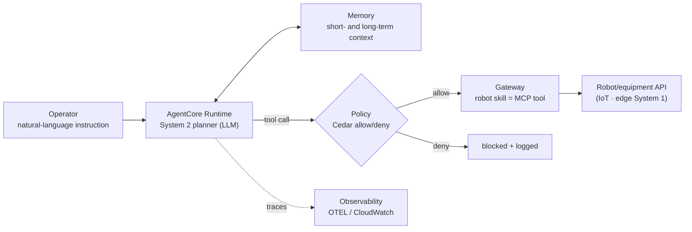
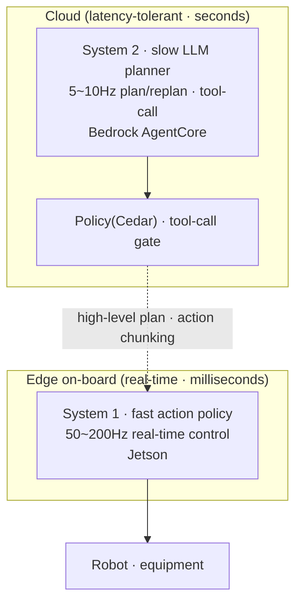
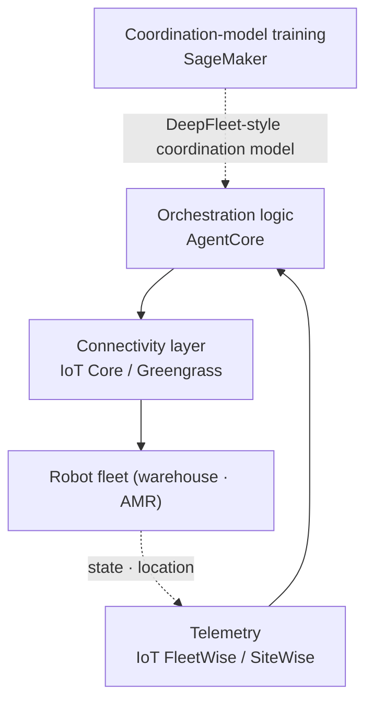

# Pillar 5 — Agentic Orchestration

_Last updated: 2026-07 · owner: Youngjin · volatility: high (AgentCore features/regions expand often)_
_Unless separately noted, each item inherits the page metadata (owner/updated/volatility). When an item has its own owner, add an item footer._
[← back to index](index.md)

> **L0 TL;DR**: The layer where an LLM agent[^agent] directs robots/equipment. This is **the pillar where AWS is strongest** — **[Amazon Bedrock AgentCore](https://aws.amazon.com/bedrock/agentcore/) is GA (2025-10) with full Seoul region support**, and **Policy (Cedar), which intercepts tool calls[^tool] in real time, is also GA (2026-03)**. The canonical structure is the **System 2[^sys] (slow LLM planner, cloud) + System 1 (fast control, edge)** split. ⚠️ Amazon DeepFleet is not an "LLM agent" but a warehouse robot coordination foundation model, so don't confuse them.

---

## Top 3 questions customers ask most in this pillar

1. **"Does directing robots/equipment with an LLM agent actually work? What does AWS have?"** → [Bedrock AgentCore](#1-amazon-bedrock-agentcore--ga)
2. **"How do you put an agent on a real-time robot? Even offline at the edge?"** → [Edge agentic orchestration](#3-edge-agentic-orchestration--preview-reference-architecture)
3. **"When an agent controls a physical system, how is safety guaranteed?"** → [Safety & guardrails](#5-safety--guardrails--ga-agent-layer---unsolved-physical-semantic-gap)

> **Stable principle (rarely changes)**: an agent does not "directly control a robot in real time." The agent handles **high-level planning and tool selection (System 2)**, while an edge policy handles **low-level real-time control (System 1)** (→ [pillar-2](pillar-2.md), [pillar-4](pillar-4.md)). What truly runs in production is (1) **warehouse fleet[^fleet] coordination** (DeepFleet, CoEvolution) and (2) **development/data workload orchestration**[^orch] (OSMO); full-stack humanoid agents and MCP[^mcp]-robot connections are mostly research/demo.

---

## 1. Amazon Bedrock AgentCore  🟢 GA

**L0 TL;DR**: A managed stack for production agents — Runtime, Memory, Gateway (tool connectivity), Identity, Observability, and **Policy (a Cedar-based real-time tool-call gate)**. **Full Seoul region support**. The harness is free; only resource usage is billed.

**Customer need/problem**: "We want to take our agent beyond PoC to production. We don't want to build session management, tool connectivity, permissions/security, and observability from scratch every time."

**Solution overview** `[1]`:

- **GA history**: preview 2025-07 → **GA 2025-10-13**. Components: **Runtime, Memory, Gateway, Identity, Observability, Built-in Tools (Browser · Code Interpreter)**. At re:Invent 2025-12, Policy · Evaluations preview, episodic Memory GA, and bidirectional streaming Runtime GA for voice were added. **Policy is GA as of 2026-03-03**.
- **Policy (core)**: integrated with Gateway to **intercept every agent→tool call in real time** and evaluate a policy (allow/deny) in milliseconds. Authored in natural language → compiled to **[Cedar](https://www.cedarpolicy.com/)** (AWS's open-source policy language). **GA in 13 regions including Seoul**. → a direct primitive for constraining physical-system tool calls (item 5, safety).
- **[Strands Agents SDK](https://strandsagents.com/)** (companion): a model- and cloud-neutral orchestration SDK, **reached 1.0 (GA-class)**. Used internally by Amazon Q Developer · Glue. Pairs with AgentCore. (Versions/metrics in the collapsed block)
- **[Nova Act](https://nova.amazon.com/act)** (related): a browser/UI automation agent, **GA at re:Invent 2025**. The vendor claims high task reliability (the number is in the collapsed block — measurement conditions undisclosed).

**What each component actually does** `[1]` (docs verified 2026-07):

| Component | Technical summary | For robot workloads |
|---|---|---|
| **Runtime** | Serverless execution in a dedicated microVM[^microvm] per session (isolated CPU/memory/filesystem, memory sanitized on termination). Long-running sessions **up to 8 hours**; **no billing while waiting** for LLM/tool responses. Framework- and model-agnostic (LangGraph, CrewAI, Strands, …) | Where the System 2 planner lives — a long task plan stays in one isolated session |
| **Gateway** | **Turns Lambda, OpenAPI, Smithy, existing MCP servers, and API Gateway into MCP tools**, aggregated as one virtual MCP server. Semantic tool search; managed inbound and outbound auth | The point where robot skills (pick, move, inspect APIs) become agent tools in a few lines of code |
| **Memory** | Two tiers: short-term (raw session events) + long-term (extraction strategies: summary, semantic, user preference + episodic). **Long-term retrieval also passes through Policy** | Keeps task context ("that shelf from earlier") and accumulates site know-how across sessions |
| **Identity** | Agent workload identity + OAuth2/API-key token vault — safe delegated auth on tool calls | Keeps human credentials out of robot-fleet APIs |
| **Policy** | Intercepts every agent→tool call in real time and evaluates Cedar policies in milliseconds (written in natural language → compiled to Cedar) | The last safety gate right before physical action (→ section 5) |
| **Observability** | OTEL[^otel]-compatible traces, spans, and metrics; CloudWatch integration | Reconstructs "why did it do that" step by step — incident investigation and audits |
| **Built-in Tools** | Managed Browser (isolated microVM) and Code Interpreter | Auxiliary work such as manual lookups and calculations |

**AWS mapping**: the services themselves are the mapping. Register robot skills as tools on Gateway → the agent invokes them via natural-language planning, gated by Policy, session maintained by Memory, traced by Observability.

**Decision criteria**:

- Production agent (needs sessions · tools · permissions · observability) → **AgentCore Runtime + Gateway + Policy**.
- Simple one-off inference → a direct Bedrock call suffices; AgentCore is overkill.
- Multi-agent · A2A[^a2a] → Strands 1.0.
- Offline · low-latency edge needed → item 3 (edge).

**Customer case**: **AWS×SoftServe autonomous production line** (AgentCore + IoT Greengrass + Nova Pro + Jetson Thor) — Hannover Messe 2026 **demo/showcase** ([1]/[3]).

**➡️ Next action**: first confirm for Korean customers that **"AgentCore is GA in the Seoul region — no data residency issue"** (correcting outdated "not supported in Seoul" info), then propose a PoC registering robot skills as Gateway tools. Reassure on pricing with "harness free, only resources billed."

**🔗 Related assets**:

- Playbook: [pillar-4 edge](pillar-4.md)
- [Getting started with AgentCore workshop](https://catalog.workshops.aws/agentcore-getting-started/en-US) · [AgentCore Deep Dive workshop](https://catalog.workshops.aws/agentcore-deep-dive/en-US)
- [AgentCore retail agent workshop "Build! Deploy! Observe!"](https://catalog.us-east-1.prod.workshops.aws/workshops/3cab1e1f-1dfa-42e0-959c-6e2e0a072ea3/ko-KR) — Korean. Retail-domain examples, but covers all seven AgentCore services (Gateway · Runtime · Observability · Code Interpreter · Memory · Policy · Browser) in a three-phase hands-on — the Policy guardrail/escalation lab connects to item 5 (Safety & guardrails). Guide: [workshop site](https://dxdbmmdwak6t8.cloudfront.net/) (event-scoped CloudFront deployment — link persistence unconfirmed ⚠️)
- (internal AgentCore workshop — confirm needed ⚠️)
- [AWS Physical AI Toolchain](https://github.com/aws-samples/sample-aws-physical-ai-toolchain) — aws-samples. 4-pillar flywheel reference architecture. ⚠️ Only NVIDIA OSMO 6.3 on EKS orchestration is Available; Cosmos·Isaac Lab·GR00T·Strands+AgentCore agentic layer are Planned
- [Self-improving Physical AI](https://github.com/aws-samples/sample-self-improving-physical-AI) — aws-samples. Bedrock agents control Isaac Sim and real robots SO-ARM101/XGO2/Zumi via IoT, iterative sim-to-real learning with agent memory
- [Agentic AI Robot — industrial safety monitoring](https://github.com/aws-samples/sample-agentic-ai-robot) — aws-samples. AgentCore+IoT+robot autonomous patrol and edge inference demo, shown at AWS AI x Industry Week 2025, Korean README. ⚠️ Explicitly experimental/educational — not for production
- [Smart Machines — hybrid Physical AI for industrial equipment](https://github.com/aws-samples/sample-smart-machines-physical-hybrid-ai) — aws-samples. Full-stack demo where agents detect fleet telemetry anomalies → diagnose root causes → create tickets and adjust machine parameters (multi-agent chat, natural-language scenario builder, KVS video → Bedrock analysis, Jetson YOLOWorld+VLM edge monitoring). ⚠️ README-stated demo — only excavators (simulated telemetry) fully work today; robot arms are WIP

🔄 Volatile data (components · regions · pricing — checked 2026-07)

| Component | Status | Seoul |
|---|---|---|
| Runtime / Memory / Gateway / Identity / Observability / Built-in Tools | 🟢 GA | ✅ |
| Policy (Cedar tool gate) | 🟢 GA (2026-03) | ✅ |
| Evaluations | 🟡 Preview→ | ✅ |
| Payments | 🟡 Preview | ❌ |
| Agent Registry | 🟡 Preview | ❌ (Tokyo ✅) |

**Pricing** — the harness (control plane) is free; you pay only for resources used:

| Item | Rate |
|---|---|
| Runtime · Browser · Code Interpreter | $0.0895/vCPU-hour + $0.00945/GB-hour (billed per second) |
| Gateway | $0.005 per 1,000 calls |
| Memory — short-term | $0.25 per 1,000 events |
| Memory — long-term storage | $0.75 per 1,000 records per month |

**Regions** (AWS official region table `[1]`, checked directly 2026-07):

| Region | Coverage |
|---|---|
| **Seoul** (ap-northeast-2) | All core components + Policy + Evaluations ✅ |
| Tokyo (ap-northeast-1) | Core components + **Agent Registry** ✅ (not yet in Seoul) |

**Companion-tool indicators**:

| Item | Value | Note |
|---|---|---|
| Strands Python 1.0 | 2026-05-21 | ~16.7M downloads/month (2026-06, `[3]`) |
| Strands TypeScript 1.0 | 2026-04-30 | |
| Nova Act | "90%+ task reliability" | Amazon-announced figure, measurement conditions undisclosed (2025-12, `[3]`) — **do not cite as fact without conditions** |

---

## 2. System 2 + System 1 orchestration pattern  🟢 GA (stable principle)

**L0 TL;DR**: The architectural skeleton of agentic orchestration. A **heavy VLM/LLM plans/replans at 5~10Hz (System 2)**, and a **lightweight policy executes at 50~200Hz (System 1)**. This separation decides "what goes in the cloud and what goes at the edge."

**Customer need/problem**: "How do I fit a large reasoning model and real-time control into one system?"

**Solution overview** `[1]/[4]`: Evolved from the SayCan/PaLM-E (2022~23 research) lineage. The current dominant pattern = high-level planner (task decomposition · tool-calling, slow) + low-level action policy (fast). Example numbers (vendor-disclosed, for order-of-magnitude sense): Figure Helix S2 7~9Hz + S1 200Hz (Figure, 2025), GR00T N1 S1 diffusion ~10ms (NVIDIA, 2025). ⚠️ **The pattern itself is standard, but full-stack whole-body humanoids are mostly pilot/demo**.

**AWS mapping**: **System 2 = cloud Bedrock AgentCore** (planning · tool orchestration · guardrails[^guardrail]), **System 1 = edge Jetson** (real-time control, → [pillar-4](pillar-4.md)). If latency is tolerable, System 2 in the cloud; otherwise edge on-board.

**Decision criteria**: see [decisions Cloud vs Edge](decisions.md). Real-time control loop → edge unconditionally. Planning/replanning → cloud/async possible.

**Customer case**: Figure, GR00T (open). Validated production is limited.

**➡️ Next action**: for the misconception "does the agent control the robot in real time?", clarify the picture as **"the agent plans, an edge policy does real-time control."** Present the AgentCore (planning) + Jetson (control) combination.

**🔗 Related assets**: [pillar-2 VLA structure](pillar-2.md) · [pillar-4 edge](pillar-4.md) · [decisions](decisions.md)

---

## 3. Edge agentic orchestration  🟡 Preview (reference architecture)

**L0 TL;DR**: A pattern for deploying agents to edge devices in offline/low-latency field settings. AWS's **Solutions Guidance ("AI Agents to Device Fleets via IoT Greengrass")** is a real reference architecture — but it is **guidance/sample code, not a GA product**.

**Customer need/problem**: "The factory is offline/low-bandwidth. We want the agent to make decisions in the field even without the cloud."

**Solution overview** `[1]/[3]`: The AWS Guidance = deploy **Strands Agents + a local SLM ([Ollama](https://ollama.com/)) to [IoT Greengrass](https://docs.aws.amazon.com/greengrass/v2/developerguide/what-is-iot-greengrass.html) devices**. Push a GGUF model to S3, query over IoT Core MQTT, and an Orchestrator Agent fans out to specialist agents (documents, OPC-UA, etc.). When connected, switch to a Bedrock cloud model. **Robotics** is explicitly listed among target industries. 2026 pattern: trained model → deployed to Jetson Thor via Greengrass, coordinating AMR fleets via VDA 5050 protocol conversion.

**AWS mapping**: IoT Greengrass V2 + Strands + local SLM (Ollama) + IoT Core (MQTT) + S3 (models). When online, promote to Bedrock/AgentCore.

**Decision criteria**: offline · data sovereignty · low latency → edge agent. Always-connected · complex reasoning → cloud AgentCore.

**Customer case**: AWS×SoftServe (item 1 above, demo).

**➡️ Next action**: for offline customers, **present the AWS Greengrass agent Guidance + sample code as a starting point** (honestly, not a GA product). Design an on/offline hybrid (edge SLM ↔ cloud AgentCore).

**🔗 Related assets**: [pillar-4 edge deployment](pillar-4.md) · [pillar-1](pillar-1.md)

---

## 4. Fleet orchestration  🟢 GA (partly) / mixed

**L0 TL;DR**: The layer that coordinates multiple robots. **The actual production cases are warehouse fleet coordination** (Amazon DeepFleet, CoEvolution) and **development workload orchestration** (NVIDIA OSMO). ⚠️ DeepFleet is not an LLM agent but a multi-robot coordination foundation model.

**Customer need/problem**: "How do I centrally coordinate and monitor hundreds~thousands of robots?"

**Solution overview** `[1]/[3]`:

- **[Amazon DeepFleet](https://www.aboutamazon.com/news/operations/amazon-million-robots-ai-foundation-model)** 🟢 — a generative foundation model for coordinating Amazon warehouse robot fleets ("traffic control"), ~10% travel-time efficiency improvement, announced with the 1-millionth robot (2025-07). **Production (Amazon internal)**. ⚠️ **Not an LLM agent orchestrator** — "multi-agent" in the multi-robot RL sense. Do not misclassify.
- **[NVIDIA Isaac OSMO](https://developer.nvidia.com/osmo)** 🟢 — orchestration of robotics **development/data/training workloads** (synthetic data · training · RL · SIL). At GTC 2026, integrated coding agents (Claude Code/Codex/Cursor). ⚠️ **Not real-time control of a field robot fleet** — development-pipeline orchestration.
- **Formant** 🟡 — fleet management SaaS. Running in hundreds of organizations but small-scale (concrete metrics per `[3]` PitchBook/Crunchbase — 644 organizations · <$5M ARR, 2026-05, changes often), not acquired.
- **CoEvolution** — coordinates multi-fleet across Lotte Global Logistics 417 superstores, claims 30% efficiency (⚠️ single [3] source, re-confirmation needed).

**AWS mapping**: IoT Core/Greengrass (fleet connectivity) + AgentCore (orchestration logic) + IoT FleetWise/SiteWise (telemetry). Train a DeepFleet-style coordination model with SageMaker.

**Decision criteria**: warehouse/AMR fleet coordination → a validated area (reference the DeepFleet-style approach). Humanoid agent fleet → still early. Development workload → OSMO (NVIDIA) or AWS Batch/Step Functions.

**Customer case** (⚠️ Korean cases are early/demo/announced): **Lotte Global Logistics×CoEvolution** (30%, single source), **LG CNS** warehouse demo (humanoid + robot dog + mobile), **Naver** AI Agent Platform planned H2 2026 (NVIDIA blueprint).

**➡️ Next action**: for fleet customers, organize into 3 layers — **"orchestration logic on AgentCore, connectivity on IoT, training on SageMaker."** Explain precisely so DeepFleet is not mistaken for an LLM agent.

**🔗 Related assets**: [pillar-2 training](pillar-2.md) · [pillar-3 OSMO](pillar-3.md)

---

## 5. Safety & guardrails  🟢 GA (agent layer) / 🔵 unsolved (physical-semantic gap)

**L0 TL;DR**: When an agent controls a physical system, safety is by **layered defense**. **AgentCore Policy (Cedar) gates agent→tool calls**, and the robot layer is handled by an **ISO deterministic safety layer**. ⚠️ Existing standards (ISO) cover physical safety only, and **there is not yet a standard covering LLM semantic risk (hallucination/jailbreak)** — an honest open problem.

**Customer need/problem**: "What if the agent misjudges and the robot takes a dangerous action? How do we prevent it?"

**Solution overview** `[1]/[4]`:

- **Agent layer (AWS-native)**: **AgentCore Policy** — real-time allow/deny (ms) via Cedar on every agent→tool call. A practical layer for constraining physical-action tool calls. **[Bedrock Guardrails](https://aws.amazon.com/bedrock/guardrails/)** — filters LLM input/output (content · topic · PII) (not the actuation itself).
- **Robot layer (functional safety)**: **[ISO 10218-1/2](https://www.iso.org/standard/73933.html)** (robots · integrated systems), **ISO/TS 15066** (collaborative robots), **ISO 13482** (personal care robots). ⚠️ These cover **physical safety only** — LLM semantic misuse/hallucination is not covered.
- **Research**: RoboGuard (safety-rule grounding), BadRobot (embedded-LLM jailbreak attacks), LLM semantic DoS — 🔵 research stage. An **open gap** where standards don't bridge functional safety (ISO) and LLM risk.

**AWS mapping**: AgentCore Policy (Cedar) + Bedrock Guardrails (agent layer) + robot on-board deterministic safety (ISO-conformant, outside AWS).

**Decision criteria**: physical-action agent → **layered defense is mandatory** (tool gating with AgentCore Policy + on-board robot ISO safety layer). Either alone is insufficient. "The agent will keep itself safe" is forbidden.

**Customer case**: (production safety cases are undisclosed/early)

**➡️ Next action**: for safety questions, present **"the agent layer gates tool calls with AgentCore Policy/Cedar, the robot layer has ISO deterministic safety — double defense."** Honestly acknowledge "there's no standard for LLM semantic risk yet," and take the angle of complementing it with layered defense.

**🔗 Related assets**: [pillar-4 edge](pillar-4.md) · (internal agent safety guide — newly needed ⚠️)

---

## The honest reality of this pillar (SA must-read)

- **AgentCore fully supports the Seoul region** (including Policy · Evaluations). "Not supported in Seoul" was the GA-early story — it's wrong now. Reassure on data residency.
- **Policy is GA (2026-03)** — do not call it "preview."
- **DeepFleet ≠ LLM agent orchestrator.** A warehouse robot coordination foundation model (multi-robot RL). No misclassification.
- **Real production is fleet coordination (DeepFleet/CoEvolution) and development workloads (OSMO).** MCP-robot connections and full-stack humanoid agents are mostly research/demo.
- **There is no LLM semantic safety standard.** ISO covers physical only. Layered defense (Cedar Policy + ISO robot layer) is the honest answer.
- **Korean figures like Lotte 30% are single-source** — re-confirm before hard citation.

---
_owner: Youngjin · updated: 2026-07 · volatility: high (AgentCore features · regions are managed in the collapsed block) · sources: [1] official, [3] vendor/press, [4] research/community_

<!-- 용어 각주 -->

[^agent]: **LLM agent** — software in which a large language model plans on its own, selects and calls tools (APIs, robot skills), and carries out multi-step tasks. Unlike simple Q&A, the key point is that it "acts."
[^orch]: **Orchestration** — the layer that coordinates and directs multiple agents, robots, and workflows as one system. It decides "who does what, and when" rather than controlling individual robots.
[^sys]: **System 2 / System 1** — the cognitive-science "slow thinking / fast reaction" distinction applied to robot architecture. System 2 is a slow LLM planner that handles planning (cloud); System 1 is a small policy that handles real-time control (edge).
[^tool]: **Tool calling** — the mechanism by which an agent calls external functions (APIs, robot skills) with a defined schema during reasoning. It is the agent's only path to affecting the physical world, so the safety gate (Policy) sits exactly at this point.
[^mcp]: **MCP (Model Context Protocol)** — an open standard protocol connecting agents to tools and data sources. Often likened to "USB-C for agents"; experiments exposing robot skills as MCP servers are growing.
[^guardrail]: **Guardrail** — A safety mechanism that constrains an agent's inputs/outputs and behavior with policies. In physical systems this means blocking dangerous tool calls and limiting the range of actions.
[^fleet]: **Fleet coordination** — scheduling and route allocation for a large group of robots as one system. Already production-proven at the hundreds-to-thousands scale, as with warehouse robots.
[^a2a]: **A2A (Agent-to-Agent)** — A multi-agent communication approach in which different agents collaborate via a standard protocol.
[^microvm]: **microVM (micro virtual machine)** — an ultra-light VM (e.g., AWS Firecracker) with stronger isolation than containers. Each session gets its own CPU, memory, and filesystem, and memory is sanitized on termination — structurally preventing cross-session data leakage.
[^otel]: **OTEL (OpenTelemetry)** — the industry-standard specification for collecting traces, metrics, and logs. It exports an agent's step-by-step execution records in a vendor-neutral format for observability tooling.
