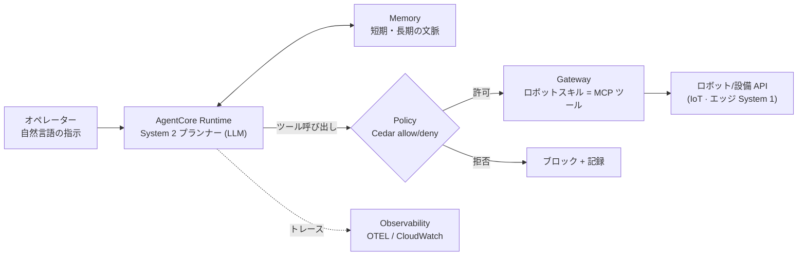
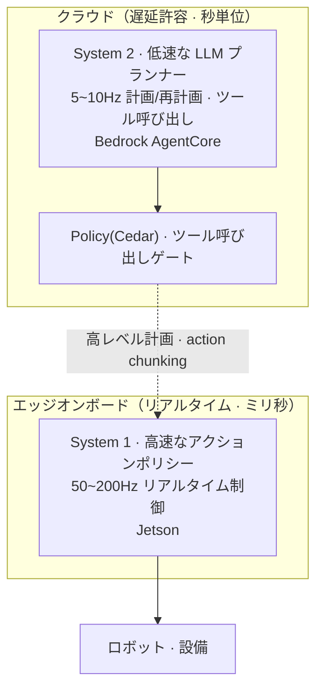
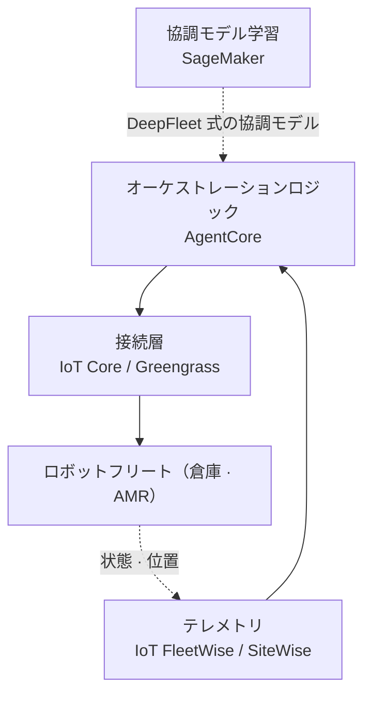

# Pillar 5 — エージェントオーケストレーション (Agentic Orchestration)

_最終更新: 2026-09 · owner: Youngjin · volatility: 高（AgentCore の機能・リージョンが頻繁に拡張）_
_個別項目は別途表記がない限りページメタデータ（owner/updated/volatility）を継承します。項目ごとに owner を指定する場合は項目フッターを追加します。_
[← index へ](index.md)

> **L0 TL;DR**: LLM エージェント[^agent]がロボット・設備を指揮する階層です。ここが **AWS が最も強いピラー**です — **[Amazon Bedrock AgentCore](https://aws.amazon.com/bedrock/agentcore/) が GA(2025-10) かつソウルリージョン完全対応**、ツール呼び出し[^tool]をリアルタイムで横取りする **Policy(Cedar) も GA(2026-03)**。構造としては **System 2[^sys]（低速な LLM プランナー、クラウド）+ System 1（高速な制御、エッジ）** の分離が定石です。⚠️ Amazon DeepFleet は「LLM エージェント」ではなく倉庫ロボット協調の基盤モデルなので混同しないでください。

---

## このピラーで顧客が最もよく尋ねる質問 Top 3

1. **「LLM エージェントでロボット/設備を指揮するのは実際に可能ですか？AWS には何がありますか？」** → [Bedrock AgentCore](#1-amazon-bedrock-agentcore--ga)
2. **「リアルタイムロボットにエージェントをどう？エッジでオフラインでも？」** → [エッジエージェントオーケストレーション](#3-エッジエージェントオーケストレーション--preview参考アーキテクチャ)
3. **「エージェントが物理システムを制御するとき、安全はどう保証しますか？」** → [安全 & ガードレール](#5-安全--ガードレール--gaエージェント層--未解決物理-意味-gap)

> **安定原理（ほとんど変わらない）**: エージェントはロボットを「直接リアルタイム制御」しません。**高レベルの計画・ツール選択(System 2) はエージェントが、低レベルのリアルタイム制御(System 1) はエッジポリシーが**担います（→ [pillar-2](pillar-2.md)、[pillar-4](pillar-4.md)）。本番で実際に稼働しているのは (1) **倉庫フリート[^fleet]協調**(DeepFleet, CoEvolution) と (2) **開発/データワークロードのオーケストレーション**[^orch](OSMO) であり、ヒューマノイドのフルスタックエージェントや MCP[^mcp]-ロボット連携は大半が研究/デモです。

---

## 1. Amazon Bedrock AgentCore  🟢 GA

**L0 TL;DR**: 本番エージェント向けのマネージドスタック — Runtime、Memory、Gateway（ツール連携）、Identity、Observability、そして **Policy（Cedar ベースのリアルタイムツール呼び出しゲート）**。**ソウルリージョン完全対応**。ハーネスは無料、リソース使用量のみ課金。

**顧客ニーズ/課題**: 「エージェントを PoC から本番へ引き上げたい。セッション管理、ツール連携、権限・セキュリティ、可観測性を毎回自分で作りたくない。」

**ソリューション概要** `[1]`:

- **GA の経緯**: プレビュー 2025-07 → **GA 2025-10-13**。コンポーネント: **Runtime、Memory、Gateway、Identity、Observability、Built-in Tools（Browser·Code Interpreter）**。re:Invent 2025-12 で Policy·Evaluations プレビュー、episodic Memory GA、音声向けの双方向ストリーミング Runtime GA を追加。**Policy は 2026-03-03 GA**。
- **Policy（中核）**: Gateway と統合し、**すべての エージェント→ツール 呼び出しをリアルタイムで横取り**して、ポリシー(allow/deny) を ms 単位で評価します。自然言語で記述 → **[Cedar](https://www.cedarpolicy.com/)**（AWS のオープンソースポリシー言語）にコンパイル。**ソウルを含む 13 リージョンで GA**。→ 物理システムのツール呼び出しを制約する直接的なプリミティブ（第 5 項の安全）。
- **[Strands Agents SDK](https://strandsagents.com/)**（付随）: モデル・クラウド中立のオーケストレーション SDK、**1.0 到達（GA 級）**。Amazon Q Developer·Glue が内部利用。AgentCore とペアリング。（バージョン・指標は折りたたみブロック）
- **[Nova Act](https://nova.amazon.com/act)**（関連）: ブラウザ/UI 自動化エージェント、re:Invent 2025 **GA**。ベンダーが高いタスク信頼性を主張（数値は折りたたみブロック — 測定条件は非公開）。

**各コンポーネントが実際に提供するもの** `[1]`（docs 2026-07 確認）:

| コンポーネント | 技術要約 | ロボットワークロードの観点 |
|---|---|---|
| **Runtime** | セッションごとに専用 microVM[^microvm]（CPU・メモリ・ファイルシステム分離、終了時にメモリ消去）でサーバーレス実行。**最長 8 時間**の長期セッション、LLM・ツール応答の**待機時間は課金対象外**。フレームワーク・モデル中立（LangGraph・CrewAI・Strands など） | System 2 プランナーを載せる場所 — 長いタスク計画も 1 つの分離セッションで維持 |
| **Gateway** | **Lambda・OpenAPI・Smithy・既存 MCP サーバー・API Gateway を MCP ツールへ変換**し、1 つの仮想 MCP サーバーに集約。セマンティックツール検索、インバウンド・アウトバウンド認証もマネージド | ロボットスキル（把持・移動・検査 API）を数行のコードでエージェントのツール化する接点 |
| **Memory** | 短期（セッションの生イベント）+ 長期（抽出戦略：要約・セマンティック・ユーザー選好 + episodic）の二層。**長期記憶の取得も Policy を通過** | タスク文脈（「さっきの棚」）の維持 + 現場ノウハウのセッション横断的な蓄積 |
| **Identity** | エージェントのワークロードアイデンティティ + OAuth2/API キーのトークンボールト — ツール呼び出し時に安全に代理認証 | ロボットフリート API に人の資格情報をハードコードさせない |
| **Policy** | すべてのエージェント→ツール呼び出しをリアルタイムに捕捉し、Cedar ポリシーをミリ秒単位で allow/deny 評価（自然言語で記述 → Cedar にコンパイル） | 物理的な行動の直前にある最後の安全ゲート（→ 5 節） |
| **Observability** | OTEL[^otel] 互換のトレース・スパン・メトリクス、CloudWatch 統合 | 「なぜその行動をしたのか」をステップ単位で再構成 — 事故調査・監査対応 |
| **Built-in Tools** | マネージドの Browser（分離 microVM）・Code Interpreter | マニュアル参照・数値計算などの補助作業 |

**AWS マッピング**: サービス自体がマッピングです。ロボットスキルを Gateway にツールとして登録 → エージェントが自然言語の計画で呼び出し、Policy でゲーティング、Memory でセッション維持、Observability で追跡。

**意思決定基準**:

- 本番エージェント（セッション・ツール・権限・可観測性が必要）→ **AgentCore Runtime + Gateway + Policy**。
- 単純な単発推論 → Bedrock 直接呼び出しで十分、AgentCore は過剰。
- マルチエージェント·A2A[^a2a] → Strands 1.0。
- オフライン・低遅延のエッジが必要 → 第 3 項（エッジ）。

**顧客事例**: **AWS×SoftServe 自律生産ライン**(AgentCore + IoT Greengrass + Nova Pro + Jetson Thor) — Hannover Messe 2026 **デモ/ショーケース**([1]/[3])。

**➡️ 次のアクション**: 韓国顧客にまず **「AgentCore はソウルリージョン GA — データレジデンシー問題なし」** を確認させ（古い「ソウル非対応」情報を訂正）、ロボットスキルを Gateway ツールとして登録する PoC を提案します。価格は「ハーネス無料、リソースのみ課金」で安心させます。

**🔗 関連アセット**:

- プレイブック: [pillar-4 エッジ](pillar-4.md)
- [AgentCore 入門ワークショップ](https://catalog.workshops.aws/agentcore-getting-started/en-US) · [AgentCore Deep Dive ワークショップ](https://catalog.workshops.aws/agentcore-deep-dive/en-US)
- [AgentCore リテールエージェントワークショップ「Build! Deploy! Observe!」](https://catalog.us-east-1.prod.workshops.aws/workshops/3cab1e1f-1dfa-42e0-959c-6e2e0a072ea3/ko-KR) — 韓国語。リテール事例ながら AgentCore の 7 サービス（Gateway・Runtime・Observability・Code Interpreter・Memory・Policy・Browser）すべてを 3 フェーズのハンズオンでカバー — Policy ガードレール・エスカレーション実習は第 5 項（安全 & ガードレール）との接点。ガイド: [ワークショップサイト](https://dxdbmmdwak6t8.cloudfront.net/)（イベント向け CloudFront 配信 — リンクの持続性は要確認 ⚠️）
- （社内 AgentCore ワークショップ — 要確認 ⚠️）
- [AWS Physical AI Toolchain](https://github.com/aws-samples/sample-aws-physical-ai-toolchain) — aws-samples。4 ピラー・フライホイールのリファレンスアーキテクチャ。⚠️ 現在 Available なのは NVIDIA OSMO 6.3 on EKS オーケストレーションのみ、Cosmos·Isaac Lab·GR00T·Strands+AgentCore エージェンティックレイヤーは Planned
- [Self-improving Physical AI](https://github.com/aws-samples/sample-self-improving-physical-AI) — aws-samples。Bedrock エージェントが Isaac Sim と実機 SO-ARM101/XGO2/Zumi を IoT 経由で制御、エージェントメモリで sim-to-real 反復学習
- [Agentic AI Robot — 産業安全モニタリング](https://github.com/aws-samples/sample-agentic-ai-robot) — aws-samples。AgentCore+IoT+ロボットの自律パトロール·エッジ推論デモ、AWS AI x Industry Week 2025 で展示、韓国語 README あり。⚠️ 実験·教育用と明記 — 本番環境向けではありません
- [Smart Machines — 産業設備ハイブリッド Physical AI](https://github.com/aws-samples/sample-smart-machines-physical-hybrid-ai) — aws-samples。エージェントがフリートテレメトリの異常検知→原因診断→チケット作成・パラメータ調整まで行うフルスタックデモ（マルチエージェントチャット・自然言語シナリオビルダー・KVS 映像→Bedrock 分析・Jetson YOLOWorld+VLM エッジモニタリング）。⚠️ README 明記のデモ — 現在ショベル（シミュレーションテレメトリ）のみ完動、ロボットアームは WIP

🔄 揮発性データ（コンポーネント・リージョン・価格 — 2026-07 確認）

| コンポーネント | ステータス | ソウル |
|---|---|---|
| Runtime / Memory / Gateway / Identity / Observability / Built-in Tools | 🟢 GA | ✅ |
| Policy (Cedar ツールゲート) | 🟢 GA (2026-03) | ✅ |
| Evaluations | 🟡 Preview→ | ✅ |
| Payments | 🟡 Preview | ❌ |
| Agent Registry | 🟡 Preview | ❌（東京 ✅） |

**価格** — ハーネス（制御部）は無料、使用したリソースのみ課金:

| 項目 | 料金 |
|---|---|
| Runtime · Browser · Code Interpreter | $0.0895/vCPU-時間 + $0.00945/GB-時間（秒単位課金） |
| Gateway | 呼び出し 1,000 件あたり $0.005 |
| Memory — 短期 | イベント 1,000 件あたり $0.25 |
| Memory — 長期保存 | レコード 1,000 件あたり月 $0.75 |

**リージョン**（AWS 公式リージョン表 `[1]`、2026-07 に直接確認）:

| リージョン | サポート範囲 |
|---|---|
| **ソウル** (ap-northeast-2) | 全コアコンポーネント + Policy + Evaluations ✅ |
| 東京 (ap-northeast-1) | コアコンポーネント + **Agent Registry** ✅（ソウル未対応分） |

**関連ツール指標**:

| 項目 | 値 | 備考 |
|---|---|---|
| Strands Python 1.0 | 2026-05-21 | ダウンロード ~16.7M/月（2026-06, `[3]`） |
| Strands TypeScript 1.0 | 2026-04-30 | |
| Nova Act | 「90%+ タスク信頼性」 | Amazon 発表数値、測定条件は非公開（2025-12, `[3]`）— **条件なしの断定的な引用は禁止** |

---

## 2. System 2 + System 1 オーケストレーションパターン  🟢 GA（安定原理）

**L0 TL;DR**: エージェントオーケストレーションのアーキテクチャの骨格です。**重量級の VLM/LLM が 5~10Hz で計画・再計画(System 2)**、**軽量ポリシーが 50~200Hz で実行(System 1)**。この分離が「何をクラウドに、何をエッジに」を決定します。

**顧客ニーズ/課題**: 「大規模な推論モデルとリアルタイム制御をどうやって一つのシステムに収めるのか？」

**ソリューション概要** `[1]/[4]`: SayCan/PaLM-E(2022~23 研究) の系譜から進化しました。現在の支配的パターン = 高レベルプランナー（タスク分解・ツール呼び出し、低速）+ 低レベルアクションポリシー（高速）。例示数値（ベンダー公開、桁感覚用）: Figure Helix S2 7~9Hz + S1 200Hz(Figure, 2025)、GR00T N1 S1 diffusion ~10ms(NVIDIA, 2025)。⚠️ **パターン自体は標準ですが、全身ヒューマノイドのフルスタックは大半がパイロット/デモ**です。

**AWS マッピング**: **System 2 = クラウドの Bedrock AgentCore**（計画・ツールオーケストレーション・ガードレール[^guardrail]）、**System 1 = エッジの Jetson**（リアルタイム制御、→ [pillar-4](pillar-4.md)）。遅延が許容されれば System 2 をクラウドに、そうでなければエッジオンボードに。

**意思決定基準**: [decisions Cloud vs Edge](decisions.md) を参照。リアルタイム制御ループ → 無条件でエッジ。計画・再計画 → クラウド/非同期が可能。

**顧客事例**: Figure、GR00T（オープン）。検証済みの本番環境は限定的。

**➡️ 次のアクション**: 「エージェントがロボットをリアルタイム制御するのか？」という誤解に対し、**「エージェントは計画、リアルタイム制御はエッジポリシー」** として図を整理します。AgentCore（計画）+ Jetson（制御）の組み合わせを提示します。

**🔗 関連アセット**: [pillar-2 VLA 構造](pillar-2.md) · [pillar-4 エッジ](pillar-4.md) · [decisions](decisions.md)

---

## 3. エッジエージェントオーケストレーション  🟡 Preview（参考アーキテクチャ）

**L0 TL;DR**: オフライン・低遅延の現場でエージェントをエッジデバイスにデプロイするパターンです。AWS **Solutions Guidance("AI Agents to Device Fleets via IoT Greengrass")** が実在する参考アーキテクチャ — ただし **GA 製品ではなくガイダンス/サンプルコード**です。

**顧客ニーズ/課題**: 「工場がオフライン/低帯域だ。クラウドなしでもエージェントが現場で判断できるようにしたい。」

**ソリューション概要** `[1]/[3]`: AWS Guidance = **[IoT Greengrass](https://docs.aws.amazon.com/greengrass/v2/developerguide/what-is-iot-greengrass.html) デバイスに Strands Agents + ローカル SLM([Ollama](https://ollama.com/))** をデプロイ。GGUF モデルを S3 にプッシュし、IoT Core MQTT でクエリ、Orchestrator Agent が専門エージェント（文書・OPC-UA など）へファンアウト。接続されると Bedrock クラウドモデルへ切り替え。対象産業に **ロボティクス** を明示。2026 パターン: 学習済みモデル → Greengrass で Jetson Thor にデプロイ、VDA 5050 プロトコル変換で AMR フリートを協調。

**AWS マッピング**: IoT Greengrass V2 + Strands + ローカル SLM(Ollama) + IoT Core(MQTT) + S3（モデル）。オンライン時は Bedrock/AgentCore へ昇格。

**意思決定基準**: オフライン・データ主権・低遅延 → エッジエージェント。常時接続・複雑な推論 → クラウドの AgentCore。

**顧客事例**: AWS×SoftServe（上記の第 1 項、デモ）。

**➡️ 次のアクション**: オフライン顧客に **AWS Greengrass エージェント Guidance + サンプルコードを出発点として** 提示します（GA 製品ではないことを正直に）。オン/オフラインのハイブリッド（エッジ SLM ↔ クラウド AgentCore）を設計します。

**🔗 関連アセット**: [pillar-4 エッジデプロイ](pillar-4.md) · [pillar-1](pillar-1.md) · [MCP+MQTT on AWS IoT Core パターン](https://aws.amazon.com/blogs/physical-ai/building-physical-ai-agents-with-mcp-and-mqtt-on-aws-iot-core/) — 公式ブログ。ロボット・エッジ機器を MCP ツールのように扱う Physical AI エージェントを IoT Core(MQTT) 上に編む実戦パターン — エッジ運用(P4)と多数機器の協調(P5)をつなぐ現行の標準経路

---

## 4. フリートオーケストレーション  🟢 GA（一部）/ mixed

**L0 TL;DR**: 複数のロボットを協調させる階層です。**実際の本番は倉庫フリート協調**(Amazon DeepFleet, CoEvolution) と **開発ワークロードのオーケストレーション**(NVIDIA OSMO) です。⚠️ DeepFleet は LLM エージェントではなく、マルチロボット協調の基盤モデルです。

**顧客ニーズ/課題**: 「数百~数千台のロボットをどうやって中央から協調・監視するのか？」

**ソリューション概要** `[1]/[3]`:

- **[Amazon DeepFleet](https://www.aboutamazon.com/news/operations/amazon-million-robots-ai-foundation-model)** 🟢 — Amazon 倉庫ロボットフリート協調の生成型基盤モデル（「交通管制」）、移動時間効率を ~10% 改善、100 万台目のロボットとともに発表(2025-07)。**本番（Amazon 内部）**。⚠️ **LLM エージェントオーケストレーターではない** — マルチロボット RL の意味での「マルチエージェント」。誤分類は禁止。
- **[NVIDIA Isaac OSMO](https://developer.nvidia.com/osmo)** 🟢 — ロボティクスの**開発/データ/学習ワークロード**のオーケストレーション（合成データ・学習・RL・SIL）。GTC 2026 でコーディングエージェント(Claude Code/Codex/Cursor) を統合。⚠️ **現場ロボットフリートのリアルタイム制御ではない** — 開発パイプラインのオーケストレーション。
- **Formant** 🟡 — フリート管理 SaaS。数百の組織で運用中だが小規模（具体的な指標は `[3]` PitchBook/Crunchbase 基準 — 644 組織·<$5M ARR, 2026-05, 変動が頻繁）、未買収。
- **CoEvolution** — Lotte Global Logistics 417 スーパーストアのマルチフリート協調、30% 効率を主張（⚠️ 単一 [3] 出典、要再確認）。

**AWS マッピング**: IoT Core/Greengrass（フリート接続）+ AgentCore（オーケストレーションロジック）+ IoT FleetWise/SiteWise（テレメトリ）。DeepFleet 式の協調モデルは SageMaker で学習。

**意思決定基準**: 倉庫/AMR フリート協調 → 検証済み領域（DeepFleet 式アプローチを参照）。ヒューマノイドエージェントフリート → まだ初期。開発ワークロード → OSMO(NVIDIA) または AWS Batch/Step Functions。

**顧客事例**（⚠️ 韓国は初期/デモ/発表）: **Lotte Global Logistics×CoEvolution**(30%、単一出典)、**LG CNS** 倉庫デモ（ヒューマノイド+ロボット犬+モバイル）、**Naver** AI Agent Platform 2026 下半期予定（NVIDIA ブループリント）。海外の本番事例: **Certis**（セキュリティサービス）— [自律パトロールロボットを AWS 上でデプロイ・運用](https://aws.amazon.com/blogs/physical-ai/how-certis-achieved-autonomous-robot-security-patrols-with-aws/)した公式顧客事例 `[1]` — フリートを実際の現場で動かすエッジ+協調の観点での希少な公開リファレンスです。

**➡️ 次のアクション**: フリート顧客に **「協調ロジックは AgentCore、接続は IoT、学習は SageMaker」** の 3 階層として整理します。DeepFleet を LLM エージェントと誤解しないよう正確に説明します。

**🔗 関連アセット**: [pillar-2 学習](pillar-2.md) · [pillar-3 OSMO](pillar-3.md)

---

## 5. 安全 & ガードレール  🟢 GA（エージェント層）/ 🔵 未解決（物理-意味 gap）

**L0 TL;DR**: エージェントが物理システムを制御するとき、安全は**階層防御**で担保します。**AgentCore Policy(Cedar) が エージェント→ツール 呼び出しをゲーティング**し、ロボット層は **ISO 決定論的安全層**が担います。⚠️ 現行標準(ISO) は物理安全のみをカバーし、**LLM の意味的リスク（幻覚・脱獄）をカバーする標準はまだありません** — 正直な未解決問題です。

**顧客ニーズ/課題**: 「エージェントが誤判断してロボットが危険な行動をしたら？どう防ぐのか？」

**ソリューション概要** `[1]/[4]`:

- **エージェント層（AWS ネイティブ）**: **AgentCore Policy** — すべての エージェント→ツール 呼び出しを Cedar でリアルタイムに allow/deny(ms)。物理アクションのツール呼び出しを制約する実用層。**[Bedrock Guardrails](https://aws.amazon.com/bedrock/guardrails/)** — LLM の入出力（コンテンツ・トピック・PII）をフィルタ（アクチュエーション自体ではない）。
- **ロボット層（機能安全）**: **[ISO 10218-1/2](https://www.iso.org/standard/73933.html)**（ロボット・統合システム）、**ISO/TS 15066**（協働ロボット）、**ISO 13482**（個人支援ロボット）。⚠️ これらは**物理安全のみ** — LLM の意味的悪用/幻覚は未カバー。
- **研究**: RoboGuard（安全ルールの grounding）、BadRobot（組み込み LLM 脱獄攻撃）、LLM 意味的 DoS — 🔵 研究段階。標準が機能安全(ISO) と LLM リスクをつなげない**未解決の gap**。

**AWS マッピング**: AgentCore Policy(Cedar) + Bedrock Guardrails（エージェント層）+ ロボットオンボードの決定論的安全（ISO 準拠、AWS 外）。

**意思決定基準**: 物理アクションエージェント → **必ず階層防御**（AgentCore Policy でツールゲーティング + ロボットオンボードの ISO 安全層）。どちらか一方だけでは不十分。「エージェントが自ら安全を保証する」は禁止。

**顧客事例**: （本番の安全事例は非公開/初期）

**➡️ 次のアクション**: 安全の質問に対し **「エージェント層は AgentCore Policy/Cedar でツール呼び出しをゲーティング、ロボット層は ISO 決定論的安全 — 二重防御」** を提示します。「LLM の意味的リスク標準はまだない」と正直に認め、階層防御で補完する角度で。

**🔗 関連アセット**: [pillar-4 エッジ](pillar-4.md) · （社内エージェント安全ガイド — 新規作成が必要 ⚠️）

---

## 6. 物理世界のエージェント標準 — Anthropic MHS & AWS Strands Robots  🟡 Research Preview

**L0 TL;DR**: 2026-08-27、Anthropic が **[Model Hardware Standard(MHS)](https://www.anthropic.com/news/model-hardware-standard-research-preview)** の research preview を公開 — AI エージェントが物理デバイス（顕微鏡・liquid handler・ロボットアーム）を **標準化されたドライバー（read/write primitive）** で操作し、複数デバイスを並列オーケストレーションできるようにする共有規格です。MCP がデータ・ツールに対して果たしたことのハードウェア版。**AWS は Strands Robots で MHS をサポート**（preview 参加者向けの private pre-release）、**Doosan Robotics（韓国）がローンチパートナー**。⚠️ research preview — 顧客への本番提案は禁止、方向性の指標としてのみ。

**顧客ニーズ/課題**: 「デバイスごとにカスタム統合（数週間~数か月）を繰り返している。エージェント-ハードウェア連携に標準はないのか？」

**ソリューション概要** `[1]/[3]`:

- **動作方式**: デバイスを read（例: get temperature）/write（set temperature）の primitive 集合として公開する **標準ドライバー** + 自然言語タグから生成される reference file（そのデバイスの測定・調整可能な項目と **強制される安全限界（safety limits）** を記載）。エージェントは 3 つのメカニズム（MCP・CLI・code files/API）でデバイスを制御し、手順を組み、結果を観測してリアルタイムでパラメータを調整します。model-agnostic — 統合期間が数週間~数か月から数時間~数分に縮むというのが核心の主張です。
- **AWS の立ち位置**: Anthropic の発表文が "AWS will support MHS through **Strands Robots**, the library for connecting AI agents to physical devices" と明記。公開されている [strands-labs/robots](https://github.com/strands-labs/robots)（Apache-2.0 — Strands Agents + GR00T VLA + LeRobot 統合のロボット制御ライブラリ）につながりますが、⚠️ **公開パッケージ自体は MHS に言及していません** — MHS 対応ビルドは別の private pre-release です。
- **韓国との関連性** `[3]`: Doosan Robotics がローンチパートナーとして、ロボットアームでの自動品質検査（QA）・複数ロボットの協調に MHS をテスト中（Universal Robots・Tecan・QIAGEN などとともに）。
- **正直な限界**: LLM は物理世界をテキスト・画像で学ぶため、**空間・物理の推論には専門家の監督が依然として必要** — Anthropic 自身、Genentech の研究者が「サンプルの foaming はソフトウェアのバグではなく物理的な失敗」であることを Claude に教える必要があった例を挙げています。オープンソース化が予定されています。

**AWS マッピング**: AgentCore（1 番）がエージェントランタイム・Policy ゲートを、MHS/Strands Robots がデバイス接続標準を担う絵 — 5 番の多層防御の「ツールゲート」の下に **「デバイスドライバー + safety limits」** の層がもう一つ生まれる形です。

**意思決定基準**: 今日の設計に入れる段階ではありません（research preview）。ただしデバイス統合のバックログが大きい顧客（ラボ自動化・多品種セル）には **ウォッチリスト第一候補** として案内。

**顧客事例**: Doosan Robotics（ローンチパートナー、テスト段階）`[3]`。

**➡️ 次のアクション**: MCP をすでに使っている顧客に **「MCP はデータ・ツール、MHS はハードウェア」** のフレームで紹介し、公開されたら Strands Robots 経由の検証 PoC を計画します。それまでの現行の代替は [MCP+MQTT on IoT Core パターン](https://aws.amazon.com/blogs/physical-ai/building-physical-ai-agents-with-mcp-and-mqtt-on-aws-iot-core/)（3 番の関連アセット）です。

**🔗 関連アセット**: [strands-labs/robots](https://github.com/strands-labs/robots) · [pillar-4 エッジ](pillar-4.md)

---

## このピラーの正直な現実（SA 必読）

- **AgentCore はソウルリージョン完全対応**（Policy·Evaluations を含む）。「ソウル非対応」は GA 初期の話 — 現在は誤り。データレジデンシーを安心させてください。
- **Policy は GA(2026-03)** — 「プレビュー」と呼ばないこと。
- **DeepFleet ≠ LLM エージェントオーケストレーター。** 倉庫ロボット協調の基盤モデル（マルチロボット RL）。誤分類は禁止。
- **真の本番はフリート協調(DeepFleet/CoEvolution) と開発ワークロード(OSMO)。** MCP-ロボット連携とヒューマノイドのフルスタックエージェントは大半が研究/デモ。
- **LLM の意味的安全標準はない。** ISO は物理のみ。階層防御(Cedar Policy + ISO ロボット層) が正直な答え。
- **Lotte 30% など韓国数値は単一出典** — ハード引用の前に要再確認。

---
_owner: Youngjin · updated: 2026-09 · volatility: 高（AgentCore の機能・リージョンは折りたたみブロックで管理）· sources: [1] 公式, [3] ベンダー/press, [4] 研究/コミュニティ_

<!-- 용어 각주 -->

[^agent]: **LLM エージェント** — 大規模言語モデルが自ら計画を立て、ツール（API・ロボットスキル）を選んで呼び出し、多段階のタスクを遂行するソフトウェアです。単純な質疑応答と異なり「行動」がある点が核心です。
[^orch]: **オーケストレーション（orchestration）** — 複数のエージェント・ロボット・ワークフローを一つのシステムとして調整・指揮する階層です。個別ロボットの制御ではなく「何を誰がいつやるか」を決定します。
[^sys]: **System 2 / System 1** — 認知科学の「遅い思考 / 速い反応」の区分をロボットアーキテクチャに適用した構造です。System 2 は低速な LLM プランナーが計画を（クラウド）、System 1 は小さなポリシーがリアルタイム制御を（エッジ）担います。
[^tool]: **ツール呼び出し（tool calling）** — エージェントが推論中に外部機能（API、ロボットスキル）を定められたスキーマで呼び出すメカニズムです。エージェントが物理世界に影響を与える唯一の経路であるため、安全ゲート（Policy）はまさにこの地点に置かれます。
[^mcp]: **MCP（Model Context Protocol）** — エージェントとツール・データソースをつなぐオープン標準プロトコルです。「エージェント用 USB-C」に例えられ、ロボットスキルを MCP サーバーとして公開する実験が増えています。
[^guardrail]: **ガードレール（guardrail）** — エージェントの入出力と行動をポリシーで制限する安全装置です。物理システムでは危険なツール呼び出しの遮断、行動範囲の制限がこれに当たります。
[^fleet]: **フリート（fleet）協調** — 多数のロボット群を一つのシステムとしてスケジューリング・経路配分することです。倉庫ロボットのように数百~数千台規模ですでに本番検証済みの領域です。
[^a2a]: **A2A（Agent-to-Agent）** — 異なるエージェント同士が標準プロトコルで協調するマルチエージェント通信方式です。
[^microvm]: **microVM（マイクロ仮想マシン）** — コンテナより強い分離を提供する超軽量の仮想マシンです（例: AWS Firecracker）。セッションごとに CPU・メモリ・ファイルシステムを丸ごと分離し、終了時にメモリを消去するため、セッション間のデータ漏えいを構造的に防ぎます。
[^otel]: **OTEL（OpenTelemetry）** — トレース・メトリクス・ログ収集の業界標準規格です。特定ベンダーに縛られず、エージェントのステップごとの実行記録を標準形式でエクスポートし、可観測性ツールと連携できます。
