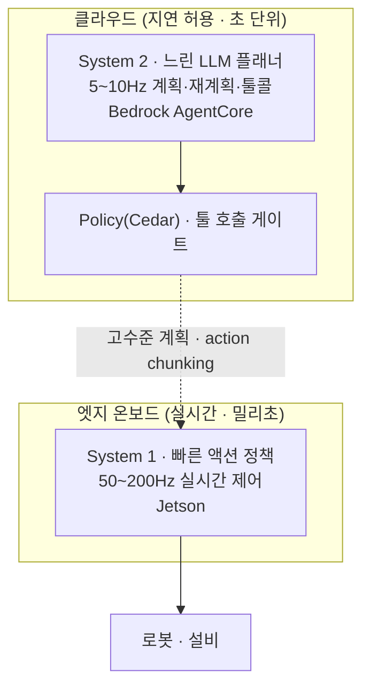
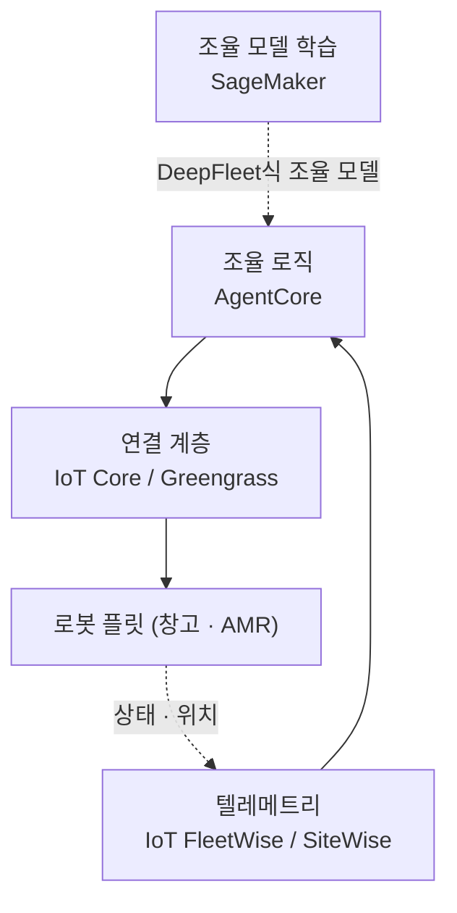

# Pillar 5 — 에이전트 오케스트레이션 (Agentic Orchestration)

_최종 갱신: 2026-07 · owner: comeddy · volatility: 높음(AgentCore 기능·리전 자주 확장)_
_개별 항목은 별도 표기가 없는 한 페이지 메타데이터(owner/updated/volatility)를 상속. 항목별 owner 지정 시 항목 푸터 추가._
[← index로](index.md)

> **L0 TL;DR**: LLM 에이전트가 로봇·설비를 지휘하는 계층. 여기가 **AWS가 가장 강한 필러**다 — **[Amazon Bedrock AgentCore](https://aws.amazon.com/bedrock/agentcore/)가 GA(2025-10)이고 서울 리전 완전 지원**, 툴 호출을 실시간 가로채는 **Policy(Cedar)도 GA(2026-03)**. 구조는 **System 2(느린 LLM 플래너, 클라우드) + System 1(빠른 제어, 엣지)** 분리가 정석. ⚠️ Amazon DeepFleet은 "LLM 에이전트"가 아니라 창고 로봇 조율 파운데이션 모델이니 혼동 금지.

---

## 이 필러에서 고객이 가장 자주 묻는 질문 Top 3

1. **"LLM 에이전트로 로봇/설비를 지휘하는 게 실제로 되나요? AWS엔 뭐가 있죠?"** → [Bedrock AgentCore](#1-amazon-bedrock-agentcore--ga)
2. **"실시간 로봇에 에이전트를 어떻게? 엣지에서 오프라인으로도?"** → [엣지 에이전트 오케스트레이션](#3-엣지-에이전트-오케스트레이션--preview-참조-아키텍처)
3. **"에이전트가 물리 시스템을 제어할 때 안전은 어떻게 보장하죠?"** → [안전 & 가드레일](#5-안전--가드레일--ga-에이전트층---미해결-물리-의미-갭)

> **안정 원리 (잘 안 바뀜)**: 에이전트가 로봇을 "직접 실시간 제어"하지 않는다. **고수준 계획·툴 선택(System 2)은 에이전트가, 저수준 실시간 제어(System 1)는 엣지 정책이** 맡는다(→ [pillar-2](pillar-2.md), [pillar-4](pillar-4.md)). 프로덕션에서 진짜 돌아가는 것은 (1) **창고 플릿 조율**(DeepFleet, CoEvolution)과 (2) **개발/데이터 워크로드 오케스트레이션**(OSMO)이고, 휴머노이드 풀스택 에이전트나 MCP-로봇 연결은 대부분 연구/데모다.

---

## 1. Amazon Bedrock AgentCore  🟢 GA

**L0 TL;DR**: 프로덕션 에이전트를 위한 매니지드 스택 — Runtime, Memory, Gateway(툴 연결), Identity, Observability, 그리고 **Policy(Cedar 기반 실시간 툴 호출 게이트)**. **서울 리전 완전 지원**. 하네스는 무료, 리소스 사용량만 과금.

**고객 니즈/문제**: "에이전트를 PoC 넘어 프로덕션으로 올리고 싶다. 세션 관리, 툴 연결, 권한·보안, 관측을 매번 직접 만들기 싫다."

**솔루션 개요** `[1]`:

- **GA 이력**: 프리뷰 2025-07 → **GA 2025-10-13**. 컴포넌트: **Runtime, Memory, Gateway, Identity, Observability, Built-in Tools(Browser·Code Interpreter)**. re:Invent 2025-12에 Policy·Evaluations 프리뷰, episodic Memory GA, 음성용 양방향 스트리밍 Runtime GA 추가. **Policy는 2026-03-03 GA**.
- **Policy(핵심)**: Gateway와 통합해 **모든 에이전트→툴 호출을 실시간 가로채** 정책(allow/deny)을 ms 단위 평가. 자연어로 작성 → **[Cedar](https://www.cedarpolicy.com/)**(AWS 오픈소스 정책 언어)로 컴파일. **서울 포함 13개 리전 GA**. → 물리 시스템 툴 호출을 제약하는 직접 프리미티브(5번 안전).
- **[Strands Agents SDK](https://strandsagents.com/)**(동반): 모델·클라우드 중립 오케스트레이션 SDK, **1.0 도달(GA급)**. Amazon Q Developer·Glue가 내부 사용. AgentCore와 페어링. (버전·지표는 접힌 블록)
- **[Nova Act](https://nova.amazon.com/act)**(관련): 브라우저/UI 자동화 에이전트, re:Invent 2025 **GA**. 벤더가 높은 태스크 신뢰성을 주장(수치는 접힌 블록 — 측정 조건 미공개).

**AWS 매핑**: 서비스 자체가 매핑. 로봇 스킬을 Gateway에 툴로 등록 → 에이전트가 자연어 계획으로 호출, Policy로 게이팅, Memory로 세션 유지, Observability로 추적.

**의사결정 기준**:

- 프로덕션 에이전트(세션·툴·권한·관측 필요) → **AgentCore Runtime + Gateway + Policy**.
- 단순 단발 추론 → Bedrock 직접 호출로 충분, AgentCore 과함.
- 멀티에이전트·A2A → Strands 1.0.
- 오프라인·저지연 엣지 필요 → 3번(엣지).

**고객 사례**: **AWS×SoftServe 자율 생산라인**(AgentCore + IoT Greengrass + Nova Pro + Jetson Thor) — Hannover Messe 2026 **데모/쇼케이스**([1]/[3]).

**➡️ 다음 액션**: 국내 고객에게 **"AgentCore는 서울 리전 GA — 데이터 레지던시 문제 없다"** 를 먼저 확인시키고(오래된 "서울 미지원" 정보 정정), 로봇 스킬을 Gateway 툴로 등록하는 PoC 제안. 가격은 "하네스 무료, 리소스만 과금" 으로 안심시킴.

**🔗 관련 자산**: [pillar-4 엣지](pillar-4.md) · [AgentCore 시작 워크샵](https://catalog.workshops.aws/agentcore-getting-started/en-US) · [AgentCore Deep Dive 워크샵](https://catalog.workshops.aws/agentcore-deep-dive/en-US) · (사내 AgentCore 워크숍 — 확인 필요 ⚠️)

🔄 휘발성 데이터 (컴포넌트·리전·가격 — 2026-07 확인)

| 컴포넌트 | 상태 | 서울 |
|---|---|---|
| Runtime / Memory / Gateway / Identity / Observability / Built-in Tools | 🟢 GA | ✅ |
| Policy (Cedar 툴 게이트) | 🟢 GA (2026-03) | ✅ |
| Evaluations | 🟡 Preview→ | ✅ |
| Payments | 🟡 Preview | ❌ |
| Agent Registry | — | ❌ (도쿄 ✅) |

**가격**: 하네스 무료, 리소스만. Runtime/Browser/Code Interpreter = $0.0895/vCPU-hr + $0.00945/GB-hr(초당). Gateway $0.005/1,000 호출. Memory 단기 $0.25/1,000 이벤트, 장기저장 $0.75/1,000 레코드·월.
**리전**: 서울(ap-northeast-2) 전 코어+Policy+Evaluations ✅. 도쿄(ap-northeast-1) + Agent Registry ✅. (AWS 공식 리전 표 `[1]`, 2026-07 직접 확인)
**Strands**: Python 1.0(2026-05-21), TS 1.0(2026-04-30), ~16.7M 다운로드/월(2026-06, `[3]`).
**Nova Act**: "90%+ 태스크 신뢰성" — Amazon 발표 수치, 측정 조건 미공개(2025-12, `[3]`). 조건 없이 단정 인용 금지.

---

## 2. System 2 + System 1 오케스트레이션 패턴  🟢 GA (안정 원리)

**L0 TL;DR**: 에이전트 오케스트레이션의 아키텍처 뼈대. **무거운 VLM/LLM이 5~10Hz로 계획·재계획(System 2)**, **경량 정책이 50~200Hz로 실행(System 1)**. 이 분리가 "무엇을 클라우드에, 무엇을 엣지에" 를 결정한다.

**고객 니즈/문제**: "큰 추론 모델과 실시간 제어를 어떻게 한 시스템에 담나?"

**솔루션 개요** `[1]/[4]`: SayCan/PaLM-E(2022~23 연구) 계보에서 진화. 현재 지배 패턴 = 고수준 플래너(태스크 분해·툴콜, 느림) + 저수준 액션 정책(빠름). 예시 수치(벤더 공개, 자릿수 감각용): Figure Helix S2 7~9Hz + S1 200Hz(Figure, 2025), GR00T N1 S1 diffusion ~10ms(NVIDIA, 2025). ⚠️ **패턴 자체는 표준이나, 전신 휴머노이드 풀스택은 대부분 파일럿/데모**.

**AWS 매핑**: **System 2 = 클라우드 Bedrock AgentCore**(계획·툴 오케스트레이션·가드레일), **System 1 = 엣지 Jetson**(실시간 제어, → [pillar-4](pillar-4.md)). 지연 허용되면 System 2 클라우드, 아니면 엣지 온보드.

**의사결정 기준**: [decisions Cloud vs Edge](decisions.md) 참조. 실시간 제어 루프 → 무조건 엣지. 계획·재계획 → 클라우드/비동기 가능.

**고객 사례**: Figure, GR00T(오픈). 검증 프로덕션 제한적.

**➡️ 다음 액션**: "에이전트가 로봇을 실시간 제어하나?" 오해에 대해 **"에이전트는 계획, 실시간 제어는 엣지 정책"** 으로 그림 정리. AgentCore(계획) + Jetson(제어) 조합 제시.

**🔗 관련 자산**: [pillar-2 VLA 구조](pillar-2.md) · [pillar-4 엣지](pillar-4.md) · [decisions](decisions.md)

---

## 3. 엣지 에이전트 오케스트레이션  🟡 Preview (참조 아키텍처)

**L0 TL;DR**: 오프라인·저지연 현장에서 에이전트를 엣지 디바이스에 배포하는 패턴. AWS **Solutions Guidance("AI Agents to Device Fleets via IoT Greengrass")** 가 실재하는 참조 아키텍처 — 단 **GA 제품이 아니라 가이던스/샘플코드**.

**고객 니즈/문제**: "공장이 오프라인/저대역이다. 클라우드 없이도 에이전트가 현장에서 판단하게 하고 싶다."

**솔루션 개요** `[1]/[3]`: AWS Guidance = **[IoT Greengrass](https://docs.aws.amazon.com/greengrass/v2/developerguide/what-is-iot-greengrass.html) 디바이스에 Strands Agents + 로컬 SLM([Ollama](https://ollama.com/))** 배포. GGUF 모델을 S3로 푸시, IoT Core MQTT로 질의, Orchestrator Agent가 전문 에이전트(문서·OPC-UA 등)로 팬아웃. 연결되면 Bedrock 클라우드 모델로 전환. 대상 산업에 **로보틱스** 명시. 2026 패턴: 학습 모델 → Jetson Thor에 Greengrass로 배포, VDA 5050 프로토콜 변환으로 AMR 플릿 조율.

**AWS 매핑**: IoT Greengrass V2 + Strands + 로컬 SLM(Ollama) + IoT Core(MQTT) + S3(모델). 온라인 시 Bedrock/AgentCore로 승격.

**의사결정 기준**: 오프라인·데이터 주권·저지연 → 엣지 에이전트. 항상 연결·복잡 추론 → 클라우드 AgentCore.

**고객 사례**: AWS×SoftServe(위 1번, 데모).

**➡️ 다음 액션**: 오프라인 고객에게 **AWS Greengrass 에이전트 Guidance + 샘플코드를 출발점으로** 제시(GA 제품 아님을 정직히). 온/오프라인 하이브리드(엣지 SLM ↔ 클라우드 AgentCore) 설계.

**🔗 관련 자산**: [pillar-4 엣지 배포](pillar-4.md) · [pillar-1](pillar-1.md)

---

## 4. 플릿 오케스트레이션  🟢 GA (일부) / mixed

**L0 TL;DR**: 여러 로봇을 조율하는 계층. **실제 프로덕션은 창고 플릿 조율**(Amazon DeepFleet, CoEvolution)과 **개발 워크로드 오케스트레이션**(NVIDIA OSMO)이다. ⚠️ DeepFleet은 LLM 에이전트가 아니라 멀티로봇 조율 파운데이션 모델.

**고객 니즈/문제**: "수백~수천 대 로봇을 어떻게 중앙에서 조율·모니터링하나?"

**솔루션 개요** `[1]/[3]`:

- **[Amazon DeepFleet](https://www.aboutamazon.com/news/operations/amazon-million-robots-ai-foundation-model)** 🟢 — Amazon 창고 로봇 플릿 조율 생성형 파운데이션 모델("교통 관제"), ~10% 이동시간 효율 개선, 100만 번째 로봇과 함께 발표(2025-07). **프로덕션(Amazon 내부)**. ⚠️ **LLM 에이전트 오케스트레이터 아님** — 멀티로봇 RL 의미의 "멀티에이전트". 잘못 분류 금지.
- **[NVIDIA Isaac OSMO](https://developer.nvidia.com/osmo)** 🟢 — 로보틱스 **개발/데이터/학습 워크로드** 오케스트레이션(합성데이터·학습·RL·SIL). GTC 2026에 코딩 에이전트(Claude Code/Codex/Cursor) 통합. ⚠️ **현장 로봇 플릿 실시간 제어가 아님** — 개발 파이프라인 오케스트레이션.
- **Formant** 🟡 — 플릿 관리 SaaS. 수백 개 조직에서 운영 중이나 소규모(구체 지표는 `[3]` PitchBook/Crunchbase 기준 — 644개 조직·<$5M ARR, 2026-05, 변동 잦음), 미인수.
- **CoEvolution** — Lotte Global Logistics 417 슈퍼스토어 멀티플릿 조율, 30% 효율 주장(⚠️ 단일 [3] 출처, 재확인 필요).

**AWS 매핑**: IoT Core/Greengrass(플릿 연결) + AgentCore(오케스트레이션 로직) + IoT FleetWise/SiteWise(텔레메트리). DeepFleet식 조율 모델은 SageMaker로 학습.

**의사결정 기준**: 창고/AMR 플릿 조율 → 검증된 영역(DeepFleet식 접근 참조). 휴머노이드 에이전트 플릿 → 아직 초기. 개발 워크로드 → OSMO(NVIDIA) 또는 AWS Batch/Step Functions.

**고객 사례** (⚠️ 국내는 초기/데모/발표): **Lotte Global Logistics×CoEvolution**(30%, 단일출처), **LG CNS** 창고 데모(휴머노이드+로봇개+모바일), **Naver** AI Agent Platform 2026 하반기 예정(NVIDIA 블루프린트).

**➡️ 다음 액션**: 플릿 고객에게 **"조율 로직은 AgentCore, 연결은 IoT, 학습은 SageMaker"** 3계층으로 정리. DeepFleet을 LLM 에이전트로 오해하지 않게 정확히 설명.

**🔗 관련 자산**: [pillar-2 학습](pillar-2.md) · [pillar-3 OSMO](pillar-3.md)

---

## 5. 안전 & 가드레일  🟢 GA (에이전트층) / 🔵 미해결 (물리-의미 갭)

**L0 TL;DR**: 에이전트가 물리 시스템을 제어할 때 안전은 **계층 방어**로. **AgentCore Policy(Cedar)가 에이전트→툴 호출을 게이팅**하고, 로봇층은 **ISO 결정적 안전 계층**이 맡는다. ⚠️ 현존 표준(ISO)은 물리 안전만 다루고 **LLM 의미적 위험(환각·탈옥)을 커버하는 표준은 아직 없다** — 정직한 열린 문제.

**고객 니즈/문제**: "에이전트가 잘못 판단해서 로봇이 위험 행동을 하면? 어떻게 막나?"

**솔루션 개요** `[1]/[4]`:

- **에이전트층(AWS 네이티브)**: **AgentCore Policy** — 모든 에이전트→툴 호출을 Cedar로 실시간 allow/deny(ms). 물리 액션 툴 호출을 제약하는 실용 계층. **[Bedrock Guardrails](https://aws.amazon.com/bedrock/guardrails/)** — LLM 입출력(콘텐츠·주제·PII) 필터(액추에이션 자체는 아님).
- **로봇층(기능 안전)**: **[ISO 10218-1/2](https://www.iso.org/standard/73933.html)**(로봇·통합시스템), **ISO/TS 15066**(협동로봇), **ISO 13482**(개인지원로봇). ⚠️ 이들은 **물리 안전만** — LLM 의미적 악용/환각은 미커버.
- **연구**: RoboGuard(안전규칙 grounding), BadRobot(임베디드 LLM 탈옥 공격), LLM 의미적 DoS — 🔵 연구단계. 표준이 기능안전(ISO)과 LLM 위험을 잇지 못하는 **열린 갭**.

**AWS 매핑**: AgentCore Policy(Cedar) + Bedrock Guardrails(에이전트층) + 로봇 온보드 결정적 안전(ISO 준거, AWS 밖).

**의사결정 기준**: 물리 액션 에이전트 → **반드시 계층 방어**(AgentCore Policy로 툴 게이팅 + 로봇 온보드 ISO 안전 계층). 어느 한쪽만으론 불충분. "에이전트가 알아서 안전"은 금지.

**고객 사례**: (프로덕션 안전 사례는 비공개/초기)

**➡️ 다음 액션**: 안전 질문에 **"에이전트층은 AgentCore Policy/Cedar로 툴 호출 게이팅, 로봇층은 ISO 결정적 안전 — 이중 방어"** 를 제시. "LLM 의미 위험 표준은 아직 없다"는 정직히 인정하고 계층 방어로 보완하는 각도.

**🔗 관련 자산**: [pillar-4 엣지](pillar-4.md) · (사내 에이전트 안전 가이드 — 신규 필요 ⚠️)

---

## 이 필러의 정직한 현실 (SA 필독)

- **AgentCore는 서울 리전 완전 지원**(Policy·Evaluations 포함). "서울 미지원"은 GA 초기 얘기 — 지금은 틀림. 데이터 레지던시 안심시켜라.
- **Policy는 GA(2026-03)** — "프리뷰"라 부르지 말 것.
- **DeepFleet ≠ LLM 에이전트 오케스트레이터.** 창고 로봇 조율 파운데이션 모델(멀티로봇 RL). 오분류 금지.
- **진짜 프로덕션은 플릿 조율(DeepFleet/CoEvolution)과 개발 워크로드(OSMO).** MCP-로봇 연결과 휴머노이드 풀스택 에이전트는 대부분 연구/데모.
- **LLM 의미적 안전 표준은 없다.** ISO는 물리만. 계층 방어(Cedar Policy + ISO 로봇층)가 정직한 답.
- **Lotte 30% 등 국내 수치는 단일 출처** — 하드 인용 전 재확인.

---
_owner: comeddy · updated: 2026-07 · volatility: 높음 (AgentCore 기능·리전은 접힌 블록에서 관리) · sources: [1] 공식, [3] 벤더/press, [4] 연구/커뮤니티_
