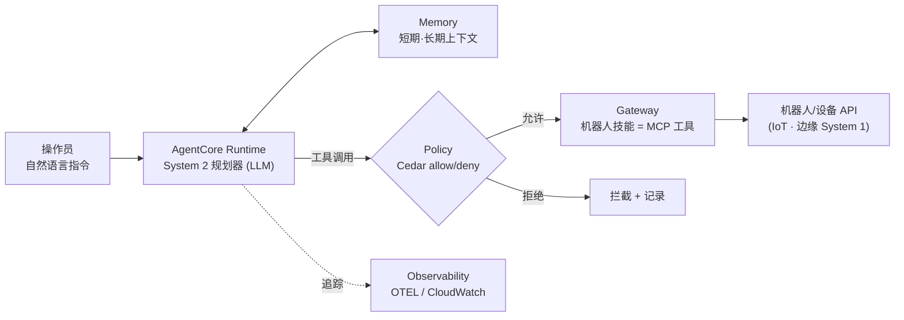
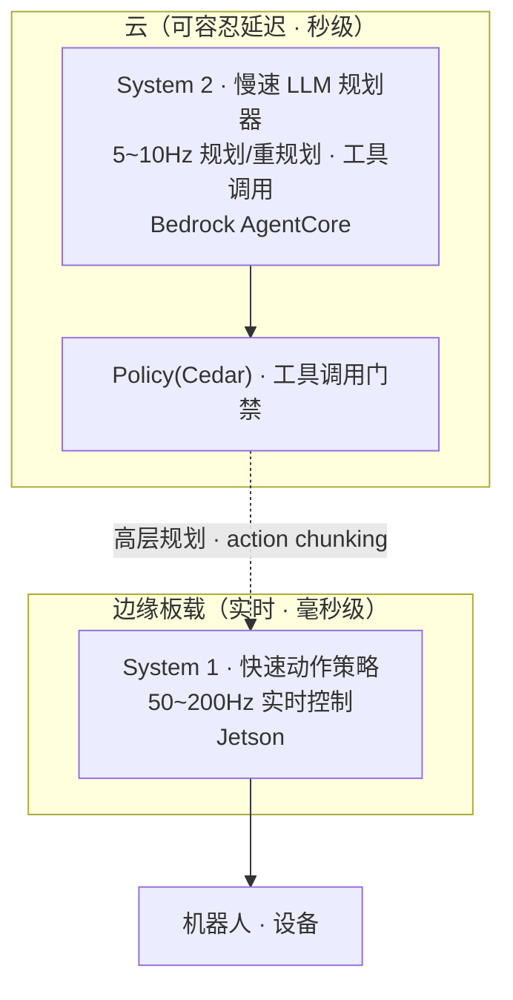
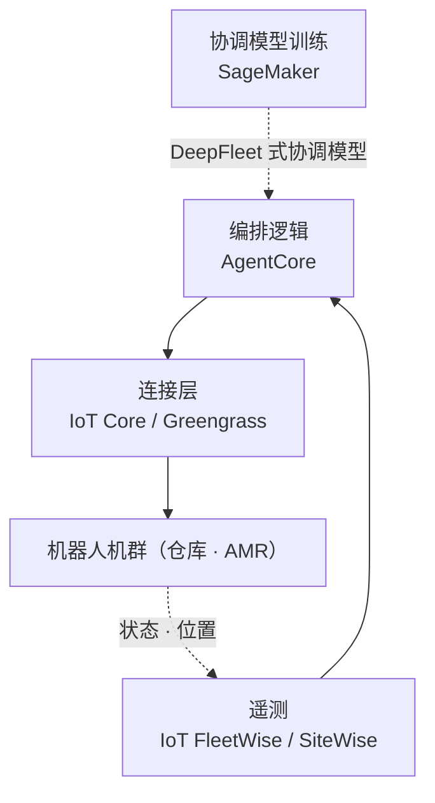

# Pillar 5 — 智能体编排 (Agentic Orchestration)

_最终更新: 2026-09 · owner: Youngjin · volatility: 高（AgentCore 功能·区域经常扩展）_
_除非另有标注，各条目继承页面元数据（owner/updated/volatility）。按条目指定 owner 时在条目页脚补充。_
[← 返回 index](index.md)

> **L0 TL;DR**: LLM 智能体[^agent]指挥机器人·设备的层。这里是 **AWS 最强的支柱** —— **[Amazon Bedrock AgentCore](https://aws.amazon.com/bedrock/agentcore/) 已 GA(2025-10) 且首尔区域完全支持**，实时拦截工具调用[^tool]的 **Policy(Cedar) 也已 GA(2026-03)**。结构上以 **System 2[^sys]（慢速 LLM 规划器，云）+ System 1（快速控制，边缘）** 分离为正统。⚠️ Amazon DeepFleet 不是"LLM 智能体"，而是仓库机器人协调的基础模型，切勿混淆。

---

## 本支柱中客户最常问的问题 Top 3

1. **"用 LLM 智能体指挥机器人/设备实际可行吗？AWS 上有什么？"** → [Bedrock AgentCore](#1-amazon-bedrock-agentcore--ga)
2. **"实时机器人上怎么用智能体？能在边缘离线运行吗？"** → [边缘智能体编排](#3-边缘智能体编排--preview参考架构)
3. **"智能体控制物理系统时，安全怎么保证？"** → [安全 & 护栏](#5-安全--护栏--ga智能体层--未解决物理-语义-gap)

> **稳定原理（几乎不变）**: 智能体不"直接实时控制"机器人。**高层规划·工具选择(System 2) 由智能体承担，低层实时控制(System 1) 由边缘策略承担**（→ [pillar-2](pillar-2.md)、[pillar-4](pillar-4.md)）。生产中真正跑起来的是 (1) **仓库机群[^fleet]协调**(DeepFleet, CoEvolution) 与 (2) **开发/数据工作负载编排**[^orch](OSMO)，而人形全栈智能体或 MCP[^mcp]-机器人连接大多为研究/演示。

---

## 1. Amazon Bedrock AgentCore  🟢 GA

**L0 TL;DR**: 面向生产智能体的托管栈 —— Runtime、Memory、Gateway（工具连接）、Identity、Observability，以及 **Policy（基于 Cedar 的实时工具调用门禁）**。**首尔区域完全支持**。框架免费，仅按资源用量计费。

**客户需求/问题**: "想把智能体从 PoC 推进到生产。不想每次都自己搭建会话管理、工具连接、权限·安全、可观测性。"

**解决方案概览** `[1]`:

- **GA 历程**: 预览 2025-07 → **GA 2025-10-13**。组件: **Runtime、Memory、Gateway、Identity、Observability、Built-in Tools（Browser·Code Interpreter）**。re:Invent 2025-12 新增 Policy·Evaluations 预览、episodic Memory GA、面向语音的双向流式 Runtime GA。**Policy 于 2026-03-03 GA**。
- **Policy（核心）**: 与 Gateway 整合，**实时拦截所有 智能体→工具 调用**，以 ms 级评估策略(allow/deny)。用自然语言编写 → 编译为 **[Cedar](https://www.cedarpolicy.com/)**（AWS 开源策略语言）。**含首尔在内 13 个区域 GA**。→ 约束物理系统工具调用的直接原语（第 5 项安全）。
- **[Strands Agents SDK](https://strandsagents.com/)**（配套）: 模型·云中立的编排 SDK，**已达 1.0（GA 级）**。Amazon Q Developer·Glue 内部使用。与 AgentCore 配对。（版本·指标见折叠块）
- **[Nova Act](https://nova.amazon.com/act)**（相关）: 浏览器/UI 自动化智能体，re:Invent 2025 **GA**。厂商声称高任务可靠性（数值见折叠块 —— 测量条件未公开）。

**各组件实际提供的能力** `[1]`（docs 2026-07 核实）:

| 组件 | 技术要点 | 机器人工作负载视角 |
|---|---|---|
| **Runtime** | 每个会话在专属 microVM[^microvm] 中无服务器运行（CPU·内存·文件系统隔离，终止时清除内存）。长会话**最长 8 小时**；等待 LLM·工具响应的时间**不计费**。框架·模型中立（LangGraph·CrewAI·Strands 等） | 承载 System 2 规划器的地方 —— 长任务规划保持在同一个隔离会话中 |
| **Gateway** | **把 Lambda·OpenAPI·Smithy·既有 MCP 服务器·API Gateway 转换为 MCP 工具**，聚合为一个虚拟 MCP 服务器。语义工具搜索，入站·出站认证全托管 | 用几行代码把机器人技能（抓取·移动·检查 API）工具化的接入点 |
| **Memory** | 双层：短期（会话原始事件）+ 长期（提取策略：摘要·语义·用户偏好 + episodic）。**长期记忆的检索也要经过 Policy** | 保持任务上下文（"刚才那个货架"）并跨会话积累现场知识 |
| **Identity** | 智能体工作负载身份 + OAuth2/API 密钥令牌保险库 —— 工具调用时安全代理认证 | 避免在机器人机群 API 中硬编码人的凭证 |
| **Policy** | 实时拦截所有智能体→工具调用，以毫秒级评估 Cedar 策略（自然语言编写 → 编译为 Cedar） | 物理动作前的最后安全闸门（→ 第 5 节） |
| **Observability** | 兼容 OTEL[^otel] 的追踪·跨度·指标，集成 CloudWatch | 按步骤重构"它为什么那么做" —— 事故调查·审计 |
| **Built-in Tools** | 托管 Browser（隔离 microVM）·Code Interpreter | 手册查询·数值计算等辅助工作 |

**AWS 映射**: 服务本身即映射。将机器人技能作为工具注册到 Gateway → 智能体以自然语言计划调用，用 Policy 门控，用 Memory 维持会话，用 Observability 追踪。

**决策标准**:

- 生产智能体（需要会话·工具·权限·可观测性）→ **AgentCore Runtime + Gateway + Policy**。
- 简单一次性推理 → 直接调用 Bedrock 即够，AgentCore 过重。
- 多智能体·A2A[^a2a] → Strands 1.0。
- 需要离线·低延迟边缘 → 第 3 项（边缘）。

**客户案例**: **AWS×SoftServe 自主生产线**(AgentCore + IoT Greengrass + Nova Pro + Jetson Thor) —— Hannover Messe 2026 **演示/展示**([1]/[3])。

**➡️ 后续行动**: 先让韩国客户确认 **"AgentCore 在首尔区域 GA —— 无数据驻留问题"**（更正过时的"首尔不支持"信息），再提议把机器人技能注册为 Gateway 工具的 PoC。价格以"框架免费，仅按资源计费"来安心。

**🔗 相关资产**:

- Playbook: [pillar-4 边缘](pillar-4.md)
- [AgentCore 入门研讨会](https://catalog.workshops.aws/agentcore-getting-started/en-US) · [AgentCore Deep Dive 研讨会](https://catalog.workshops.aws/agentcore-deep-dive/en-US)
- [AgentCore 零售智能体研讨会 "Build! Deploy! Observe!"](https://catalog.us-east-1.prod.workshops.aws/workshops/3cab1e1f-1dfa-42e0-959c-6e2e0a072ea3/ko-KR) —— 韩语。虽以零售场景为例，但以三阶段动手实验覆盖 AgentCore 全部 7 个服务（Gateway·Runtime·Observability·Code Interpreter·Memory·Policy·Browser）—— Policy 护栏·升级规则实验与第 5 项（安全 & 护栏）相衔接。指南: [研讨会站点](https://dxdbmmdwak6t8.cloudfront.net/)（面向活动的 CloudFront 部署 —— 链接持久性待确认 ⚠️）
- （内部 AgentCore 研讨会 —— 需确认 ⚠️）
- [AWS Physical AI Toolchain](https://github.com/aws-samples/sample-aws-physical-ai-toolchain) —— aws-samples。4 支柱飞轮参考架构。⚠️ 目前仅 NVIDIA OSMO 6.3 on EKS 编排为 Available，Cosmos·Isaac Lab·GR00T·Strands+AgentCore 智能体层均为 Planned
- [Self-improving Physical AI](https://github.com/aws-samples/sample-self-improving-physical-AI) —— aws-samples。Bedrock 智能体通过 IoT 控制 Isaac Sim 与实体机器人 SO-ARM101/XGO2/Zumi，借助智能体记忆进行 sim-to-real 迭代学习
- [Agentic AI Robot — 工业安全监控](https://github.com/aws-samples/sample-agentic-ai-robot) —— aws-samples。AgentCore+IoT+机器人自主巡逻·边缘推理演示，曾在 AWS AI x Industry Week 2025 展示，含韩语 README。⚠️ 明确标注为实验·教育用途 —— 非生产环境
- [Smart Machines — 工业设备混合 Physical AI](https://github.com/aws-samples/sample-smart-machines-physical-hybrid-ai) —— aws-samples。智能体完成机群遥测异常检测→根因诊断→建单·调整设备参数的全栈演示（多智能体对话·自然语言场景构建器·KVS 视频→Bedrock 分析·Jetson YOLOWorld+VLM 边缘监控）。⚠️ README 明示为演示 —— 目前仅挖掘机（模拟遥测）完整可用，机械臂为 WIP

🔄 易变数据（组件·区域·价格 —— 2026-07 确认）

| 组件 | 状态 | 首尔 |
|---|---|---|
| Runtime / Memory / Gateway / Identity / Observability / Built-in Tools | 🟢 GA | ✅ |
| Policy (Cedar 工具门禁) | 🟢 GA (2026-03) | ✅ |
| Evaluations | 🟡 Preview→ | ✅ |
| Payments | 🟡 Preview | ❌ |
| Agent Registry | 🟡 Preview | ❌（东京 ✅） |

**价格** —— 框架（控制面）免费，只按实际使用的资源计费:

| 项目 | 费率 |
|---|---|
| Runtime · Browser · Code Interpreter | $0.0895/vCPU-小时 + $0.00945/GB-小时（按秒计费） |
| Gateway | 每 1,000 次调用 $0.005 |
| Memory —— 短期 | 每 1,000 事件 $0.25 |
| Memory —— 长期存储 | 每 1,000 记录每月 $0.75 |

**区域**（AWS 官方区域表 `[1]`，2026-07 直接确认）:

| 区域 | 覆盖范围 |
|---|---|
| **首尔** (ap-northeast-2) | 全部核心组件 + Policy + Evaluations ✅ |
| 东京 (ap-northeast-1) | 核心组件 + **Agent Registry** ✅（首尔尚未支持） |

**配套工具指标**:

| 项目 | 值 | 备注 |
|---|---|---|
| Strands Python 1.0 | 2026-05-21 | 下载约 16.7M/月（2026-06, `[3]`） |
| Strands TypeScript 1.0 | 2026-04-30 | |
| Nova Act | "90%+ 任务可靠性" | Amazon 公布数值，测量条件未公开（2025-12, `[3]`）—— **禁止无条件断言引用** |

---

## 2. System 2 + System 1 编排模式  🟢 GA（稳定原理）

**L0 TL;DR**: 智能体编排的架构骨架。**重型 VLM/LLM 以 5~10Hz 规划·重规划(System 2)**，**轻量策略以 50~200Hz 执行(System 1)**。这种分离决定了"什么放云、什么放边缘"。

**客户需求/问题**: "大型推理模型和实时控制怎么放进一个系统？"

**解决方案概览** `[1]/[4]`: 从 SayCan/PaLM-E(2022~23 研究) 谱系演进。当前主导模式 = 高层规划器（任务分解·工具调用，慢）+ 低层动作策略（快）。示例数值（厂商公开，用于建立量级感）: Figure Helix S2 7~9Hz + S1 200Hz(Figure, 2025)、GR00T N1 S1 diffusion ~10ms(NVIDIA, 2025)。⚠️ **模式本身是标准，但全身人形全栈大多为试点/演示**。

**AWS 映射**: **System 2 = 云端 Bedrock AgentCore**（规划·工具编排·护栏[^guardrail]），**System 1 = 边缘 Jetson**（实时控制，→ [pillar-4](pillar-4.md)）。能容忍延迟则 System 2 放云上，否则边缘板载。

**决策标准**: 参见 [decisions Cloud vs Edge](decisions.md)。实时控制回路 → 无条件边缘。规划·重规划 → 可放云/异步。

**客户案例**: Figure、GR00T（开放）。经过验证的生产环境有限。

**➡️ 后续行动**: 针对"智能体实时控制机器人吗？"的误解，**用"智能体做规划，实时控制交给边缘策略"来理清图示**。提出 AgentCore（规划）+ Jetson（控制）的组合。

**🔗 相关资产**: [pillar-2 VLA 结构](pillar-2.md) · [pillar-4 边缘](pillar-4.md) · [decisions](decisions.md)

---

## 3. 边缘智能体编排  🟡 Preview（参考架构）

**L0 TL;DR**: 在离线·低延迟现场把智能体部署到边缘设备的模式。AWS **Solutions Guidance("AI Agents to Device Fleets via IoT Greengrass")** 是真实存在的参考架构 —— 但**不是 GA 产品，而是指南/示例代码**。

**客户需求/问题**: "工厂离线/低带宽。想让智能体不依赖云也能在现场做判断。"

**解决方案概览** `[1]/[3]`: AWS Guidance = **在 [IoT Greengrass](https://docs.aws.amazon.com/greengrass/v2/developerguide/what-is-iot-greengrass.html) 设备上部署 Strands Agents + 本地 SLM([Ollama](https://ollama.com/))**。把 GGUF 模型推送到 S3，用 IoT Core MQTT 查询，Orchestrator Agent 向专门智能体（文档·OPC-UA 等）扇出。联网后切换到 Bedrock 云模型。目标行业明示含**机器人**。2026 模式: 训练模型 → 用 Greengrass 部署到 Jetson Thor，通过 VDA 5050 协议转换协调 AMR 机群。

**AWS 映射**: IoT Greengrass V2 + Strands + 本地 SLM(Ollama) + IoT Core(MQTT) + S3（模型）。在线时晋升到 Bedrock/AgentCore。

**决策标准**: 离线·数据主权·低延迟 → 边缘智能体。始终联网·复杂推理 → 云端 AgentCore。

**客户案例**: AWS×SoftServe（上方第 1 项，演示）。

**➡️ 后续行动**: 向离线客户**以 AWS Greengrass 智能体 Guidance + 示例代码作为起点**提出（诚实说明不是 GA 产品）。设计在线/离线混合（边缘 SLM ↔ 云端 AgentCore）。

**🔗 相关资产**: [pillar-4 边缘部署](pillar-4.md) · [pillar-1](pillar-1.md) · [MCP+MQTT on AWS IoT Core 模式](https://aws.amazon.com/blogs/physical-ai/building-physical-ai-agents-with-mcp-and-mqtt-on-aws-iot-core/) —— 官方博客。在 IoT Core(MQTT) 上把机器人·边缘设备当作 MCP 工具来驱动 Physical AI 智能体的实战模式 —— 连接边缘运营(P4)与多设备协调(P5)的现行标准路径

---

## 4. 机群编排  🟢 GA（部分）/ mixed

**L0 TL;DR**: 协调多个机器人的层。**真正的生产是仓库机群协调**(Amazon DeepFleet, CoEvolution) 与 **开发工作负载编排**(NVIDIA OSMO)。⚠️ DeepFleet 不是 LLM 智能体，而是多机器人协调基础模型。

**客户需求/问题**: "怎么从中央协调·监控数百~数千台机器人？"

**解决方案概览** `[1]/[3]`:

- **[Amazon DeepFleet](https://www.aboutamazon.com/news/operations/amazon-million-robots-ai-foundation-model)** 🟢 —— Amazon 仓库机器人机群协调的生成式基础模型（"交通管制"），移动时间效率提升 ~10%，与第 100 万台机器人一同公布(2025-07)。**生产（Amazon 内部）**。⚠️ **不是 LLM 智能体编排器** —— 是多机器人 RL 意义上的"多智能体"。禁止错误归类。
- **[NVIDIA Isaac OSMO](https://developer.nvidia.com/osmo)** 🟢 —— 机器人**开发/数据/训练工作负载**编排（合成数据·训练·RL·SIL）。GTC 2026 整合编码智能体(Claude Code/Codex/Cursor)。⚠️ **不是现场机器人机群的实时控制** —— 是开发管道编排。
- **Formant** 🟡 —— 机群管理 SaaS。在数百个组织中运行但规模较小（具体指标以 `[3]` PitchBook/Crunchbase 为准 —— 644 个组织·<$5M ARR, 2026-05, 变动频繁），未被收购。
- **CoEvolution** —— Lotte Global Logistics 417 家超级门店的多机群协调，声称 30% 效率（⚠️ 单一 [3] 来源，需再确认）。

**AWS 映射**: IoT Core/Greengrass（机群连接）+ AgentCore（编排逻辑）+ IoT FleetWise/SiteWise（遥测）。DeepFleet 式协调模型用 SageMaker 训练。

**决策标准**: 仓库/AMR 机群协调 → 已验证领域（参考 DeepFleet 式方法）。人形智能体机群 → 仍处早期。开发工作负载 → OSMO(NVIDIA) 或 AWS Batch/Step Functions。

**客户案例**（⚠️ 韩国为早期/演示/公布）: **Lotte Global Logistics×CoEvolution**(30%，单一来源)、**LG CNS** 仓库演示（人形+机器狗+移动）、**Naver** AI Agent Platform 计划于 2026 下半年（NVIDIA 蓝图）。海外生产案例: **Certis**（安保服务）—— [在 AWS 上部署·运营自主巡逻机器人](https://aws.amazon.com/blogs/physical-ai/how-certis-achieved-autonomous-robot-security-patrols-with-aws/)的官方客户案例 `[1]` —— 把机群真正投入现场运行的边缘+协调视角下少见的公开参考。

**➡️ 后续行动**: 向机群客户**以"协调逻辑用 AgentCore，连接用 IoT，训练用 SageMaker"三层来梳理**。准确说明，避免把 DeepFleet 误解为 LLM 智能体。

**🔗 相关资产**: [pillar-2 训练](pillar-2.md) · [pillar-3 OSMO](pillar-3.md)

---

## 5. 安全 & 护栏  🟢 GA（智能体层）/ 🔵 未解决（物理-语义 gap）

**L0 TL;DR**: 智能体控制物理系统时，安全靠**分层防御**。**AgentCore Policy(Cedar) 门控 智能体→工具 调用**，机器人层则由 **ISO 确定性安全层**承担。⚠️ 现有标准(ISO) 只涵盖物理安全，**尚无覆盖 LLM 语义风险（幻觉·越狱）的标准** —— 诚实的开放问题。

**客户需求/问题**: "智能体判断错误导致机器人做出危险行为怎么办？怎么阻止？"

**解决方案概览** `[1]/[4]`:

- **智能体层（AWS 原生）**: **AgentCore Policy** —— 用 Cedar 实时 allow/deny 所有 智能体→工具 调用(ms)。约束物理动作工具调用的实用层。**[Bedrock Guardrails](https://aws.amazon.com/bedrock/guardrails/)** —— 过滤 LLM 输入输出（内容·主题·PII）（本身不是执行动作）。
- **机器人层（功能安全）**: **[ISO 10218-1/2](https://www.iso.org/standard/73933.html)**（机器人·集成系统）、**ISO/TS 15066**（协作机器人）、**ISO 13482**（个人辅助机器人）。⚠️ 这些**只涉及物理安全** —— 不覆盖 LLM 语义滥用/幻觉。
- **研究**: RoboGuard（安全规则 grounding）、BadRobot（嵌入式 LLM 越狱攻击）、LLM 语义 DoS —— 🔵 研究阶段。标准无法连接功能安全(ISO) 与 LLM 风险的**开放 gap**。

**AWS 映射**: AgentCore Policy(Cedar) + Bedrock Guardrails（智能体层）+ 机器人板载确定性安全（依据 ISO，在 AWS 之外）。

**决策标准**: 物理动作智能体 → **必须分层防御**（用 AgentCore Policy 做工具门控 + 机器人板载 ISO 安全层）。仅靠任一方都不够。禁止"智能体会自己保证安全"。

**客户案例**: （生产安全案例为非公开/早期）

**➡️ 后续行动**: 对安全问题**提出"智能体层用 AgentCore Policy/Cedar 门控工具调用，机器人层用 ISO 确定性安全 —— 双重防御"**。诚实承认"LLM 语义风险标准尚不存在"，并以分层防御来补足的角度。

**🔗 相关资产**: [pillar-4 边缘](pillar-4.md) · （内部智能体安全指南 —— 新建需要 ⚠️）

---

## 6. 物理世界的智能体标准 — Anthropic MHS & AWS Strands Robots  🟡 Research Preview

**L0 TL;DR**: 2026-08-27 Anthropic 公开了 **[Model Hardware Standard(MHS)](https://www.anthropic.com/news/model-hardware-standard-research-preview)** research preview —— 让 AI 智能体通过**标准化驱动（read/write primitive）**操作物理设备（显微镜·liquid handler·机械臂）并并行编排多台设备的共享规格。相当于 MCP 之于数据·工具的硬件版。**AWS 通过 Strands Robots 支持 MHS**（面向 preview 参与者的 private pre-release），**Doosan Robotics（韩国）为发布合作伙伴**。⚠️ research preview —— 禁止向客户做生产提议，仅作方向指标。

**客户需求/问题**: "每台设备都在重复定制集成（数周~数月）。智能体-硬件连接没有标准吗？"

**解决方案概览** `[1]/[3]`:

- **工作方式**: 将设备暴露为 read（例: get temperature）/write（set temperature）primitive 集合的**标准驱动** + 由自然语言标签生成的 reference file（记载该设备可测量·可调整的项目与**强制执行的安全限值（safety limits）**）。智能体通过三种机制（MCP·CLI·code files/API）控制设备，编排步骤、观测结果并实时调整参数。model-agnostic —— 核心主张是把集成周期从数周~数月缩短到数小时~数分钟。
- **AWS 的位置**: Anthropic 公告明示 "AWS will support MHS through **Strands Robots**, the library for connecting AI agents to physical devices"。它与公开的 [strands-labs/robots](https://github.com/strands-labs/robots)（Apache-2.0 —— Strands Agents + GR00T VLA + LeRobot 整合机器人控制库）相衔接，但 ⚠️ **公开包本身并未提及 MHS** —— 支持 MHS 的构建是单独的 private pre-release。
- **韩国相关性** `[3]`: Doosan Robotics 作为发布合作伙伴，正在机械臂的自动质检（QA）·多机器人协作上测试 MHS（与 Universal Robots·Tecan·QIAGEN 等一道）。
- **诚实的局限**: LLM 通过文本·图像学习物理世界，**空间·物理推理仍需专家监督** —— Anthropic 自己举例: Genentech 研究人员不得不教 Claude "样品起泡（foaming）不是软件 bug 而是物理失败"。已计划开源。

**AWS 映射**: AgentCore（第 1 节）负责智能体运行时·Policy 门控，MHS/Strands Robots 负责设备连接标准 —— 相当于在第 5 节分层防御的"工具门禁"之下再加一层**"设备驱动 + safety limits"**。

**决策标准**: 还不到写进今天设计的阶段（research preview）。但对设备集成积压大的客户（实验室自动化·多品种单元），应作为**观察清单第一位**进行引导。

**客户案例**: Doosan Robotics（发布合作伙伴，测试阶段）`[3]`。

**➡️ 后续行动**: 向已在用 MCP 的客户以 **"MCP 管数据·工具，MHS 管硬件"** 的框架介绍；一旦公开，就以 Strands Robots 路径安排验证 PoC。在那之前的现行替代方案是 [MCP+MQTT on IoT Core 模式](https://aws.amazon.com/blogs/physical-ai/building-physical-ai-agents-with-mcp-and-mqtt-on-aws-iot-core/)（第 3 节相关资产）。

**🔗 相关资产**: [strands-labs/robots](https://github.com/strands-labs/robots) · [pillar-4 边缘](pillar-4.md)

---

## 本支柱的诚实现实（SA 必读）

- **AgentCore 首尔区域完全支持**（含 Policy·Evaluations）。"首尔不支持"是 GA 初期的说法 —— 现在已错。让客户对数据驻留放心。
- **Policy 已 GA(2026-03)** —— 不要称其为"预览"。
- **DeepFleet ≠ LLM 智能体编排器。** 是仓库机器人协调基础模型（多机器人 RL）。禁止错误归类。
- **真正的生产是机群协调(DeepFleet/CoEvolution) 与开发工作负载(OSMO)。** MCP-机器人连接与人形全栈智能体大多为研究/演示。
- **没有 LLM 语义安全标准。** ISO 只管物理。分层防御(Cedar Policy + ISO 机器人层) 才是诚实的答案。
- **Lotte 30% 等韩国数值为单一来源** —— 硬引用前需再确认。

---
_owner: Youngjin · updated: 2026-09 · volatility: 高（AgentCore 功能·区域在折叠块中管理）· sources: [1] 官方, [3] 厂商/press, [4] 研究/社区_

<!-- 용어 각주 -->

[^agent]: **LLM 智能体** — 大语言模型自行制定计划、挑选并调用工具（API·机器人技能）、执行多步任务的软件。与简单问答不同，关键在于它有"行动"。
[^orch]: **编排（orchestration）** — 把多个智能体·机器人·工作流作为一个系统进行协调·指挥的层。它决定的不是单个机器人的控制，而是"什么事由谁在何时做"。
[^sys]: **System 2 / System 1** — 把认知科学中"慢思考 / 快反应"的区分应用到机器人架构的结构。System 2 由慢速 LLM 规划器负责规划（云），System 1 由小型策略负责实时控制（边缘）。
[^tool]: **工具调用（tool calling）** — 智能体在推理过程中按既定 schema 调用外部功能（API、机器人技能）的机制。这是智能体影响物理世界的唯一通道，因此安全门禁（Policy）正设在这一点上。
[^mcp]: **MCP（Model Context Protocol）** — 连接智能体与工具·数据源的开放标准协议。常被比作"智能体的 USB-C"，把机器人技能暴露为 MCP 服务器的实验正在增多。
[^guardrail]: **护栏（guardrail）** — 用策略限制智能体输入输出与行为的安全装置。在物理系统中对应拦截危险的工具调用、限制行动范围。
[^fleet]: **机群（fleet）协调** — 把大量机器人作为一个系统进行调度·路径分配。像仓库机器人那样在数百~数千台规模上已经过生产验证的领域。
[^a2a]: **A2A（Agent-to-Agent）** — 不同智能体之间通过标准协议协作的多智能体通信方式。
[^microvm]: **microVM（微型虚拟机）** — 比容器隔离性更强的超轻量虚拟机（如 AWS Firecracker）。每个会话独占 CPU·内存·文件系统，终止时清除内存，从结构上防止会话间数据泄漏。
[^otel]: **OTEL（OpenTelemetry）** — 追踪·指标·日志采集的行业标准规范。不绑定特定厂商，可将智能体的逐步执行记录以标准格式导出并对接可观测性工具。
