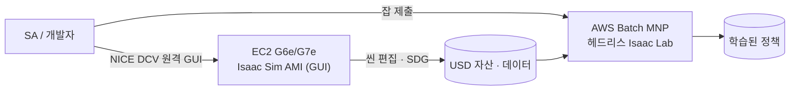
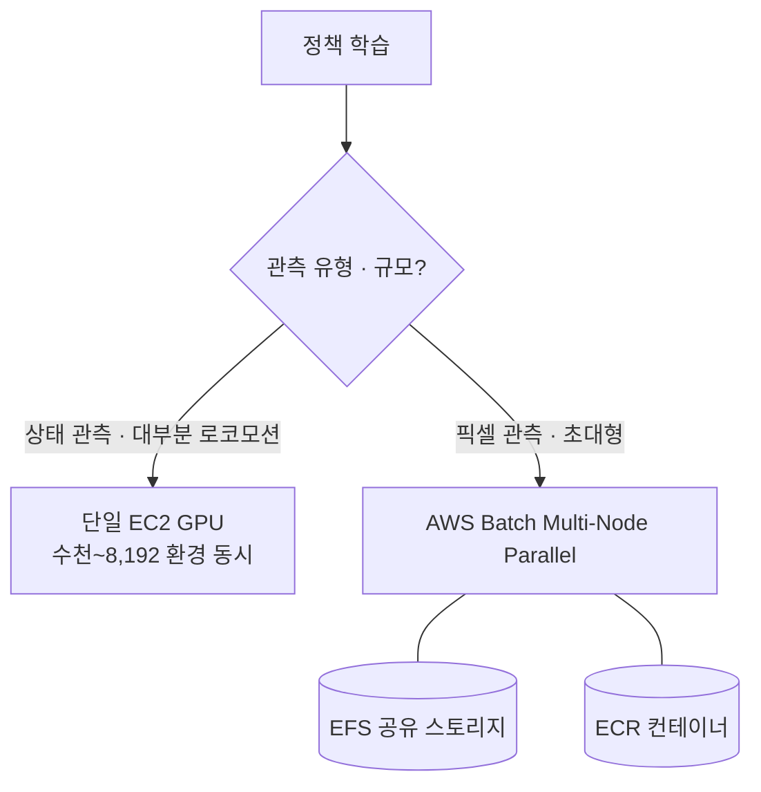
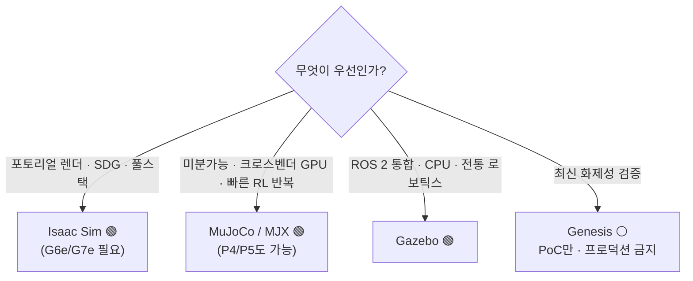

# pillar-3 가독성 파일럿 구현 계획 (Mermaid 3개 + 선별 링크)

> **For agentic workers:** REQUIRED SUB-SKILL: Use superpowers:subagent-driven-development (recommended) or superpowers:executing-plans to implement this plan task-by-task. Steps use checkbox (`- [ ]`) syntax for tracking.

**Goal:** pillar-3(4개 언어)에 Mermaid 다이어그램 3개와 검증된 공식 링크를 추가하고 라이브까지 배포한다 (롤아웃 전 파일럿).

**Architecture:** ① 인프라(mermaid fence + URL 전수 검증 + 용어집 규칙) → ② ko 원본에 다이어그램·링크 삽입 → ③ 번역 3개 동기화(라벨 번역·URL 동일) → ④ 배포·라이브 검증. 기존 ko_hash/strict 게이트 재사용.

**Tech Stack:** pymdownx.superfences custom fence(mermaid), Material 네이티브 mermaid 렌더, 기존 i18n 파이프라인

**Spec:** `specs/2026-07-18-pillar3-visual-links-design.md`

## Global Constraints

- 다이어그램은 **pillar-3에 정확히 3개** (§1/§2/§3), 페이지당 3개 초과 금지
- 링크는 굵은 제품명 **첫 등장**에만, **공식 출처만**, 삽입 전 **전수 curl 검증** — 200 아닌 URL은 대체 또는 제외
- mermaid 라벨은 언어별 번역, **노드 ID·화살표·방향(LR/TD)은 4개 언어 동일**
- 커밋 전 `mkdocs build --strict` exit 0, sync 비동기 0/30
- 커밋 메시지는 한국어 요약 + `Co-Authored-By: Claude Opus 4.8 (1M context) <noreply@anthropic.com>` 푸터

## File Structure

| 파일 | 작업 |
|------|------|
| `mkdocs.yml` | Task 1: superfences custom fence |
| `i18n/glossary.md` | Task 1: mermaid 번역 규칙 1줄 |
| `docs/pillar-3.md` | Task 2: 다이어그램 3 + 링크 |
| `docs/pillar-3.{en,zh,ja}.md` | Task 3: 동기화 |

---

### Task 1: Mermaid 기반 + URL 전수 검증 + 용어집 규칙

**Files:**
- Modify: `mkdocs.yml` (markdown_extensions의 `- pymdownx.superfences` 항목)
- Modify: `i18n/glossary.md` (§3 구조 보존 규칙에 1줄 추가)

**Interfaces:**
- Produces: mermaid 렌더 가능 상태(Task 2가 의존), **검증된 URL 확정표**(report에 기록 — Task 2가 그대로 사용), glossary 규칙(Task 3이 준수)

- [ ] **Step 1: mkdocs.yml superfences 교체**

기존 `markdown_extensions` 목록의 `  - pymdownx.superfences` 한 줄을 다음으로 교체:

```yaml
  - pymdownx.superfences:
      custom_fences:
        - name: mermaid
          class: mermaid
          format: !!python/name:pymdownx.superfences.fence_code_format
```

- [ ] **Step 2: 회귀 확인 (기존 사이트가 안 깨지는지)**

Run: `mkdocs build --strict --site-dir /tmp/claude-1000/-home-ec2-user-pai-playbook/895b2259-bf14-4fbb-b7cb-0275dfdce536/scratchpad/site-mmd`
Expected: exit 0 (기존 ``` 코드 블록·ASCII 다이어그램 전부 정상 — superfences 옵션화가 기본 동작을 해치지 않음)

- [ ] **Step 3: 링크 후보 전수 검증**

```bash
for u in \
  "https://aws.amazon.com/marketplace/pp/prodview-bl35herdyozhw" \
  "https://aws.amazon.com/hpc/dcv/" \
  "https://docs.aws.amazon.com/batch/latest/userguide/multi-node-parallel-jobs.html" \
  "https://github.com/isaac-sim/IsaacLab" \
  "https://github.com/google-deepmind/mujoco" \
  "https://playground.mujoco.org/" \
  "https://github.com/google-deepmind/mujoco_playground" \
  "https://gazebosim.org/" \
  "https://github.com/Genesis-Embodied-AI/Genesis" \
  "https://www.nvidia.com/en-us/ai/cosmos/" \
  "https://developer.nvidia.com/cosmos" \
  "https://aws.amazon.com/iot-twinmaker/" ; do
  printf "%-75s %s\n" "$u" "$(curl -sIL -o /dev/null -w '%{http_code}' "$u")"
done
```
Expected: 각 200. **MuJoCo Playground는 playground.mujoco.org가 200이면 그것을, 아니면 github 폴백**. **Cosmos는 nvidia.com/en-us/ai/cosmos가 200이면 그것을, 아니면 developer.nvidia.com/cosmos 폴백**. 둘 다 실패한 항목은 링크 제외하고 report에 기록. 확정표를 report에 남긴다(Task 2 입력).

- [ ] **Step 4: glossary 규칙 추가**

`i18n/glossary.md` §3의 `- **유지**: 상태 배지(...)` 줄 앞에 삽입:

```markdown
- **mermaid 코드 펜스**: 내부 라벨 텍스트는 번역하되, 노드 ID·화살표·방향 선언(graph LR/TD)·구조는 4개 언어 동일하게 유지.
```

- [ ] **Step 5: 커밋**

```bash
git add mkdocs.yml i18n/glossary.md
git commit -m "infra: Mermaid 다이어그램 렌더 기반 (superfences custom fence) + 용어집 mermaid 번역 규칙"
```

---

### Task 2: pillar-3.md (ko) — 다이어그램 3개 + 링크

**Files:**
- Modify: `docs/pillar-3.md`

**Interfaces:**
- Consumes: Task 1의 mermaid fence, **검증된 URL 확정표**(Task 1 report — 아래 URL 중 폴백 발생 시 report 값을 우선)
- Produces: ko 원본 최종 형태(다이어그램 위치·라벨) — Task 3이 이를 원본으로 번역

- [ ] **Step 1: §1 다이어그램 삽입** — `**AWS 매핑**` 블록의 마지막 불릿(`...aws.amazon.com/blogs/physical-ai/) 존재.` 줄) 다음, `**의사결정 기준**:` 전에 빈 줄과 함께 삽입:

````markdown

````

- [ ] **Step 2: §2 다이어그램 삽입** — §2 `**솔루션 개요**` 두 번째 불릿(`...EFS + ECR 레퍼런스 존재.` 줄) 다음, `<details markdown="1">...벤치마크...` 전에 삽입:

````markdown

````

- [ ] **Step 3: §3 다이어그램 삽입** — §3 `**의사결정 기준**` 목록 마지막 줄(`- Genesis → PoC/실험만, 프로덕션 의존 금지.`) 다음, `**고객 사례**` 전에 삽입:

````markdown

````

- [ ] **Step 4: 링크 8곳 삽입** (정확한 치환 — Task 1 확정표의 폴백 발생 시 URL만 교체):

| # | old (부분) | new |
|---|---|---|
| 1 | `공식 **Isaac Sim Development Workstation AMI**(build` | `공식 **[Isaac Sim Development Workstation AMI](https://aws.amazon.com/marketplace/pp/prodview-bl35herdyozhw)**(build` |
| 2 | `- **접속**: NICE DCV(=Amazon DCV)` | `- **접속**: [NICE DCV](https://aws.amazon.com/hpc/dcv/)(=Amazon DCV)` |
| 3 | `Isaac Lab은 BSD-3.` | `[Isaac Lab](https://github.com/isaac-sim/IsaacLab)은 BSD-3.` |
| 4 | `- **AWS Batch Multi-Node Parallel Jobs**가 AWS 권장` | `- **[AWS Batch Multi-Node Parallel Jobs](https://docs.aws.amazon.com/batch/latest/userguide/multi-node-parallel-jobs.html)**가 AWS 권장` |
| 5 | `- **MuJoCo / MJX** — C 엔진 GA` | `- **[MuJoCo / MJX](https://github.com/google-deepmind/mujoco)** — C 엔진 GA` |
| 6 | `- **Gazebo** — 최신 LTS` | `- **[Gazebo](https://gazebosim.org/)** — 최신 LTS` |
| 7 | `- **Genesis** — Apache 2.0` | `- **[Genesis](https://github.com/Genesis-Embodied-AI/Genesis)** — Apache 2.0` |
| 8 | `**AWS IoT TwinMaker** — GA` (§5 첫 등장) | `**[AWS IoT TwinMaker](https://aws.amazon.com/iot-twinmaker/)** — GA` |

Cosmos 3 링크는 §4 `**솔루션 개요** \`[1]\`: **Cosmos 3**(2026-05-31` → `**솔루션 개요** \`[1]\`: **[Cosmos 3](https://www.nvidia.com/en-us/ai/cosmos/)**(2026-05-31` (Task 1 확정 URL 사용). MuJoCo Playground는 `MuJoCo Playground는 RSS 2025 검증` → `[MuJoCo Playground](<Task 1 확정 URL>)는 RSS 2025 검증`. 총 10곳.

- [ ] **Step 5: 게이트**

```bash
python3 scripts/check_staleness.py --check   # 10행 exit 0
mkdocs build --strict --site-dir /tmp/claude-1000/-home-ec2-user-pai-playbook/895b2259-bf14-4fbb-b7cb-0275dfdce536/scratchpad/site-mmd
grep -c 'class="mermaid"' /tmp/claude-1000/-home-ec2-user-pai-playbook/895b2259-bf14-4fbb-b7cb-0275dfdce536/scratchpad/site-mmd/pillar-3/index.html
```
Expected: strict exit 0, mermaid **3** (pre 태그 형태 `<pre class="mermaid">` 포함 가능 — `mermaid` 클래스 존재 3개면 통과)

- [ ] **Step 6: 커밋**

```bash
git add docs/pillar-3.md
git commit -m "pillar-3: Mermaid 다이어그램 3개 + 공식 링크 10곳 (가독성 파일럿, ko)"
```

---

### Task 3: 번역 3개 동기화 (en/zh/ja)

**Files:**
- Modify: `docs/pillar-3.en.md`, `docs/pillar-3.zh.md`, `docs/pillar-3.ja.md`

**Interfaces:**
- Consumes: Task 2의 ko 최종본(다이어그램 위치·라벨·링크), glossary mermaid 규칙(Task 1)
- Produces: sync 0/30

- [ ] **Step 1: 각 번역에 동일 위치로 다이어그램 3개 + 링크 10곳 반영**

- 다이어그램: 노드 ID(U/WS/D/B/P/S/Q/ONE/MNP/EFS/ECR/I/M/G/X)·방향·구조 유지, **라벨만 번역** (glossary 역어: 시뮬레이션/仿真/シミュレーション 등). 제품명(Isaac Sim, MuJoCo, Gazebo, Genesis, AWS Batch, EFS, ECR)은 번역 금지 용어.
- 링크: URL 동일, 링크 텍스트는 각 언어의 기존 표기 유지 (예: en `- **[MuJoCo / MJX](https://github.com/google-deepmind/mujoco)** — C engine GA`).
- ko_hash: `python3 scripts/check_translation_sync.py --hash docs/pillar-3.md` 값으로 3개 파일 frontmatter 갱신.

- [ ] **Step 2: 게이트**

```bash
python3 scripts/check_translation_sync.py | tail -1    # 비동기: 0 / 30
mkdocs build --strict --site-dir /tmp/claude-1000/-home-ec2-user-pai-playbook/895b2259-bf14-4fbb-b7cb-0275dfdce536/scratchpad/site-mmd
for l in en zh ja; do grep -c 'class="mermaid"' /tmp/claude-1000/-home-ec2-user-pai-playbook/895b2259-bf14-4fbb-b7cb-0275dfdce536/scratchpad/site-mmd/$l/pillar-3/index.html; done
```
Expected: 0/30 · strict exit 0 · 언어당 mermaid 3

- [ ] **Step 3: 커밋**

```bash
git add docs/pillar-3.en.md docs/pillar-3.zh.md docs/pillar-3.ja.md
git commit -m "pillar-3: 다이어그램·링크 en/zh/ja 동기화 (mermaid 라벨 번역, URL 동일)"
```

---

### Task 4: 배포 및 라이브 검증

- [ ] **Step 1: push + CI**

```bash
git push origin main
RID=$(gh run list --limit 1 --json databaseId -q '.[0].databaseId'); gh run watch "$RID" --exit-status
```

- [ ] **Step 2: 라이브 확인**

```bash
for p in "pillar-3" "en/pillar-3" "zh/pillar-3" "ja/pillar-3"; do
  echo -n "/$p mermaid: "; curl -s "https://comeddy.github.io/pai-playbook/$p/" | grep -c 'class="mermaid"'
done
curl -s "https://comeddy.github.io/pai-playbook/pillar-3/" | grep -c "github.com/google-deepmind/mujoco"
```
Expected: 언어당 3 · MuJoCo 링크 ≥1. 사용자에게 라이브 URL 안내 → **스타일 승인 시 나머지 필러 롤아웃(별도 계획)**.

---

## Self-Review 결과

- **스펙 커버리지**: §1 기반→Task 1 Step 1-2, §2 다이어그램 3개(위치·내용)→Task 2 Step 1-3, §3 링크(전수 검증·폴백)→Task 1 Step 3 + Task 2 Step 4, §4 동기화·glossary 규칙→Task 1 Step 4 + Task 3, §5 검증 5종→각 게이트 + Task 4 — 누락 없음.
- **placeholder 스캔**: 통과 (`<Task 1 확정 URL>` 1곳은 Task 1 출력을 입력으로 하는 명시적 계약).
- **일관성**: 노드 ID 목록 Task 2=Task 3 일치, URL 표 Task 1=Task 2 일치, mermaid 기대 수(3) 전 게이트 일치.
